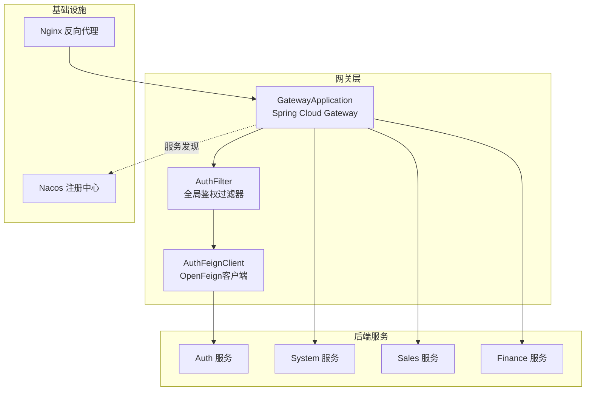
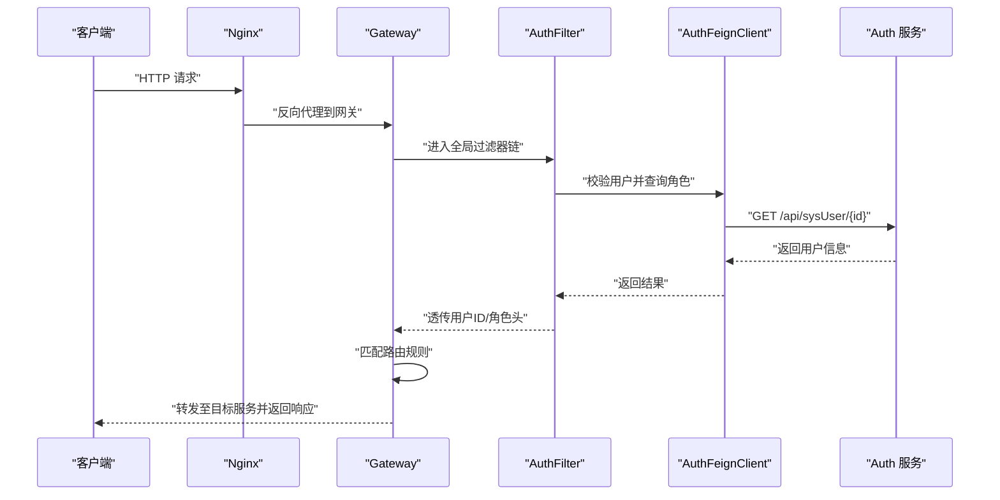
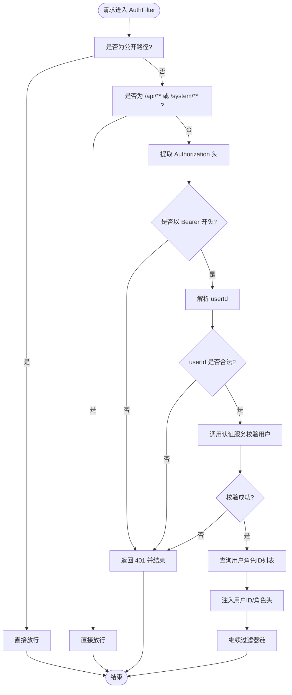
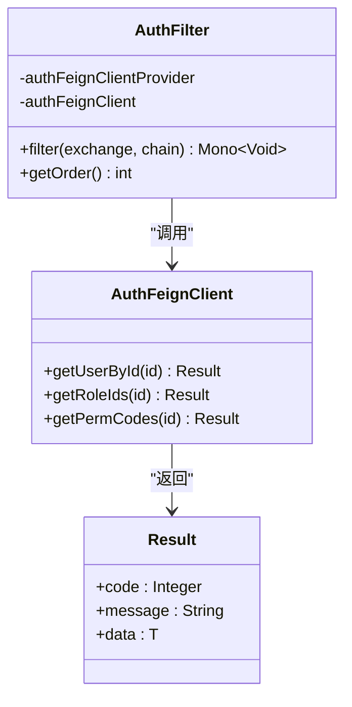
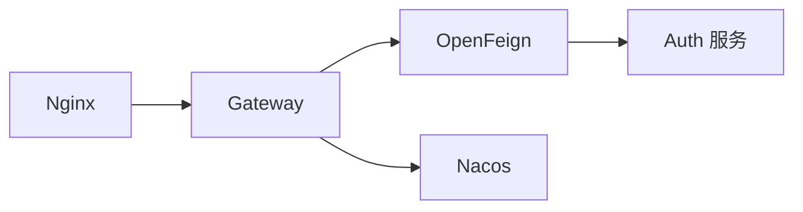

# API网关模块

<cite>
**本文引用的文件**
- [GatewayApplication.java](file://gateway/src/main/java/com/dafuweng/GatewayApplication.java)
- [application.yml](file://gateway/src/main/resources/application.yml)
- [application-docker.yml](file://gateway/src/main/resources/application-docker.yml)
- [AuthFilter.java](file://gateway/src/main/java/com/dafuweng/gateway/filter/AuthFilter.java)
- [AuthFeignClient.java](file://gateway/src/main/java/com/dafuweng/gateway/feign/AuthFeignClient.java)
- [SecurityConfig.java](file://auth/src/main/java/com/dafuweng/auth/config/SecurityConfig.java)
- [JwtAuthenticationFilter.java](file://auth/src/main/java/com/dafuweng/auth/filter/JwtAuthenticationFilter.java)
- [Result.java](file://common/src/main/java/com/dafuweng/common/entity/Result.java)
- [pom.xml](file://gateway/pom.xml)
- [docker-compose.yml](file://docker-compose.yml)
- [nginx.conf](file://nginx.conf)
</cite>

## 目录
1. [简介](#简介)
2. [项目结构](#项目结构)
3. [核心组件](#核心组件)
4. [架构总览](#架构总览)
5. [详细组件分析](#详细组件分析)
6. [依赖分析](#依赖分析)
7. [性能考虑](#性能考虑)
8. [故障排查指南](#故障排查指南)
9. [结论](#结论)
10. [附录](#附录)

## 简介
本技术文档围绕API网关模块进行系统化说明，重点涵盖以下方面：
- 路由转发机制：服务发现、负载均衡与请求路由策略
- 鉴权过滤器：基于OpenFeign的用户校验、角色与权限透传
- OpenFeign客户端集成：服务间调用、容错与错误处理
- 安全配置：CORS跨域、SSL与DDoS防护建议
- 网关配置：路由规则、超时与重试策略
- 性能监控与日志：指标采集与日志记录机制
- 扩展性与高可用：可扩展设计与部署方案

## 项目结构
网关模块采用Spring Cloud Gateway作为核心框架，结合OpenFeign进行服务间调用，并通过Nacos实现服务注册与发现。前端通过Nginx反向代理访问网关。

图表来源
- [GatewayApplication.java:1-15](file://gateway/src/main/java/com/dafuweng/GatewayApplication.java#L1-L15)
- [AuthFilter.java:1-141](file://gateway/src/main/java/com/dafuweng/gateway/filter/AuthFilter.java#L1-L141)
- [AuthFeignClient.java:1-31](file://gateway/src/main/java/com/dafuweng/gateway/feign/AuthFeignClient.java#L1-L31)
- [application.yml:10-50](file://gateway/src/main/resources/application.yml#L10-L50)
- [docker-compose.yml:141-160](file://docker-compose.yml#L141-L160)

章节来源
- [pom.xml:67-76](file://gateway/pom.xml#L67-L76)
- [application.yml:10-50](file://gateway/src/main/resources/application.yml#L10-L50)
- [docker-compose.yml:141-160](file://docker-compose.yml#L141-L160)

## 核心组件
- 入口应用：启用网关与OpenFeign功能，扫描指定包下的组件
- 鉴权过滤器：在请求进入下游服务前进行身份校验与角色/权限透传
- OpenFeign客户端：声明式调用认证服务，获取用户与权限信息
- 路由配置：基于Path的路由规则，支持lb://负载均衡与StripPrefix前缀剥离
- CORS配置：全局跨域策略，允许常见方法与通配符头
- 基础设施：Nacos注册中心、Nginx反向代理

章节来源
- [GatewayApplication.java:8-11](file://gateway/src/main/java/com/dafuweng/GatewayApplication.java#L8-L11)
- [AuthFilter.java:22-141](file://gateway/src/main/java/com/dafuweng/gateway/filter/AuthFilter.java#L22-L141)
- [AuthFeignClient.java:9-30](file://gateway/src/main/java/com/dafuweng/gateway/feign/AuthFeignClient.java#L9-L30)
- [application.yml:17-50](file://gateway/src/main/resources/application.yml#L17-L50)
- [application.yml:136-148](file://gateway/src/main/resources/application.yml#L136-L148)

## 架构总览
下图展示从Nginx到网关再到各后端服务的完整链路，以及鉴权过滤器在请求生命周期中的位置。

图表来源
- [nginx.conf:45-67](file://nginx.conf#L45-L67)
- [AuthFilter.java:55-134](file://gateway/src/main/java/com/dafuweng/gateway/filter/AuthFilter.java#L55-L134)
- [AuthFeignClient.java:16-29](file://gateway/src/main/java/com/dafuweng/gateway/feign/AuthFeignClient.java#L16-L29)
- [application.yml:25-50](file://gateway/src/main/resources/application.yml#L25-L50)

## 详细组件分析

### 路由转发机制
- 服务发现与负载均衡
  - 使用lb://协议配合Nacos实现服务发现与客户端负载均衡
  - 示例：auth-route使用lb://auth，系统会从Nacos拉取实例列表并轮询转发
- 请求路由策略
  - 基于Path断言的路由规则，覆盖认证、销售、财务、系统等模块
  - StripPrefix=1用于去除第一个路径段，便于下游服务统一处理
- 路由配置要点
  - 前端适配路由：对根路径公开接口直接转发至对应服务
  - API前缀路由：/api/*类接口按模块划分到具体服务
  - 全局CORS：允许跨域请求，便于前后端分离开发

章节来源
- [application.yml:17-135](file://gateway/src/main/resources/application.yml#L17-L135)
- [application.yml:136-148](file://gateway/src/main/resources/application.yml#L136-L148)
- [docker-compose.yml:101-139](file://docker-compose.yml#L101-L139)

### 鉴权过滤器实现原理
- 过滤器职责
  - 白名单跳过：对公开接口与部分系统路径直接放行
  - Token校验：从Authorization头提取Bearer Token并解析为userId
  - 用户校验：通过OpenFeign调用认证服务校验用户存在且有效
  - 角色/权限透传：查询用户角色ID列表，注入下游请求头
- 与认证服务的协作
  - 认证服务侧同样具备基于JWT的过滤器，但当前网关阶段采用“token=userId”的简化设计
  - 网关侧仅需确保用户存在即可，权限控制由下游服务完成

图表来源
- [AuthFilter.java:55-134](file://gateway/src/main/java/com/dafuweng/gateway/filter/AuthFilter.java#L55-L134)

章节来源
- [AuthFilter.java:44-78](file://gateway/src/main/java/com/dafuweng/gateway/filter/AuthFilter.java#L44-L78)
- [AuthFilter.java:80-107](file://gateway/src/main/java/com/dafuweng/gateway/filter/AuthFilter.java#L80-L107)
- [AuthFilter.java:109-133](file://gateway/src/main/java/com/dafuweng/gateway/filter/AuthFilter.java#L109-L133)

### OpenFeign客户端集成
- 客户端定义
  - 通过@FeignClient声明远程接口，包括用户查询、角色ID与权限码查询
- 调用策略
  - 网关侧优先使用ObjectProvider获取实例，异常回退到@Lazy懒加载实例
  - 返回值统一使用Result封装，便于判断状态码与数据
- 错误处理
  - 认证服务不可达时返回503，避免阻塞正常流量
  - 用户不存在或校验失败返回401，拒绝非法请求

图表来源
- [AuthFeignClient.java:9-30](file://gateway/src/main/java/com/dafuweng/gateway/feign/AuthFeignClient.java#L9-L30)
- [AuthFilter.java:25-42](file://gateway/src/main/java/com/dafuweng/gateway/filter/AuthFilter.java#L25-L42)
- [Result.java:6-49](file://common/src/main/java/com/dafuweng/common/entity/Result.java#L6-L49)

章节来源
- [AuthFeignClient.java:9-30](file://gateway/src/main/java/com/dafuweng/gateway/feign/AuthFeignClient.java#L9-L30)
- [AuthFilter.java:36-42](file://gateway/src/main/java/com/dafuweng/gateway/filter/AuthFilter.java#L36-L42)
- [Result.java:11-32](file://common/src/main/java/com/dafuweng/common/entity/Result.java#L11-L32)

### 安全配置
- CORS跨域处理
  - 全局允许所有源、方法与头，支持OPTIONS预检，最大缓存时间1小时
- SSL证书配置
  - Nginx已映射到80端口；如需HTTPS，可在Nginx中添加证书与443端口监听
- DDoS防护
  - 建议在Nginx层限制连接数、请求速率与单IP并发连接数
  - 结合防火墙与WAF进一步加固

章节来源
- [application.yml:136-148](file://gateway/src/main/resources/application.yml#L136-L148)
- [nginx.conf:1-76](file://nginx.conf#L1-L76)

### 网关配置说明
- 路由规则
  - 认证模块：/auth/** 与根路径公开接口直连认证服务
  - 销售模块：/sales/** 与 /api/customer/** 等细分路由映射到销售服务
  - 财务模块：/finance/** 与 /api/loanAudit/** 等路由映射到财务服务
  - 系统模块：/system/** 与 /api/sysDepartment/** 等路由映射到系统服务
- 超时设置
  - Nginx代理层设置连接、发送与读取超时均为60秒
- 重试策略
  - 默认未配置重试；如需可结合Spring Cloud Gateway的Retry或Resilience4j实现

章节来源
- [application.yml:17-135](file://gateway/src/main/resources/application.yml#L17-L135)
- [nginx.conf:52-66](file://nginx.conf#L52-L66)

### 性能监控与日志
- 日志级别
  - 网关模块将com.dafuweng包的日志级别设为DEBUG，便于问题定位
- 监控指标
  - 建议接入Spring Boot Actuator与Micrometer，收集请求量、延迟、错误率等指标
  - 结合Prometheus与Grafana进行可视化监控

章节来源
- [application.yml:162-165](file://gateway/src/main/resources/application.yml#L162-L165)

## 依赖分析
- 组件耦合
  - 网关对认证服务的依赖通过OpenFeign实现，耦合度低，便于独立演进
  - 路由配置集中管理，变更影响面清晰
- 外部依赖
  - Spring Cloud Gateway、OpenFeign、Nacos、Nginx
- 潜在风险
  - 认证服务不可用时，网关将返回503；需完善熔断与降级策略

图表来源
- [pom.xml:67-76](file://gateway/pom.xml#L67-L76)
- [AuthFeignClient.java:9-30](file://gateway/src/main/java/com/dafuweng/gateway/feign/AuthFeignClient.java#L9-L30)
- [docker-compose.yml:141-160](file://docker-compose.yml#L141-L160)

章节来源
- [pom.xml:25-44](file://gateway/pom.xml#L25-L44)
- [docker-compose.yml:4-26](file://docker-compose.yml#L4-L26)

## 性能考虑
- 路由匹配复杂度
  - 基于Path的断言匹配为O(n)，n为路由条目数量；建议合并相似路径减少路由数量
- 过滤器链开销
  - 鉴权过滤器仅对非公开路径生效，避免对静态资源与公开接口造成额外负担
- 负载均衡策略
  - 使用Nacos客户端负载均衡，默认轮询；可根据业务调整策略
- 超时与重试
  - Nginx代理层已设置超时；网关层可引入重试与熔断，提升可用性

## 故障排查指南
- 401 Unauthorized
  - 检查Authorization头是否以Bearer开头，Token是否为合法数字
  - 确认认证服务返回的用户信息是否有效
- 503 Service Unavailable
  - 认证服务不可达或超时；检查服务健康状态与网络连通性
- CORS跨域失败
  - 确认浏览器是否携带预检请求，核对allowedHeaders与allowedMethods配置
- 路由不生效
  - 检查Path断言是否匹配，StripPrefix是否正确

章节来源
- [AuthFilter.java:80-107](file://gateway/src/main/java/com/dafuweng/gateway/filter/AuthFilter.java#L80-L107)
- [application.yml:136-148](file://gateway/src/main/resources/application.yml#L136-L148)

## 结论
本网关模块以Spring Cloud Gateway为核心，结合OpenFeign与Nacos实现了灵活的路由转发与鉴权能力。通过全局CORS与Nginx代理，满足前后端分离场景下的跨域与反向代理需求。建议后续增强熔断降级、指标监控与安全加固，以支撑更高并发与更严苛的生产环境。

## 附录
- 部署与运行
  - 使用docker-compose一键启动：Nacos、MySQL、Redis、各微服务与Nginx
  - 网关默认端口8086，Nginx对外暴露80端口
- 扩展性设计
  - 新增路由：在application.yml中追加Path断言与目标URI
  - 新增过滤器：实现GlobalFilter接口并设置order，插入过滤器链
  - 新增服务：在Nacos注册新服务，网关自动发现并参与负载均衡

章节来源
- [docker-compose.yml:141-160](file://docker-compose.yml#L141-L160)
- [application.yml:17-135](file://gateway/src/main/resources/application.yml#L17-L135)