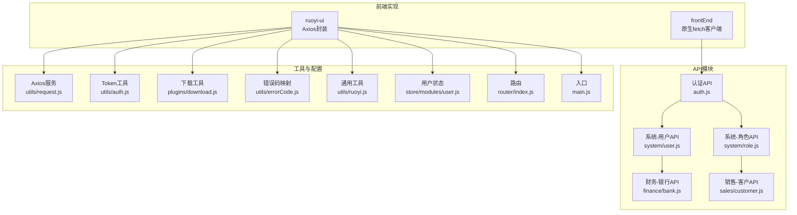
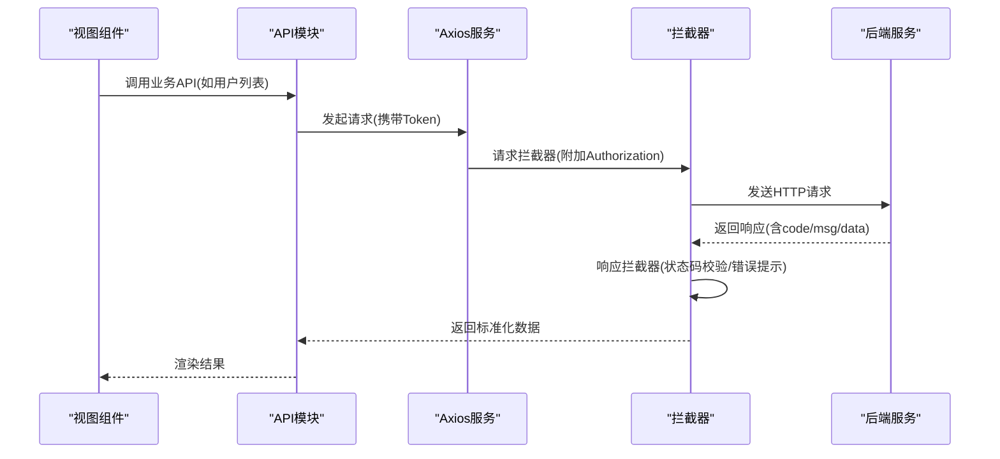
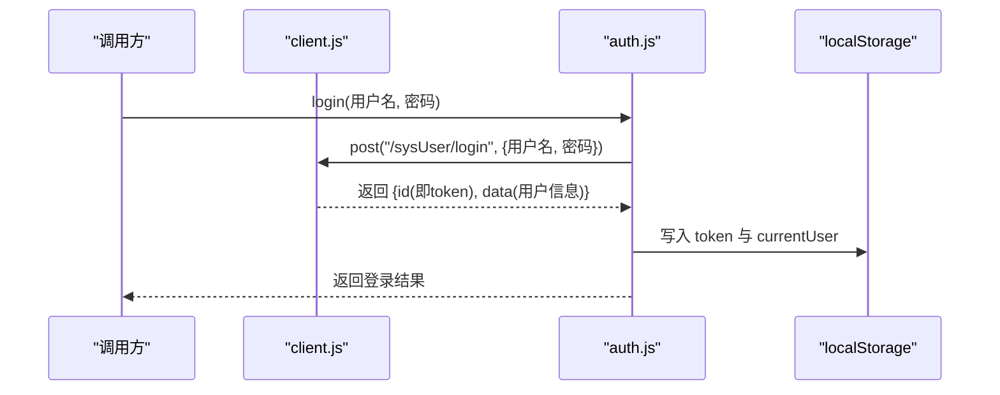
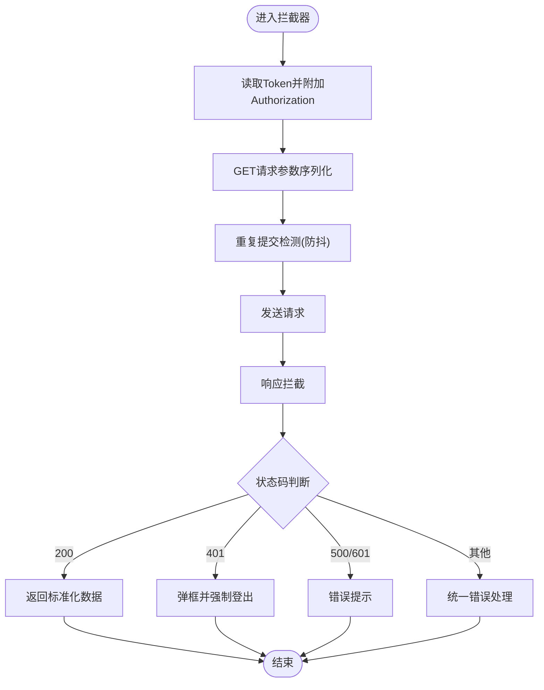
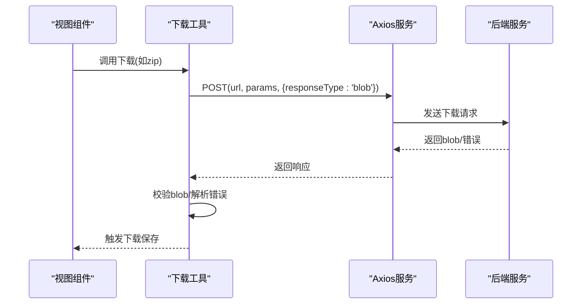
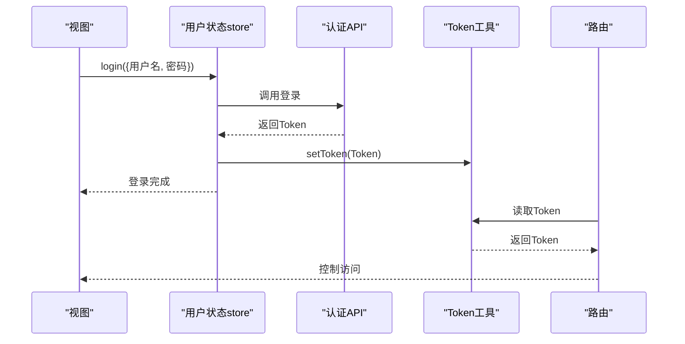
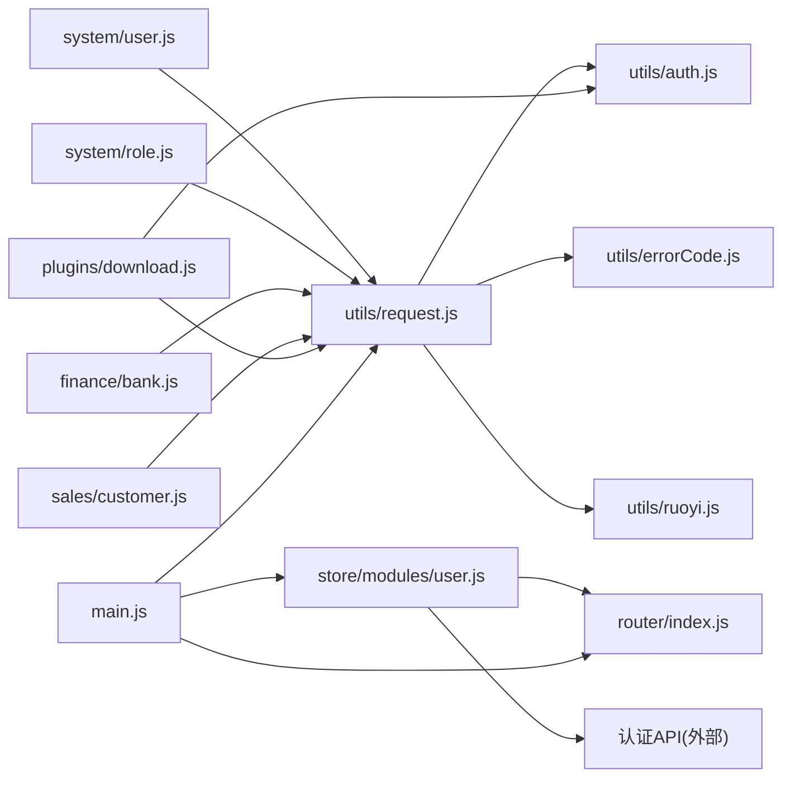

# API接口集成

<cite>
**本文引用的文件**
- [client.js](file://frontEnd/src/api/client.js)
- [auth.js](file://frontEnd/src/api/auth.js)
- [request.js](file://ruoyi-ui/src/utils/request.js)
- [auth.js](file://ruoyi-ui/src/utils/auth.js)
- [download.js](file://ruoyi-ui/src/plugins/download.js)
- [errorCode.js](file://ruoyi-ui/src/utils/errorCode.js)
- [ruoyi.js](file://ruoyi-ui/src/utils/ruoyi.js)
- [user.js](file://ruoyi-ui/src/store/modules/user.js)
- [router.js](file://ruoyi-ui/src/router/index.js)
- [main.js](file://ruoyi-ui/src/main.js)
- [user.js](file://ruoyi-ui/src/api/system/user.js)
- [role.js](file://ruoyi-ui/src/api/system/role.js)
- [bank.js](file://ruoyi-ui/src/api/finance/bank.js)
- [customer.js](file://ruoyi-ui/src/api/sales/customer.js)
</cite>

## 目录
1. [简介](#简介)
2. [项目结构](#项目结构)
3. [核心组件](#核心组件)
4. [架构总览](#架构总览)
5. [详细组件分析](#详细组件分析)
6. [依赖关系分析](#依赖关系分析)
7. [性能考虑](#性能考虑)
8. [故障排查指南](#故障排查指南)
9. [结论](#结论)
10. [附录](#附录)

## 简介
本技术文档聚焦于前端API接口集成与使用，涵盖以下方面：
- RESTful API调用方式与参数处理
- Axios封装与配置（请求/响应拦截器、错误处理）
- 认证机制（Token管理、登录状态检查）
- 文件上传与下载（进度监控、错误重试）
- 最佳实践与调试技巧

文档同时给出架构图、序列图与流程图，帮助快速理解与落地实施。

## 项目结构
本项目包含两套前端实现：
- frontEnd：基于原生fetch的轻量HTTP客户端与认证模块
- ruoyi-ui：基于Axios的完整封装，包含拦截器、下载工具、鉴权与状态管理

图表来源
- [client.js:1-59](file://frontEnd/src/api/client.js#L1-L59)
- [auth.js:1-33](file://frontEnd/src/api/auth.js#L1-L33)
- [request.js:1-154](file://ruoyi-ui/src/utils/request.js#L1-L154)
- [auth.js:1-16](file://ruoyi-ui/src/utils/auth.js#L1-L16)
- [download.js:1-80](file://ruoyi-ui/src/plugins/download.js#L1-L80)
- [errorCode.js:1-7](file://ruoyi-ui/src/utils/errorCode.js#L1-L7)
- [ruoyi.js:1-229](file://ruoyi-ui/src/utils/ruoyi.js#L1-L229)
- [user.js:1-93](file://ruoyi-ui/src/store/modules/user.js#L1-L93)
- [router.js:1-68](file://ruoyi-ui/src/router/index.js#L1-L68)
- [main.js:1-84](file://ruoyi-ui/src/main.js#L1-L84)
- [user.js:1-47](file://ruoyi-ui/src/api/system/user.js#L1-L47)
- [role.js:1-42](file://ruoyi-ui/src/api/system/role.js#L1-L42)
- [bank.js:1-54](file://ruoyi-ui/src/api/finance/bank.js#L1-L54)
- [customer.js:1-53](file://ruoyi-ui/src/api/sales/customer.js#L1-L53)

章节来源
- [client.js:1-59](file://frontEnd/src/api/client.js#L1-L59)
- [auth.js:1-33](file://frontEnd/src/api/auth.js#L1-L33)
- [request.js:1-154](file://ruoyi-ui/src/utils/request.js#L1-L154)
- [auth.js:1-16](file://ruoyi-ui/src/utils/auth.js#L1-L16)
- [download.js:1-80](file://ruoyi-ui/src/plugins/download.js#L1-L80)
- [errorCode.js:1-7](file://ruoyi-ui/src/utils/errorCode.js#L1-L7)
- [ruoyi.js:1-229](file://ruoyi-ui/src/utils/ruoyi.js#L1-L229)
- [user.js:1-93](file://ruoyi-ui/src/store/modules/user.js#L1-L93)
- [router.js:1-68](file://ruoyi-ui/src/router/index.js#L1-L68)
- [main.js:1-84](file://ruoyi-ui/src/main.js#L1-L84)
- [user.js:1-47](file://ruoyi-ui/src/api/system/user.js#L1-L47)
- [role.js:1-42](file://ruoyi-ui/src/api/system/role.js#L1-L42)
- [bank.js:1-54](file://ruoyi-ui/src/api/finance/bank.js#L1-L54)
- [customer.js:1-53](file://ruoyi-ui/src/api/sales/customer.js#L1-L53)

## 核心组件
- 原生fetch客户端：统一请求入口，自动注入Authorization头，处理403与业务错误码
- Axios封装：请求/响应拦截器、重复提交防护、下载工具、错误提示
- 认证模块：登录、登出、当前用户信息、权限码获取
- 下载工具：通用下载方法，支持Blob校验与错误提示
- 通用工具：参数序列化、Blob校验、日期格式化等
- 用户状态管理：Token读取、登录信息获取、登出清理

章节来源
- [client.js:1-59](file://frontEnd/src/api/client.js#L1-L59)
- [auth.js:1-33](file://frontEnd/src/api/auth.js#L1-L33)
- [request.js:1-154](file://ruoyi-ui/src/utils/request.js#L1-L154)
- [auth.js:1-16](file://ruoyi-ui/src/utils/auth.js#L1-L16)
- [download.js:1-80](file://ruoyi-ui/src/plugins/download.js#L1-L80)
- [ruoyi.js:1-229](file://ruoyi-ui/src/utils/ruoyi.js#L1-L229)
- [user.js:1-93](file://ruoyi-ui/src/store/modules/user.js#L1-L93)

## 架构总览
前端通过API模块调用后端接口，Axios封装负责统一拦截与错误处理；认证模块负责Token生命周期管理；下载工具提供文件下载能力。

图表来源
- [user.js:1-47](file://ruoyi-ui/src/api/system/user.js#L1-L47)
- [request.js:1-154](file://ruoyi-ui/src/utils/request.js#L1-L154)

## 详细组件分析

### 原生fetch客户端与认证
- 统一请求入口：自动从localStorage读取token并注入Authorization头
- 错误处理：403跳转登录页；业务错误码非200抛出异常
- 认证API：登录写入token与用户信息；登出清理；获取当前用户与权限码

图表来源
- [client.js:1-59](file://frontEnd/src/api/client.js#L1-L59)
- [auth.js:1-33](file://frontEnd/src/api/auth.js#L1-L33)

章节来源
- [client.js:1-59](file://frontEnd/src/api/client.js#L1-L59)
- [auth.js:1-33](file://frontEnd/src/api/auth.js#L1-L33)

### Axios封装与拦截器
- 基础配置：baseURL来自环境变量，超时10秒
- 请求拦截器：自动附加Authorization；GET参数序列化；重复提交防护
- 响应拦截器：二进制数据直接返回；401弹框并强制登出；500/601错误提示；其他错误统一提示
- 下载工具：支持通用下载、资源下载、ZIP打包下载，带加载提示与错误处理

图表来源
- [request.js:1-154](file://ruoyi-ui/src/utils/request.js#L1-L154)
- [errorCode.js:1-7](file://ruoyi-ui/src/utils/errorCode.js#L1-L7)

章节来源
- [request.js:1-154](file://ruoyi-ui/src/utils/request.js#L1-L154)
- [errorCode.js:1-7](file://ruoyi-ui/src/utils/errorCode.js#L1-L7)

### 文件下载处理
- 通用下载：POST请求，表单编码，响应类型为blob，校验后保存
- 资源下载：按名称或资源路径下载，自动解析下载文件名
- ZIP打包下载：指定URL与文件名，设置blob类型
- 错误处理：非blob时解析错误消息并提示

图表来源
- [download.js:1-80](file://ruoyi-ui/src/plugins/download.js#L1-L80)
- [request.js:126-151](file://ruoyi-ui/src/utils/request.js#L126-L151)

章节来源
- [download.js:1-80](file://ruoyi-ui/src/plugins/download.js#L1-L80)
- [request.js:126-151](file://ruoyi-ui/src/utils/request.js#L126-L151)

### 认证机制与登录状态检查
- Token存储：Cookie键值对管理
- 登录流程：调用登录API，成功后写入Token与用户信息
- 登出流程：清理本地状态，尝试调用后端登出接口
- 登录状态检查：在路由守卫与权限指令中读取Token与用户信息

图表来源
- [user.js:1-93](file://ruoyi-ui/src/store/modules/user.js#L1-L93)
- [auth.js:1-16](file://ruoyi-ui/src/utils/auth.js#L1-L16)
- [router.js:1-68](file://ruoyi-ui/src/router/index.js#L1-L68)

章节来源
- [user.js:1-93](file://ruoyi-ui/src/store/modules/user.js#L1-L93)
- [auth.js:1-16](file://ruoyi-ui/src/utils/auth.js#L1-L16)
- [router.js:1-68](file://ruoyi-ui/src/router/index.js#L1-L68)

### API模块与调用规范
- 系统-用户：分页、详情、新增、修改、删除、角色分配、密码修改、解锁
- 系统-角色：分页、详情、新增、修改、删除、权限分配
- 财务-银行：分页、详情、按状态查询、新增、修改、删除
- 销售-客户：分页、详情、按销售代表查询、新增、修改、删除

章节来源
- [user.js:1-47](file://ruoyi-ui/src/api/system/user.js#L1-L47)
- [role.js:1-42](file://ruoyi-ui/src/api/system/role.js#L1-L42)
- [bank.js:1-54](file://ruoyi-ui/src/api/finance/bank.js#L1-L54)
- [customer.js:1-53](file://ruoyi-ui/src/api/sales/customer.js#L1-L53)

## 依赖关系分析
- API模块依赖Axios服务与Token工具
- 下载工具依赖Axios与文件保存库
- 用户状态管理依赖认证API与路由
- 主入口注册全局方法与组件，挂载插件与指令

图表来源
- [user.js:1-47](file://ruoyi-ui/src/api/system/user.js#L1-L47)
- [role.js:1-42](file://ruoyi-ui/src/api/system/role.js#L1-L42)
- [bank.js:1-54](file://ruoyi-ui/src/api/finance/bank.js#L1-L54)
- [customer.js:1-53](file://ruoyi-ui/src/api/sales/customer.js#L1-L53)
- [request.js:1-154](file://ruoyi-ui/src/utils/request.js#L1-L154)
- [auth.js:1-16](file://ruoyi-ui/src/utils/auth.js#L1-L16)
- [errorCode.js:1-7](file://ruoyi-ui/src/utils/errorCode.js#L1-L7)
- [ruoyi.js:1-229](file://ruoyi-ui/src/utils/ruoyi.js#L1-L229)
- [download.js:1-80](file://ruoyi-ui/src/plugins/download.js#L1-L80)
- [user.js:1-93](file://ruoyi-ui/src/store/modules/user.js#L1-L93)
- [router.js:1-68](file://ruoyi-ui/src/router/index.js#L1-L68)
- [main.js:1-84](file://ruoyi-ui/src/main.js#L1-L84)

章节来源
- [main.js:1-84](file://ruoyi-ui/src/main.js#L1-L84)

## 性能考虑
- 请求去重：Axios请求拦截器内置重复提交防护，避免高频操作导致的重复请求
- 参数序列化：GET请求参数统一序列化，减少无效参数带来的服务器压力
- 超时控制：Axios默认超时10秒，建议根据接口特性调整
- 二进制处理：响应拦截器对blob类型直接返回，避免额外解析开销
- 下载优化：下载前显示加载提示，完成后关闭，提升用户体验

## 故障排查指南
- 401/403错误：Axios响应拦截器会弹窗提示并强制登出；检查Token是否过期或无效
- 500/601错误：统一错误提示，查看后端返回的错误码与消息
- 网络错误：捕获网络异常与超时，提示后端接口连接异常或请求超时
- 下载失败：确认响应类型为blob，否则解析错误消息并提示
- 重复提交：若短时间内重复触发相同请求，拦截器会阻止并提示“数据正在处理，请勿重复提交”

章节来源
- [request.js:75-124](file://ruoyi-ui/src/utils/request.js#L75-L124)
- [errorCode.js:1-7](file://ruoyi-ui/src/utils/errorCode.js#L1-L7)
- [download.js:126-151](file://ruoyi-ui/src/plugins/download.js#L126-L151)

## 结论
本项目提供了两套API集成方案：轻量的原生fetch客户端与完整的Axios封装。前者适合简单场景，后者具备完善的拦截器、错误处理与下载能力。结合认证模块与状态管理，可满足大多数企业级前端API集成需求。建议在生产环境中优先采用Axios封装方案，并根据业务特性进一步扩展拦截器与错误处理策略。

## 附录
- 环境变量：baseURL来自环境变量，确保前后端联调一致
- 全局方法：主入口将下载、工具方法挂载至全局，便于组件内直接使用
- 路由与权限：路由配置包含登录与404/401页面，配合权限指令与状态管理实现访问控制

章节来源
- [main.js:1-84](file://ruoyi-ui/src/main.js#L1-L84)
- [router.js:1-68](file://ruoyi-ui/src/router/index.js#L1-L68)
- [ruoyi.js:187-229](file://ruoyi-ui/src/utils/ruoyi.js#L187-L229)