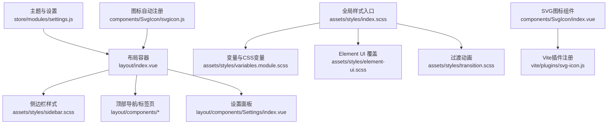
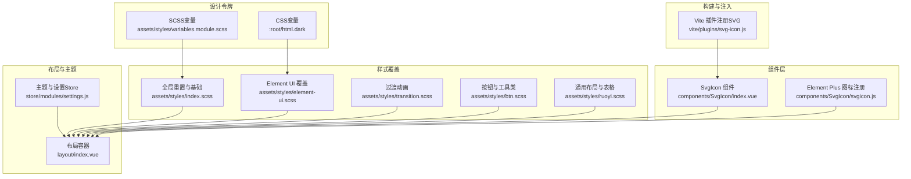
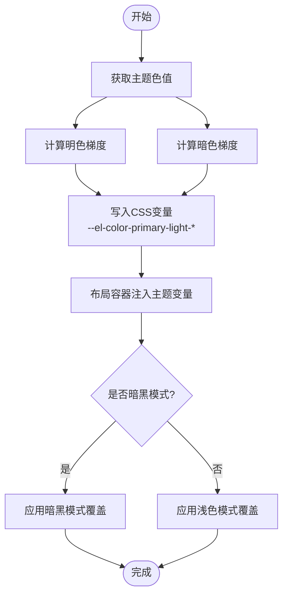
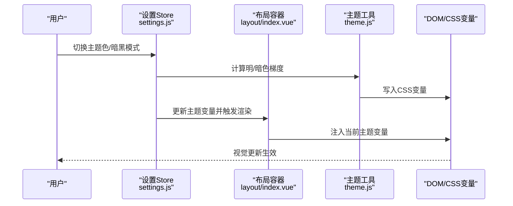
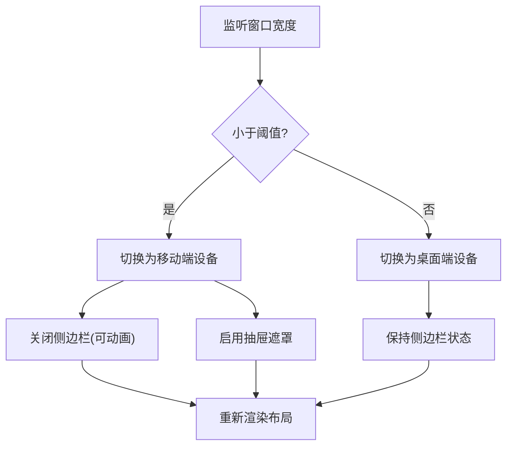
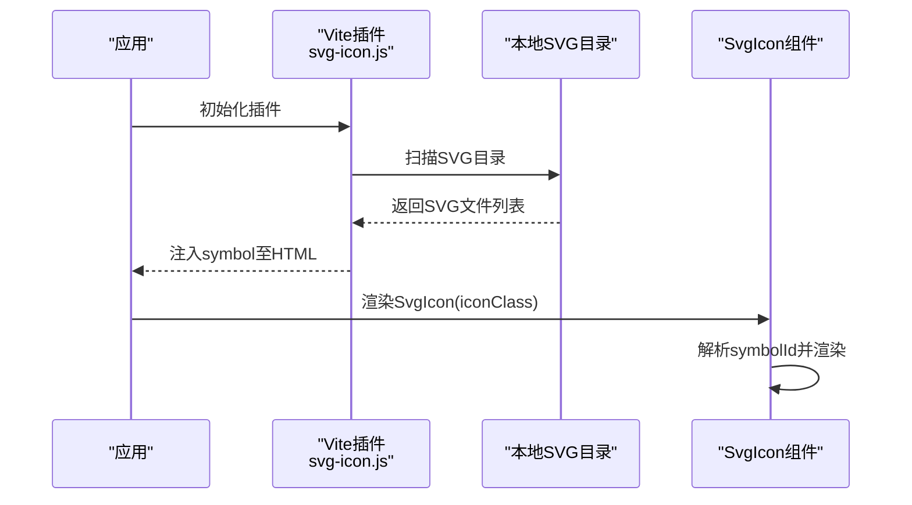
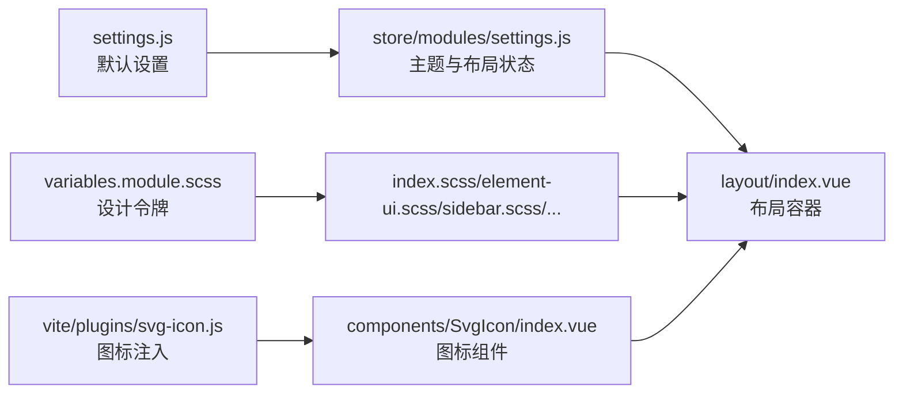

# UI设计系统

<cite>
**本文引用的文件**
- [variables.module.scss](file://ruoyi-ui/src/assets/styles/variables.module.scss)
- [index.scss](file://ruoyi-ui/src/assets/styles/index.scss)
- [element-ui.scss](file://ruoyi-ui/src/assets/styles/element-ui.scss)
- [mixin.scss](file://ruoyi-ui/src/assets/styles/mixin.scss)
- [sidebar.scss](file://ruoyi-ui/src/assets/styles/sidebar.scss)
- [transition.scss](file://ruoyi-ui/src/assets/styles/transition.scss)
- [btn.scss](file://ruoyi-ui/src/assets/styles/btn.scss)
- [ruoyi.scss](file://ruoyi-ui/src/assets/styles/ruoyi.scss)
- [settings.js](file://ruoyi-ui/src/settings.js)
- [theme.js](file://ruoyi-ui/src/utils/theme.js)
- [index.vue](file://ruoyi-ui/src/layout/index.vue)
- [index.vue](file://ruoyi-ui/src/components/SvgIcon/index.vue)
- [svgicon.js](file://ruoyi-ui/src/components/SvgIcon/svgicon.js)
- [svg-icon.js](file://ruoyi-ui/vite/plugins/svg-icon.js)
- [settings.js](file://ruoyi-ui/src/store/modules/settings.js)
</cite>

## 目录
1. [引言](#引言)
2. [项目结构](#项目结构)
3. [核心组件](#核心组件)
4. [架构总览](#架构总览)
5. [详细组件分析](#详细组件分析)
6. [依赖关系分析](#依赖关系分析)
7. [性能考量](#性能考量)
8. [故障排查指南](#故障排查指南)
9. [结论](#结论)
10. [附录](#附录)

## 引言
本技术文档面向UI设计系统，聚焦于视觉设计规范与前端实现，涵盖颜色系统、字体规范、间距标准、阴影效果；Element Plus 组件的定制与扩展（主题配置、样式覆盖、组件封装）；响应式设计（断点与适配策略、移动端优化）；SVG 图标系统（注册、动态加载、图标库管理）；以及可访问性与用户体验优化建议。文档以仓库中实际文件为依据，提供可视化图示与定位来源，帮助开发者与设计师协作落地一致的视觉与交互体验。

## 项目结构
UI设计系统主要位于 ruoyi-ui 前端工程中，采用按功能域与样式模块化的组织方式：
- 样式层：统一在 assets/styles 下维护基础样式、变量、混入、组件覆盖与过渡动画
- 布局层：layout/index.vue 作为根容器，集成侧边栏、顶部导航、标签页、设置面板等
- 主题与设置：settings.js 定义默认布局行为，store/modules/settings.js 管理主题与布局状态
- 图标系统：components/SvgIcon 提供 SVG 组件，vite 插件负责图标符号注入

图表来源
- [index.vue:1-116](file://ruoyi-ui/src/layout/index.vue#L1-L116)
- [sidebar.scss:1-331](file://ruoyi-ui/src/assets/styles/sidebar.scss#L1-L331)
- [index.scss:1-180](file://ruoyi-ui/src/assets/styles/index.scss#L1-L180)
- [variables.module.scss:1-336](file://ruoyi-ui/src/assets/styles/variables.module.scss#L1-L336)
- [element-ui.scss:1-96](file://ruoyi-ui/src/assets/styles/element-ui.scss#L1-L96)
- [transition.scss:1-81](file://ruoyi-ui/src/assets/styles/transition.scss#L1-L81)
- [index.vue:1-54](file://ruoyi-ui/src/components/SvgIcon/index.vue#L1-L54)
- [svg-icon.js:1-11](file://ruoyi-ui/vite/plugins/svg-icon.js#L1-L11)
- [svgicon.js:1-11](file://ruoyi-ui/src/components/SvgIcon/svgicon.js#L1-L11)
- [settings.js:1-54](file://ruoyi-ui/src/store/modules/settings.js#L1-L54)

章节来源
- [index.scss:1-180](file://ruoyi-ui/src/assets/styles/index.scss#L1-L180)
- [settings.js:1-68](file://ruoyi-ui/src/settings.js#L1-L68)

## 核心组件
- 视觉变量与主题
  - 颜色系统：包含品牌主色、语义色、菜单与侧边栏配色，并导出CSS变量与SCSS变量，支持暗黑模式覆盖
  - 字体规范：全局 body 使用系统默认字体栈，保证跨平台一致性
  - 间距标准：通过 SCSS 混入与工具类提供统一的内外边距体系
  - 阴影效果：侧边栏与分割面板等组件使用盒阴影，配合暗黑模式变量统一风格
- Element Plus 组件定制
  - 覆盖默认样式：面包屑、上传、对话框、下拉菜单、日期选择器等
  - 主题色动态替换：通过 CSS 变量与工具函数动态生成主色明暗梯度
- 响应式设计
  - 断点策略：以桌面端宽度阈值控制移动端/桌面端布局切换
  - 适配策略：侧边栏折叠、标签页样式、移动端抽屉遮罩
- SVG 图标系统
  - 组件封装：统一的 SvgIcon 组件，支持类名与颜色传参
  - 动态加载：Vite 插件批量导入本地 SVG 为 symbol 并注入
  - 自动注册：Element Plus 图标自动注册到应用实例

章节来源
- [variables.module.scss:1-336](file://ruoyi-ui/src/assets/styles/variables.module.scss#L1-L336)
- [element-ui.scss:1-96](file://ruoyi-ui/src/assets/styles/element-ui.scss#L1-L96)
- [theme.js:1-50](file://ruoyi-ui/src/utils/theme.js#L1-L50)
- [index.vue:38-53](file://ruoyi-ui/src/layout/index.vue#L38-L53)
- [index.vue:1-54](file://ruoyi-ui/src/components/SvgIcon/index.vue#L1-L54)
- [svg-icon.js:1-11](file://ruoyi-ui/vite/plugins/svg-icon.js#L1-L11)
- [svgicon.js:1-11](file://ruoyi-ui/src/components/SvgIcon/svgicon.js#L1-L11)

## 架构总览
UI 设计系统围绕“变量—覆盖—组件—布局—主题”的层次展开，形成从底层设计令牌到上层交互组件的完整链路。

图表来源
- [variables.module.scss:1-336](file://ruoyi-ui/src/assets/styles/variables.module.scss#L1-L336)
- [index.scss:1-180](file://ruoyi-ui/src/assets/styles/index.scss#L1-L180)
- [element-ui.scss:1-96](file://ruoyi-ui/src/assets/styles/element-ui.scss#L1-L96)
- [transition.scss:1-81](file://ruoyi-ui/src/assets/styles/transition.scss#L1-L81)
- [btn.scss:1-100](file://ruoyi-ui/src/assets/styles/btn.scss#L1-L100)
- [ruoyi.scss:1-495](file://ruoyi-ui/src/assets/styles/ruoyi.scss#L1-L495)
- [index.vue:1-54](file://ruoyi-ui/src/components/SvgIcon/index.vue#L1-L54)
- [svgicon.js:1-11](file://ruoyi-ui/src/components/SvgIcon/svgicon.js#L1-L11)
- [svg-icon.js:1-11](file://ruoyi-ui/vite/plugins/svg-icon.js#L1-L11)
- [index.vue:1-116](file://ruoyi-ui/src/layout/index.vue#L1-L116)
- [settings.js:1-54](file://ruoyi-ui/src/store/modules/settings.js#L1-L54)

## 详细组件分析

### 颜色系统与主题配置
- 设计令牌
  - 品牌与语义色：定义主色、成功、警告、危险、信息等
  - 菜单与侧边栏配色：区分深色与浅色主题，支持 hover、active 状态
  - CSS 变量：在 :root 与 html.dark 中导出，用于组件覆盖与暗黑模式
- 主题动态替换
  - 工具函数根据十六进制色值计算明/暗梯度，写入 CSS 变量
  - 布局容器通过内联样式注入当前主题色，供菜单与标签页使用
- 暗黑模式覆盖
  - 对 Element Plus 组件进行背景、文字、边框、阴影等变量级覆盖
  - 侧边栏、顶部导航、标签页、表格、树等组件均提供暗黑模式样式

图表来源
- [theme.js:1-50](file://ruoyi-ui/src/utils/theme.js#L1-L50)
- [index.vue:1-14](file://ruoyi-ui/src/layout/index.vue#L1-L14)
- [variables.module.scss:83-334](file://ruoyi-ui/src/assets/styles/variables.module.scss#L83-L334)

章节来源
- [variables.module.scss:1-336](file://ruoyi-ui/src/assets/styles/variables.module.scss#L1-L336)
- [theme.js:1-50](file://ruoyi-ui/src/utils/theme.js#L1-L50)
- [index.vue:1-14](file://ruoyi-ui/src/layout/index.vue#L1-L14)

### Element Plus 组件定制与扩展
- 样式覆盖要点
  - 面包屑、上传拖拽区、对话框定位、下拉菜单项样式、日期选择器范围输入框等
  - 表格单元格标签间距、按钮尺寸固定宽度、筛选项中日期选择器布局
- 主题配置
  - 通过 Store 管理主题色与布局开关，动态写入 CSS 变量
  - 支持切换暗黑模式，持久化布局设置
- 组件封装
  - SvgIcon 组件统一封装，支持类名与颜色传参
  - Element Plus 图标通过插件自动注册，减少手动引入

图表来源
- [settings.js:1-54](file://ruoyi-ui/src/store/modules/settings.js#L1-L54)
- [index.vue:1-14](file://ruoyi-ui/src/layout/index.vue#L1-L14)
- [theme.js:1-50](file://ruoyi-ui/src/utils/theme.js#L1-L50)

章节来源
- [element-ui.scss:1-96](file://ruoyi-ui/src/assets/styles/element-ui.scss#L1-L96)
- [settings.js:1-68](file://ruoyi-ui/src/settings.js#L1-L68)
- [settings.js:1-54](file://ruoyi-ui/src/store/modules/settings.js#L1-L54)

### 响应式设计与移动端优化
- 断点与设备检测
  - 基于窗口宽度阈值判断移动/桌面端，自动切换布局与关闭侧边栏
- 侧边栏折叠与抽屉
  - 移动端侧边栏支持抽屉遮罩与滑动关闭
  - 折叠状态下菜单图标与提示优化
- 标签页与头部固定
  - 固定头部时计算宽度，避免滚动遮挡
  - 标签页样式支持卡片与浏览器风格

图表来源
- [index.vue:38-53](file://ruoyi-ui/src/layout/index.vue#L38-L53)

章节来源
- [index.vue:38-53](file://ruoyi-ui/src/layout/index.vue#L38-L53)
- [sidebar.scss:267-294](file://ruoyi-ui/src/assets/styles/sidebar.scss#L267-L294)

### SVG 图标系统
- 组件封装
  - SvgIcon 接收 iconClass、className、color，内部拼接 symbol 引用并设置类名
- 动态加载与注册
  - Vite 插件扫描本地 SVG 目录，生成 symbol 并注入
  - Element Plus 图标自动注册，减少重复引入
- 图标库管理
  - 通过统一目录与 symbolId 规范，便于扩展与维护

图表来源
- [svg-icon.js:1-11](file://ruoyi-ui/vite/plugins/svg-icon.js#L1-L11)
- [index.vue:1-54](file://ruoyi-ui/src/components/SvgIcon/index.vue#L1-L54)
- [svgicon.js:1-11](file://ruoyi-ui/src/components/SvgIcon/svgicon.js#L1-L11)

章节来源
- [index.vue:1-54](file://ruoyi-ui/src/components/SvgIcon/index.vue#L1-L54)
- [svg-icon.js:1-11](file://ruoyi-ui/vite/plugins/svg-icon.js#L1-L11)
- [svgicon.js:1-11](file://ruoyi-ui/src/components/SvgIcon/svgicon.js#L1-L11)

### 可访问性与用户体验优化建议
- 可访问性
  - 为图标与按钮提供语义化描述，确保屏幕阅读器可读
  - 控制焦点顺序与可见焦点环，避免仅依赖颜色传达状态
- 用户体验
  - 为高频操作提供快捷键或键盘导航
  - 在暗黑模式下保持足够的对比度与可读性
  - 表单与按钮状态反馈明确，加载与错误提示及时

## 依赖关系分析
UI 设计系统各模块间存在清晰的依赖关系：
- 布局容器依赖主题与设置 Store，同时消费 CSS 变量
- 样式层通过变量与覆盖统一约束组件外观
- 图标系统通过 Vite 插件与组件协同工作

图表来源
- [settings.js:1-68](file://ruoyi-ui/src/settings.js#L1-L68)
- [settings.js:1-54](file://ruoyi-ui/src/store/modules/settings.js#L1-L54)
- [index.vue:1-116](file://ruoyi-ui/src/layout/index.vue#L1-L116)
- [variables.module.scss:1-336](file://ruoyi-ui/src/assets/styles/variables.module.scss#L1-L336)
- [index.scss:1-180](file://ruoyi-ui/src/assets/styles/index.scss#L1-L180)
- [element-ui.scss:1-96](file://ruoyi-ui/src/assets/styles/element-ui.scss#L1-L96)
- [sidebar.scss:1-331](file://ruoyi-ui/src/assets/styles/sidebar.scss#L1-L331)
- [svg-icon.js:1-11](file://ruoyi-ui/vite/plugins/svg-icon.js#L1-L11)
- [index.vue:1-54](file://ruoyi-ui/src/components/SvgIcon/index.vue#L1-L54)

章节来源
- [settings.js:1-68](file://ruoyi-ui/src/settings.js#L1-L68)
- [settings.js:1-54](file://ruoyi-ui/src/store/modules/settings.js#L1-L54)
- [index.scss:1-180](file://ruoyi-ui/src/assets/styles/index.scss#L1-L180)

## 性能考量
- 样式体积控制
  - 将通用样式拆分为多个模块，按需引入，避免全量打包
  - 使用 CSS 变量减少重复定义，降低编译后体积
- 图标加载优化
  - 通过 Vite 插件预构建 symbol，减少运行时解析成本
  - 合理裁剪 SVG 文件，移除不必要的属性与注释
- 响应式与动画
  - 使用 transform 与 opacity 进行过渡，避免触发布局与绘制
  - 在移动端禁用不必要的阴影与复杂动画

## 故障排查指南
- 主题色不生效
  - 检查主题工具是否正确写入 CSS 变量
  - 确认布局容器是否注入了当前主题变量
- 暗黑模式样式异常
  - 核对 html.dark 作用域下的变量覆盖是否完整
  - 确保组件未被局部样式覆盖
- 图标不显示
  - 确认 Vite 插件已扫描到 SVG 目录且 symbolId 规则匹配
  - 检查 SvgIcon 的 iconClass 与 symbol 名称一致
- 响应式布局错乱
  - 检查窗口宽度阈值与设备状态切换逻辑
  - 确认侧边栏折叠与抽屉遮罩的条件分支

章节来源
- [theme.js:1-50](file://ruoyi-ui/src/utils/theme.js#L1-L50)
- [variables.module.scss:83-334](file://ruoyi-ui/src/assets/styles/variables.module.scss#L83-L334)
- [svg-icon.js:1-11](file://ruoyi-ui/vite/plugins/svg-icon.js#L1-L11)
- [index.vue:38-53](file://ruoyi-ui/src/layout/index.vue#L38-L53)

## 结论
本 UI 设计系统通过统一的设计令牌、完善的样式覆盖与主题机制、可扩展的 SVG 图标体系，以及响应式布局策略，实现了跨端一致的视觉与交互体验。建议在后续迭代中持续完善可访问性与性能优化，并建立图标与主题变更的回归测试流程，确保设计一致性与稳定性。

## 附录
- 默认设置项参考：网页标题、侧边栏主题、导航模式、标签页显示与样式、固定头部、侧边栏 Logo、动态标题、底部版权等
- 常用 SCSS 混入：清除浮动、滚动条样式、相对定位、百分比宽度、三角形绘制等

章节来源
- [settings.js:1-68](file://ruoyi-ui/src/settings.js#L1-L68)
- [mixin.scss:1-67](file://ruoyi-ui/src/assets/styles/mixin.scss#L1-L67)