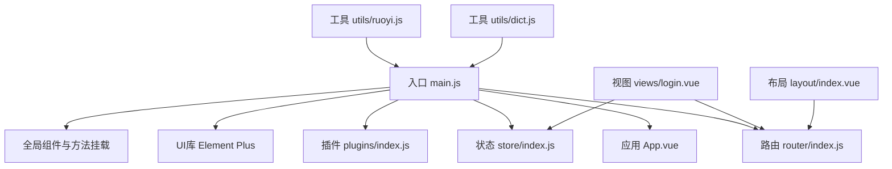
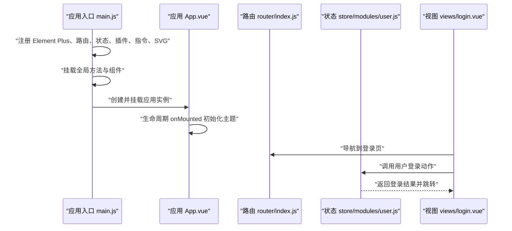
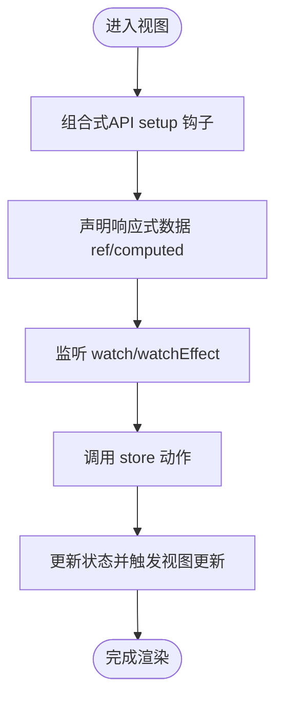
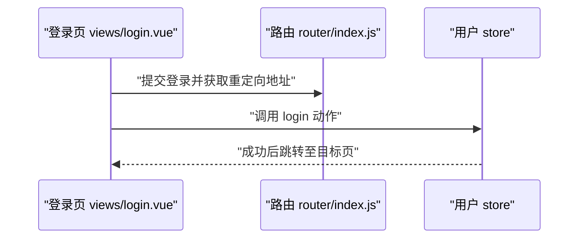
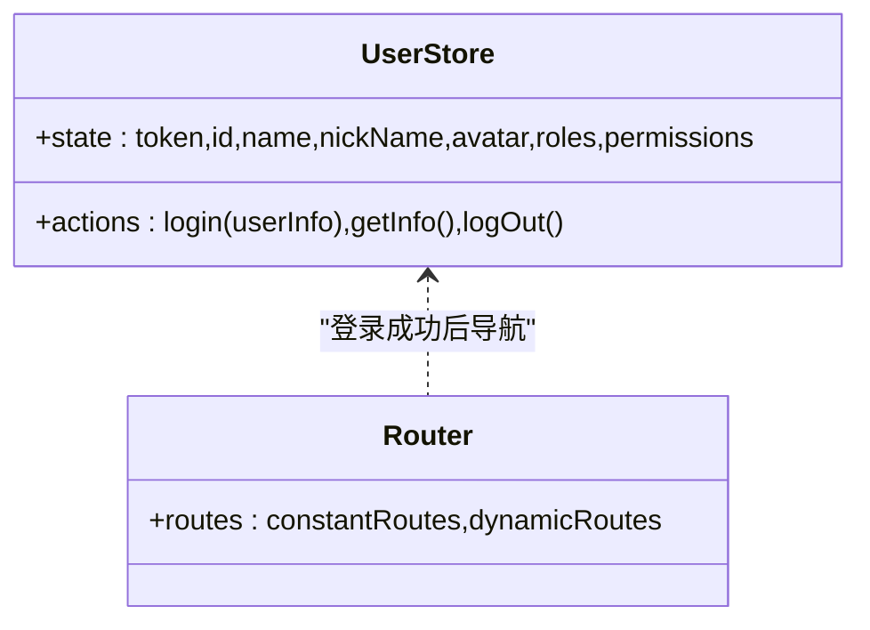
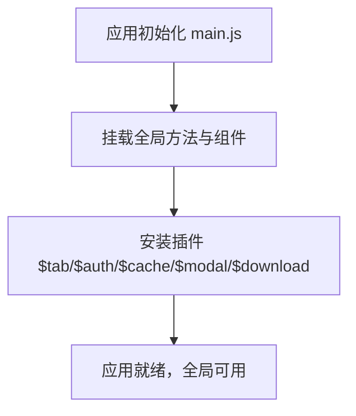
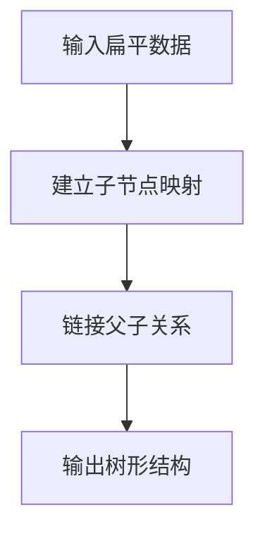
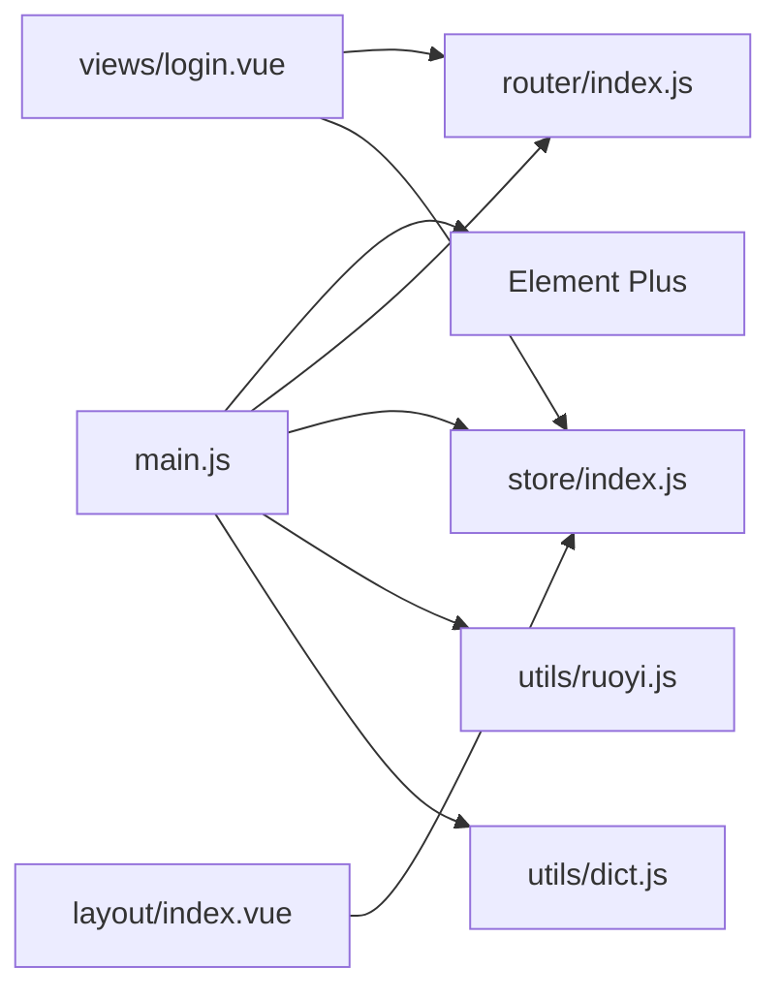

# Vue3框架基础

<cite>
**本文引用的文件**
- [package.json](file://ruoyi-ui/package.json)
- [main.js](file://ruoyi-ui/src/main.js)
- [vite.config.js](file://ruoyi-ui/vite.config.js)
- [settings.js](file://ruoyi-ui/src/settings.js)
- [router/index.js](file://ruoyi-ui/src/router/index.js)
- [store/index.js](file://ruoyi-ui/src/store/index.js)
- [store/modules/user.js](file://ruoyi-ui/src/store/modules/user.js)
- [utils/dict.js](file://ruoyi-ui/src/utils/dict.js)
- [utils/ruoyi.js](file://ruoyi-ui/src/utils/ruoyi.js)
- [App.vue](file://ruoyi-ui/src/App.vue)
- [layout/index.vue](file://ruoyi-ui/src/layout/index.vue)
- [views/login.vue](file://ruoyi-ui/src/views/login.vue)
- [components/DictTag/index.vue](file://ruoyi-ui/src/components/DictTag/index.vue)
- [plugins/index.js](file://ruoyi-ui/src/plugins/index.js)
- [vite/plugins/index.js](file://ruoyi-ui/vite/plugins/index.js)
</cite>

## 目录
1. [简介](#简介)
2. [项目结构](#项目结构)
3. [核心组件](#核心组件)
4. [架构总览](#架构总览)
5. [详细组件分析](#详细组件分析)
6. [依赖分析](#依赖分析)
7. [性能考虑](#性能考虑)
8. [故障排查指南](#故障排查指南)
9. [结论](#结论)
10. [附录](#附录)

## 简介
本技术文档围绕NeoCC项目中Vue3与Element Plus的集成实践展开，重点覆盖以下方面：
- 组合式API（Composition API）在项目中的使用方式与最佳实践
- 响应式系统与状态管理（Pinia Store）的实现与数据流
- 组件生命周期管理与全局属性/方法挂载机制
- 初始化配置：Element Plus UI集成、国际化、Cookie存储管理
- Vite构建工具的配置与优化策略
- 全局工具函数：字典处理、时间格式化、树形数据处理等
- 开发最佳实践与性能优化建议

## 项目结构
前端采用Vue3 + Vite + Element Plus的现代化前端架构，核心入口位于src/main.js，路由与状态管理分别由router与store模块提供，工具函数集中于utils目录，组件库通过Element Plus按需引入。

图表来源
- [main.js:1-84](file://ruoyi-ui/src/main.js#L1-L84)
- [router/index.js:1-68](file://ruoyi-ui/src/router/index.js#L1-L68)
- [store/index.js:1-4](file://ruoyi-ui/src/store/index.js#L1-L4)
- [plugins/index.js:1-19](file://ruoyi-ui/src/plugins/index.js#L1-L19)
- [views/login.vue:1-203](file://ruoyi-ui/src/views/login.vue#L1-L203)
- [layout/index.vue:1-116](file://ruoyi-ui/src/layout/index.vue#L1-L116)
- [utils/ruoyi.js:1-229](file://ruoyi-ui/src/utils/ruoyi.js#L1-L229)
- [utils/dict.js:1-14](file://ruoyi-ui/src/utils/dict.js#L1-L14)

章节来源
- [main.js:1-84](file://ruoyi-ui/src/main.js#L1-L84)
- [router/index.js:1-68](file://ruoyi-ui/src/router/index.js#L1-L68)
- [store/index.js:1-4](file://ruoyi-ui/src/store/index.js#L1-L4)
- [plugins/index.js:1-19](file://ruoyi-ui/src/plugins/index.js#L1-L19)

## 核心组件
- 应用入口与全局挂载：在入口文件中完成Element Plus、路由、状态、插件、指令、SVG图标等的注册，并将常用工具函数与组件挂载至全局。
- 路由系统：基于history模式，定义公共路由与滚动行为，支持重定向、登录页、404/401错误页等。
- 状态管理：使用Pinia创建全局store，用户模块负责认证、角色与权限信息的管理。
- 工具函数：提供时间格式化、表单重置、日期范围添加、字典回显、树形数据构造、参数序列化等通用能力。
- 视图与布局：登录页采用Element Plus表单组件，布局组件负责侧边栏、顶部导航、标签页与主题切换。

章节来源
- [main.js:46-84](file://ruoyi-ui/src/main.js#L46-L84)
- [router/index.js:10-68](file://ruoyi-ui/src/router/index.js#L10-L68)
- [store/modules/user.js:1-93](file://ruoyi-ui/src/store/modules/user.js#L1-L93)
- [utils/ruoyi.js:6-229](file://ruoyi-ui/src/utils/ruoyi.js#L6-L229)
- [views/login.vue:1-203](file://ruoyi-ui/src/views/login.vue#L1-L203)
- [layout/index.vue:1-116](file://ruoyi-ui/src/layout/index.vue#L1-L116)

## 架构总览
下图展示了从应用启动到页面渲染的关键流程，包括全局属性挂载、路由守卫、状态管理与UI渲染。

图表来源
- [main.js:46-84](file://ruoyi-ui/src/main.js#L46-L84)
- [App.vue:5-15](file://ruoyi-ui/src/App.vue#L5-L15)
- [router/index.js:56-68](file://ruoyi-ui/src/router/index.js#L56-L68)
- [store/modules/user.js:20-41](file://ruoyi-ui/src/store/modules/user.js#L20-L41)
- [views/login.vue:80-110](file://ruoyi-ui/src/views/login.vue#L80-L110)

## 详细组件分析

### 组合式API与响应式系统
- 组合式API广泛应用于视图与布局组件中，如在App.vue与layout/index.vue中使用onMounted、nextTick、computed、watch/watchEffect等。
- 响应式数据通过ref、reactive与computed暴露，配合Pinia store进行跨组件状态共享。
- 用户模块使用defineStore定义状态与动作，登录、获取信息、退出等操作均以Promise形式封装，便于在视图层进行异步处理。

图表来源
- [App.vue:5-15](file://ruoyi-ui/src/App.vue#L5-L15)
- [layout/index.vue:16-63](file://ruoyi-ui/src/layout/index.vue#L16-L63)
- [store/modules/user.js:8-93](file://ruoyi-ui/src/store/modules/user.js#L8-L93)

章节来源
- [App.vue:5-15](file://ruoyi-ui/src/App.vue#L5-L15)
- [layout/index.vue:16-63](file://ruoyi-ui/src/layout/index.vue#L16-L63)
- [store/modules/user.js:8-93](file://ruoyi-ui/src/store/modules/user.js#L8-L93)

### 路由与导航
- 路由采用history模式，定义常量路由（登录、重定向、404/401等），当前版本未启用动态路由。
- 滚动行为支持恢复滚动位置或回到顶部。
- 登录页通过路由参数处理重定向逻辑，结合用户store执行登录流程。

图表来源
- [router/index.js:56-68](file://ruoyi-ui/src/router/index.js#L56-L68)
- [views/login.vue:76-110](file://ruoyi-ui/src/views/login.vue#L76-L110)
- [store/modules/user.js:20-41](file://ruoyi-ui/src/store/modules/user.js#L20-L41)

章节来源
- [router/index.js:10-68](file://ruoyi-ui/src/router/index.js#L10-L68)
- [views/login.vue:76-110](file://ruoyi-ui/src/views/login.vue#L76-L110)

### 状态管理（Pinia）
- 在入口文件创建Pinia实例并导出，用户模块负责token、用户信息、角色与权限的持久化与更新。
- 登录成功后写入token并清除非标准后端返回格式差异；退出时清理本地状态并尝试调用后端logout接口。

图表来源
- [store/modules/user.js:8-93](file://ruoyi-ui/src/store/modules/user.js#L8-L93)
- [router/index.js:11-54](file://ruoyi-ui/src/router/index.js#L11-L54)

章节来源
- [store/index.js:1-4](file://ruoyi-ui/src/store/index.js#L1-L4)
- [store/modules/user.js:1-93](file://ruoyi-ui/src/store/modules/user.js#L1-L93)

### 全局属性与方法挂载机制
- 在入口文件中将useDict、parseTime、resetForm、handleTree、addDateRange、selectDictLabel、selectDictLabels等工具函数挂载至app.config.globalProperties，供全局使用。
- 同时注册全局组件（分页、富文本、上传、字典标签等），并通过plugins统一注入$tab、$auth、$cache、$modal、$download等对象。

图表来源
- [main.js:48-74](file://ruoyi-ui/src/main.js#L48-L74)
- [plugins/index.js:7-19](file://ruoyi-ui/src/plugins/index.js#L7-L19)

章节来源
- [main.js:48-74](file://ruoyi-ui/src/main.js#L48-L74)
- [plugins/index.js:7-19](file://ruoyi-ui/src/plugins/index.js#L7-L19)

### 字典处理与树形数据
- 字典处理：useDict函数用于获取字典数据，当前版本由于后端接口调整，返回空数组占位，仍保持组合式API的响应式结构。
- 树形数据：handleTree函数将扁平数据转换为树形结构，支持自定义id、父节点与子节点字段，默认值兼容常见约定。

图表来源
- [utils/dict.js:4-13](file://ruoyi-ui/src/utils/dict.js#L4-L13)
- [utils/ruoyi.js:158-185](file://ruoyi-ui/src/utils/ruoyi.js#L158-L185)

章节来源
- [utils/dict.js:1-14](file://ruoyi-ui/src/utils/dict.js#L1-L14)
- [utils/ruoyi.js:158-185](file://ruoyi-ui/src/utils/ruoyi.js#L158-L185)

### 时间格式化与表单处理
- parseTime：支持多种时间输入类型（数字/字符串/对象），按模板格式化输出，兼容10位秒级时间戳。
- resetForm：通过表单ref重置字段。
- addDateRange：将日期范围注入params对象，支持自定义属性前缀。
- selectDictLabel/Labels：根据字典数据回显标签，支持单值与多值场景。

章节来源
- [utils/ruoyi.js:6-111](file://ruoyi-ui/src/utils/ruoyi.js#L6-L111)

### Cookie存储与国际化
- Cookie存储：登录页使用js-cookie读取/写入用户名、加密后的密码与记住我状态，实现自动填充与安全存储。
- 国际化：Element Plus通过locale配置加载中文语言包，确保组件文案本地化。

章节来源
- [views/login.vue:80-128](file://ruoyi-ui/src/views/login.vue#L80-L128)
- [main.js:7-8](file://ruoyi-ui/src/main.js#L7-L8)

### 布局与主题
- 布局组件layout/index.vue通过计算属性控制侧边栏、标签页与头部固定行为，响应窗口尺寸变化并在移动端自动关闭侧边栏。
- App.vue在mounted后通过nextTick初始化主题样式，确保主题变量生效。

章节来源
- [layout/index.vue:16-63](file://ruoyi-ui/src/layout/index.vue#L16-L63)
- [App.vue:9-14](file://ruoyi-ui/src/App.vue#L9-L14)

## 依赖分析
- 依赖关系概览：应用入口依赖Element Plus、路由、状态、插件与指令；视图依赖路由与状态；工具函数被入口与视图共同使用。
- 外部依赖：Vue3、Element Plus、Pinia、Vue Router、js-cookie、axios等。

图表来源
- [main.js:1-84](file://ruoyi-ui/src/main.js#L1-L84)
- [router/index.js:1-68](file://ruoyi-ui/src/router/index.js#L1-L68)
- [store/index.js:1-4](file://ruoyi-ui/src/store/index.js#L1-L4)
- [views/login.vue:1-203](file://ruoyi-ui/src/views/login.vue#L1-L203)
- [layout/index.vue:1-116](file://ruoyi-ui/src/layout/index.vue#L1-L116)
- [utils/ruoyi.js:1-229](file://ruoyi-ui/src/utils/ruoyi.js#L1-L229)
- [utils/dict.js:1-14](file://ruoyi-ui/src/utils/dict.js#L1-L14)

章节来源
- [package.json:18-46](file://ruoyi-ui/package.json#L18-L46)

## 性能考虑
- 构建优化：Vite配置中开启Rollup输出命名规则与chunkSize告警阈值，生产环境关闭内联SourceMap，减少体积与提升加载速度。
- 代理与网络：通过server.proxy将/dev-api与/springdoc相关请求转发至后端网关，降低跨域与调试复杂度。
- 插件链路：按需启用自动导入、SVG图标、压缩等插件，避免不必要的打包开销。
- 组件懒加载：路由采用动态导入，减少首屏资源压力。
- 主题与样式：通过CSS变量与SCSS变量统一主题，避免重复样式计算。

章节来源
- [vite.config.js:28-77](file://ruoyi-ui/vite.config.js#L28-L77)
- [vite/plugins/index.js:8-15](file://ruoyi-ui/vite/plugins/index.js#L8-L15)

## 故障排查指南
- 登录失败：检查用户store的login动作是否正确解析后端返回的token，确认setToken与本地状态同步。
- 字典为空：useDict当前返回空数组，需确认后端接口是否恢复或替换为本地静态字典。
- 主题不生效：确认App.vue在mounted后执行主题初始化，检查CSS变量与SCSS变量是否正确注入。
- 路由跳转异常：核对路由配置与重定向参数，确保登录成功后跳转路径正确。
- Cookie读写问题：检查js-cookie版本与浏览器隐私设置，确认加密/解密流程是否抛出异常。

章节来源
- [store/modules/user.js:20-41](file://ruoyi-ui/src/store/modules/user.js#L20-L41)
- [utils/dict.js:4-13](file://ruoyi-ui/src/utils/dict.js#L4-L13)
- [App.vue:9-14](file://ruoyi-ui/src/App.vue#L9-L14)
- [views/login.vue:80-128](file://ruoyi-ui/src/views/login.vue#L80-L128)

## 结论
本项目在NeoCC中实现了Vue3与Element Plus的完整集成，结合组合式API与Pinia状态管理，提供了清晰的初始化流程、完善的工具函数体系与可扩展的构建配置。通过全局属性与组件挂载、路由与状态管理、以及Vite优化策略，整体具备良好的可维护性与性能表现。后续可在字典接口恢复、国际化扩展与组件库按需加载等方面持续优化。

## 附录
- 配置项速览：应用标题、侧边栏主题、导航模式、标签页显示与固定头部等可通过settings.js集中配置。
- 开发脚本：package.json中提供dev、build:prod、build:stage与preview命令，便于本地开发与预览。

章节来源
- [settings.js:1-68](file://ruoyi-ui/src/settings.js#L1-L68)
- [package.json:8-12](file://ruoyi-ui/package.json#L8-L12)