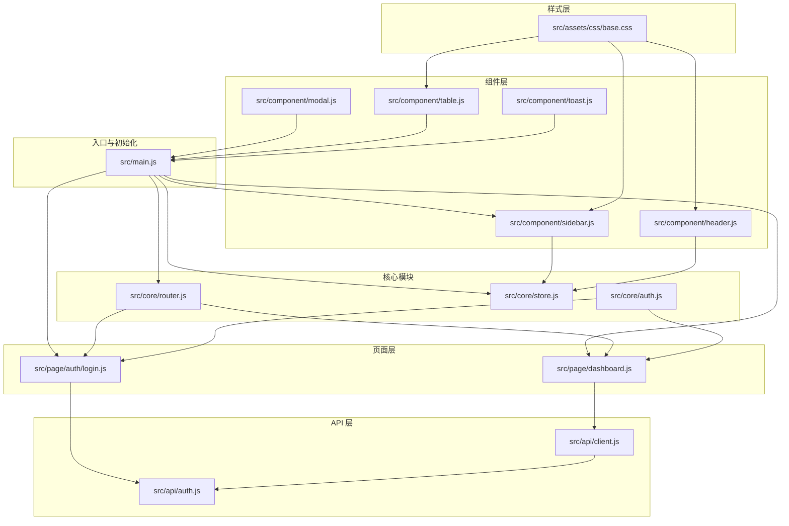
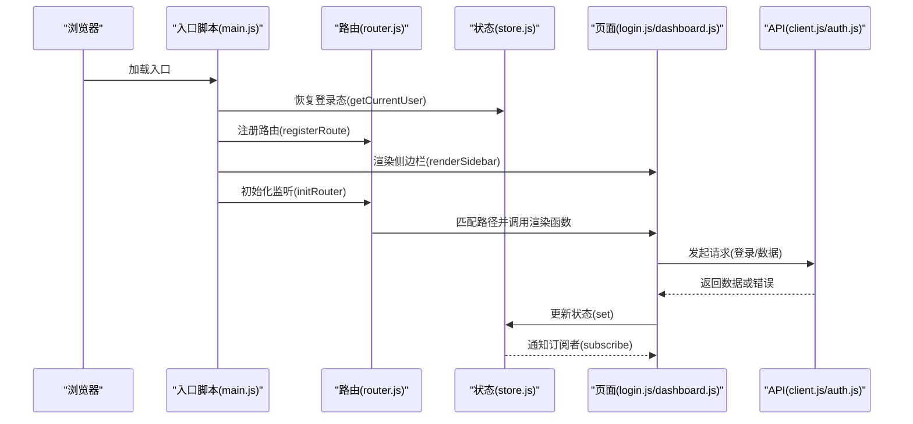
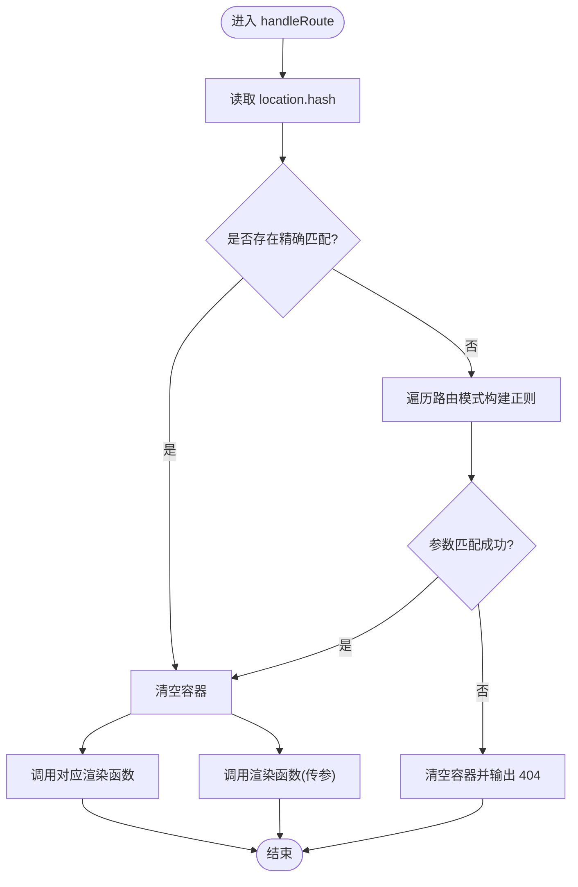
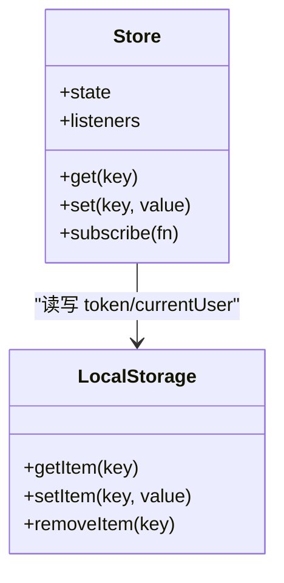
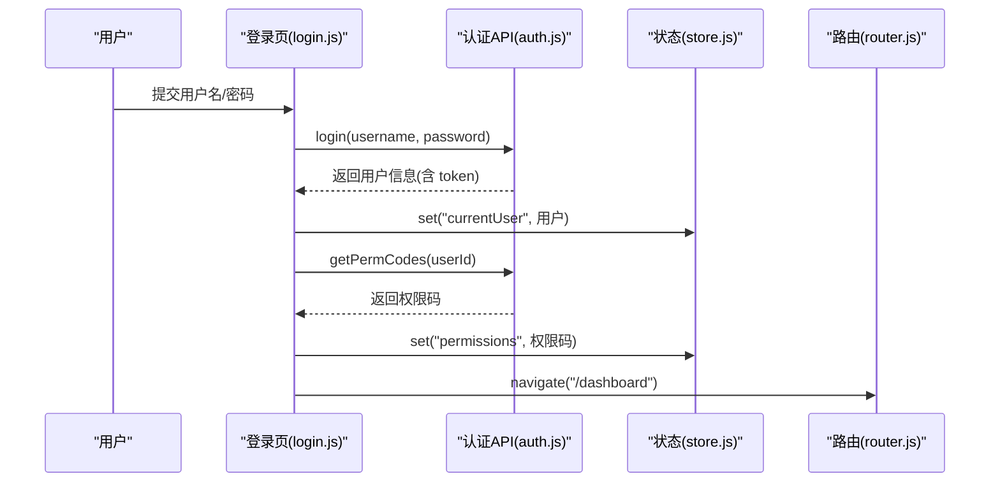
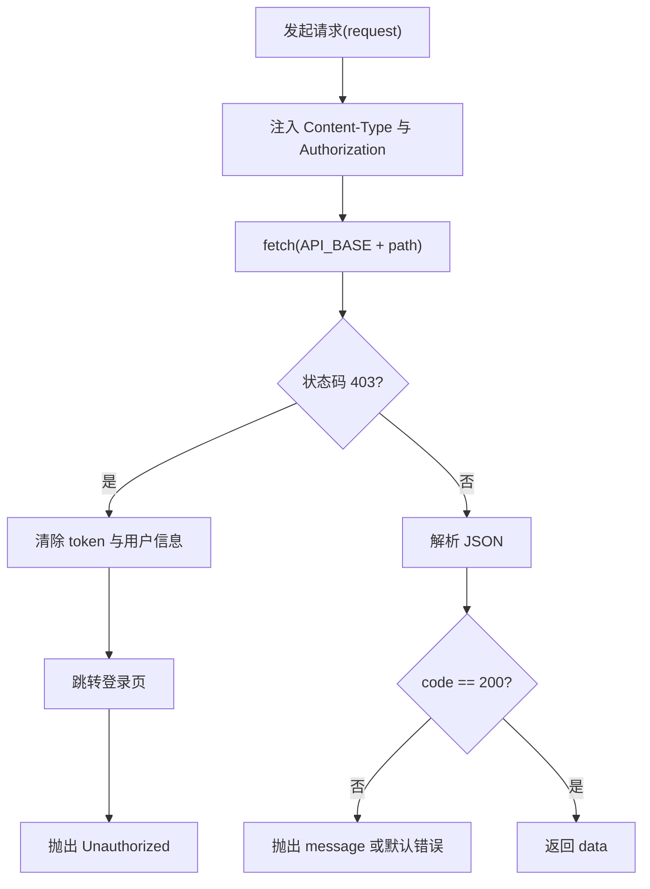
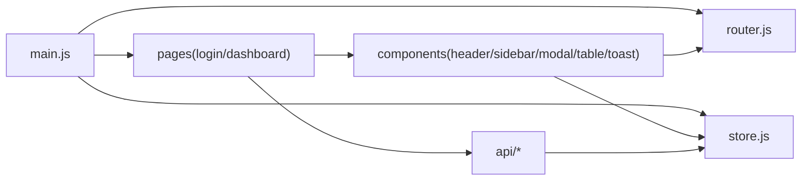

# 前端应用

<cite>
**本文引用的文件**
- [frontEnd/src/main.js](file://frontEnd/src/main.js)
- [frontEnd/src/core/router.js](file://frontEnd/src/core/router.js)
- [frontEnd/src/core/store.js](file://frontEnd/src/core/store.js)
- [frontEnd/src/core/auth.js](file://frontEnd/src/core/auth.js)
- [frontEnd/src/api/client.js](file://frontEnd/src/api/client.js)
- [frontEnd/src/api/auth.js](file://frontEnd/src/api/auth.js)
- [frontEnd/src/component/sidebar.js](file://frontEnd/src/component/sidebar.js)
- [frontEnd/src/component/header.js](file://frontEnd/src/component/header.js)
- [frontEnd/src/component/modal.js](file://frontEnd/src/component/modal.js)
- [frontEnd/src/component/table.js](file://frontEnd/src/component/table.js)
- [frontEnd/src/component/toast.js](file://frontEnd/src/component/toast.js)
- [frontEnd/src/page/auth/login.js](file://frontEnd/src/page/auth/login.js)
- [frontEnd/src/page/dashboard.js](file://frontEnd/src/page/dashboard.js)
- [frontEnd/src/assets/css/base.css](file://frontEnd/src/assets/css/base.css)
- [frontEnd/package.json](file://frontEnd/package.json)
</cite>

## 目录
1. [简介](#简介)
2. [项目结构](#项目结构)
3. [核心组件](#核心组件)
4. [架构总览](#架构总览)
5. [详细组件分析](#详细组件分析)
6. [依赖关系分析](#依赖关系分析)
7. [性能考虑](#性能考虑)
8. [故障排查指南](#故障排查指南)
9. [结论](#结论)
10. [附录](#附录)

## 简介
本项目是一个基于原生 JavaScript 的前端应用，采用组件化开发模式与极简的状态管理与路由机制，结合通用的 API 客户端封装，实现了认证、菜单渲染、页面切换、表格与弹窗等基础能力。该前端应用通过哈希路由实现 SPA 风格导航，配合本地存储完成登录态持久化；通过统一的请求客户端实现鉴权头注入与错误处理；通过通用组件实现表单、表格、弹窗与提示等 UI 能力。

## 项目结构
前端源码位于 frontEnd/src 目录，按功能域与职责划分为以下层次：
- 入口与初始化：入口脚本负责恢复登录态、注册路由、渲染侧边栏与初始化路由。
- 核心模块：路由、状态管理、认证守卫。
- API 层：HTTP 客户端与认证相关接口。
- 组件层：头部、侧边栏、弹窗、表格、Toast 等通用 UI 组件。
- 页面层：登录页与仪表盘页。
- 样式层：基础样式与变量定义。

图表来源
- [frontEnd/src/main.js:1-37](file://frontEnd/src/main.js#L1-L37)
- [frontEnd/src/core/router.js:1-72](file://frontEnd/src/core/router.js#L1-L72)
- [frontEnd/src/core/store.js:1-35](file://frontEnd/src/core/store.js#L1-L35)
- [frontEnd/src/core/auth.js:1-14](file://frontEnd/src/core/auth.js#L1-L14)
- [frontEnd/src/api/client.js:1-59](file://frontEnd/src/api/client.js#L1-L59)
- [frontEnd/src/api/auth.js:1-33](file://frontEnd/src/api/auth.js#L1-L33)
- [frontEnd/src/component/sidebar.js:1-83](file://frontEnd/src/component/sidebar.js#L1-L83)
- [frontEnd/src/component/header.js:1-26](file://frontEnd/src/component/header.js#L1-L26)
- [frontEnd/src/component/modal.js:1-51](file://frontEnd/src/component/modal.js#L1-L51)
- [frontEnd/src/component/table.js:1-69](file://frontEnd/src/component/table.js#L1-L69)
- [frontEnd/src/component/toast.js:1-17](file://frontEnd/src/component/toast.js#L1-L17)
- [frontEnd/src/page/auth/login.js:1-91](file://frontEnd/src/page/auth/login.js#L1-L91)
- [frontEnd/src/page/dashboard.js:1-80](file://frontEnd/src/page/dashboard.js#L1-L80)
- [frontEnd/src/assets/css/base.css:1-48](file://frontEnd/src/assets/css/base.css#L1-L48)

章节来源
- [frontEnd/src/main.js:1-37](file://frontEnd/src/main.js#L1-L37)
- [frontEnd/src/assets/css/base.css:1-48](file://frontEnd/src/assets/css/base.css#L1-L48)

## 核心组件
本节聚焦于前端的核心模块：路由、状态管理、认证守卫与 API 客户端。

- 路由模块
  - 支持精确路径与带参数路径匹配（如 /sales/customer/:id），通过正则缓存提升性能。
  - 提供注册路由、导航与初始化监听的能力。
- 状态管理
  - 提供 get/set 与订阅通知机制，支持 token、当前用户、字典、权限与菜单等状态字段。
  - 与本地存储联动，实现登录态持久化。
- 认证守卫
  - 在页面渲染前检查登录态，未登录则跳转登录页。
- API 客户端
  - 统一请求入口，自动注入 Authorization 头。
  - 对 403 进行统一处理（清除本地 token 与用户信息并跳转登录页）。
  - 对返回码进行校验，非 200 抛出错误。

章节来源
- [frontEnd/src/core/router.js:1-72](file://frontEnd/src/core/router.js#L1-L72)
- [frontEnd/src/core/store.js:1-35](file://frontEnd/src/core/store.js#L1-L35)
- [frontEnd/src/core/auth.js:1-14](file://frontEnd/src/core/auth.js#L1-L14)
- [frontEnd/src/api/client.js:1-59](file://frontEnd/src/api/client.js#L1-L59)

## 架构总览
整体架构采用“入口初始化 → 路由驱动 → 组件渲染”的模式。入口脚本在启动时恢复登录态、注册页面路由、渲染侧边栏并初始化路由监听。页面渲染由路由表驱动，页面组件通过 API 客户端与后端交互，状态通过状态管理模块集中维护。

图表来源
- [frontEnd/src/main.js:1-37](file://frontEnd/src/main.js#L1-L37)
- [frontEnd/src/core/router.js:1-72](file://frontEnd/src/core/router.js#L1-L72)
- [frontEnd/src/core/store.js:1-35](file://frontEnd/src/core/store.js#L1-L35)
- [frontEnd/src/page/auth/login.js:1-91](file://frontEnd/src/page/auth/login.js#L1-L91)
- [frontEnd/src/page/dashboard.js:1-80](file://frontEnd/src/page/dashboard.js#L1-L80)
- [frontEnd/src/api/client.js:1-59](file://frontEnd/src/api/client.js#L1-L59)
- [frontEnd/src/api/auth.js:1-33](file://frontEnd/src/api/auth.js#L1-L33)

## 详细组件分析

### 路由与导航
- 路由注册与导航
  - 通过 registerRoute 注册路径与渲染函数。
  - navigate 切换 location.hash 实现页面跳转。
- 路由解析
  - 精确匹配优先，随后尝试参数匹配（:id 等），最后 404。
  - 正则表达式缓存避免重复构建。
- 初始化监听
  - 监听 hashchange，首次触发 handleRoute。

图表来源
- [frontEnd/src/core/router.js:24-50](file://frontEnd/src/core/router.js#L24-L50)

章节来源
- [frontEnd/src/core/router.js:1-72](file://frontEnd/src/core/router.js#L1-L72)

### 状态管理
- 状态字段
  - token、currentUser、dicts、permissions、menuItems。
- 订阅机制
  - set 变更后通知所有订阅者，便于组件响应式更新。
- 本地存储
  - token 与 currentUser 与 localStorage 同步，实现刷新后状态保持。

图表来源
- [frontEnd/src/core/store.js:7-32](file://frontEnd/src/core/store.js#L7-L32)

章节来源
- [frontEnd/src/core/store.js:1-35](file://frontEnd/src/core/store.js#L1-L35)

### 认证与权限
- 登录流程
  - 调用登录接口，保存 token 与用户信息至 localStorage。
  - 请求权限码列表并写入状态。
  - 加载字典后跳转仪表盘。
- 登出流程
  - 清除本地 token 与用户信息，跳转登录页。
- 权限校验
  - 页面渲染前通过 requireAuth 检查登录态，未登录则跳转登录页。

图表来源
- [frontEnd/src/page/auth/login.js:38-84](file://frontEnd/src/page/auth/login.js#L38-L84)
- [frontEnd/src/api/auth.js:7-32](file://frontEnd/src/api/auth.js#L7-L32)
- [frontEnd/src/core/store.js:21-23](file://frontEnd/src/core/store.js#L21-L23)
- [frontEnd/src/core/router.js:13-15](file://frontEnd/src/core/router.js#L13-L15)

章节来源
- [frontEnd/src/api/auth.js:1-33](file://frontEnd/src/api/auth.js#L1-L33)
- [frontEnd/src/core/auth.js:1-14](file://frontEnd/src/core/auth.js#L1-L14)

### API 客户端与错误处理
- 统一请求
  - 自动拼接 API 基础路径与 Authorization 头。
- 错误处理
  - 403：清除本地 token 与用户信息并跳转登录页。
  - 非 200：抛出错误，由调用方捕获。
- 方法封装
  - get/post/put/del 简化常用请求。

图表来源
- [frontEnd/src/api/client.js:7-32](file://frontEnd/src/api/client.js#L7-L32)

章节来源
- [frontEnd/src/api/client.js:1-59](file://frontEnd/src/api/client.js#L1-L59)

### 通用组件

#### 侧边栏组件
- 功能
  - 渲染菜单项与子菜单，支持事件委托点击导航。
  - 默认菜单包含工作台与多模块入口。
- 交互
  - 点击菜单项通过 navigate 切换路由。

章节来源
- [frontEnd/src/component/sidebar.js:1-83](file://frontEnd/src/component/sidebar.js#L1-L83)

#### 头部组件
- 功能
  - 显示当前用户名称与退出按钮。
  - 点击退出调用登出逻辑。

章节来源
- [frontEnd/src/component/header.js:1-26](file://frontEnd/src/component/header.js#L1-L26)

#### 弹窗组件
- 功能
  - 支持标题、内容、确认与取消回调。
  - 点击遮罩或取消触发关闭并回调 onCancel。
- 返回值
  - 返回 close 函数用于外部手动关闭。

章节来源
- [frontEnd/src/component/modal.js:1-51](file://frontEnd/src/component/modal.js#L1-L51)

#### 表格组件
- 功能
  - 支持列定义、数据渲染、空状态与分页。
  - 支持自定义列渲染函数。
- 交互
  - 绑定分页按钮事件，触发 onPageChange 回调。

章节来源
- [frontEnd/src/component/table.js:1-69](file://frontEnd/src/component/table.js#L1-L69)

#### Toast 组件
- 功能
  - 支持不同类型提示，3 秒后淡出并移除。

章节来源
- [frontEnd/src/component/toast.js:1-17](file://frontEnd/src/component/toast.js#L1-L17)

### 页面组件

#### 登录页
- 功能
  - 表单校验、提交、错误提示。
  - 登录成功后加载权限码与字典，跳转仪表盘。
- 依赖
  - 认证 API、状态管理、路由与 Toast。

章节来源
- [frontEnd/src/page/auth/login.js:1-91](file://frontEnd/src/page/auth/login.js#L1-L91)

#### 仪表盘页
- 功能
  - 登录态校验、头部渲染、并行加载统计数据、渲染统计卡片。
- 依赖
  - 认证守卫、API 客户端、头部组件。

章节来源
- [frontEnd/src/page/dashboard.js:1-80](file://frontEnd/src/page/dashboard.js#L1-L80)

## 依赖关系分析
- 模块耦合
  - 入口脚本依赖路由、状态与页面渲染函数。
  - 页面组件依赖 API 客户端与通用组件。
  - 通用组件依赖状态管理与路由。
- 外部依赖
  - 本地开发使用静态服务器脚本，不引入构建工具链。

图表来源
- [frontEnd/src/main.js:7-29](file://frontEnd/src/main.js#L7-L29)
- [frontEnd/src/page/auth/login.js:4-9](file://frontEnd/src/page/auth/login.js#L4-L9)
- [frontEnd/src/page/dashboard.js:4-6](file://frontEnd/src/page/dashboard.js#L4-L6)
- [frontEnd/src/component/sidebar.js:4-5](file://frontEnd/src/component/sidebar.js#L4-L5)
- [frontEnd/src/component/header.js:4-5](file://frontEnd/src/component/header.js#L4-L5)
- [frontEnd/src/api/client.js:2](file://frontEnd/src/api/client.js#L2)
- [frontEnd/src/api/auth.js:2](file://frontEnd/src/api/auth.js#L2)

章节来源
- [frontEnd/src/main.js:1-37](file://frontEnd/src/main.js#L1-L37)
- [frontEnd/package.json:5-11](file://frontEnd/package.json#L5-L11)

## 性能考虑
- 路由匹配优化
  - 正则表达式缓存减少重复构建开销。
- 并行请求
  - 仪表盘页对多个接口采用 Promise.all 并行拉取，缩短首屏等待时间。
- DOM 操作最小化
  - 通过一次性 innerHTML 写入与事件委托降低频繁 DOM 查询与绑定成本。
- 本地存储
  - 登录态与权限码本地持久化，减少重复请求与二次加载。

章节来源
- [frontEnd/src/core/router.js:56-71](file://frontEnd/src/core/router.js#L56-L71)
- [frontEnd/src/page/dashboard.js:36-39](file://frontEnd/src/page/dashboard.js#L36-L39)

## 故障排查指南
- 登录后无法跳转仪表盘
  - 检查登录成功后是否正确设置 currentUser 与 permissions。
  - 确认 navigate 是否被调用。
- 403 未跳转登录页
  - 检查 API 客户端对 403 的处理逻辑是否执行。
  - 确认 localStorage 中 token 与用户信息是否被清除。
- 菜单点击无效
  - 检查侧边栏事件委托绑定与 navigate 调用。
- 表格无数据显示
  - 检查 records 是否为空，确认分页 total 与 page/size 设置。
- Toast 不消失
  - 检查自动移除定时器是否执行。

章节来源
- [frontEnd/src/api/client.js:17-23](file://frontEnd/src/api/client.js#L17-L23)
- [frontEnd/src/core/store.js:21-23](file://frontEnd/src/core/store.js#L21-L23)
- [frontEnd/src/component/sidebar.js:36-44](file://frontEnd/src/component/sidebar.js#L36-L44)
- [frontEnd/src/component/table.js:24-35](file://frontEnd/src/component/table.js#L24-L35)
- [frontEnd/src/component/toast.js:11-15](file://frontEnd/src/component/toast.js#L11-L15)

## 结论
本项目以极简的方式实现了前端 SPA 的核心能力：路由、状态管理、认证与通用 UI 组件。通过统一的 API 客户端与本地存储，保证了登录态与权限的稳定管理；通过并行请求与缓存策略提升了页面性能。建议后续可引入构建工具与单元测试，进一步增强可维护性与可扩展性。

## 附录

### 组件开发指南与最佳实践
- 组件职责单一
  - 每个组件只负责一个 UI 功能，避免过度耦合。
- 事件委托
  - 使用事件委托减少重复绑定，提高性能。
- 统一错误处理
  - 在页面或组件内捕获 API 错误并展示友好提示。
- 状态集中管理
  - 将跨组件共享的状态放入状态管理模块，通过订阅更新视图。
- 可测试性
  - 将 DOM 操作与业务逻辑解耦，便于单元测试。

### 浏览器兼容性
- 当前使用原生 fetch 与 ES5+ 语法，建议在目标环境中确保支持。
- 如需兼容旧版 IE，可引入 polyfill 并调整构建配置。