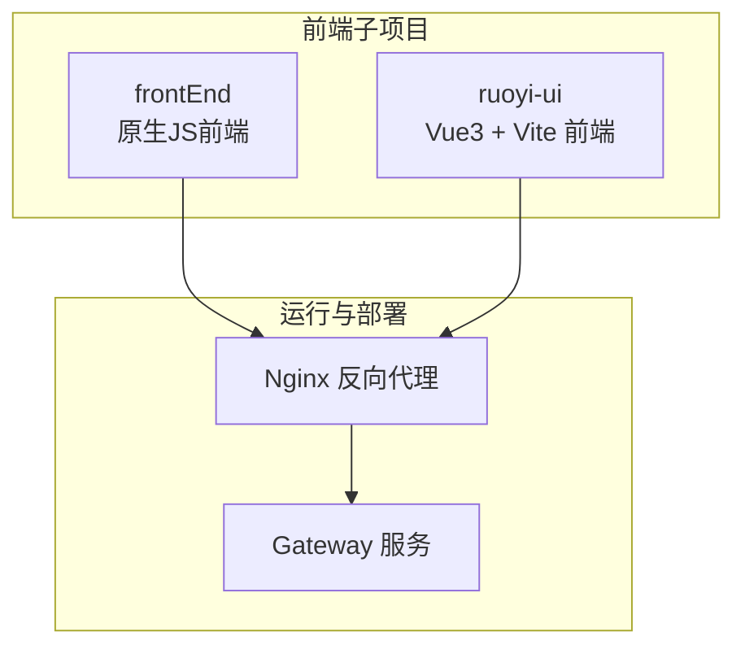
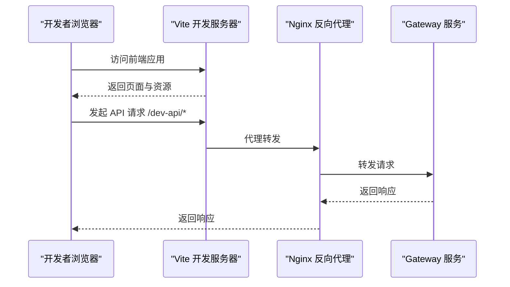
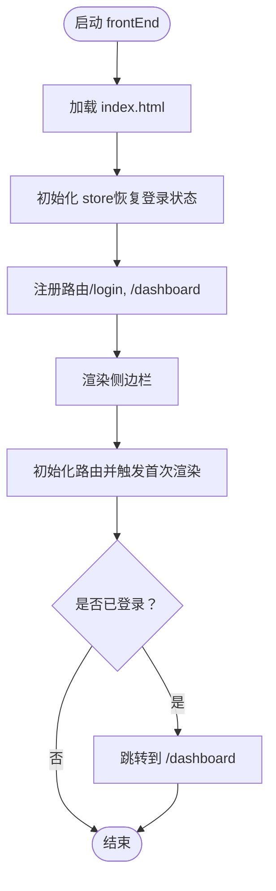
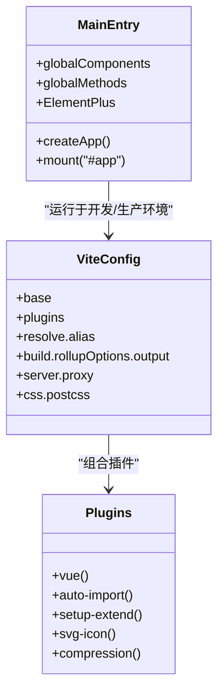
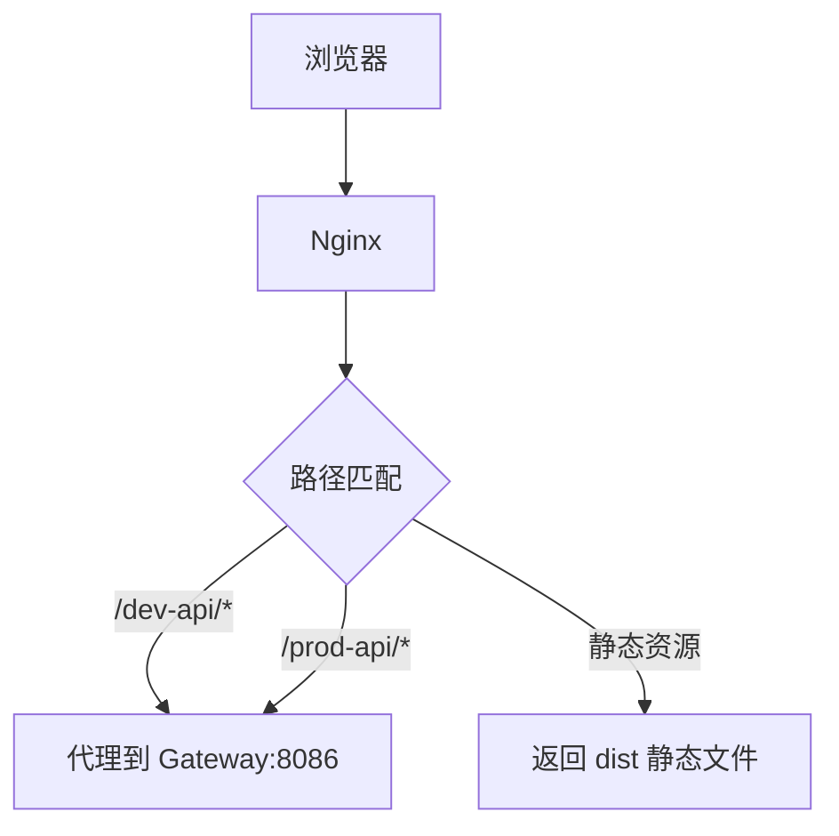
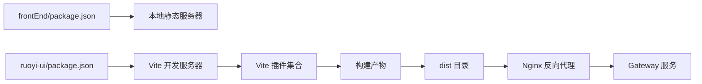

# 开发工作流

<cite>
**本文引用的文件**
- [frontEnd/package.json](file://frontEnd/package.json)
- [frontEnd/index.html](file://frontEnd/index.html)
- [frontEnd/src/main.js](file://frontEnd/src/main.js)
- [frontEnd/serve.json](file://frontEnd/serve.json)
- [ruoyi-ui/package.json](file://ruoyi-ui/package.json)
- [ruoyi-ui/vite.config.js](file://ruoyi-ui/vite.config.js)
- [ruoyi-ui/vite/plugins/index.js](file://ruoyi-ui/vite/plugins/index.js)
- [ruoyi-ui/vite/plugins/compression.js](file://ruoyi-ui/vite/plugins/compression.js)
- [ruoyi-ui/vite/plugins/auto-import.js](file://ruoyi-ui/vite/plugins/auto-import.js)
- [ruoyi-ui/src/main.js](file://ruoyi-ui/src/main.js)
- [ruoyi-ui/src/settings.js](file://ruoyi-ui/src/settings.js)
- [ruoyi-ui/index.html](file://ruoyi-ui/index.html)
- [ruoyi-ui/.gitignore](file://ruoyi-ui/.gitignore)
- [nginx.conf](file://nginx.conf)
- [ruoyi-ui/nginx.conf](file://ruoyi-ui/nginx.conf)
</cite>

## 目录
1. [简介](#简介)
2. [项目结构](#项目结构)
3. [核心组件](#核心组件)
4. [架构总览](#架构总览)
5. [详细组件分析](#详细组件分析)
6. [依赖关系分析](#依赖关系分析)
7. [性能考量](#性能考量)
8. [故障排查指南](#故障排查指南)
9. [结论](#结论)
10. [附录](#附录)

## 简介
本文件面向前端开发团队，系统梳理 NeoCC 项目的前端开发工作流，覆盖开发环境配置（Node.js 版本、依赖管理、开发服务器）、构建与打包流程（Vite 配置优化、代码分割、资源压缩）、开发调试技巧（热重载、源码映射、错误追踪）、版本控制与协作流程（分支管理、代码审查、持续集成），以及开发效率提升的工具与技巧。文档同时给出可操作的配置参考与可视化图示，帮助新成员快速上手并稳定交付。

## 项目结构
本仓库包含两个前端子项目：
- 原生 JS 前端（frontEnd）：轻量级本地静态服务，用于演示与快速验证。
- 若依 Vue 前端（ruoyi-ui）：基于 Vite 的现代化 Vue 3 应用，具备完善的开发与构建体系。

**图表来源**
- [frontEnd/package.json:1-13](file://frontEnd/package.json#L1-L13)
- [ruoyi-ui/package.json:1-54](file://ruoyi-ui/package.json#L1-L54)
- [nginx.conf:22-67](file://nginx.conf#L22-L67)

**章节来源**
- [frontEnd/package.json:1-13](file://frontEnd/package.json#L1-L13)
- [ruoyi-ui/package.json:1-54](file://ruoyi-ui/package.json#L1-L54)
- [nginx.conf:1-76](file://nginx.conf#L1-L76)

## 核心组件
- 开发服务器与本地服务
  - frontEnd 使用本地静态服务器启动，便于快速迭代与演示。
  - ruoyi-ui 使用 Vite 开发服务器，支持热重载、代理与插件生态。
- 构建与打包
  - ruoyi-ui 使用 Vite 进行构建，支持产物分块、命名策略与压缩。
- 资源与路由
  - frontEnd 通过 HTML 中的 script 标签引入入口脚本。
  - ruoyi-ui 通过路由与权限守卫实现页面级导航。
- 代理与网关
  - Nginx 将前端静态资源与 API 请求转发至后端 Gateway。

**章节来源**
- [frontEnd/index.html:1-27](file://frontEnd/index.html#L1-L27)
- [frontEnd/src/main.js:1-37](file://frontEnd/src/main.js#L1-L37)
- [ruoyi-ui/src/main.js:1-84](file://ruoyi-ui/src/main.js#L1-L84)
- [ruoyi-ui/vite.config.js:1-80](file://ruoyi-ui/vite.config.js#L1-L80)
- [nginx.conf:22-67](file://nginx.conf#L22-L67)

## 架构总览
下图展示从前端开发到后端网关的整体链路，包括开发服务器、代理与后端服务的关系。

**图表来源**
- [ruoyi-ui/vite.config.js:44-61](file://ruoyi-ui/vite.config.js#L44-L61)
- [nginx.conf:45-67](file://nginx.conf#L45-L67)

## 详细组件分析

### frontEnd：原生 JS 前端
- 开发环境与依赖
  - 使用本地静态服务器启动，适合快速验证与演示。
  - 通过脚本命令启动本地服务，无需复杂构建。
- 入口与路由
  - 在入口脚本中注册路由、渲染侧边栏与页面，并处理登录状态检查。
- HTML 结构
  - 通过 link 标签引入样式，通过 script 标签引入入口脚本。

**图表来源**
- [frontEnd/src/main.js:1-37](file://frontEnd/src/main.js#L1-L37)
- [frontEnd/index.html:1-27](file://frontEnd/index.html#L1-L27)

**章节来源**
- [frontEnd/package.json:1-13](file://frontEnd/package.json#L1-L13)
- [frontEnd/src/main.js:1-37](file://frontEnd/src/main.js#L1-L37)
- [frontEnd/index.html:1-27](file://frontEnd/index.html#L1-L27)
- [frontEnd/serve.json:1-5](file://frontEnd/serve.json#L1-L5)

### ruoyi-ui：Vue3 + Vite 前端
- 开发环境与依赖
  - 使用 Vite 作为开发服务器，提供热重载与快速启动。
  - 通过 package.json 定义开发、构建与预览脚本。
- 构建与打包
  - Vite 配置包含别名、解析扩展、构建输出与 Rollup 选项。
  - 通过插件系统启用自动导入、SVG 图标、压缩等能力。
- 插件体系
  - 插件组合器按需启用压缩插件，支持 gzip 与 brotli。
  - 自动导入 Vue、Router、Pinia 等常用库与自定义工具函数。
- 入口与路由
  - 在入口脚本中挂载全局组件、指令与第三方 UI 组件库。
  - 通过路由与权限守卫实现页面级导航与访问控制。
- 配置与模板
  - settings.js 提供应用标题、侧边栏主题、标签页等配置项。
  - index.html 作为模板，注入加载动画与应用挂载点。

**图表来源**
- [ruoyi-ui/vite.config.js:1-80](file://ruoyi-ui/vite.config.js#L1-L80)
- [ruoyi-ui/vite/plugins/index.js:1-16](file://ruoyi-ui/vite/plugins/index.js#L1-L16)
- [ruoyi-ui/vite/plugins/auto-import.js:1-17](file://ruoyi-ui/vite/plugins/auto-import.js#L1-L17)
- [ruoyi-ui/vite/plugins/compression.js:1-29](file://ruoyi-ui/vite/plugins/compression.js#L1-L29)
- [ruoyi-ui/src/main.js:1-84](file://ruoyi-ui/src/main.js#L1-L84)

**章节来源**
- [ruoyi-ui/package.json:1-54](file://ruoyi-ui/package.json#L1-L54)
- [ruoyi-ui/vite.config.js:1-80](file://ruoyi-ui/vite.config.js#L1-L80)
- [ruoyi-ui/vite/plugins/index.js:1-16](file://ruoyi-ui/vite/plugins/index.js#L1-L16)
- [ruoyi-ui/vite/plugins/auto-import.js:1-17](file://ruoyi-ui/vite/plugins/auto-import.js#L1-L17)
- [ruoyi-ui/vite/plugins/compression.js:1-29](file://ruoyi-ui/vite/plugins/compression.js#L1-L29)
- [ruoyi-ui/src/main.js:1-84](file://ruoyi-ui/src/main.js#L1-L84)
- [ruoyi-ui/src/settings.js:1-68](file://ruoyi-ui/src/settings.js#L1-L68)
- [ruoyi-ui/index.html:1-215](file://ruoyi-ui/index.html#L1-L215)

### 代理与网关
- Nginx 配置
  - 对前端静态资源禁用缓存，避免旧版本 JS 缓存问题。
  - 对 /dev-api 与 /prod-api 路径进行代理，转发至 Gateway。
- Vite 代理
  - 在开发阶段通过 Vite server.proxy 将 /dev-api 重写并代理到 Gateway。

**图表来源**
- [nginx.conf:22-67](file://nginx.conf#L22-L67)
- [ruoyi-ui/vite.config.js:44-61](file://ruoyi-ui/vite.config.js#L44-L61)

**章节来源**
- [nginx.conf:1-76](file://nginx.conf#L1-L76)
- [ruoyi-ui/nginx.conf:1-76](file://ruoyi-ui/nginx.conf#L1-L76)
- [ruoyi-ui/vite.config.js:1-80](file://ruoyi-ui/vite.config.js#L1-L80)

## 依赖关系分析
- 依赖管理
  - frontEnd 使用本地静态服务器，依赖较少，适合快速启动。
  - ruoyi-ui 采用 Vite + Vue3 + Pinia + ElementPlus 生态，依赖丰富，需注意版本兼容性。
- 插件耦合
  - Vite 插件通过组合器集中管理，构建期与开发期行为分离。
- 外部依赖
  - Nginx 作为反向代理，承担静态资源与 API 代理职责。

**图表来源**
- [frontEnd/package.json:1-13](file://frontEnd/package.json#L1-L13)
- [ruoyi-ui/package.json:1-54](file://ruoyi-ui/package.json#L1-L54)
- [ruoyi-ui/vite/plugins/index.js:1-16](file://ruoyi-ui/vite/plugins/index.js#L1-L16)

**章节来源**
- [frontEnd/package.json:1-13](file://frontEnd/package.json#L1-L13)
- [ruoyi-ui/package.json:1-54](file://ruoyi-ui/package.json#L1-L54)
- [ruoyi-ui/vite/plugins/index.js:1-16](file://ruoyi-ui/vite/plugins/index.js#L1-L16)

## 性能考量
- 代码分割与产物命名
  - Vite 构建配置对 chunk 与文件命名进行统一策略，有助于缓存与加载性能。
- 资源压缩
  - 可选启用 gzip 与 brotli 压缩，减少传输体积。
- 源码映射
  - 开发环境启用内联源码映射，便于调试；生产环境关闭以减小体积。
- 缓存策略
  - Nginx 对静态资源禁用缓存，避免旧版本 JS 缓存导致的问题。

**章节来源**
- [ruoyi-ui/vite.config.js:28-42](file://ruoyi-ui/vite.config.js#L28-L42)
- [ruoyi-ui/vite/plugins/compression.js:1-29](file://ruoyi-ui/vite/plugins/compression.js#L1-L29)
- [nginx.conf:31-43](file://nginx.conf#L31-L43)

## 故障排查指南
- 无法访问开发服务器
  - 检查端口占用与防火墙设置；确认 Vite 代理配置与后端 Gateway 可达。
- API 请求失败或跨域
  - 核对 /dev-api 代理规则与目标地址；确保 Nginx 代理配置正确。
- 静态资源未更新
  - 清除浏览器缓存或强制刷新；确认 Nginx 对 JS/CSS 禁用缓存。
- 构建产物异常
  - 检查 Vite 插件启用情况与压缩配置；核对 Rollup 输出命名策略。

**章节来源**
- [ruoyi-ui/vite.config.js:44-61](file://ruoyi-ui/vite.config.js#L44-L61)
- [nginx.conf:31-43](file://nginx.conf#L31-L43)
- [ruoyi-ui/.gitignore:1-24](file://ruoyi-ui/.gitignore#L1-L24)

## 结论
本工作流以 Vite 为核心，结合 Nginx 代理与 Gateway 后端服务，形成清晰的前端开发与部署闭环。通过合理的插件体系、构建配置与缓存策略，既能保证开发体验，又能满足生产性能要求。建议团队在日常协作中遵循统一的分支与提交规范，配合自动化测试与预览流程，持续提升交付质量与效率。

## 附录
- 开发与构建脚本参考
  - frontEnd：本地静态服务器启动与脚本命令。
  - ruoyi-ui：开发、构建、预览脚本与模式区分。
- 关键配置清单
  - Vite 别名、解析扩展、构建输出与代理。
  - Nginx 静态资源与 API 代理规则。
  - settings.js 应用配置项。

**章节来源**
- [frontEnd/package.json:5-8](file://frontEnd/package.json#L5-L8)
- [ruoyi-ui/package.json:8-13](file://ruoyi-ui/package.json#L8-L13)
- [ruoyi-ui/vite.config.js:17-27](file://ruoyi-ui/vite.config.js#L17-L27)
- [ruoyi-ui/vite.config.js:29-42](file://ruoyi-ui/vite.config.js#L29-L42)
- [ruoyi-ui/vite.config.js:44-61](file://ruoyi-ui/vite.config.js#L44-L61)
- [nginx.conf:26-43](file://nginx.conf#L26-L43)
- [ruoyi-ui/src/settings.js:1-68](file://ruoyi-ui/src/settings.js#L1-L68)