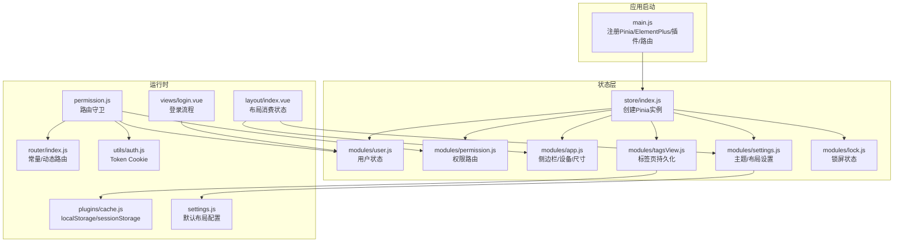
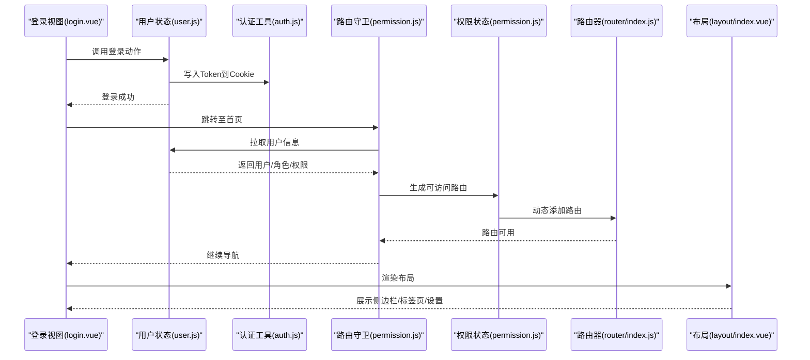
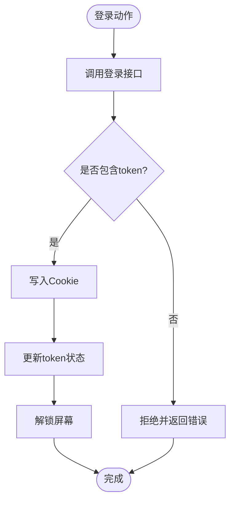
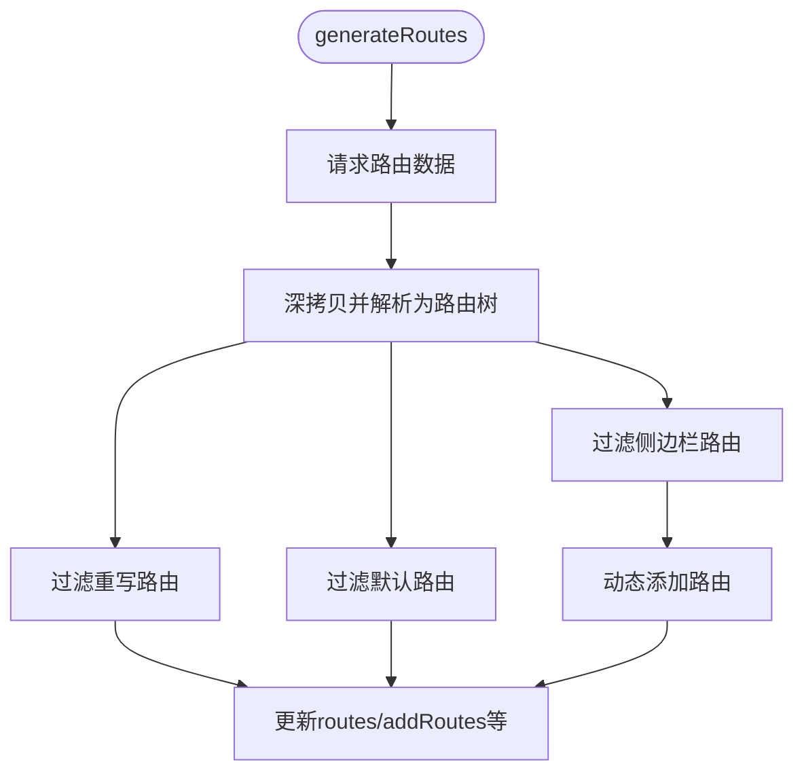
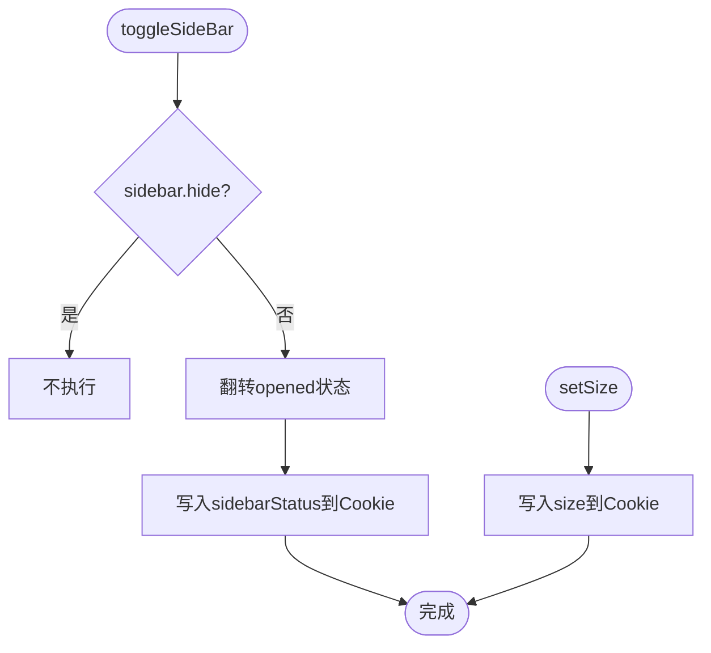
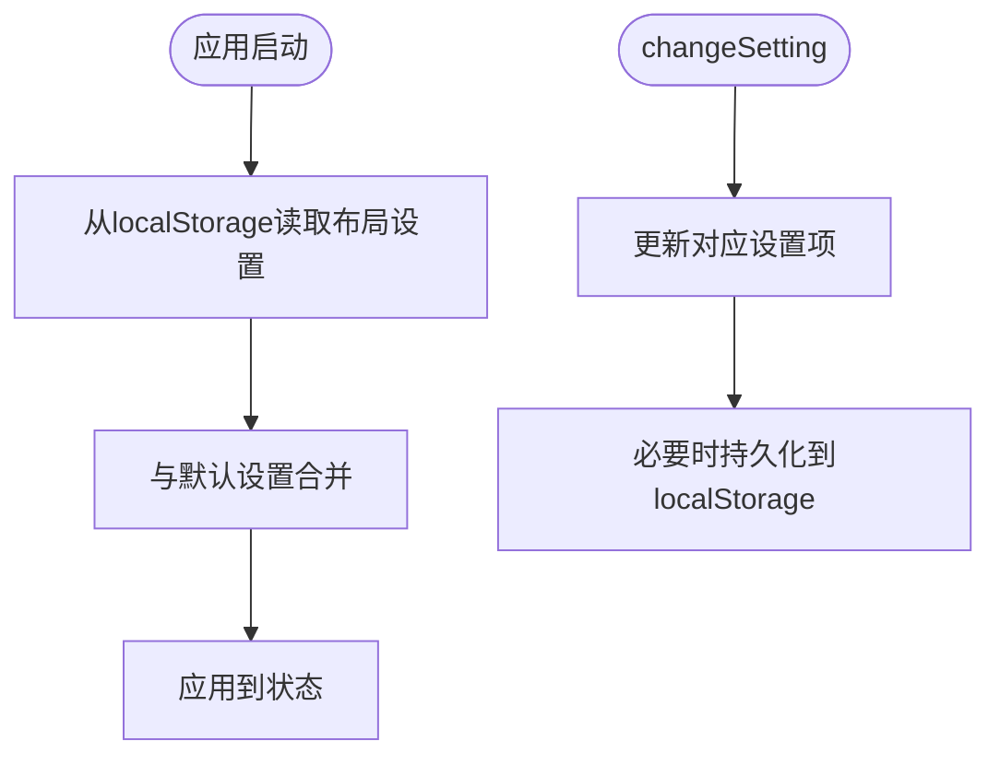
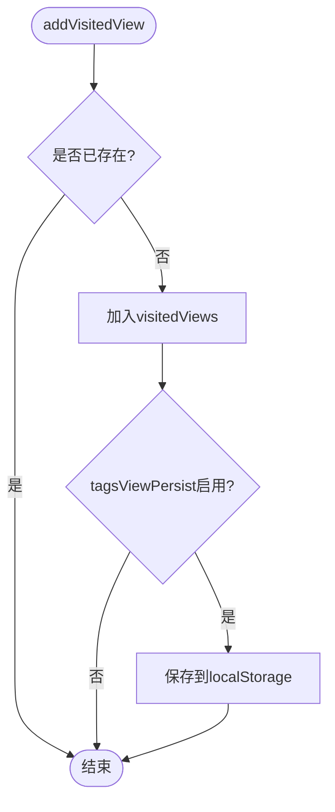
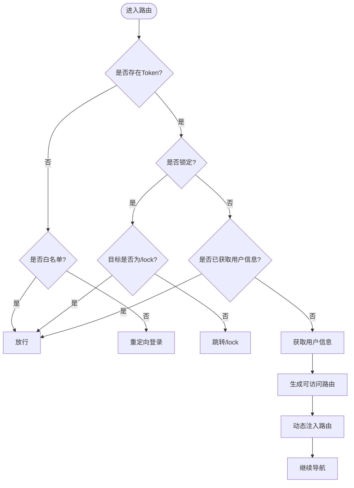
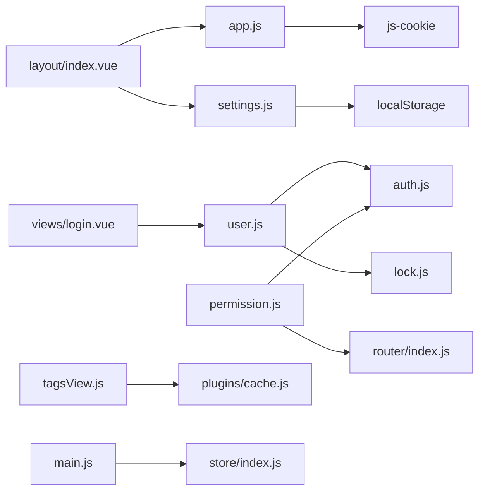

# 状态管理

<cite>
**本文引用的文件**
- [ruoyi-ui/src/store/index.js](file://ruoyi-ui/src/store/index.js)
- [ruoyi-ui/src/store/modules/user.js](file://ruoyi-ui/src/store/modules/user.js)
- [ruoyi-ui/src/store/modules/permission.js](file://ruoyi-ui/src/store/modules/permission.js)
- [ruoyi-ui/src/store/modules/app.js](file://ruoyi-ui/src/store/modules/app.js)
- [ruoyi-ui/src/store/modules/settings.js](file://ruoyi-ui/src/store/modules/settings.js)
- [ruoyi-ui/src/store/modules/tagsView.js](file://ruoyi-ui/src/store/modules/tagsView.js)
- [ruoyi-ui/src/store/modules/lock.js](file://ruoyi-ui/src/store/modules/lock.js)
- [ruoyi-ui/src/utils/auth.js](file://ruoyi-ui/src/utils/auth.js)
- [ruoyi-ui/src/plugins/cache.js](file://ruoyi-ui/src/plugins/cache.js)
- [ruoyi-ui/src/settings.js](file://ruoyi-ui/src/settings.js)
- [ruoyi-ui/src/main.js](file://ruoyi-ui/src/main.js)
- [ruoyi-ui/src/router/index.js](file://ruoyi-ui/src/router/index.js)
- [ruoyi-ui/src/permission.js](file://ruoyi-ui/src/permission.js)
- [ruoyi-ui/src/views/login.vue](file://ruoyi-ui/src/views/login.vue)
- [ruoyi-ui/src/App.vue](file://ruoyi-ui/src/App.vue)
- [ruoyi-ui/src/layout/index.vue](file://ruoyi-ui/src/layout/index.vue)
</cite>

## 目录
1. [引言](#引言)
2. [项目结构](#项目结构)
3. [核心组件](#核心组件)
4. [架构总览](#架构总览)
5. [详细组件分析](#详细组件分析)
6. [依赖分析](#依赖分析)
7. [性能考虑](#性能考虑)
8. [故障排查指南](#故障排查指南)
9. [结论](#结论)
10. [附录](#附录)

## 引言
本文件面向状态管理主题，系统梳理并解读本项目前端（基于 Vue 3 + Pinia）的状态管理实现，涵盖状态树设计、模块化组织、Actions 与 Mutations 的职责边界、用户状态与权限状态管理、缓存与持久化策略、本地存储（Cookie 与 LocalStorage）的使用场景、跨页面状态共享方案，以及最佳实践与性能优化建议。读者无需深入源码即可理解整体设计与运行机制。

## 项目结构
本项目采用 Pinia 进行状态管理，状态模块按功能域划分，分别负责用户认证、权限路由、应用外观、标签页、锁屏等子域。主入口在应用启动时注册 Pinia，并在路由守卫中驱动状态初始化与权限校验。

图表来源
- [ruoyi-ui/src/main.js:1-84](file://ruoyi-ui/src/main.js#L1-L84)
- [ruoyi-ui/src/store/index.js:1-4](file://ruoyi-ui/src/store/index.js#L1-L4)
- [ruoyi-ui/src/store/modules/user.js:1-93](file://ruoyi-ui/src/store/modules/user.js#L1-L93)
- [ruoyi-ui/src/store/modules/permission.js:1-130](file://ruoyi-ui/src/store/modules/permission.js#L1-L130)
- [ruoyi-ui/src/store/modules/app.js:1-47](file://ruoyi-ui/src/store/modules/app.js#L1-L47)
- [ruoyi-ui/src/store/modules/settings.js:1-54](file://ruoyi-ui/src/store/modules/settings.js#L1-L54)
- [ruoyi-ui/src/store/modules/tagsView.js:1-227](file://ruoyi-ui/src/store/modules/tagsView.js#L1-L227)
- [ruoyi-ui/src/store/modules/lock.js:1-28](file://ruoyi-ui/src/store/modules/lock.js#L1-L28)
- [ruoyi-ui/src/router/index.js:1-68](file://ruoyi-ui/src/router/index.js#L1-L68)
- [ruoyi-ui/src/permission.js:1-78](file://ruoyi-ui/src/permission.js#L1-L78)
- [ruoyi-ui/src/views/login.vue:1-203](file://ruoyi-ui/src/views/login.vue#L1-L203)
- [ruoyi-ui/src/layout/index.vue:1-116](file://ruoyi-ui/src/layout/index.vue#L1-L116)
- [ruoyi-ui/src/utils/auth.js:1-16](file://ruoyi-ui/src/utils/auth.js#L1-L16)
- [ruoyi-ui/src/plugins/cache.js:1-80](file://ruoyi-ui/src/plugins/cache.js#L1-L80)
- [ruoyi-ui/src/settings.js:1-68](file://ruoyi-ui/src/settings.js#L1-L68)

章节来源
- [ruoyi-ui/src/main.js:1-84](file://ruoyi-ui/src/main.js#L1-L84)
- [ruoyi-ui/src/store/index.js:1-4](file://ruoyi-ui/src/store/index.js#L1-L4)

## 核心组件
- 用户状态模块（user）
  - 负责 token、用户身份信息、角色与权限集合的读写；提供登录、获取用户信息、退出登录等动作。
  - 与 Cookie 交互以持久化 token；与锁屏模块联动解锁。
- 权限状态模块（permission）
  - 负责生成可访问路由、维护侧边栏/顶部/默认路由集合；支持按角色或权限过滤动态路由。
- 应用状态模块（app）
  - 负责侧边栏开关、设备类型、界面尺寸等应用级偏好；通过 Cookie 同步侧边栏与尺寸状态。
- 设置状态模块（settings）
  - 负责主题、导航模式、标签页、固定头部、侧边栏 Logo、动态标题等布局设置；从 localStorage 恢复用户自定义布局。
- 标签页状态模块（tagsView）
  - 负责访问历史、缓存组件名、内嵌 iframe 视图；支持持久化非固态标签页；提供增删改查与批量清理。
- 锁屏状态模块（lock）
  - 负责屏幕锁定状态与锁定路径；与路由守卫配合进行锁屏拦截。

章节来源
- [ruoyi-ui/src/store/modules/user.js:1-93](file://ruoyi-ui/src/store/modules/user.js#L1-L93)
- [ruoyi-ui/src/store/modules/permission.js:1-130](file://ruoyi-ui/src/store/modules/permission.js#L1-L130)
- [ruoyi-ui/src/store/modules/app.js:1-47](file://ruoyi-ui/src/store/modules/app.js#L1-L47)
- [ruoyi-ui/src/store/modules/settings.js:1-54](file://ruoyi-ui/src/store/modules/settings.js#L1-L54)
- [ruoyi-ui/src/store/modules/tagsView.js:1-227](file://ruoyi-ui/src/store/modules/tagsView.js#L1-L227)
- [ruoyi-ui/src/store/modules/lock.js:1-28](file://ruoyi-ui/src/store/modules/lock.js#L1-L28)

## 架构总览
下图展示从登录到路由生成、再到布局渲染的关键流程，体现状态在各模块间的流转与耦合关系。

图表来源
- [ruoyi-ui/src/views/login.vue:80-110](file://ruoyi-ui/src/views/login.vue#L80-L110)
- [ruoyi-ui/src/store/modules/user.js:20-88](file://ruoyi-ui/src/store/modules/user.js#L20-L88)
- [ruoyi-ui/src/utils/auth.js:1-16](file://ruoyi-ui/src/utils/auth.js#L1-L16)
- [ruoyi-ui/src/permission.js:21-73](file://ruoyi-ui/src/permission.js#L21-L73)
- [ruoyi-ui/src/store/modules/permission.js:35-56](file://ruoyi-ui/src/store/modules/permission.js#L35-L56)
- [ruoyi-ui/src/router/index.js:56-65](file://ruoyi-ui/src/router/index.js#L56-L65)
- [ruoyi-ui/src/layout/index.vue:16-63](file://ruoyi-ui/src/layout/index.vue#L16-L63)

## 详细组件分析

### 用户状态模块（user）
- 状态字段
  - token：来自 Cookie 的认证令牌
  - id/name/nickName/avatar：用户标识与头像
  - roles/permissions：角色与权限数组
- Actions
  - 登录：调用登录 API，解析响应中的 token，写入 Cookie 并更新状态，随后解锁屏幕
  - 获取用户信息：调用用户信息接口，处理头像 URL、角色与权限回退逻辑，填充用户态
  - 退出登录：尝试调用后端登出接口（忽略错误），清空本地状态并移除 Cookie
- 与权限的关系
  - 登录成功后由路由守卫触发获取用户信息，进而生成可访问路由

图表来源
- [ruoyi-ui/src/store/modules/user.js:20-41](file://ruoyi-ui/src/store/modules/user.js#L20-L41)
- [ruoyi-ui/src/utils/auth.js:9-11](file://ruoyi-ui/src/utils/auth.js#L9-L11)
- [ruoyi-ui/src/store/modules/lock.js:9-24](file://ruoyi-ui/src/store/modules/lock.js#L9-L24)

章节来源
- [ruoyi-ui/src/store/modules/user.js:1-93](file://ruoyi-ui/src/store/modules/user.js#L1-L93)
- [ruoyi-ui/src/utils/auth.js:1-16](file://ruoyi-ui/src/utils/auth.js#L1-L16)
- [ruoyi-ui/src/store/modules/lock.js:1-28](file://ruoyi-ui/src/store/modules/lock.js#L1-L28)

### 权限状态模块（permission）
- 职责
  - 从后端拉取路由数据，转换为可加载组件的路由结构
  - 过滤动态路由：支持按角色或权限过滤
  - 维护多套路由集合（侧边栏、顶部、默认、追加路由）
- 关键流程
  - generateRoutes：请求路由数据 -> 深拷贝三份副本 -> 过滤生成不同视图集 -> 动态注入路由 -> 更新状态
  - filterDynamicRoutes：对动态路由进行权限/角色校验
  - loadView：基于约定的视图目录进行异步组件加载

图表来源
- [ruoyi-ui/src/store/modules/permission.js:35-56](file://ruoyi-ui/src/store/modules/permission.js#L35-L56)
- [ruoyi-ui/src/store/modules/permission.js:61-86](file://ruoyi-ui/src/store/modules/permission.js#L61-L86)
- [ruoyi-ui/src/store/modules/permission.js:102-116](file://ruoyi-ui/src/store/modules/permission.js#L102-L116)
- [ruoyi-ui/src/store/modules/permission.js:118-127](file://ruoyi-ui/src/store/modules/permission.js#L118-L127)

章节来源
- [ruoyi-ui/src/store/modules/permission.js:1-130](file://ruoyi-ui/src/store/modules/permission.js#L1-L130)

### 应用状态模块（app）
- 状态
  - sidebar：opened、withoutAnimation、hide
  - device：desktop/mobile
  - size：界面尺寸
- 行为
  - 切换侧边栏：写入 Cookie 记录状态
  - 设置尺寸：写入 Cookie
  - 设备检测：根据窗口宽度切换设备类型并自动关闭移动端侧边栏

图表来源
- [ruoyi-ui/src/store/modules/app.js:15-43](file://ruoyi-ui/src/store/modules/app.js#L15-L43)

章节来源
- [ruoyi-ui/src/store/modules/app.js:1-47](file://ruoyi-ui/src/store/modules/app.js#L1-L47)

### 设置状态模块（settings）
- 状态
  - 主题、导航模式、标签页、固定头部、侧边栏 Logo、动态标题、暗黑模式等
  - 从 localStorage 恢复用户自定义布局，否则使用 settings.js 默认值
- 行为
  - changeSetting：动态更新设置项
  - setTitle：设置页面标题并触发动态标题逻辑
  - toggleTheme：切换暗黑模式

图表来源
- [ruoyi-ui/src/store/modules/settings.js:10-50](file://ruoyi-ui/src/store/modules/settings.js#L10-L50)
- [ruoyi-ui/src/settings.js:1-68](file://ruoyi-ui/src/settings.js#L1-L68)

章节来源
- [ruoyi-ui/src/store/modules/settings.js:1-54](file://ruoyi-ui/src/store/modules/settings.js#L1-L54)
- [ruoyi-ui/src/settings.js:1-68](file://ruoyi-ui/src/settings.js#L1-L68)

### 标签页状态模块（tagsView）
- 状态
  - visitedViews：访问历史（可持久化）
  - cachedViews：缓存的组件名
  - iframeViews：内嵌 iframe 视图
- 行为
  - 添加/删除/清理：支持单个、其他、右侧、左侧、全部清理
  - 持久化：当启用 tagsViewPersist 时，将非固态标签页保存到 localStorage
  - 恢复：应用启动时从 localStorage 加载并重建访问历史

图表来源
- [ruoyi-ui/src/store/modules/tagsView.js:33-53](file://ruoyi-ui/src/store/modules/tagsView.js#L33-L53)
- [ruoyi-ui/src/store/modules/tagsView.js:10-18](file://ruoyi-ui/src/store/modules/tagsView.js#L10-L18)
- [ruoyi-ui/src/plugins/cache.js:35-68](file://ruoyi-ui/src/plugins/cache.js#L35-L68)

章节来源
- [ruoyi-ui/src/store/modules/tagsView.js:1-227](file://ruoyi-ui/src/store/modules/tagsView.js#L1-L227)
- [ruoyi-ui/src/plugins/cache.js:1-80](file://ruoyi-ui/src/plugins/cache.js#L1-L80)

### 锁屏状态模块（lock）
- 状态
  - isLock：是否锁定
  - lockPath：锁定时记录的路径
- 行为
  - lockScreen：记录当前路径并标记锁定
  - unlockScreen：清除锁定状态与路径

章节来源
- [ruoyi-ui/src/store/modules/lock.js:1-28](file://ruoyi-ui/src/store/modules/lock.js#L1-L28)

### 路由守卫与状态联动（permission.js）
- 白名单控制：登录/注册免登录
- Token 校验：无 Token 重定向登录
- 锁屏拦截：处于锁定状态且目标非锁屏页时跳转锁屏
- 首次进入：拉取用户信息 -> 生成路由 -> 动态注入 -> 继续导航
- 标题设置：根据路由 meta.title 动态设置页面标题

图表来源
- [ruoyi-ui/src/permission.js:21-73](file://ruoyi-ui/src/permission.js#L21-L73)

章节来源
- [ruoyi-ui/src/permission.js:1-78](file://ruoyi-ui/src/permission.js#L1-L78)

## 依赖分析
- 模块内聚与耦合
  - user 与 auth（Cookie）耦合，用于 token 的读写
  - permission 与 router、auth、plugins（权限判断）耦合，负责路由生成与过滤
  - app 与 Cookies 耦合，负责 UI 偏好同步
  - settings 与 localStorage、settings.js 默认值耦合，负责布局持久化
  - tagsView 与 cache 插件耦合，负责标签页持久化
  - lock 与 localStorage 耦合，负责锁屏状态
- 外部依赖
  - Element Plus、js-cookie、@vueuse/core、NProgress 等

图表来源
- [ruoyi-ui/src/store/modules/user.js:1-93](file://ruoyi-ui/src/store/modules/user.js#L1-L93)
- [ruoyi-ui/src/utils/auth.js:1-16](file://ruoyi-ui/src/utils/auth.js#L1-L16)
- [ruoyi-ui/src/store/modules/lock.js:1-28](file://ruoyi-ui/src/store/modules/lock.js#L1-L28)
- [ruoyi-ui/src/store/modules/permission.js:1-130](file://ruoyi-ui/src/store/modules/permission.js#L1-L130)
- [ruoyi-ui/src/router/index.js:1-68](file://ruoyi-ui/src/router/index.js#L1-L68)
- [ruoyi-ui/src/store/modules/app.js:1-47](file://ruoyi-ui/src/store/modules/app.js#L1-L47)
- [ruoyi-ui/src/store/modules/settings.js:1-54](file://ruoyi-ui/src/store/modules/settings.js#L1-L54)
- [ruoyi-ui/src/store/modules/tagsView.js:1-227](file://ruoyi-ui/src/store/modules/tagsView.js#L1-L227)
- [ruoyi-ui/src/plugins/cache.js:1-80](file://ruoyi-ui/src/plugins/cache.js#L1-L80)
- [ruoyi-ui/src/layout/index.vue:16-63](file://ruoyi-ui/src/layout/index.vue#L16-L63)
- [ruoyi-ui/src/views/login.vue:52-110](file://ruoyi-ui/src/views/login.vue#L52-L110)
- [ruoyi-ui/src/main.js:13](file://ruoyi-ui/src/main.js#L13)

章节来源
- [ruoyi-ui/src/main.js:1-84](file://ruoyi-ui/src/main.js#L1-L84)

## 性能考虑
- 路由生成与注入
  - 仅在首次进入时生成并注入路由，避免重复开销
  - 动态路由过滤采用浅层判定，减少不必要的组件加载
- 标签页持久化
  - 仅在启用 tagsViewPersist 时写入 localStorage，降低 IO 开销
  - 对非固态标签页进行条件保存，避免持久化过多数据
- 侧边栏与尺寸
  - 通过 Cookie 同步状态，避免每次刷新都重新计算
- 暗黑模式与主题
  - 使用 @vueuse/core 的响应式开关，减少 DOM 操作频率
- 登录记忆
  - 仅在用户勾选“记住密码”时写入 Cookie，避免无谓的持久化

## 故障排查指南
- 登录后无法进入首页
  - 检查 token 是否写入 Cookie；确认路由守卫是否成功获取用户信息并生成路由
  - 参考：[登录动作与路由生成:96-107](file://ruoyi-ui/src/views/login.vue#L96-L107)，[路由守卫:39-58](file://ruoyi-ui/src/permission.js#L39-L58)
- 页面标题未更新
  - 确认路由 meta.title 是否存在；检查设置标题动作是否被调用
  - 参考：[路由守卫设置标题](file://ruoyi-ui/src/permission.js#L24)，[设置标题动作:41-44](file://ruoyi-ui/src/store/modules/settings.js#L41-L44)
- 退出登录后仍可访问受控页面
  - 确认退出登录是否清除了 token 与用户状态；检查路由守卫白名单与拦截逻辑
  - 参考：[退出登录:75-87](file://ruoyi-ui/src/store/modules/user.js#L75-L87)，[路由守卫拦截:63-72](file://ruoyi-ui/src/permission.js#L63-L72)
- 标签页未持久化
  - 检查 settings 中 tagsViewPersist 是否开启；确认 localStorage 中是否存在对应键
  - 参考：[持久化开关](file://ruoyi-ui/src/store/modules/settings.js#L22)，[持久化实现:10-18](file://ruoyi-ui/src/store/modules/tagsView.js#L10-L18)
- 侧边栏状态不同步
  - 检查 Cookie 中 sidebarStatus 是否正确写入；确认应用启动时是否读取 Cookie
  - 参考：[写入Cookie:22-26](file://ruoyi-ui/src/store/modules/app.js#L22-L26)，[读取Cookie](file://ruoyi-ui/src/store/modules/app.js#L8)

章节来源
- [ruoyi-ui/src/views/login.vue:96-107](file://ruoyi-ui/src/views/login.vue#L96-L107)
- [ruoyi-ui/src/permission.js:21-73](file://ruoyi-ui/src/permission.js#L21-L73)
- [ruoyi-ui/src/store/modules/settings.js:41-44](file://ruoyi-ui/src/store/modules/settings.js#L41-L44)
- [ruoyi-ui/src/store/modules/user.js:75-87](file://ruoyi-ui/src/store/modules/user.js#L75-L87)
- [ruoyi-ui/src/store/modules/settings.js:22](file://ruoyi-ui/src/store/modules/settings.js#L22)
- [ruoyi-ui/src/store/modules/tagsView.js:10-18](file://ruoyi-ui/src/store/modules/tagsView.js#L10-L18)
- [ruoyi-ui/src/store/modules/app.js:8](file://ruoyi-ui/src/store/modules/app.js#L8)
- [ruoyi-ui/src/store/modules/app.js:22-26](file://ruoyi-ui/src/store/modules/app.js#L22-L26)

## 结论
本项目采用 Pinia 实现清晰的状态分层：用户态、权限态、应用态、设置态、标签页态与锁屏态，彼此职责明确、耦合度低。通过 Cookie 与 localStorage 的合理分工，实现了 Token 持久化、UI 偏好与标签页历史的跨页面共享。路由守卫与状态模块协同，确保了鉴权与导航的一致性。遵循本文最佳实践与优化建议，可在保证开发效率的同时提升用户体验与系统稳定性。

## 附录
- 最佳实践
  - 将副作用（如网络请求、Cookie/Storage 操作）集中在 Actions 中，保持状态纯净
  - 对外暴露只读派生状态（computed），内部使用响应式状态（ref/reactive）
  - 对大体量数据（如标签页历史）采用条件持久化，避免过度占用存储空间
  - 在路由守卫中统一处理鉴权与导航，避免在组件中分散处理
- 性能优化
  - 避免在组件中频繁读写 Cookie/Storage；优先通过 Pinia 状态驱动
  - 对动态路由生成进行缓存与去重，减少重复注入
  - 控制标签页数量与缓存组件名，避免内存膨胀