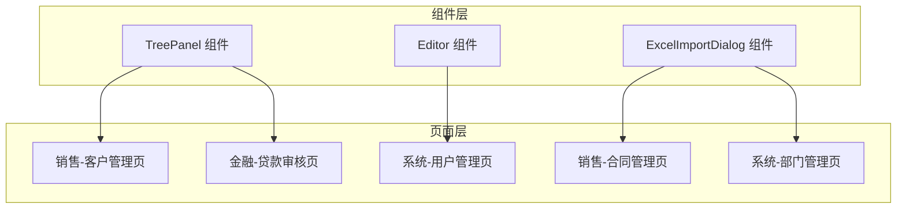
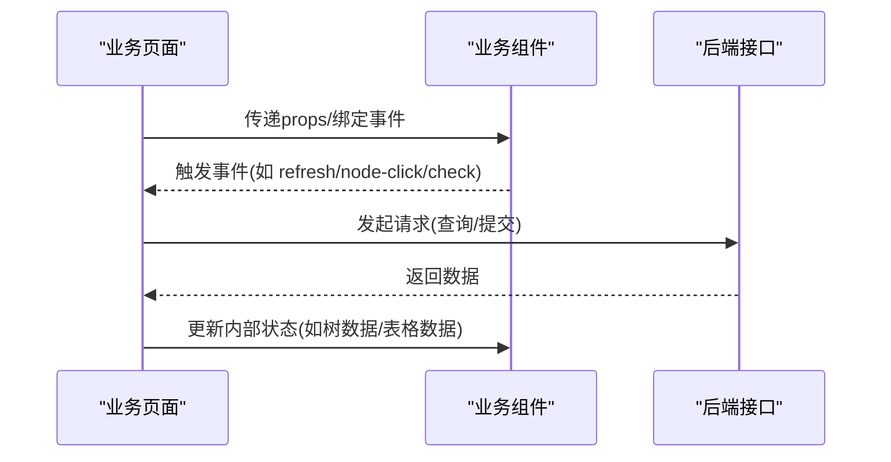
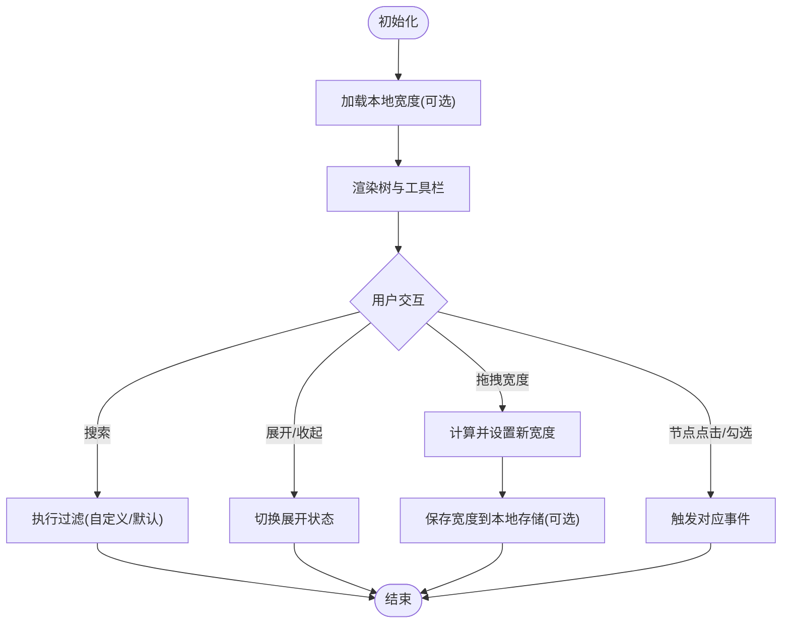
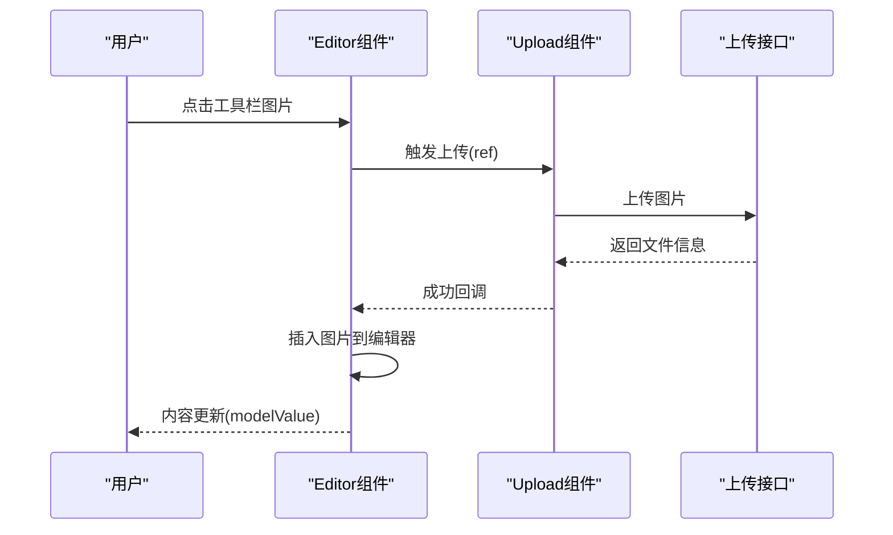
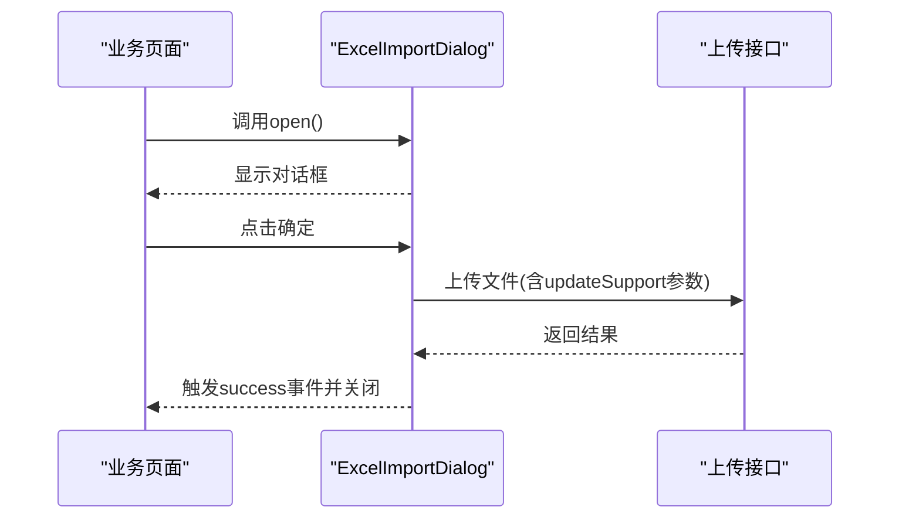
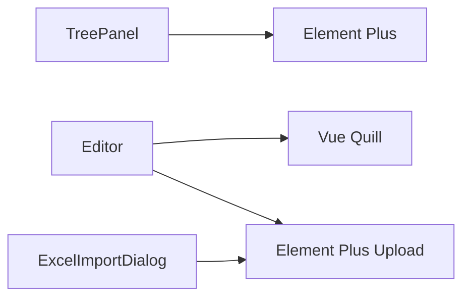

# 业务组件

<cite>
**本文引用的文件**
- [TreePanel/index.vue](file://ruoyi-ui/src/components/TreePanel/index.vue)
- [Editor/index.vue](file://ruoyi-ui/src/components/Editor/index.vue)
- [ExcelImportDialog/index.vue](file://ruoyi-ui/src/components/ExcelImportDialog/index.vue)
- [utils/index.js](file://ruoyi-ui/src/utils/index.js)
- [sales/customer/index.vue](file://ruoyi-ui/src/views/sales/customer/index.vue)
- [finance/loan-audit/index.vue](file://ruoyi-ui/src/views/finance/loan-audit/index.vue)
- [system/user/index.vue](file://ruoyi-ui/src/views/system/user/index.vue)
- [sales/contract/index.vue](file://ruoyi-ui/src/views/sales/contract/index.vue)
- [system/department/index.vue](file://ruoyi-ui/src/views/system/department/index.vue)
</cite>

## 目录
1. [简介](#简介)
2. [项目结构](#项目结构)
3. [核心组件](#核心组件)
4. [架构总览](#架构总览)
5. [详细组件分析](#详细组件分析)
6. [依赖关系分析](#依赖关系分析)
7. [性能考量](#性能考量)
8. [故障排查指南](#故障排查指南)
9. [结论](#结论)
10. [附录](#附录)

## 简介
本文件面向NeoCC项目的前端业务组件，聚焦三大专业组件：树形面板（TreePanel）、富文本编辑器（Editor）、Excel导入对话框（ExcelImportDialog）。文档从功能特性、配置参数、事件与数据绑定、使用示例与最佳实践、以及与系统其他模块的集成与数据流转等方面进行系统化阐述，帮助开发者快速理解与高效使用。

## 项目结构
业务组件位于ruoyi-ui前端工程的components目录下，配套的业务页面位于views目录中。组件以可复用的Vue单文件组件形式提供，页面通过引入组件并在模板中使用，结合API层完成数据交互。

图表来源
- [TreePanel/index.vue:1-757](file://ruoyi-ui/src/components/TreePanel/index.vue#L1-L757)
- [Editor/index.vue:1-277](file://ruoyi-ui/src/components/Editor/index.vue#L1-L277)
- [ExcelImportDialog/index.vue:1-138](file://ruoyi-ui/src/components/ExcelImportDialog/index.vue#L1-L138)
- [sales/customer/index.vue:1-188](file://ruoyi-ui/src/views/sales/customer/index.vue#L1-L188)
- [finance/loan-audit/index.vue:1-215](file://ruoyi-ui/src/views/finance/loan-audit/index.vue#L1-L215)
- [system/user/index.vue:1-271](file://ruoyi-ui/src/views/system/user/index.vue#L1-L271)
- [sales/contract/index.vue:1-218](file://ruoyi-ui/src/views/sales/contract/index.vue#L1-L218)
- [system/department/index.vue:1-185](file://ruoyi-ui/src/views/system/department/index.vue#L1-L185)

章节来源
- [TreePanel/index.vue:1-757](file://ruoyi-ui/src/components/TreePanel/index.vue#L1-L757)
- [Editor/index.vue:1-277](file://ruoyi-ui/src/components/Editor/index.vue#L1-L277)
- [ExcelImportDialog/index.vue:1-138](file://ruoyi-ui/src/components/ExcelImportDialog/index.vue#L1-L138)

## 核心组件
- 树形面板（TreePanel）：提供可折叠侧边栏、可拖拽宽度、树节点搜索、展开/收起控制、节点点击/勾选事件、本地宽度持久化等功能。
- 富文本编辑器（Editor）：基于Quill封装，支持工具栏、图片上传（URL模式）、粘贴图片、只读模式、尺寸控制等。
- Excel导入对话框（ExcelImportDialog）：基于Element Plus Upload封装，支持模板下载、覆盖更新开关、进度提示、上传成功回调等。

章节来源
- [TreePanel/index.vue:75-525](file://ruoyi-ui/src/components/TreePanel/index.vue#L75-L525)
- [Editor/index.vue:43-196](file://ruoyi-ui/src/components/Editor/index.vue#L43-L196)
- [ExcelImportDialog/index.vue:30-137](file://ruoyi-ui/src/components/ExcelImportDialog/index.vue#L30-L137)

## 架构总览
三个业务组件均采用Vue 3 Composition API风格，通过props接收配置、通过events向外抛出状态变更、通过expose暴露内部方法供父组件调用。页面通过ref调用组件方法或监听事件，完成业务流程闭环。

图表来源
- [TreePanel/index.vue:181-372](file://ruoyi-ui/src/components/TreePanel/index.vue#L181-L372)
- [Editor/index.vue:117-196](file://ruoyi-ui/src/components/Editor/index.vue#L117-L196)
- [ExcelImportDialog/index.vue:78-137](file://ruoyi-ui/src/components/ExcelImportDialog/index.vue#L78-L137)

## 详细组件分析

### 树形面板（TreePanel）
- 功能特性
  - 可折叠/展开侧边栏，支持拖拽调整宽度，并具备最小/最大宽度约束。
  - 内置搜索框，支持自定义过滤方法；支持展开/收起全部节点。
  - 支持Element Tree的节点点击、勾选、展开/折叠事件透传。
  - 支持本地存储宽度，提升用户体验一致性。
- 配置参数
  - treeData、title、titleIcon、showSearch、searchPlaceholder、defaultCollapsed、treeProps、nodeKey、expandOnClickNode、showCheckbox、checkStrictly、defaultExpandAll、defaultExpandedKeys、defaultWidth、collapsedWidth、minWidth、maxWidth、storageKey、enableStorage、filterMethod。
- 事件与数据绑定
  - 事件：collapsed-change、expanded-all-change、refresh、node-click、check、node-expand、node-collapse、search。
  - 暴露方法：setCurrentKey、getCurrentNode、getCurrentKey、setCheckedKeys、getCheckedKeys、clearSearch、filter、resetWidth、getCurrentWidth、setWidth、expandAllNodes、collapseAllNodes、toggleCollapsed、treeRef。
- 使用示例与最佳实践
  - 在需要层级导航或筛选的页面（如销售客户管理、金融贷款审核）中，将树作为左侧导航或筛选条件容器。
  - 结合本地存储宽度，确保用户偏好持久化。
  - 使用filterMethod实现自定义搜索逻辑；在大量数据场景下建议服务端过滤或虚拟滚动优化。
- 数据流
  - 页面向组件传入treeData与配置；组件内部维护搜索关键字与展开状态；通过事件向上反馈交互结果；页面根据结果更新表格或其他视图。

图表来源
- [TreePanel/index.vue:214-301](file://ruoyi-ui/src/components/TreePanel/index.vue#L214-L301)
- [TreePanel/index.vue:425-498](file://ruoyi-ui/src/components/TreePanel/index.vue#L425-L498)

章节来源
- [TreePanel/index.vue:75-525](file://ruoyi-ui/src/components/TreePanel/index.vue#L75-L525)

### 富文本编辑器（Editor）
- 功能特性
  - 提供基础富文本编辑能力（加粗、斜体、列表、对齐、链接、图片、视频等）。
  - 图片上传支持两种模式：URL模式（通过Upload组件触发插入）与Base64模式（未在此组件中启用）。
  - 支持粘贴图片自动上传并插入。
  - 支持只读模式、高度/最小高度控制。
- 配置参数
  - modelValue（双向绑定内容）、height、minHeight、readOnly、fileSize、type（url/base64）。
- 事件与数据绑定
  - 通过textChange事件同步modelValue，保证v-model双向绑定生效。
  - 图片上传通过before-upload、on-success、on-error钩子处理。
- 使用示例与最佳实践
  - 在需要富文本输入的表单或详情页中使用；注意控制文件大小与类型，避免过大资源影响性能。
  - 在URL模式下，确保后端上传接口可用且鉴权头正确传递。
- 数据流
  - 用户编辑内容 -> Quill实例 -> 同步到组件内部content -> 通过事件回推给父组件 -> 父组件持久化。

图表来源
- [Editor/index.vue:117-196](file://ruoyi-ui/src/components/Editor/index.vue#L117-L196)

章节来源
- [Editor/index.vue:43-196](file://ruoyi-ui/src/components/Editor/index.vue#L43-L196)

### Excel导入对话框（ExcelImportDialog）
- 功能特性
  - 支持拖拽/点击上传.xlxs/.xls文件。
  - 支持模板下载（可配置模板接口与文件名前缀）。
  - 支持“是否更新已存在数据”的勾选项，动态拼接到上传URL。
  - 上传进度与成功提示，成功后弹窗展示结果消息。
- 配置参数
  - title、width、action（必填，上传接口路径）、templateAction（可选，模板下载接口）、templateFileName、updateSupportLabel。
- 事件与数据绑定
  - 事件：success（上传成功后触发）。
  - 暴露方法：open（供父组件打开对话框）。
- 使用示例与最佳实践
  - 在批量导入数据的页面中使用，如合同管理、部门管理等；确保后端接口支持updateSupport参数。
  - 上传前校验文件类型与大小，避免无效文件占用带宽。
- 数据流
  - 父组件调用open -> 用户选择文件 -> 父组件点击确定 -> 组件提交上传 -> 成功后关闭对话框并触发success事件。

图表来源
- [ExcelImportDialog/index.vue:78-137](file://ruoyi-ui/src/components/ExcelImportDialog/index.vue#L78-L137)

章节来源
- [ExcelImportDialog/index.vue:30-137](file://ruoyi-ui/src/components/ExcelImportDialog/index.vue#L30-L137)

## 依赖关系分析
- 组件间耦合
  - TreePanel与Editor、ExcelImportDialog均为独立UI组件，彼此无直接依赖。
- 与页面的耦合
  - TreePanel常用于销售/金融类页面的左侧导航或筛选容器。
  - Editor多用于系统/销售类页面的描述性文本输入。
  - ExcelImportDialog多用于销售/系统类页面的数据导入。
- 外部依赖
  - TreePanel依赖Element Plus Tree与工具栏图标。
  - Editor依赖@vueup/vue-quill与Element Plus Upload。
  - ExcelImportDialog依赖Element Plus Upload与下载工具。

图表来源
- [TreePanel/index.vue:42-69](file://ruoyi-ui/src/components/TreePanel/index.vue#L42-L69)
- [Editor/index.vue:30-33](file://ruoyi-ui/src/components/Editor/index.vue#L30-L33)
- [ExcelImportDialog/index.vue:3-15](file://ruoyi-ui/src/components/ExcelImportDialog/index.vue#L3-L15)

章节来源
- [TreePanel/index.vue:42-69](file://ruoyi-ui/src/components/TreePanel/index.vue#L42-L69)
- [Editor/index.vue:30-33](file://ruoyi-ui/src/components/Editor/index.vue#L30-L33)
- [ExcelImportDialog/index.vue:3-15](file://ruoyi-ui/src/components/ExcelImportDialog/index.vue#L3-L15)

## 性能考量
- TreePanel
  - 大数据量树节点建议配合懒加载或服务端过滤，避免一次性渲染过多节点导致卡顿。
  - 拖拽宽度使用requestAnimationFrame节流，减少频繁重排。
  - 本地存储宽度仅在非折叠状态下保存，避免不必要的IO。
- Editor
  - 图片上传建议限制文件大小与格式，避免大体积图片影响编辑器性能。
  - 粘贴图片上传采用异步处理，避免阻塞主线程。
- ExcelImportDialog
  - 上传前进行文件类型与大小校验，减少无效请求。
  - 成功后弹窗展示结果，避免重复渲染整个页面。

## 故障排查指南
- TreePanel
  - 无法保存宽度：检查localStorage权限与enableStorage配置。
  - 搜索无效：确认filterMethod是否正确实现或未传入。
  - 展开/收起异常：检查defaultExpandAll与内部expandedAll状态同步。
- Editor
  - 图片无法插入：检查上传接口返回结构与Authorization头是否正确。
  - 粘贴图片失败：确认浏览器剪贴板权限与before-upload校验逻辑。
- ExcelImportDialog
  - 模板下载链接不可用：确认templateAction是否传入且接口可用。
  - 上传失败：检查action参数与updateSupport拼接逻辑。

章节来源
- [TreePanel/index.vue:274-301](file://ruoyi-ui/src/components/TreePanel/index.vue#L274-L301)
- [Editor/index.vue:133-172](file://ruoyi-ui/src/components/Editor/index.vue#L133-L172)
- [ExcelImportDialog/index.vue:96-134](file://ruoyi-ui/src/components/ExcelImportDialog/index.vue#L96-L134)

## 结论
TreePanel、Editor、ExcelImportDialog三类业务组件分别覆盖了“导航/筛选”、“富文本输入”、“批量数据导入”的核心场景。通过清晰的props/事件/暴露方法设计，组件与页面之间形成高内聚低耦合的关系，便于在不同业务页面中复用与扩展。建议在实际使用中结合业务场景选择合适的配置与事件处理策略，并关注性能与安全细节。

## 附录
- 业务页面中的典型使用
  - 销售-客户管理页：可结合TreePanel作为筛选容器，配合表格与对话框完成CRUD。
  - 金融-贷款审核页：可结合TreePanel进行业务树状导航，配合Editor展示审批意见或说明。
  - 系统-用户管理页：可结合ExcelImportDialog进行批量用户导入。
  - 销售-合同管理页：可结合ExcelImportDialog进行批量合同导入。
  - 系统-部门管理页：可结合ExcelImportDialog进行批量部门导入。

章节来源
- [sales/customer/index.vue:1-188](file://ruoyi-ui/src/views/sales/customer/index.vue#L1-L188)
- [finance/loan-audit/index.vue:1-215](file://ruoyi-ui/src/views/finance/loan-audit/index.vue#L1-L215)
- [system/user/index.vue:1-271](file://ruoyi-ui/src/views/system/user/index.vue#L1-L271)
- [sales/contract/index.vue:1-218](file://ruoyi-ui/src/views/sales/contract/index.vue#L1-L218)
- [system/department/index.vue:1-185](file://ruoyi-ui/src/views/system/department/index.vue#L1-L185)