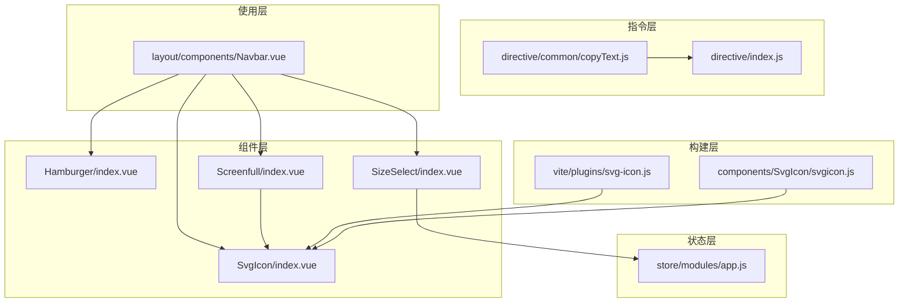
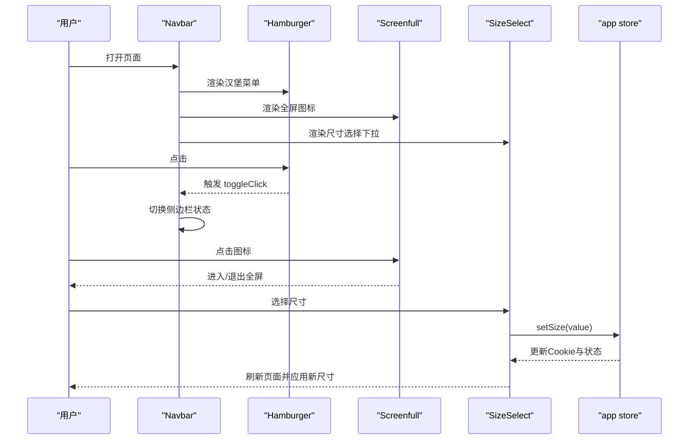
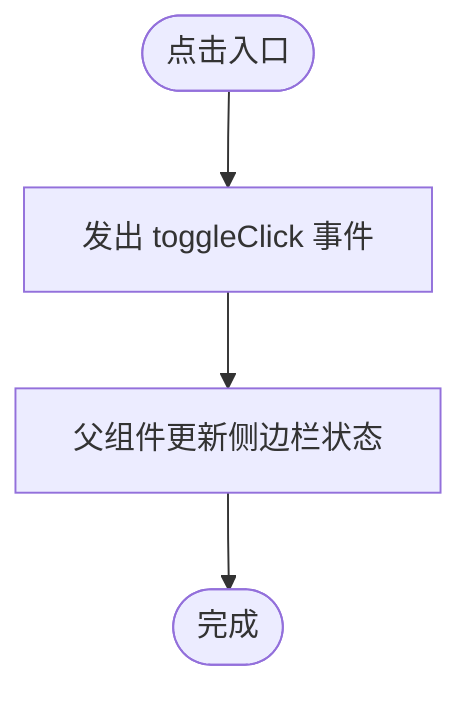
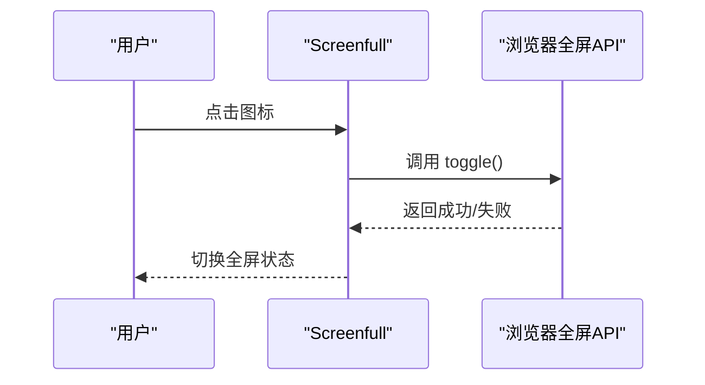
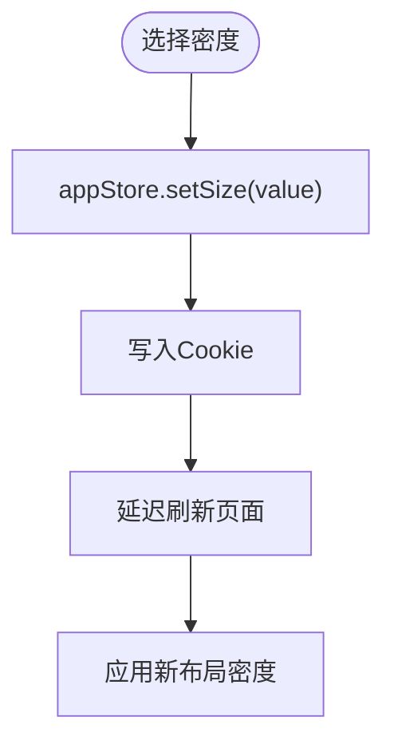
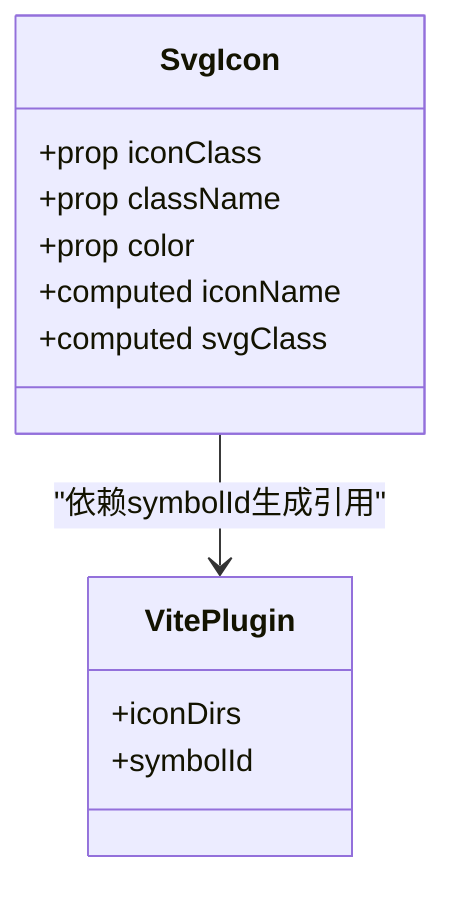
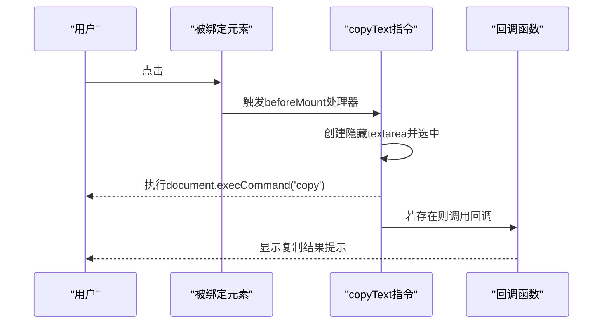
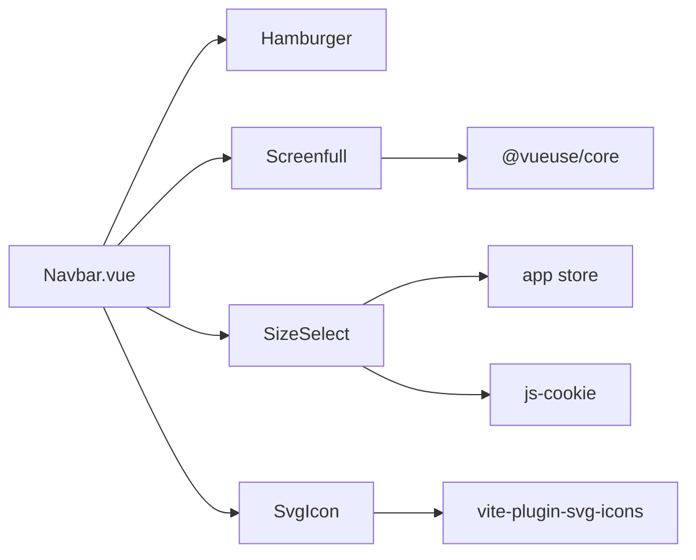

# 工具组件

<cite>
**本文引用的文件**
- [Hamburger/index.vue](file://ruoyi-ui/src/components/Hamburger/index.vue)
- [Screenfull/index.vue](file://ruoyi-ui/src/components/Screenfull/index.vue)
- [SizeSelect/index.vue](file://ruoyi-ui/src/components/SizeSelect/index.vue)
- [SvgIcon/index.vue](file://ruoyi-ui/src/components/SvgIcon/index.vue)
- [SvgIcon/svgicon.js](file://ruoyi-ui/src/components/SvgIcon/svgicon.js)
- [svg-icon.js](file://ruoyi-ui/vite/plugins/svg-icon.js)
- [copyText.js](file://ruoyi-ui/src/directive/common/copyText.js)
- [directive/index.js](file://ruoyi-ui/src/directive/index.js)
- [app.js](file://ruoyi-ui/src/store/modules/app.js)
- [Navbar.vue](file://ruoyi-ui/src/layout/components/Navbar.vue)
</cite>

## 目录
1. [简介](#简介)
2. [项目结构](#项目结构)
3. [核心组件](#核心组件)
4. [架构总览](#架构总览)
5. [详细组件分析](#详细组件分析)
6. [依赖关系分析](#依赖关系分析)
7. [性能考量](#性能考量)
8. [故障排查指南](#故障排查指南)
9. [结论](#结论)
10. [附录](#附录)

## 简介
本章节面向NeoCC前端工程中的工具组件，系统性梳理汉堡菜单、全屏切换、尺寸选择、SVG图标与复制按钮等辅助功能组件的实现原理、使用场景、配置选项与可扩展点。文档同时阐述设计理念（如响应式布局、无障碍访问）、用户体验优化策略以及可复用的自定义组件开发指南，帮助开发者在不破坏现有架构的前提下进行二次开发与定制。

## 项目结构
工具组件主要位于ruoyi-ui前端工程的components目录下，并通过指令系统与状态管理模块协同工作。关键文件分布如下：
- 组件层：Hamburger、Screenfull、SizeSelect、SvgIcon
- 指令层：copyText文本复制指令
- 状态层：应用全局状态app store
- 构建层：Vite插件注册SVG图标符号
- 使用层：Navbar导航栏集成上述组件

**图表来源**
- [Hamburger/index.vue:1-43](file://ruoyi-ui/src/components/Hamburger/index.vue#L1-L43)
- [Screenfull/index.vue:1-22](file://ruoyi-ui/src/components/Screenfull/index.vue#L1-L22)
- [SizeSelect/index.vue:1-43](file://ruoyi-ui/src/components/SizeSelect/index.vue#L1-L43)
- [SvgIcon/index.vue:1-54](file://ruoyi-ui/src/components/SvgIcon/index.vue#L1-L54)
- [copyText.js:1-66](file://ruoyi-ui/src/directive/common/copyText.js#L1-L66)
- [directive/index.js:1-9](file://ruoyi-ui/src/directive/index.js#L1-L9)
- [app.js:1-47](file://ruoyi-ui/src/store/modules/app.js#L1-L47)
- [svg-icon.js:1-11](file://ruoyi-ui/vite/plugins/svg-icon.js#L1-L11)
- [SvgIcon/svgicon.js:1-11](file://ruoyi-ui/src/components/SvgIcon/svgicon.js#L1-L11)
- [Navbar.vue:1-205](file://ruoyi-ui/src/layout/components/Navbar.vue#L1-L205)

**章节来源**
- [Hamburger/index.vue:1-43](file://ruoyi-ui/src/components/Hamburger/index.vue#L1-L43)
- [Screenfull/index.vue:1-22](file://ruoyi-ui/src/components/Screenfull/index.vue#L1-L22)
- [SizeSelect/index.vue:1-43](file://ruoyi-ui/src/components/SizeSelect/index.vue#L1-L43)
- [SvgIcon/index.vue:1-54](file://ruoyi-ui/src/components/SvgIcon/index.vue#L1-L54)
- [copyText.js:1-66](file://ruoyi-ui/src/directive/common/copyText.js#L1-L66)
- [directive/index.js:1-9](file://ruoyi-ui/src/directive/index.js#L1-L9)
- [app.js:1-47](file://ruoyi-ui/src/store/modules/app.js#L1-L47)
- [svg-icon.js:1-11](file://ruoyi-ui/vite/plugins/svg-icon.js#L1-L11)
- [SvgIcon/svgicon.js:1-11](file://ruoyi-ui/src/components/SvgIcon/svgicon.js#L1-L11)
- [Navbar.vue:1-205](file://ruoyi-ui/src/layout/components/Navbar.vue#L1-L205)

## 核心组件
本节对五个工具组件进行概览式说明，涵盖职责、输入输出、典型用法与注意事项。

- 汉堡菜单（Hamburger）
  - 职责：触发侧边栏展开/收起的入口按钮，支持激活态旋转视觉反馈。
  - 关键属性：isActive（布尔），用于控制旋转态。
  - 事件：toggleClick（点击时向外发出）。
  - 场景：移动端或窄屏下作为侧边栏开关入口。
  - 参考路径：[Hamburger/index.vue:17-28](file://ruoyi-ui/src/components/Hamburger/index.vue#L17-L28)

- 全屏切换（Screenfull）
  - 职责：切换浏览器窗口全屏状态。
  - 依赖：@vueuse/core 的 useFullscreen。
  - 图标：根据是否全屏动态切换“进入全屏/退出全屏”图标。
  - 场景：报表、仪表盘、演示页面等需要沉浸式体验的界面。
  - 参考路径：[Screenfull/index.vue:1-11](file://ruoyi-ui/src/components/Screenfull/index.vue#L1-L11)

- 尺寸选择（SizeSelect）
  - 职责：切换全局布局密度（大/默认/小）。
  - 依赖：应用状态模块app store，持久化到Cookie。
  - 行为：弹出下拉菜单选择后，加载提示并刷新页面以应用新尺寸。
  - 场景：不同用户偏好或高分辨率显示器下的布局适配。
  - 参考路径：[SizeSelect/index.vue:1-35](file://ruoyi-ui/src/components/SizeSelect/index.vue#L1-L35)，[app.js:36-39](file://ruoyi-ui/src/store/modules/app.js#L36-L39)

- SVG图标（SvgIcon）
  - 职责：统一渲染项目内SVG图标，支持颜色与类名定制。
  - 机制：基于symbolId拼接的图标ID，通过<use xlink:href>引用。
  - 注册：Vite插件批量注入；Element Plus图标也可按需注册。
  - 场景：菜单、按钮、工具栏等高频图标展示。
  - 参考路径：[SvgIcon/index.vue:1-34](file://ruoyi-ui/src/components/SvgIcon/index.vue#L1-L34)，[svg-icon.js:1-11](file://ruoyi-ui/vite/plugins/svg-icon.js#L1-L11)，[SvgIcon/svgicon.js:1-11](file://ruoyi-ui/src/components/SvgIcon/svgicon.js#L1-L11)

- 复制按钮（copyText指令）
  - 职责：为元素绑定点击复制行为，支持回调通知。
  - 实现：动态创建隐藏textarea，选中并执行复制，恢复焦点。
  - 场景：复制链接、密钥、代码片段等短文本。
  - 参考路径：[copyText.js:1-66](file://ruoyi-ui/src/directive/common/copyText.js#L1-L66)，[directive/index.js:1-9](file://ruoyi-ui/src/directive/index.js#L1-L9)

**章节来源**
- [Hamburger/index.vue:17-28](file://ruoyi-ui/src/components/Hamburger/index.vue#L17-L28)
- [Screenfull/index.vue:1-11](file://ruoyi-ui/src/components/Screenfull/index.vue#L1-L11)
- [SizeSelect/index.vue:1-35](file://ruoyi-ui/src/components/SizeSelect/index.vue#L1-L35)
- [SvgIcon/index.vue:1-34](file://ruoyi-ui/src/components/SvgIcon/index.vue#L1-L34)
- [svg-icon.js:1-11](file://ruoyi-ui/vite/plugins/svg-icon.js#L1-L11)
- [SvgIcon/svgicon.js:1-11](file://ruoyi-ui/src/components/SvgIcon/svgicon.js#L1-L11)
- [copyText.js:1-66](file://ruoyi-ui/src/directive/common/copyText.js#L1-L66)
- [directive/index.js:1-9](file://ruoyi-ui/src/directive/index.js#L1-L9)
- [app.js:36-39](file://ruoyi-ui/src/store/modules/app.js#L36-L39)

## 架构总览
工具组件通过以下方式协同工作：
- 组件通过props与事件与父组件通信；
- 屏幕尺寸与主题等全局状态由app store集中管理；
- SVG图标通过Vite插件在构建期注入symbol，运行时按需引用；
- 复制指令通过全局注册在任意元素上启用复制能力；
- Navbar作为容器组件，统一集成汉堡菜单、全屏、尺寸选择与图标等工具。

**图表来源**
- [Navbar.vue:1-205](file://ruoyi-ui/src/layout/components/Navbar.vue#L1-L205)
- [Hamburger/index.vue:25-28](file://ruoyi-ui/src/components/Hamburger/index.vue#L25-L28)
- [Screenfull/index.vue:1-11](file://ruoyi-ui/src/components/Screenfull/index.vue#L1-L11)
- [SizeSelect/index.vue:30-34](file://ruoyi-ui/src/components/SizeSelect/index.vue#L30-L34)
- [app.js:36-39](file://ruoyi-ui/src/store/modules/app.js#L36-L39)

## 详细组件分析

### 汉堡菜单（Hamburger）
- 设计理念
  - 采用矢量SVG，保证缩放清晰度；通过CSS类切换实现旋转动画，直观表达当前状态。
  - 点击区域预留内边距，提升移动端可触达性。
- 数据流
  - 输入：isActive（来自父组件传递）。
  - 输出：toggleClick（供父组件监听）。
- 无障碍与可用性
  - 建议在父组件中为按钮添加aria-label与role=button，确保读屏器可识别。
- 性能与复杂度
  - 无状态组件，渲染开销极低；样式切换为O(1)。
- 自定义扩展
  - 可新增尺寸/颜色变量；支持传入自定义图标路径（需配合SvgIcon统一管理）。

**图表来源**
- [Hamburger/index.vue:25-28](file://ruoyi-ui/src/components/Hamburger/index.vue#L25-L28)

**章节来源**
- [Hamburger/index.vue:17-28](file://ruoyi-ui/src/components/Hamburger/index.vue#L17-L28)

### 全屏切换（Screenfull）
- 设计理念
  - 基于@vueuse/core的useFullscreen，自动处理浏览器兼容与事件监听。
  - 图标随状态动态切换，减少认知负担。
- 数据流
  - 状态：isFullscreen（只读）。
  - 行为：toggle（调用后切换全屏）。
- 无障碍与可用性
  - 建议在点击区域外提供键盘快捷键替代方案。
- 错误处理
  - 浏览器限制或安全策略可能阻止全屏，应提供降级提示。
- 自定义扩展
  - 可增加全屏前确认对话框；支持指定全屏目标元素。

**图表来源**
- [Screenfull/index.vue:8-11](file://ruoyi-ui/src/components/Screenfull/index.vue#L8-L11)

**章节来源**
- [Screenfull/index.vue:1-11](file://ruoyi-ui/src/components/Screenfull/index.vue#L1-L11)

### 尺寸选择（SizeSelect）
- 设计理念
  - 通过下拉菜单提供三种预设密度，统一风格与一致性。
  - 切换后短暂加载提示，避免用户误以为无响应。
- 数据流
  - 状态：从app store读取当前size。
  - 行为：handleSetSize -> appStore.setSize -> Cookie持久化 -> 页面刷新。
- 无障碍与可用性
  - disabled项应提供视觉与语义提示；建议支持键盘操作（Tab/Enter）。
- 性能与复杂度
  - 切换为O(1)；页面刷新成本较高，建议在大型应用中考虑热更新策略。
- 自定义扩展
  - 支持新增密度选项；可接入主题系统，动态计算字体/间距。

**图表来源**
- [SizeSelect/index.vue:30-34](file://ruoyi-ui/src/components/SizeSelect/index.vue#L30-L34)
- [app.js:36-39](file://ruoyi-ui/src/store/modules/app.js#L36-L39)

**章节来源**
- [SizeSelect/index.vue:1-35](file://ruoyi-ui/src/components/SizeSelect/index.vue#L1-L35)
- [app.js:36-39](file://ruoyi-ui/src/store/modules/app.js#L36-L39)

### SVG图标（SvgIcon）
- 设计理念
  - 统一图标命名规范与渲染方式，降低维护成本。
  - 支持颜色继承与类名扩展，便于主题化。
- 数据流
  - 输入：iconClass（必需）、className（可选）、color（可选）。
  - 输出：计算后的iconName与svgClass。
- 无障碍与可用性
  - 建议在图标外层包裹可访问标签，描述其语义用途。
- 性能与复杂度
  - 渲染为O(1)；symbol复用避免重复资源。
- 自定义扩展
  - 新增图标：放入构建目录，重启开发服务器；或调整Vite插件配置。
  - Element Plus图标：通过svgicon.js批量注册。

**图表来源**
- [SvgIcon/index.vue:9-34](file://ruoyi-ui/src/components/SvgIcon/index.vue#L9-L34)
- [svg-icon.js:5-8](file://ruoyi-ui/vite/plugins/svg-icon.js#L5-L8)

**章节来源**
- [SvgIcon/index.vue:1-34](file://ruoyi-ui/src/components/SvgIcon/index.vue#L1-L34)
- [svg-icon.js:1-11](file://ruoyi-ui/vite/plugins/svg-icon.js#L1-L11)
- [SvgIcon/svgicon.js:1-11](file://ruoyi-ui/src/components/SvgIcon/svgicon.js#L1-L11)

### 复制按钮（copyText指令）
- 设计理念
  - 通过指令抽象复制逻辑，避免在各组件重复实现。
  - 支持回调，便于统一提示与埋点。
- 数据流
  - 输入：绑定值（要复制的文本）、参数（callback表示回调）。
  - 行为：点击触发复制，成功后执行回调。
- 无障碍与可用性
  - 建议提供复制成功提示（Toast/Tooltip）；为按钮提供aria-label。
- 安全与兼容性
  - 移动端需注意虚拟键盘弹起与焦点恢复；部分浏览器禁用自动复制需降级处理。
- 自定义扩展
  - 支持复制HTML片段；可增加权限校验与审计日志。

**图表来源**
- [copyText.js:6-20](file://ruoyi-ui/src/directive/common/copyText.js#L6-L20)
- [copyText.js:23-65](file://ruoyi-ui/src/directive/common/copyText.js#L23-L65)

**章节来源**
- [copyText.js:1-66](file://ruoyi-ui/src/directive/common/copyText.js#L1-L66)
- [directive/index.js:1-9](file://ruoyi-ui/src/directive/index.js#L1-L9)

## 依赖关系分析
- 组件间耦合
  - Hamburger与Navbar强耦合（状态由Navbar传递）。
  - Screenfull依赖SvgIcon图标；SizeSelect依赖app store。
- 外部依赖
  - @vueuse/core：Screenfull全屏能力。
  - js-cookie：SizeSelect持久化。
  - Vite插件：SvgIcon构建期注入。
- 潜在循环依赖
  - 当前结构无明显循环；若在store中引入UI逻辑需谨慎。
- 接口契约
  - 组件通过props与事件通信；指令通过钩子暴露生命周期。

**图表来源**
- [Navbar.vue:1-205](file://ruoyi-ui/src/layout/components/Navbar.vue#L1-L205)
- [Screenfull/index.vue:8-11](file://ruoyi-ui/src/components/Screenfull/index.vue#L8-L11)
- [SizeSelect/index.vue:19-22](file://ruoyi-ui/src/components/SizeSelect/index.vue#L19-L22)
- [app.js:1-47](file://ruoyi-ui/src/store/modules/app.js#L1-L47)
- [svg-icon.js:1-11](file://ruoyi-ui/vite/plugins/svg-icon.js#L1-L11)

**章节来源**
- [Navbar.vue:1-205](file://ruoyi-ui/src/layout/components/Navbar.vue#L1-L205)
- [Screenfull/index.vue:8-11](file://ruoyi-ui/src/components/Screenfull/index.vue#L8-L11)
- [SizeSelect/index.vue:19-22](file://ruoyi-ui/src/components/SizeSelect/index.vue#L19-L22)
- [app.js:1-47](file://ruoyi-ui/src/store/modules/app.js#L1-L47)
- [svg-icon.js:1-11](file://ruoyi-ui/vite/plugins/svg-icon.js#L1-L11)

## 性能考量
- 渲染成本
  - 汉堡菜单与SVG图标均为轻量渲染；Screenfull切换为浏览器API驱动。
- 状态持久化
  - 尺寸选择通过Cookie保存，避免每次进入重新计算。
- 页面刷新
  - 尺寸切换采用reload，简单可靠；在大型应用中可考虑热更新以减少抖动。
- 图标体积
  - 构建期合并与压缩，运行时按需引用symbol，避免重复下载。

## 故障排查指南
- 全屏不可用
  - 检查浏览器是否允许全屏（HTTPS、用户手势）；尝试手动触发全屏API。
  - 参考路径：[Screenfull/index.vue:8-11](file://ruoyi-ui/src/components/Screenfull/index.vue#L8-L11)
- 尺寸切换无效
  - 确认Cookie写入成功；检查setSize动作是否被调用。
  - 参考路径：[SizeSelect/index.vue:30-34](file://ruoyi-ui/src/components/SizeSelect/index.vue#L30-L34)，[app.js:36-39](file://ruoyi-ui/src/store/modules/app.js#L36-L39)
- 图标不显示
  - 确认图标文件已放入构建目录且命名符合symbolId规则；重启开发服务器。
  - 参考路径：[svg-icon.js:5-8](file://ruoyi-ui/vite/plugins/svg-icon.js#L5-L8)，[SvgIcon/index.vue:25-32](file://ruoyi-ui/src/components/SvgIcon/index.vue#L25-L32)
- 复制失败
  - 移动端可能触发虚拟键盘或被浏览器拦截；检查回调是否执行。
  - 参考路径：[copyText.js:23-65](file://ruoyi-ui/src/directive/common/copyText.js#L23-L65)

**章节来源**
- [Screenfull/index.vue:8-11](file://ruoyi-ui/src/components/Screenfull/index.vue#L8-L11)
- [SizeSelect/index.vue:30-34](file://ruoyi-ui/src/components/SizeSelect/index.vue#L30-L34)
- [app.js:36-39](file://ruoyi-ui/src/store/modules/app.js#L36-L39)
- [svg-icon.js:5-8](file://ruoyi-ui/vite/plugins/svg-icon.js#L5-L8)
- [SvgIcon/index.vue:25-32](file://ruoyi-ui/src/components/SvgIcon/index.vue#L25-L32)
- [copyText.js:23-65](file://ruoyi-ui/src/directive/common/copyText.js#L23-L65)

## 结论
工具组件以“轻量、统一、可扩展”为核心设计原则，通过指令与状态管理解耦通用逻辑，借助构建期优化与浏览器原生能力保障性能与兼容性。建议在后续迭代中：
- 引入热更新替代全量刷新，提升尺寸切换体验；
- 为所有交互元素补充无障碍标签与键盘支持；
- 增加复制指令的权限校验与审计埋点；
- 统一图标命名与语义化描述，完善文档与规范。

## 附录
- 扩展开发指南
  - 新增组件：遵循现有props/事件约定；优先使用SvgIcon与Element Plus图标。
  - 新增指令：参考copyText指令的生命周期钩子与回调机制。
  - 新增图标：放入构建目录，重启开发服务器；必要时调整symbolId规则。
  - 新增尺寸：在SizeSelect与app store中同步新增枚举值与Cookie键。
- 自定义组件创建步骤
  - 在components目录新建目录与index.vue；
  - 在directive目录新增对应指令文件并在directive/index.js注册；
  - 在Navbar或业务页中按需引入并使用；
  - 编写最小可运行示例与测试用例，确保可维护性。