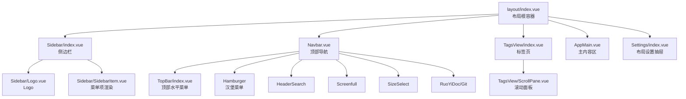
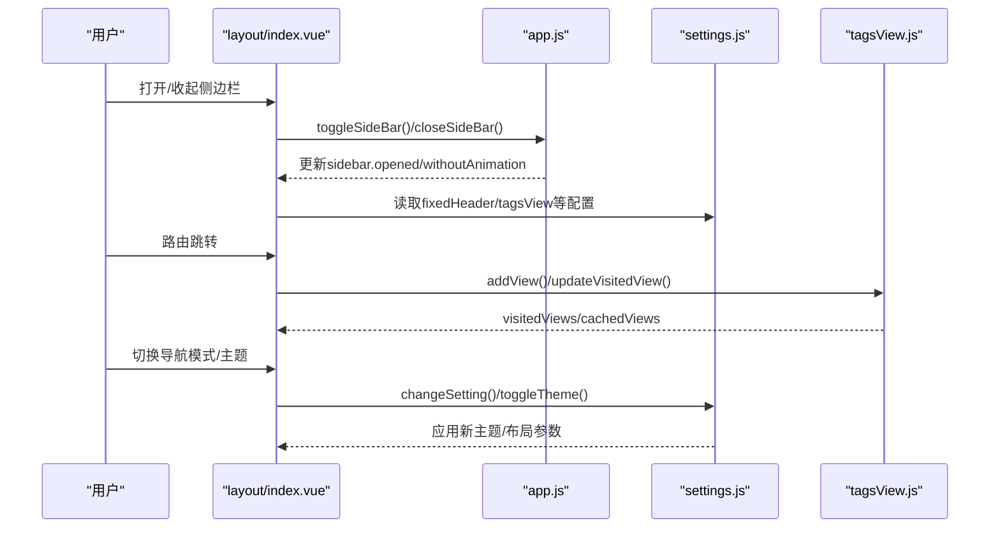
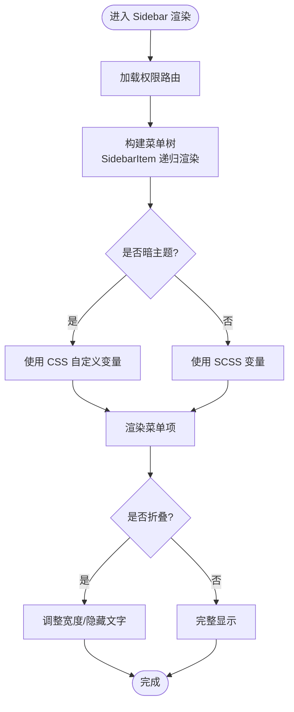
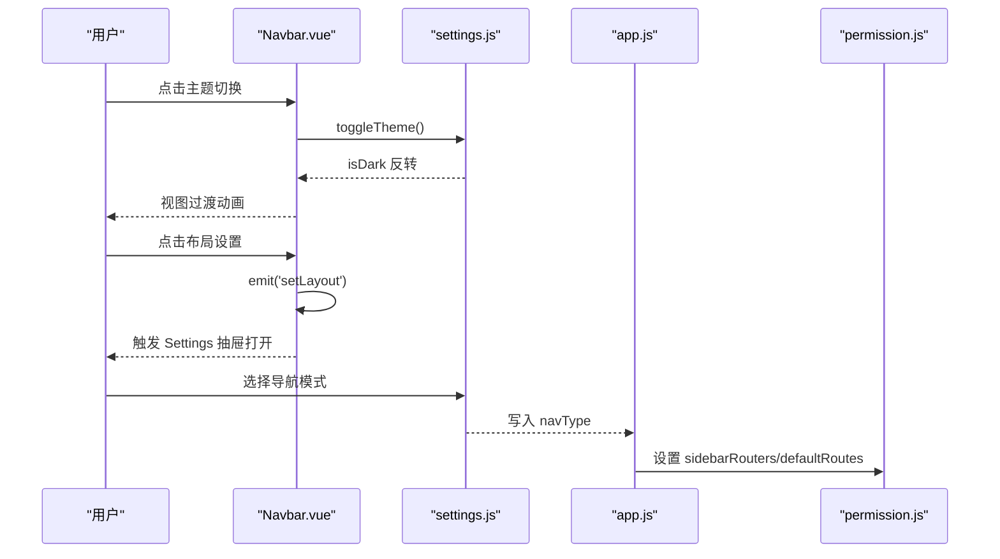
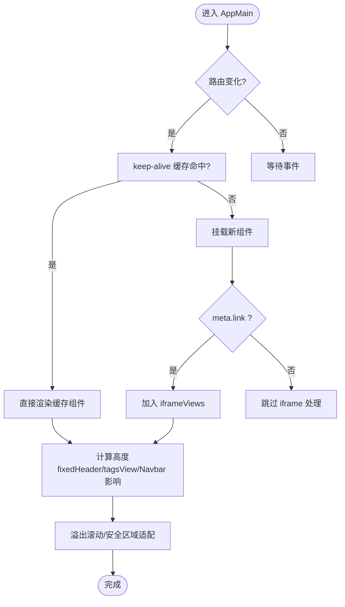
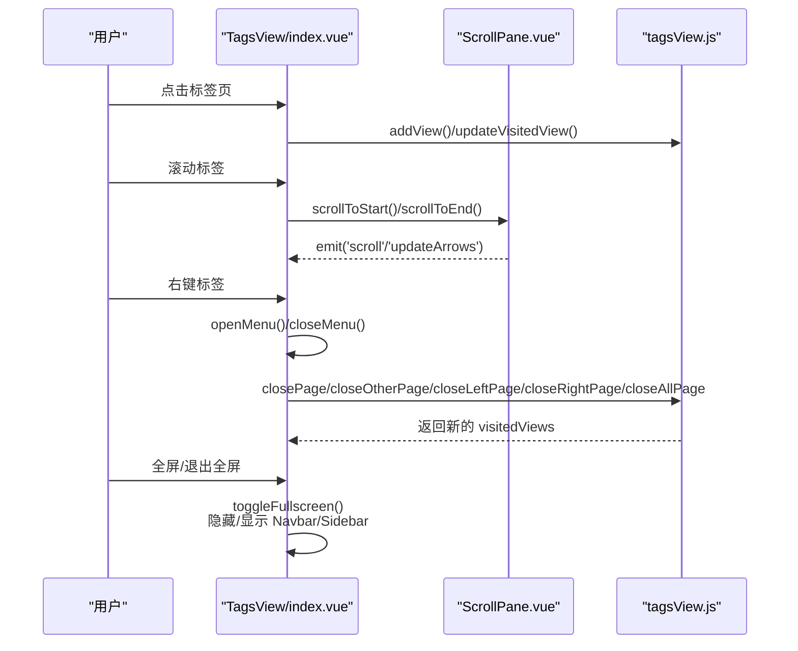
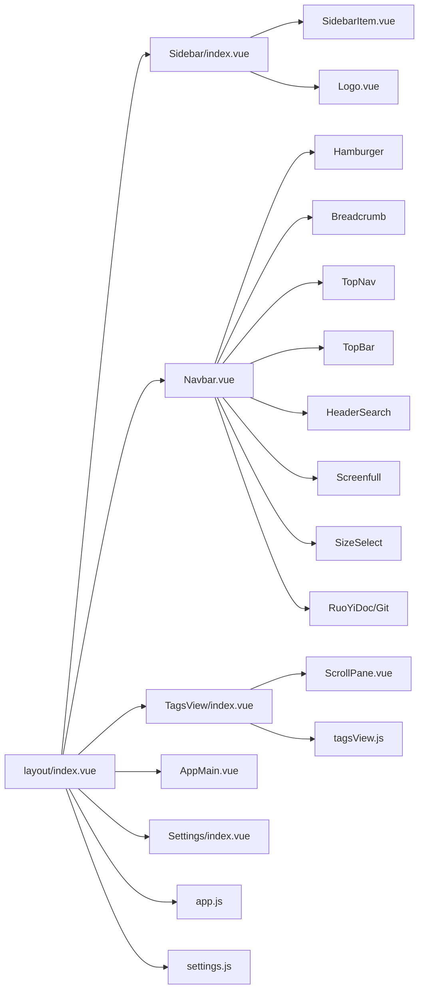

# 布局组件

<cite>
**本文引用的文件**
- [ruoyi-ui/src/layout/index.vue](file://ruoyi-ui/src/layout/index.vue)
- [ruoyi-ui/src/layout/components/Sidebar/index.vue](file://ruoyi-ui/src/layout/components/Sidebar/index.vue)
- [ruoyi-ui/src/layout/components/Sidebar/Logo.vue](file://ruoyi-ui/src/layout/components/Sidebar/Logo.vue)
- [ruoyi-ui/src/layout/components/Sidebar/SidebarItem.vue](file://ruoyi-ui/src/layout/components/Sidebar/SidebarItem.vue)
- [ruoyi-ui/src/layout/components/Navbar.vue](file://ruoyi-ui/src/layout/components/Navbar.vue)
- [ruoyi-ui/src/layout/components/TopBar/index.vue](file://ruoyi-ui/src/layout/components/TopBar/index.vue)
- [ruoyi-ui/src/layout/components/AppMain.vue](file://ruoyi-ui/src/layout/components/AppMain.vue)
- [ruoyi-ui/src/layout/components/TagsView/index.vue](file://ruoyi-ui/src/layout/components/TagsView/index.vue)
- [ruoyi-ui/src/layout/components/TagsView/ScrollPane.vue](file://ruoyi-ui/src/layout/components/TagsView/ScrollPane.vue)
- [ruoyi-ui/src/layout/components/Settings/index.vue](file://ruoyi-ui/src/layout/components/Settings/index.vue)
- [ruoyi-ui/src/store/modules/app.js](file://ruoyi-ui/src/store/modules/app.js)
- [ruoyi-ui/src/store/modules/settings.js](file://ruoyi-ui/src/store/modules/settings.js)
- [ruoyi-ui/src/store/modules/tagsView.js](file://ruoyi-ui/src/store/modules/tagsView.js)
- [ruoyi-ui/src/settings.js](file://ruoyi-ui/src/settings.js)
- [ruoyi-ui/src/assets/styles/variables.module.scss](file://ruoyi-ui/src/assets/styles/variables.module.scss)
- [ruoyi-ui/src/utils/theme.js](file://ruoyi-ui/src/utils/theme.js)
</cite>

## 目录
1. [简介](#简介)
2. [项目结构](#项目结构)
3. [核心组件](#核心组件)
4. [架构总览](#架构总览)
5. [组件详解](#组件详解)
6. [依赖关系分析](#依赖关系分析)
7. [性能与响应式](#性能与响应式)
8. [故障排查](#故障排查)
9. [结论](#结论)
10. [附录](#附录)

## 简介
本文件面向NeoCC项目的前端布局组件体系，系统性梳理并解读侧边栏(Sidebar)、顶部导航(含多种导航形态)、主内容区域(AppMain)、标签页(TagsView)等核心布局组件的实现细节。重点覆盖以下方面：
- 层级关系与控制流
- 样式设计与主题切换机制
- 响应式适配与多屏幕策略
- 配置项与可定制化扩展点
- 交互逻辑与性能优化建议

## 项目结构
布局组件位于ruoyi-ui/src/layout目录下，采用“容器-子组件”分层组织，配合Vuex Store模块管理状态，通过SCSS变量与CSS自定义属性实现主题与样式解耦。

图表来源
- [ruoyi-ui/src/layout/index.vue:1-116](file://ruoyi-ui/src/layout/index.vue#L1-L116)
- [ruoyi-ui/src/layout/components/Sidebar/index.vue:1-105](file://ruoyi-ui/src/layout/components/Sidebar/index.vue#L1-L105)
- [ruoyi-ui/src/layout/components/Navbar.vue:1-288](file://ruoyi-ui/src/layout/components/Navbar.vue#L1-L288)
- [ruoyi-ui/src/layout/components/TagsView/index.vue:1-712](file://ruoyi-ui/src/layout/components/TagsView/index.vue#L1-L712)
- [ruoyi-ui/src/layout/components/AppMain.vue:1-124](file://ruoyi-ui/src/layout/components/AppMain.vue#L1-L124)
- [ruoyi-ui/src/layout/components/Settings/index.vue:1-344](file://ruoyi-ui/src/layout/components/Settings/index.vue#L1-L344)
- [ruoyi-ui/src/layout/components/Sidebar/Logo.vue:1-102](file://ruoyi-ui/src/layout/components/Sidebar/Logo.vue#L1-L102)
- [ruoyi-ui/src/layout/components/Sidebar/SidebarItem.vue:1-101](file://ruoyi-ui/src/layout/components/Sidebar/SidebarItem.vue#L1-L101)
- [ruoyi-ui/src/layout/components/TagsView/ScrollPane.vue:1-156](file://ruoyi-ui/src/layout/components/TagsView/ScrollPane.vue#L1-L156)

章节来源
- [ruoyi-ui/src/layout/index.vue:1-116](file://ruoyi-ui/src/layout/index.vue#L1-L116)

## 核心组件
- 布局根容器：负责设备检测、侧边栏开关、固定Header宽度计算、移动端遮罩等全局行为。
- 侧边栏：根据权限路由生成菜单树，支持折叠、Logo显示、主题色与菜单色彩映射。
- 顶部导航：支持三种导航模式（左侧、混合、顶部），包含面包屑、顶部菜单、用户下拉等。
- 主内容区：基于router-view渲染视图，结合TagsView缓存策略与iframe支持。
- 标签页：提供滚动、右键菜单、快捷操作、全屏模式等能力，并支持持久化。
- 布局设置：抽屉式配置面板，统一管理导航类型、主题风格、标签页配置、固定Header等。

章节来源
- [ruoyi-ui/src/layout/components/Sidebar/index.vue:1-105](file://ruoyi-ui/src/layout/components/Sidebar/index.vue#L1-L105)
- [ruoyi-ui/src/layout/components/Navbar.vue:1-288](file://ruoyi-ui/src/layout/components/Navbar.vue#L1-L288)
- [ruoyi-ui/src/layout/components/AppMain.vue:1-124](file://ruoyi-ui/src/layout/components/AppMain.vue#L1-L124)
- [ruoyi-ui/src/layout/components/TagsView/index.vue:1-712](file://ruoyi-ui/src/layout/components/TagsView/index.vue#L1-L712)
- [ruoyi-ui/src/layout/components/Settings/index.vue:1-344](file://ruoyi-ui/src/layout/components/Settings/index.vue#L1-L344)

## 架构总览
布局组件通过Store模块解耦状态与UI，使用SCSS变量与CSS自定义属性实现主题与尺寸的集中管理。整体数据流向如下：

图表来源
- [ruoyi-ui/src/layout/index.vue:1-116](file://ruoyi-ui/src/layout/index.vue#L1-L116)
- [ruoyi-ui/src/store/modules/app.js:1-47](file://ruoyi-ui/src/store/modules/app.js#L1-L47)
- [ruoyi-ui/src/store/modules/settings.js:1-54](file://ruoyi-ui/src/store/modules/settings.js#L1-L54)
- [ruoyi-ui/src/store/modules/tagsView.js:1-227](file://ruoyi-ui/src/store/modules/tagsView.js#L1-L227)

## 组件详解

### 侧边栏(Sidebar)
- 功能要点
  - 基于权限路由生成菜单树，支持多级嵌套与“仅一个子路由时直接展示”的逻辑。
  - 支持Logo显示、菜单折叠、主题色与菜单文字色映射。
  - 菜单背景与文字色在亮/暗主题下自动切换。
- 关键实现
  - 菜单渲染：通过SidebarItem递归渲染，处理外链、查询参数、标题截断等。
  - 主题映射：根据settings.sideTheme与isDark决定菜单背景/文字色。
  - 折叠状态：与app.store的sidebar.opened联动，影响菜单折叠与宽度。
- 样式设计
  - 使用SCSS变量与CSS自定义属性，确保亮/暗主题一致的视觉体验。
  - 菜单项悬停、激活态颜色通过CSS变量与hover覆盖实现。

图表来源
- [ruoyi-ui/src/layout/components/Sidebar/index.vue:1-105](file://ruoyi-ui/src/layout/components/Sidebar/index.vue#L1-L105)
- [ruoyi-ui/src/layout/components/Sidebar/SidebarItem.vue:1-101](file://ruoyi-ui/src/layout/components/Sidebar/SidebarItem.vue#L1-L101)
- [ruoyi-ui/src/layout/components/Sidebar/Logo.vue:1-102](file://ruoyi-ui/src/layout/components/Sidebar/Logo.vue#L1-L102)
- [ruoyi-ui/src/assets/styles/variables.module.scss:1-336](file://ruoyi-ui/src/assets/styles/variables.module.scss#L1-L336)

章节来源
- [ruoyi-ui/src/layout/components/Sidebar/index.vue:1-105](file://ruoyi-ui/src/layout/components/Sidebar/index.vue#L1-L105)
- [ruoyi-ui/src/layout/components/Sidebar/SidebarItem.vue:1-101](file://ruoyi-ui/src/layout/components/Sidebar/SidebarItem.vue#L1-L101)
- [ruoyi-ui/src/layout/components/Sidebar/Logo.vue:1-102](file://ruoyi-ui/src/layout/components/Sidebar/Logo.vue#L1-L102)

### 顶部导航(含多种导航形态)
- 功能要点
  - 三种导航模式：纯左侧、混合(左侧+顶部)、纯顶部；通过settings.navType切换。
  - 在顶部模式下，Logo与TopBar组合呈现，TopBar根据窗口宽度动态显示菜单数量。
  - Navbar作为统一入口，承载汉堡菜单、面包屑、顶部菜单、搜索、主题切换、尺寸选择、用户下拉等。
- 关键实现
  - 导航模式切换：Settings组件写入navType，AppStore根据模式控制侧边栏显示/隐藏与路由集合。
  - 主题切换：支持原生View Transition动画，平滑过渡亮/暗主题。
  - 用户下拉：支持“布局设置”、“退出登录”等命令。
- 样式设计
  - 顶部导航条高度固定50px，背景与文字色通过CSS变量随主题变化。
  - 顶部菜单项在悬停时的背景色覆盖，保证在不同主题下的可读性。

图表来源
- [ruoyi-ui/src/layout/components/Navbar.vue:1-288](file://ruoyi-ui/src/layout/components/Navbar.vue#L1-L288)
- [ruoyi-ui/src/layout/components/Settings/index.vue:1-344](file://ruoyi-ui/src/layout/components/Settings/index.vue#L1-L344)
- [ruoyi-ui/src/store/modules/settings.js:1-54](file://ruoyi-ui/src/store/modules/settings.js#L1-L54)
- [ruoyi-ui/src/store/modules/app.js:1-47](file://ruoyi-ui/src/store/modules/app.js#L1-L47)

章节来源
- [ruoyi-ui/src/layout/components/Navbar.vue:1-288](file://ruoyi-ui/src/layout/components/Navbar.vue#L1-L288)
- [ruoyi-ui/src/layout/components/TopBar/index.vue:1-100](file://ruoyi-ui/src/layout/components/TopBar/index.vue#L1-L100)
- [ruoyi-ui/src/layout/components/Settings/index.vue:1-344](file://ruoyi-ui/src/layout/components/Settings/index.vue#L1-L344)

### 主内容区域(AppMain)
- 功能要点
  - 基于router-view渲染当前路由组件，使用transition与keep-alive缓存策略提升切换性能。
  - 支持iframe视图注入，用于内嵌外部链接。
  - 固定Header模式下，自动计算高度并溢出滚动，移动端进行安全区域适配。
- 关键实现
  - 缓存策略：通过tagsView.cachedViews作为keep-alive include列表，避免重复渲染。
  - iframe支持：当路由meta.link为真时，加入iframeViews并在必要时移除。
  - 高度适配：根据是否存在fixedHeader、tagsView、Navbar高度动态计算。
- 样式设计
  - 使用calc与CSS变量，确保在不同布局模式下高度一致。
  - 移动端通过env(safe-area-inset-*)与constant兼容，提供沉浸式体验。

图表来源
- [ruoyi-ui/src/layout/components/AppMain.vue:1-124](file://ruoyi-ui/src/layout/components/AppMain.vue#L1-L124)
- [ruoyi-ui/src/store/modules/tagsView.js:1-227](file://ruoyi-ui/src/store/modules/tagsView.js#L1-L227)

章节来源
- [ruoyi-ui/src/layout/components/AppMain.vue:1-124](file://ruoyi-ui/src/layout/components/AppMain.vue#L1-L124)

### 标签页(TagsView)
- 功能要点
  - 访客视图记录与缓存：支持添加、关闭、关闭其他、关闭左右、全部关闭、刷新等。
  - 滚动面板：支持鼠标滚轮、左右箭头、键盘事件，自动更新左右禁用状态。
  - 全屏模式：隐藏Navbar与Sidebar，最大化主内容区，支持Esc退出。
  - 持久化：可选将非固钉标签持久化至localStorage，刷新后恢复。
- 关键实现
  - 滚动面板：ScrollPane封装滚动逻辑，提供smoothScrollTo与目标定位。
  - 上下文菜单：右键点击任意标签弹出菜单，支持刷新、关闭、关闭左右、全部关闭。
  - 全屏切换：通过类名切换与元素显隐控制，隐藏/恢复Navbar与Sidebar。
  - 键盘支持：监听Esc退出全屏。
- 样式设计
  - 支持两种标签样式：card与chrome风格，通过CSS变量与伪元素实现视觉差异。
  - 活跃标签高亮、关闭按钮悬停效果、左右箭头与下拉菜单均使用统一设计语言。

图表来源
- [ruoyi-ui/src/layout/components/TagsView/index.vue:1-712](file://ruoyi-ui/src/layout/components/TagsView/index.vue#L1-L712)
- [ruoyi-ui/src/layout/components/TagsView/ScrollPane.vue:1-156](file://ruoyi-ui/src/layout/components/TagsView/ScrollPane.vue#L1-L156)
- [ruoyi-ui/src/store/modules/tagsView.js:1-227](file://ruoyi-ui/src/store/modules/tagsView.js#L1-L227)

章节来源
- [ruoyi-ui/src/layout/components/TagsView/index.vue:1-712](file://ruoyi-ui/src/layout/components/TagsView/index.vue#L1-L712)
- [ruoyi-ui/src/layout/components/TagsView/ScrollPane.vue:1-156](file://ruoyi-ui/src/layout/components/TagsView/ScrollPane.vue#L1-L156)

### 布局设置(Settings)
- 功能要点
  - 导航模式：左侧、混合、顶部三态切换，联动AppStore与PermissionStore。
  - 主题风格：深色/浅色主题切换，支持预设主题色与动态生成明/暗色阶。
  - 布局配置：开启/关闭标签页、标签页图标、标签页样式、固定Header、显示Logo、动态标题、底部版权等。
  - 本地持久化：将布局设置写入localStorage，支持一键保存与重置。
- 关键实现
  - 主题色变更：调用工具函数生成明/暗色阶并写入CSS变量。
  - 导航模式联动：根据navType调整侧边栏展开/隐藏与路由集合。
  - 保存/重置：序列化当前设置，写入或清空localStorage并刷新。

章节来源
- [ruoyi-ui/src/layout/components/Settings/index.vue:1-344](file://ruoyi-ui/src/layout/components/Settings/index.vue#L1-L344)
- [ruoyi-ui/src/utils/theme.js:1-50](file://ruoyi-ui/src/utils/theme.js#L1-L50)
- [ruoyi-ui/src/settings.js:1-68](file://ruoyi-ui/src/settings.js#L1-L68)

## 依赖关系分析
- 组件间依赖
  - layout/index.vue依赖Sidebar、Navbar、TagsView、AppMain、Settings。
  - Sidebar依赖SidebarItem与Logo。
  - TagsView依赖ScrollPane与TagsView Store。
  - Navbar依赖Hamburger、Breadcrumb、TopNav、TopBar、HeaderSearch、Screenfull、SizeSelect、RuoYiDoc/Git与User Store。
- Store依赖
  - app.js：设备、侧边栏状态、布局尺寸。
  - settings.js：主题、导航模式、标签页配置、固定Header、Logo显示、动态标题、底部版权等。
  - tagsView.js：访问历史、缓存列表、iframe视图、持久化读写。

图表来源
- [ruoyi-ui/src/layout/index.vue:1-116](file://ruoyi-ui/src/layout/index.vue#L1-L116)
- [ruoyi-ui/src/layout/components/Sidebar/index.vue:1-105](file://ruoyi-ui/src/layout/components/Sidebar/index.vue#L1-L105)
- [ruoyi-ui/src/layout/components/Navbar.vue:1-288](file://ruoyi-ui/src/layout/components/Navbar.vue#L1-L288)
- [ruoyi-ui/src/layout/components/TagsView/index.vue:1-712](file://ruoyi-ui/src/layout/components/TagsView/index.vue#L1-L712)
- [ruoyi-ui/src/layout/components/AppMain.vue:1-124](file://ruoyi-ui/src/layout/components/AppMain.vue#L1-L124)
- [ruoyi-ui/src/layout/components/Settings/index.vue:1-344](file://ruoyi-ui/src/layout/components/Settings/index.vue#L1-L344)
- [ruoyi-ui/src/store/modules/app.js:1-47](file://ruoyi-ui/src/store/modules/app.js#L1-L47)
- [ruoyi-ui/src/store/modules/settings.js:1-54](file://ruoyi-ui/src/store/modules/settings.js#L1-L54)
- [ruoyi-ui/src/store/modules/tagsView.js:1-227](file://ruoyi-ui/src/store/modules/tagsView.js#L1-L227)

## 性能与响应式
- 性能优化
  - keep-alive缓存：AppMain对路由组件进行缓存，减少重复渲染与网络请求。
  - 滚动动画：ScrollPane使用requestAnimationFrame实现平滑滚动，降低主线程压力。
  - 主题切换：使用View Transition动画，避免强制同步布局抖动。
- 响应式适配
  - 设备检测：layout/index.vue监听窗口宽度，小于阈值时切换为mobile模式并自动关闭侧边栏。
  - 固定Header宽度：根据侧边栏宽度与是否隐藏动态计算，确保内容区宽度正确。
  - 移动端安全区域：使用env(safe-area-inset-*)与constant兼容，保障刘海屏/胶囊屏体验。
  - 标签页滚动：在窄屏下提供左右箭头与滚轮滚动，避免标签拥挤。

章节来源
- [ruoyi-ui/src/layout/index.vue:37-57](file://ruoyi-ui/src/layout/index.vue#L37-L57)
- [ruoyi-ui/src/layout/components/AppMain.vue:76-106](file://ruoyi-ui/src/layout/components/AppMain.vue#L76-L106)
- [ruoyi-ui/src/layout/components/TagsView/index.vue:673-712](file://ruoyi-ui/src/layout/components/TagsView/index.vue#L673-L712)

## 故障排查
- 侧边栏不显示Logo
  - 检查settings.sidebarLogo是否开启；确认Logo组件的条件渲染逻辑。
  - 参考路径：[ruoyi-ui/src/layout/components/Sidebar/index.vue:3-4](file://ruoyi-ui/src/layout/components/Sidebar/index.vue#L3-L4)
- 标签页无法关闭或滚动异常
  - 确认ScrollPane的滚动事件绑定与箭头状态更新；检查TagsView的右键菜单与快捷操作。
  - 参考路径：[ruoyi-ui/src/layout/components/TagsView/ScrollPane.vue:22-69](file://ruoyi-ui/src/layout/components/TagsView/ScrollPane.vue#L22-L69)
- 主题切换无效
  - 检查settings.isDark状态与CSS变量是否更新；确认主题色生成函数已执行。
  - 参考路径：[ruoyi-ui/src/store/modules/settings.js:46-49](file://ruoyi-ui/src/store/modules/settings.js#L46-L49)
- 移动端遮罩点击无反应
  - 确认layout/index.vue中handleClickOutside与设备检测逻辑。
  - 参考路径：[ruoyi-ui/src/layout/index.vue:55-57](file://ruoyi-ui/src/layout/index.vue#L55-L57)

章节来源
- [ruoyi-ui/src/layout/components/Sidebar/index.vue:1-105](file://ruoyi-ui/src/layout/components/Sidebar/index.vue#L1-L105)
- [ruoyi-ui/src/layout/components/TagsView/ScrollPane.vue:1-156](file://ruoyi-ui/src/layout/components/TagsView/ScrollPane.vue#L1-L156)
- [ruoyi-ui/src/store/modules/settings.js:1-54](file://ruoyi-ui/src/store/modules/settings.js#L1-L54)
- [ruoyi-ui/src/layout/index.vue:55-57](file://ruoyi-ui/src/layout/index.vue#L55-L57)

## 结论
NeoCC的布局组件体系以“容器-子组件”分层设计为核心，通过Store模块与SCSS/CSS变量实现主题与样式的统一管理。侧边栏、顶部导航、主内容区与标签页协同工作，既满足多场景导航需求，又兼顾性能与响应式体验。Settings组件提供了完善的可配置能力，便于二次开发与企业定制。

## 附录
- 配置项一览（来自settings.js与Settings组件）
  - 导航模式：navType（1/2/3）
  - 侧边栏主题：sideTheme（theme-dark/theme-light）
  - 标签页：tagsView/tagsViewPersist/tagsIcon/tagsViewStyle
  - Header：fixedHeader
  - Logo：sidebarLogo
  - 动态标题：dynamicTitle
  - 底部版权：footerVisible/footerContent
- 最佳实践
  - 自定义主题：通过Settings面板选择主题色与风格，或在SCSS变量中扩展颜色集。
  - 扩展导航：在PermissionStore中新增路由元信息，Sidebar会自动渲染。
  - 定制标签页：利用affix标记固钉标签，结合persist策略实现跨会话保留。
  - 性能优化：合理使用keep-alive缓存，避免不必要的组件重建；在高频滚动场景中保持ScrollPane的动画流畅。

章节来源
- [ruoyi-ui/src/settings.js:1-68](file://ruoyi-ui/src/settings.js#L1-L68)
- [ruoyi-ui/src/layout/components/Settings/index.vue:1-344](file://ruoyi-ui/src/layout/components/Settings/index.vue#L1-L344)
- [ruoyi-ui/src/assets/styles/variables.module.scss:1-336](file://ruoyi-ui/src/assets/styles/variables.module.scss#L1-L336)