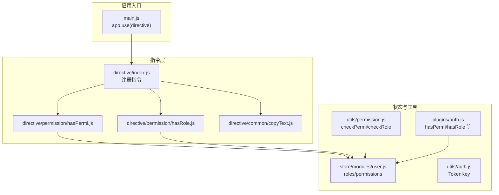
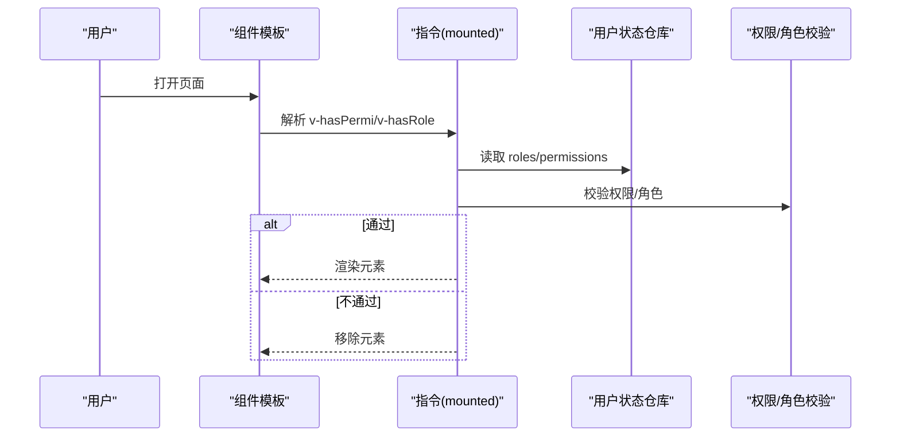
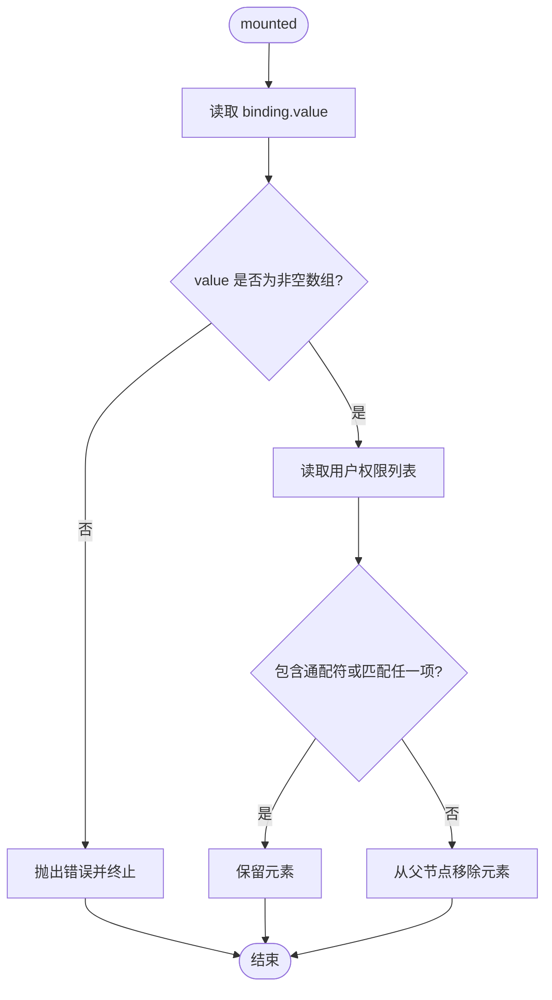
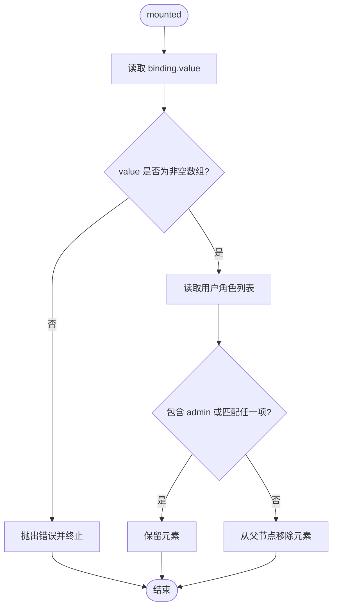
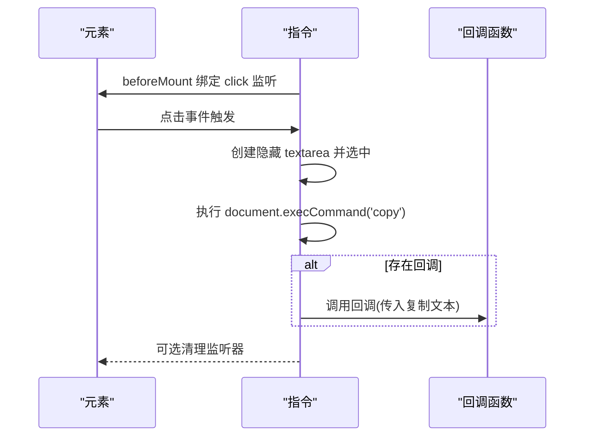
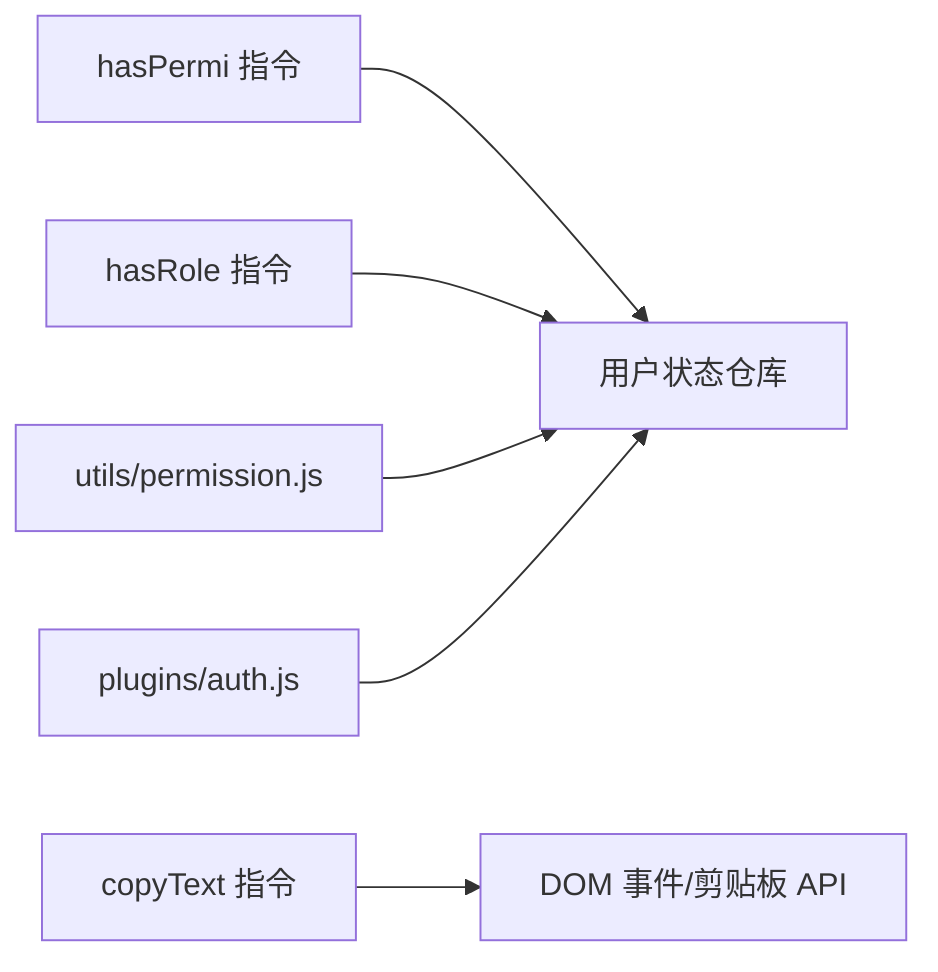

# 指令系统

<cite>
**本文引用的文件**
- [ruoyi-ui/src/directive/index.js](file://ruoyi-ui/src/directive/index.js)
- [ruoyi-ui/src/directive/permission/hasPermi.js](file://ruoyi-ui/src/directive/permission/hasPermi.js)
- [ruoyi-ui/src/directive/permission/hasRole.js](file://ruoyi-ui/src/directive/permission/hasRole.js)
- [ruoyi-ui/src/directive/common/copyText.js](file://ruoyi-ui/src/directive/common/copyText.js)
- [ruoyi-ui/src/store/modules/user.js](file://ruoyi-ui/src/store/modules/user.js)
- [ruoyi-ui/src/utils/permission.js](file://ruoyi-ui/src/utils/permission.js)
- [ruoyi-ui/src/plugins/auth.js](file://ruoyi-ui/src/plugins/auth.js)
- [ruoyi-ui/src/utils/auth.js](file://ruoyi-ui/src/utils/auth.js)
- [ruoyi-ui/src/main.js](file://ruoyi-ui/src/main.js)
- [ruoyi-ui/src/views/system/user/index.vue](file://ruoyi-ui/src/views/system/user/index.vue)
- [ruoyi-ui/src/views/system/role/index.vue](file://ruoyi-ui/src/views/system/role/index.vue)
</cite>

## 目录
1. [简介](#简介)
2. [项目结构](#项目结构)
3. [核心组件](#核心组件)
4. [架构总览](#架构总览)
5. [详细组件分析](#详细组件分析)
6. [依赖关系分析](#依赖关系分析)
7. [性能考量](#性能考量)
8. [故障排查指南](#故障排查指南)
9. [结论](#结论)
10. [附录](#附录)

## 简介
本文件面向NeoCC项目的前端指令系统，聚焦于权限指令（v-hasPermi、v-hasRole）与通用指令（v-copyText）的设计与实现，系统性阐述指令的生命周期、参数传递、条件渲染与动态更新机制，并结合用户状态管理、路由守卫与组件协作，给出最佳实践、性能优化策略与调试技巧，帮助开发者在权限控制、用户体验与代码复用方面获得稳定收益。

## 项目结构
指令系统位于ruoyi-ui前端工程中，采用按功能分层的组织方式：
- 指令注册入口：通过统一导出函数集中注册指令
- 权限指令：分别处理角色与操作权限的条件渲染
- 通用指令：封装复制文本能力，支持点击触发与回调
- 用户状态：集中管理角色与权限列表，供指令读取
- 工具与插件：提供权限/角色校验工具与便捷方法

图表来源
- [ruoyi-ui/src/directive/index.js:1-9](file://ruoyi-ui/src/directive/index.js#L1-L9)
- [ruoyi-ui/src/directive/permission/hasPermi.js:1-28](file://ruoyi-ui/src/directive/permission/hasPermi.js#L1-L28)
- [ruoyi-ui/src/directive/permission/hasRole.js:1-28](file://ruoyi-ui/src/directive/permission/hasRole.js#L1-L28)
- [ruoyi-ui/src/directive/common/copyText.js:1-66](file://ruoyi-ui/src/directive/common/copyText.js#L1-L66)
- [ruoyi-ui/src/store/modules/user.js:1-93](file://ruoyi-ui/src/store/modules/user.js#L1-L93)
- [ruoyi-ui/src/utils/permission.js:1-51](file://ruoyi-ui/src/utils/permission.js#L1-L51)
- [ruoyi-ui/src/plugins/auth.js:1-61](file://ruoyi-ui/src/plugins/auth.js#L1-L61)
- [ruoyi-ui/src/utils/auth.js:1-16](file://ruoyi-ui/src/utils/auth.js#L1-L16)
- [ruoyi-ui/src/main.js:1-84](file://ruoyi-ui/src/main.js#L1-L84)

章节来源
- [ruoyi-ui/src/main.js:1-84](file://ruoyi-ui/src/main.js#L1-L84)
- [ruoyi-ui/src/directive/index.js:1-9](file://ruoyi-ui/src/directive/index.js#L1-L9)

## 核心组件
- 权限指令 v-hasPermi
  - 功能：根据当前用户拥有的操作权限集合，判断是否渲染绑定元素
  - 关键点：支持通配符“*:*:*”；对传入权限数组进行包含性匹配
- 角色指令 v-hasRole
  - 功能：根据当前用户的角色集合，判断是否渲染绑定元素
  - 关键点：内置超级管理员“admin”可无条件通过；对传入角色数组进行包含性匹配
- 通用指令 v-copyText
  - 功能：将绑定值复制到剪贴板；支持通过修饰符“callback”注入回调
  - 关键点：点击事件绑定与解绑；兼容移动端与焦点恢复；提供回调通知

章节来源
- [ruoyi-ui/src/directive/permission/hasPermi.js:1-28](file://ruoyi-ui/src/directive/permission/hasPermi.js#L1-L28)
- [ruoyi-ui/src/directive/permission/hasRole.js:1-28](file://ruoyi-ui/src/directive/permission/hasRole.js#L1-L28)
- [ruoyi-ui/src/directive/common/copyText.js:1-66](file://ruoyi-ui/src/directive/common/copyText.js#L1-L66)

## 架构总览
指令系统围绕“状态-指令-组件”的协作展开：
- 状态来源：用户登录后从后端获取角色与权限列表，写入用户状态仓库
- 指令消费：指令在mounted钩子中读取用户状态，基于传入的权限/角色数组进行判定
- 组件集成：组件模板中通过v-hasPermi/v-hasRole实现按钮、菜单项等的条件渲染
- 路由与守卫：路由守卫可结合用户状态与权限插件进行页面级访问控制

图表来源
- [ruoyi-ui/src/directive/permission/hasPermi.js:8-26](file://ruoyi-ui/src/directive/permission/hasPermi.js#L8-L26)
- [ruoyi-ui/src/directive/permission/hasRole.js:8-26](file://ruoyi-ui/src/directive/permission/hasRole.js#L8-L26)
- [ruoyi-ui/src/store/modules/user.js:42-74](file://ruoyi-ui/src/store/modules/user.js#L42-L74)
- [ruoyi-ui/src/utils/permission.js:8-51](file://ruoyi-ui/src/utils/permission.js#L8-L51)

## 详细组件分析

### 权限指令 v-hasPermi 实现
- 生命周期与参数
  - mounted阶段：读取binding.value（权限字符串数组），从用户状态仓库读取permissions
  - 判定逻辑：若包含通配符或任一目标权限，则保留元素；否则移除父节点中的该元素
- 错误处理
  - 当未传入有效数组时抛出错误，提示需设置操作权限标签值
- 性能与复杂度
  - 数组some遍历O(n)，n为permissions长度；整体O(n)
- 使用建议
  - 建议在组件初始化时确保用户信息已加载，避免闪烁
  - 对高频权限判断场景，可结合工具函数进行缓存或预判

图表来源
- [ruoyi-ui/src/directive/permission/hasPermi.js:8-26](file://ruoyi-ui/src/directive/permission/hasPermi.js#L8-L26)

章节来源
- [ruoyi-ui/src/directive/permission/hasPermi.js:1-28](file://ruoyi-ui/src/directive/permission/hasPermi.js#L1-L28)
- [ruoyi-ui/src/store/modules/user.js:42-74](file://ruoyi-ui/src/store/modules/user.js#L42-L74)

### 角色指令 v-hasRole 实现
- 生命周期与参数
  - mounted阶段：读取binding.value（角色字符串数组），从用户状态仓库读取roles
  - 判定逻辑：若为超级管理员“admin”或任一目标角色，则保留元素；否则移除父节点中的该元素
- 错误处理
  - 当未传入有效数组时抛出错误，提示需设置角色权限标签值
- 性能与复杂度
  - 数组some遍历O(n)，n为roles长度；整体O(n)

图表来源
- [ruoyi-ui/src/directive/permission/hasRole.js:8-26](file://ruoyi-ui/src/directive/permission/hasRole.js#L8-L26)

章节来源
- [ruoyi-ui/src/directive/permission/hasRole.js:1-28](file://ruoyi-ui/src/directive/permission/hasRole.js#L1-L28)
- [ruoyi-ui/src/store/modules/user.js:42-74](file://ruoyi-ui/src/store/modules/user.js#L42-L74)

### 通用指令 v-copyText 实现
- 生命周期与参数
  - beforeMount阶段：解析binding.arg与binding.value
  - 若arg为“callback”，则将value作为回调函数保存至元素实例
  - 否则将value作为待复制文本，绑定click事件处理器
- 行为细节
  - 点击时执行复制：创建隐藏textarea、选中文本、调用原生复制命令
  - 复制完成后可选触发回调（如提示“复制成功”）
  - 提供$destroyCopy清理监听器，避免内存泄漏
- 兼容性与体验
  - 针对移动端与焦点恢复做了兼容处理
  - 返回复制结果布尔值，便于上层逻辑判断

图表来源
- [ruoyi-ui/src/directive/common/copyText.js:6-21](file://ruoyi-ui/src/directive/common/copyText.js#L6-L21)
- [ruoyi-ui/src/directive/common/copyText.js:23-66](file://ruoyi-ui/src/directive/common/copyText.js#L23-L66)

章节来源
- [ruoyi-ui/src/directive/common/copyText.js:1-66](file://ruoyi-ui/src/directive/common/copyText.js#L1-L66)

### 指令注册与应用入口
- 注册流程
  - 在入口文件中导入指令模块并调用注册函数，完成全局注册
- 组件使用
  - 在组件模板中以v-hasPermi、v-hasRole、v-copyText形式使用
  - 示例：用户管理与角色管理页面中常见按钮与操作列的条件渲染

章节来源
- [ruoyi-ui/src/main.js:1-84](file://ruoyi-ui/src/main.js#L1-L84)
- [ruoyi-ui/src/directive/index.js:1-9](file://ruoyi-ui/src/directive/index.js#L1-L9)
- [ruoyi-ui/src/views/system/user/index.vue:1-271](file://ruoyi-ui/src/views/system/user/index.vue#L1-L271)
- [ruoyi-ui/src/views/system/role/index.vue:1-206](file://ruoyi-ui/src/views/system/role/index.vue#L1-L206)

## 依赖关系分析
- 指令与状态
  - 权限/角色指令均依赖用户状态仓库中的roles与permissions
- 指令与工具
  - 工具函数与插件提供checkPermi/checkRole与hasPermi/hasRole等便捷方法，可在组件逻辑中复用
- 指令与组件
  - 组件模板通过指令实现UI层面的条件渲染，降低分支逻辑复杂度
- 指令与路由
  - 路由守卫可结合用户状态与权限插件进行页面级访问控制，与指令形成互补

图表来源
- [ruoyi-ui/src/directive/permission/hasPermi.js:1-28](file://ruoyi-ui/src/directive/permission/hasPermi.js#L1-L28)
- [ruoyi-ui/src/directive/permission/hasRole.js:1-28](file://ruoyi-ui/src/directive/permission/hasRole.js#L1-L28)
- [ruoyi-ui/src/directive/common/copyText.js:1-66](file://ruoyi-ui/src/directive/common/copyText.js#L1-L66)
- [ruoyi-ui/src/store/modules/user.js:1-93](file://ruoyi-ui/src/store/modules/user.js#L1-L93)
- [ruoyi-ui/src/utils/permission.js:1-51](file://ruoyi-ui/src/utils/permission.js#L1-L51)
- [ruoyi-ui/src/plugins/auth.js:1-61](file://ruoyi-ui/src/plugins/auth.js#L1-L61)

章节来源
- [ruoyi-ui/src/store/modules/user.js:1-93](file://ruoyi-ui/src/store/modules/user.js#L1-L93)
- [ruoyi-ui/src/utils/permission.js:1-51](file://ruoyi-ui/src/utils/permission.js#L1-L51)
- [ruoyi-ui/src/plugins/auth.js:1-61](file://ruoyi-ui/src/plugins/auth.js#L1-L61)

## 性能考量
- 指令判定复杂度
  - 权限/角色指令均为O(n)线性查找，通常n较小，影响有限
- 事件绑定与清理
  - v-copyText在beforeMount绑定click，在$destroyCopy中移除，避免重复绑定导致的内存泄漏
- 状态依赖与更新
  - 指令在mounted阶段读取状态，若用户状态在运行期变化，建议配合组件响应式或重新渲染策略
- 复杂度优化建议
  - 对频繁使用的权限/角色，可考虑在组件层做一次预判，减少指令重复计算
  - 大型表格/列表中，优先使用指令进行粗粒度隐藏，避免在渲染阶段做过多条件判断

## 故障排查指南
- 常见问题
  - 未设置指令参数：当binding.value为空或非数组时，指令会抛出错误，请确保传入合法权限/角色数组
  - 用户状态未加载：若用户信息尚未获取，roles/permissions为空，可能导致元素被移除，应确保在进入页面前完成登录与信息拉取
  - 复制失败：v-copyText依赖浏览器原生复制API，部分环境可能受限；可通过回调返回值判断并降级提示
- 调试技巧
  - 在mounted钩子中打印binding.value与用户状态，核对数据一致性
  - 使用浏览器开发者工具观察DOM变化，确认元素是否被正确移除
  - 对v-copyText，检查事件监听是否重复绑定与清理

章节来源
- [ruoyi-ui/src/directive/permission/hasPermi.js:23-25](file://ruoyi-ui/src/directive/permission/hasPermi.js#L23-L25)
- [ruoyi-ui/src/directive/permission/hasRole.js:23-25](file://ruoyi-ui/src/directive/permission/hasRole.js#L23-L25)
- [ruoyi-ui/src/directive/common/copyText.js:11-18](file://ruoyi-ui/src/directive/common/copyText.js#L11-L18)

## 结论
NeoCC的指令系统以简洁、可复用为核心设计原则：权限指令与角色指令在mounted阶段完成条件渲染，通用指令提供易用的复制能力。结合用户状态仓库、工具函数与插件，指令系统在权限控制、用户体验与代码复用方面提供了稳定支撑。建议在大型项目中配合路由守卫与组件级权限校验，形成“编译期/运行期/页面级”的多层防护与体验保障。

## 附录
- 最佳实践
  - 在组件模板中使用指令进行UI级权限控制，保持逻辑清晰
  - 对高频权限/角色，可在组件逻辑中做预判，减少指令重复计算
  - 使用v-copyText时，提供明确的用户反馈（如回调提示）
- 开发建议
  - 为指令参数增加类型校验与默认值处理，提升健壮性
  - 对复杂页面，结合路由守卫与组件校验，形成完整的权限闭环