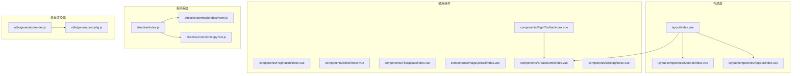
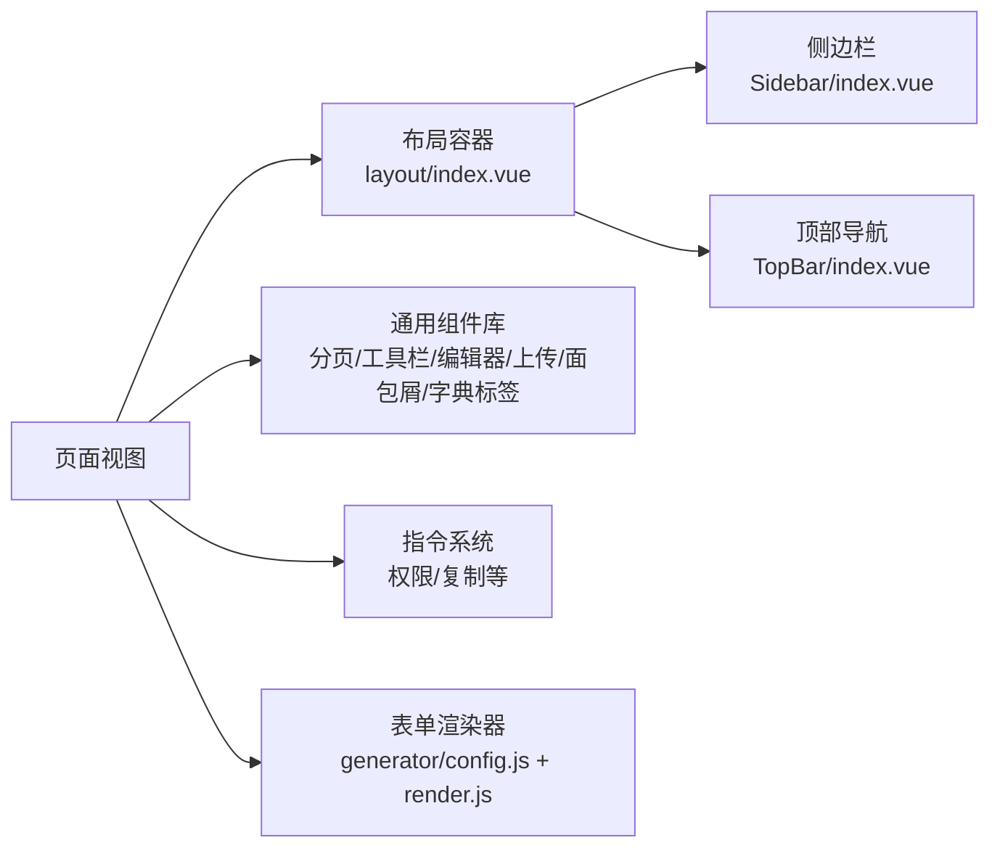
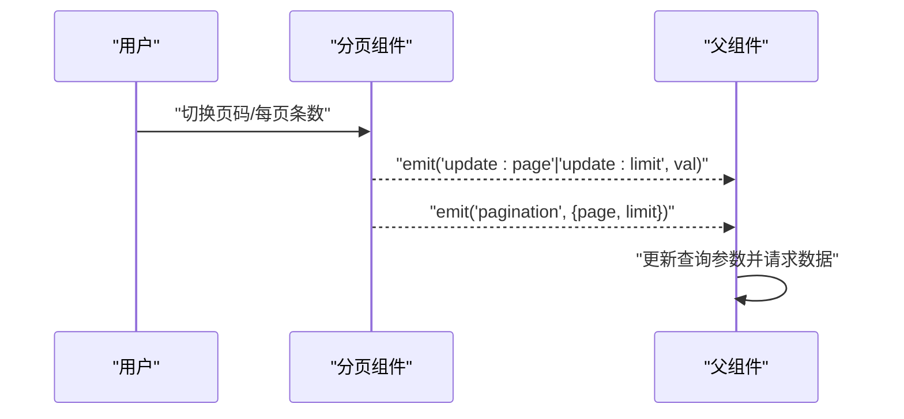
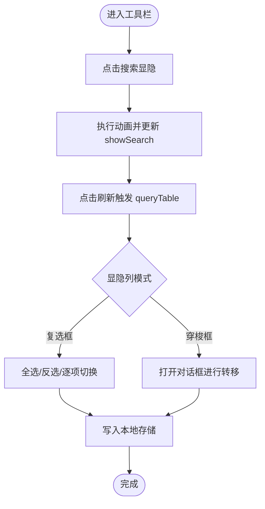
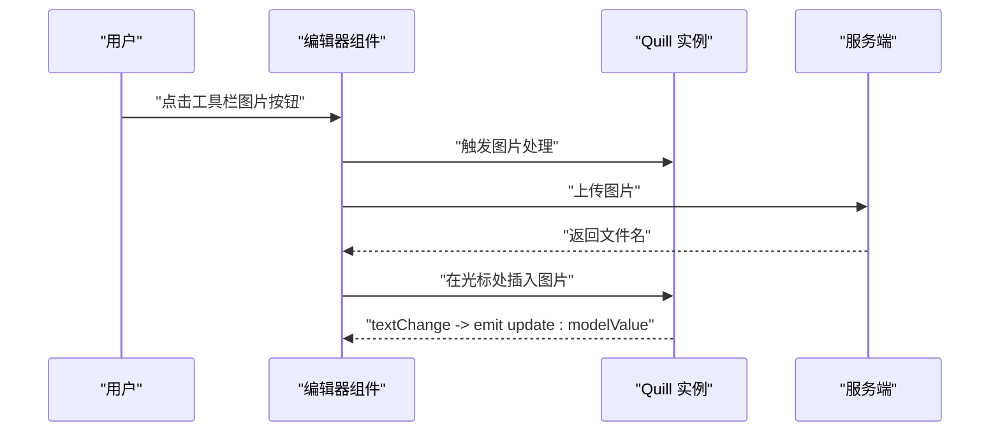
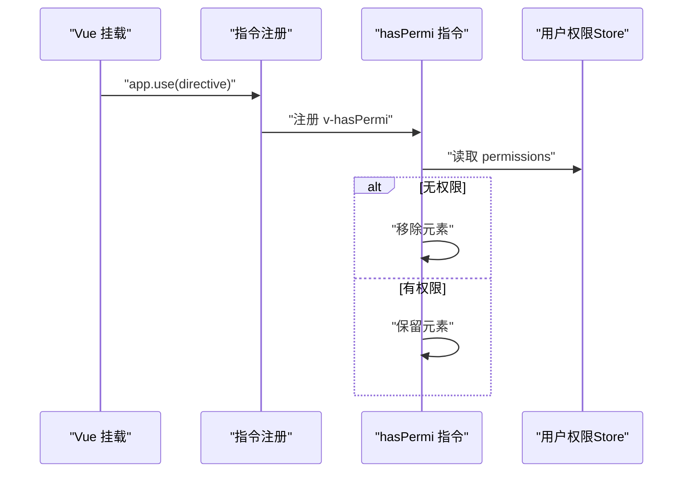
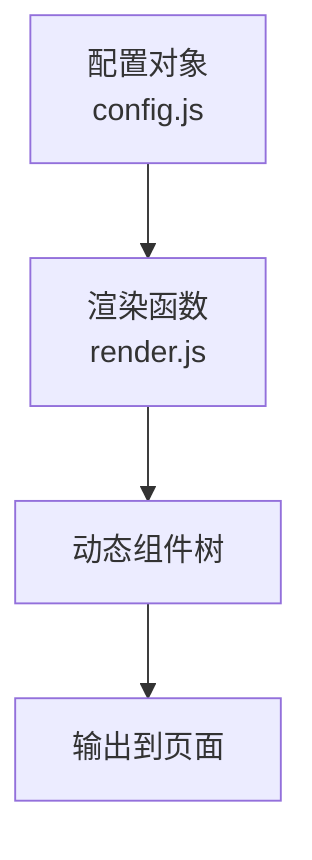
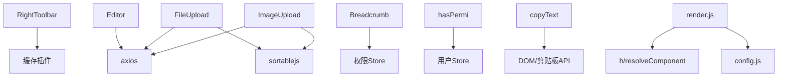

# 组件开发体系

<cite>
**本文引用的文件**
- [Pagination/index.vue](file://ruoyi-ui/src/components/Pagination/index.vue)
- [RightToolbar/index.vue](file://ruoyi-ui/src/components/RightToolbar/index.vue)
- [Editor/index.vue](file://ruoyi-ui/src/components/Editor/index.vue)
- [FileUpload/index.vue](file://ruoyi-ui/src/components/FileUpload/index.vue)
- [ImageUpload/index.vue](file://ruoyi-ui/src/components/ImageUpload/index.vue)
- [directive/index.js](file://ruoyi-ui/src/directive/index.js)
- [hasPermi.js](file://ruoyi-ui/src/directive/permission/hasPermi.js)
- [copyText.js](file://ruoyi-ui/src/directive/common/copyText.js)
- [Breadcrumb/index.vue](file://ruoyi-ui/src/components/Breadcrumb/index.vue)
- [DictTag/index.vue](file://ruoyi-ui/src/components/DictTag/index.vue)
- [layout/index.vue](file://ruoyi-ui/src/layout/index.vue)
- [Sidebar/index.vue](file://ruoyi-ui/src/layout/components/Sidebar/index.vue)
- [TopBar/index.vue](file://ruoyi-ui/src/layout/components/TopBar/index.vue)
- [config.js](file://ruoyi-ui/src/utils/generator/config.js)
- [render.js](file://ruoyi-ui/src/utils/generator/render.js)
</cite>

## 目录
1. [引言](#引言)
2. [项目结构](#项目结构)
3. [核心组件](#核心组件)
4. [架构总览](#架构总览)
5. [详细组件分析](#详细组件分析)
6. [依赖关系分析](#依赖关系分析)
7. [性能考量](#性能考量)
8. [故障排查指南](#故障排查指南)
9. [结论](#结论)
10. [附录](#附录)

## 引言
本文件面向NeoCC项目的前端组件开发体系，系统梳理组件分类与组织结构，覆盖布局组件、业务组件、通用组件与指令系统；并围绕分页、工具栏、编辑器、上传等自定义组件给出开发规范、通信机制（props、事件、插槽）、指令实现与最佳实践，帮助团队在保持一致性的同时提升可维护性与复用性。

## 项目结构
- 前端位于 ruoyi-ui 目录，采用基于 Vue 3 + Element Plus 的中后台模板风格。
- 组件按功能域划分：
  - 布局组件：位于 layout 及其子组件，负责全局布局、侧边栏、顶部导航等。
  - 通用组件：位于 components 目录，如分页、工具栏、编辑器、上传等。
  - 指令系统：位于 directive 目录，提供权限与常用行为指令。
  - 表单渲染器：位于 utils/generator，支持可视化表单配置与动态渲染。

图示来源
- [layout/index.vue:1-116](file://ruoyi-ui/src/layout/index.vue#L1-L116)
- [Sidebar/index.vue:1-105](file://ruoyi-ui/src/layout/components/Sidebar/index.vue#L1-L105)
- [TopBar/index.vue:1-100](file://ruoyi-ui/src/layout/components/TopBar/index.vue#L1-L100)
- [Pagination/index.vue:1-105](file://ruoyi-ui/src/components/Pagination/index.vue#L1-L105)
- [RightToolbar/index.vue:1-250](file://ruoyi-ui/src/components/RightToolbar/index.vue#L1-L250)
- [Editor/index.vue:1-277](file://ruoyi-ui/src/components/Editor/index.vue#L1-L277)
- [FileUpload/index.vue:1-257](file://ruoyi-ui/src/components/FileUpload/index.vue#L1-L257)
- [ImageUpload/index.vue:1-258](file://ruoyi-ui/src/components/ImageUpload/index.vue#L1-L258)
- [Breadcrumb/index.vue:1-97](file://ruoyi-ui/src/components/Breadcrumb/index.vue#L1-L97)
- [DictTag/index.vue:1-88](file://ruoyi-ui/src/components/DictTag/index.vue#L1-L88)
- [directive/index.js:1-9](file://ruoyi-ui/src/directive/index.js#L1-L9)
- [hasPermi.js:1-28](file://ruoyi-ui/src/directive/permission/hasPermi.js#L1-L28)
- [copyText.js:1-66](file://ruoyi-ui/src/directive/common/copyText.js#L1-L66)
- [config.js:1-453](file://ruoyi-ui/src/utils/generator/config.js#L1-L453)
- [render.js:1-156](file://ruoyi-ui/src/utils/generator/render.js#L1-L156)

章节来源
- [layout/index.vue:1-116](file://ruoyi-ui/src/layout/index.vue#L1-L116)
- [Sidebar/index.vue:1-105](file://ruoyi-ui/src/layout/components/Sidebar/index.vue#L1-L105)
- [TopBar/index.vue:1-100](file://ruoyi-ui/src/layout/components/TopBar/index.vue#L1-L100)

## 核心组件
- 分页组件：提供双向绑定的页码与每页条数、自动滚动、移动端适配、布局定制与事件透传。
- 工具栏组件：提供“显示/隐藏搜索”、“刷新”、“显隐列”（两种模式：复选框/穿梭框），并支持列显隐状态本地持久化。
- 富文本编辑器：集成 Quill，支持图片上传、粘贴图片、工具栏配置、只读模式与尺寸控制。
- 文件上传组件：支持多文件、类型/大小限制、数量限制、拖拽排序、删除与回显。
- 图片上传组件：支持图片类型校验、数量限制、预览对话框、拖拽排序与外部链接识别。
- 面包屑组件：根据路由与权限动态生成层级路径，支持首页占位与重定向跳转。
- 字典标签组件：将字典值映射为标签或纯文本，支持未匹配值展示与分隔符配置。

章节来源
- [Pagination/index.vue:1-105](file://ruoyi-ui/src/components/Pagination/index.vue#L1-L105)
- [RightToolbar/index.vue:1-250](file://ruoyi-ui/src/components/RightToolbar/index.vue#L1-L250)
- [Editor/index.vue:1-277](file://ruoyi-ui/src/components/Editor/index.vue#L1-L277)
- [FileUpload/index.vue:1-257](file://ruoyi-ui/src/components/FileUpload/index.vue#L1-L257)
- [ImageUpload/index.vue:1-258](file://ruoyi-ui/src/components/ImageUpload/index.vue#L1-L258)
- [Breadcrumb/index.vue:1-97](file://ruoyi-ui/src/components/Breadcrumb/index.vue#L1-L97)
- [DictTag/index.vue:1-88](file://ruoyi-ui/src/components/DictTag/index.vue#L1-L88)

## 架构总览
- 布局层通过 layout/index.vue 统一挂载侧边栏、顶部导航、标签页与设置面板，并响应窗口尺寸与设备类型切换。
- 通用组件以独立模块形式提供能力，通过 props/事件/插槽与页面交互，避免耦合。
- 指令系统集中注册，统一权限与行为控制，降低重复代码。
- 表单渲染器通过配置驱动生成表单控件树，便于快速搭建复杂表单。

图示来源
- [layout/index.vue:1-116](file://ruoyi-ui/src/layout/index.vue#L1-L116)
- [Sidebar/index.vue:1-105](file://ruoyi-ui/src/layout/components/Sidebar/index.vue#L1-L105)
- [TopBar/index.vue:1-100](file://ruoyi-ui/src/layout/components/TopBar/index.vue#L1-L100)
- [directive/index.js:1-9](file://ruoyi-ui/src/directive/index.js#L1-L9)
- [config.js:1-453](file://ruoyi-ui/src/utils/generator/config.js#L1-L453)
- [render.js:1-156](file://ruoyi-ui/src/utils/generator/render.js#L1-L156)

## 详细组件分析

### 分页组件（Pagination）
- 设计要点
  - 双向绑定：通过计算属性将外部 page/limit 与内部 v-model 关联，向上游发出 update 事件。
  - 事件透传：提供 pagination 事件，携带当前页与每页条数，便于父组件查询。
  - 自动滚动：可配置自动滚动到顶部。
  - 移动端适配：根据屏幕宽度调整页码按钮数量。
- Props/事件/插槽
  - Props：total、page、limit、pageSizes、layout、background、autoScroll、hidden 等。
  - Emits：update:page、update:limit、pagination。
  - 插槽：无。
- 开发规范
  - 父组件应监听 pagination 并更新查询参数；当 total 变化时确保页码合理。
  - 如需平滑滚动，建议开启 autoScroll。

图示来源
- [Pagination/index.vue:1-105](file://ruoyi-ui/src/components/Pagination/index.vue#L1-L105)

章节来源
- [Pagination/index.vue:1-105](file://ruoyi-ui/src/components/Pagination/index.vue#L1-L105)

### 工具栏组件（RightToolbar）
- 设计要点
  - 搜索显隐：通过动画控制 el-form 显示/隐藏，支持回调通知。
  - 刷新：触发 queryTable 事件刷新表格。
  - 列显隐：支持两种模式
    - 复选框：全选/反选，逐项切换，支持本地持久化。
    - 穿梭框：将不可见列移动到右侧，变更后同步回 columns。
  - 本地存储：通过 storageKey 与缓存插件恢复/保存列显隐状态。
- Props/事件/插槽
  - Props：showSearch、columns、search、showColumnsType、gutter、storageKey。
  - Emits：update:showSearch、queryTable。
  - 插槽：无。
- 开发规范
  - columns 支持数组与对象两种形态，字段需包含 key、label、visible。
  - 若启用持久化，务必提供 storageKey 且保证 key 唯一。
  - 列显隐逻辑需与表格组件联动，确保同步更新。

图示来源
- [RightToolbar/index.vue:1-250](file://ruoyi-ui/src/components/RightToolbar/index.vue#L1-L250)

章节来源
- [RightToolbar/index.vue:1-250](file://ruoyi-ui/src/components/RightToolbar/index.vue#L1-L250)

### 富文本编辑器（Editor）
- 设计要点
  - 工具栏：内置常用格式、列表、对齐、链接/图片/视频等。
  - 图片上传：支持点击上传与粘贴上传，校验格式与大小，插入图片到光标位置。
  - 只读模式：通过 readOnly 控制。
  - 尺寸控制：height/minHeight 动态计算样式。
- Props/事件/插槽
  - Props：modelValue、height、minHeight、readOnly、fileSize、type。
  - Emits：update:modelValue（由 Quill 事件转发）。
  - 插槽：无。
- 开发规范
  - 上传地址与鉴权头由组件内统一注入，确保安全。
  - 粘贴图片需注意跨域与文件名处理。
  - 外部需监听 update:modelValue 同步到表单模型。

图示来源
- [Editor/index.vue:1-277](file://ruoyi-ui/src/components/Editor/index.vue#L1-L277)

章节来源
- [Editor/index.vue:1-277](file://ruoyi-ui/src/components/Editor/index.vue#L1-L277)

### 文件上传组件（FileUpload）
- 设计要点
  - 多文件上传、类型/大小/数量限制、错误提示与 loading。
  - 删除文件：移除对应项并回写 modelValue。
  - 拖拽排序：基于 sortablejs，拖动后同步顺序。
  - 回显：支持字符串/数组/对象数组三种输入形态。
- Props/事件/插槽
  - Props：modelValue、action、data、limit、fileSize、fileType、isShowTip、disabled、drag。
  - Emits：update:modelValue。
  - 插槽：无。
- 开发规范
  - fileType 默认包含常见办公文档；如需扩展需同步校验逻辑。
  - disabled 模式仅用于展示，不触发上传与删除。

章节来源
- [FileUpload/index.vue:1-257](file://ruoyi-ui/src/components/FileUpload/index.vue#L1-L257)

### 图片上传组件（ImageUpload）
- 设计要点
  - 图片类型校验、数量限制、预览对话框。
  - 删除与拖拽排序，支持外部链接识别与本地路径拼接。
  - 上传成功后合并临时列表，更新 modelValue。
- Props/事件/插槽
  - Props：同 FileUpload，额外支持图片特有校验。
  - Emits：update:modelValue。
  - 插槽：无。
- 开发规范
  - 外链与内链需区分处理，避免重复拼接基础路径。
  - 拖拽排序仅在非禁用状态下初始化。

章节来源
- [ImageUpload/index.vue:1-258](file://ruoyi-ui/src/components/ImageUpload/index.vue#L1-L258)

### 面包屑组件（Breadcrumb）
- 设计要点
  - 根据路由与权限动态生成层级，支持多级菜单路径解析。
  - 首页占位与重定向页面保护。
  - 点击跳转与禁止跳转控制。
- Props/事件/插槽
  - Props：无。
  - Emits：无。
  - 插槽：无。
- 开发规范
  - 路由 meta.title 必须存在，否则不会出现在面包屑中。
  - 重定向页面不更新面包屑。

章节来源
- [Breadcrumb/index.vue:1-97](file://ruoyi-ui/src/components/Breadcrumb/index.vue#L1-L97)

### 字典标签组件（DictTag）
- 设计要点
  - 将字典值映射为标签或纯文本，支持未匹配值展示与分隔符。
  - 支持单值、数组与字符串多种输入形态。
- Props/事件/插槽
  - Props：options、value、showValue、separator。
  - Emits：无。
  - 插槽：无。
- 开发规范
  - options 应包含 value/label 完整映射；未匹配项可按需展示原始值。

章节来源
- [DictTag/index.vue:1-88](file://ruoyi-ui/src/components/DictTag/index.vue#L1-L88)

### 指令系统
- 注册与使用
  - 在应用入口通过 directive/index.js 统一注册 hasRole、hasPermi、copyText 指令。
- 权限指令（hasPermi）
  - 读取用户 store 中的权限集合，若当前元素绑定值不在权限集合中，则移除 DOM。
  - 支持通配符权限与数组绑定。
- 复制指令（copyText）
  - 支持 click 触发复制与回调；内部封装 textarea 方案兼容移动端。
  - 提供 callback 参数用于自定义复制结果处理。
- 开发规范
  - 权限指令必须绑定数组，且数组非空。
  - 复制指令优先使用 click 事件绑定值，回调通过 arg=callback 传入。

图示来源
- [directive/index.js:1-9](file://ruoyi-ui/src/directive/index.js#L1-L9)
- [hasPermi.js:1-28](file://ruoyi-ui/src/directive/permission/hasPermi.js#L1-L28)

章节来源
- [directive/index.js:1-9](file://ruoyi-ui/src/directive/index.js#L1-L9)
- [hasPermi.js:1-28](file://ruoyi-ui/src/directive/permission/hasPermi.js#L1-L28)
- [copyText.js:1-66](file://ruoyi-ui/src/directive/common/copyText.js#L1-L66)

### 表单渲染器（Generator）
- 配置驱动
  - config.js 定义表单配置、输入类组件、选择类组件、布局组件与触发规则。
  - render.js 基于配置动态渲染组件树，处理默认值、事件与插槽。
- 开发规范
  - 组件属性遵循 isAttr/isNotProps 白名单，避免误传。
  - 选项类组件（如 el-select）通过 children 渲染子节点。
  - 上传组件支持两种 list-type 的默认插槽渲染。

图示来源
- [config.js:1-453](file://ruoyi-ui/src/utils/generator/config.js#L1-L453)
- [render.js:1-156](file://ruoyi-ui/src/utils/generator/render.js#L1-L156)

章节来源
- [config.js:1-453](file://ruoyi-ui/src/utils/generator/config.js#L1-L453)
- [render.js:1-156](file://ruoyi-ui/src/utils/generator/render.js#L1-L156)

## 依赖关系分析
- 组件间依赖
  - RightToolbar 依赖缓存插件进行列显隐状态持久化。
  - Editor 依赖 Quill 与上传服务端接口。
  - FileUpload/ImageUpload 依赖 axios、sortablejs 与验证工具。
  - Breadcrumb 依赖权限 store 与路由。
- 指令依赖
  - hasPermi 依赖用户 store；copyText 依赖 DOM 与剪贴板 API。
- 渲染器依赖
  - render.js 依赖 resolveComponent 与 h 渲染函数，以及配置白名单。

图示来源
- [RightToolbar/index.vue:1-250](file://ruoyi-ui/src/components/RightToolbar/index.vue#L1-L250)
- [Editor/index.vue:1-277](file://ruoyi-ui/src/components/Editor/index.vue#L1-L277)
- [FileUpload/index.vue:1-257](file://ruoyi-ui/src/components/FileUpload/index.vue#L1-L257)
- [ImageUpload/index.vue:1-258](file://ruoyi-ui/src/components/ImageUpload/index.vue#L1-L258)
- [Breadcrumb/index.vue:1-97](file://ruoyi-ui/src/components/Breadcrumb/index.vue#L1-L97)
- [hasPermi.js:1-28](file://ruoyi-ui/src/directive/permission/hasPermi.js#L1-L28)
- [copyText.js:1-66](file://ruoyi-ui/src/directive/common/copyText.js#L1-L66)
- [render.js:1-156](file://ruoyi-ui/src/utils/generator/render.js#L1-L156)
- [config.js:1-453](file://ruoyi-ui/src/utils/generator/config.js#L1-L453)

章节来源
- [RightToolbar/index.vue:1-250](file://ruoyi-ui/src/components/RightToolbar/index.vue#L1-L250)
- [Editor/index.vue:1-277](file://ruoyi-ui/src/components/Editor/index.vue#L1-L277)
- [FileUpload/index.vue:1-257](file://ruoyi-ui/src/components/FileUpload/index.vue#L1-L257)
- [ImageUpload/index.vue:1-258](file://ruoyi-ui/src/components/ImageUpload/index.vue#L1-L258)
- [Breadcrumb/index.vue:1-97](file://ruoyi-ui/src/components/Breadcrumb/index.vue#L1-L97)
- [hasPermi.js:1-28](file://ruoyi-ui/src/directive/permission/hasPermi.js#L1-L28)
- [copyText.js:1-66](file://ruoyi-ui/src/directive/common/copyText.js#L1-L66)
- [render.js:1-156](file://ruoyi-ui/src/utils/generator/render.js#L1-L156)
- [config.js:1-453](file://ruoyi-ui/src/utils/generator/config.js#L1-L453)

## 性能考量
- 组件渲染
  - 分页与工具栏尽量减少不必要的重渲染，使用 computed 与 watch 的 immediate/深度监听控制。
  - 富文本编辑器在大量内容场景下，建议延迟初始化与懒加载工具栏模块。
- 上传性能
  - 文件上传组件对每个文件单独计数与合并，避免重复渲染；拖拽排序仅在必要时初始化。
  - 图片上传组件对预览对话框采用按需打开，减少 DOM 负担。
- 指令性能
  - hasPermi 在 mounted 阶段一次性判定，避免频繁更新。
  - copyText 仅在需要时绑定事件，清理时移除监听。
- 渲染器性能
  - render.js 通过白名单过滤属性，减少无效 diff；children/slots 按需生成。

## 故障排查指南
- 分页组件
  - 现象：页码切换后数据未更新
  - 排查：确认父组件是否监听 pagination 事件并更新查询参数；检查 total 与 page 的边界。
- 工具栏组件
  - 现象：列显隐状态未持久化
  - 排查：确认 storageKey 是否传入；检查缓存插件可用性与键冲突。
  - 现象：复选框全选/反选无效
  - 排查：确认 columns 结构与 visible 字段是否正确赋值。
- 富文本编辑器
  - 现象：图片插入失败
  - 排查：检查上传接口返回结构与文件大小/格式限制；确认鉴权头是否正确。
  - 现象：粘贴图片不生效
  - 排查：浏览器剪贴板权限与 textarea 选择逻辑。
- 上传组件
  - 现象：文件类型/大小校验不生效
  - 排查：确认 fileType/fileSize 配置；检查文件名包含特殊字符导致的拦截。
  - 现象：拖拽排序异常
  - 排查：确认 sortablejs 初始化时机与 DOM 结构。
- 指令系统
  - 现象：v-hasPermi 不生效
  - 排查：确认绑定值为非空数组；检查用户 store 权限是否正确注入。
  - 现象：v-copyText 无反应
  - 排查：确认 click 事件绑定与回调参数传递；检查剪贴板 API 兼容性。
- 渲染器
  - 现象：动态表单控件不显示
  - 排查：确认配置项中 changeTag 与 defaultValue；检查 children/slots 生成逻辑。

章节来源
- [Pagination/index.vue:1-105](file://ruoyi-ui/src/components/Pagination/index.vue#L1-L105)
- [RightToolbar/index.vue:1-250](file://ruoyi-ui/src/components/RightToolbar/index.vue#L1-L250)
- [Editor/index.vue:1-277](file://ruoyi-ui/src/components/Editor/index.vue#L1-L277)
- [FileUpload/index.vue:1-257](file://ruoyi-ui/src/components/FileUpload/index.vue#L1-L257)
- [ImageUpload/index.vue:1-258](file://ruoyi-ui/src/components/ImageUpload/index.vue#L1-L258)
- [hasPermi.js:1-28](file://ruoyi-ui/src/directive/permission/hasPermi.js#L1-L28)
- [copyText.js:1-66](file://ruoyi-ui/src/directive/common/copyText.js#L1-L66)
- [render.js:1-156](file://ruoyi-ui/src/utils/generator/render.js#L1-L156)

## 结论
NeoCC 的组件开发体系以“配置驱动 + 指令治理 + 通用组件库”为核心，既保证了业务快速迭代，也提升了可维护性与一致性。建议在后续扩展中持续完善：
- 组件文档与 Storybook 化，统一 props/事件/插槽说明。
- 增强指令的可测试性与边界条件覆盖。
- 表单渲染器引入更细粒度的校验与联动规则。
- 对高频组件进行性能基线监控与优化。

## 附录
- 组件分类建议
  - 布局组件：layout 与子组件，负责全局结构与导航。
  - 业务组件：围绕具体业务域的复合组件（如表格页、详情页）。
  - 通用组件：可复用的基础能力（分页、上传、编辑器、字典标签等）。
  - 指令系统：权限、复制、节流等横切能力。
- 复用策略与最佳实践
  - 统一通过 props/事件/插槽与父组件解耦。
  - 对外暴露稳定 API，内部实现可演进。
  - 对外提供明确的错误提示与加载状态。
  - 对关键流程（上传、编辑）提供单元测试与集成测试。