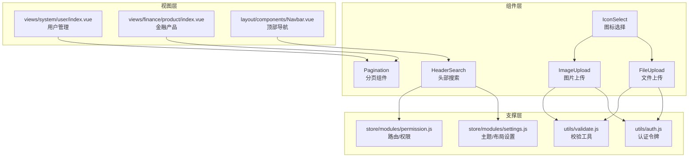
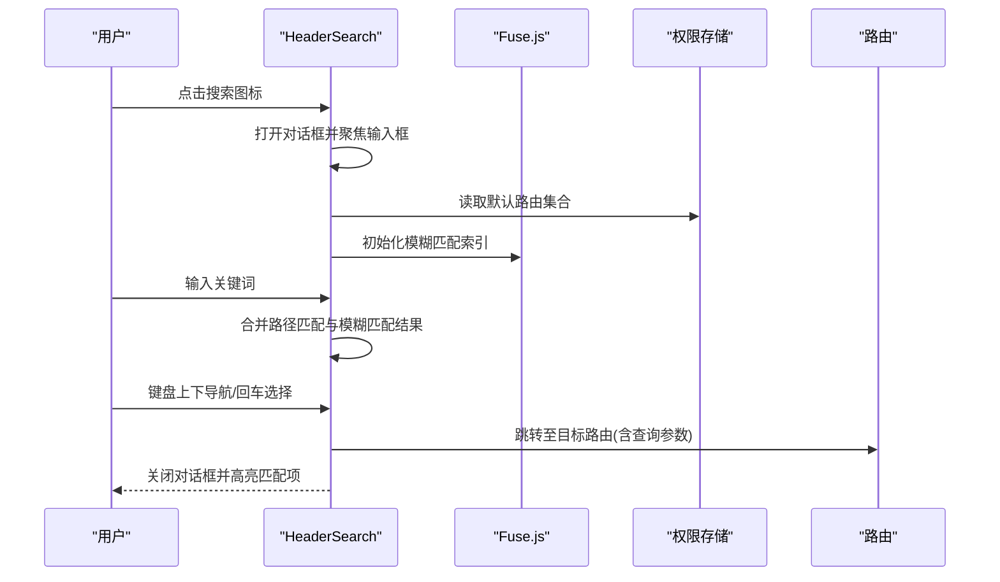
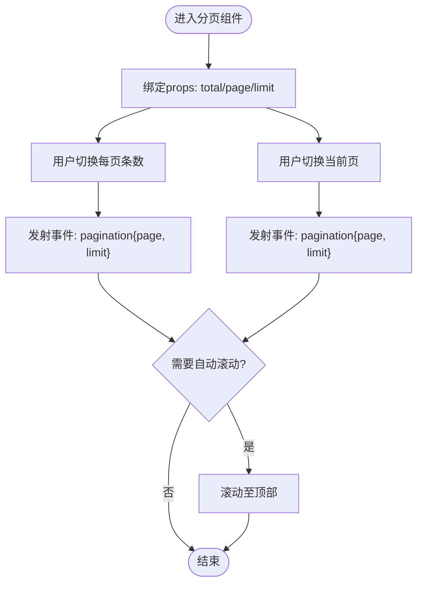
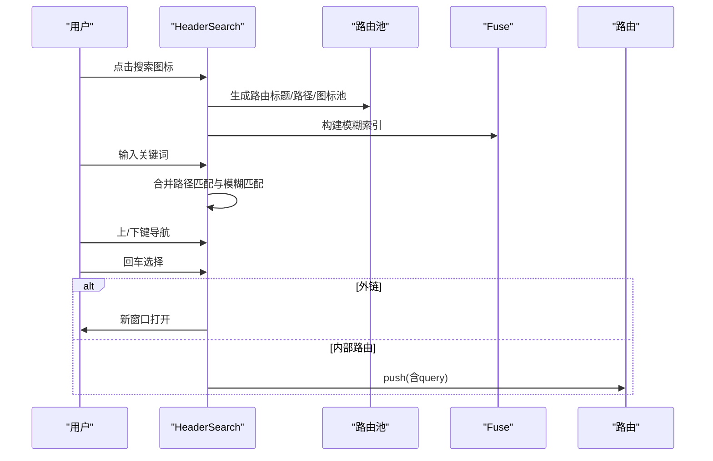
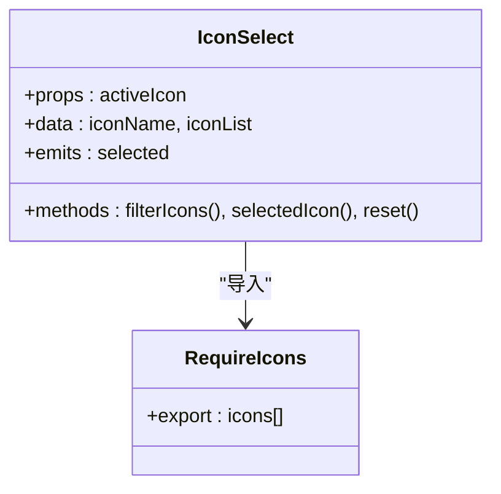
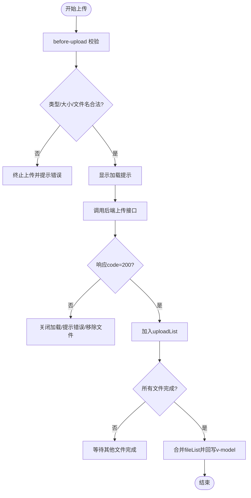
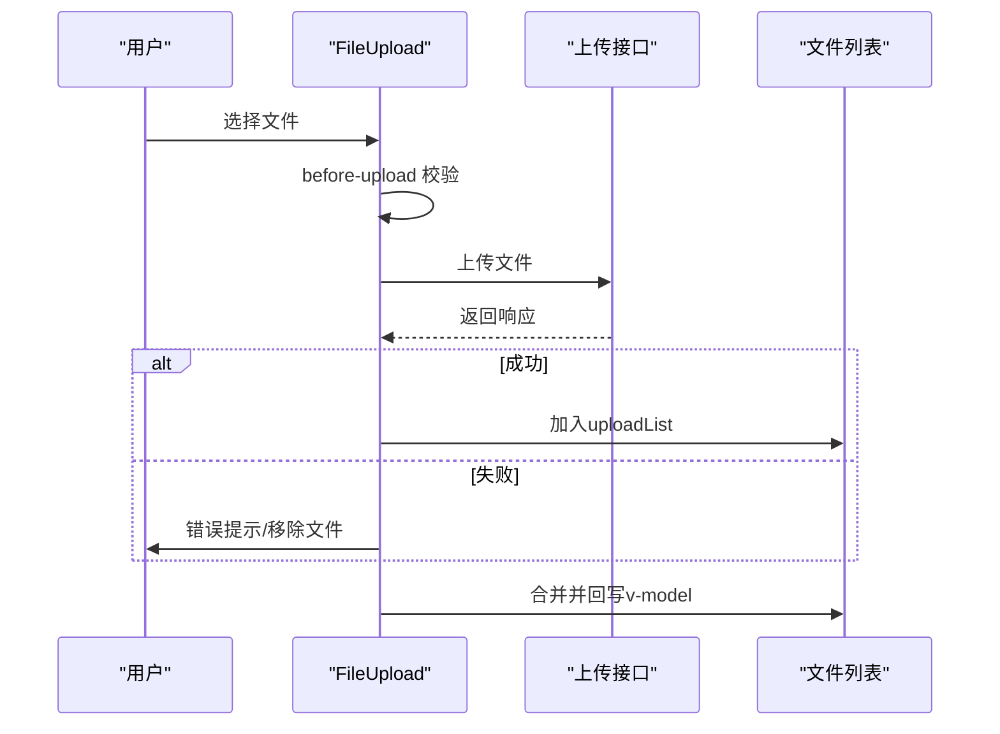
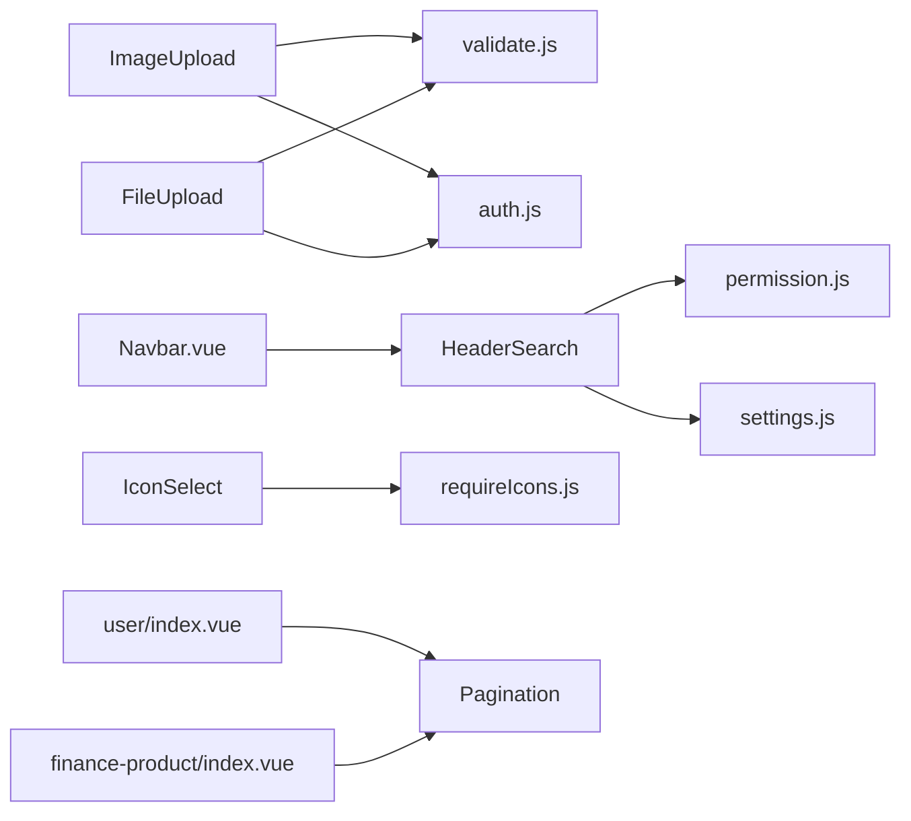

# 表单组件

<cite>
**本文引用的文件**
- [Pagination/index.vue](file://ruoyi-ui/src/components/Pagination/index.vue)
- [HeaderSearch/index.vue](file://ruoyi-ui/src/components/HeaderSearch/index.vue)
- [IconSelect/index.vue](file://ruoyi-ui/src/components/IconSelect/index.vue)
- [IconSelect/requireIcons.js](file://ruoyi-ui/src/components/IconSelect/requireIcons.js)
- [ImageUpload/index.vue](file://ruoyi-ui/src/components/ImageUpload/index.vue)
- [FileUpload/index.vue](file://ruoyi-ui/src/components/FileUpload/index.vue)
- [validate.js](file://ruoyi-ui/src/utils/validate.js)
- [auth.js](file://ruoyi-ui/src/utils/auth.js)
- [settings.js](file://ruoyi-ui/src/store/modules/settings.js)
- [permission.js](file://ruoyi-ui/src/store/modules/permission.js)
- [Navbar.vue](file://ruoyi-ui/src/layout/components/Navbar.vue)
- [user/index.vue](file://ruoyi-ui/src/views/system/user/index.vue)
- [finance-product/index.vue](file://ruoyi-ui/src/views/finance/product/index.vue)
</cite>

## 目录
1. [简介](#简介)
2. [项目结构](#项目结构)
3. [核心组件](#核心组件)
4. [架构总览](#架构总览)
5. [详细组件分析](#详细组件分析)
6. [依赖关系分析](#依赖关系分析)
7. [性能考量](#性能考量)
8. [故障排查指南](#故障排查指南)
9. [结论](#结论)
10. [附录](#附录)

## 简介
本技术文档聚焦于NeoCC前端ruoyi-ui工程中的表单相关组件，涵盖分页组件(Pagination)、搜索组件/HeaderSearch、图标选择器(IconSelect)、图片上传(ImageUpload)、文件上传(FileUpload)等表单交互组件。文档从架构与数据流、状态管理、事件处理、可配置性与样式定制、国际化支持、复杂业务场景组合使用以及性能优化等方面进行系统化梳理，并提供可视化图示与来源标注，帮助开发者快速理解与高效集成。

## 项目结构
- 组件集中位于 ruoyi-ui/src/components 下，按功能模块划分，便于复用与维护。
- 表单组件广泛应用于 ruoyi-ui/src/views 下的业务页面中，形成“视图层-组件层”的清晰边界。
- 工具函数与全局状态通过 ruoyi-ui/src/utils 与 ruoyi-ui/src/store 提供支撑，确保组件间共享能力与一致性。

图表来源
- [Pagination/index.vue:1-105](file://ruoyi-ui/src/components/Pagination/index.vue#L1-L105)
- [HeaderSearch/index.vue:1-398](file://ruoyi-ui/src/components/HeaderSearch/index.vue#L1-L398)
- [IconSelect/index.vue:1-111](file://ruoyi-ui/src/components/IconSelect/index.vue#L1-L111)
- [ImageUpload/index.vue:1-258](file://ruoyi-ui/src/components/ImageUpload/index.vue#L1-L258)
- [FileUpload/index.vue:1-257](file://ruoyi-ui/src/components/FileUpload/index.vue#L1-L257)
- [validate.js:1-115](file://ruoyi-ui/src/utils/validate.js#L1-L115)
- [auth.js:1-16](file://ruoyi-ui/src/utils/auth.js#L1-L16)
- [settings.js:1-54](file://ruoyi-ui/src/store/modules/settings.js#L1-L54)
- [permission.js:1-130](file://ruoyi-ui/src/store/modules/permission.js#L1-L130)
- [Navbar.vue:1-288](file://ruoyi-ui/src/layout/components/Navbar.vue#L1-L288)
- [user/index.vue:1-271](file://ruoyi-ui/src/views/system/user/index.vue#L1-L271)
- [finance-product/index.vue:1-171](file://ruoyi-ui/src/views/finance/product/index.vue#L1-L171)

章节来源
- [Pagination/index.vue:1-105](file://ruoyi-ui/src/components/Pagination/index.vue#L1-L105)
- [HeaderSearch/index.vue:1-398](file://ruoyi-ui/src/components/HeaderSearch/index.vue#L1-L398)
- [IconSelect/index.vue:1-111](file://ruoyi-ui/src/components/IconSelect/index.vue#L1-L111)
- [ImageUpload/index.vue:1-258](file://ruoyi-ui/src/components/ImageUpload/index.vue#L1-L258)
- [FileUpload/index.vue:1-257](file://ruoyi-ui/src/components/FileUpload/index.vue#L1-L257)
- [Navbar.vue:1-288](file://ruoyi-ui/src/layout/components/Navbar.vue#L1-L288)
- [user/index.vue:1-271](file://ruoyi-ui/src/views/system/user/index.vue#L1-L271)
- [finance-product/index.vue:1-171](file://ruoyi-ui/src/views/finance/product/index.vue#L1-L171)

## 核心组件
- 分页组件(Pagination)
  - 支持双向绑定页码与每页条数，提供布局、背景色、自动滚动、隐藏等配置；对外发射分页事件，便于父组件拉取数据。
- 搜索组件/HeaderSearch
  - 基于 Fuse.js 实现标题与路径的模糊检索，支持键盘导航、高亮匹配、HTTP外部链接新窗口打开、路由跳转。
- 图标选择器(IconSelect)
  - 动态枚举本地SVG图标，支持搜索过滤与选中回调；提供暴露重置方法以清空筛选条件。
- 图片上传(ImageUpload)
  - 基于 Element Plus Upload，支持多图、拖拽排序、预览弹窗、文件类型/大小校验、禁用模式、提示信息展示。
- 文件上传(FileUpload)
  - 基于 Element Plus Upload，支持多文件、拖拽排序、自定义列表渲染、删除、文件类型/大小校验、禁用模式。

章节来源
- [Pagination/index.vue:17-95](file://ruoyi-ui/src/components/Pagination/index.vue#L17-L95)
- [HeaderSearch/index.vue:79-246](file://ruoyi-ui/src/components/HeaderSearch/index.vue#L79-L246)
- [IconSelect/index.vue:26-58](file://ruoyi-ui/src/components/IconSelect/index.vue#L26-L58)
- [ImageUpload/index.vue:50-246](file://ruoyi-ui/src/components/ImageUpload/index.vue#L50-L246)
- [FileUpload/index.vue:43-230](file://ruoyi-ui/src/components/FileUpload/index.vue#L43-L230)

## 架构总览
- 组件间耦合度低：各组件通过props/emit与父组件通信，避免跨组件直接访问内部状态。
- 数据校验与安全：上传组件统一调用工具函数进行类型与大小校验，鉴权通过令牌注入请求头。
- 主题与布局：HeaderSearch与图标选择受全局主题设置影响，图标资源由构建期扫描注册。
- 权限与路由：HeaderSearch基于权限路由生成搜索池，保证只展示可访问菜单项。

图表来源
- [HeaderSearch/index.vue:97-225](file://ruoyi-ui/src/components/HeaderSearch/index.vue#L97-L225)
- [permission.js:11-57](file://ruoyi-ui/src/store/modules/permission.js#L11-L57)
- [settings.js:15-31](file://ruoyi-ui/src/store/modules/settings.js#L15-L31)

## 详细组件分析

### 分页组件(Pagination)
- 数据模型
  - 双向绑定：page(当前页)、limit(每页条数)，通过计算属性桥接props与事件。
  - 外部输入：total(总数)、layout(布局)、pageSizes(页大小选项)、pagerCount(移动端页码按钮数)、background、autoScroll、hidden。
- 处理流程
  - 页大小变化与当前页变化时，触发pagination事件并可自动滚动至顶部。
- 可配置性
  - 支持自定义布局与按钮数量，移动端自适应。
- 性能与可用性
  - 自动滚动减少用户手动回到顶部成本；隐藏控制用于无数据时的界面整洁。

图表来源
- [Pagination/index.vue:63-95](file://ruoyi-ui/src/components/Pagination/index.vue#L63-L95)

章节来源
- [Pagination/index.vue:17-95](file://ruoyi-ui/src/components/Pagination/index.vue#L17-L95)

### 搜索组件(HeaderSearch)
- 数据模型
  - 搜索词、结果集、活动索引、Fuse实例、路由集合。
- 处理流程
  - 初始化：从权限路由生成搜索池，构建Fuse索引。
  - 输入：路径精确匹配与模糊匹配合并去重，支持高亮关键词。
  - 导航：上下键循环切换，Enter选择；鼠标悬停同步活动项。
  - 跳转：HTTP外部链接新窗口打开；内部路由支持带查询参数跳转。
- 可配置性
  - 支持自定义高亮样式、快捷键提示、对话框宽度与占位符文案。
- 国际化支持
  - 当前实现为中文文案，若需国际化可在placeholder与提示文案处引入i18n插值。

图表来源
- [HeaderSearch/index.vue:139-225](file://ruoyi-ui/src/components/HeaderSearch/index.vue#L139-L225)
- [permission.js:11-57](file://ruoyi-ui/src/store/modules/permission.js#L11-L57)

章节来源
- [HeaderSearch/index.vue:79-246](file://ruoyi-ui/src/components/HeaderSearch/index.vue#L79-L246)
- [Navbar.vue:11-13](file://ruoyi-ui/src/layout/components/Navbar.vue#L11-L13)

### 图标选择器(IconSelect)
- 数据模型
  - 活动图标、图标列表(构建期扫描注册)、搜索关键词。
- 处理流程
  - 初始化：从requireIcons.js加载全部SVG图标名称。
  - 过滤：根据关键词对图标名称进行包含匹配。
  - 选中：触发selected事件并关闭遮罩。
  - 暴露：提供reset方法清空筛选。
- 可配置性
  - 通过props接收当前活动图标；通过selected事件回传选中值。
- 样式定制
  - 使用SvgIcon组件渲染，支持className与尺寸调整。

图表来源
- [IconSelect/index.vue:26-58](file://ruoyi-ui/src/components/IconSelect/index.vue#L26-L58)
- [IconSelect/requireIcons.js:1-8](file://ruoyi-ui/src/components/IconSelect/requireIcons.js#L1-L8)

章节来源
- [IconSelect/index.vue:26-58](file://ruoyi-ui/src/components/IconSelect/index.vue#L26-L58)
- [IconSelect/requireIcons.js:1-8](file://ruoyi-ui/src/components/IconSelect/requireIcons.js#L1-L8)

### 图片上传(ImageUpload)
- 数据模型
  - 上传接口地址、附加参数、数量限制、大小限制(MB)、文件类型数组、是否显示提示、禁用模式、拖拽排序开关。
  - 内部状态：fileList、uploadList、dialogVisible、dialogImageUrl、number计数。
- 处理流程
  - before-upload：校验类型、文件名合法性、大小；显示加载提示。
  - success/error：根据响应code处理成功/失败，累计完成数量后合并fileList并回写v-model。
  - exceed：超出数量限制提示。
  - preview：弹窗预览图片。
  - delete：移除文件并更新v-model。
  - 拖拽排序：初始化Sortable，拖拽结束后更新顺序并回写v-model。
- 可配置性
  - 支持禁用模式仅展示；支持隐藏上传入口；支持自定义提示文案。
- 安全与校验
  - 通过工具函数校验外链与HTTP协议；鉴权通过Authorization头注入。

图表来源
- [ImageUpload/index.vue:134-206](file://ruoyi-ui/src/components/ImageUpload/index.vue#L134-L206)
- [validate.js:39-41](file://ruoyi-ui/src/utils/validate.js#L39-L41)
- [auth.js:5-7](file://ruoyi-ui/src/utils/auth.js#L5-L7)

章节来源
- [ImageUpload/index.vue:50-246](file://ruoyi-ui/src/components/ImageUpload/index.vue#L50-L246)
- [validate.js:39-41](file://ruoyi-ui/src/utils/validate.js#L39-L41)
- [auth.js:5-7](file://ruoyi-ui/src/utils/auth.js#L5-L7)

### 文件上传(FileUpload)
- 数据模型
  - 与图片上传类似，但列表以文本形式展示，支持删除与下载链接。
- 处理流程
  - before-upload：校验扩展名、文件名合法性、大小；显示加载提示。
  - success/error：成功则加入uploadList，完成后合并fileList并回写v-model。
  - exceed：超出数量限制提示。
  - 拖拽排序：初始化Sortable，拖拽结束后更新顺序并回写v-model。
- 可配置性
  - 支持禁用模式仅展示；支持自定义提示文案；支持拖拽排序。

图表来源
- [FileUpload/index.vue:122-191](file://ruoyi-ui/src/components/FileUpload/index.vue#L122-L191)

章节来源
- [FileUpload/index.vue:43-230](file://ruoyi-ui/src/components/FileUpload/index.vue#L43-L230)

## 依赖关系分析
- 组件依赖
  - ImageUpload/FileUpload 依赖 validate.js 与 auth.js 进行类型/大小校验与鉴权。
  - HeaderSearch 依赖 permission.js 生成搜索池，依赖 settings.js 获取主题色用于高亮。
  - IconSelect 依赖 requireIcons.js 注册图标资源。
- 视图层依赖
  - 用户管理与金融产品页面均使用 Pagination 组件实现分页查询。
  - Navbar 引入 HeaderSearch 作为顶部导航右侧搜索入口。

图表来源
- [ImageUpload/index.vue:50-106](file://ruoyi-ui/src/components/ImageUpload/index.vue#L50-L106)
- [FileUpload/index.vue:43-96](file://ruoyi-ui/src/components/FileUpload/index.vue#L43-L96)
- [HeaderSearch/index.vue:83-95](file://ruoyi-ui/src/components/HeaderSearch/index.vue#L83-L95)
- [IconSelect/index.vue:26-37](file://ruoyi-ui/src/components/IconSelect/index.vue#L26-L37)
- [user/index.vue:54-54](file://ruoyi-ui/src/views/system/user/index.vue#L54-L54)
- [finance-product/index.vue:51-51](file://ruoyi-ui/src/views/finance/product/index.vue#L51-L51)
- [Navbar.vue:11-13](file://ruoyi-ui/src/layout/components/Navbar.vue#L11-L13)

章节来源
- [validate.js:1-115](file://ruoyi-ui/src/utils/validate.js#L1-L115)
- [auth.js:1-16](file://ruoyi-ui/src/utils/auth.js#L1-L16)
- [settings.js:1-54](file://ruoyi-ui/src/store/modules/settings.js#L1-L54)
- [permission.js:1-130](file://ruoyi-ui/src/store/modules/permission.js#L1-L130)
- [IconSelect/requireIcons.js:1-8](file://ruoyi-ui/src/components/IconSelect/requireIcons.js#L1-L8)
- [user/index.vue:54-54](file://ruoyi-ui/src/views/system/user/index.vue#L54-L54)
- [finance-product/index.vue:51-51](file://ruoyi-ui/src/views/finance/product/index.vue#L51-L51)
- [Navbar.vue:11-13](file://ruoyi-ui/src/layout/components/Navbar.vue#L11-L13)

## 性能考量
- 搜索组件
  - Fuse索引在路由池变更时重建，建议在路由稳定后初始化，避免频繁重建导致抖动。
  - 高亮正则需转义特殊字符，防止大文本高亮造成渲染压力。
- 上传组件
  - before-upload阶段尽早校验，减少无效请求；成功/失败批量处理，降低多次回写v-model的开销。
  - 拖拽排序使用Sortable，注意在禁用模式下不初始化以节省资源。
- 分页组件
  - autoScroll在大数据表格中可能带来滚动抖动，建议在大量数据场景关闭该行为。

## 故障排查指南
- 上传失败
  - 检查before-upload校验逻辑与响应code；确认鉴权头是否正确注入；查看控制台网络请求与后端日志。
- 文件名非法
  - 文件名包含逗号会被拒绝，需在前端提示并引导用户更正。
- 类型不符
  - 图片上传支持image/*或指定类型；文件上传支持指定扩展名；请核对fileType配置。
- 外链跳转异常
  - HeaderSearch对HTTP(S)路径采用新窗口打开，确认URL格式与目标站点可访问性。
- 搜索无结果
  - 确认路由池已生成且Fuse索引已初始化；检查关键词大小写与权重设置。

章节来源
- [ImageUpload/index.vue:134-212](file://ruoyi-ui/src/components/ImageUpload/index.vue#L134-L212)
- [FileUpload/index.vue:122-160](file://ruoyi-ui/src/components/FileUpload/index.vue#L122-L160)
- [HeaderSearch/index.vue:185-203](file://ruoyi-ui/src/components/HeaderSearch/index.vue#L185-L203)

## 结论
上述表单组件在NeoCC中承担了搜索、分页、媒体与文件上传等高频交互职责。它们通过清晰的props/emit契约、完善的校验与错误处理、灵活的可配置性与样式定制，实现了良好的可复用性与可维护性。结合权限路由与主题设置，组件在复杂业务场景下仍能保持一致的用户体验与性能表现。

## 附录
- 组合使用建议
  - 在列表页同时使用 Pagination 与 HeaderSearch，实现“搜索+分页”的完整查询闭环。
  - 在表单编辑页使用 IconSelect 与 ImageUpload/FileUpload，统一图标与附件管理体验。
- 国际化与主题
  - HeaderSearch与提示文案可扩展为i18n；图标高亮颜色可随主题动态切换。
- 最佳实践
  - 将校验逻辑前置到before-upload，减少无效请求；
  - 在大数据场景关闭autoScroll与高亮闪烁；
  - 合理设置pageSizes与limit，平衡加载性能与用户体验。