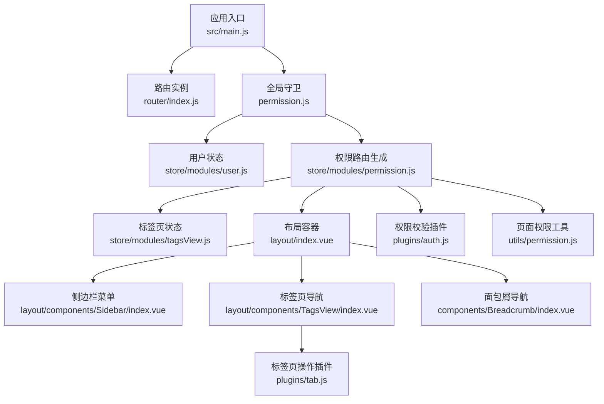
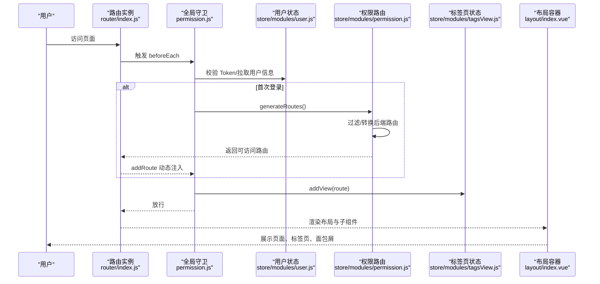
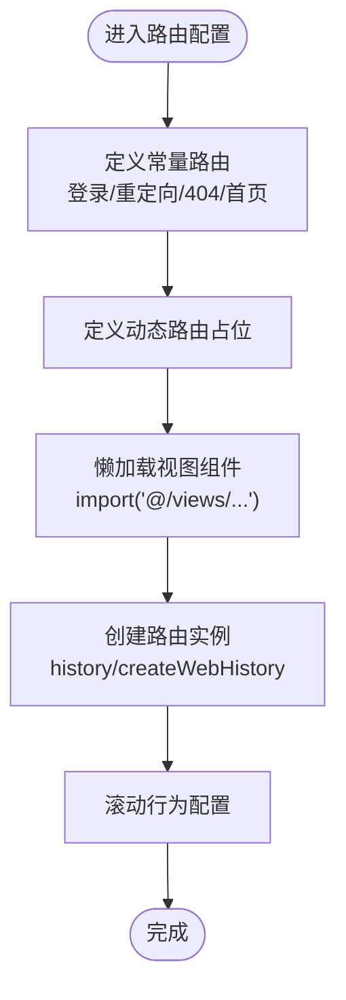
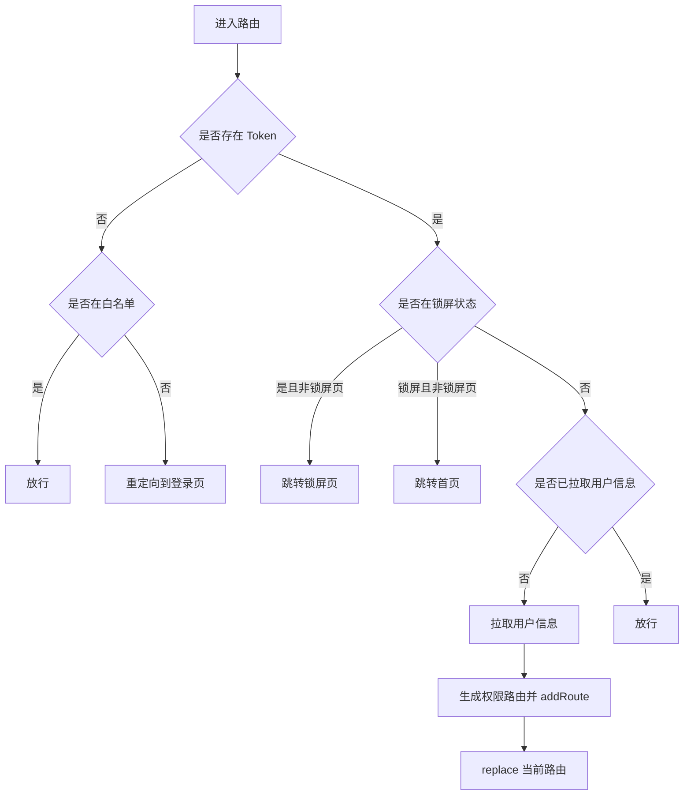
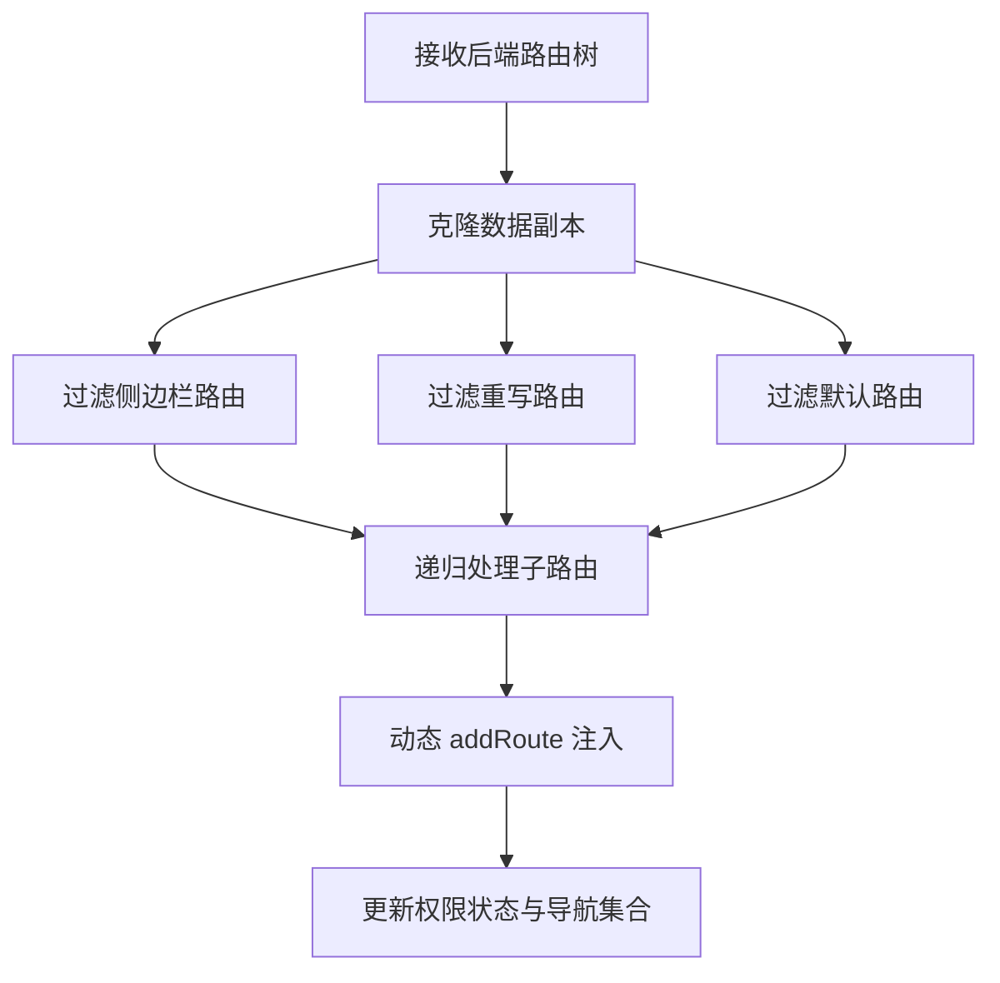
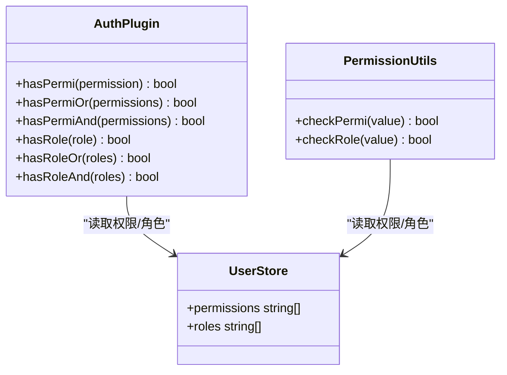
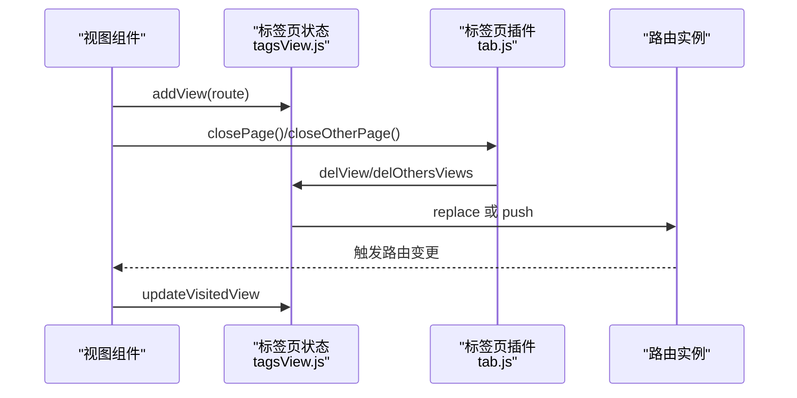
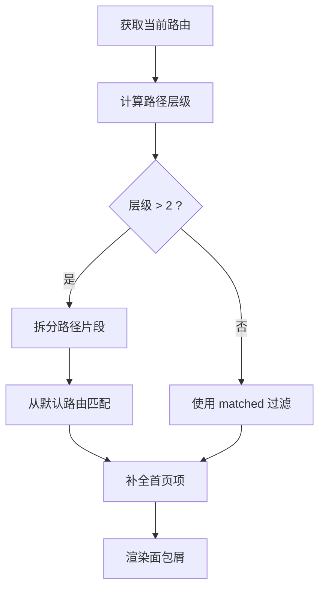
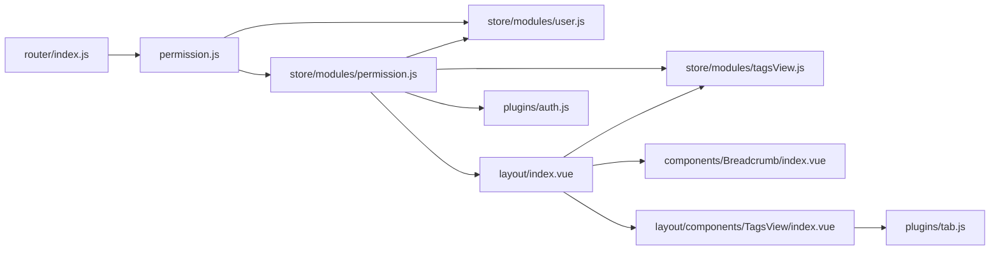

# 路由系统

<cite>
**本文档引用的文件**
- [router/index.js](file://ruoyi-ui/src/router/index.js)
- [permission.js](file://ruoyi-ui/src/permission.js)
- [store/modules/permission.js](file://ruoyi-ui/src/store/modules/permission.js)
- [store/modules/user.js](file://ruoyi-ui/src/store/modules/user.js)
- [store/modules/tagsView.js](file://ruoyi-ui/src/store/modules/tagsView.js)
- [plugins/auth.js](file://ruoyi-ui/src/plugins/auth.js)
- [utils/permission.js](file://ruoyi-ui/src/utils/permission.js)
- [src/main.js](file://ruoyi-ui/src/main.js)
- [layout/index.vue](file://ruoyi-ui/src/layout/index.vue)
- [layout/components/TagsView/index.vue](file://ruoyi-ui/src/layout/components/TagsView/index.vue)
- [components/Breadcrumb/index.vue](file://ruoyi-ui/src/components/Breadcrumb/index.vue)
- [plugins/tab.js](file://ruoyi-ui/src/plugins/tab.js)
- [views/index.vue](file://ruoyi-ui/src/views/index.vue)
- [views/system/user/index.vue](file://ruoyi-ui/src/views/system/user/index.vue)
- [views/sales/customer/index.vue](file://ruoyi-ui/src/views/sales/customer/index.vue)
</cite>

## 目录
1. [简介](#简介)
2. [项目结构](#项目结构)
3. [核心组件](#核心组件)
4. [架构总览](#架构总览)
5. [详细组件分析](#详细组件分析)
6. [依赖关系分析](#依赖关系分析)
7. [性能考虑](#性能考虑)
8. [故障排除指南](#故障排除指南)
9. [结论](#结论)

## 简介
本文件系统性梳理并解析本项目前端路由体系，重点覆盖 Vue Router 的配置与使用、路由守卫与权限控制、标签页与面包屑导航、动态路由与懒加载策略、以及最佳实践与安全考量。文档面向不同层次读者，既提供高层架构视图，也给出代码级细节与可视化图表。

## 项目结构
路由相关的核心文件分布于以下位置：
- 路由定义与实例化：router/index.js
- 全局路由守卫：permission.js
- 权限状态管理：store/modules/permission.js、store/modules/user.js
- 标签页状态管理：store/modules/tagsView.js
- 权限校验插件：plugins/auth.js
- 页面级权限校验工具：utils/permission.js
- 应用入口与插件注册：src/main.js
- 布局容器与导航组件：layout/index.vue、layout/components/TagsView/index.vue、components/Breadcrumb/index.vue
- 标签页操作插件：plugins/tab.js
- 示例页面：views/index.vue、views/system/user/index.vue、views/sales/customer/index.vue

**图表来源**
- [src/main.js:1-84](file://ruoyi-ui/src/main.js#L1-L84)
- [router/index.js:1-68](file://ruoyi-ui/src/router/index.js#L1-L68)
- [permission.js:1-78](file://ruoyi-ui/src/permission.js#L1-L78)
- [store/modules/user.js:1-93](file://ruoyi-ui/src/store/modules/user.js#L1-L93)
- [store/modules/permission.js:1-130](file://ruoyi-ui/src/store/modules/permission.js#L1-L130)
- [store/modules/tagsView.js:1-227](file://ruoyi-ui/src/store/modules/tagsView.js#L1-L227)
- [layout/index.vue:1-116](file://ruoyi-ui/src/layout/index.vue#L1-L116)
- [layout/components/TagsView/index.vue:1-712](file://ruoyi-ui/src/layout/components/TagsView/index.vue#L1-L712)
- [components/Breadcrumb/index.vue:1-97](file://ruoyi-ui/src/components/Breadcrumb/index.vue#L1-L97)
- [plugins/auth.js:1-61](file://ruoyi-ui/src/plugins/auth.js#L1-L61)
- [utils/permission.js:1-51](file://ruoyi-ui/src/utils/permission.js#L1-L51)
- [plugins/tab.js:1-76](file://ruoyi-ui/src/plugins/tab.js#L1-L76)

**章节来源**
- [src/main.js:1-84](file://ruoyi-ui/src/main.js#L1-L84)
- [router/index.js:1-68](file://ruoyi-ui/src/router/index.js#L1-L68)

## 核心组件
- 路由定义与实例化：定义常量路由与动态路由占位，创建路由实例并配置滚动行为。
- 全局路由守卫：基于 Token、白名单、锁屏状态进行前置拦截；首次登录拉取用户信息与权限路由，动态注入可访问路由。
- 权限状态管理：从后端拉取路由树，转换为可渲染组件，过滤出侧边栏、顶部导航与默认路由集合。
- 用户状态管理：维护 Token、角色与权限数组，提供登录、获取信息、登出等动作。
- 标签页状态管理：维护已访问页、缓存页、内嵌页，支持持久化、增删改查与左右/其他/全部关闭等操作。
- 权限校验插件与工具：提供页面级权限与角色校验方法，支持“任一满足/全部满足”策略。
- 布局与导航：布局容器整合侧边栏、标签页、面包屑；标签页组件支持滚动、右键菜单、全屏模式与刷新。
- 标签页操作插件：封装刷新、关闭、打开、更新等标签页操作，配合路由与标签页状态管理。

**章节来源**
- [router/index.js:1-68](file://ruoyi-ui/src/router/index.js#L1-L68)
- [permission.js:1-78](file://ruoyi-ui/src/permission.js#L1-L78)
- [store/modules/permission.js:1-130](file://ruoyi-ui/src/store/modules/permission.js#L1-L130)
- [store/modules/user.js:1-93](file://ruoyi-ui/src/store/modules/user.js#L1-L93)
- [store/modules/tagsView.js:1-227](file://ruoyi-ui/src/store/modules/tagsView.js#L1-L227)
- [plugins/auth.js:1-61](file://ruoyi-ui/src/plugins/auth.js#L1-L61)
- [utils/permission.js:1-51](file://ruoyi-ui/src/utils/permission.js#L1-L51)
- [layout/index.vue:1-116](file://ruoyi-ui/src/layout/index.vue#L1-L116)
- [layout/components/TagsView/index.vue:1-712](file://ruoyi-ui/src/layout/components/TagsView/index.vue#L1-L712)
- [components/Breadcrumb/index.vue:1-97](file://ruoyi-ui/src/components/Breadcrumb/index.vue#L1-L97)
- [plugins/tab.js:1-76](file://ruoyi-ui/src/plugins/tab.js#L1-L76)

## 架构总览
下图展示从用户访问到页面渲染的完整链路，包括路由守卫、权限路由生成、标签页与面包屑联动。

**图表来源**
- [permission.js:21-73](file://ruoyi-ui/src/permission.js#L21-L73)
- [store/modules/user.js:42-74](file://ruoyi-ui/src/store/modules/user.js#L42-L74)
- [store/modules/permission.js:35-56](file://ruoyi-ui/src/store/modules/permission.js#L35-L56)
- [store/modules/tagsView.js:33-67](file://ruoyi-ui/src/store/modules/tagsView.js#L33-L67)
- [layout/index.vue:1-116](file://ruoyi-ui/src/layout/index.vue#L1-L116)

## 详细组件分析

### 路由定义与懒加载
- 常量路由：登录、重定向、404/401、首页等固定入口。
- 动态路由：预留占位，当前项目暂未启用。
- 懒加载策略：通过动态 import 实现按需加载视图组件，减少首屏体积。
- 历史模式：使用 HTML5 History 模式，结合后端统一处理 404。

**图表来源**
- [router/index.js:10-68](file://ruoyi-ui/src/router/index.js#L10-L68)

**章节来源**
- [router/index.js:1-68](file://ruoyi-ui/src/router/index.js#L1-L68)

### 全局路由守卫与权限控制
- 白名单：登录、注册等无需鉴权路径。
- Token 校验：无 Token 时重定向至登录页。
- 锁屏状态：根据锁屏状态跳转至锁屏或首页。
- 首次登录：拉取用户信息与权限路由，动态注入可访问路由。
- 页面标题：根据 meta.title 设置浏览器标题。
- 进度条：NProgress 控制加载状态。

**图表来源**
- [permission.js:21-73](file://ruoyi-ui/src/permission.js#L21-L73)

**章节来源**
- [permission.js:1-78](file://ruoyi-ui/src/permission.js#L1-L78)

### 权限路由生成与过滤
- 后端路由数据：从菜单接口获取路由树，兼容多层嵌套。
- 组件映射：将字符串组件名映射为实际组件（Layout、ParentView、InnerLink 等）。
- 子路由扁平化：对 ParentView 类型子路由进行路径拼接与扁平化处理。
- 权限过滤：支持按角色或权限进行过滤，仅保留当前用户可访问的路由。
- 侧边栏/顶部导航/默认路由：分别生成不同形态的路由集合。

**图表来源**
- [store/modules/permission.js:35-56](file://ruoyi-ui/src/store/modules/permission.js#L35-L56)
- [store/modules/permission.js:61-116](file://ruoyi-ui/src/store/modules/permission.js#L61-L116)

**章节来源**
- [store/modules/permission.js:1-130](file://ruoyi-ui/src/store/modules/permission.js#L1-L130)

### 页面级权限校验
- 字符权限：checkPermi 支持“任一满足/全部满足”，通配符 *:*:* 具备最高权限。
- 角色权限：checkRole 支持 admin 超级角色与自定义角色集合。
- 插件封装：plugins/auth.js 提供 hasPermi/hasRole 系列方法，便于指令与组件使用。

**图表来源**
- [plugins/auth.js:1-61](file://ruoyi-ui/src/plugins/auth.js#L1-L61)
- [utils/permission.js:1-51](file://ruoyi-ui/src/utils/permission.js#L1-L51)
- [store/modules/user.js:1-93](file://ruoyi-ui/src/store/modules/user.js#L1-L93)

**章节来源**
- [plugins/auth.js:1-61](file://ruoyi-ui/src/plugins/auth.js#L1-L61)
- [utils/permission.js:1-51](file://ruoyi-ui/src/utils/permission.js#L1-L51)
- [store/modules/user.js:1-93](file://ruoyi-ui/src/store/modules/user.js#L1-L93)

### 标签页管理
- 状态模型：visitedViews、cachedViews、iframeViews。
- 持久化：支持本地存储已访问页，刷新后恢复。
- 操作能力：新增、删除、关闭其他、关闭左侧/右侧、全部关闭、刷新。
- 交互体验：滚动箭头、右键菜单、全屏模式、键盘快捷键。

**图表来源**
- [store/modules/tagsView.js:33-222](file://ruoyi-ui/src/store/modules/tagsView.js#L33-L222)
- [plugins/tab.js:37-74](file://ruoyi-ui/src/plugins/tab.js#L37-L74)

**章节来源**
- [store/modules/tagsView.js:1-227](file://ruoyi-ui/src/store/modules/tagsView.js#L1-L227)
- [plugins/tab.js:1-76](file://ruoyi-ui/src/plugins/tab.js#L1-L76)

### 面包屑导航
- 路径解析：根据当前路由路径层级计算匹配关系。
- 多级菜单：支持多级路径匹配，从默认路由集合中查找对应项。
- 首页补充：若非首页，自动在最左侧插入首页项。
- 可点击：支持点击跳转，避免重定向页面。

**图表来源**
- [components/Breadcrumb/index.vue:20-83](file://ruoyi-ui/src/components/Breadcrumb/index.vue#L20-L83)

**章节来源**
- [components/Breadcrumb/index.vue:1-97](file://ruoyi-ui/src/components/Breadcrumb/index.vue#L1-L97)

### 嵌套路由与动态路由实现
- 嵌套路由：通过 children 定义子路由，结合 Layout/ParentView 实现多级菜单。
- 动态路由：后端返回路由树，前端转换为组件对象并 addRoute 注入。
- 菜单权限：通过 permissions/roles 字段控制路由可见性与访问权限。

**章节来源**
- [router/index.js:1-68](file://ruoyi-ui/src/router/index.js#L1-L68)
- [store/modules/permission.js:61-116](file://ruoyi-ui/src/store/modules/permission.js#L61-L116)

### 示例页面与路由元信息
- 首页：作为常量路由，设置 title、icon、affix 等元信息。
- 系统管理/销售管理：通过路由元信息驱动面包屑与标签页标题。
- 页面访问控制：结合页面级权限校验指令与组件逻辑，确保仅授权用户可见/操作。

**章节来源**
- [views/index.vue:1-494](file://ruoyi-ui/src/views/index.vue#L1-L494)
- [views/system/user/index.vue:1-271](file://ruoyi-ui/src/views/system/user/index.vue#L1-L271)
- [views/sales/customer/index.vue:1-188](file://ruoyi-ui/src/views/sales/customer/index.vue#L1-L188)

## 依赖关系分析
- 路由实例依赖：常量路由、动态路由占位、滚动行为配置。
- 守卫依赖：用户状态、权限路由、标签页状态、设置状态。
- 权限路由依赖：后端菜单接口、组件映射、动态路由注入。
- 导航组件依赖：权限路由集合、设置状态、标签页状态。

**图表来源**
- [router/index.js:1-68](file://ruoyi-ui/src/router/index.js#L1-L68)
- [permission.js:1-78](file://ruoyi-ui/src/permission.js#L1-L78)
- [store/modules/user.js:1-93](file://ruoyi-ui/src/store/modules/user.js#L1-L93)
- [store/modules/permission.js:1-130](file://ruoyi-ui/src/store/modules/permission.js#L1-L130)
- [store/modules/tagsView.js:1-227](file://ruoyi-ui/src/store/modules/tagsView.js#L1-L227)
- [layout/index.vue:1-116](file://ruoyi-ui/src/layout/index.vue#L1-L116)
- [components/Breadcrumb/index.vue:1-97](file://ruoyi-ui/src/components/Breadcrumb/index.vue#L1-L97)
- [layout/components/TagsView/index.vue:1-712](file://ruoyi-ui/src/layout/components/TagsView/index.vue#L1-L712)
- [plugins/tab.js:1-76](file://ruoyi-ui/src/plugins/tab.js#L1-L76)
- [plugins/auth.js:1-61](file://ruoyi-ui/src/plugins/auth.js#L1-L61)

**章节来源**
- [router/index.js:1-68](file://ruoyi-ui/src/router/index.js#L1-L68)
- [permission.js:1-78](file://ruoyi-ui/src/permission.js#L1-L78)
- [store/modules/permission.js:1-130](file://ruoyi-ui/src/store/modules/permission.js#L1-L130)

## 性能考虑
- 懒加载：通过动态 import 按需加载视图，降低首屏资源占用。
- 缓存策略：标签页缓存与持久化，减少重复渲染与网络请求。
- 路由复用：利用 keep-alive 与缓存页集合，避免重复创建组件实例。
- 进度条：NProgress 提升用户感知，避免长时间无反馈。
- 滚动行为：保存/恢复滚动位置，提升连续浏览体验。

[本节为通用性能建议，无需特定文件引用]

## 故障排除指南
- 登录后循环跳转：检查白名单匹配与锁屏状态判断逻辑。
- 权限路由不生效：确认后端返回的组件名与映射规则一致，检查权限过滤函数。
- 标签页无法关闭：核对标签页状态更新与路由替换逻辑，确保路径与 fullPath 一致。
- 面包屑异常：检查默认路由集合与路径层级匹配逻辑，确认首页项插入条件。
- 页面权限校验失败：确认用户权限/角色数据拉取与存储流程，检查通配符与集合匹配规则。

**章节来源**
- [permission.js:15-78](file://ruoyi-ui/src/permission.js#L15-L78)
- [store/modules/permission.js:101-116](file://ruoyi-ui/src/store/modules/permission.js#L101-L116)
- [store/modules/tagsView.js:68-222](file://ruoyi-ui/src/store/modules/tagsView.js#L68-L222)
- [components/Breadcrumb/index.vue:20-83](file://ruoyi-ui/src/components/Breadcrumb/index.vue#L20-L83)
- [utils/permission.js:8-51](file://ruoyi-ui/src/utils/permission.js#L8-L51)

## 结论
本项目的路由系统以 Vue Router 为核心，结合全局守卫、权限路由生成与标签页/面包屑导航，构建了完整的前端访问控制与用户体验体系。通过懒加载与缓存策略优化性能，通过权限插件与工具实现细粒度的页面级访问控制。建议在后续迭代中逐步启用动态路由与更丰富的嵌套菜单，并完善权限校验的边界场景与错误提示。