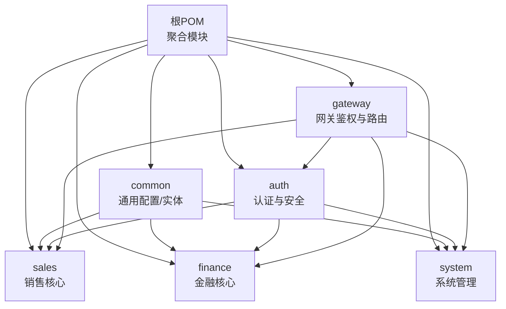
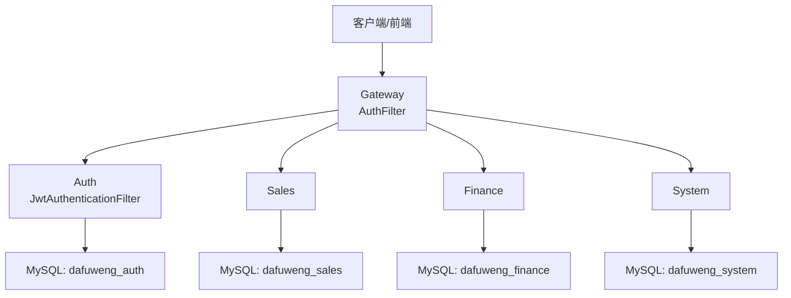
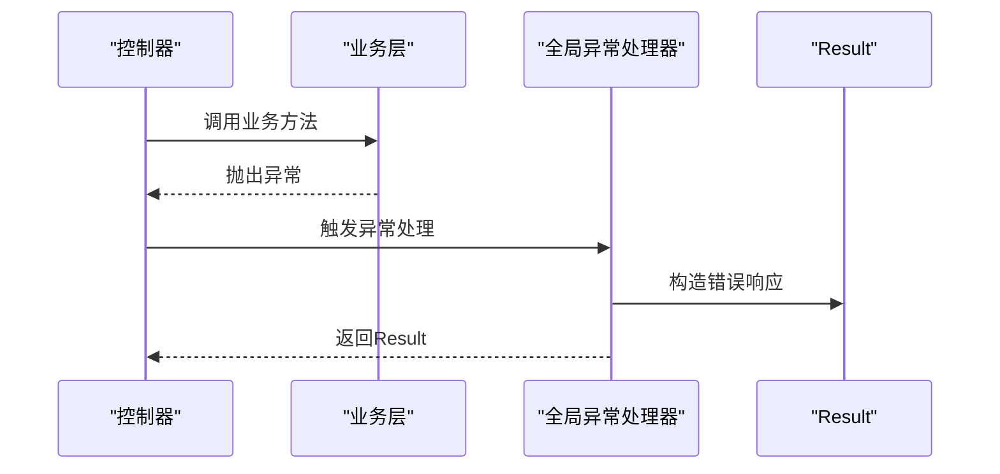
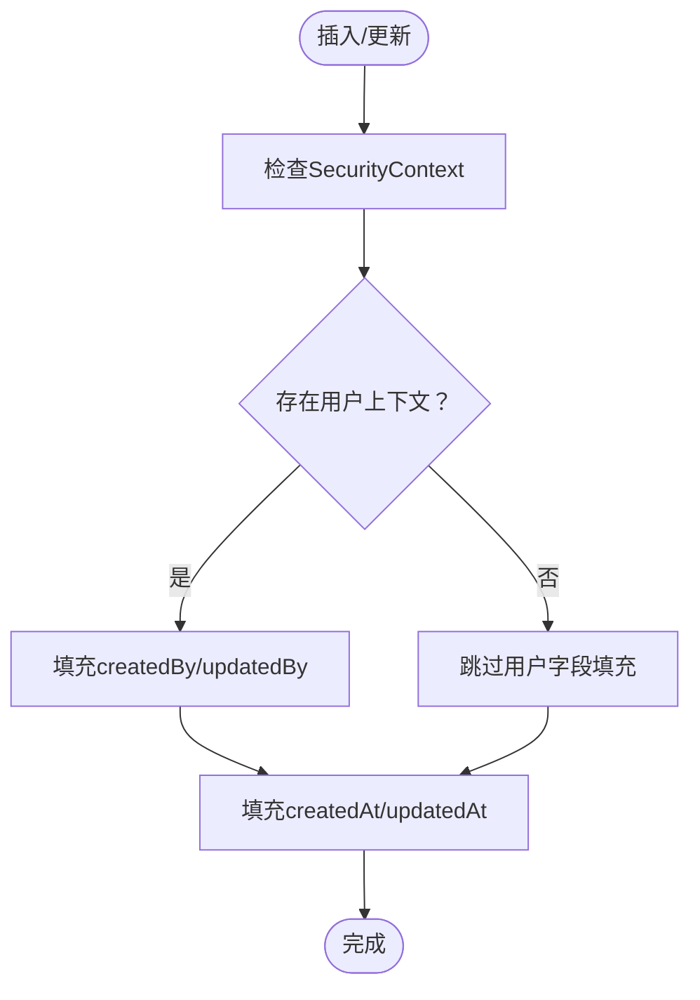
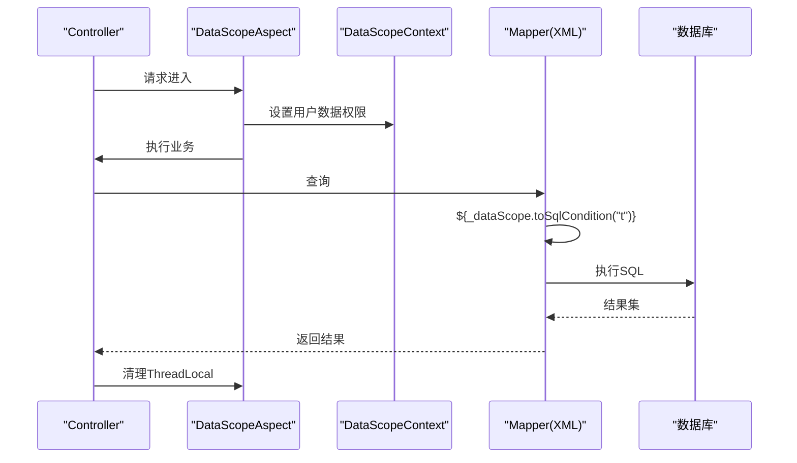
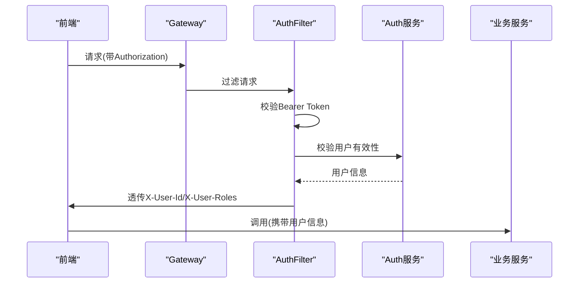
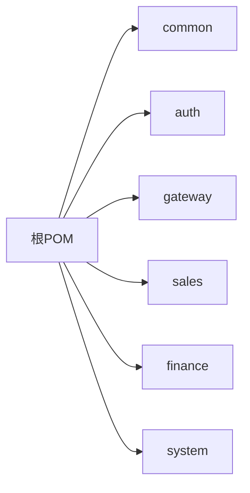

# 开发指南

<cite>
**本文引用的文件**
- [pom.xml](file://pom.xml)
- [GlobalExceptionHandler.java](file://common/src/main/java/com/dafuweng/common/exception/GlobalExceptionHandler.java)
- [AutoFillMetaObjectHandler.java](file://common/src/main/java/com/dafuweng/common/config/AutoFillMetaObjectHandler.java)
- [DataScopeAspect.java](file://common/src/main/java/com/dafuweng/common/config/DataScopeAspect.java)
- [DataScopeContext.java](file://common/src/main/java/com/dafuweng/common/config/DataScopeContext.java)
- [Result.java](file://common/src/main/java/com/dafuweng/common/entity/Result.java)
- [JwtAuthenticationFilter.java](file://auth/src/main/java/com/dafuweng/auth/filter/JwtAuthenticationFilter.java)
- [SecurityConfig.java](file://auth/src/main/java/com/dafuweng/auth/config/SecurityConfig.java)
- [PasswordEncoderConfig.java](file://auth/src/main/java/com/dafuweng/auth/config/PasswordEncoderConfig.java)
- [AuthFilter.java](file://gateway/src/main/java/com/dafuweng/gateway/filter/AuthFilter.java)
- [OperationLogAspect.java](file://system/src/main/java/com/dafuweng/system/config/OperationLogAspect.java)
- [ContractSignServiceImplTest.java](file://sales/src/test/java/com/dafuweng/sales/service/impl/ContractSignServiceImplTest.java)
- [CommissionRecordServiceImplTest.java](file://finance/src/test/java/com/dafuweng/finance/service/impl/CommissionRecordServiceImplTest.java)
- [ContractSignedListenerTest.java](file://finance/src/test/java/com/dafuweng/finance/mq/ContractSignedListenerTest.java)
- [Check01.md](file://scripts/qa/Check01.md)
- [implementDetails.md](file://implementDetails.md)
</cite>

## 目录
1. [简介](#简介)
2. [项目结构](#项目结构)
3. [核心组件](#核心组件)
4. [架构总览](#架构总览)
5. [详细组件分析](#详细组件分析)
6. [依赖分析](#依赖分析)
7. [性能考虑](#性能考虑)
8. [故障排查指南](#故障排查指南)
9. [结论](#结论)
10. [附录](#附录)

## 简介
本开发指南面向NeoCC项目的后端与网关/认证模块，聚焦于代码规范、开发约定、环境配置、通用组件使用、测试策略、质量保障流程、版本控制与分支管理、常见问题与调试技巧，以及新功能开发的标准流程与模板。当前仓库已实现基础通用组件与部分模块骨架，但与实施方案存在模块缺失与技术栈对齐问题，需按指南逐步补齐。

## 项目结构
项目采用Maven多模块结构，根POM负责聚合模块；common模块提供通用配置与实体；auth、gateway、sales、finance、system为独立业务模块。当前auth与gateway模块尚未实现，sales与finance/system模块依赖尚需完善。

图表来源
- [pom.xml:12-19](file://pom.xml#L12-L19)

章节来源
- [pom.xml:1-22](file://pom.xml#L1-L22)

## 核心组件
本节梳理通用组件：全局异常处理、自动填充、数据权限控制、统一响应结构、认证与网关鉴权。

- 全局异常处理：集中捕获常见异常并返回统一响应结构，便于前端统一处理。
- 自动填充：MyBatis-Plus元对象处理器，自动填充创建/更新时间与操作人字段，兼容无用户上下文场景。
- 数据权限控制：AOP切面从安全上下文提取用户数据权限，生成SQL片段条件，DAO层通过OGNL引用。
- 统一响应结构：Result封装code/message/data，提供便捷构造方法。
- 认证与网关鉴权：Spring Security过滤器链与Gateway全局过滤器共同完成令牌解析与用户信息透传。

章节来源
- [GlobalExceptionHandler.java:1-37](file://common/src/main/java/com/dafuweng/common/exception/GlobalExceptionHandler.java#L1-L37)
- [AutoFillMetaObjectHandler.java:1-87](file://common/src/main/java/com/dafuweng/common/config/AutoFillMetaObjectHandler.java#L1-L87)
- [DataScopeAspect.java:1-93](file://common/src/main/java/com/dafuweng/common/config/DataScopeAspect.java#L1-L93)
- [DataScopeContext.java:1-141](file://common/src/main/java/com/dafuweng/common/config/DataScopeContext.java#L1-L141)
- [Result.java:1-50](file://common/src/main/java/com/dafuweng/common/entity/Result.java#L1-L50)
- [JwtAuthenticationFilter.java:1-82](file://auth/src/main/java/com/dafuweng/auth/filter/JwtAuthenticationFilter.java#L1-L82)
- [SecurityConfig.java:1-54](file://auth/src/main/java/com/dafuweng/auth/config/SecurityConfig.java#L1-L54)
- [AuthFilter.java:1-141](file://gateway/src/main/java/com/dafuweng/gateway/filter/AuthFilter.java#L1-L141)

## 架构总览
整体采用“网关统一入口 + 认证中心 + 微服务”的架构。Gateway负责鉴权与路由，Auth提供用户信息与角色权限，各业务模块通过Feign进行服务间调用。

图表来源
- [AuthFilter.java:55-134](file://gateway/src/main/java/com/dafuweng/gateway/filter/AuthFilter.java#L55-L134)
- [JwtAuthenticationFilter.java:28-80](file://auth/src/main/java/com/dafuweng/auth/filter/JwtAuthenticationFilter.java#L28-L80)

## 详细组件分析

### 全局异常处理
- 统一捕获MyBatis异常、重复键异常、非法参数、空指针及通用异常，返回Result.error系列方法。
- 建议：在业务层抛出明确语义的异常，避免直接吞掉底层异常，便于定位与日志追踪。

图表来源
- [GlobalExceptionHandler.java:12-35](file://common/src/main/java/com/dafuweng/common/exception/GlobalExceptionHandler.java#L12-L35)

章节来源
- [GlobalExceptionHandler.java:1-37](file://common/src/main/java/com/dafuweng/common/exception/GlobalExceptionHandler.java#L1-L37)

### 自动填充机制
- 在insert/update时自动填充createdAt/updatedAt/createdBy/updatedBy。
- 通过SecurityContextHolder获取当前用户ID，无上下文时安全跳过填充。
- 建议：实体字段命名遵循驼峰与数据库下划线映射规则，避免硬编码字段名。

图表来源
- [AutoFillMetaObjectHandler.java:25-45](file://common/src/main/java/com/dafuweng/common/config/AutoFillMetaObjectHandler.java#L25-L45)

章节来源
- [AutoFillMetaObjectHandler.java:1-87](file://common/src/main/java/com/dafuweng/common/config/AutoFillMetaObjectHandler.java#L1-L87)

### 数据权限控制
- AOP切面在Controller方法执行前提取用户数据权限（userId/dataScope/deptId/zoneId），放入ThreadLocal。
- DAO层XML通过${_dataScope.toSqlCondition("alias")}生成SQL片段，避免SQL注入风险。
- 默认级别为“全部”，无上下文时亦安全降级。

图表来源
- [DataScopeAspect.java:29-38](file://common/src/main/java/com/dafuweng/common/config/DataScopeAspect.java#L29-L38)
- [DataScopeContext.java:106-139](file://common/src/main/java/com/dafuweng/common/config/DataScopeContext.java#L106-L139)

章节来源
- [DataScopeAspect.java:1-93](file://common/src/main/java/com/dafuweng/common/config/DataScopeAspect.java#L1-L93)
- [DataScopeContext.java:1-141](file://common/src/main/java/com/dafuweng/common/config/DataScopeContext.java#L1-L141)

### 统一响应结构
- Result提供success/error系列静态方法，统一前后端交互格式。
- 建议：错误码与消息语义化，便于国际化与前端统一提示。

章节来源
- [Result.java:1-50](file://common/src/main/java/com/dafuweng/common/entity/Result.java#L1-L50)

### 认证与网关鉴权
- Auth模块：SecurityConfig禁用CSRF/Session，白名单路径放行，添加JwtAuthenticationFilter解析token并注入认证信息。
- Gateway模块：AuthFilter校验Authorization头，解析userId并透传到下游服务，同时放行公开路径与业务路径。

图表来源
- [AuthFilter.java:55-134](file://gateway/src/main/java/com/dafuweng/gateway/filter/AuthFilter.java#L55-L134)
- [JwtAuthenticationFilter.java:28-80](file://auth/src/main/java/com/dafuweng/auth/filter/JwtAuthenticationFilter.java#L28-L80)
- [SecurityConfig.java:34-49](file://auth/src/main/java/com/dafuweng/auth/config/SecurityConfig.java#L34-L49)

章节来源
- [JwtAuthenticationFilter.java:1-82](file://auth/src/main/java/com/dafuweng/auth/filter/JwtAuthenticationFilter.java#L1-L82)
- [SecurityConfig.java:1-54](file://auth/src/main/java/com/dafuweng/auth/config/SecurityConfig.java#L1-L54)
- [PasswordEncoderConfig.java:1-15](file://auth/src/main/java/com/dafuweng/auth/config/PasswordEncoderConfig.java#L1-L15)
- [AuthFilter.java:1-141](file://gateway/src/main/java/com/dafuweng/gateway/filter/AuthFilter.java#L1-L141)

### 操作日志AOP
- 通过注解@OperationLog标记需要记录的方法，环绕通知统计耗时并异步写入操作日志表。
- 建议：对高频接口谨慎开启，避免日志写入成为瓶颈。

章节来源
- [OperationLogAspect.java:1-87](file://system/src/main/java/com/dafuweng/system/config/OperationLogAspect.java#L1-L87)

## 依赖分析
- 模块聚合：根POM仅聚合模块，不直接声明依赖，避免污染子模块依赖树。
- 通用依赖：common作为依赖管理中心，其他模块按需引入。
- 技术栈现状：当前仓库基础框架可用，但微服务治理组件（如Nacos、OpenFeign、Sentinel、RabbitMQ、Shiro）与auth/gateway模块缺失，需按实施方案补齐。

图表来源
- [pom.xml:12-19](file://pom.xml#L12-L19)

章节来源
- [pom.xml:1-22](file://pom.xml#L1-L22)
- [Check01.md:106-122](file://scripts/qa/Check01.md#L106-L122)

## 性能考虑
- 异步日志：操作日志AOP使用异步写入，降低对主请求的影响。
- 数据权限：SQL条件生成在XML中完成，避免在Java层拼接字符串，减少CPU消耗与SQL注入风险。
- 自动填充：严格模式仅在字段为null时填充，避免不必要的写入。
- 网关鉴权：Gateway在请求早期校验与透传，减少无效请求到达下游。

章节来源
- [OperationLogAspect.java:47-57](file://system/src/main/java/com/dafuweng/system/config/OperationLogAspect.java#L47-L57)
- [DataScopeContext.java:106-139](file://common/src/main/java/com/dafuweng/common/config/DataScopeContext.java#L106-L139)
- [AutoFillMetaObjectHandler.java:25-45](file://common/src/main/java/com/dafuweng/common/config/AutoFillMetaObjectHandler.java#L25-L45)
- [AuthFilter.java:55-134](file://gateway/src/main/java/com/dafuweng/gateway/filter/AuthFilter.java#L55-L134)

## 故障排查指南
- 网关鉴权失败
  - 检查Authorization头格式是否为Bearer Token。
  - 确认Gateway与Auth服务连通性与用户有效性。
  - 关注HTTP 401/503响应码来源。
- 认证失败
  - 检查SecurityConfig白名单路径与过滤器顺序。
  - 确认JwtAuthenticationFilter解析的token是否为userId字符串。
- 数据权限异常
  - 确认DataScopeAspect是否正确设置ThreadLocal。
  - 检查Mapper XML中是否正确引用${_dataScope.toSqlCondition("alias")}。
- 全局异常未捕获
  - 确认@RestControllerAdvice生效范围与异常类型匹配。
  - 检查Result错误码与message是否符合预期。

章节来源
- [AuthFilter.java:80-107](file://gateway/src/main/java/com/dafuweng/gateway/filter/AuthFilter.java#L80-L107)
- [JwtAuthenticationFilter.java:49-77](file://auth/src/main/java/com/dafuweng/auth/filter/JwtAuthenticationFilter.java#L49-L77)
- [DataScopeAspect.java:30-37](file://common/src/main/java/com/dafuweng/common/config/DataScopeAspect.java#L30-L37)
- [GlobalExceptionHandler.java:12-35](file://common/src/main/java/com/dafuweng/common/exception/GlobalExceptionHandler.java#L12-L35)

## 结论
当前仓库已具备通用组件与部分模块骨架，但auth与gateway模块缺失、微服务治理组件未引入，与实施方案存在较大差距。建议优先补齐auth/gateway模块与相关依赖，统一模块命名与版本，再按模块逐步完善业务实现与测试覆盖。

## 附录

### 代码规范与开发约定
- Java编码规范
  - 类名使用帕斯卡命名，方法/变量使用驼峰命名。
  - 控制器方法命名以动词开头，如list/create/update/delete。
  - Service方法命名清晰表达业务意图，如confirm/grant/sign。
- 命名约定
  - 包名采用com.dafuweng.{模块}，避免跨模块直接依赖。
  - 实体类字段与数据库列保持一致命名风格。
- 注释规范
  - 类与方法需提供简要说明，复杂逻辑需补充注释。
  - 异常处理与边界条件需在注释中明确。

### 开发环境配置
- IDE设置
  - 使用Lombok插件，启用注解处理。
  - 配置代码格式化规则（阿里巴巴Java开发手册或Spring官方风格）。
- 插件推荐
  - Lombok、MyBatis Log、GitToolBox、Statistic。
- 调试配置
  - 为各模块配置独立JVM参数与日志级别，便于定位问题。
  - 网关与认证模块建议开启详细日志，观察请求链路。

### 通用组件使用指南
- 全局异常处理
  - 在业务层抛出明确异常，避免吞掉底层异常。
  - 使用Result.error系列方法返回标准化错误。
- 自动填充
  - 实体类确保包含createdAt/updatedAt/createdBy/updatedBy字段。
  - 无用户上下文时自动填充安全降级。
- 数据权限控制
  - 在Controller方法上使用数据权限注解，确保DAO层SQL条件正确生成。
  - 避免在Java层直接拼接SQL，统一通过OGNL生成。

章节来源
- [Result.java:11-48](file://common/src/main/java/com/dafuweng/common/entity/Result.java#L11-L48)
- [AutoFillMetaObjectHandler.java:25-45](file://common/src/main/java/com/dafuweng/common/config/AutoFillMetaObjectHandler.java#L25-L45)
- [DataScopeContext.java:106-139](file://common/src/main/java/com/dafuweng/common/config/DataScopeContext.java#L106-L139)

### 测试策略与最佳实践
- 单元测试
  - 使用JUnit 5 + Mockito，对Service层进行行为驱动测试。
  - 验证状态流转、异常场景与边界条件。
- 集成测试
  - 通过嵌套容器或Testcontainers启动MySQL/RabbitMQ，验证端到端流程。
- 接口测试
  - 使用REST Assured或Postman集合，覆盖核心业务流程与鉴权场景。
- 示例参考
  - 销售合同签署：验证状态变更、事件发布与异常处理。
  - 佣金记录：验证确认/发放状态机与异常场景。
  - 合同已签事件监听：验证贷款审核创建与记录写入。

章节来源
- [ContractSignServiceImplTest.java:32-80](file://sales/src/test/java/com/dafuweng/sales/service/impl/ContractSignServiceImplTest.java#L32-L80)
- [CommissionRecordServiceImplTest.java:33-103](file://finance/src/test/java/com/dafuweng/finance/service/impl/CommissionRecordServiceImplTest.java#L33-L103)
- [ContractSignedListenerTest.java:31-75](file://finance/src/test/java/com/dafuweng/finance/mq/ContractSignedListenerTest.java#L31-L75)

### 代码审查清单
- 代码质量
  - 是否遵循命名与注释规范？
  - 是否存在重复代码与魔法数字？
- 安全性
  - 是否正确使用数据权限控制？
  - 是否存在SQL注入风险（避免字符串拼接）？
- 可靠性
  - 是否覆盖关键状态流转与异常场景？
  - 是否使用异步写日志避免阻塞？
- 性能
  - 是否避免N+1查询与热点写入？
  - 是否合理使用缓存与幂等设计？

### 版本控制规范与分支管理策略
- 分支模型
  - develop：日常开发分支
  - feature/*：功能开发分支
  - release/*：预发布分支
  - hotfix/*：紧急修复分支
- 提交规范
  - 标准格式：feat(auth): 添加用户登录接口
  - 限制每提交消息在50字符以内，正文分条说明动机与影响。
- 合并与评审
  - PR必须通过CI与代码审查，合并前确保测试通过。

### 常见开发问题与调试技巧
- 网关无法透传用户信息
  - 检查AuthFilter是否正确解析Authorization头并设置自定义头。
- 认证失败或401
  - 检查SecurityConfig白名单与JwtAuthenticationFilter逻辑。
- 数据权限无效
  - 确认DataScopeAspect是否在Controller层生效，Mapper XML是否正确引用。
- 日志过多或性能下降
  - 调整OperationLogAspect开关与日志级别，必要时关闭高频接口的日志。

### 新功能开发标准流程与模板
- 需求评审：明确业务目标、数据权限与接口范围。
- 设计文档：输出接口清单、实体关系图、状态机与异常场景。
- 开发模板
  - Controller：定义URL、参数与返回结构
  - Service：实现业务逻辑与状态机
  - DAO/Mapper：补充SQL与条件
  - 测试：覆盖正常/异常/边界场景
  - 文档：更新接口文档与变更日志
- 质量保障
  - 代码审查、单元测试、集成测试与接口测试
  - CI流水线自动化检查与部署

章节来源
- [implementDetails.md:294-431](file://implementDetails.md#L294-L431)
- [implementDetails.md:433-558](file://implementDetails.md#L433-L558)
- [implementDetails.md:715-738](file://implementDetails.md#L715-L738)