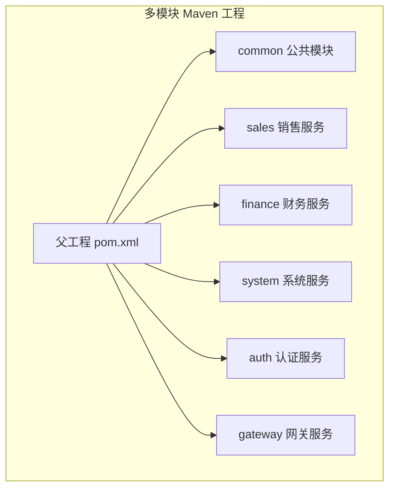
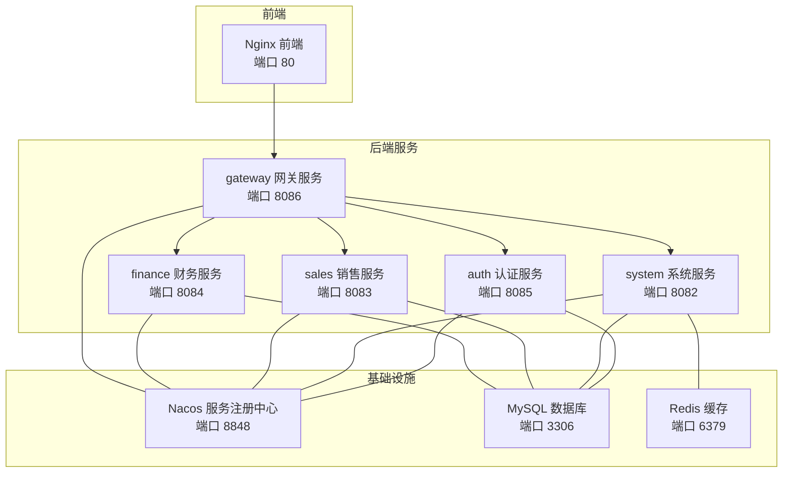
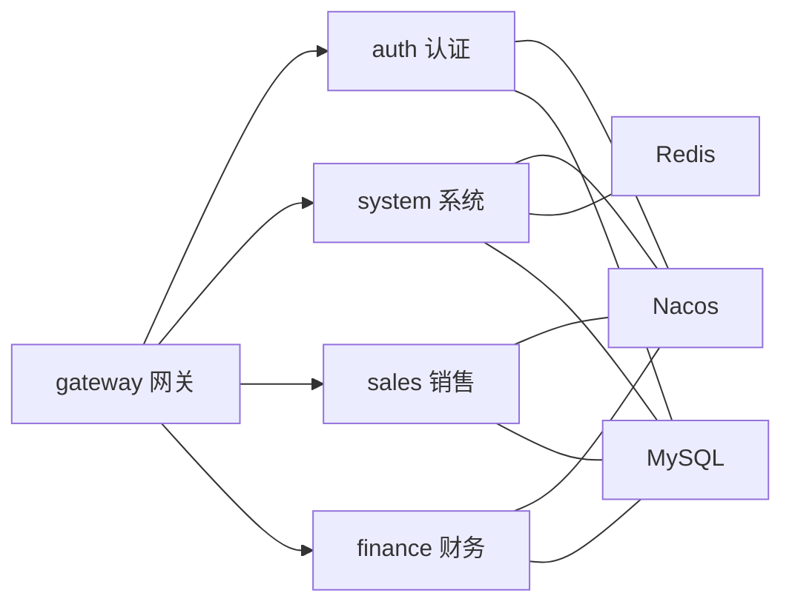

# 快速开始

<cite>
**本文引用的文件**
- [pom.xml](file://pom.xml)
- [quick-start.sh](file://quick-start.sh)
- [build-and-deploy.sh](file://build-and-deploy.sh)
- [docker-compose.yml](file://docker-compose.yml)
- [init-db.sql](file://scripts/init-db.sql)
- [envs.md](file://envs.md)
- [auth/src/main/resources/application.yml](file://auth/src/main/resources/application.yml)
- [auth/src/main/resources/application-docker.yml](file://auth/src/main/resources/application-docker.yml)
- [gateway/src/main/resources/application.yml](file://gateway/src/main/resources/application.yml)
- [auth/Dockerfile](file://auth/Dockerfile)
- [sales/src/main/resources/application.yml](file://sales/src/main/resources/application.yml)
- [system/src/main/resources/application.yml](file://system/src/main/resources/application.yml)
- [auth/src/main/java/com/dafuweng/AuthApplication.java](file://auth/src/main/java/com/dafuweng/AuthApplication.java)
- [gateway/src/main/java/com/dafuweng/GatewayApplication.java](file://gateway/src/main/java/com/dafuweng/GatewayApplication.java)
- [ruoyi-ui/package.json](file://ruoyi-ui/package.json)
- [frontEnd/package.json](file://frontEnd/package.json)
- [nginx.conf](file://nginx.conf)
</cite>

## 目录
1. [简介](#简介)
2. [项目结构](#项目结构)
3. [核心组件](#核心组件)
4. [架构总览](#架构总览)
5. [详细组件分析](#详细组件分析)
6. [依赖分析](#依赖分析)
7. [性能考虑](#性能考虑)
8. [故障排查指南](#故障排查指南)
9. [结论](#结论)
10. [附录](#附录)

## 简介
本指南面向首次接触 NeoCC 的开发者与运维人员，提供从环境准备、本地开发环境搭建、数据库初始化、微服务启动顺序与配置要求，到 Docker 容器化部署与服务编排的全流程说明。同时给出常见问题排查、首次运行验证步骤、开发工具推荐与调试技巧，以及性能优化与生产部署注意事项。

## 项目结构
NeoCC 是一个多模块 Maven 工程，采用 Spring Cloud Alibaba 微服务架构，包含统一网关、认证授权、销售、财务、系统管理等服务，并通过 Nacos 进行服务注册与发现，使用 MySQL、Redis、Nacos、RabbitMQ 等中间件支撑。

图表来源
- [pom.xml:12-19](file://pom.xml#L12-L19)

章节来源
- [pom.xml:1-22](file://pom.xml#L1-L22)

## 核心组件
- 认证服务（auth）：负责用户认证、角色与权限管理，提供登录、路由信息等接口。
- 系统服务（system）：提供部门、字典、参数、区域等基础数据管理。
- 销售服务（sales）：客户、合同、联系记录、业绩与工作日志等销售相关功能。
- 财务服务（finance）：银行账户、佣金、贷款审核、服务费等财务相关功能。
- 网关服务（gateway）：统一入口，基于路由规则转发请求至对应后端服务。
- 中间件：MySQL、Redis、Nacos、RabbitMQ、Nginx（前端静态资源与反向代理）。

章节来源
- [auth/src/main/java/com/dafuweng/AuthApplication.java:8-15](file://auth/src/main/java/com/dafuweng/AuthApplication.java#L8-L15)
- [gateway/src/main/java/com/dafuweng/GatewayApplication.java:8-15](file://gateway/src/main/java/com/dafuweng/GatewayApplication.java#L8-L15)

## 架构总览
下图展示了服务在容器中的拓扑关系与通信路径，包括 Nacos 注册中心、数据库、缓存、各微服务与网关、前端 Nginx。

图表来源
- [docker-compose.yml:58-173](file://docker-compose.yml#L58-L173)
- [gateway/src/main/resources/application.yml:17-148](file://gateway/src/main/resources/application.yml#L17-L148)

## 详细组件分析

### 环境准备与安装
- JDK：使用 Java 21 运行时（镜像中已内置），或本地安装对应版本。
- Maven：用于打包多模块工程。
- Docker 与 Docker Compose：用于容器化构建与编排。
- MySQL：8.0，初始化脚本会自动创建多套业务库并开放 root 远程访问。
- Redis：7-alpine，用于系统服务缓存。
- Nacos：2.3.0，用于服务注册与配置中心。
- RabbitMQ：用于消息队列（如需启用）。
- Nginx：用于前端静态资源与反向代理。

章节来源
- [auth/Dockerfile:1](file://auth/Dockerfile#L1)
- [docker-compose.yml:28-56](file://docker-compose.yml#L28-L56)
- [envs.md:1-21](file://envs.md#L1-L21)

### 数据库初始化
- 初始化脚本会在 MySQL 容器启动时执行，创建以下数据库：
  - nacos
  - dafuweng_auth
  - dafuweng_system
  - dafuweng_sales
  - dafuweng_finance
- 同时为 root 用户开启远程访问权限。

章节来源
- [init-db.sql:4-22](file://scripts/init-db.sql#L4-L22)

### 本地开发环境搭建
- 使用 Docker Compose 启动基础设施与业务服务，按顺序启动：
  1) MySQL、Redis
  2) Nacos
  3) 业务服务（auth、system、sales、finance）
  4) 网关（gateway）
  5) 前端 Nginx
- 可直接使用一键脚本进行构建与部署。

章节来源
- [build-and-deploy.sh:25-53](file://build-and-deploy.sh#L25-L53)
- [docker-compose.yml:27-173](file://docker-compose.yml#L27-L173)

### 配置要点
- 应用配置文件位于各服务的 resources 目录，区分本地与 Docker 环境：
  - 本地开发：使用 application.yml，连接本地 MySQL、Redis、Nacos。
  - Docker 环境：使用 application-docker.yml，连接容器内网络地址。
- 网关路由规则：
  - 将 /auth/** 路径转发至认证服务；
  - 将 /sales/** 与 /finance/** 与 /system/** 分别转发至对应服务；
  - 提供 /api/* 前缀的直连路由以适配前端调用。

章节来源
- [auth/src/main/resources/application.yml:1-35](file://auth/src/main/resources/application.yml#L1-L35)
- [auth/src/main/resources/application-docker.yml:1-32](file://auth/src/main/resources/application-docker.yml#L1-L32)
- [system/src/main/resources/application.yml:1-41](file://system/src/main/resources/application.yml#L1-L41)
- [sales/src/main/resources/application.yml:1-35](file://sales/src/main/resources/application.yml#L1-L35)
- [gateway/src/main/resources/application.yml:17-148](file://gateway/src/main/resources/application.yml#L17-L148)

### 启动顺序与依赖
- 服务启动顺序建议：
  1) MySQL（健康检查通过）
  2) Redis
  3) Nacos
  4) 业务服务（auth、system、sales、finance）
  5) 网关
  6) Nginx
- 依赖关系：
  - 业务服务依赖 Nacos 与 MySQL；
  - 系统服务额外依赖 Redis；
  - 网关依赖各业务服务；
  - Nginx 依赖网关。

章节来源
- [docker-compose.yml:70-159](file://docker-compose.yml#L70-L159)

### Docker 容器化部署
- 构建镜像：
  - 使用 Maven 打包后，通过 docker-compose build 构建各服务镜像。
- 启动流程：
  - 先启动基础设施（MySQL、Redis、Nacos）；
  - 再启动业务服务；
  - 等待服务注册到 Nacos；
  - 启动网关；
  - 最后启动前端 Nginx。
- 快速启动脚本：
  - 若已有构建产物，可直接使用 quick-start.sh 启动所有服务。

章节来源
- [build-and-deploy.sh:17-53](file://build-and-deploy.sh#L17-L53)
- [quick-start.sh:11-28](file://quick-start.sh#L11-L28)

### 前端与静态资源
- 前端采用 Nginx 提供静态资源服务，映射 ruoyi-ui/dist 目录；
- 支持开发环境与生产环境的 API 代理前缀（/dev-api/ 与 /prod-api/）；
- 前端开发可使用 Vite 或静态服务器进行本地联调。

章节来源
- [nginx.conf:22-74](file://nginx.conf#L22-L74)
- [ruoyi-ui/package.json:8-12](file://ruoyi-ui/package.json#L8-L12)
- [frontEnd/package.json:5-8](file://frontEnd/package.json#L5-L8)

## 依赖分析
- 组件耦合与内聚：
  - 网关作为统一入口，集中处理跨域与路由分发；
  - 各业务服务通过 Nacos 实现服务发现与配置共享；
  - 系统服务与 Redis 紧密耦合，用于缓存与会话支持。
- 外部依赖：
  - Spring Cloud Alibaba（Nacos、Gateway、OpenFeign）；
  - MyBatis-Plus；
  - MySQL、Redis、RabbitMQ。

图表来源
- [gateway/src/main/resources/application.yml:17-148](file://gateway/src/main/resources/application.yml#L17-L148)
- [docker-compose.yml:58-173](file://docker-compose.yml#L58-L173)

## 性能考虑
- 网关层：
  - 启用 CORS 与超时配置，避免跨域与长连接阻塞；
  - 对静态资源禁用缓存，便于开发调试。
- 数据访问：
  - MyBatis-Plus 已开启下划线转驼峰与日志输出，便于定位慢查询；
  - 建议在生产环境关闭日志输出或调整级别。
- 缓存策略：
  - 系统服务使用 Redis，建议对热点数据设置合理过期时间；
  - 注意内存淘汰策略与持久化配置。
- 数据库：
  - 为高频查询字段建立索引；
  - 控制单表数据规模与分区策略。
- 容器资源：
  - 为各服务设置合理的 CPU 与内存限制；
  - 使用健康检查保障服务可用性。

[本节为通用指导，无需列出章节来源]

## 故障排查指南
- 服务无法启动
  - 检查 MySQL 是否健康（健康检查通过后再启动其他服务）。
  - 查看各服务容器日志：docker-compose logs -f 服务名。
- 网关路由失败
  - 确认网关路由配置是否正确，服务是否成功注册到 Nacos。
  - 检查网关容器与业务服务容器的网络连通性。
- 前端无法访问
  - 确认 Nginx 映射的静态目录与构建产物一致；
  - 检查 /dev-api/ 与 /prod-api/ 代理是否指向正确的网关地址。
- 数据库连接异常
  - 确认数据库初始化脚本已执行；
  - 检查 root 用户远程访问权限与密码配置。
- Redis 连接失败
  - 确认 Redis 容器已启动且端口映射正确；
  - 检查系统服务的 Redis 地址配置。

章节来源
- [docker-compose.yml:39-43](file://docker-compose.yml#L39-L43)
- [build-and-deploy.sh:73-74](file://build-and-deploy.sh#L73-L74)
- [nginx.conf:45-67](file://nginx.conf#L45-L67)

## 结论
通过本指南，您可以在本地快速完成 NeoCC 的环境准备与容器化部署，理解服务间的依赖关系与启动顺序，并掌握常见问题的排查方法。建议在开发阶段结合网关路由与前端代理进行联调，在生产阶段关注性能与安全配置。

[本节为总结性内容，无需列出章节来源]

## 附录

### 首次运行验证步骤
- 启动所有服务后，等待约 30 秒让服务完成注册与初始化。
- 访问以下地址确认服务状态：
  - 前端界面：http://localhost
  - 网关 API：http://localhost:8086
  - Nacos 控制台：http://localhost:8848/nacos
- 登录认证：
  - 使用网关提供的认证接口进行登录，验证路由转发是否正确。

章节来源
- [quick-start.sh:30-34](file://quick-start.sh#L30-L34)
- [build-and-deploy.sh:60-64](file://build-and-deploy.sh#L60-L64)

### 开发工具推荐与调试技巧
- IDE：IntelliJ IDEA 或 VS Code，启用 Lombok、MyBatis 日志插件。
- Postman 或 Insomnia：用于网关路由测试与接口调试。
- 浏览器开发者工具：观察前端网络请求与跨域响应。
- Docker 日志：docker-compose logs -f 服务名，实时查看启动与运行日志。
- Nacos 控制台：查看服务注册与配置发布情况。

[本节为通用指导，无需列出章节来源]

### 生产环境部署注意事项
- 安全加固：
  - 关闭 Nacos 认证开关仅限本地开发，生产应启用鉴权；
  - 修改默认数据库与中间件密码；
  - 限制暴露端口，仅开放必要端口。
- 高可用与扩展：
  - 多实例部署网关与业务服务，结合负载均衡；
  - 使用独立的 MySQL 主从与 Redis 集群。
- 监控与日志：
  - 配置统一日志采集与告警；
  - 在网关层增加限流与熔断策略。
- 配置管理：
  - 将敏感配置放入 Nacos 或密钥管理服务；
  - 不将配置文件提交到版本库。

[本节为通用指导，无需列出章节来源]