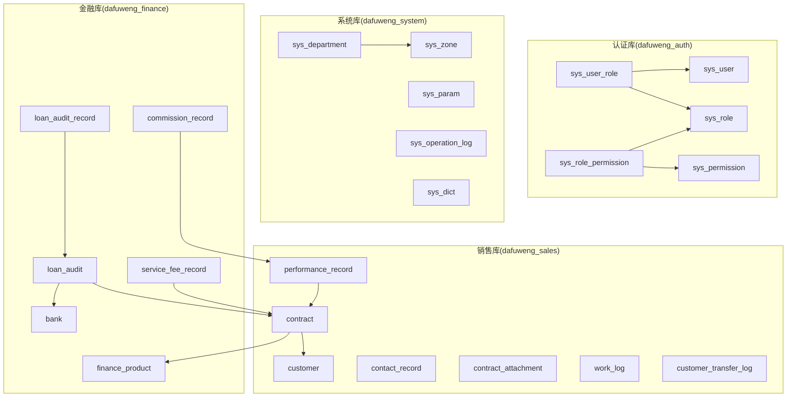
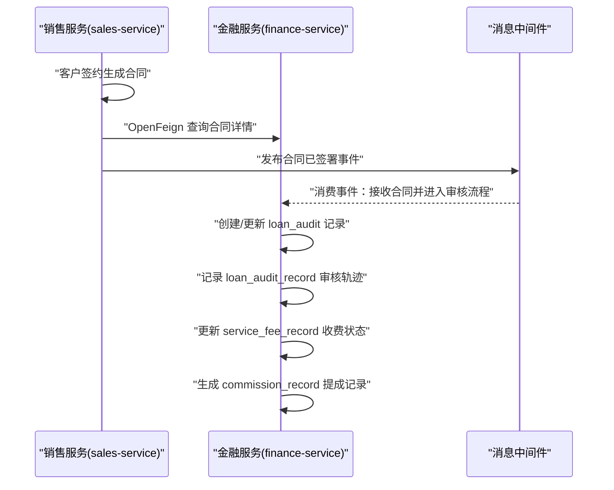
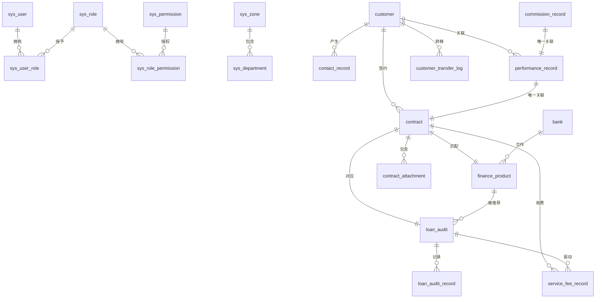
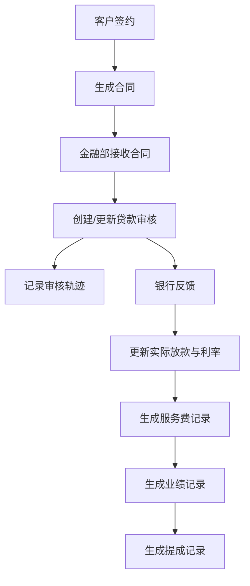
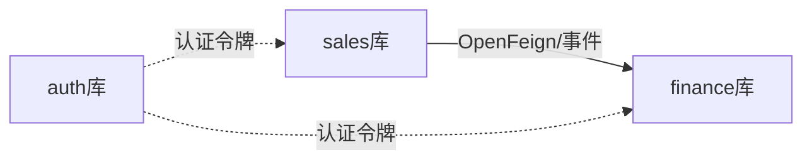

# 实体关系设计

<cite>
**本文引用的文件**
- [database.sql](file://database.sql)
- [dataDesign.md](file://dataDesign.md)
- [CustomerEntity.java](file://sales/src/main/java/com/dafuweng/sales/entity/CustomerEntity.java)
- [ContractEntity.java](file://sales/src/main/java/com/dafuweng/sales/entity/ContractEntity.java)
- [LoanAuditEntity.java](file://finance/src/main/java/com/dafuweng/finance/entity/LoanAuditEntity.java)
- [FinanceProductEntity.java](file://finance/src/main/java/com/dafuweng/finance/entity/FinanceProductEntity.java)
- [SysUserEntity.java](file://auth/src/main/java/com/dafuweng/auth/entity/SysUserEntity.java)
- [CustomerDao.java](file://sales/src/main/java/com/dafuweng/sales/dao/CustomerDao.java)
- [ContractDao.java](file://sales/src/main/java/com/dafuweng/sales/dao/ContractDao.java)
- [LoanAuditDao.java](file://finance/src/main/java/com/dafuweng/finance/dao/LoanAuditDao.java)
- [FinanceProductDao.java](file://finance/src/main/java/com/dafuweng/finance/dao/FinanceProductDao.java)
</cite>

## 目录
1. [简介](#简介)
2. [项目结构](#项目结构)
3. [核心组件](#核心组件)
4. [架构总览](#架构总览)
5. [详细组件分析](#详细组件分析)
6. [依赖分析](#依赖分析)
7. [性能考虑](#性能考虑)
8. [故障排查指南](#故障排查指南)
9. [结论](#结论)
10. [附录](#附录)

## 简介
本文件面向NeoCC贷款管理系统，提供以ER图为依据的实体关系设计说明。重点覆盖四大业务库中的核心实体：用户（sys_user）、客户（customer）、合同（contract）、产品（finance_product）、审核（loan_audit）。文档从实体设计、外键约束、级联策略、数据完整性保障、业务逻辑关系与数据流转等方面进行系统化阐述，并给出完整的实体关系图与字段说明。

## 项目结构
系统采用按业务域垂直拆分的多库架构：
- dafuweng_auth：认证授权（用户、角色、权限）
- dafuweng_system：系统管理（战区、部门、参数、字典、操作日志）
- dafuweng_sales：销售核心（客户、洽谈、合同、附件、业绩、工作日志、客户转移）
- dafuweng_finance：金融核心（银行、产品、贷款审核、审核记录、服务费、提成）

图表来源
- [database.sql:22-647](file://database.sql#L22-L647)

章节来源
- [dataDesign.md:14-26](file://dataDesign.md#L14-L26)
- [database.sql:11-14](file://database.sql#L11-L14)

## 核心组件
本节聚焦五大核心实体及其关系，结合数据库脚本与实体类映射，说明主外键、唯一性与索引设计。

- 用户（sys_user）
  - 主键：id
  - 外键：dept_id → sys_department.id，zone_id → sys_zone.id
  - 唯一索引：username
  - 关键字段：status、login_error_count、lock_time、last_login_time、last_login_ip、deleted、version
  - 作用：系统用户身份与权限载体，支撑销售与金融人员归属与权限控制

- 客户（customer）
  - 主键：id
  - 外键：sales_rep_id → sys_user.id，dept_id → sys_department.id，zone_id → sys_zone.id
  - 唯一索引：(name, phone, deleted)（软删参与）
  - 关键字段：customer_type、intention_level、status、public_sea_time、annotation(JSON)、loan_intention_amount、loan_intention_product、deleted、version
  - 作用：销售线索与业务主对象，承载客户生命周期与跟进轨迹

- 合同（contract）
  - 主键：id
  - 外键：customer_id → customer.id，sales_rep_id → sys_user.id，product_id → finance_product.id
  - 唯一索引：contract_no
  - 关键字段：contract_amount、service_fee_rate、service_fee_1、service_fee_2、service_fee_1_paid、service_fee_2_paid、status、finance_send_time、finance_receive_time、guarantee_info(JSON)、deleted、version
  - 作用：贷款业务契约，连接客户、产品与金融审核流程

- 产品（finance_product）
  - 主键：id
  - 外键：bank_id → bank.id
  - 唯一索引：product_code
  - 关键字段：min_amount、max_amount、interest_rate、min_term、max_term、requirements(JSON)、documents(JSON)、commission_rate、status、online_time、offline_time、deleted
  - 作用：银行产品模板，驱动合同审批额度与期限

- 审核（loan_audit）
  - 主键：id
  - 外键：contract_id → contract.id（唯一），finance_specialist_id → sys_user.id，bank_id → bank.id
  - 唯一索引：contract_id
  - 关键字段：approved_amount、approved_term、approved_interest_rate、audit_status、bank_audit_status、bank_feedback_time、reject_reason、audit_opinion、loan_granted_date、actual_loan_amount、actual_interest_rate、deleted
  - 作用：银行放款前的审批与跟踪，记录审核轨迹（loan_audit_record）

章节来源
- [database.sql:22-647](file://database.sql#L22-L647)
- [SysUserEntity.java:14-59](file://auth/src/main/java/com/dafuweng/auth/entity/SysUserEntity.java#L14-L59)
- [CustomerEntity.java:14-77](file://sales/src/main/java/com/dafuweng/sales/entity/CustomerEntity.java#L14-L77)
- [ContractEntity.java:13-91](file://sales/src/main/java/com/dafuweng/sales/entity/ContractEntity.java#L13-L91)
- [FinanceProductEntity.java:14-68](file://finance/src/main/java/com/dafuweng/finance/entity/FinanceProductEntity.java#L14-L68)
- [LoanAuditEntity.java:12-64](file://finance/src/main/java/com/dafuweng/finance/entity/LoanAuditEntity.java#L12-L64)

## 架构总览
系统通过“库隔离 + 应用层跨库调用”的方式实现松耦合：
- 同库内：通过外键与索引保障一致性与查询效率
- 跨库间：通过OpenFeign实时查询、RabbitMQ异步事件（如合同签署通知金融部）实现数据联动

图表来源
- [dataDesign.md:325-356](file://dataDesign.md#L325-L356)

章节来源
- [dataDesign.md:325-356](file://dataDesign.md#L325-L356)

## 详细组件分析

### 实体关系图（ER）

图表来源
- [database.sql:22-647](file://database.sql#L22-L647)

章节来源
- [database.sql:22-647](file://database.sql#L22-L647)

### 用户（sys_user）实体设计
- 主键：id
- 外键：dept_id → sys_department.id；zone_id → sys_zone.id
- 唯一索引：username
- 关键设计点：
  - 登录安全字段内置于用户表：login_error_count、lock_time，用于连续登录失败锁定
  - 乐观锁：version 字段配合注解使用
  - 逻辑删除：deleted 字段支持软删
- 业务意义：作为系统使用者与业务参与者（销售、金融专员、会计等）的身份凭证

章节来源
- [database.sql:22-48](file://database.sql#L22-L48)
- [SysUserEntity.java:14-59](file://auth/src/main/java/com/dafuweng/auth/entity/SysUserEntity.java#L14-L59)

### 客户（customer）实体设计
- 主键：id
- 外键：sales_rep_id → sys_user.id；dept_id → sys_department.id；zone_id → sys_zone.id
- 唯一索引：(name, phone, deleted)（软删参与）
- 关键设计点：
  - annotation 使用JSON存储批注列表，避免额外表
  - 公海机制：public_sea_time、public_sea_reason、next_follow_up_date 等字段支撑客户池管理
  - 意向等级与状态枚举通过字典表维护
- 业务意义：销售线索与业务主对象，承载客户生命周期与跟进轨迹

章节来源
- [database.sql:281-320](file://database.sql#L281-L320)
- [CustomerEntity.java:14-77](file://sales/src/main/java/com/dafuweng/sales/entity/CustomerEntity.java#L14-L77)

### 合同（contract）实体设计
- 主键：id
- 外键：customer_id → customer.id；sales_rep_id → sys_user.id；product_id → finance_product.id
- 唯一索引：contract_no
- 关键设计点：
  - 服务费分两期：service_fee_1、service_fee_2；paid与pay_date字段记录支付状态
  - guarantee_info 使用JSON存储担保信息
  - finance_send_time、finance_receive_time、status等字段驱动跨库流转
- 业务意义：贷款业务契约，连接客户、产品与金融审核流程

章节来源
- [database.sql:345-385](file://database.sql#L345-L385)
- [ContractEntity.java:13-91](file://sales/src/main/java/com/dafuweng/sales/entity/ContractEntity.java#L13-L91)

### 产品（finance_product）实体设计
- 主键：id
- 外键：bank_id → bank.id
- 唯一索引：product_code
- 关键设计点：
  - requirements、documents 使用JSON存储条件与材料清单
  - 上下架时间与状态字段支持产品生命周期管理
- 业务意义：银行产品模板，驱动合同审批额度与期限

章节来源
- [database.sql:495-524](file://database.sql#L495-L524)
- [FinanceProductEntity.java:14-68](file://finance/src/main/java/com/dafuweng/finance/entity/FinanceProductEntity.java#L14-L68)

### 审核（loan_audit）实体设计
- 主键：id
- 外键：contract_id → contract.id（唯一）；finance_specialist_id → sys_user.id；bank_id → bank.id
- 唯一索引：contract_id
- 关键设计点：
  - 审核状态与银行反馈状态双维度记录
  - actual_loan_amount、actual_interest_rate 记录银行最终放款数据
  - 审核轨迹通过 loan_audit_record 追踪每一步操作
- 业务意义：银行放款前的审批与跟踪，记录审核轨迹（loan_audit_record）

章节来源
- [database.sql:526-555](file://database.sql#L526-L555)
- [LoanAuditEntity.java:12-64](file://finance/src/main/java/com/dafuweng/finance/entity/LoanAuditEntity.java#L12-L64)

### 外键约束与级联策略
- 外键约束
  - sys_user.dept_id → sys_department.id
  - sys_user.zone_id → sys_zone.id
  - customer.sales_rep_id → sys_user.id
  - customer.dept_id → sys_department.id
  - customer.zone_id → sys_zone.id
  - contract.customer_id → customer.id
  - contract.sales_rep_id → sys_user.id
  - contract.product_id → finance_product.id
  - finance_product.bank_id → bank.id
  - loan_audit.contract_id → contract.id（唯一）
  - loan_audit.finance_specialist_id → sys_user.id
  - loan_audit.bank_id → bank.id
  - service_fee_record.contract_id → contract.id
  - commission_record.performance_id → performance_record.id
- 级联策略
  - 数据库层面未显式声明ON DELETE CASCADE；软删除字段deleted贯穿所有业务表，通过应用层控制删除行为
  - 通过业务规则与唯一索引（含deleted）保障数据一致性
- 数据完整性保障
  - 软删除：deleted字段统一参与唯一索引，避免软删后重复录入
  - 乐观锁：version字段在更新时校验，避免并发覆盖
  - 审核轨迹：loan_audit_record为追加式日志表，不可篡改

章节来源
- [database.sql:22-647](file://database.sql#L22-L647)
- [dataDesign.md:361-396](file://dataDesign.md#L361-L396)

### 业务逻辑关系与数据流转
- 客户到合同：客户签约生成合同，合同状态流转驱动后续流程
- 合同到审核：合同进入金融部，创建/更新 loan_audit，记录 loan_audit_record
- 审核到收费：银行反馈后更新 loan_audit，并生成 service_fee_record
- 收费到业绩：生成 performance_record，进而生成 commission_record
- 跨库联动：通过OpenFeign查询与RabbitMQ事件实现松耦合

图表来源
- [dataDesign.md:241-323](file://dataDesign.md#L241-L323)

章节来源
- [dataDesign.md:241-323](file://dataDesign.md#L241-L323)

## 依赖分析
- 同库内依赖
  - dafuweng_auth：用户与角色/权限的多对多关联，通过中间表维护
  - dafuweng_system：部门树形结构（parent_id自引用），参数与字典为全局枚举支撑
  - dafuweng_sales：客户 → 合同 → 业绩/附件/转移，合同 → 产品/审核/收费
  - dafuweng_finance：产品 → 银行，审核 → 合同/银行/收费/轨迹
- 跨库依赖
  - 销售库与金融库通过OpenFeign与消息事件交互，避免数据库层强耦合

图表来源
- [dataDesign.md:325-356](file://dataDesign.md#L325-L356)

章节来源
- [dataDesign.md:325-356](file://dataDesign.md#L325-L356)

## 性能考虑
- 索引设计
  - 主键自动聚集索引
  - 外键字段建立普通索引（如customer.sales_rep_id、contract.customer_id）
  - 唯一索引包含deleted字段，避免软删后重复录入
  - 联合索引按查询最常用组合建立（如work_log.(sales_rep_id, log_date)）
- 查询规范
  - 禁止SELECT *，所有查询需命中覆盖索引
- 并发控制
  - 乐观锁version字段在更新时校验，避免并发覆盖
- 审计与日志
  - 审核轨迹为追加式日志表，满足合规与审计要求

章节来源
- [dataDesign.md:40-46](file://dataDesign.md#L40-L46)
- [database.sql:422-447](file://database.sql#L422-L447)

## 故障排查指南
- 常见问题定位
  - 唯一索引冲突：检查(字段, deleted)是否违反唯一约束（软删后可再次录入）
  - 乐观锁异常：更新时version不匹配，检查并发更新逻辑
  - 审核幂等：loan_audit.contract_id唯一，重复提交将报唯一约束错误
  - 跨库调用失败：检查OpenFeign配置与RabbitMQ事件投递
- 排查步骤
  - 确认外键是否存在且未被软删除
  - 检查deleted字段与相关唯一索引
  - 核对loan_audit_record是否正确追加
  - 核对服务间依赖（认证、注册中心、消息中间件）

章节来源
- [dataDesign.md:361-396](file://dataDesign.md#L361-L396)
- [database.sql:526-555](file://database.sql#L526-L555)

## 结论
本设计以库隔离与应用层跨库调用为核心，围绕客户、合同、产品、审核等核心实体构建清晰的ER关系。通过软删除、乐观锁、唯一索引（含deleted）与审核轨迹等机制，确保数据一致性与可追溯性。同时，严格的索引与查询规范为性能提供基础保障。整体方案兼顾业务灵活性与技术稳健性。

## 附录

### 字段说明（核心实体）
- sys_user
  - 关键字段：username、password、real_name、phone、email、dept_id、zone_id、status、login_error_count、lock_time、last_login_time、last_login_ip、deleted、version
- customer
  - 关键字段：name、phone、idCard、company_name、company_legal_person、company_reg_capital、customer_type、sales_rep_id、dept_id、zone_id、intention_level、status、last_contact_date、next_follow_up_date、public_sea_time、public_sea_reason、annotation(JSON)、source、loan_intention_amount、loan_intention_product、deleted、version
- contract
  - 关键字段：contract_no、customer_id、sales_rep_id、dept_id、product_id、contract_amount、actual_loan_amount、service_fee_rate、service_fee_1、service_fee_2、service_fee_1_paid、service_fee_2_paid、service_fee_1_pay_date、service_fee_2_pay_date、status、sign_date、paper_contract_no、finance_send_time、finance_receive_time、loan_use、guarantee_info(JSON)、reject_reason、remark、deleted、version
- finance_product
  - 关键字段：product_code、product_name、bank_id、min_amount、max_amount、interest_rate、min_term、max_term、requirements(JSON)、documents(JSON)、product_features、commission_rate、status、sort_order、online_time、offline_time、deleted
- loan_audit
  - 关键字段：contract_id、finance_specialist_id、recommended_product_id、approved_amount、approved_term、approved_interest_rate、audit_status、bank_id、bank_audit_status、bank_apply_time、bank_feedback_time、bank_feedback_content、reject_reason、audit_opinion、audit_date、loan_granted_date、actual_loan_amount、actual_interest_rate、deleted

章节来源
- [database.sql:22-647](file://database.sql#L22-L647)
- [SysUserEntity.java:14-59](file://auth/src/main/java/com/dafuweng/auth/entity/SysUserEntity.java#L14-L59)
- [CustomerEntity.java:14-77](file://sales/src/main/java/com/dafuweng/sales/entity/CustomerEntity.java#L14-L77)
- [ContractEntity.java:13-91](file://sales/src/main/java/com/dafuweng/sales/entity/ContractEntity.java#L13-L91)
- [FinanceProductEntity.java:14-68](file://finance/src/main/java/com/dafuweng/finance/entity/FinanceProductEntity.java#L14-L68)
- [LoanAuditEntity.java:12-64](file://finance/src/main/java/com/dafuweng/finance/entity/LoanAuditEntity.java#L12-L64)