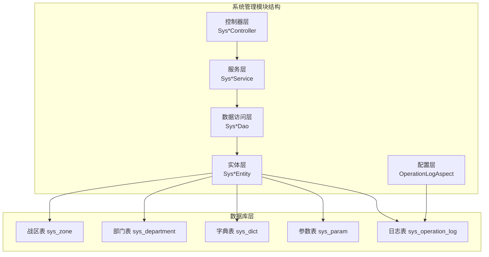
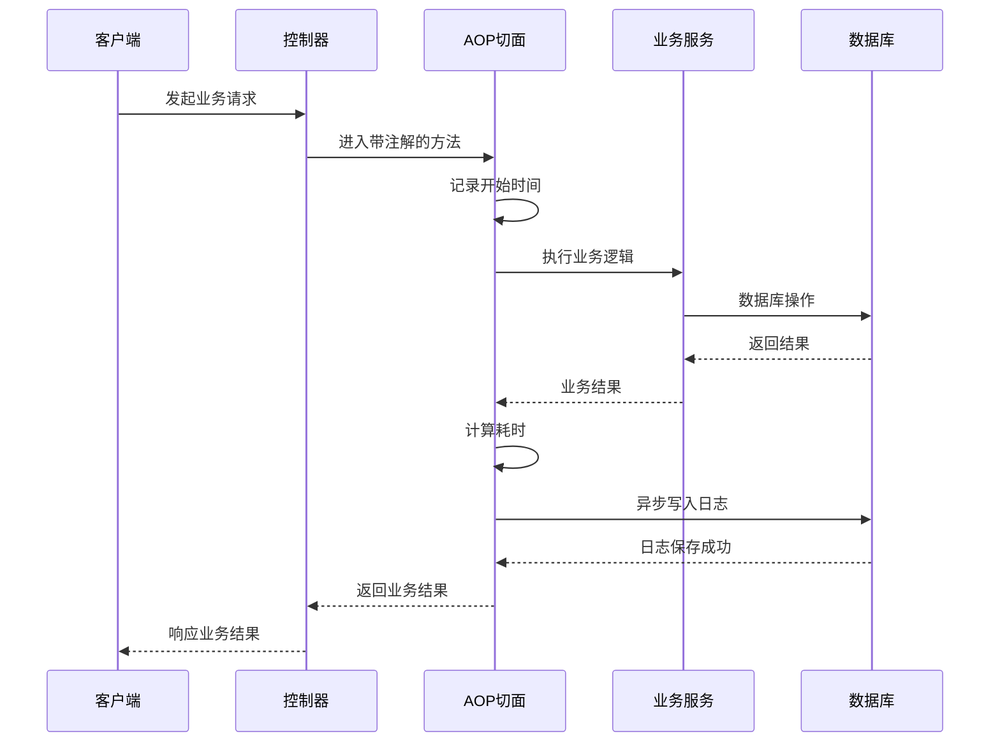
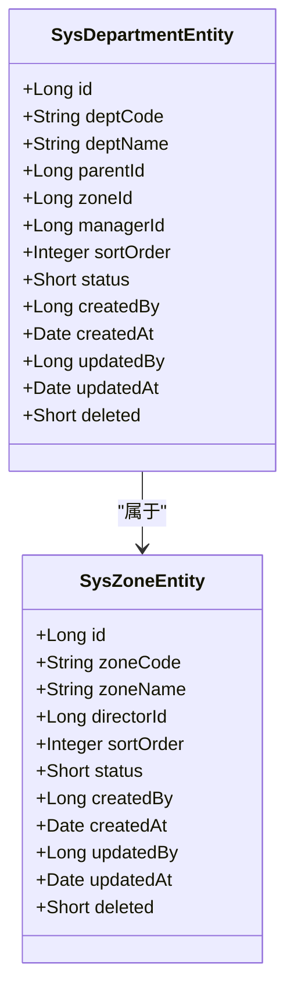
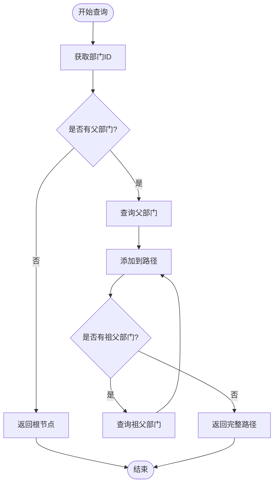
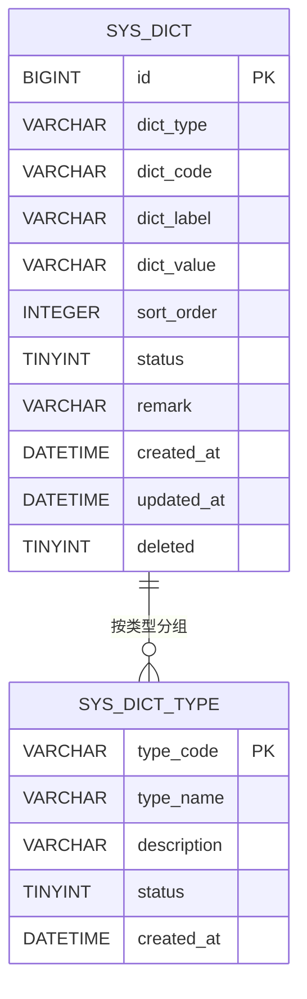
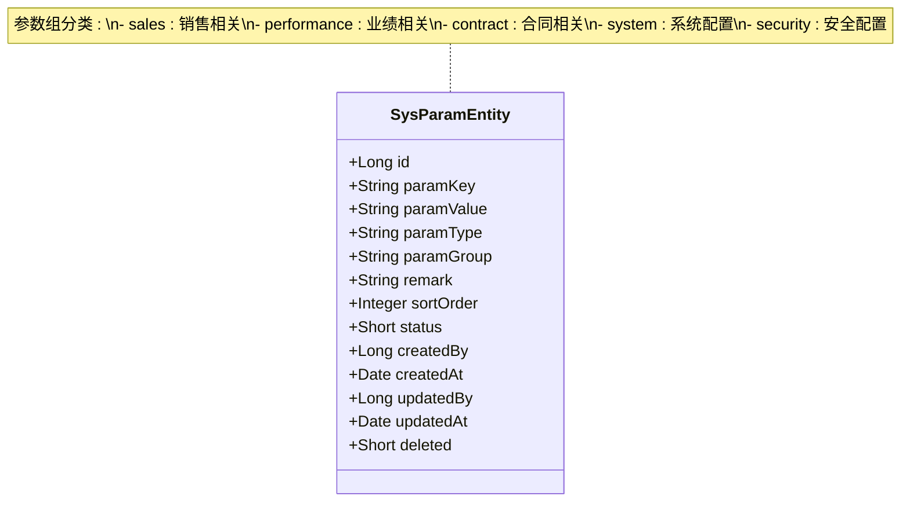
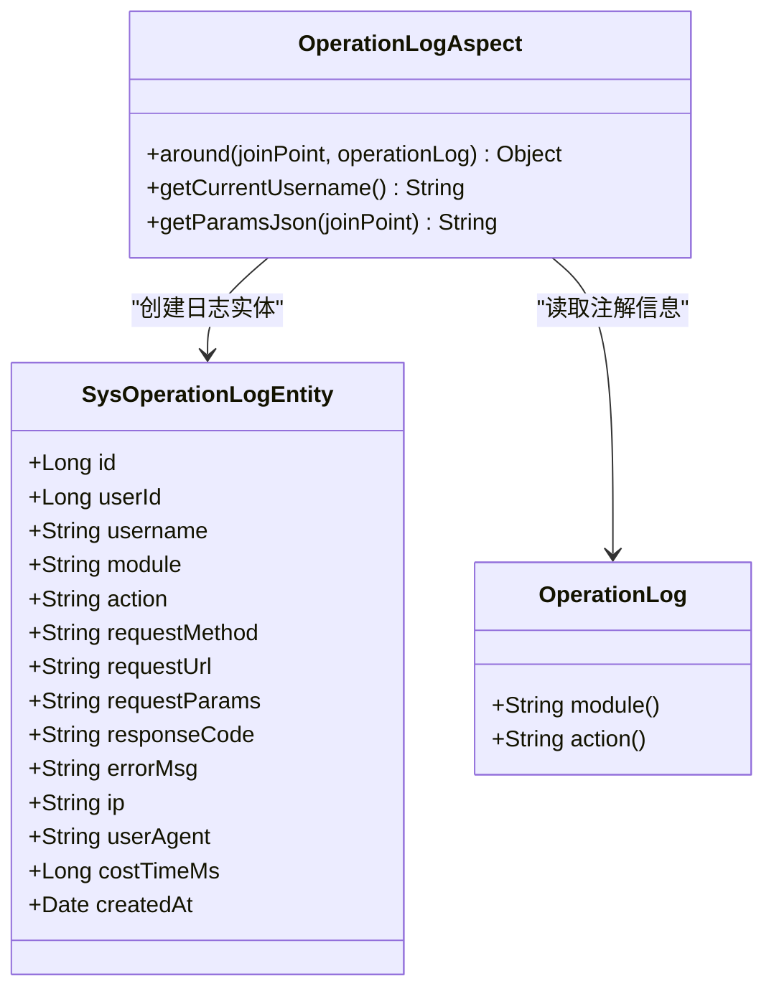
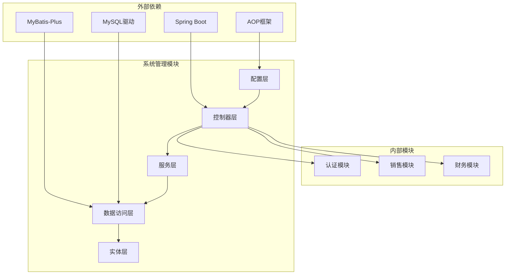

# 系统管理实体设计

<cite>
**本文档引用的文件**
- [SysDepartmentEntity.java](file://system/src/main/java/com/dafuweng/system/entity/SysDepartmentEntity.java)
- [SysZoneEntity.java](file://system/src/main/java/com/dafuweng/system/entity/SysZoneEntity.java)
- [SysDictEntity.java](file://system/src/main/java/com/dafuweng/system/entity/SysDictEntity.java)
- [SysParamEntity.java](file://system/src/main/java/com/dafuweng/system/entity/SysParamEntity.java)
- [SysOperationLogEntity.java](file://system/src/main/java/com/dafuweng/system/entity/SysOperationLogEntity.java)
- [OperationLog.java](file://system/src/main/java/com/dafuweng/system/config/OperationLog.java)
- [OperationLogAspect.java](file://system/src/main/java/com/dafuweng/system/config/OperationLogAspect.java)
- [SysDepartmentDao.java](file://system/src/main/java/com/dafuweng/system/dao/SysDepartmentDao.java)
- [SysDictDao.java](file://system/src/main/java/com/dafuweng/system/dao/SysDictDao.java)
- [SysOperationLogDao.java](file://system/src/main/java/com/dafuweng/system/dao/SysOperationLogDao.java)
- [SysParamDao.java](file://system/src/main/java/com/dafuweng/system/dao/SysParamDao.java)
- [SysZoneDao.java](file://system/src/main/java/com/dafuweng/system/dao/SysZoneDao.java)
- [database.sql](file://database.sql)
</cite>

## 目录
1. [引言](#引言)
2. [项目结构](#项目结构)
3. [核心组件](#核心组件)
4. [架构概览](#架构概览)
5. [详细组件分析](#详细组件分析)
6. [依赖分析](#依赖分析)
7. [性能考虑](#性能考虑)
8. [故障排除指南](#故障排除指南)
9. [结论](#结论)

## 引言

NeoCC项目是一个基于微服务架构的企业级贷款管理系统，系统管理模块负责维护组织架构、数据字典、系统参数和操作日志等核心基础设施。本文档详细阐述了系统管理模块的实体设计，重点关注部门表的自引用关系设计、战区与部门的层级关系，以及数据字典的统一枚举管理机制。

该系统采用现代化的技术栈，包括Spring Boot、MyBatis-Plus、MySQL等，实现了高度模块化和可扩展的架构设计。通过AOP拦截实现的操作日志记录机制，确保了审计功能的非侵入性，不影响业务表结构的纯净性。

## 项目结构

系统管理模块位于`system`子模块中，采用标准的MVC架构模式，包含以下主要层次：

**图表来源**
- [SysDepartmentEntity.java:1-45](file://system/src/main/java/com/dafuweng/system/entity/SysDepartmentEntity.java#L1-L45)
- [SysZoneEntity.java:1-41](file://system/src/main/java/com/dafuweng/system/entity/SysZoneEntity.java#L1-L41)
- [SysDictEntity.java:1-41](file://system/src/main/java/com/dafuweng/system/entity/SysDictEntity.java#L1-L41)
- [SysParamEntity.java:1-45](file://system/src/main/java/com/dafuweng/system/entity/SysParamEntity.java#L1-L45)
- [SysOperationLogEntity.java:1-45](file://system/src/main/java/com/dafuweng/system/entity/SysOperationLogEntity.java#L1-L45)

**章节来源**
- [SysDepartmentEntity.java:1-45](file://system/src/main/java/com/dafuweng/system/entity/SysDepartmentEntity.java#L1-L45)
- [SysZoneEntity.java:1-41](file://system/src/main/java/com/dafuweng/system/entity/SysZoneEntity.java#L1-L41)
- [SysDictEntity.java:1-41](file://system/src/main/java/com/dafuweng/system/entity/SysDictEntity.java#L1-L41)
- [SysParamEntity.java:1-45](file://system/src/main/java/com/dafuweng/system/entity/SysParamEntity.java#L1-L45)
- [SysOperationLogEntity.java:1-45](file://system/src/main/java/com/dafuweng/system/entity/SysOperationLogEntity.java#L1-L45)

## 核心组件

系统管理模块包含五个核心实体，每个实体都遵循统一的设计规范：

### 实体设计规范

所有实体均采用以下通用设计模式：
- 使用MyBatis-Plus注解进行ORM映射
- 包含逻辑删除字段支持软删除
- 统一的创建和更新时间戳管理
- 标准化的状态字段设计

### 关键字段说明

| 字段类型 | 描述 | 用途 |
|---------|------|------|
| `id` | 主键标识 | 唯一标识符 |
| `created_by/updated_by` | 创建者/修改者 | 审计追踪 |
| `created_at/updated_at` | 创建时间/修改时间 | 时间戳管理 |
| `deleted` | 逻辑删除标志 | 软删除支持 |
| `status` | 状态字段 | 业务状态控制 |

**章节来源**
- [SysDepartmentEntity.java:17-43](file://system/src/main/java/com/dafuweng/system/entity/SysDepartmentEntity.java#L17-L43)
- [SysZoneEntity.java:17-39](file://system/src/main/java/com/dafuweng/system/entity/SysZoneEntity.java#L17-L39)
- [SysDictEntity.java:17-39](file://system/src/main/java/com/dafuweng/system/entity/SysDictEntity.java#L17-L39)
- [SysParamEntity.java:17-43](file://system/src/main/java/com/dafuweng/system/entity/SysParamEntity.java#L17-L43)
- [SysOperationLogEntity.java:16-43](file://system/src/main/java/com/dafuweng/system/entity/SysOperationLogEntity.java#L16-L43)

## 架构概览

系统管理模块采用分层架构设计，通过AOP实现非侵入式的操作日志记录：

**图表来源**
- [OperationLogAspect.java:35-60](file://system/src/main/java/com/dafuweng/system/config/OperationLogAspect.java#L35-L60)
- [OperationLog.java:8-11](file://system/src/main/java/com/dafuweng/system/config/OperationLog.java#L8-L11)

### 组件交互流程

1. **请求拦截**: AOP切面拦截带有`@OperationLog`注解的方法
2. **性能监控**: 记录请求开始时间和参数信息
3. **业务执行**: 调用目标方法执行业务逻辑
4. **异步日志**: 使用CompletableFuture异步写入操作日志
5. **结果返回**: 将业务结果返回给客户端

**章节来源**
- [OperationLogAspect.java:1-87](file://system/src/main/java/com/dafuweng/system/config/OperationLogAspect.java#L1-L87)
- [OperationLog.java:1-11](file://system/src/main/java/com/dafuweng/system/config/OperationLog.java#L1-L11)

## 详细组件分析

### 组织架构实体设计

#### 战区表 (sys_zone) 设计

战区作为组织架构的最高层级，采用简洁的设计模式：

**图表来源**
- [SysZoneEntity.java:13-39](file://system/src/main/java/com/dafuweng/system/entity/SysZoneEntity.java#L13-L39)
- [SysDepartmentEntity.java:13-43](file://system/src/main/java/com/dafuweng/system/entity/SysDepartmentEntity.java#L13-L43)

#### 部门表 (sys_department) 自引用关系设计

部门表采用自引用的树形结构设计，支持无限层级的组织架构：

**核心设计要点**:
- `parentId`字段实现父子关系的自引用
- `zone_id`字段建立与战区的多对一关系
- 支持动态层级结构的灵活组织
- 通过索引优化查询性能

**层级关系约束**:
- 根部门的`parentId`为0或NULL
- 子部门必须指向有效的父部门
- 防止循环引用的完整性约束

**章节来源**
- [SysDepartmentEntity.java:24-26](file://system/src/main/java/com/dafuweng/system/entity/SysDepartmentEntity.java#L24-L26)
- [database.sql:149-168](file://database.sql#L149-L168)

#### 部门层级查询算法

**图表来源**
- [SysDepartmentDao.java:1-10](file://system/src/main/java/com/dafuweng/system/dao/SysDepartmentDao.java#L1-L10)

### 数据字典实体设计

#### 统一枚举管理机制

数据字典表采用类型化的枚举管理模式：

**图表来源**
- [SysDictEntity.java:17-39](file://system/src/main/java/com/dafuweng/system/entity/SysDictEntity.java#L17-L39)
- [SysDictDao.java:13-13](file://system/src/main/java/com/dafuweng/system/dao/SysDictDao.java#L13-L13)

#### 字典类型设计原则

| 字典类型 | 用途 | 示例 |
|---------|------|------|
| `customer_type` | 客户类型 | 个人客户、企业客户 |
| `customer_status` | 客户状态 | 潜在客户、已签约、已放款 |
| `intention_level` | 意向等级 | A级、B级、C级、D级 |
| `contact_type` | 联系方式 | 电话、面谈、转介绍 |
| `contract_status` | 合同状态 | 草稿、已签署、审核中 |
| `audit_status` | 审核状态 | 待审核、审核中、已通过 |

**章节来源**
- [SysDictEntity.java:20-26](file://system/src/main/java/com/dafuweng/system/entity/SysDictEntity.java#L20-L26)
- [database.sql:220-272](file://database.sql#L220-L272)

### 系统参数实体设计

#### 参数分类管理

系统参数表采用分组管理模式，支持不同业务领域的配置管理：

**图表来源**
- [SysParamEntity.java:17-43](file://system/src/main/java/com/dafuweng/system/entity/SysParamEntity.java#L17-L43)

#### 关键系统参数

| 参数键 | 类型 | 分组 | 默认值 | 描述 |
|--------|------|------|--------|------|
| `customer.public_sea_days` | int | sales | 30 | 公海客户天数 |
| `performance.commission_rate` | decimal | performance | 0.05 | 业绩提成比例 |
| `contract.service_fee_first_rate` | decimal | contract | 0.30 | 首期服务费比例 |
| `system.max_upload_file_size` | long | system | 52428800 | 文件上传大小限制 |
| `login.max_error_times` | int | security | 5 | 登录失败最大次数 |
| `login.lock_minutes` | int | security | 15 | 登录锁定时间 |

**章节来源**
- [SysParamEntity.java:20-28](file://system/src/main/java/com/dafuweng/system/entity/SysParamEntity.java#L20-L28)
- [database.sql:190-197](file://database.sql#L190-L197)

### 操作日志实体设计

#### 非侵入式审计设计

操作日志表采用独立的设计模式，完全不影响业务表结构：

**图表来源**
- [SysOperationLogEntity.java:16-43](file://system/src/main/java/com/dafuweng/system/entity/SysOperationLogEntity.java#L16-L43)
- [OperationLogAspect.java:35-60](file://system/src/main/java/com/dafuweng/system/config/OperationLogAspect.java#L35-L60)
- [OperationLog.java:8-11](file://system/src/main/java/com/dafuweng/system/config/OperationLog.java#L8-L11)

#### AOP拦截实现细节

**异步日志记录机制**:
- 使用CompletableFuture实现非阻塞日志写入
- 避免影响主业务请求的响应时间
- 通过线程池管理日志写入任务

**日志信息收集**:
- 自动提取请求参数并序列化为JSON
- 获取用户身份信息（从Authorization头解析）
- 记录请求耗时和响应状态

**章节来源**
- [OperationLogAspect.java:47-57](file://system/src/main/java/com/dafuweng/system/config/OperationLogAspect.java#L47-L57)
- [SysOperationLogDao.java:13-19](file://system/src/main/java/com/dafuweng/system/dao/SysOperationLogDao.java#L13-L19)

## 依赖分析

系统管理模块的依赖关系呈现清晰的层次化结构：

**图表来源**
- [OperationLogAspect.java:1-87](file://system/src/main/java/com/dafuweng/system/config/OperationLogAspect.java#L1-L87)

### 数据访问层设计

DAO接口采用MyBatis-Plus的BaseMapper，提供标准化的数据访问能力：

**DAO接口设计模式**:
- 统一继承BaseMapper接口
- 自动提供CRUD基础操作
- 支持复杂查询条件构建
- 通过注解定义特殊查询方法

**章节来源**
- [SysDepartmentDao.java:7-9](file://system/src/main/java/com/dafuweng/system/dao/SysDepartmentDao.java#L7-L9)
- [SysDictDao.java:10-14](file://system/src/main/java/com/dafuweng/system/dao/SysDictDao.java#L10-L14)
- [SysOperationLogDao.java:10-20](file://system/src/main/java/com/dafuweng/system/dao/SysOperationLogDao.java#L10-L20)
- [SysParamDao.java:8-12](file://system/src/main/java/com/dafuweng/system/dao/SysParamDao.java#L8-L12)
- [SysZoneDao.java:7-9](file://system/src/main/java/com/dafuweng/system/dao/SysZoneDao.java#L7-L9)

## 性能考虑

### 查询性能优化

**索引策略设计**:
- 所有实体均建立逻辑删除字段索引
- 部门表建立父部门ID和战区ID索引
- 操作日志表建立用户ID和时间戳索引
- 数据字典表建立类型组合索引

**查询优化建议**:
- 使用分页查询避免大数据量加载
- 合理使用索引字段进行过滤
- 避免N+1查询问题
- 考虑缓存热点数据

### 异步处理机制

操作日志采用异步写入机制，避免阻塞主业务流程：

**异步处理优势**:
- 提升用户体验，减少请求等待时间
- 降低数据库写入压力峰值
- 提高系统的整体吞吐量
- 增强系统的容错能力

## 故障排除指南

### 常见问题诊断

**部门层级查询异常**:
- 检查parentId字段的完整性
- 验证自引用关系的正确性
- 确认索引的有效性

**数据字典查询失败**:
- 验证dict_type参数的正确性
- 检查字典类型的唯一性约束
- 确认状态字段的激活状态

**操作日志记录异常**:
- 检查AOP切面的配置
- 验证注解的正确使用
- 确认异步任务的执行状态

### 性能监控指标

**关键性能指标**:
- 数据库连接池使用率
- 查询响应时间分布
- 缓存命中率
- 系统资源使用情况

**监控建议**:
- 建立完善的日志监控体系
- 设置性能告警阈值
- 定期分析慢查询日志
- 监控系统健康状态

## 结论

NeoCC项目系统管理模块的实体设计体现了现代企业级应用的最佳实践。通过精心设计的组织架构、统一的数据字典管理和非侵入式的操作日志机制，系统实现了高度的模块化和可维护性。

**设计亮点总结**:
1. **灵活的组织架构**: 支持无限层级的部门管理
2. **统一的枚举管理**: 通过数据字典实现类型化配置
3. **非侵入式审计**: AOP实现的操作日志不影响业务逻辑
4. **标准化的设计模式**: 遵循统一的实体设计规范
5. **完善的性能考虑**: 通过索引和异步处理提升性能

该设计为NeoCC项目的长期发展奠定了坚实的基础，为后续的功能扩展和性能优化提供了良好的架构支撑。