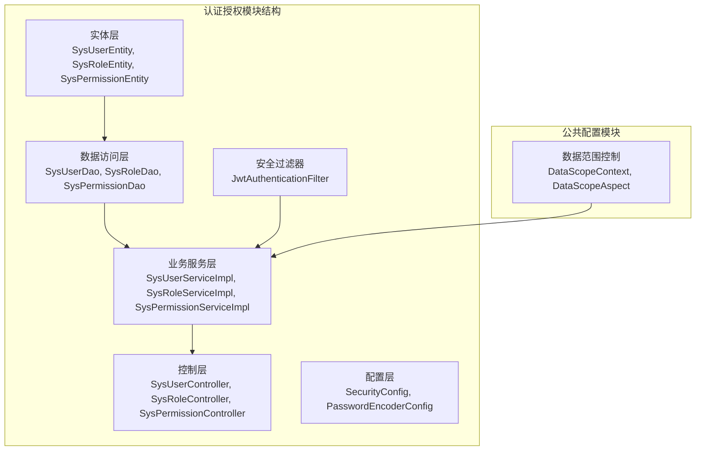
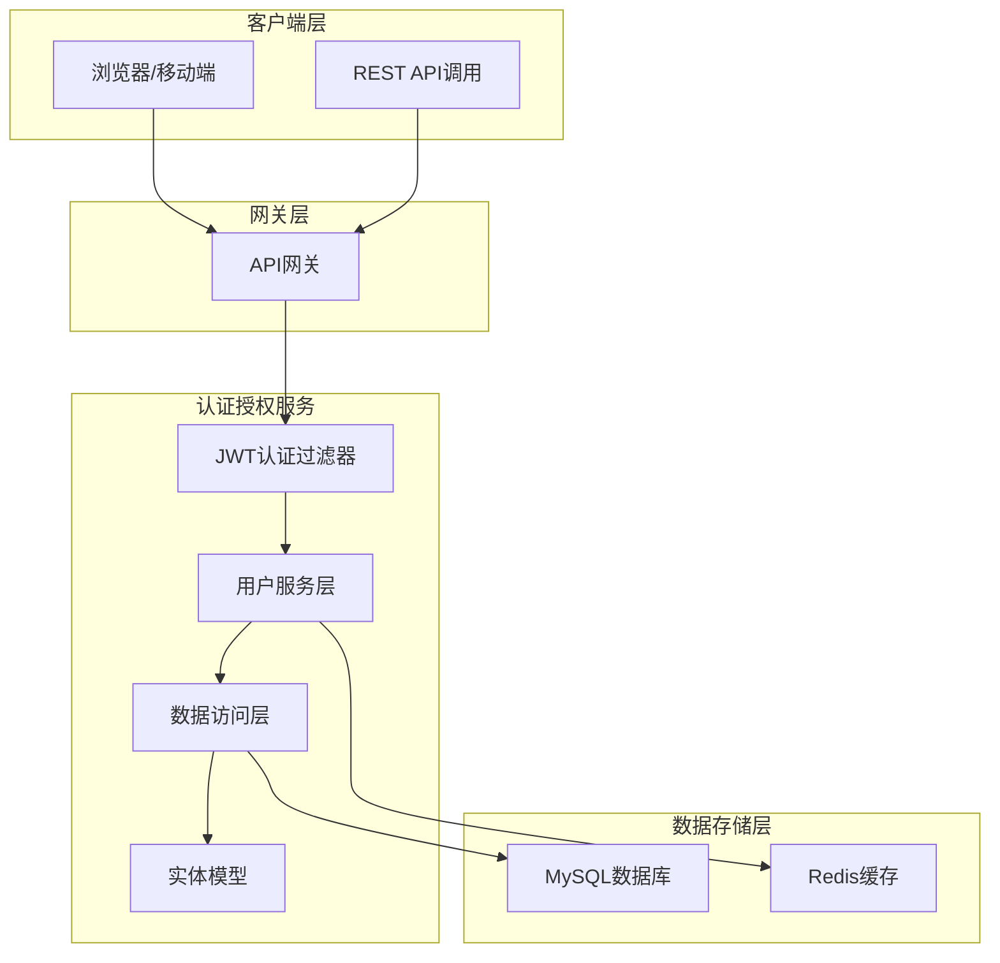
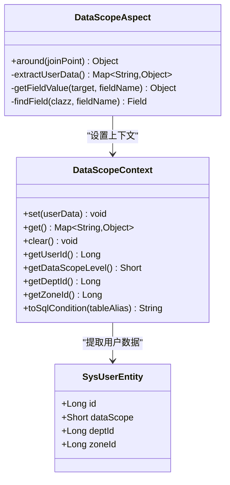
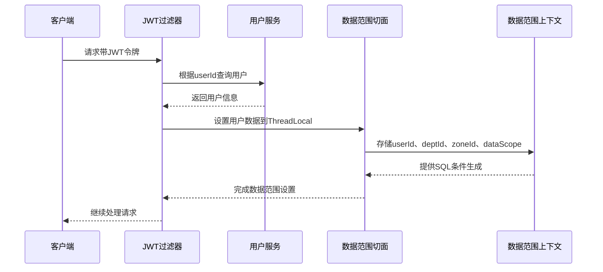
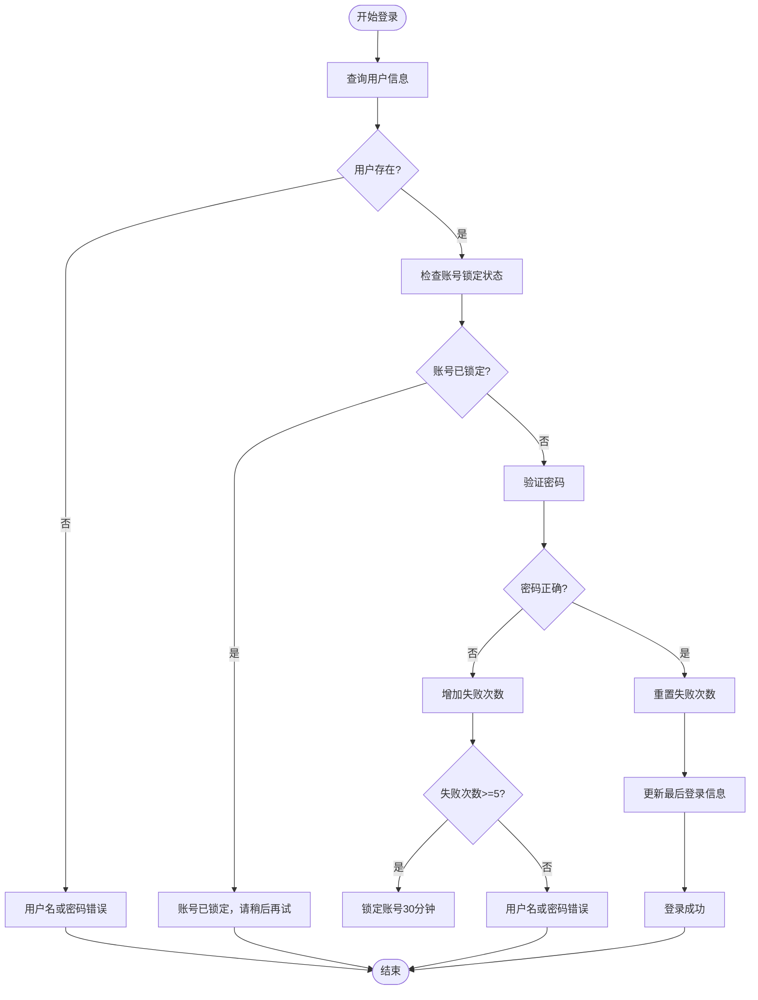
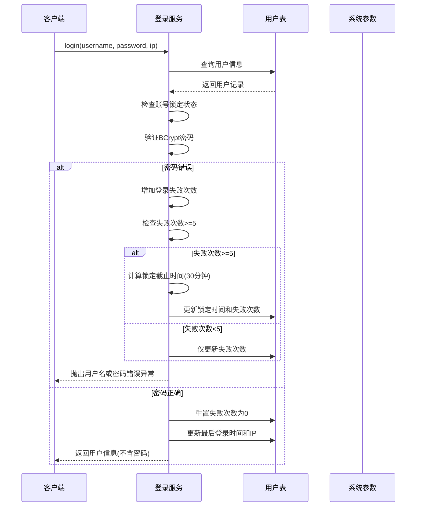
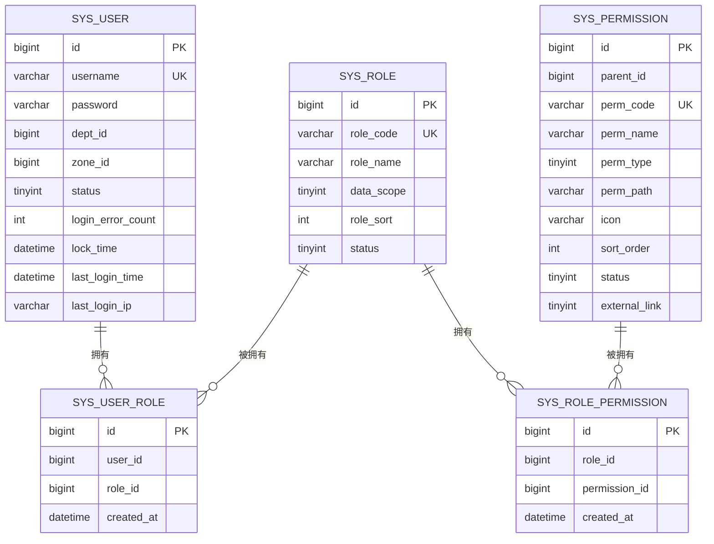
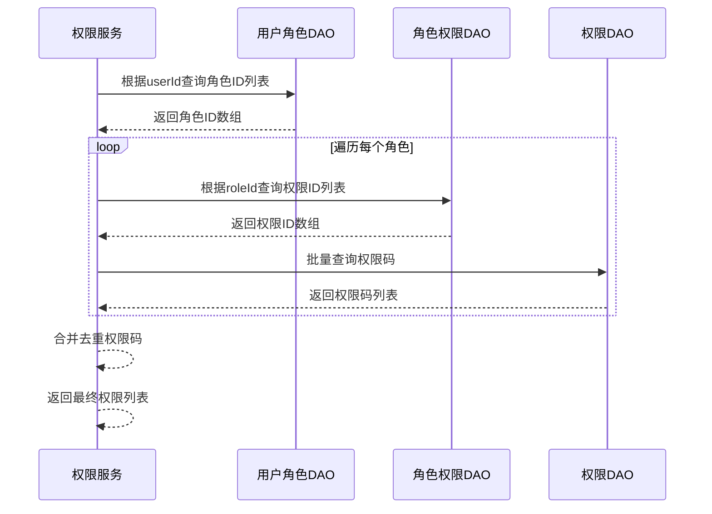
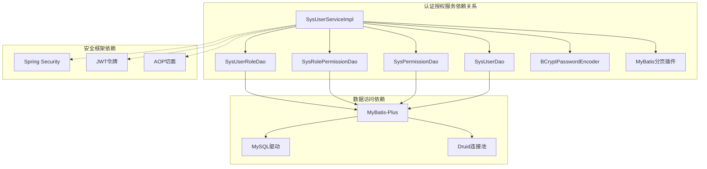

# 认证授权实体设计

<cite>
**本文档引用的文件**
- [SysUserEntity.java](file://auth/src/main/java/com/dafuweng/auth/entity/SysUserEntity.java)
- [SysRoleEntity.java](file://auth/src/main/java/com/dafuweng/auth/entity/SysRoleEntity.java)
- [SysPermissionEntity.java](file://auth/src/main/java/com/dafuweng/auth/entity/SysPermissionEntity.java)
- [SysUserRoleEntity.java](file://auth/src/main/java/com/dafuweng/auth/entity/SysUserRoleEntity.java)
- [SysRolePermissionEntity.java](file://auth/src/main/java/com/dafuweng/auth/entity/SysRolePermissionEntity.java)
- [database.sql](file://database.sql)
- [DataScopeContext.java](file://common/src/main/java/com/dafuweng/common/config/DataScopeContext.java)
- [DataScopeAspect.java](file://common/src/main/java/com/dafuweng/common/config/DataScopeAspect.java)
- [SysUserServiceImpl.java](file://auth/src/main/java/com/dafuweng/auth/service/impl/SysUserServiceImpl.java)
- [JwtAuthenticationFilter.java](file://auth/src/main/java/com/dafuweng/auth/filter/JwtAuthenticationFilter.java)
- [SysUserDao.java](file://auth/src/main/java/com/dafuweng/auth/dao/SysUserDao.java)
- [SysPermissionDao.java](file://auth/src/main/java/com/dafuweng/auth/dao/SysPermissionDao.java)
</cite>

## 目录
1. [简介](#简介)
2. [项目结构](#项目结构)
3. [核心组件](#核心组件)
4. [架构概览](#架构概览)
5. [详细组件分析](#详细组件分析)
6. [依赖关系分析](#依赖关系分析)
7. [性能考虑](#性能考虑)
8. [故障排除指南](#故障排除指南)
9. [结论](#结论)

## 简介

NeoCC项目采用基于角色的访问控制（RBAC）模型，通过用户、角色、权限三层体系实现细粒度的权限管理。本设计文档详细阐述了认证授权模块的核心实体设计，包括用户（sys_user）、角色（sys_role）、权限（sys_permission）及其关联表（sys_user_role、sys_role_permission）的完整设计。

该系统支持多层级数据范围控制，涵盖用户与角色的多对多关系、角色与权限的多对多关系，以及用户与部门、战区的多对一关系。通过精心设计的数据范围控制（data_scope）字段和登录安全机制（login_error_cnt、lock_time），实现了灵活而安全的企业级权限管理体系。

## 项目结构

认证授权模块位于auth子项目中，采用标准的分层架构设计：

**图表来源**
- [SysUserEntity.java:1-59](file://auth/src/main/java/com/dafuweng/auth/entity/SysUserEntity.java#L1-L59)
- [SysRoleEntity.java:1-41](file://auth/src/main/java/com/dafuweng/auth/entity/SysRoleEntity.java#L1-L41)
- [SysPermissionEntity.java:1-46](file://auth/src/main/java/com/dafuweng/auth/entity/SysPermissionEntity.java#L1-L46)

**章节来源**
- [SysUserEntity.java:1-59](file://auth/src/main/java/com/dafuweng/auth/entity/SysUserEntity.java#L1-L59)
- [SysRoleEntity.java:1-41](file://auth/src/main/java/com/dafuweng/auth/entity/SysRoleEntity.java#L1-L41)
- [SysPermissionEntity.java:1-46](file://auth/src/main/java/com/dafuweng/auth/entity/SysPermissionEntity.java#L1-L46)

## 核心组件

### 用户实体（SysUserEntity）

用户实体是认证授权系统的核心，承载着用户身份验证和权限控制的关键信息。

**主要字段设计**：
- `id`: 主键标识，自增BIGINT
- `username`: 用户名，VARCHAR(50)，唯一约束
- `password`: 密码密文，VARCHAR(200)，采用BCrypt加密存储
- `real_name`: 真实姓名，VARCHAR(50)
- `phone/email`: 联系方式，支持手机号和邮箱
- `dept_id/zone_id`: 多对一关系，关联部门和战区
- `status`: 账号状态，TINYINT，默认1（正常）
- `login_error_count`: 连续登录失败次数，INT，默认0
- `lock_time`: 账号锁定截止时间，DATETIME
- `last_login_time/last_login_ip`: 最后登录信息
- `deleted/version`: 逻辑删除和乐观锁支持

**索引设计**：
- 唯一索引：uk_username(username)
- 普通索引：idx_dept_id(dept_id)、idx_zone_id(zone_id)、idx_status(status)、idx_deleted(deleted)

### 角色实体（SysRoleEntity）

角色实体定义了用户可以拥有的角色集合，支持灵活的数据范围控制。

**主要字段设计**：
- `id`: 主键标识，自增BIGINT
- `role_code`: 角色编码，VARCHAR(50)，唯一约束
- `role_name`: 角色名称，VARCHAR(50)
- `data_scope`: 数据权限范围，TINYINT，默认1
  - 1: 本人数据
  - 2: 本部门数据  
  - 3: 本战区数据
  - 4: 全部数据
- `role_sort`: 显示顺序，INT，默认0
- `status`: 状态，TINYINT，默认1（启用）
- `deleted`: 逻辑删除，TINYINT，默认0

**索引设计**：
- 唯一索引：uk_role_code(role_code)
- 普通索引：idx_deleted(deleted)

### 权限实体（SysPermissionEntity）

权限实体描述了系统的功能权限和资源访问控制。

**主要字段设计**：
- `id`: 主键标识，自增BIGINT
- `parent_id`: 父权限ID，BIGINT，默认0（根节点）
- `perm_code`: 权限标识，VARCHAR(100)，唯一约束
- `perm_name`: 权限名称，VARCHAR(50)
- `perm_type`: 权限类型，TINYINT
  - 1: 菜单权限
  - 2: 按钮权限  
  - 3: 接口权限
- `perm_path`: 权限路径，菜单路径或接口URL
- `icon/sort_order`: 图标和显示顺序
- `status`: 状态，TINYINT，默认1（启用）
- `external_link`: 是否外链，TINYINT，默认0（否）
- `deleted`: 逻辑删除，TINYINT，默认0

**索引设计**：
- 唯一索引：uk_perm_code(perm_code)
- 普通索引：idx_parent_id(parent_id)、idx_deleted(deleted)

### 关联实体

#### 用户角色关联（SysUserRoleEntity）
- `id`: 主键
- `user_id`: 用户ID
- `role_id`: 角色ID
- `created_at`: 创建时间

**复合唯一索引**：uk_user_role(user_id, role_id)

#### 角色权限关联（SysRolePermissionEntity）  
- `id`: 主键
- `role_id`: 角色ID
- `permission_id`: 权限ID
- `created_at`: 创建时间

**复合唯一索引**：uk_role_perm(role_id, permission_id)

**章节来源**
- [SysUserEntity.java:18-57](file://auth/src/main/java/com/dafuweng/auth/entity/SysUserEntity.java#L18-L57)
- [SysRoleEntity.java:17-39](file://auth/src/main/java/com/dafuweng/auth/entity/SysRoleEntity.java#L17-L39)
- [SysPermissionEntity.java:18-44](file://auth/src/main/java/com/dafuweng/auth/entity/SysPermissionEntity.java#L18-L44)
- [SysUserRoleEntity.java:16-23](file://auth/src/main/java/com/dafuweng/auth/entity/SysUserRoleEntity.java#L16-L23)
- [SysRolePermissionEntity.java:16-23](file://auth/src/main/java/com/dafuweng/auth/entity/SysRolePermissionEntity.java#L16-L23)

## 架构概览

系统采用分层架构设计，结合Spring Security实现安全控制：

**图表来源**
- [JwtAuthenticationFilter.java:20-82](file://auth/src/main/java/com/dafuweng/auth/filter/JwtAuthenticationFilter.java#L20-L82)
- [SysUserServiceImpl.java:28-229](file://auth/src/main/java/com/dafuweng/auth/service/impl/SysUserServiceImpl.java#L28-L229)

## 详细组件分析

### 数据范围控制机制

数据范围控制是NeoCC系统的重要特性，通过data_scope字段实现灵活的数据访问控制：

**图表来源**
- [DataScopeContext.java:17-141](file://common/src/main/java/com/dafuweng/common/config/DataScopeContext.java#L17-L141)
- [DataScopeAspect.java:25-93](file://common/src/main/java/com/dafuweng/common/config/DataScopeAspect.java#L25-L93)
- [SysUserEntity.java:18-57](file://auth/src/main/java/com/dafuweng/auth/entity/SysUserEntity.java#L18-L57)

**数据范围控制流程**：

**图表来源**
- [JwtAuthenticationFilter.java:28-80](file://auth/src/main/java/com/dafuweng/auth/filter/JwtAuthenticationFilter.java#L28-L80)
- [DataScopeAspect.java:29-38](file://common/src/main/java/com/dafuweng/common/config/DataScopeAspect.java#L29-L38)
- [DataScopeContext.java:106-139](file://common/src/main/java/com/dafuweng/common/config/DataScopeContext.java#L106-L139)

### 登录安全机制

系统实现了完善的登录安全控制，包括密码验证、失败次数统计和账号锁定机制：

**图表来源**
- [SysUserServiceImpl.java:80-118](file://auth/src/main/java/com/dafuweng/auth/service/impl/SysUserServiceImpl.java#L80-L118)

**登录安全流程**：

**图表来源**
- [SysUserServiceImpl.java:79-118](file://auth/src/main/java/com/dafuweng/auth/service/impl/SysUserServiceImpl.java#L79-L118)

### 权限继承与传递

系统通过用户-角色-权限的三层关系实现权限的动态继承和传递：

**图表来源**
- [database.sql:22-107](file://database.sql#L22-L107)

**权限查询流程**：

**图表来源**
- [SysUserServiceImpl.java:144-160](file://auth/src/main/java/com/dafuweng/auth/service/impl/SysUserServiceImpl.java#L144-L160)

**章节来源**
- [DataScopeContext.java:17-141](file://common/src/main/java/com/dafuweng/common/config/DataScopeContext.java#L17-L141)
- [DataScopeAspect.java:25-93](file://common/src/main/java/com/dafuweng/common/config/DataScopeAspect.java#L25-L93)
- [SysUserServiceImpl.java:80-118](file://auth/src/main/java/com/dafuweng/auth/service/impl/SysUserServiceImpl.java#L80-L118)
- [SysUserServiceImpl.java:144-160](file://auth/src/main/java/com/dafuweng/auth/service/impl/SysUserServiceImpl.java#L144-L160)

## 依赖关系分析

系统采用松耦合的设计原则，通过接口和依赖注入实现模块间的解耦：

**图表来源**
- [SysUserServiceImpl.java:31-44](file://auth/src/main/java/com/dafuweng/auth/service/impl/SysUserServiceImpl.java#L31-L44)
- [SysUserDao.java:8-12](file://auth/src/main/java/com/dafuweng/auth/dao/SysUserDao.java#L8-L12)
- [SysPermissionDao.java:11-20](file://auth/src/main/java/com/dafuweng/auth/dao/SysPermissionDao.java#L11-L20)

**依赖分析**：
- **低耦合设计**：各层之间通过接口交互，避免直接依赖具体实现
- **依赖注入**：使用@Autowired注解实现自动装配，减少手动管理
- **事务管理**：在服务层使用@Transactional注解确保数据一致性
- **安全集成**：与Spring Security无缝集成，提供统一的安全控制

**章节来源**
- [SysUserServiceImpl.java:28-229](file://auth/src/main/java/com/dafuweng/auth/service/impl/SysUserServiceImpl.java#L28-L229)
- [SysUserDao.java:8-12](file://auth/src/main/java/com/dafuweng/auth/dao/SysUserDao.java#L8-L12)
- [SysPermissionDao.java:11-20](file://auth/src/main/java/com/dafuweng/auth/dao/SysPermissionDao.java#L11-L20)

## 性能考虑

### 数据库性能优化

**索引策略**：
- 用户表：唯一索引uk_username用于快速用户名查找，普通索引idx_status用于状态筛选
- 角色表：唯一索引uk_role_code支持快速角色查询
- 关联表：复合唯一索引uk_user_role和uk_role_perm确保关系唯一性
- 权限表：唯一索引uk_perm_code支持权限标识快速匹配

**查询优化**：
- 使用批量操作减少数据库往返次数
- 采用懒加载策略避免不必要的关联查询
- 实现分页查询支持大数据量场景

### 缓存策略

**Redis缓存**：
- 用户权限信息缓存，减少数据库查询压力
- JWT令牌缓存，支持令牌撤销和刷新
- 热点数据缓存，提升系统响应速度

**缓存失效策略**：
- 基于时间的TTL过期机制
- 基于事件的主动失效机制
- 内存淘汰策略确保缓存有效性

### 安全性能

**密码加密**：
- BCrypt算法提供高强度密码保护
- 自适应成本参数平衡安全性和性能
- 异步加密处理避免阻塞主线程

**会话管理**：
- 无状态JWT令牌设计
- 减少服务器端会话存储开销
- 支持水平扩展和负载均衡

## 故障排除指南

### 常见问题诊断

**登录失败问题**：
1. 检查用户名是否存在且未被逻辑删除
2. 验证账号是否处于锁定状态
3. 确认密码加密格式是否正确
4. 查看登录失败次数和锁定时间配置

**权限访问问题**：
1. 确认用户角色分配是否正确
2. 检查角色权限映射关系
3. 验证数据范围控制配置
4. 查看权限缓存是否过期

**性能问题排查**：
1. 分析慢查询日志
2. 检查数据库索引使用情况
3. 监控Redis缓存命中率
4. 评估网络延迟和带宽

### 调试工具

**日志监控**：
- 启用详细的安全审计日志
- 监控异常登录尝试
- 跟踪权限访问历史
- 记录系统性能指标

**性能分析**：
- 使用JVM分析工具检测内存泄漏
- 监控数据库连接池使用情况
- 分析API响应时间分布
- 评估并发处理能力

**章节来源**
- [SysUserServiceImpl.java:80-118](file://auth/src/main/java/com/dafuweng/auth/service/impl/SysUserServiceImpl.java#L80-L118)
- [DataScopeContext.java:106-139](file://common/src/main/java/com/dafuweng/common/config/DataScopeContext.java#L106-L139)

## 结论

NeoCC项目的认证授权实体设计体现了现代企业级应用的安全性和可扩展性要求。通过精心设计的用户、角色、权限三层体系，配合灵活的数据范围控制和完善的登录安全机制，构建了一个既安全又高效的权限管理平台。

**设计亮点**：
- **层次化权限控制**：支持从个人到全局的多层级数据访问控制
- **灵活的角色管理**：动态的角色分配和权限继承机制
- **完善的安全保障**：多层次的安全控制和审计功能
- **高性能的架构设计**：合理的索引策略和缓存机制

**未来改进方向**：
- 增强审计日志的详细程度
- 优化权限缓存策略
- 扩展多租户支持
- 增加权限变更的实时通知机制

该设计为NeoCC项目的持续发展奠定了坚实的基础，能够满足复杂业务场景下的权限管理需求。