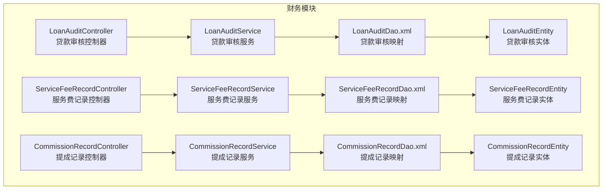
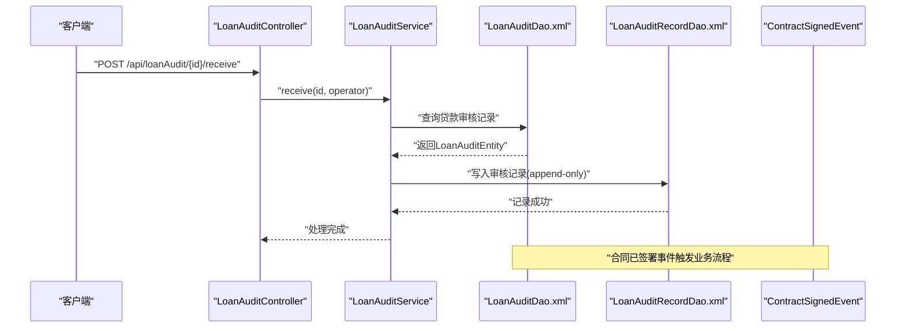
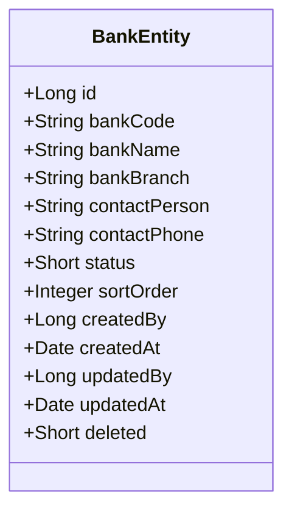
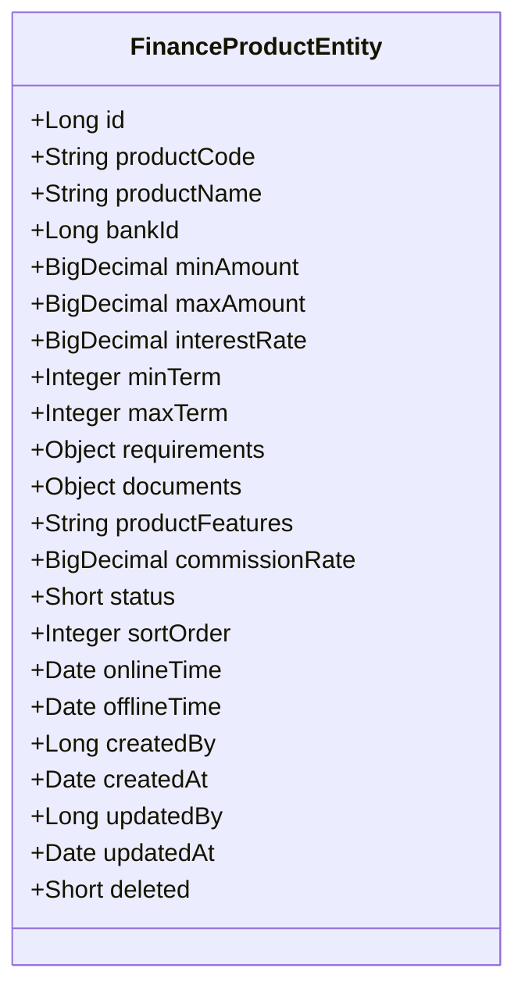
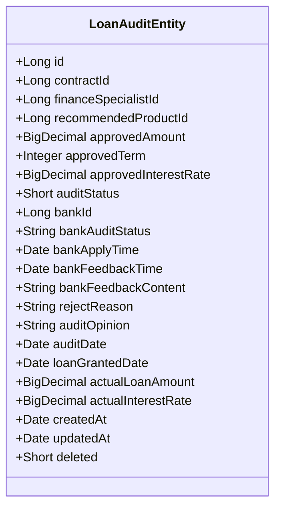
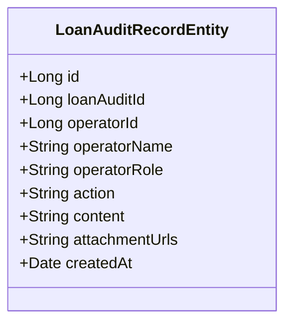
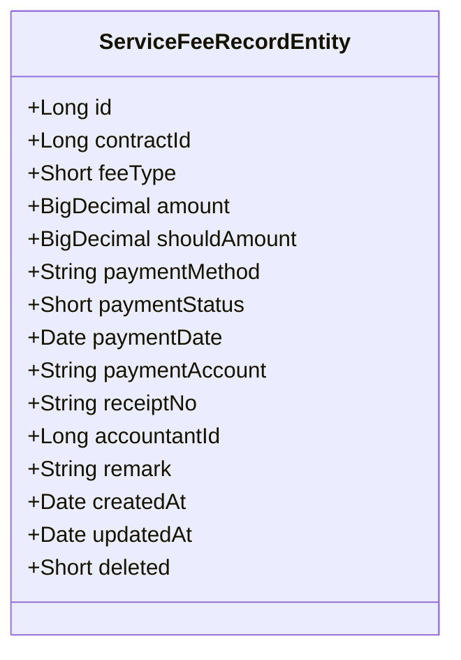
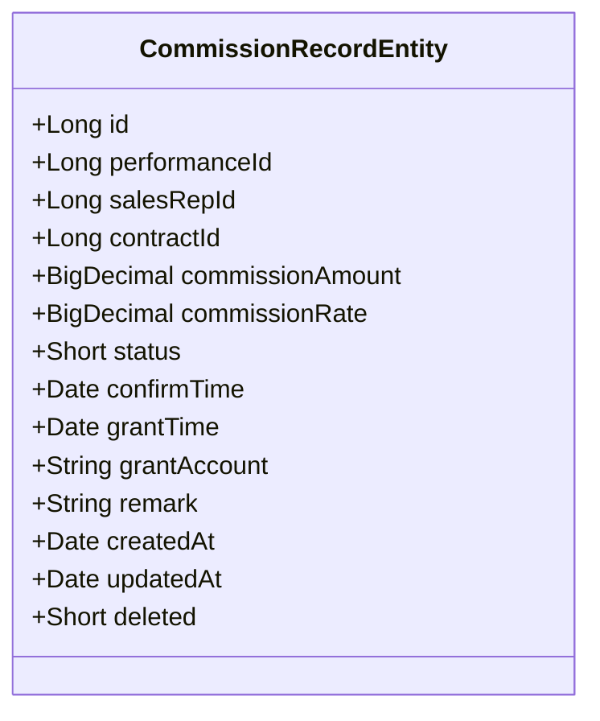
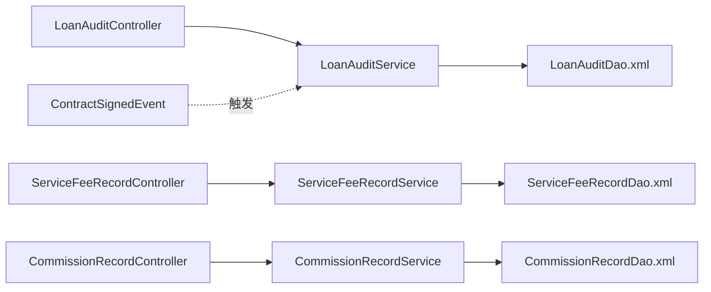

# 财务管理实体设计

<cite>
**本文档引用的文件**
- [BankEntity.java](file://finance/src/main/java/com/dafuweng/finance/entity/BankEntity.java)
- [FinanceProductEntity.java](file://finance/src/main/java/com/dafuweng/finance/entity/FinanceProductEntity.java)
- [LoanAuditEntity.java](file://finance/src/main/java/com/dafuweng/finance/entity/LoanAuditEntity.java)
- [LoanAuditRecordEntity.java](file://finance/src/main/java/com/dafuweng/finance/entity/LoanAuditRecordEntity.java)
- [ServiceFeeRecordEntity.java](file://finance/src/main/java/com/dafuweng/finance/entity/ServiceFeeRecordEntity.java)
- [CommissionRecordEntity.java](file://finance/src/main/java/com/dafuweng/finance/entity/CommissionRecordEntity.java)
- [BankDao.xml](file://finance/src/main/resources/finance/mapper/BankDao.xml)
- [FinanceProductDao.xml](file://finance/src/main/resources/finance/mapper/FinanceProductDao.xml)
- [LoanAuditDao.xml](file://finance/src/main/resources/finance/mapper/LoanAuditDao.xml)
- [LoanAuditRecordDao.xml](file://finance/src/main/resources/finance/mapper/LoanAuditRecordDao.xml)
- [ServiceFeeRecordDao.xml](file://finance/src/main/resources/finance/mapper/ServiceFeeRecordDao.xml)
- [CommissionRecordDao.xml](file://finance/src/main/resources/finance/mapper/CommissionRecordDao.xml)
- [LoanAuditController.java](file://finance/src/main/java/com/dafuweng/finance/controller/LoanAuditController.java)
- [ServiceFeeRecordController.java](file://finance/src/main/java/com/dafuweng/finance/controller/ServiceFeeRecordController.java)
- [CommissionRecordController.java](file://finance/src/main/java/com/dafuweng/finance/controller/CommissionRecordController.java)
- [ContractSignedEvent.java](file://common/src/main/java/com/dafuweng/common/mq/event/ContractSignedEvent.java)
</cite>

## 目录
1. [引言](#引言)
2. [项目结构](#项目结构)
3. [核心实体概览](#核心实体概览)
4. [架构总览](#架构总览)
5. [详细实体分析](#详细实体分析)
6. [依赖关系分析](#依赖关系分析)
7. [性能考虑](#性能考虑)
8. [故障排除指南](#故障排除指南)
9. [结论](#结论)

## 引言
本文件面向NeoCC项目财务管理模块，系统化梳理银行、金融产品、贷款审核、审核记录、服务费记录、提成记录等核心实体的设计理念与实现细节。重点阐述贷款审核流程中的状态流转、银行反馈机制以及实际放款金额的记录策略；解释服务费记录与合同表分离的设计思路；说明提成发放的审计轨迹设计；并提供审核记录的append-only日志表设计，以满足金融业务的合规性与数据完整性要求。

## 项目结构
财务管理模块位于finance子工程中，采用分层架构：controller负责HTTP接口编排，service封装业务逻辑，dao通过MyBatis映射数据库表，entity定义持久化模型。各实体均遵循统一的字段规范（如创建时间、更新时间、软删除标记），并通过XML映射文件完成字段到数据库列的绑定。

**图表来源**
- [LoanAuditController.java:1-143](file://finance/src/main/java/com/dafuweng/finance/controller/LoanAuditController.java#L1-L143)
- [ServiceFeeRecordController.java:1-64](file://finance/src/main/java/com/dafuweng/finance/controller/ServiceFeeRecordController.java#L1-L64)
- [CommissionRecordController.java:1-64](file://finance/src/main/java/com/dafuweng/finance/controller/CommissionRecordController.java#L1-L64)
- [LoanAuditDao.xml:1-42](file://finance/src/main/resources/finance/mapper/LoanAuditDao.xml#L1-L42)
- [ServiceFeeRecordDao.xml:1-32](file://finance/src/main/resources/finance/mapper/ServiceFeeRecordDao.xml#L1-L32)
- [CommissionRecordDao.xml:1-33](file://finance/src/main/resources/finance/mapper/CommissionRecordDao.xml#L1-L33)

**章节来源**
- [LoanAuditController.java:1-143](file://finance/src/main/java/com/dafuweng/finance/controller/LoanAuditController.java#L1-L143)
- [ServiceFeeRecordController.java:1-64](file://finance/src/main/java/com/dafuweng/finance/controller/ServiceFeeRecordController.java#L1-L64)
- [CommissionRecordController.java:1-64](file://finance/src/main/java/com/dafuweng/finance/controller/CommissionRecordController.java#L1-L64)

## 核心实体概览
- 银行（bank）：记录合作银行的基础信息与联系人信息，支持排序与状态控制，并具备软删除能力。
- 金融产品（finance_product）：描述银行提供的金融产品，包含额度区间、期限范围、利率、所需材料与文档等，支持JSON字段存储动态配置。
- 贷款审核（loan_audit）：承载单笔贷款从申请到放款的关键状态与关键数据点，包括审批金额、期限、利率、银行反馈、拒绝原因、放款日期与实际放款金额等。
- 审核记录（loan_audit_record）：以append-only方式记录每次操作的参与者、动作、内容与附件链接，形成不可篡改的审计轨迹。
- 服务费记录（service_fee_record）：独立于合同表的服务费用记录，支持多种支付方式与状态管理，便于财务对账与合规审查。
- 提成记录（commission_record）：记录销售代表的业绩提成，包含确认与发放节点，配套审计轨迹字段。

**章节来源**
- [BankEntity.java:1-45](file://finance/src/main/java/com/dafuweng/finance/entity/BankEntity.java#L1-L45)
- [FinanceProductEntity.java:1-68](file://finance/src/main/java/com/dafuweng/finance/entity/FinanceProductEntity.java#L1-L68)
- [LoanAuditEntity.java:1-64](file://finance/src/main/java/com/dafuweng/finance/entity/LoanAuditEntity.java#L1-L64)
- [LoanAuditRecordEntity.java:1-37](file://finance/src/main/java/com/dafuweng/finance/entity/LoanAuditRecordEntity.java#L1-L37)
- [ServiceFeeRecordEntity.java:1-50](file://finance/src/main/java/com/dafuweng/finance/entity/ServiceFeeRecordEntity.java#L1-L50)
- [CommissionRecordEntity.java:1-48](file://finance/src/main/java/com/dafuweng/finance/entity/CommissionRecordEntity.java#L1-L48)

## 架构总览
下图展示贷款审核流程在控制器、服务与实体之间的交互关系，以及与消息事件的集成点。

**图表来源**
- [LoanAuditController.java:59-81](file://finance/src/main/java/com/dafuweng/finance/controller/LoanAuditController.java#L59-L81)
- [LoanAuditDao.xml:30-39](file://finance/src/main/resources/finance/mapper/LoanAuditDao.xml#L30-L39)
- [LoanAuditRecordDao.xml:17-23](file://finance/src/main/resources/finance/mapper/LoanAuditRecordDao.xml#L17-L23)
- [ContractSignedEvent.java:1-21](file://common/src/main/java/com/dafuweng/common/mq/event/ContractSignedEvent.java#L1-L21)

## 详细实体分析

### 银行（bank）实体设计
- 设计要点
  - 基础信息：银行编号、名称、分行、联系人与电话。
  - 状态与排序：status与sortOrder用于前端展示与筛选。
  - 时间戳与审计：createdBy/updatedBy/createdAt/updatedAt。
  - 软删除：deleted字段支持逻辑删除。
- 字段映射
  - XML映射文件将Java属性与数据库列精确对应，确保ORM一致性。
- 适用场景
  - 金融产品推荐与银行对接的基础数据支撑。

**图表来源**
- [BankEntity.java:13-44](file://finance/src/main/java/com/dafuweng/finance/entity/BankEntity.java#L13-L44)
- [BankDao.xml:5-19](file://finance/src/main/resources/finance/mapper/BankDao.xml#L5-L19)

**章节来源**
- [BankEntity.java:1-45](file://finance/src/main/java/com/dafuweng/finance/entity/BankEntity.java#L1-L45)
- [BankDao.xml:1-22](file://finance/src/main/resources/finance/mapper/BankDao.xml#L1-L22)

### 金融产品（finance_product）实体设计
- 设计要点
  - 产品基础信息：产品编号、名称、所属银行、额度区间、期限范围、利率。
  - 动态配置：requirements与documents使用JacksonTypeHandler存储JSON对象，便于扩展需求与材料清单。
  - 佣金率与上下架：commissionRate、onlineTime、offlineTime、status、sortOrder。
  - 审计字段：createdBy/updatedBy/createdAt/updatedAt、deleted。
- 查询优化
  - 提供按银行ID查询的SQL，过滤deleted=0并按sortOrder排序，保证列表一致性与性能。

**图表来源**
- [FinanceProductEntity.java:16-67](file://finance/src/main/java/com/dafuweng/finance/entity/FinanceProductEntity.java#L16-L67)
- [FinanceProductDao.xml:5-28](file://finance/src/main/resources/finance/mapper/FinanceProductDao.xml#L5-L28)

**章节来源**
- [FinanceProductEntity.java:1-68](file://finance/src/main/java/com/dafuweng/finance/entity/FinanceProductEntity.java#L1-L68)
- [FinanceProductDao.xml:1-42](file://finance/src/main/resources/finance/mapper/FinanceProductDao.xml#L1-L42)

### 贷款审核（loan_audit）实体设计
- 设计要点
  - 关联与审批：contractId、financeSpecialistId、recommendedProductId、approvedAmount/term/rate。
  - 审核状态：auditStatus（内部审核状态）、bankAuditStatus（银行审核状态标识）。
  - 银行交互：bankApplyTime、bankFeedbackTime、bankFeedbackContent。
  - 拒绝与意见：rejectReason、auditOpinion。
  - 放款与实操：auditDate、loanGrantedDate、actualLoanAmount、actualInterestRate。
  - 审计字段：createdAt/updatedAt、deleted。
- 数据完整性
  - 实际放款金额与利率作为最终确认字段，避免历史篡改风险。
  - 银行反馈内容与时间点完整记录，便于审计与争议处理。

**图表来源**
- [LoanAuditEntity.java:14-63](file://finance/src/main/java/com/dafuweng/finance/entity/LoanAuditEntity.java#L14-L63)
- [LoanAuditDao.xml:5-28](file://finance/src/main/resources/finance/mapper/LoanAuditDao.xml#L5-L28)

**章节来源**
- [LoanAuditEntity.java:1-64](file://finance/src/main/java/com/dafuweng/finance/entity/LoanAuditEntity.java#L1-L64)
- [LoanAuditDao.xml:1-42](file://finance/src/main/resources/finance/mapper/LoanAuditDao.xml#L1-L42)

### 审核记录（loan_audit_record）实体设计
- 设计要点
  - append-only日志：每条记录代表一次操作，不可修改或删除。
  - 操作者信息：operatorId/operatorName/operatorRole。
  - 操作行为：action（如接收、复核、提交银行、银行结果、批准、拒绝等）。
  - 内容与附件：content与attachment_urls，支持文本说明与文件链接。
  - 时间戳：createdAt。
- 流程意义
  - 将贷款审核过程的每个关键节点固化为不可逆证据链，满足监管与内审要求。

**图表来源**
- [LoanAuditRecordEntity.java:13-36](file://finance/src/main/java/com/dafuweng/finance/entity/LoanAuditRecordEntity.java#L13-L36)
- [LoanAuditRecordDao.xml:5-15](file://finance/src/main/resources/finance/mapper/LoanAuditRecordDao.xml#L5-L15)

**章节来源**
- [LoanAuditRecordEntity.java:1-37](file://finance/src/main/java/com/dafuweng/finance/entity/LoanAuditRecordEntity.java#L1-L37)
- [LoanAuditRecordDao.xml:1-26](file://finance/src/main/resources/finance/mapper/LoanAuditRecordDao.xml#L1-L26)

### 服务费记录（service_fee_record）实体设计
- 设计要点
  - 独立于合同：contractId、feeType、amount、shouldAmount。
  - 支付管理：paymentMethod、paymentStatus、paymentDate、paymentAccount、receiptNo、accountantId。
  - 备注与审计：remark、createdAt/updatedAt、deleted。
- 分离设计优势
  - 服务费与合同解耦，便于多合同多费用场景的精细化管理与财务对账。
  - 支付状态与会计人员信息分离，提升流程透明度与可追溯性。

**图表来源**
- [ServiceFeeRecordEntity.java:14-49](file://finance/src/main/java/com/dafuweng/finance/entity/ServiceFeeRecordEntity.java#L14-L49)
- [ServiceFeeRecordDao.xml:5-21](file://finance/src/main/resources/finance/mapper/ServiceFeeRecordDao.xml#L5-L21)

**章节来源**
- [ServiceFeeRecordEntity.java:1-50](file://finance/src/main/java/com/dafuweng/finance/entity/ServiceFeeRecordEntity.java#L1-L50)
- [ServiceFeeRecordDao.xml:1-32](file://finance/src/main/resources/finance/mapper/ServiceFeeRecordDao.xml#L1-L32)

### 提成记录（commission_record）实体设计
- 设计要点
  - 关联维度：performanceId、salesRepId、contractId。
  - 金额与比例：commissionAmount、commissionRate。
  - 状态与时点：status、confirmTime、grantTime、grantAccount。
  - 审计轨迹：remark、createdAt/updatedAt、deleted。
- 发放审计
  - 通过confirm/grant两个时点与账户信息，形成清晰的提成发放审计链。

**图表来源**
- [CommissionRecordEntity.java:14-47](file://finance/src/main/java/com/dafuweng/finance/entity/CommissionRecordEntity.java#L14-L47)
- [CommissionRecordDao.xml:5-19](file://finance/src/main/resources/finance/mapper/CommissionRecordDao.xml#L5-L19)

**章节来源**
- [CommissionRecordEntity.java:1-48](file://finance/src/main/java/com/dafuweng/finance/entity/CommissionRecordEntity.java#L1-L48)
- [CommissionRecordDao.xml:1-33](file://finance/src/main/resources/finance/mapper/CommissionRecordDao.xml#L1-L33)

## 依赖关系分析
- 控制器到服务：LoanAuditController、ServiceFeeRecordController、CommissionRecordController分别调用对应Service，承担参数校验与响应封装。
- 服务到DAO：各Service通过XML映射执行CRUD与条件查询，如按合同ID查询贷款审核、按销售代表查询提成记录等。
- 事件驱动：ContractSignedEvent作为外部事件，驱动贷款审核流程的启动与后续动作。

**图表来源**
- [LoanAuditController.java:1-143](file://finance/src/main/java/com/dafuweng/finance/controller/LoanAuditController.java#L1-L143)
- [ServiceFeeRecordController.java:1-64](file://finance/src/main/java/com/dafuweng/finance/controller/ServiceFeeRecordController.java#L1-L64)
- [CommissionRecordController.java:1-64](file://finance/src/main/java/com/dafuweng/finance/controller/CommissionRecordController.java#L1-L64)
- [LoanAuditDao.xml:1-42](file://finance/src/main/resources/finance/mapper/LoanAuditDao.xml#L1-L42)
- [ServiceFeeRecordDao.xml:1-32](file://finance/src/main/resources/finance/mapper/ServiceFeeRecordDao.xml#L1-L32)
- [CommissionRecordDao.xml:1-33](file://finance/src/main/resources/finance/mapper/CommissionRecordDao.xml#L1-L33)
- [ContractSignedEvent.java:1-21](file://common/src/main/java/com/dafuweng/common/mq/event/ContractSignedEvent.java#L1-L21)

**章节来源**
- [LoanAuditController.java:1-143](file://finance/src/main/java/com/dafuweng/finance/controller/LoanAuditController.java#L1-L143)
- [ServiceFeeRecordController.java:1-64](file://finance/src/main/java/com/dafuweng/finance/controller/ServiceFeeRecordController.java#L1-L64)
- [CommissionRecordController.java:1-64](file://finance/src/main/java/com/dafuweng/finance/controller/CommissionRecordController.java#L1-L64)

## 性能考虑
- 索引与查询
  - 按合同ID查询贷款审核与服务费记录：建议在contract_id上建立索引，提高关联查询效率。
  - 按销售代表查询提成记录：按sales_rep_id建立索引，并按created_at降序排序，满足报表与审计需求。
- JSON字段
  - requirements与documents使用JacksonTypeHandler存储JSON，避免频繁变更结构带来的DDL成本，但需注意查询复杂度与索引策略。
- 软删除
  - 所有实体均带deleted字段，查询时默认过滤deleted=0，减少扫描开销并保持数据一致性。

## 故障排除指南
- 审核记录缺失
  - 症状：贷款审核关键节点无审计轨迹。
  - 排查：检查loan_audit_record表是否正确写入，确认append-only策略未被误删或覆盖。
  - 参考：append-only查询SQL按created_at升序排列，确保顺序正确。
- 银行反馈不一致
  - 症状：银行反馈内容与时间点与贷款审核记录不符。
  - 排查：核对bankFeedbackTime与bankFeedbackContent字段是否正确更新，确认银行接口回调逻辑。
- 实际放款金额异常
  - 症状：actualLoanAmount或actualInterestRate与预期不符。
  - 排查：检查approve接口传参与服务端处理逻辑，确认最终落库值。
- 服务费支付状态错配
  - 症状：paymentStatus与实际支付不一致。
  - 排查：核对confirmPay接口调用与字段赋值，确保accountantId与receiptNo等信息完整。
- 提成发放未留痕
  - 症状：grantTime为空或grantAccount缺失。
  - 排查：确认grant接口调用与字段更新，检查状态流转逻辑。

**章节来源**
- [LoanAuditRecordDao.xml:17-23](file://finance/src/main/resources/finance/mapper/LoanAuditRecordDao.xml#L17-L23)
- [LoanAuditController.java:96-129](file://finance/src/main/java/com/dafuweng/finance/controller/LoanAuditController.java#L96-L129)
- [ServiceFeeRecordController.java:52-62](file://finance/src/main/java/com/dafuweng/finance/controller/ServiceFeeRecordController.java#L52-L62)
- [CommissionRecordController.java:58-62](file://finance/src/main/java/com/dafuweng/finance/controller/CommissionRecordController.java#L58-L62)

## 结论
本设计以“可审计、可追溯、可合规”为核心目标，通过append-only审核记录、独立的服务费记录、明确的提成发放节点与完善的银行反馈机制，构建了覆盖贷款全流程的财务管理实体体系。实体间职责清晰、字段规范统一，并通过XML映射与控制器接口实现高内聚低耦合的模块化架构，既满足当前业务需求，也为未来扩展提供了稳定基础。