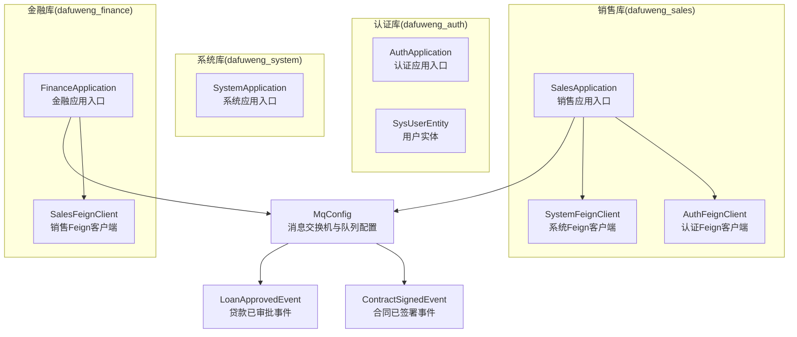
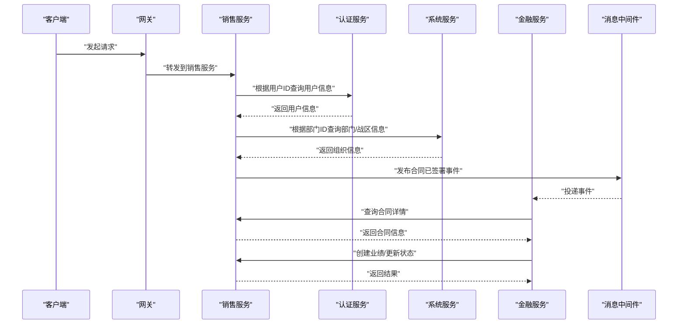
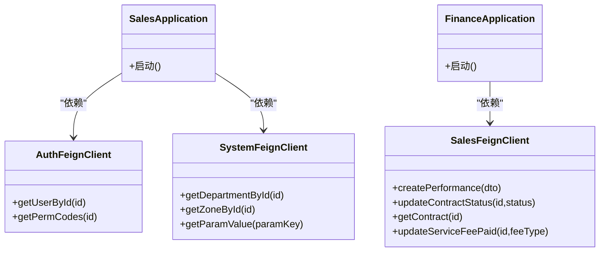
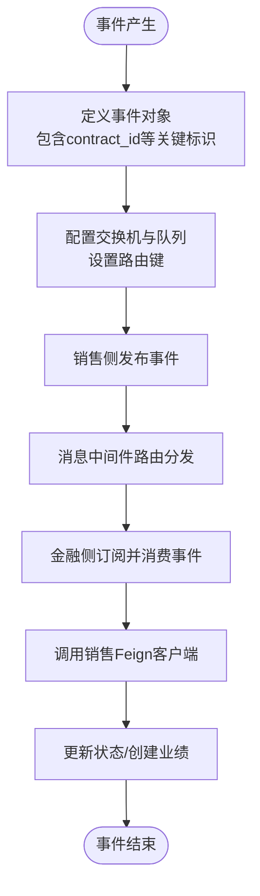
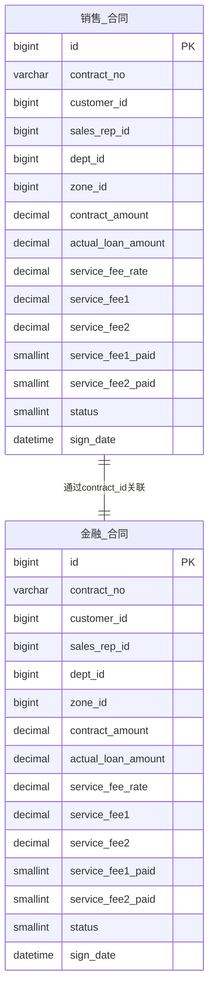
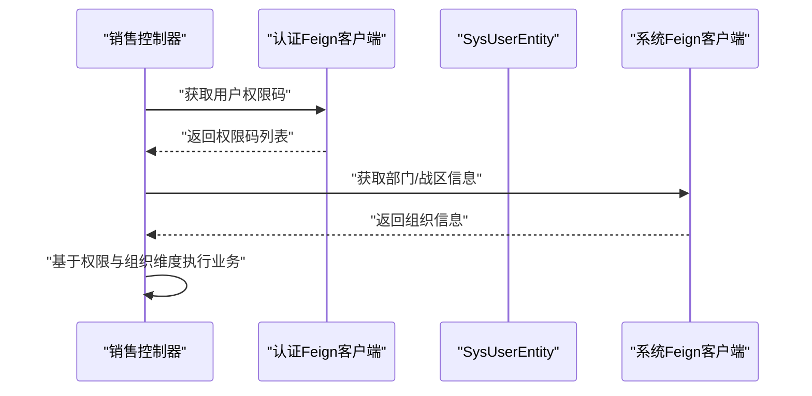
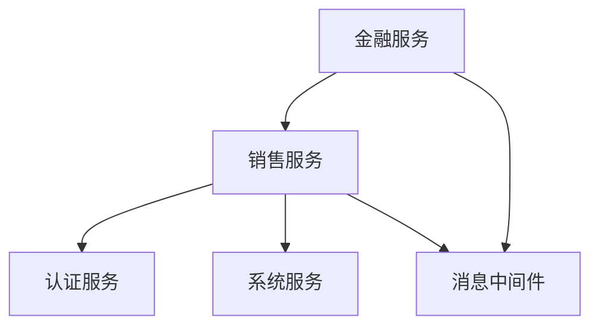

# 跨库关联关系设计

<cite>
**本文引用的文件**
- [AuthApplication.java](file://auth/src/main/java/com/dafuweng/AuthApplication.java)
- [SalesApplication.java](file://sales/src/main/java/com/dafuweng/sales/SalesApplication.java)
- [SystemApplication.java](file://system/src/main/java/com/dafuweng/system/SystemApplication.java)
- [FinanceApplication.java](file://finance/src/main/java/com/dafuweng/finance/FinanceApplication.java)
- [MqConfig.java](file://common/src/main/java/com/dafuweng/common/mq/MqConfig.java)
- [ContractSignedEvent.java](file://common/src/main/java/com/dafuweng/common/mq/event/ContractSignedEvent.java)
- [LoanApprovedEvent.java](file://common/src/main/java/com/dafuweng/common/mq/event/LoanApprovedEvent.java)
- [AuthFeignClient.java](file://sales/src/main/java/com/dafuweng/sales/feign/AuthFeignClient.java)
- [SystemFeignClient.java](file://sales/src/main/java/com/dafuweng/sales/feign/SystemFeignClient.java)
- [SalesFeignClient.java](file://finance/src/main/java/com/dafuweng/finance/feign/SalesFeignClient.java)
- [ContractVO.java](file://common/src/main/java/com/dafuweng/common/entity/vo/ContractVO.java)
- [SysUserEntity.java](file://auth/src/main/java/com/dafuweng/auth/entity/SysUserEntity.java)
</cite>

## 目录
1. [引言](#引言)
2. [项目结构](#项目结构)
3. [核心组件](#核心组件)
4. [架构总览](#架构总览)
5. [详细组件分析](#详细组件分析)
6. [依赖关系分析](#依赖关系分析)
7. [性能考虑](#性能考虑)
8. [故障排查指南](#故障排查指南)
9. [结论](#结论)
10. [附录](#附录)

## 引言
本设计文档围绕NeoCC项目中四个独立数据库（认证库 dafuweng_auth、系统库 dafuweng_system、销售库 dafuweng_sales、金融库 dafuweng_finance）之间的跨库关联关系展开，重点说明以下三个方面：  
- 应用层通过OpenFeign实现跨库查询的设计思路与调用契约；  
- 基于RabbitMQ的消息队列实现异步事件通知的机制；  
- 通过共享实体与消息契约在业务层面建立以 contract_id 为核心的销售与金融库关联。  

同时，文档阐述认证库与各业务库的鉴权集成关系，并给出跨库事务处理的解决方案建议（分布式事务协调与数据一致性保障）。

## 项目结构
NeoCC采用多模块微服务架构，每个库对应一个独立的服务模块，分别负责自身领域的业务能力并通过统一的公共模块进行消息与实体共享。

**图表来源**
- [AuthApplication.java:1-16](file://auth/src/main/java/com/dafuweng/AuthApplication.java#L1-L16)
- [SystemApplication.java:1-16](file://system/src/main/java/com/dafuweng/system/SystemApplication.java#L1-L16)
- [SalesApplication.java:1-17](file://sales/src/main/java/com/dafuweng/sales/SalesApplication.java#L1-L17)
- [FinanceApplication.java:1-20](file://finance/src/main/java/com/dafuweng/finance/FinanceApplication.java#L1-L20)
- [MqConfig.java:1-50](file://common/src/main/java/com/dafuweng/common/mq/MqConfig.java#L1-L50)
- [ContractSignedEvent.java:1-21](file://common/src/main/java/com/dafuweng/common/mq/event/ContractSignedEvent.java#L1-L21)
- [LoanApprovedEvent.java:1-25](file://common/src/main/java/com/dafuweng/common/mq/event/LoanApprovedEvent.java#L1-L25)
- [AuthFeignClient.java:1-24](file://sales/src/main/java/com/dafuweng/sales/feign/AuthFeignClient.java#L1-L24)
- [SystemFeignClient.java:1-30](file://sales/src/main/java/com/dafuweng/sales/feign/SystemFeignClient.java#L1-L30)
- [SalesFeignClient.java:1-23](file://finance/src/main/java/com/dafuweng/finance/feign/SalesFeignClient.java#L1-L23)

**章节来源**
- [AuthApplication.java:1-16](file://auth/src/main/java/com/dafuweng/AuthApplication.java#L1-L16)
- [SystemApplication.java:1-16](file://system/src/main/java/com/dafuweng/system/SystemApplication.java#L1-L16)
- [SalesApplication.java:1-17](file://sales/src/main/java/com/dafuweng/sales/SalesApplication.java#L1-L17)
- [FinanceApplication.java:1-20](file://finance/src/main/java/com/dafuweng/finance/FinanceApplication.java#L1-L20)

## 核心组件
- 认证库（dafuweng_auth）：提供用户身份与权限信息，支撑销售与金融模块的鉴权需求。关键实体包含用户基本信息及部门、战区等组织维度字段。
- 系统库（dafuweng_system）：提供系统级配置、字典、部门与战区等基础数据，销售模块在生成业绩时需要使用部门与战区信息。
- 销售库（dafuweng_sales）：负责合同、客户、业绩、工作日志等销售全链路业务，通过Feign调用认证与系统服务，并发布合同签署与贷款审批事件。
- 金融库（dafuweng_finance）：负责银行、产品、贷款审核、佣金与服务费等金融相关业务，通过Feign调用销售服务完成业绩创建与状态更新，并消费销售侧事件完成后续流程。

**章节来源**
- [SysUserEntity.java:1-59](file://auth/src/main/java/com/dafuweng/auth/entity/SysUserEntity.java#L1-L59)
- [AuthFeignClient.java:1-24](file://sales/src/main/java/com/dafuweng/sales/feign/AuthFeignClient.java#L1-L24)
- [SystemFeignClient.java:1-30](file://sales/src/main/java/com/dafuweng/sales/feign/SystemFeignClient.java#L1-L30)
- [SalesFeignClient.java:1-23](file://finance/src/main/java/com/dafuweng/finance/feign/SalesFeignClient.java#L1-L23)

## 架构总览
NeoCC通过“应用层Feign调用 + 公共消息中间件”的方式实现跨库协作，避免直接跨库事务与复杂的数据一致性问题。认证库与系统库作为基础能力被销售与金融模块按需调用；金融库在收到销售侧事件后，再反向调用销售库以完成闭环。

**图表来源**
- [SalesApplication.java:1-17](file://sales/src/main/java/com/dafuweng/sales/SalesApplication.java#L1-L17)
- [FinanceApplication.java:1-20](file://finance/src/main/java/com/dafuweng/finance/FinanceApplication.java#L1-L20)
- [AuthFeignClient.java:1-24](file://sales/src/main/java/com/dafuweng/sales/feign/AuthFeignClient.java#L1-L24)
- [SystemFeignClient.java:1-30](file://sales/src/main/java/com/dafuweng/sales/feign/SystemFeignClient.java#L1-L30)
- [SalesFeignClient.java:1-23](file://finance/src/main/java/com/dafuweng/finance/feign/SalesFeignClient.java#L1-L23)
- [MqConfig.java:1-50](file://common/src/main/java/com/dafuweng/common/mq/MqConfig.java#L1-L50)

## 详细组件分析

### OpenFeign远程调用设计
- 销售模块对认证模块的调用：通过认证Feign客户端查询用户信息与权限码，用于业务操作前的鉴权校验。
- 销售模块对系统模块的调用：通过系统Feign客户端查询部门与战区详情，以及读取系统参数值，支撑业绩计算与定时任务。
- 金融模块对销售模块的调用：通过销售Feign客户端创建业绩、更新合同状态、查询合同详情、标记服务费支付状态，形成金融侧对销售侧的业务闭环。

**图表来源**
- [AuthFeignClient.java:1-24](file://sales/src/main/java/com/dafuweng/sales/feign/AuthFeignClient.java#L1-L24)
- [SystemFeignClient.java:1-30](file://sales/src/main/java/com/dafuweng/sales/feign/SystemFeignClient.java#L1-L30)
- [SalesFeignClient.java:1-23](file://finance/src/main/java/com/dafuweng/finance/feign/SalesFeignClient.java#L1-L23)
- [SalesApplication.java:1-17](file://sales/src/main/java/com/dafuweng/sales/SalesApplication.java#L1-L17)
- [FinanceApplication.java:1-20](file://finance/src/main/java/com/dafuweng/finance/FinanceApplication.java#L1-L20)

**章节来源**
- [AuthFeignClient.java:1-24](file://sales/src/main/java/com/dafuweng/sales/feign/AuthFeignClient.java#L1-L24)
- [SystemFeignClient.java:1-30](file://sales/src/main/java/com/dafuweng/sales/feign/SystemFeignClient.java#L1-L30)
- [SalesFeignClient.java:1-23](file://finance/src/main/java/com/dafuweng/finance/feign/SalesFeignClient.java#L1-L23)

### RabbitMQ异步事件通知机制
- 事件定义：合同已签署事件与贷款已审批事件，均包含关键业务标识（如合同ID、客户ID、销售代表ID、部门ID、战区ID等），用于跨库定位与关联。
- 消息配置：公共模块定义了Direct交换机与两个队列（合同已签署、贷款已审批），并通过路由键将事件精准投递至目标消费者。
- 事件流转：销售侧在关键业务节点发布事件，金融侧订阅并消费事件，随后调用销售侧接口完成后续业务动作。

**图表来源**
- [MqConfig.java:1-50](file://common/src/main/java/com/dafuweng/common/mq/MqConfig.java#L1-L50)
- [ContractSignedEvent.java:1-21](file://common/src/main/java/com/dafuweng/common/mq/event/ContractSignedEvent.java#L1-L21)
- [LoanApprovedEvent.java:1-25](file://common/src/main/java/com/dafuweng/common/mq/event/LoanApprovedEvent.java#L1-L25)
- [SalesFeignClient.java:1-23](file://finance/src/main/java/com/dafuweng/finance/feign/SalesFeignClient.java#L1-L23)

**章节来源**
- [MqConfig.java:1-50](file://common/src/main/java/com/dafuweng/common/mq/MqConfig.java#L1-L50)
- [ContractSignedEvent.java:1-21](file://common/src/main/java/com/dafuweng/common/mq/event/ContractSignedEvent.java#L1-L21)
- [LoanApprovedEvent.java:1-25](file://common/src/main/java/com/dafuweng/common/mq/event/LoanApprovedEvent.java#L1-L25)

### 业务关联：以 contract_id 为核心
- 销售库与金融库通过合同ID（contract_id）建立强关联：金融侧在事件驱动下查询合同详情，确保双方数据在业务语义上一致。
- 共享实体：ContractVO在公共模块中定义，包含合同编号、客户ID、销售代表ID、部门ID、战区ID、合同金额、实际放款金额、服务费等字段，作为跨库数据交换的标准载体。

**图表来源**
- [ContractVO.java:1-71](file://common/src/main/java/com/dafuweng/common/entity/vo/ContractVO.java#L1-L71)

**章节来源**
- [ContractVO.java:1-71](file://common/src/main/java/com/dafuweng/common/entity/vo/ContractVO.java#L1-L71)

### 鉴权集成：认证库与业务库的关系
- 销售模块在执行业务操作前，通过认证Feign客户端获取用户权限码集合，结合系统模块提供的部门与战区信息，完成数据范围与操作权限的双重校验。
- 认证库实体包含用户基本信息、部门ID与战区ID，便于在业务层快速定位用户所属组织维度。

**图表来源**
- [AuthFeignClient.java:1-24](file://sales/src/main/java/com/dafuweng/sales/feign/AuthFeignClient.java#L1-L24)
- [SystemFeignClient.java:1-30](file://sales/src/main/java/com/dafuweng/sales/feign/SystemFeignClient.java#L1-L30)
- [SysUserEntity.java:1-59](file://auth/src/main/java/com/dafuweng/auth/entity/SysUserEntity.java#L1-L59)

**章节来源**
- [AuthFeignClient.java:1-24](file://sales/src/main/java/com/dafuweng/sales/feign/AuthFeignClient.java#L1-L24)
- [SystemFeignClient.java:1-30](file://sales/src/main/java/com/dafuweng/sales/feign/SystemFeignClient.java#L1-L30)
- [SysUserEntity.java:1-59](file://auth/src/main/java/com/dafuweng/auth/entity/SysUserEntity.java#L1-L59)

## 依赖关系分析
- 组件耦合：销售与金融模块通过公共Feign接口与消息契约解耦；认证与系统模块作为基础设施被业务模块按需调用。
- 外部依赖：RabbitMQ提供事件传递通道；注册中心（Nacos）负责服务发现与配置管理（在应用注解中体现）。
- 潜在风险：跨库数据一致性依赖事件驱动与幂等设计，需避免重复消费与状态不一致。

**图表来源**
- [SalesApplication.java:1-17](file://sales/src/main/java/com/dafuweng/sales/SalesApplication.java#L1-L17)
- [FinanceApplication.java:1-20](file://finance/src/main/java/com/dafuweng/finance/FinanceApplication.java#L1-L20)
- [AuthFeignClient.java:1-24](file://sales/src/main/java/com/dafuweng/sales/feign/AuthFeignClient.java#L1-L24)
- [SystemFeignClient.java:1-30](file://sales/src/main/java/com/dafuweng/sales/feign/SystemFeignClient.java#L1-L30)
- [SalesFeignClient.java:1-23](file://finance/src/main/java/com/dafuweng/finance/feign/SalesFeignClient.java#L1-L23)

**章节来源**
- [SalesApplication.java:1-17](file://sales/src/main/java/com/dafuweng/sales/SalesApplication.java#L1-L17)
- [FinanceApplication.java:1-20](file://finance/src/main/java/com/dafuweng/finance/FinanceApplication.java#L1-L20)

## 性能考虑
- Feign调用优化：合理设置超时与重试策略，避免长链路阻塞；对高频查询（如部门/战区、用户权限）引入本地缓存或批量查询。
- 消息处理：为事件队列设置合理的预取数量与并发消费者，保证事件处理吞吐；对重复消息进行幂等处理。
- 数据一致性：跨库事务尽量避免，采用事件驱动与补偿机制；对关键状态变更增加唯一约束与版本控制，防止并发覆盖。

## 故障排查指南
- 认证/鉴权失败：检查认证Feign客户端的接口路径与返回结构，确认用户权限码是否正确下发。
- 系统参数读取异常：核对系统Feign客户端的参数键与系统参数表配置。
- 事件未到达：检查消息交换机、队列与路由键配置，确认事件生产者与消费者的绑定关系。
- 金融侧无法调用销售：验证销售Feign客户端的接口路径与参数类型，确保合同ID等关键字段有效。

**章节来源**
- [AuthFeignClient.java:1-24](file://sales/src/main/java/com/dafuweng/sales/feign/AuthFeignClient.java#L1-L24)
- [SystemFeignClient.java:1-30](file://sales/src/main/java/com/dafuweng/sales/feign/SystemFeignClient.java#L1-L30)
- [SalesFeignClient.java:1-23](file://finance/src/main/java/com/dafuweng/finance/feign/SalesFeignClient.java#L1-L23)
- [MqConfig.java:1-50](file://common/src/main/java/com/dafuweng/common/mq/MqConfig.java#L1-L50)

## 结论
NeoCC通过“Feign调用 + RabbitMQ事件”实现了四库之间的松耦合协作：认证与系统为业务提供基础能力，销售与金融通过共享实体与事件契约完成以合同为核心的跨库联动。该方案在降低耦合并提升扩展性的同时，也对事件幂等、状态一致性与错误恢复提出了更高要求。建议在生产环境中完善分布式事务协调与补偿机制，确保跨库数据的一致性与可靠性。

## 附录
- Nacos配置中心：在应用注解中体现服务注册与发现能力，建议将数据库连接、消息中间件配置、Feign超时等参数集中管理，便于动态调整与灰度发布。
- 数据模型参考：以ContractVO为标准，销售与金融库在涉及合同的关键字段保持一致，避免跨库映射歧义。