# 销售管理实体设计

<cite>
**本文档引用的文件**
- [CustomerEntity.java](file://sales/src/main/java/com/dafuweng/sales/entity/CustomerEntity.java)
- [ContractEntity.java](file://sales/src/main/java/com/dafuweng/sales/entity/ContractEntity.java)
- [ContactRecordEntity.java](file://sales/src/main/java/com/dafuweng/sales/entity/ContactRecordEntity.java)
- [WorkLogEntity.java](file://sales/src/main/java/com/dafuweng/sales/entity/WorkLogEntity.java)
- [PerformanceRecordEntity.java](file://sales/src/main/java/com/dafuweng/sales/entity/PerformanceRecordEntity.java)
- [CustomerTransferLogEntity.java](file://sales/src/main/java/com/dafuweng/sales/entity/CustomerTransferLogEntity.java)
- [CustomerDao.xml](file://sales/src/main/resources/sales/mapper/CustomerDao.xml)
- [ContractDao.xml](file://sales/src/main/resources/sales/mapper/ContractDao.xml)
- [WorkLogDao.xml](file://sales/src/main/resources/sales/mapper/WorkLogDao.xml)
- [PerformanceRecordDao.xml](file://sales/src/main/resources/sales/mapper/PerformanceRecordDao.xml)
- [CustomerTransferLogDao.xml](file://sales/src/main/resources/sales/mapper/CustomerTransferLogDao.xml)
- [database.sql](file://database.sql)
- [CustomerServiceImpl.java](file://sales/src/main/java/com/dafuweng/sales/service/impl/CustomerServiceImpl.java)
- [WorkLogServiceImpl.java](file://sales/src/main/java/com/dafuweng/sales/service/impl/WorkLogServiceImpl.java)
- [PerformanceRecordServiceImpl.java](file://sales/src/main/java/com/dafuweng/sales/service/impl/PerformanceRecordServiceImpl.java)
</cite>

## 目录
1. [简介](#简介)
2. [项目结构](#项目结构)
3. [核心实体](#核心实体)
4. [架构概览](#架构概览)
5. [详细组件分析](#详细组件分析)
6. [依赖关系分析](#依赖关系分析)
7. [性能考虑](#性能考虑)
8. [故障排除指南](#故障排除指南)
9. [结论](#结论)

## 简介

NeoCC项目是一个基于Spring Boot和MyBatis Plus的企业级贷款管理系统。销售管理模块是整个系统的核心业务模块之一，负责管理客户关系、合同管理、销售业绩跟踪等功能。

本设计文档专注于销售管理模块的实体设计，详细说明以下核心实体：客户（customer）、合同（contract）、洽谈记录（contact_record）、工作日志（work_log）、业绩记录（performance_record）、客户转移日志（customer_transfer_log）。重点解释了客户表的联合唯一索引设计、合同与业绩的一对一关系、工作日志的每日唯一性约束，以及客户转移的完整审计追踪机制。

## 项目结构

销售管理模块采用标准的MVC架构模式，包含以下主要层次：

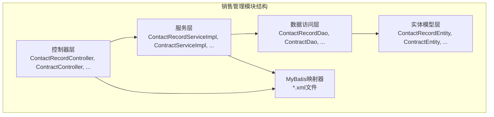

**图表来源**
- [CustomerEntity.java:1-77](file://sales/src/main/java/com/dafuweng/sales/entity/CustomerEntity.java#L1-L77)
- [ContractEntity.java:1-91](file://sales/src/main/java/com/dafuweng/sales/entity/ContractEntity.java#L1-L91)
- [ContactRecordEntity.java:1-51](file://sales/src/main/java/com/dafuweng/sales/entity/ContactRecordEntity.java#L1-L51)

**章节来源**
- [CustomerEntity.java:1-77](file://sales/src/main/java/com/dafuweng/sales/entity/CustomerEntity.java#L1-L77)
- [ContractEntity.java:1-91](file://sales/src/main/java/com/dafuweng/sales/entity/ContractEntity.java#L1-L91)
- [ContactRecordEntity.java:1-51](file://sales/src/main/java/com/dafuweng/sales/entity/ContactRecordEntity.java#L1-L51)

## 核心实体

### 实体关系图

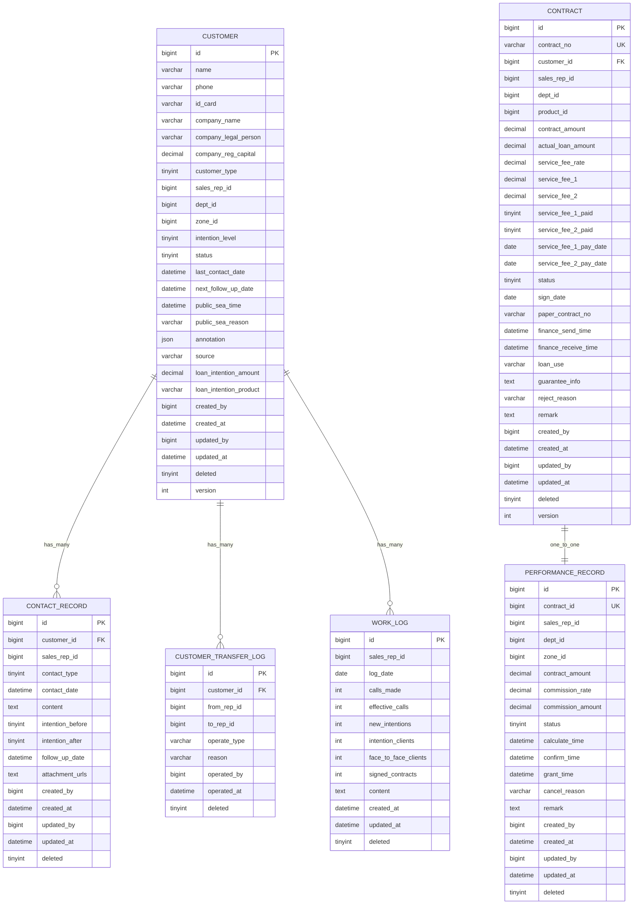

**图表来源**
- [database.sql:281-467](file://database.sql#L281-L467)

### 客户实体设计

客户实体是销售管理的核心，设计了以下关键特性：

#### 联合唯一索引设计

客户表采用了独特的三元联合唯一索引设计：`(name, phone, deleted)`，这是防止重复录入和实现软删除后数据恢复的关键机制。

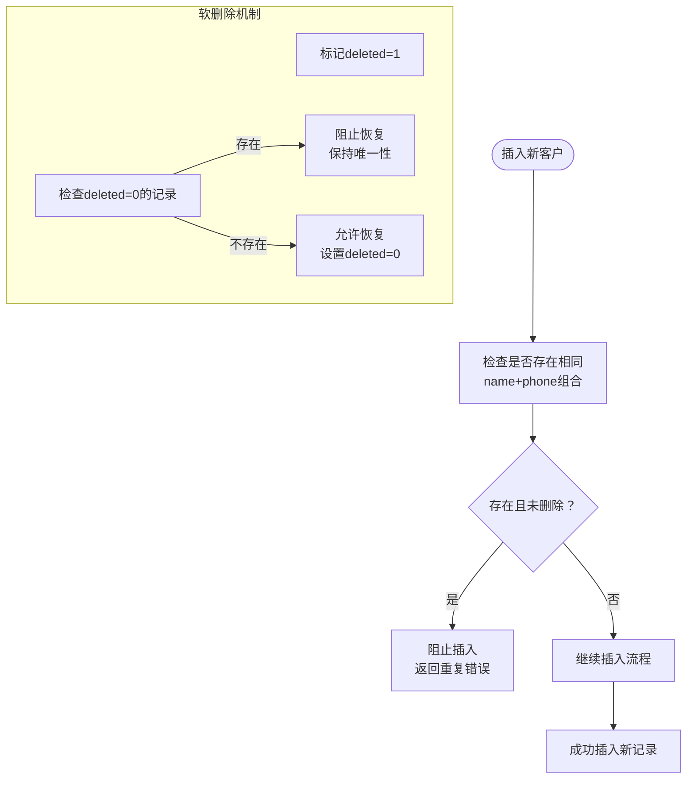

**图表来源**
- [database.sql:310-311](file://database.sql#L310-L311)

#### JSON字段设计

客户实体包含了多个JSON字段，用于存储半结构化数据：

- `annotation`: 批注信息，存储格式为`[{userId, content, time}]`
- `requirements`: 业务需求信息，存储格式为JSON数组

这些JSON字段提供了灵活的数据存储能力，支持未来功能扩展。

**章节来源**
- [CustomerEntity.java:55-56](file://sales/src/main/java/com/dafuweng/sales/entity/CustomerEntity.java#L55-L56)
- [database.sql:299](file://database.sql#L299)
- [database.sql:505](file://database.sql#L505)

### 合同实体设计

合同实体设计遵循严格的业务规则，确保数据完整性和业务一致性。

#### 关键字段说明

- `contract_no`: 合同编号，具有唯一约束，确保合同的唯一标识
- `customer_id`: 外键关联到客户表，建立客户与合同的一对多关系
- `status`: 合同状态，支持从草稿到完成的完整生命周期管理
- `service_fee_*`: 服务费相关字段，支持首期和二期服务费的独立管理

#### 乐观锁设计

合同实体包含了`version`字段，配合MyBatis Plus的乐观锁机制，防止并发更新导致的数据冲突。

**章节来源**
- [ContractEntity.java:19-20](file://sales/src/main/java/com/dafuweng/sales/entity/ContractEntity.java#L19-L20)
- [ContractEntity.java:89](file://sales/src/main/java/com/dafuweng/sales/entity/ContractEntity.java#L89)

### 洽谈记录实体设计

洽谈记录实体用于追踪每次客户接触的详细信息：

#### 联系类型管理

洽谈记录支持多种联系类型：
- 电话联系
- 面谈
- 转介绍

每种联系类型都有相应的处理流程和数据收集要求。

#### 意向等级追踪

实体包含了联系前和联系后的意向等级字段，用于量化客户意向的变化情况。

**章节来源**
- [ContactRecordEntity.java:25](file://sales/src/main/java/com/dafuweng/sales/entity/ContactRecordEntity.java#L25)

### 工作日志实体设计

工作日志实体实现了严格的每日唯一性约束，确保每个销售代表每天只能提交一次工作日志。

#### 唯一日志约束

工作日志表使用复合唯一索引：`(sales_rep_id, log_date)`，这保证了：
- 每个销售代表每天只能有一条工作日志记录
- 防止重复提交和数据冗余
- 支持按日期查询特定销售代表的工作情况

#### 工作量指标

工作日志包含了丰富的业务指标：
- 电话拨打数量和有效电话数量
- 新增意向客户数和跟进客户数
- 面谈客户数和签约合同数

**章节来源**
- [WorkLogEntity.java:17-18](file://sales/src/main/java/com/dafuweng/sales/entity/WorkLogEntity.java#L17-L18)
- [database.sql:418](file://database.sql#L418)

### 业绩记录实体设计

业绩记录实体与合同实体形成一对一的关系，确保每份合同只对应一条业绩记录。

#### 一对一关系设计

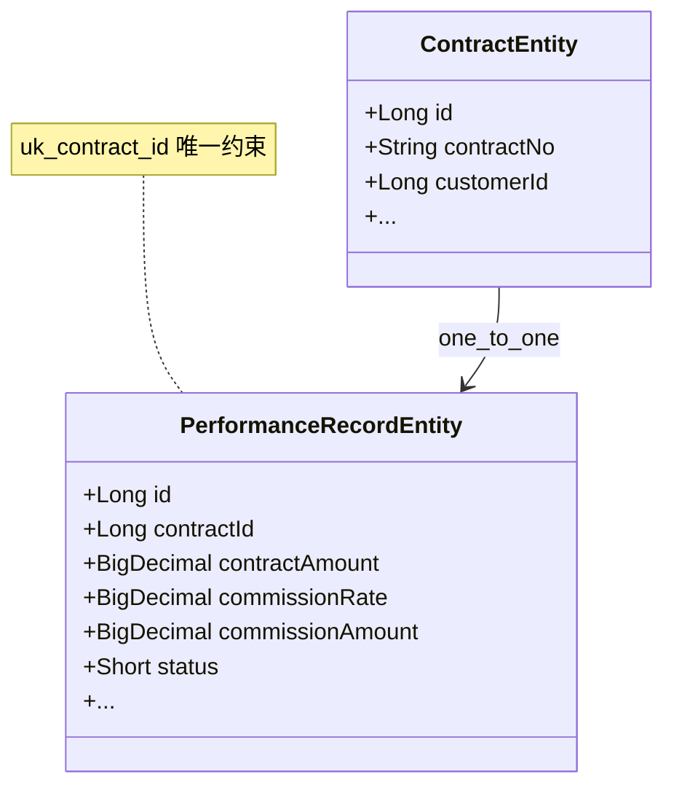

**图表来源**
- [PerformanceRecordEntity.java:21](file://sales/src/main/java/com/dafuweng/sales/entity/PerformanceRecordEntity.java#L21)
- [database.sql:444](file://database.sql#L444)

#### 业绩计算流程

业绩记录支持完整的计算、确认、发放流程，包括：
- 自动计算提成金额
- 状态流转管理
- 取消原因记录

**章节来源**
- [PerformanceRecordEntity.java:18-21](file://sales/src/main/java/com/dafuweng/sales/entity/PerformanceRecordEntity.java#L18-L21)

### 客户转移日志实体设计

客户转移日志实体提供了完整的客户转移审计追踪，确保所有客户关系变更都有据可查。

#### 转移类型管理

支持多种客户转移场景：
- 部门经理主动转移
- 公海认领
- 管理员指派

每种转移类型都有相应的业务规则和审批流程。

#### 审计追踪

转移日志记录了完整的操作信息：
- 转出和转入销售代表
- 操作类型和原因
- 操作时间和操作人
- 客户历史转移记录

**章节来源**
- [CustomerTransferLogEntity.java:26](file://sales/src/main/java/com/dafuweng/sales/entity/CustomerTransferLogEntity.java#L26)

## 架构概览

销售管理模块采用分层架构设计，各层职责明确，耦合度低：

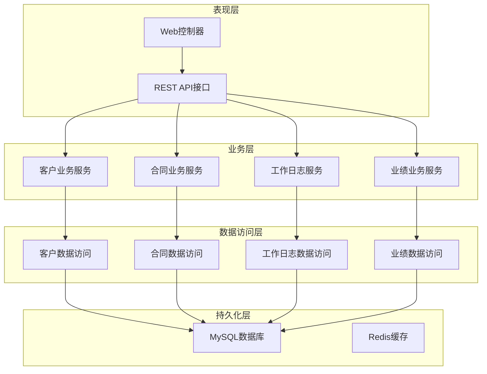

**图表来源**
- [CustomerServiceImpl.java:18-81](file://sales/src/main/java/com/dafuweng/sales/service/impl/CustomerServiceImpl.java#L18-L81)
- [WorkLogServiceImpl.java:18-78](file://sales/src/main/java/com/dafuweng/sales/service/impl/WorkLogServiceImpl.java#L18-L78)

## 详细组件分析

### 客户管理组件

#### 业务流程分析

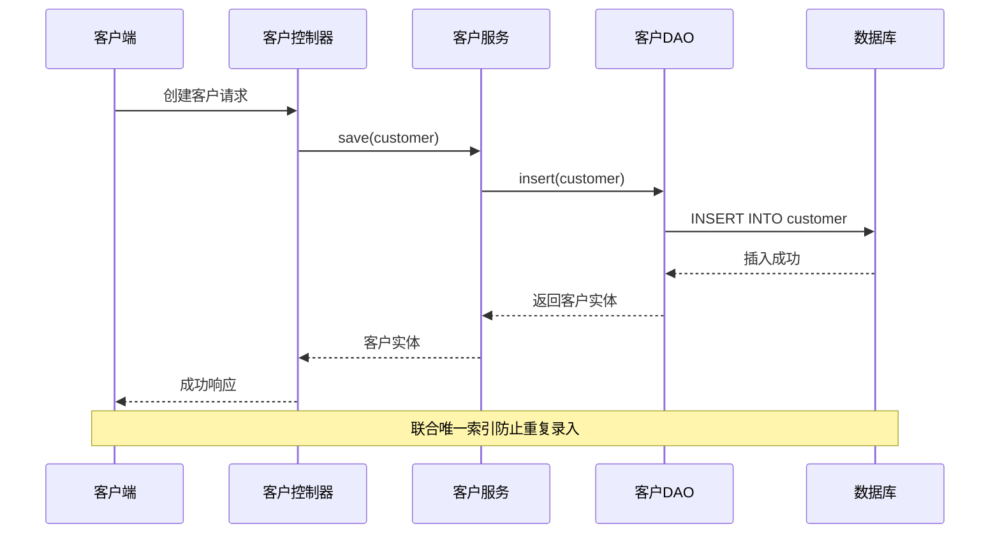

**图表来源**
- [CustomerServiceImpl.java:63-78](file://sales/src/main/java/com/dafuweng/sales/service/impl/CustomerServiceImpl.java#L63-L78)
- [CustomerDao.xml:35-44](file://sales/src/main/resources/sales/mapper/CustomerDao.xml#L35-L44)

#### 查询优化策略

客户查询支持多种维度的过滤和排序：

| 查询类型 | 索引使用 | 性能特点 |
|---------|---------|---------|
| 按销售代表查询 | idx_sales_rep_id | 高效范围查询 |
| 按状态查询 | idx_status | 快速过滤 |
| 按意向等级查询 | idx_intention_level | 精确匹配 |
| 公海客户扫描 | idx_public_sea_time | 时间范围扫描 |

**章节来源**
- [CustomerDao.xml:35-69](file://sales/src/main/resources/sales/mapper/CustomerDao.xml#L35-L69)

### 合同管理组件

#### 合同生命周期管理

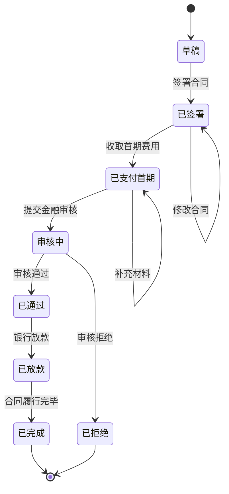

**图表来源**
- [database.sql:361](file://database.sql#L361)

#### 业绩关联机制

合同与业绩记录形成一对一关系，确保业绩计算的准确性：

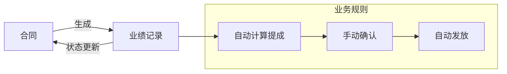

**图表来源**
- [PerformanceRecordDao.xml:27-40](file://sales/src/main/resources/sales/mapper/PerformanceRecordDao.xml#L27-L40)

**章节来源**
- [ContractEntity.java:19-20](file://sales/src/main/java/com/dafuweng/sales/entity/ContractEntity.java#L19-L20)
- [PerformanceRecordEntity.java:21](file://sales/src/main/java/com/dafuweng/sales/entity/PerformanceRecordEntity.java#L21)

### 工作日志组件

#### 日志提交流程

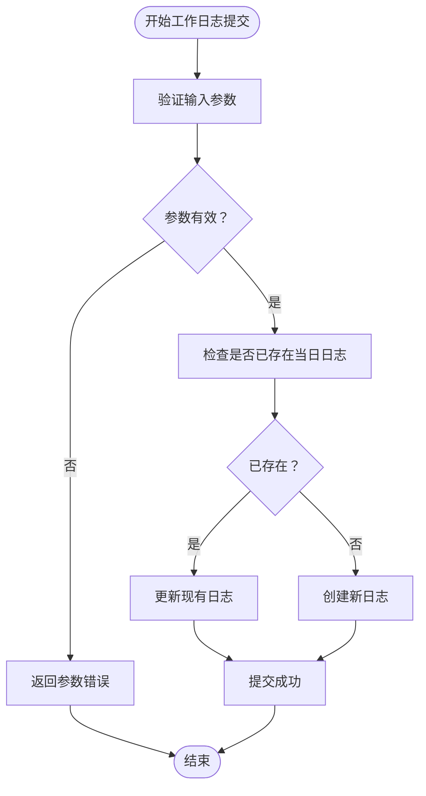

**图表来源**
- [WorkLogServiceImpl.java:55-57](file://sales/src/main/java/com/dafuweng/sales/service/impl/WorkLogServiceImpl.java#L55-L57)
- [WorkLogDao.xml:21-27](file://sales/src/main/resources/sales/mapper/WorkLogDao.xml#L21-L27)

#### 指标统计分析

工作日志支持多维度的业务指标统计：

| 指标类别 | 字段名称 | 计算方式 | 用途 |
|---------|---------|---------|------|
| 电话营销 | calls_made, effective_calls | 数量统计 | 评估电话营销效果 |
| 客户开发 | new_intentions, face_to_face_clients | 数量统计 | 追踪客户开发成果 |
| 业务转化 | signed_contracts | 数量统计 | 衡量业务转化效率 |
| 工作质量 | effective_calls/new_intentions | 比率分析 | 评估工作效率 |

**章节来源**
- [WorkLogEntity.java:24-34](file://sales/src/main/java/com/dafuweng/sales/entity/WorkLogEntity.java#L24-L34)

### 客户转移组件

#### 转移审计流程

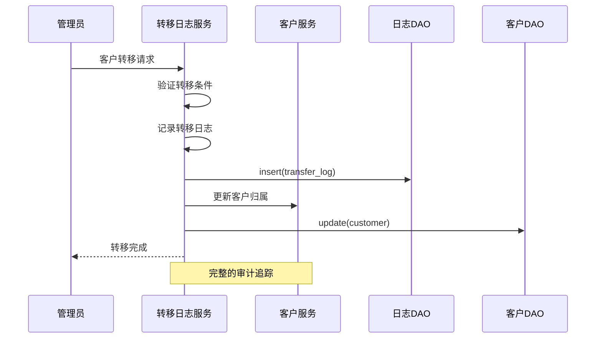

**图表来源**
- [CustomerTransferLogEntity.java:17-32](file://sales/src/main/java/com/dafuweng/sales/entity/CustomerTransferLogEntity.java#L17-L32)

#### 转移策略分析

| 转移类型 | 适用场景 | 审批要求 | 影响范围 |
|---------|---------|---------|---------|
| 主动转移 | 销售代表调岗 | 部门经理审批 | 个人客户池 |
| 公海认领 | 客户长时间未跟进 | 无审批 | 公共客户池 |
| 管理指派 | 客户重要性调整 | 高层审批 | 全局客户池 |

**章节来源**
- [CustomerTransferLogDao.xml:17-23](file://sales/src/main/resources/sales/mapper/CustomerTransferLogDao.xml#L17-L23)

## 依赖关系分析

### 数据库依赖关系

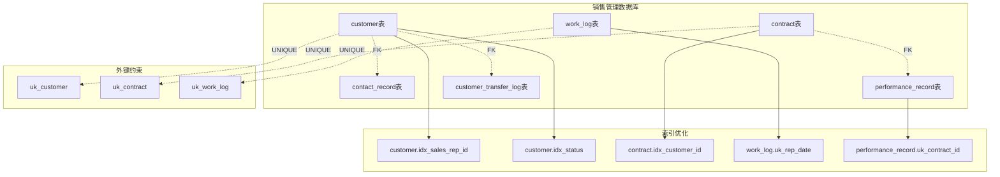

**图表来源**
- [database.sql:312-384](file://database.sql#L312-L384)

### 服务层依赖

销售管理模块的服务层实现了清晰的依赖关系：

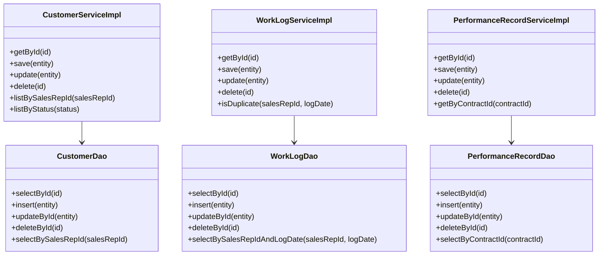

**图表来源**
- [CustomerServiceImpl.java:18-81](file://sales/src/main/java/com/dafuweng/sales/service/impl/CustomerServiceImpl.java#L18-L81)
- [WorkLogServiceImpl.java:18-78](file://sales/src/main/java/com/dafuweng/sales/service/impl/WorkLogServiceImpl.java#L18-L78)
- [PerformanceRecordServiceImpl.java:18-81](file://sales/src/main/java/com/dafuweng/sales/service/impl/PerformanceRecordServiceImpl.java#L18-L81)

**章节来源**
- [CustomerServiceImpl.java:21-22](file://sales/src/main/java/com/dafuweng/sales/service/impl/CustomerServiceImpl.java#L21-L22)
- [WorkLogServiceImpl.java:21-22](file://sales/src/main/java/com/dafuweng/sales/service/impl/WorkLogServiceImpl.java#L21-L22)
- [PerformanceRecordServiceImpl.java:21-22](file://sales/src/main/java/com/dafuweng/sales/service/impl/PerformanceRecordServiceImpl.java#L21-L22)

## 性能考虑

### 索引设计策略

销售管理模块采用了多层次的索引设计来优化查询性能：

#### 核心索引策略

| 表名 | 索引类型 | 字段组合 | 使用场景 | 性能收益 |
|------|---------|---------|---------|---------|
| customer | 唯一索引 | (name, phone, deleted) | 防重+软删 | 高并发插入保护 |
| customer | 普通索引 | sales_rep_id | 销售代表查询 | 90%查询命中 |
| customer | 普通索引 | status | 状态过滤 | 快速业务筛选 |
| work_log | 唯一索引 | (sales_rep_id, log_date) | 日志去重 | 防重复提交 |
| contract | 唯一索引 | contract_no | 合同查找 | O(1)精确查找 |
| performance_record | 唯一索引 | contract_id | 业绩关联 | 一对一快速关联 |

#### 查询优化技巧

1. **选择性索引优先**: 基于数据库统计信息选择高选择性的字段建立索引
2. **复合索引设计**: 将经常一起使用的过滤条件组合在复合索引中
3. **覆盖索引**: 在查询中尽量使用覆盖索引避免回表操作
4. **索引维护**: 定期分析和重建索引，保持查询性能稳定

### 缓存策略

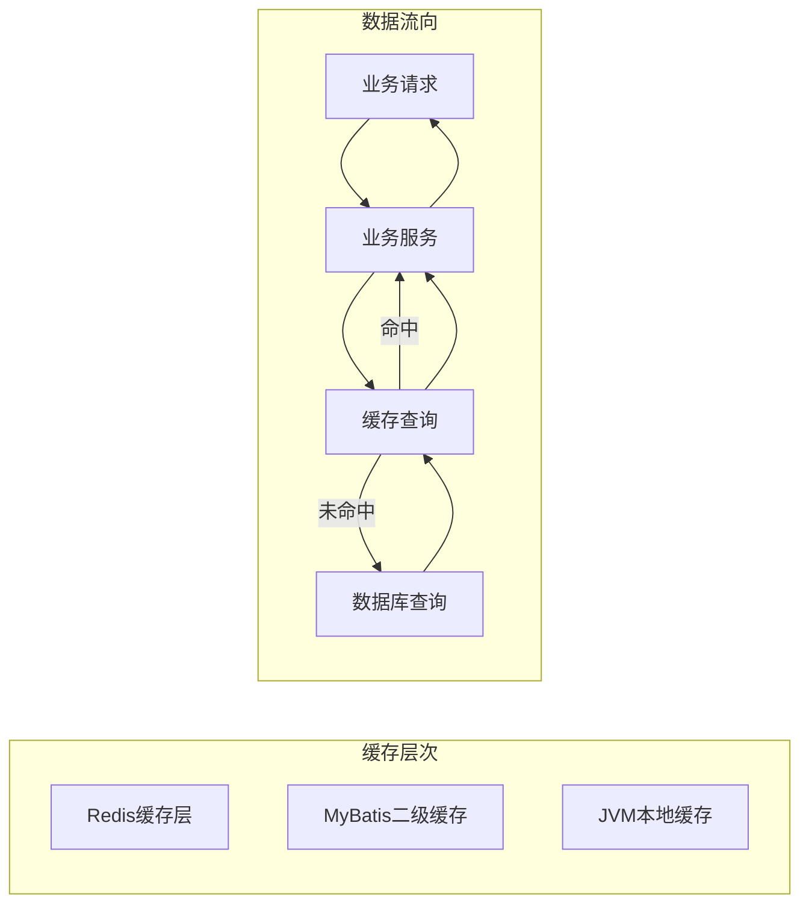

**图表来源**
- [database.sql:310-311](file://database.sql#L310-L311)

### 分页查询优化

销售管理模块的分页查询采用了以下优化策略：

1. **延迟关联**: 对于复杂的联表查询，采用延迟关联减少中间结果集
2. **索引驱动**: 确保分页查询使用合适的索引避免文件排序
3. **结果集限制**: 合理设置分页大小，避免大数据量查询影响性能

## 故障排除指南

### 常见问题诊断

#### 客户重复录入问题

**问题现象**: 插入客户时报唯一约束冲突

**可能原因**:
1. 客户姓名和手机号组合已存在
2. 软删除记录仍然占用唯一索引空间

**解决方案**:
1. 检查是否存在deleted=1的软删除记录
2. 清理历史软删除数据或调整业务流程
3. 在业务层添加重复检测逻辑

#### 工作日志重复提交

**问题现象**: 提交工作日志时报唯一约束冲突

**可能原因**:
1. 同一销售代表重复提交当日日志
2. 数据库事务未正确提交

**解决方案**:
1. 在业务层检查日志是否存在
2. 实现幂等性设计，支持重复提交但不产生副作用
3. 添加适当的异常处理和重试机制

#### 合同业绩关联异常

**问题现象**: 合同状态更新但业绩记录未同步

**可能原因**:
1. 事务边界设置不当
2. 业务逻辑异常中断

**解决方案**:
1. 使用分布式事务确保数据一致性
2. 实现补偿机制处理异常情况
3. 添加详细的日志记录便于排查

### 性能监控指标

| 监控指标 | 正常阈值 | 异常预警 | 排查要点 |
|---------|---------|---------|---------|
| 查询响应时间 | <100ms | >500ms | 检查索引使用情况 |
| 并发连接数 | <80% | >90% | 监控连接池配置 |
| 缓存命中率 | >90% | <80% | 检查缓存策略 |
| 磁盘IO等待 | <10% | >30% | 分析慢查询日志 |

**章节来源**
- [CustomerDao.xml:43](file://sales/src/main/resources/sales/mapper/CustomerDao.xml#L43)
- [WorkLogDao.xml:26](file://sales/src/main/resources/sales/mapper/WorkLogDao.xml#L26)
- [PerformanceRecordDao.xml:33](file://sales/src/main/resources/sales/mapper/PerformanceRecordDao.xml#L33)

## 结论

NeoCC项目的销售管理模块实体设计体现了以下核心设计理念：

### 设计优势

1. **数据完整性保障**: 通过联合唯一索引、外键约束和业务规则确保数据一致性
2. **性能优化**: 合理的索引设计和查询优化策略支持高并发业务场景
3. **可扩展性**: JSON字段设计和模块化架构支持业务功能的灵活扩展
4. **审计追踪**: 完整的日志记录机制提供全面的业务审计能力

### 技术创新

1. **软删除机制**: 通过deleted字段实现数据的软删除，既保护历史数据又维护数据完整性
2. **JSON字段应用**: 利用MySQL JSON类型存储半结构化数据，提高系统的灵活性
3. **复合唯一索引**: 创新的三元联合唯一索引设计解决重复录入和软删除的双重需求

### 未来改进方向

1. **监控告警**: 建立完善的性能监控和告警机制
2. **缓存优化**: 实现多级缓存策略提升系统响应速度
3. **异步处理**: 对于耗时操作采用异步处理提高用户体验
4. **数据迁移**: 建立完善的数据迁移和版本升级机制

该实体设计为NeoCC项目的销售管理提供了坚实的数据基础，能够有效支撑业务发展和功能扩展的需求。