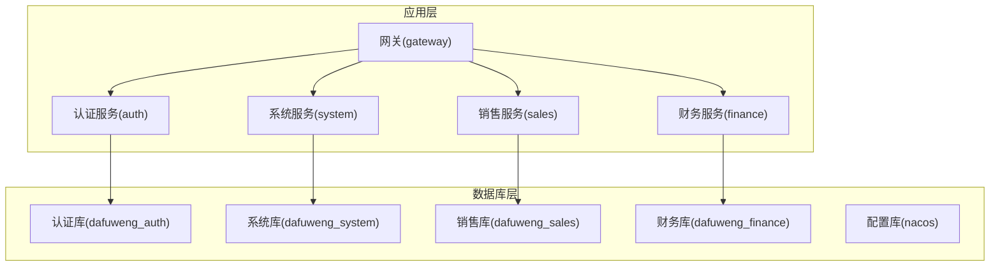
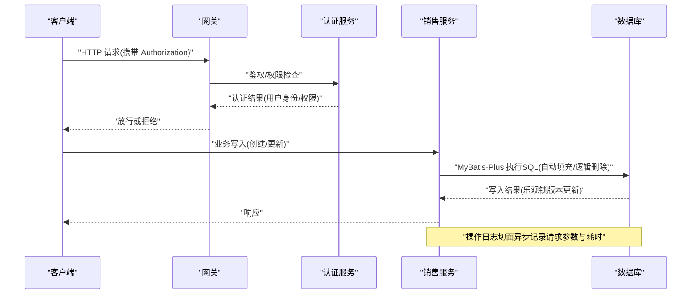
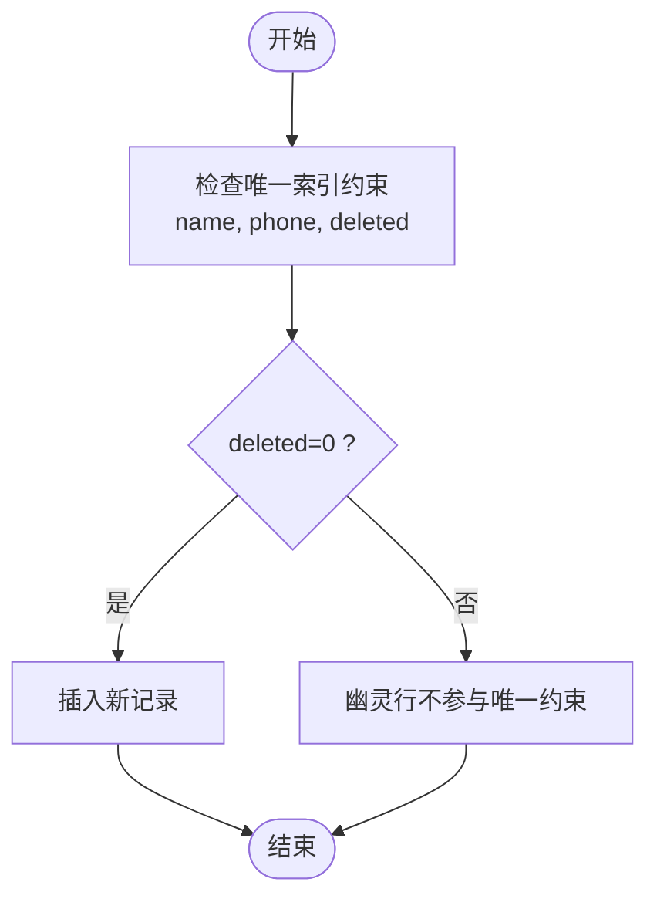
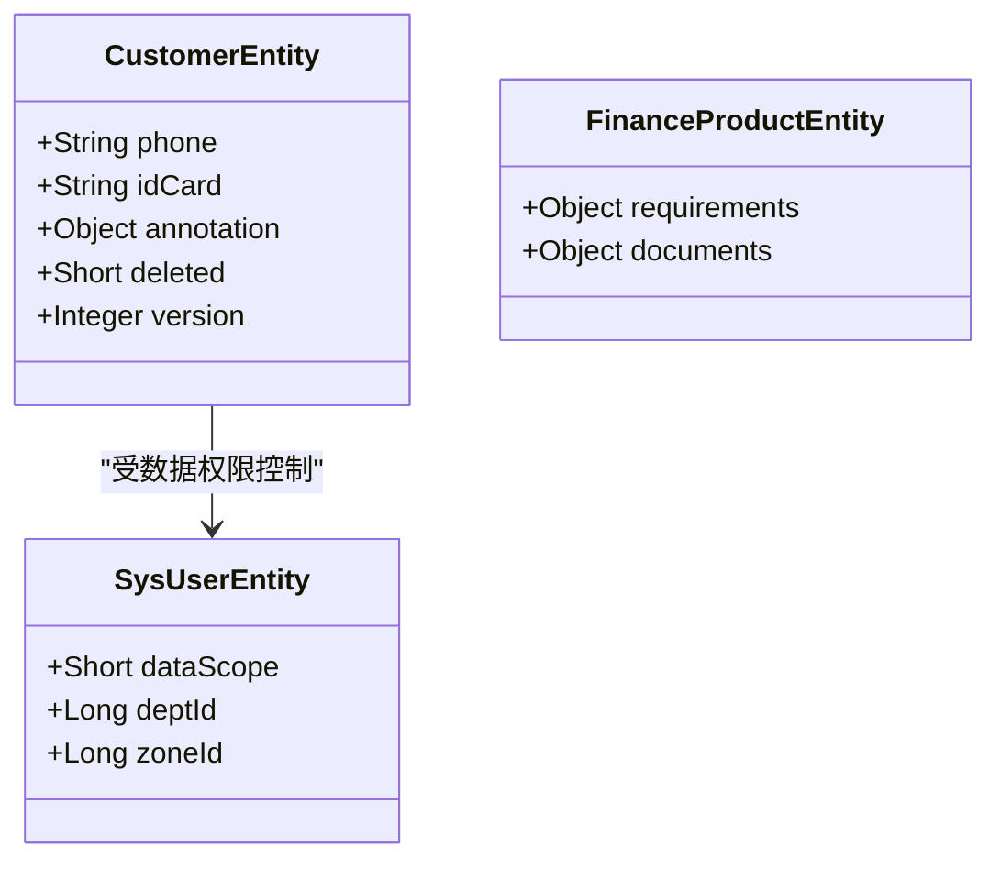
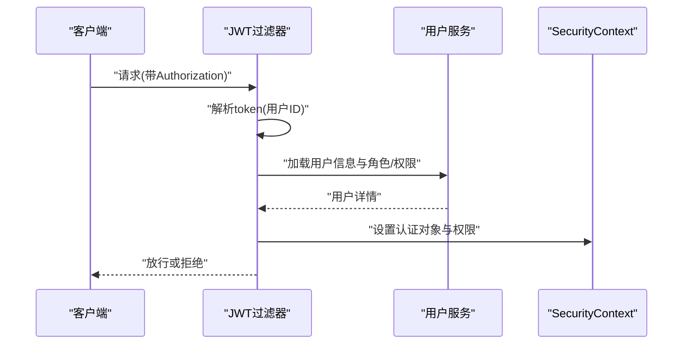
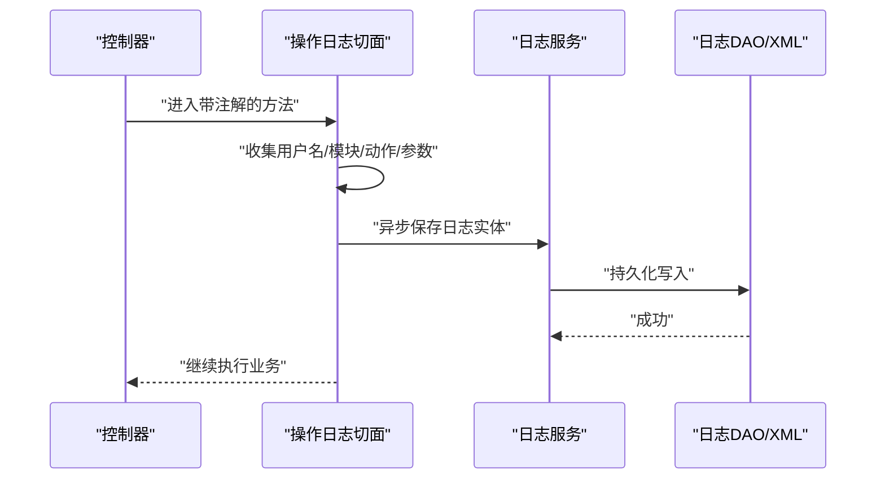
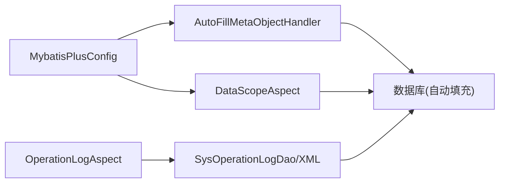

# 数据安全与隐私

<cite>
**本文引用的文件**
- [database.sql](file://database.sql)
- [dataDesign.md](file://dataDesign.md)
- [init-db.sql](file://scripts/init-db.sql)
- [application.yml](file://sales/src/main/resources/application.yml)
- [application-docker.yml](file://sales/src/main/resources/application-docker.yml)
- [MybatisPlusConfig.java](file://common/src/main/java/com/dafuweng/common/config/MybatisPlusConfig.java)
- [AutoFillMetaObjectHandler.java](file://common/src/main/java/com/dafuweng/common/config/AutoFillMetaObjectHandler.java)
- [DataScopeAspect.java](file://common/src/main/java/com/dafuweng/common/config/DataScopeAspect.java)
- [SecurityConfig.java](file://auth/src/main/java/com/dafuweng/auth/config/SecurityConfig.java)
- [JwtAuthenticationFilter.java](file://auth/src/main/java/com/dafuweng/auth/filter/JwtAuthenticationFilter.java)
- [PasswordEncoderConfig.java](file://auth/src/main/java/com/dafuweng/auth/config/PasswordEncoderConfig.java)
- [SysOperationLogEntity.java](file://system/src/main/java/com/dafuweng/system/entity/SysOperationLogEntity.java)
- [OperationLogAspect.java](file://system/src/main/java/com/dafuweng/system/config/OperationLogAspect.java)
- [SysOperationLogDao.java](file://system/src/main/java/com/dafuweng/system/dao/SysOperationLogDao.java)
- [SysOperationLogDao.xml](file://system/src/main/resources/system/mapper/SysOperationLogDao.xml)
- [CustomerEntity.java](file://sales/src/main/java/com/dafuweng/sales/entity/CustomerEntity.java)
- [CustomerDao.xml](file://sales/src/main/resources/sales/mapper/CustomerDao.xml)
- [implementDetails.md](file://implementDetails.md)
- [Plan04.md](file://scripts/plan-eng-review/Plan04.md)
- [Check03.md](file://scripts/qa/Check03.md)
</cite>

## 目录
1. [简介](#简介)
2. [项目结构](#项目结构)
3. [核心组件](#核心组件)
4. [架构总览](#架构总览)
5. [详细组件分析](#详细组件分析)
6. [依赖关系分析](#依赖关系分析)
7. [性能考量](#性能考量)
8. [故障排查指南](#故障排查指南)
9. [结论](#结论)
10. [附录](#附录)

## 简介
本文件面向NeoCC项目的数据库安全与隐私保护，围绕数据库层面的安全措施、敏感数据存储与处理、数据传输安全、连接池与审计日志、备份恢复与灾难恢复、以及合规与隐私最佳实践进行系统化说明。内容基于仓库中现有实现与设计文档，结合安全基线要求，提出可落地的改进与运维建议。

## 项目结构
NeoCC采用多模块微服务架构，数据库按业务域拆分为独立库：认证库(dafuweng_auth)、系统库(dafuweng_system)、销售库(dafuweng_sales)、财务库(dafuweng_finance)，并辅以Nacos配置库(nacos)。数据库初始化脚本与索引设计遵循逻辑删除、乐观锁、审计轨迹等安全设计模式。

图表来源
- [database.sql:1-200](file://database.sql#L1-L200)
- [init-db.sql:1-21](file://scripts/init-db.sql#L1-L21)

章节来源
- [database.sql:1-200](file://database.sql#L1-L200)
- [init-db.sql:1-21](file://scripts/init-db.sql#L1-L21)

## 核心组件
- 逻辑删除与唯一索引协同：通过deleted字段与唯一索引组合，实现“幽灵行”隔离，避免唯一约束冲突，保障数据一致性与可恢复性。
- 乐观锁：核心业务表均具备version字段，更新时采用“版本号+主键”的条件更新，防止并发覆盖。
- 审计轨迹：贷款审核记录表采用追加式日志设计，仅INSERT不UPDATE，满足金融审计合规。
- 敏感字段存储：用户密码采用BCrypt加密存储；客户隐私信息以JSON字段形式存储，便于统一治理与脱敏。
- 访问控制：基于JWT的无状态认证，结合Spring Security过滤链与方法级安全注解，实现细粒度权限控制。
- 操作审计：全局操作日志切面异步落库，记录请求方法、参数与耗时，支撑安全审计与追踪。

章节来源
- [dataDesign.md:359-449](file://dataDesign.md#L359-L449)
- [database.sql:22-48](file://database.sql#L22-L48)
- [database.sql:199-240](file://database.sql#L199-L240)
- [CustomerEntity.java:1-76](file://sales/src/main/java/com/dafuweng/sales/entity/CustomerEntity.java#L1-L76)
- [CustomerDao.xml:1-71](file://sales/src/main/resources/sales/mapper/CustomerDao.xml#L1-L71)
- [SecurityConfig.java:1-54](file://auth/src/main/java/com/dafuweng/auth/config/SecurityConfig.java#L1-L54)
- [JwtAuthenticationFilter.java:1-82](file://auth/src/main/java/com/dafuweng/auth/filter/JwtAuthenticationFilter.java#L1-L82)
- [OperationLogAspect.java:1-87](file://system/src/main/java/com/dafuweng/system/config/OperationLogAspect.java#L1-L87)

## 架构总览
下图展示数据库安全与隐私相关的关键交互：认证与授权、数据写入的自动填充与逻辑删除、操作审计与日志落库、以及敏感字段的存储与访问控制。

图表来源
- [SecurityConfig.java:34-51](file://auth/src/main/java/com/dafuweng/auth/config/SecurityConfig.java#L34-L51)
- [JwtAuthenticationFilter.java:28-80](file://auth/src/main/java/com/dafuweng/auth/filter/JwtAuthenticationFilter.java#L28-L80)
- [AutoFillMetaObjectHandler.java:23-45](file://common/src/main/java/com/dafuweng/common/config/AutoFillMetaObjectHandler.java#L23-L45)
- [OperationLogAspect.java:35-60](file://system/src/main/java/com/dafuweng/system/config/OperationLogAspect.java#L35-L60)

## 详细组件分析

### 逻辑删除机制
- 设计要点
  - deleted字段用于逻辑删除，配合唯一索引的三元组(name, phone, deleted)，在deleted=0时生效，避免唯一冲突。
  - MyBatis-Plus全局配置逻辑删除字段与值，DAO层无需显式WHERE deleted=0。
- 并发与一致性
  - 乐观锁version字段与逻辑删除协同，更新时需匹配version与deleted=0，防止并发覆盖与误删。
- 审计与恢复
  - 逻辑删除保留历史数据，便于审计与恢复；删除后仍可通过审计日志追踪变更轨迹。

图表来源
- [dataDesign.md:361-369](file://dataDesign.md#L361-L369)
- [database.sql:42-48](file://database.sql#L42-L48)

章节来源
- [dataDesign.md:359-409](file://dataDesign.md#L359-L409)
- [database.sql:42-48](file://database.sql#L42-L48)
- [application.yml:26-30](file://sales/src/main/resources/application.yml#L26-L30)
- [application-docker.yml:24-27](file://sales/src/main/resources/application-docker.yml#L24-L27)

### 数据脱敏策略
- 敏感字段识别
  - 客户隐私：手机号(phone)、身份证号(id_card)、联系人信息等。
  - 金融数据：贷款意向金额、产品条款、材料清单等。
- 存储与传输
  - 敏感字段在数据库中以明文存储，建议在应用层或网关层增加脱敏规则（如仅显示后四位、掩码处理）。
  - JSON字段(customer.annotation、finance_product.requirements/documents)集中存储，便于统一脱敏与版本管理。
- 访问控制
  - 基于角色的数据权限范围(data_scope)，限制用户可见范围，降低敏感数据泄露风险。

图表来源
- [CustomerEntity.java:1-76](file://sales/src/main/java/com/dafuweng/sales/entity/CustomerEntity.java#L1-L76)
- [CustomerDao.xml:5-24](file://sales/src/main/resources/sales/mapper/CustomerDao.xml#L5-L24)
- [dataDesign.md:384-396](file://dataDesign.md#L384-L396)

章节来源
- [CustomerEntity.java:1-76](file://sales/src/main/java/com/dafuweng/sales/entity/CustomerEntity.java#L1-L76)
- [CustomerDao.xml:1-71](file://sales/src/main/resources/sales/mapper/CustomerDao.xml#L1-L71)
- [dataDesign.md:384-396](file://dataDesign.md#L384-L396)
- [DataScopeAspect.java:40-68](file://common/src/main/java/com/dafuweng/common/config/DataScopeAspect.java#L40-L68)

### 访问控制与认证
- 无状态认证
  - JWT令牌在Authorization头中传递，过滤器解析token并加载用户角色与权限，设置SecurityContext。
  - 会话策略为STATELESS，降低会话劫持风险。
- 权限模型
  - 基于角色与权限码的细粒度控制，结合方法级安全注解与URL白名单。
- 密码加密
  - 数据库设计要求BCrypt存储；认证配置提供BCryptPasswordEncoder Bean，确保密码加密与校验符合安全基线。

图表来源
- [JwtAuthenticationFilter.java:28-80](file://auth/src/main/java/com/dafuweng/auth/filter/JwtAuthenticationFilter.java#L28-L80)
- [SecurityConfig.java:34-51](file://auth/src/main/java/com/dafuweng/auth/config/SecurityConfig.java#L34-L51)
- [PasswordEncoderConfig.java:1-14](file://auth/src/main/java/com/dafuweng/auth/config/PasswordEncoderConfig.java#L1-L14)

章节来源
- [SecurityConfig.java:1-54](file://auth/src/main/java/com/dafuweng/auth/config/SecurityConfig.java#L1-L54)
- [JwtAuthenticationFilter.java:1-82](file://auth/src/main/java/com/dafuweng/auth/filter/JwtAuthenticationFilter.java#L1-L82)
- [PasswordEncoderConfig.java:1-14](file://auth/src/main/java/com/dafuweng/auth/config/PasswordEncoderConfig.java#L1-L14)
- [database.sql:22-48](file://database.sql#L22-L48)

### 敏感数据存储与处理
- 用户密码
  - 数据库字段定义为BCrypt密文存储，长度可达约60字符；认证侧提供BCryptPasswordEncoder Bean。
- 客户隐私信息
  - 以JSON字段存储，便于统一治理与脱敏；MyBatis-Plus需配置Jackson TypeHandler以正确序列化/反序列化。
- 金融数据
  - 产品条款与材料清单以JSON存储，结合审计轨迹与版本控制，满足合规要求。

章节来源
- [database.sql:22-48](file://database.sql#L22-L48)
- [implementDetails.md:1882-1931](file://implementDetails.md#L1882-L1931)
- [dataDesign.md:384-396](file://dataDesign.md#L384-L396)

### 数据传输安全
- 传输协议
  - 建议在生产环境强制HTTPS/TLS，确保数据在传输过程中的机密性与完整性。
- 证书与中间件
  - 网关层统一部署TLS证书，后端服务间通信建议启用mTLS或基于Kubernetes的服务网格（如Istio）。
- 传输加密基线
  - TLS 1.2+，禁用弱密码套件；定期轮换证书与密钥。

（本节为通用安全建议，不直接对应具体源码）

### 连接池安全配置
- 连接参数
  - 建议在数据源配置中开启SSL连接、设置强密码、限制最大连接数与连接超时。
- 凭据管理
  - 使用密钥管理服务(KMS)或环境变量注入数据库凭据，避免硬编码。
- 连接池监控
  - 启用连接池健康检查与慢查询日志，及时发现异常连接行为。

章节来源
- [application.yml:7-11](file://sales/src/main/resources/application.yml#L7-L11)
- [application-docker.yml:7-11](file://sales/src/main/resources/application-docker.yml#L7-L11)

### 数据库审计日志
- 操作日志
  - 通过切面捕获请求方法、参数与耗时，异步写入sys_operation_log表，支持分页查询与索引优化。
- 审计轨迹
  - 贷款审核记录表采用追加式日志，仅INSERT不UPDATE，满足金融审计合规。
- 日志落库
  - 使用MyBatis-Plus全局配置与XML映射，确保日志表的逻辑删除与分页查询。

图表来源
- [OperationLogAspect.java:35-60](file://system/src/main/java/com/dafuweng/system/config/OperationLogAspect.java#L35-L60)
- [SysOperationLogDao.java:1845-1863](file://system/src/main/java/com/dafuweng/system/dao/SysOperationLogDao.java#L1845-L1863)
- [SysOperationLogDao.xml:1-200](file://system/src/main/resources/system/mapper/SysOperationLogDao.xml#L1-L200)

章节来源
- [OperationLogAspect.java:1-87](file://system/src/main/java/com/dafuweng/system/config/OperationLogAspect.java#L1-L87)
- [SysOperationLogEntity.java:1-200](file://system/src/main/java/com/dafuweng/system/entity/SysOperationLogEntity.java#L1-L200)
- [SysOperationLogDao.java:1845-1863](file://system/src/main/java/com/dafuweng/system/dao/SysOperationLogDao.java#L1845-L1863)
- [SysOperationLogDao.xml:1-200](file://system/src/main/resources/system/mapper/SysOperationLogDao.xml#L1-L200)
- [database.sql:199-240](file://database.sql#L199-L240)

### 数据备份恢复策略
- 备份类型
  - 全量备份：每周一次，保留最近4周。
  - 增量/日志备份：每日一次，保留最近7天。
- 存储与加密
  - 备份文件加密存储，访问控制最小化；异地容灾存储。
- 恢复流程
  - RTO/RPO目标明确；定期进行恢复演练，验证备份可用性与恢复时间。
- 灾难恢复
  - 多活或多副本架构；跨区域容灾；自动化切换与回切。

（本节为通用安全建议，不直接对应具体源码）

### 数据迁移安全
- 迁移前评估
  - 识别敏感字段与依赖关系；制定迁移计划与回滚策略。
- 迁移执行
  - 使用只读快照或在线DDL；分批迁移，实时同步增量数据。
- 校验与验证
  - 数据一致性校验、抽样验证与业务回归测试。

（本节为通用安全建议，不直接对应具体源码）

### 安全合规与隐私最佳实践
- 合规要求
  - 符合《网络安全法》《数据安全法》《个人信息保护法》及金融行业监管要求。
- 最佳实践
  - 最小权限原则、纵深防御、数据生命周期管理、隐私影响评估与数据主体权利保障。
- 仓库现状与改进建议
  - 密码加密：数据库设计要求BCrypt，认证配置提供BCryptPasswordEncoder Bean，建议尽快落地并迁移存量数据。
  - 操作审计：当前QA指出“无操作审计日志”，建议完善登录/敏感操作的日志记录。
  - 参数校验：建议在Controller层补充@Valid参数校验，减少无效与恶意输入。

章节来源
- [database.sql:22-48](file://database.sql#L22-L48)
- [PasswordEncoderConfig.java:1-14](file://auth/src/main/java/com/dafuweng/auth/config/PasswordEncoderConfig.java#L1-L14)
- [Check03.md:192-219](file://scripts/qa/Check03.md#L192-L219)
- [Plan04.md:262-305](file://scripts/plan-eng-review/Plan04.md#L262-L305)

## 依赖关系分析
- MyBatis-Plus全局配置
  - 自动填充拦截器与分页插件在common模块统一配置，所有业务模块自动生效。
- 数据权限与自动填充
  - DataScopeAspect与AutoFillMetaObjectHandler依赖Spring Security上下文，确保无用户上下文场景下的安全降级。
- 审计日志
  - OperationLogAspect异步落库，避免阻塞主业务流程；DAO与XML映射保证分页与逻辑删除。

图表来源
- [MybatisPlusConfig.java:14-28](file://common/src/main/java/com/dafuweng/common/config/MybatisPlusConfig.java#L14-L28)
- [AutoFillMetaObjectHandler.java:23-45](file://common/src/main/java/com/dafuweng/common/config/AutoFillMetaObjectHandler.java#L23-L45)
- [DataScopeAspect.java:40-68](file://common/src/main/java/com/dafuweng/common/config/DataScopeAspect.java#L40-L68)
- [OperationLogAspect.java:35-60](file://system/src/main/java/com/dafuweng/system/config/OperationLogAspect.java#L35-L60)

章节来源
- [MybatisPlusConfig.java:1-29](file://common/src/main/java/com/dafuweng/common/config/MybatisPlusConfig.java#L1-L29)
- [AutoFillMetaObjectHandler.java:1-87](file://common/src/main/java/com/dafuweng/common/config/AutoFillMetaObjectHandler.java#L1-L87)
- [DataScopeAspect.java:1-87](file://common/src/main/java/com/dafuweng/common/config/DataScopeAspect.java#L1-L87)
- [OperationLogAspect.java:1-87](file://system/src/main/java/com/dafuweng/system/config/OperationLogAspect.java#L1-L87)

## 性能考量
- 逻辑删除与索引
  - deleted字段配合唯一索引，避免重复插入；查询时需关注deleted过滤条件的索引选择性。
- 乐观锁
  - 更新失败重试与退避策略，避免热点数据争用；批量更新时尽量合并事务。
- 审计日志
  - 异步写入与数据库分表/分区策略，降低对主业务的影响。
- 连接池
  - 合理设置最大连接数、空闲超时与连接泄漏检测，避免资源耗尽。

（本节为通用性能建议，不直接对应具体源码）

## 故障排查指南
- 密码校验失败
  - 确认数据库密码为BCrypt格式；若为SHA-256需迁移至BCrypt；检查认证配置中的BCryptPasswordEncoder Bean。
- JSON字段序列化异常
  - 检查application.yml是否配置type-handlers-package；或在相关Entity字段上添加Jackson TypeHandler注解。
- 操作日志未记录
  - 确认方法上存在OperationLog注解；检查切面是否生效；DAO分页SQL与索引是否正确。
- 逻辑删除与乐观锁冲突
  - 检查deleted与version字段是否正确传递；并发更新时注意重试与异常处理。

章节来源
- [implementDetails.md:1882-1931](file://implementDetails.md#L1882-L1931)
- [SysOperationLogDao.java:1845-1863](file://system/src/main/java/com/dafuweng/system/dao/SysOperationLogDao.java#L1845-L1863)
- [SysOperationLogDao.xml:1-200](file://system/src/main/resources/system/mapper/SysOperationLogDao.xml#L1-L200)

## 结论
NeoCC在数据库层面已具备逻辑删除、乐观锁与审计轨迹等基础安全能力，并通过JWT与Spring Security实现访问控制。建议尽快落地BCrypt密码加密、完善操作审计日志、强化传输加密与连接池安全配置，并制定完善的备份恢复与灾难恢复策略，以满足金融与隐私保护的合规要求。

## 附录
- 数据库初始化与库结构
  - 初始化脚本创建认证、系统、销售、财务与配置库；各库包含用户、角色、权限、参数、操作日志、客户、合同、产品、审核等核心表。
- 索引与查询
  - 各模块关键字段建立唯一与普通索引，支撑高并发查询与审计需求。

章节来源
- [database.sql:1-200](file://database.sql#L1-L200)
- [database.sql:199-240](file://database.sql#L199-L240)
- [dataDesign.md:399-449](file://dataDesign.md#L399-L449)