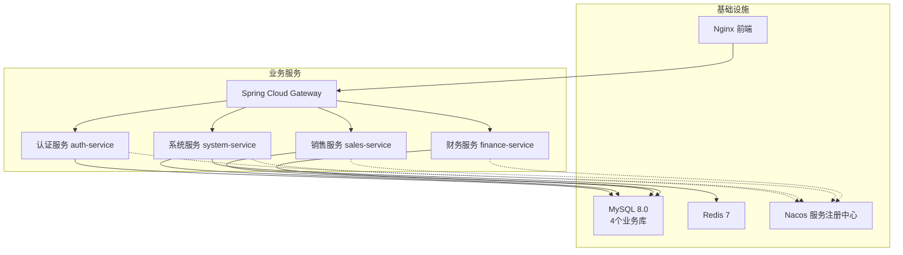
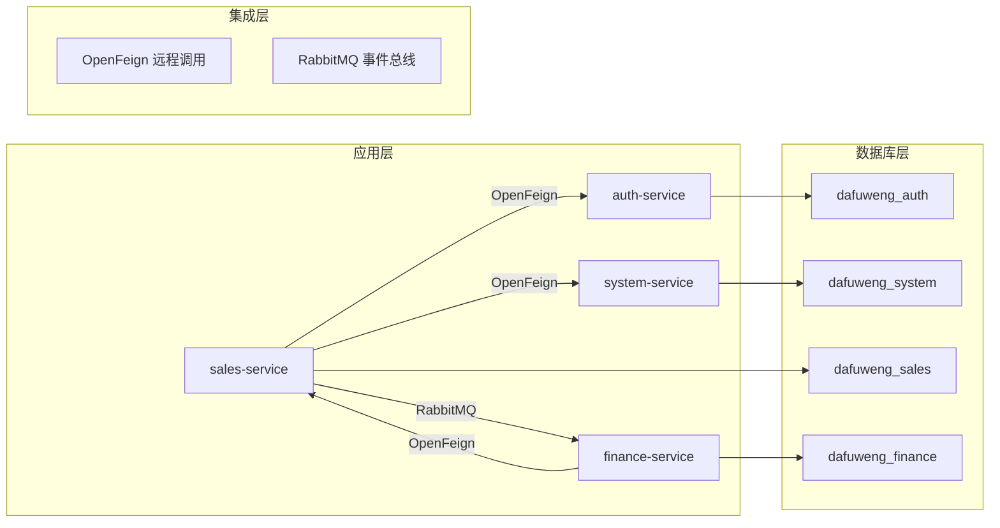
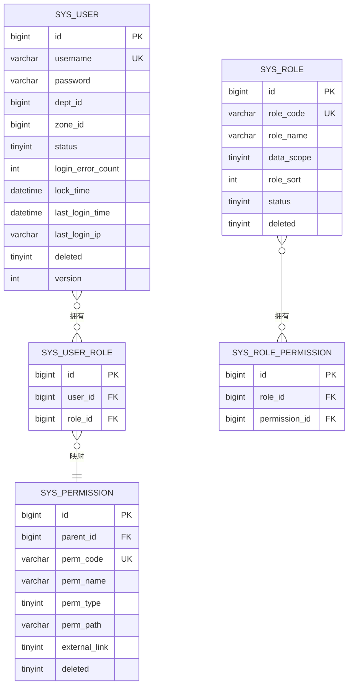
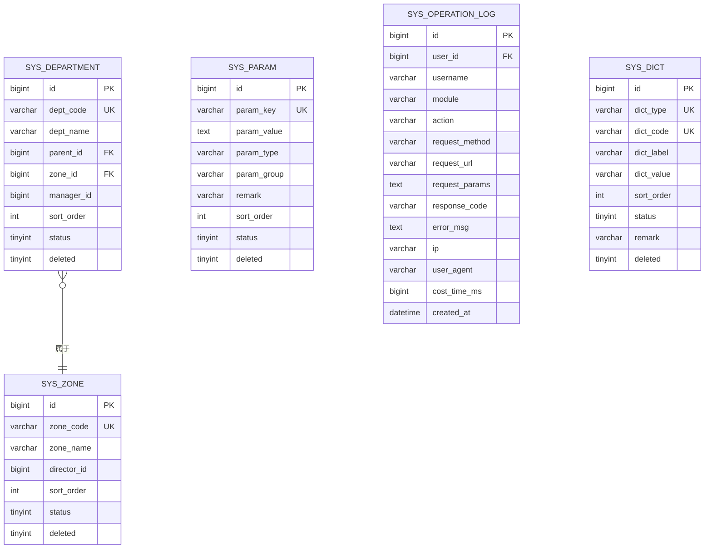
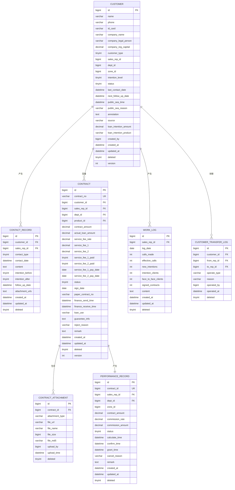
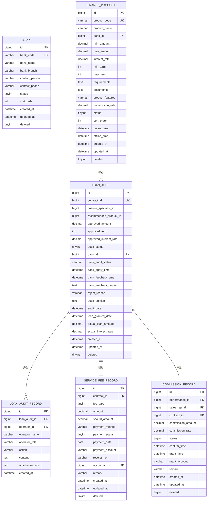
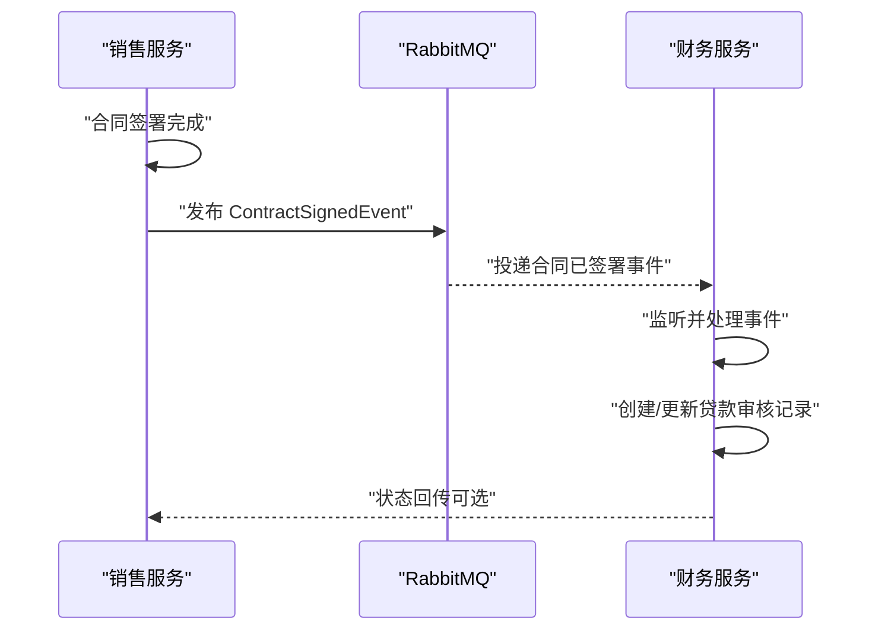
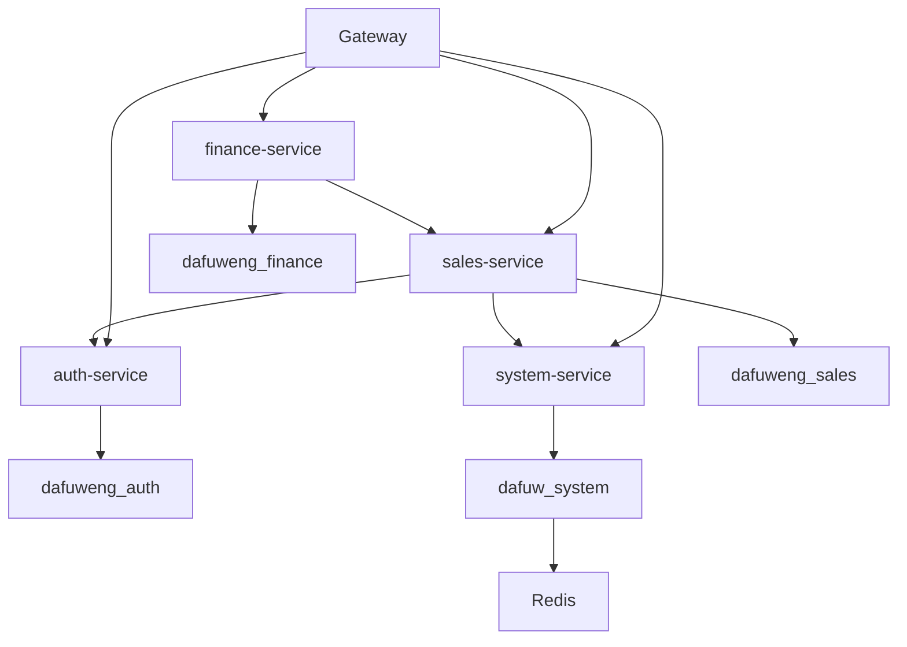

# 数据库架构设计

<cite>
**本文引用的文件**   
- [database.sql](file://database.sql)
- [dataDesign.md](file://dataDesign.md)
- [init-db.sql](file://scripts/init-db.sql)
- [docker-compose.yml](file://docker-compose.yml)
- [docker-compose-simple.yml](file://docker-compose-simple.yml)
- [application.yml（auth）](file://auth/src/main/resources/application.yml)
- [application.yml（system）](file://system/src/main/resources/application.yml)
- [application.yml（sales）](file://sales/src/main/resources/application.yml)
- [application.yml（finance）](file://finance/src/main/resources/application.yml)
- [MybatisPlusConfig.java](file://common/src/main/java/com/dafuweng/common/config/MybatisPlusConfig.java)
- [SysUserDao.java](file://auth/src/main/java/com/dafuweng/auth/dao/SysUserDao.java)
- [CustomerDao.java](file://sales/src/main/java/com/dafuweng/sales/dao/CustomerDao.java)
- [LoanAuditDao.java](file://finance/src/main/java/com/dafuweng/finance/dao/LoanAuditDao.java)
- [MqConfig.java](file://common/src/main/java/com/dafuweng/common/mq/MqConfig.java)
- [ContractVO.java](file://common/src/main/java/com/dafuweng/common/entity/vo/ContractVO.java)
</cite>

## 目录
1. [简介](#简介)
2. [项目结构](#项目结构)
3. [核心组件](#核心组件)
4. [架构总览](#架构总览)
5. [详细组件分析](#详细组件分析)
6. [依赖关系分析](#依赖关系分析)
7. [性能考虑](#性能考虑)
8. [故障排查指南](#故障排查指南)
9. [结论](#结论)
10. [附录](#附录)

## 简介
本文件面向NeoCC项目，系统性阐述“四库分离”的数据库架构设计与实现。项目将认证授权、系统管理、销售核心、金融核心分别置于独立的MySQL数据库中，通过应用层OpenFeign远程调用与消息中间件RabbitMQ事件驱动实现跨库协作，达成业务解耦、故障隔离与独立演进的目标。本文同时给出数据库拓扑、服务间数据流、索引与设计模式、以及性能优化建议。

## 项目结构
- 四个业务库按服务垂直拆分：
  - dafuweng_auth：认证授权
  - dafuweng_system：组织架构与系统参数
  - dafuweng_sales：客户、合同、业绩、工作日志
  - dafuweng_finance：银行、产品、贷款审核、服务费与提成
- 服务编排采用Docker Compose，包含MySQL、Redis、Nacos、各业务服务与网关、前端Nginx。

图表来源
- [docker-compose.yml:1-182](file://docker-compose.yml#L1-L182)
- [docker-compose-simple.yml:1-146](file://docker-compose-simple.yml#L1-L146)

章节来源
- [docker-compose.yml:1-182](file://docker-compose.yml#L1-L182)
- [docker-compose-simple.yml:1-146](file://docker-compose-simple.yml#L1-L146)

## 核心组件
- 四库职责边界清晰，避免跨库事务与复杂关联：
  - 认证库：用户、角色、权限、权限树，不承载业务数据
  - 系统库：战区、部门、系统参数、操作日志、数据字典
  - 销售库：客户、洽谈、合同、合同附件、工作日志、业绩、客户转移
  - 财务库：银行、产品、贷款审核、审核记录、服务费、提成
- 跨库查询策略：
  - OpenFeign：实时查询（如金融部查询合同详情）
  - RabbitMQ事件：异步通知（如合同签署通知金融部）
  - Nacos配置：字典/参数等共享数据的同步或定时刷新
- 连接池与ORM：MyBatis-Plus全局配置自动填充与分页；各服务独立数据源指向对应库。

章节来源
- [dataDesign.md:12-26](file://dataDesign.md#L12-L26)
- [dataDesign.md:325-356](file://dataDesign.md#L325-L356)
- [MybatisPlusConfig.java:1-29](file://common/src/main/java/com/dafuweng/common/config/MybatisPlusConfig.java#L1-L29)

## 架构总览
- 四库分离的数据库拓扑与服务间数据流如下：

图表来源
- [database.sql:11-14](file://database.sql#L11-L14)
- [dataDesign.md:325-356](file://dataDesign.md#L325-L356)

## 详细组件分析

### 认证库 dafuweng_auth
- 设计理念：仅承载认证授权数据，业务服务通过OpenFeign调用认证服务进行鉴权，不直接持有用户表。
- 关键表与关系：
  - sys_user、sys_role、sys_user_role、sys_permission、sys_role_permission
  - 用户-角色多对多、角色-权限多对多，权限树支持菜单/按钮/接口三级
- 数据权限：data_scope字段控制数据可见范围（本人/本部门/本战区/全部），结合拦截器动态拼接WHERE条件。
- 登录安全：用户表内置登录失败次数与锁定时间字段，应用层检查。

图表来源
- [database.sql:22-107](file://database.sql#L22-L107)

章节来源
- [dataDesign.md:49-100](file://dataDesign.md#L49-L100)
- [database.sql:22-107](file://database.sql#L22-L107)

### 系统库 dafuweng_system
- 设计理念：组织架构与系统参数，系统管理员操作此库，业务数据不在此处。
- 关键表与关系：
  - sys_zone（战区）、sys_department（部门，支持树形）、sys_param（系统参数）、sys_operation_log（操作审计）、sys_dict（数据字典）
- 设计要点：
  - 部门表采用邻接表模型（parent_id），支持两级（战区>部门）
  - sys_dict统一枚举，支持运行时热修改
  - sys_operation_log非业务表，通过AOP自动写入

图表来源
- [database.sql:132-236](file://database.sql#L132-L236)

章节来源
- [dataDesign.md:102-157](file://dataDesign.md#L102-L157)
- [database.sql:132-236](file://database.sql#L132-L236)

### 销售库 dafuweng_sales
- 设计理念：围绕“客户”主实体展开，确保从客户到合同到业绩的完整链路可追溯。
- 关键表与关系：
  - customer → contact_record、work_log、contract → performance_record、contract_attachment
  - customer_transfer_log 记录所有转移（部门迁移、公海领取、指派）
- 设计要点：
  - customer联合唯一索引（name, phone, deleted）防重复录入
  - contract_id作为performance_record唯一索引，保证业绩幂等
  - JSON字段annotation存储批注，减少JOIN
  - work_log按销售+日期唯一，防止重复提交

图表来源
- [database.sql:281-467](file://database.sql#L281-L467)

章节来源
- [dataDesign.md:160-239](file://dataDesign.md#L160-L239)
- [database.sql:281-467](file://database.sql#L281-L467)

### 财务库 dafuweng_finance
- 设计理念：以贷款审核为核心，构建“接收合同—初审—提交银行—银行反馈—放款”的完整流程，审核记录作为不可篡改的审计轨迹。
- 关键表与关系：
  - bank、finance_product（产品与银行一对多）
  - loan_audit（与sales库contract通过contract_id关联）
  - loan_audit_record（审核轨迹，append-only）
  - service_fee_record（服务费收取流水）、commission_record（提成发放）

图表来源
- [database.sql:476-618](file://database.sql#L476-L618)

章节来源
- [dataDesign.md:241-323](file://dataDesign.md#L241-L323)
- [database.sql:476-618](file://database.sql#L476-L618)

### 跨库查询与事件驱动流程
- OpenFeign远程调用：金融部在审核时实时查询销售侧合同详情（含金额、状态、附件等），通过Feign客户端调用sales-service暴露的接口。
- RabbitMQ事件驱动：销售侧合同签署完成后，发布“合同已签署”事件；财务侧订阅该事件，更新loan_audit状态并推进审核流程。
- 参数与字典同步：系统库的参数与字典通过消息或定时刷新在各服务侧缓存，避免硬编码。

图表来源
- [dataDesign.md:325-356](file://dataDesign.md#L325-L356)
- [MqConfig.java:14-48](file://common/src/main/java/com/dafuweng/common/mq/MqConfig.java#L14-L48)

章节来源
- [dataDesign.md:325-356](file://dataDesign.md#L325-L356)
- [MqConfig.java:14-48](file://common/src/main/java/com/dafuweng/common/mq/MqConfig.java#L14-L48)

### 数据模型与索引要点
- 通用字段：所有业务表统一包含 created_by/created_at/updated_by/updated_at/deleted/version，由MyBatis-Plus自动填充。
- 索引设计原则：
  - 主键索引为聚集索引
  - 外键字段建立普通索引
  - 唯一索引包含deleted字段，解决软删后的唯一约束冲突
  - 联合索引按查询最常用组合建立
  - 禁止SELECT *，查询需命中覆盖索引
- 索引清单（按库汇总）详见设计文档。

章节来源
- [dataDesign.md:27-46](file://dataDesign.md#L27-L46)
- [dataDesign.md:399-447](file://dataDesign.md#L399-L447)

## 依赖关系分析
- 服务与数据库的依赖：
  - 认证服务：仅访问 dafuweng_auth
  - 系统服务：仅访问 dafuweng_system，并依赖Redis缓存
  - 销售服务：仅访问 dafuweng_sales，并通过OpenFeign访问认证/系统服务
  - 财务服务：仅访问 dafuweng_finance，并通过OpenFeign访问销售服务
- 服务间依赖：
  - Gateway依赖四个业务服务
  - Nacos用于服务注册与发现（部分服务仍使用直连URL）
  - RabbitMQ作为跨服务事件总线

图表来源
- [docker-compose.yml:58-139](file://docker-compose.yml#L58-L139)
- [application.yml（sales）:7-11](file://sales/src/main/resources/application.yml#L7-L11)
- [application.yml（finance）:7-11](file://finance/src/main/resources/application.yml#L7-L11)

章节来源
- [docker-compose.yml:58-139](file://docker-compose.yml#L58-L139)
- [application.yml（sales）:7-11](file://sales/src/main/resources/application.yml#L7-L11)
- [application.yml（finance）:7-11](file://finance/src/main/resources/application.yml#L7-L11)

## 性能考虑
- 索引与查询优化
  - 严格遵循“禁止SELECT *、查询命中覆盖索引”的原则，避免回表与全表扫描
  - 对高频过滤字段（如status、dept_id、zone_id、sales_rep_id、log_date）建立合适索引
  - 唯一索引包含deleted字段，避免软删导致的重复插入
- 逻辑删除与乐观锁
  - deleted字段统一处理软删，version字段配合乐观锁，避免并发更新冲突
- 分页与自动填充
  - 使用MyBatis-Plus分页插件，避免大结果集全量返回
  - 通用字段自动填充，减少业务代码冗余
- 读写分离与连接池
  - 当前配置为单实例MySQL，未启用读写分离
  - 建议后续在独立库基础上引入主从复制与读写分离中间件，结合连接池参数（最大连接数、空闲连接、超时）提升吞吐
- 缓存策略
  - 系统库参数与字典通过Redis缓存，降低数据库压力
  - 前端与应用层可对热点数据做本地缓存（需注意一致性）

章节来源
- [dataDesign.md:27-46](file://dataDesign.md#L27-L46)
- [dataDesign.md:371-378](file://dataDesign.md#L371-L378)
- [MybatisPlusConfig.java:17-27](file://common/src/main/java/com/dafuweng/common/config/MybatisPlusConfig.java#L17-L27)
- [application.yml（system）:12-17](file://system/src/main/resources/application.yml#L12-L17)

## 故障排查指南
- 认证/鉴权问题
  - 确认认证库中用户、角色、权限数据完整，权限树与data_scope配置正确
  - 检查OpenFeign调用头中Authorization传递是否正确
- 跨库数据一致性
  - 合同状态流转依赖事件驱动，若财务侧未收到事件，检查RabbitMQ交换机与绑定配置
  - 核对事件路由键与队列名称一致
- 查询慢与锁冲突
  - 检查SQL是否命中索引，必要时补充联合索引
  - 乐观锁冲突时，提示VersionNotMatchException，需重试或提示用户
- 数据库初始化
  - 确认四库已创建且字符集一致
  - 初始化脚本执行顺序：先创建库，再按顺序执行各库DDL

章节来源
- [dataDesign.md:325-356](file://dataDesign.md#L325-L356)
- [MqConfig.java:14-48](file://common/src/main/java/com/dafuweng/common/mq/MqConfig.java#L14-L48)
- [database.sql:11-14](file://database.sql#L11-L14)
- [init-db.sql:4-17](file://scripts/init-db.sql#L4-L17)

## 结论
NeoCC通过“四库分离”实现了认证、系统、销售、财务的强边界与独立演进，辅以OpenFeign与RabbitMQ的跨库协作，满足业务解耦与故障隔离需求。设计文档提供了完善的ER图、索引清单与实现状态，结合当前的Docker Compose编排，可在开发与生产环境中稳定运行。后续可在现有基础上引入读写分离、缓存优化与更完善的监控体系，持续提升性能与可观测性。

## 附录
- 数据库初始化脚本与执行顺序
  - 脚本创建四库与nacos库，字符集utf8mb4
  - 执行顺序：先创建库，再依次导入各库DDL
- 服务配置要点
  - 各服务独立数据源指向对应库
  - MyBatis-Plus全局配置启用自动填充与分页
  - 系统服务配置Redis缓存

章节来源
- [init-db.sql:4-17](file://scripts/init-db.sql#L4-L17)
- [database.sql:11-14](file://database.sql#L11-L14)
- [application.yml（auth）:7-11](file://auth/src/main/resources/application.yml#L7-L11)
- [application.yml（system）:7-11](file://system/src/main/resources/application.yml#L7-L11)
- [application.yml（sales）:7-11](file://sales/src/main/resources/application.yml#L7-L11)
- [application.yml（finance）:7-11](file://finance/src/main/resources/application.yml#L7-L11)
- [MybatisPlusConfig.java:17-27](file://common/src/main/java/com/dafuweng/common/config/MybatisPlusConfig.java#L17-L27)