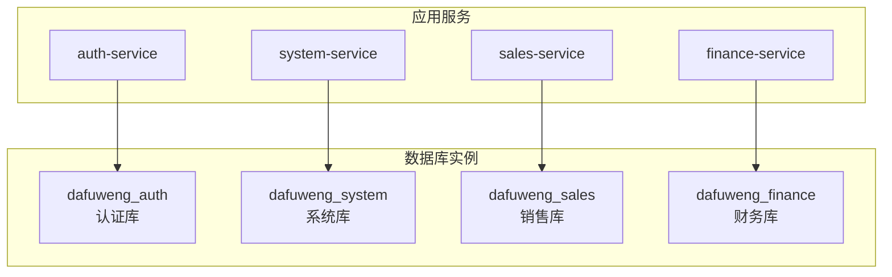
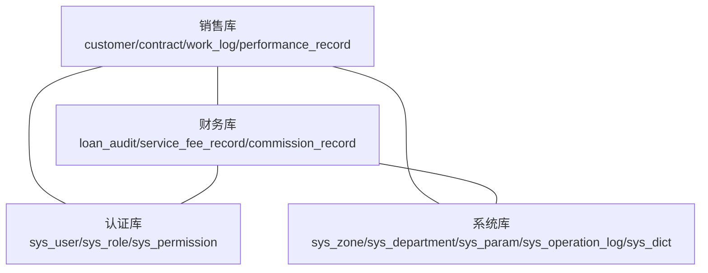
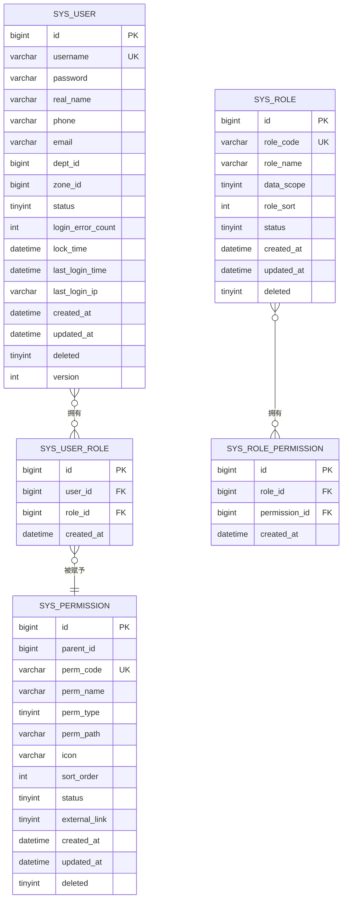
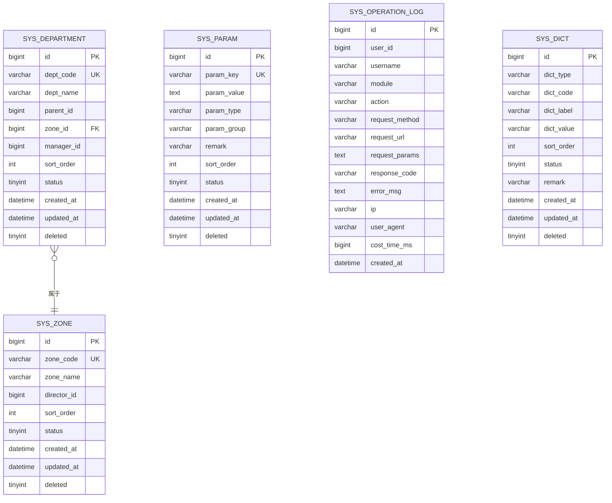
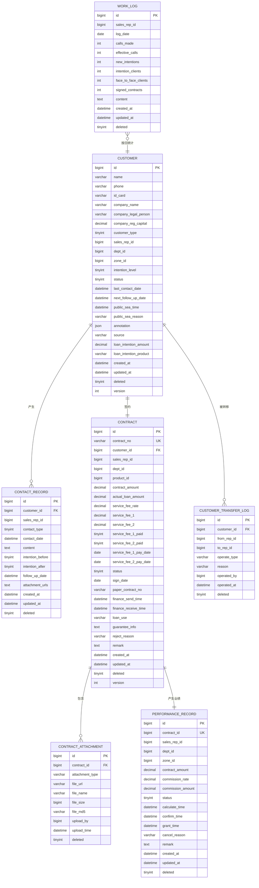
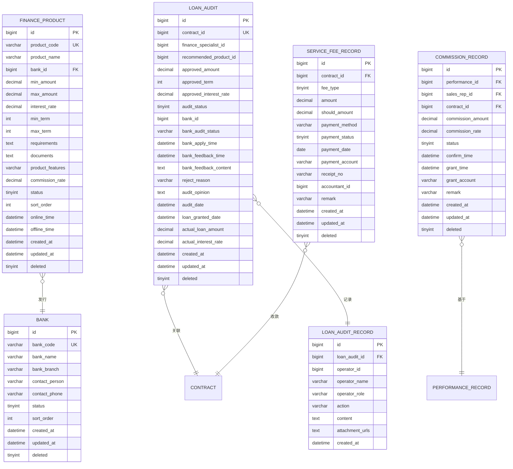
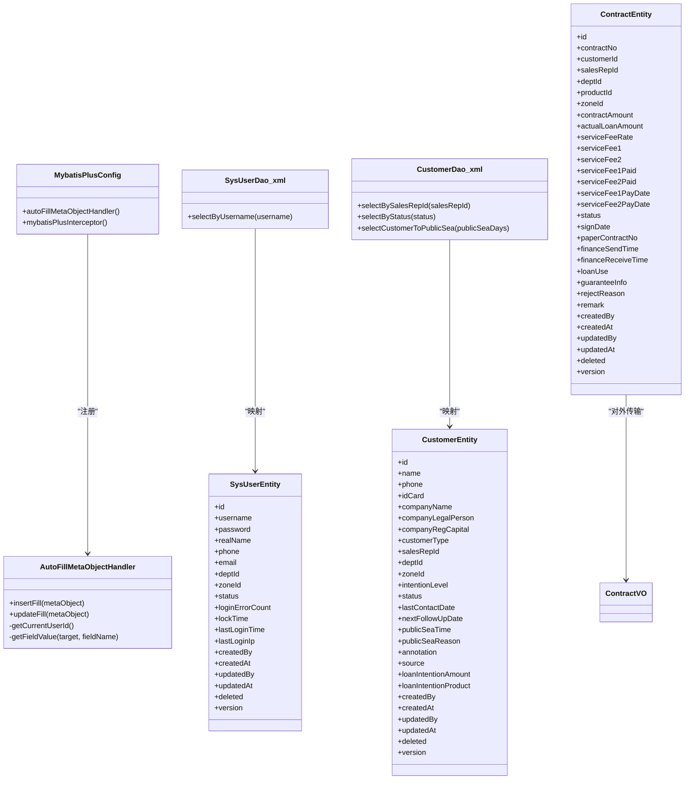
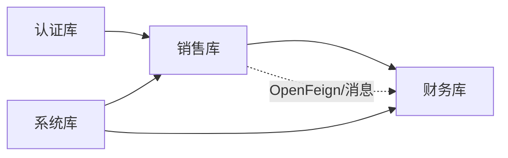

# 数据库设计

<cite>
**本文引用的文件**   
- [database.sql](file://database.sql)
- [dataDesign.md](file://dataDesign.md)
- [init-db.sql](file://scripts/init-db.sql)
- [MybatisPlusConfig.java](file://common/src/main/java/com/dafuweng/common/config/MybatisPlusConfig.java)
- [AutoFillMetaObjectHandler.java](file://common/src/main/java/com/dafuweng/common/config/AutoFillMetaObjectHandler.java)
- [SysUserDao.xml](file://auth/src/main/resources/auth/mapper/SysUserDao.xml)
- [CustomerDao.xml](file://sales/src/main/resources/sales/mapper/CustomerDao.xml)
- [SysUserEntity.java](file://auth/src/main/java/com/dafuweng/auth/entity/SysUserEntity.java)
- [CustomerEntity.java](file://sales/src/main/java/com/dafuweng/sales/entity/CustomerEntity.java)
- [ContractEntity.java](file://sales/src/main/java/com/dafuweng/sales/entity/ContractEntity.java)
- [SysDepartmentEntity.java](file://system/src/main/java/com/dafuweng/system/entity/SysDepartmentEntity.java)
- [ContractVO.java](file://common/src/main/java/com/dafuweng/common/entity/vo/ContractVO.java)
</cite>

## 目录
1. [简介](#简介)
2. [项目结构](#项目结构)
3. [核心组件](#核心组件)
4. [架构总览](#架构总览)
5. [详细组件分析](#详细组件分析)
6. [依赖分析](#依赖分析)
7. [性能考虑](#性能考虑)
8. [故障排查指南](#故障排查指南)
9. [结论](#结论)
10. [附录](#附录)

## 简介
本文件为NeoCC项目的数据库设计文档，系统性阐述四库分离的数据库架构、核心实体关系、索引设计策略、数据访问层实现、迁移与备份恢复策略、性能优化建议以及数据安全与隐私保护措施。项目采用“认证库(dafuweng_auth)、系统库(dafuweng_system)、销售库(dafuweng_sales)、财务库(dafuweng_finance)”的垂直拆分，跨库关联通过OpenFeign与消息事件实现，确保业务边界清晰、故障隔离良好。

## 项目结构
- 四个业务库独立部署，分别承载认证授权、系统管理、销售核心、金融核心业务。
- 初始化脚本提供统一的数据库创建与授权命令，便于快速部署。
- 通用MyBatis-Plus配置在common模块中集中注入，实现自动填充与分页插件的全局生效。

图表来源
- [database.sql:11-14](file://database.sql#L11-L14)
- [init-db.sql:7-17](file://scripts/init-db.sql#L7-L17)

章节来源
- [database.sql:11-14](file://database.sql#L11-L14)
- [init-db.sql:7-17](file://scripts/init-db.sql#L7-L17)

## 核心组件
- 认证库(dafuweng_auth)：用户、角色、权限、用户角色关联、角色权限关联。
- 系统库(dafuweng_system)：战区、部门、系统参数、操作日志、数据字典。
- 销售库(dafuweng_sales)：客户、洽谈记录、合同、合同附件、工作日志、业绩记录、客户转移记录。
- 财务库(dafuweng_finance)：银行、金融产品、贷款审核、审核记录、服务费记录、提成记录。

章节来源
- [database.sql:22-107](file://database.sql#L22-L107)
- [database.sql:132-236](file://database.sql#L132-L236)
- [database.sql:281-467](file://database.sql#L281-L467)
- [database.sql:476-618](file://database.sql#L476-L618)

## 架构总览
四库分离的架构以业务域为边界，避免跨库复杂查询，通过应用层OpenFeign与消息事件进行必要的跨库协作。认证库与系统库提供基础能力，销售库承载业务主链路，财务库承接金融流程闭环。

图表来源
- [database.sql:281-467](file://database.sql#L281-L467)
- [database.sql:476-618](file://database.sql#L476-L618)
- [database.sql:22-107](file://database.sql#L22-L107)
- [database.sql:132-236](file://database.sql#L132-L236)

## 详细组件分析

### 认证库(dafuweng_auth)：用户、角色、权限
- 用户表包含登录安全字段（连续登录失败次数、锁定时间、最后登录信息），支持按角色数据范围控制数据可见性。
- 角色与权限通过中间表建立多对多关系，配合数据范围字段实现细粒度权限控制。
- 建议在应用层通过Security拦截器与数据权限切面结合，实现动态WHERE过滤。

图表来源
- [database.sql:22-107](file://database.sql#L22-L107)

章节来源
- [database.sql:22-107](file://database.sql#L22-L107)
- [dataDesign.md:49-100](file://dataDesign.md#L49-L100)

### 系统库(dafuweng_system)：组织架构与系统参数
- 战区与部门采用邻接表模型，支持两级树形结构；系统参数用于运行时配置；操作日志用于审计；数据字典统一枚举值。
- 建议将字典值缓存在应用层，减少频繁查询。

图表来源
- [database.sql:132-236](file://database.sql#L132-L236)

章节来源
- [database.sql:132-236](file://database.sql#L132-L236)
- [dataDesign.md:102-158](file://dataDesign.md#L102-L158)

### 销售库(dafuweng_sales)：客户、合同、业绩与工作日志
- 客户表通过(name, phone, deleted)联合唯一索引防止重复录入；支持JSON批注字段；状态机驱动从潜在到公海的流转。
- 合同表与业绩记录表通过唯一索引保证幂等；工作日志按销售+日期唯一，避免重复提交。
- 审核记录作为不可篡改的审计轨迹，满足金融合规要求。

图表来源
- [database.sql:281-467](file://database.sql#L281-L467)

章节来源
- [database.sql:281-467](file://database.sql#L281-L467)
- [dataDesign.md:160-239](file://dataDesign.md#L160-L239)

### 财务库(dafuweng_finance)：银行、产品、审核与收费
- 银行与金融产品构成产品池；贷款审核贯穿初审、提交银行、银行反馈、终审；服务费与提成记录与合同强关联，保证财务数据一致性。
- 审核记录为追责提供不可篡改证据，符合金融合规要求。

图表来源
- [database.sql:476-618](file://database.sql#L476-L618)

章节来源
- [database.sql:476-618](file://database.sql#L476-L618)
- [dataDesign.md:241-323](file://dataDesign.md#L241-L323)

### 数据访问层实现（MyBatis-Plus）
- 全局配置：在common模块注册自动填充处理器与分页插件，所有使用MyBatis-Plus的模块自动生效。
- 自动填充：通过MetaObjectHandler在插入/更新时自动填充创建/更新时间与用户ID，无用户上下文时安全降级。
- DAO层：各模块DAO接口与XML映射文件分离，XML中定义ResultMap与常用查询；实体类使用注解映射表字段，JSON字段通过JacksonTypeHandler处理。

图表来源
- [MybatisPlusConfig.java:14-28](file://common/src/main/java/com/dafuweng/common/config/MybatisPlusConfig.java#L14-L28)
- [AutoFillMetaObjectHandler.java:23-86](file://common/src/main/java/com/dafuweng/common/config/AutoFillMetaObjectHandler.java#L23-L86)
- [SysUserDao.xml:4-36](file://auth/src/main/resources/auth/mapper/SysUserDao.xml#L4-L36)
- [CustomerDao.xml:3-71](file://sales/src/main/resources/sales/mapper/CustomerDao.xml#L3-L71)
- [SysUserEntity.java:14-58](file://auth/src/main/java/com/dafuweng/auth/entity/SysUserEntity.java#L14-L58)
- [CustomerEntity.java:16-76](file://sales/src/main/java/com/dafuweng/sales/entity/CustomerEntity.java#L16-L76)
- [ContractEntity.java:15-89](file://sales/src/main/java/com/dafuweng/sales/entity/ContractEntity.java#L15-L89)
- [ContractVO.java:9-70](file://common/src/main/java/com/dafuweng/common/entity/vo/ContractVO.java#L9-L70)

章节来源
- [MybatisPlusConfig.java:14-28](file://common/src/main/java/com/dafuweng/common/config/MybatisPlusConfig.java#L14-L28)
- [AutoFillMetaObjectHandler.java:23-86](file://common/src/main/java/com/dafuweng/common/config/AutoFillMetaObjectHandler.java#L23-L86)
- [SysUserDao.xml:4-36](file://auth/src/main/resources/auth/mapper/SysUserDao.xml#L4-L36)
- [CustomerDao.xml:3-71](file://sales/src/main/resources/sales/mapper/CustomerDao.xml#L3-L71)
- [SysUserEntity.java:14-58](file://auth/src/main/java/com/dafuweng/auth/entity/SysUserEntity.java#L14-L58)
- [CustomerEntity.java:16-76](file://sales/src/main/java/com/dafuweng/sales/entity/CustomerEntity.java#L16-L76)
- [ContractEntity.java:15-89](file://sales/src/main/java/com/dafuweng/sales/entity/ContractEntity.java#L15-L89)
- [ContractVO.java:9-70](file://common/src/main/java/com/dafuweng/common/entity/vo/ContractVO.java#L9-L70)

### 索引设计策略
- 主键索引：所有表主键自动构建聚集索引。
- 外键字段：必须建立普通索引，如customer.sales_rep_id、contract.customer_id等。
- 唯一索引：逻辑删除字段参与唯一索引，如customer(name, phone, deleted)，避免软删后重复录入。
- 联合索引：按查询最常用组合建立，如work_log(sales_rep_id, log_date)、performance_record(sales_rep_id, status)。
- 禁止SELECT *：所有查询需命中覆盖索引，避免回表与全表扫描。

章节来源
- [dataDesign.md:40-46](file://dataDesign.md#L40-L46)
- [dataDesign.md:399-447](file://dataDesign.md#L399-L447)
- [database.sql:311](file://database.sql#L311)
- [database.sql:418](file://database.sql#L418)
- [database.sql:444](file://database.sql#L444)

### 数据迁移方案
- 采用版本化的初始化脚本，按库创建顺序执行：认证库 → 系统库 → 销售库 → 财务库。
- 新增表或字段时，遵循“只增不改”原则，通过迁移脚本添加新列并补全默认值，避免破坏现有数据。
- 跨库数据迁移通过应用层OpenFeign或消息事件异步完成，确保事务一致性与最终一致。

章节来源
- [database.sql:5-6](file://database.sql#L5-L6)
- [database.sql:11-14](file://database.sql#L11-L14)

### 备份恢复策略
- 建议采用增量+全量备份策略，保留至少7天的在线备份与7天的离线备份。
- 对关键表（如合同、审核记录、服务费记录）进行重点保护，设置备份窗口与校验机制。
- 恢复演练定期进行，确保RTO/RPO指标达标。

### 性能优化建议
- 查询优化：严格命中覆盖索引，避免SELECT *；对高频过滤字段建立合适索引。
- 写入优化：批量插入与更新，合理使用乐观锁(version)避免并发冲突。
- 分页优化：使用MyBatis-Plus分页插件，避免大偏移量分页。
- 缓存策略：热点数据（如系统参数、数据字典）放入Redis，降低数据库压力。

### 数据安全与隐私保护
- 登录安全：用户表内置登录失败计数与锁定时间，应用层在登录时检查并更新。
- 逻辑删除：统一使用deleted字段进行软删除，避免物理删除造成数据不可追溯。
- 乐观锁：version字段用于并发更新冲突检测，防止数据覆盖。
- 审计日志：操作日志表记录关键写操作，保留足够时间以便审计。
- 数据脱敏：敏感字段（如身份证号、银行卡号）在展示层进行脱敏处理。

章节来源
- [dataDesign.md:94-99](file://dataDesign.md#L94-L99)
- [dataDesign.md:361-379](file://dataDesign.md#L361-L379)
- [dataDesign.md:380-383](file://dataDesign.md#L380-L383)
- [database.sql:199-218](file://database.sql#L199-L218)

## 依赖分析
- 认证库与系统库为基础设施，销售库与财务库依赖其提供的用户与组织信息。
- 销售库与财务库之间通过合同ID建立弱耦合关联，跨库查询通过OpenFeign或消息事件实现。
- 实体类与XML映射文件一一对应，DAO接口与映射文件通过命名空间绑定，形成清晰的分层结构。

图表来源
- [dataDesign.md:325-356](file://dataDesign.md#L325-L356)

章节来源
- [dataDesign.md:325-356](file://dataDesign.md#L325-L356)

## 性能考虑
- 索引命中率：确保WHERE/HAVING/ORDER BY/JOIN字段均有合适索引。
- SQL执行计划：定期审查慢查询日志，优化覆盖索引与谓词下推。
- 并发控制：合理使用乐观锁与业务锁，避免热点行争用。
- 读写分离：在高并发场景下考虑读库扩展与缓存策略。

## 故障排查指南
- 登录失败锁定：检查用户表login_error_count与lock_time字段，确认是否达到阈值。
- 数据权限异常：核查角色数据范围与当前用户上下文，确认WHERE条件是否正确拼接。
- 审核轨迹缺失：检查loan_audit_record是否按流程插入，是否存在误更新。
- JSON字段解析：确认实体类中的typeHandler配置正确，避免反序列化异常。

章节来源
- [dataDesign.md:94-99](file://dataDesign.md#L94-L99)
- [dataDesign.md:380-383](file://dataDesign.md#L380-L383)
- [CustomerEntity.java:55](file://sales/src/main/java/com/dafuweng/sales/entity/CustomerEntity.java#L55)
- [CustomerDao.xml:23](file://sales/src/main/resources/sales/mapper/CustomerDao.xml#L23)

## 结论
NeoCC项目采用四库分离的数据库架构，清晰划分认证、系统、销售、财务四大业务域，辅以完善的索引策略、自动填充与乐观锁机制，确保数据一致性与可维护性。通过OpenFeign与消息事件实现跨库协作，满足金融业务的合规与审计要求。建议持续完善服务发现、菜单动态化与监控体系，进一步提升整体稳定性与可观测性。

## 附录
- 命名规范与字段约定：表名与字段名采用小写下划线，时间字段以_at结尾，布尔字段以_paid等语义化前缀命名，索引命名遵循idx_与uk_前缀。
- 实现状态：数据库表已全部实现并部署，前后端对接进度良好，后续优化方向明确。

章节来源
- [dataDesign.md:450-462](file://dataDesign.md#L450-L462)
- [dataDesign.md:465-487](file://dataDesign.md#L465-L487)
- [dataDesign.md:509-516](file://dataDesign.md#L509-L516)