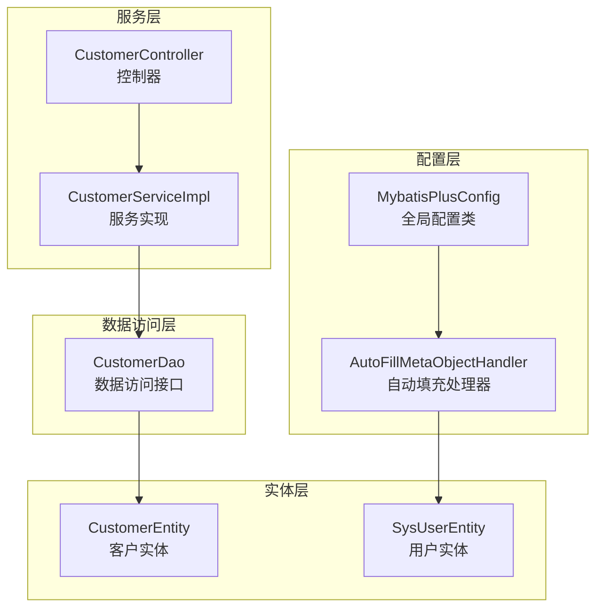
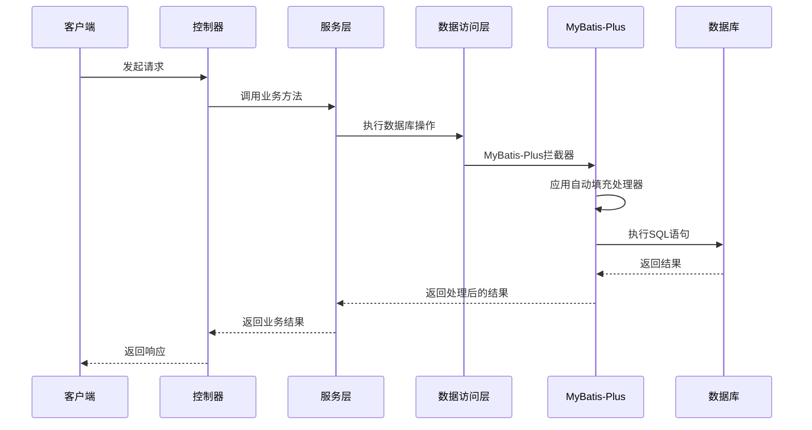
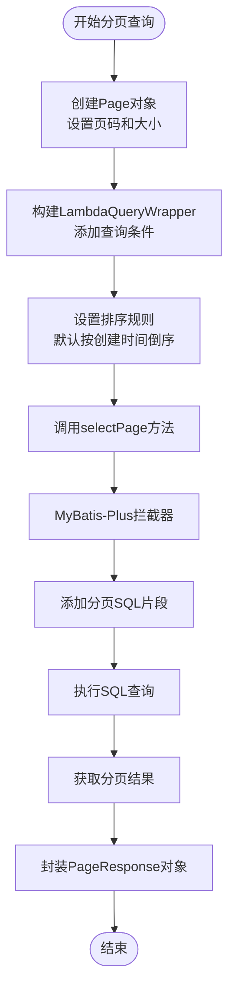
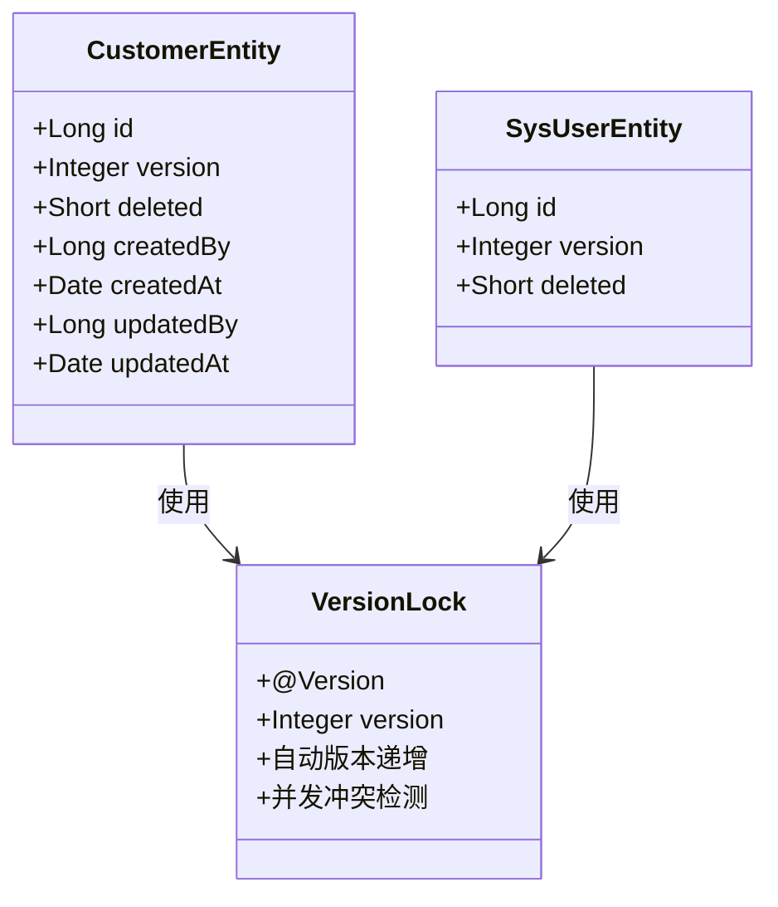
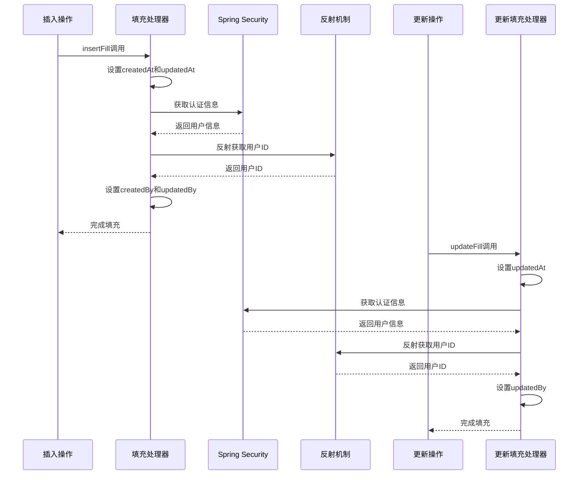
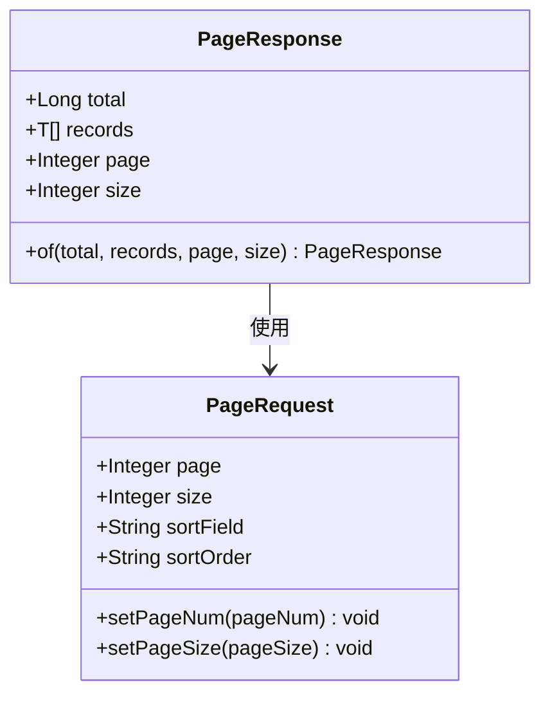
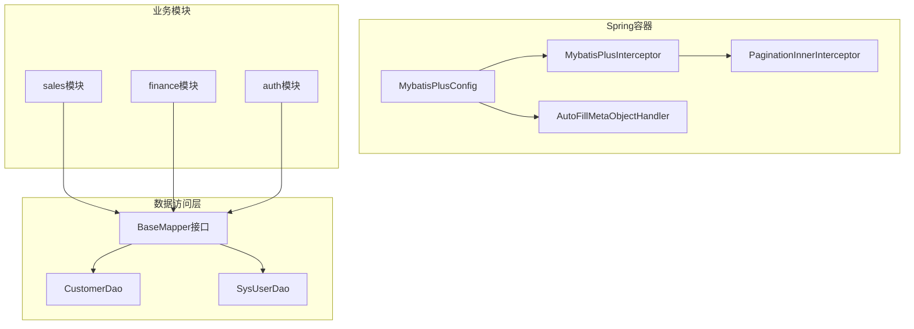

# MyBatis-Plus配置

<cite>
**本文档引用的文件**
- [MybatisPlusConfig.java](file://common/src/main/java/com/dafuweng/common/config/MybatisPlusConfig.java)
- [AutoFillMetaObjectHandler.java](file://common/src/main/java/com/dafuweng/common/config/AutoFillMetaObjectHandler.java)
- [PageRequest.java](file://common/src/main/java/com/dafuweng/common/entity/PageRequest.java)
- [PageResponse.java](file://common/src/main/java/com/dafuweng/common/entity/PageResponse.java)
- [CustomerController.java](file://sales/src/main/java/com/dafuweng/sales/controller/CustomerController.java)
- [CustomerServiceImpl.java](file://sales/src/main/java/com/dafuweng/sales/service/impl/CustomerServiceImpl.java)
- [CustomerDao.java](file://sales/src/main/java/com/dafuweng/sales/dao/CustomerDao.java)
- [CustomerEntity.java](file://sales/src/main/java/com/dafuweng/sales/entity/CustomerEntity.java)
- [SysUserEntity.java](file://auth/src/main/java/com/dafuweng/auth/entity/SysUserEntity.java)
</cite>

## 目录
1. [简介](#简介)
2. [项目结构](#项目结构)
3. [核心组件](#核心组件)
4. [架构概览](#架构概览)
5. [详细组件分析](#详细组件分析)
6. [依赖关系分析](#依赖关系分析)
7. [性能考虑](#性能考虑)
8. [故障排除指南](#故障排除指南)
9. [结论](#结论)

## 简介

NeoCC项目采用MyBatis-Plus作为持久层框架，通过全局配置类实现了统一的数据库访问层配置。本文档详细解析了MyBatis-Plus全局配置类的设计与实现，包括分页插件配置、乐观锁配置和自动填充处理器注册机制。

项目采用模块化架构，其中common模块提供共享配置，各个业务模块（sales、finance、auth等）通过继承common模块获得统一的MyBatis-Plus配置。这种设计确保了所有模块在数据库操作方面的一致性和可维护性。

## 项目结构

NeoCC项目的MyBatis-Plus配置主要分布在以下位置：

**图表来源**
- [MybatisPlusConfig.java:1-28](file://common/src/main/java/com/dafuweng/common/config/MybatisPlusConfig.java#L1-L28)
- [AutoFillMetaObjectHandler.java:1-87](file://common/src/main/java/com/dafuweng/common/config/AutoFillMetaObjectHandler.java#L1-L87)
- [CustomerServiceImpl.java:1-81](file://sales/src/main/java/com/dafuweng/sales/service/impl/CustomerServiceImpl.java#L1-L81)

**章节来源**
- [MybatisPlusConfig.java:1-28](file://common/src/main/java/com/dafuweng/common/config/MybatisPlusConfig.java#L1-L28)
- [AutoFillMetaObjectHandler.java:1-87](file://common/src/main/java/com/dafuweng/common/config/AutoFillMetaObjectHandler.java#L1-L87)

## 核心组件

### MyBatis-Plus全局配置类

MyBatis-Plus全局配置类是整个配置系统的核心，位于common模块中，通过Spring的@Configuration注解标识为配置类。

**配置类特性：**
- 使用`@Configuration`注解标识为Spring配置类
- 通过`@Bean`注解向Spring容器注册组件
- 实现跨模块的统一配置管理
- 提供自动填充和分页功能的基础支持

**章节来源**
- [MybatisPlusConfig.java:14-28](file://common/src/main/java/com/dafuweng/common/config/MybatisPlusConfig.java#L14-L28)

### 自动填充处理器

自动填充处理器实现了MyBatis-Plus的MetaObjectHandler接口，负责在数据插入和更新时自动填充时间戳和用户信息。

**核心功能：**
- 插入时自动填充：createdAt、updatedAt、createdBy、updatedBy
- 更新时自动填充：updatedAt、updatedBy
- 通过Spring Security获取当前用户ID
- 使用反射机制避免模块间循环依赖

**章节来源**
- [AutoFillMetaObjectHandler.java:23-45](file://common/src/main/java/com/dafuweng/common/config/AutoFillMetaObjectHandler.java#L23-L45)

## 架构概览

MyBatis-Plus配置在整个系统中的作用机制如下：

**图表来源**
- [MybatisPlusConfig.java:17-27](file://common/src/main/java/com/dafuweng/common/config/MybatisPlusConfig.java#L17-L27)
- [AutoFillMetaObjectHandler.java:25-44](file://common/src/main/java/com/dafuweng/common/config/AutoFillMetaObjectHandler.java#L25-L44)

## 详细组件分析

### 分页插件配置

分页插件是MyBatis-Plus的核心功能之一，通过MybatisPlusInterceptor和PaginationInnerInterceptor实现。

#### 配置实现细节

分页插件的配置非常简洁，主要包含以下要点：

1. **拦截器注册**：通过`@Bean`注解注册MybatisPlusInterceptor
2. **数据库适配**：使用`DbType.MYSQL`指定MySQL数据库类型
3. **内层拦截器**：添加PaginationInnerInterceptor实现分页逻辑

#### 分页工作原理

**图表来源**
- [CustomerServiceImpl.java:30-45](file://sales/src/main/java/com/dafuweng/sales/service/impl/CustomerServiceImpl.java#L30-L45)

**章节来源**
- [MybatisPlusConfig.java:22-27](file://common/src/main/java/com/dafuweng/common/config/MybatisPlusConfig.java#L22-L27)
- [CustomerServiceImpl.java:30-45](file://sales/src/main/java/com/dafuweng/sales/service/impl/CustomerServiceImpl.java#L30-L45)

### 乐观锁配置

项目采用了基于版本号的乐观锁机制，通过`@Version`注解实现并发控制。

#### 实体类中的乐观锁配置

在关键业务实体中配置了乐观锁支持：

**图表来源**
- [CustomerEntity.java:75](file://sales/src/main/java/com/dafuweng/sales/entity/CustomerEntity.java#L75)
- [SysUserEntity.java:57](file://auth/src/main/java/com/dafuweng/auth/entity/SysUserEntity.java#L57)

**章节来源**
- [CustomerEntity.java:75](file://sales/src/main/java/com/dafuweng/sales/entity/CustomerEntity.java#L75)
- [SysUserEntity.java:57](file://auth/src/main/java/com/dafuweng/auth/entity/SysUserEntity.java#L57)

### 自动填充处理器注册

自动填充处理器通过Spring容器进行注册，实现了跨模块的数据一致性。

#### 处理器工作机制

**图表来源**
- [AutoFillMetaObjectHandler.java:25-44](file://common/src/main/java/com/dafuweng/common/config/AutoFillMetaObjectHandler.java#L25-L44)

**章节来源**
- [AutoFillMetaObjectHandler.java:23-86](file://common/src/main/java/com/dafuweng/common/config/AutoFillMetaObjectHandler.java#L23-L86)

### 分页查询最佳实践

#### 前端分页参数约定

项目制定了统一的分页查询参数约定：

| 参数名 | 类型 | 默认值 | 说明 |
|--------|------|--------|------|
| page | Integer | 1 | 当前页码 |
| size | Integer | 10 | 每页记录数 |
| sortField | String | null | 排序字段 |
| sortOrder | String | "asc" | 排序方式 |

#### 后端响应格式

分页查询的统一响应格式：

**图表来源**
- [PageResponse.java:6-21](file://common/src/main/java/com/dafuweng/common/entity/PageResponse.java#L6-L21)
- [PageRequest.java:6-21](file://common/src/main/java/com/dafuweng/common/entity/PageRequest.java#L6-L21)

**章节来源**
- [PageRequest.java:1-22](file://common/src/main/java/com/dafuweng/common/entity/PageRequest.java#L1-L22)
- [PageResponse.java:1-22](file://common/src/main/java/com/dafuweng/common/entity/PageResponse.java#L1-L22)

## 依赖关系分析

MyBatis-Plus配置在整个系统中的依赖关系如下：

**图表来源**
- [MybatisPlusConfig.java:17-27](file://common/src/main/java/com/dafuweng/common/config/MybatisPlusConfig.java#L17-L27)

**章节来源**
- [MybatisPlusConfig.java:1-28](file://common/src/main/java/com/dafuweng/common/config/MybatisPlusConfig.java#L1-L28)

## 性能考虑

### 分页查询性能优化

1. **索引优化**：确保分页查询的排序字段建立适当索引
2. **查询条件优化**：合理使用WHERE条件减少数据扫描
3. **分页大小限制**：避免过大的分页尺寸影响性能
4. **延迟加载**：对于复杂实体使用延迟加载机制

### 乐观锁性能影响

- 乐观锁通过版本号检查避免悲观锁等待
- 在高并发场景下可能增加更新失败重试
- 建议合理处理并发冲突，提供重试机制

### 自动填充性能考量

- 反射机制有一定性能开销，但影响相对较小
- 建议在批量操作时考虑性能影响
- 可以通过批量操作优化减少反射调用次数

## 故障排除指南

### 常见问题及解决方案

#### 分页查询异常

**问题现象**：分页查询返回空数据或数据不正确

**排查步骤**：
1. 检查PageRequest参数是否正确传递
2. 验证数据库连接和表结构
3. 确认排序字段是否存在且有索引

#### 乐观锁冲突

**问题现象**：更新操作抛出乐观锁异常

**解决方案**：
1. 实现重试机制处理并发冲突
2. 在业务层捕获并处理乐观锁异常
3. 考虑使用批量更新减少冲突概率

#### 自动填充失效

**问题现象**：createdBy、updatedBy等字段为空

**排查方法**：
1. 检查Spring Security认证是否正常
2. 验证用户实体结构和字段名称
3. 确认反射机制是否能正确获取用户ID

**章节来源**
- [AutoFillMetaObjectHandler.java:53-68](file://common/src/main/java/com/dafuweng/common/config/AutoFillMetaObjectHandler.java#L53-L68)

## 结论

NeoCC项目的MyBatis-Plus配置通过全局配置类实现了高度统一的数据库访问层支持。该配置方案具有以下优势：

1. **统一性**：所有业务模块共享相同的配置，确保一致性
2. **可维护性**：集中配置便于维护和升级
3. **扩展性**：新的业务模块无需重复配置即可获得完整功能
4. **性能优化**：合理的分页和乐观锁配置满足生产环境需求

通过分页插件、乐观锁和自动填充处理器的有机结合，项目实现了高效、可靠的数据库操作能力，为后续的功能扩展奠定了坚实基础。