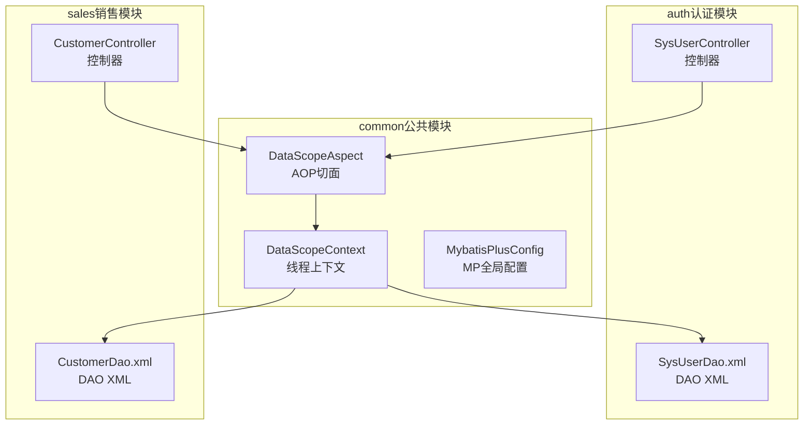
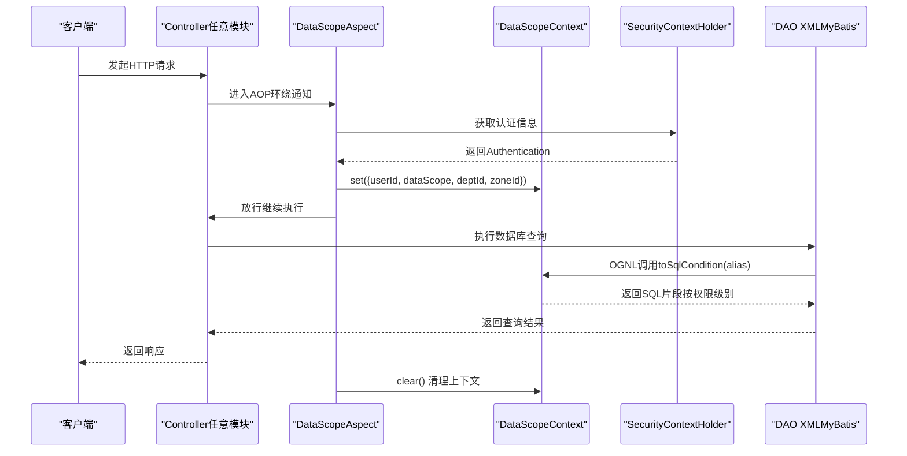
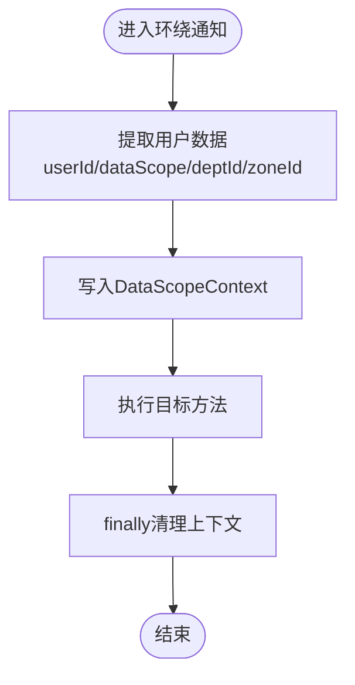
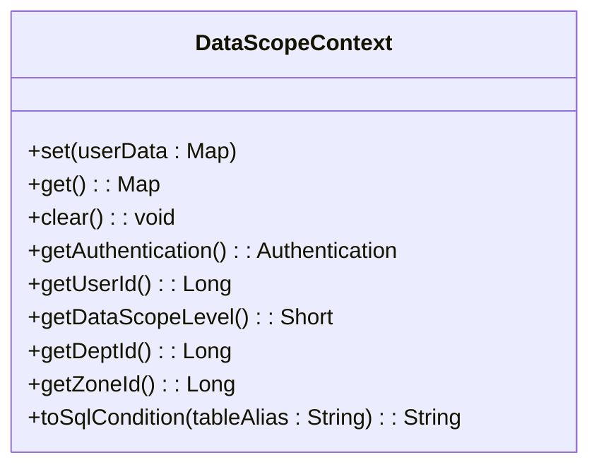
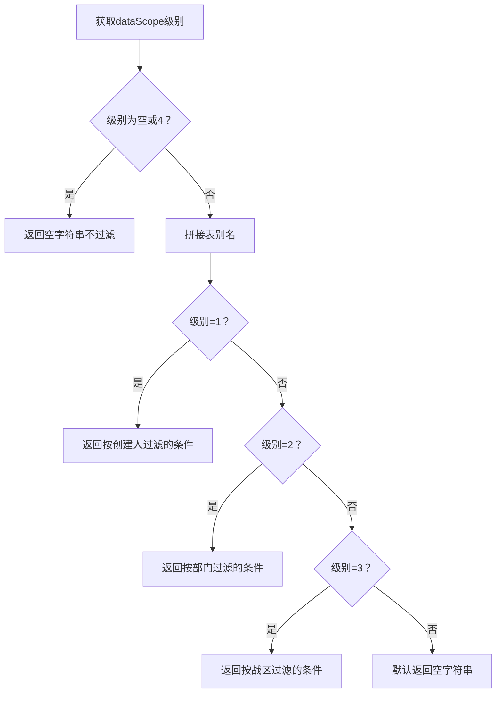
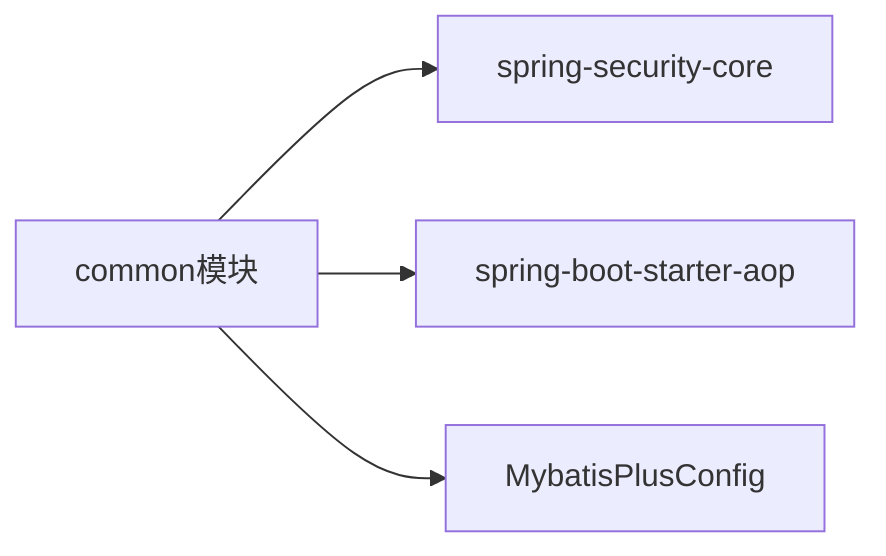

# 数据权限拦截器

<cite>
**本文档引用的文件**
- [DataScopeAspect.java](file://common/src/main/java/com/dafuweng/common/config/DataScopeAspect.java)
- [DataScopeContext.java](file://common/src/main/java/com/dafuweng/common/config/DataScopeContext.java)
- [MybatisPlusConfig.java](file://common/src/main/java/com/dafuweng/common/config/MybatisPlusConfig.java)
- [SysUserDao.xml](file://auth/src/main/resources/auth/mapper/SysUserDao.xml)
- [CustomerDao.xml](file://sales/src/main/resources/sales/mapper/CustomerDao.xml)
- [SysUserController.java](file://auth/src/main/java/com/dafuweng/auth/controller/SysUserController.java)
- [CustomerController.java](file://sales/src/main/java/com/dafuweng/sales/controller/CustomerController.java)
- [pom.xml（common模块）](file://common/pom.xml)
</cite>

## 目录
1. [简介](#简介)
2. [项目结构](#项目结构)
3. [核心组件](#核心组件)
4. [架构总览](#架构总览)
5. [组件详解](#组件详解)
6. [依赖关系分析](#依赖关系分析)
7. [性能考量](#性能考量)
8. [故障排查指南](#故障排查指南)
9. [结论](#结论)
10. [附录](#附录)

## 简介
本文件系统性阐述NeoCC项目中的数据权限拦截器设计与实现，重点围绕DataScopeAspect切面与DataScopeContext上下文机制，解释AOP切面编程在数据权限控制中的应用、权限验证流程以及SQL过滤条件的生成策略。文档还提供最佳实践与常见问题解决方案，帮助开发者正确配置与扩展数据权限能力。

## 项目结构
数据权限拦截器位于公共模块common中，通过Spring AOP在Controller层拦截请求，在DAO层通过MyBatis XML中的OGNL表达式引用上下文生成SQL过滤条件。关键文件分布如下：
- common模块：切面与上下文配置
- auth模块：用户相关DAO与控制器
- sales模块：客户相关DAO与控制器
- 其他模块：遵循相同模式接入数据权限

**图表来源**
- [DataScopeAspect.java:25-38](file://common/src/main/java/com/dafuweng/common/config/DataScopeAspect.java#L25-L38)
- [DataScopeContext.java:17-32](file://common/src/main/java/com/dafuweng/common/config/DataScopeContext.java#L17-L32)
- [MybatisPlusConfig.java:14-28](file://common/src/main/java/com/dafuweng/common/config/MybatisPlusConfig.java#L14-L28)
- [SysUserController.java:14-98](file://auth/src/main/java/com/dafuweng/auth/controller/SysUserController.java#L14-L98)
- [CustomerController.java:13-56](file://sales/src/main/java/com/dafuweng/sales/controller/CustomerController.java#L13-L56)
- [SysUserDao.xml:1-37](file://auth/src/main/resources/auth/mapper/SysUserDao.xml#L1-L37)
- [CustomerDao.xml:1-72](file://sales/src/main/resources/sales/mapper/CustomerDao.xml#L1-L72)

**章节来源**
- [DataScopeAspect.java:14-38](file://common/src/main/java/com/dafuweng/common/config/DataScopeAspect.java#L14-L38)
- [DataScopeContext.java:9-32](file://common/src/main/java/com/dafuweng/common/config/DataScopeContext.java#L9-L32)
- [MybatisPlusConfig.java:9-28](file://common/src/main/java/com/dafuweng/common/config/MybatisPlusConfig.java#L9-L28)

## 核心组件
- DataScopeAspect：基于AOP的前置拦截器，从Security上下文提取用户数据权限信息，并写入DataScopeContext。
- DataScopeContext：线程本地存储，提供获取用户属性与生成SQL过滤片段的能力。
- MyBatis-Plus配置：注册分页与自动填充等通用能力，为数据权限提供运行时支持。

**章节来源**
- [DataScopeAspect.java:14-93](file://common/src/main/java/com/dafuweng/common/config/DataScopeAspect.java#L14-L93)
- [DataScopeContext.java:9-141](file://common/src/main/java/com/dafuweng/common/config/DataScopeContext.java#L9-L141)
- [MybatisPlusConfig.java:9-29](file://common/src/main/java/com/dafuweng/common/config/MybatisPlusConfig.java#L9-L29)

## 架构总览
数据权限拦截器采用“请求进入时注入上下文、DAO查询时动态拼接SQL”的架构模式，避免在业务层硬编码权限逻辑，提升可维护性与安全性。

**图表来源**
- [DataScopeAspect.java:29-38](file://common/src/main/java/com/dafuweng/common/config/DataScopeAspect.java#L29-L38)
- [DataScopeContext.java:106-139](file://common/src/main/java/com/dafuweng/common/config/DataScopeContext.java#L106-L139)
- [SysUserController.java:21-29](file://auth/src/main/java/com/dafuweng/auth/controller/SysUserController.java#L21-L29)
- [CustomerController.java:25-28](file://sales/src/main/java/com/dafuweng/sales/controller/CustomerController.java#L25-L28)

## 组件详解

### DataScopeAspect：AOP切面与权限注入
- 切入点：匹配所有模块的Controller方法，确保在请求进入时统一注入数据权限上下文。
- 通知方法：环绕通知在proceed前后设置与清理DataScopeContext，保证线程安全。
- 权限提取：通过SecurityContextHolder获取Authentication，反射读取用户对象中的userId、dataScope、deptId、zoneId字段，避免common模块对auth实体的直接依赖。
- 默认策略：若无法获取用户上下文，默认dataScope=4（全部），不进行过滤。

**图表来源**
- [DataScopeAspect.java:29-38](file://common/src/main/java/com/dafuweng/common/config/DataScopeAspect.java#L29-L38)
- [DataScopeAspect.java:40-68](file://common/src/main/java/com/dafuweng/common/config/DataScopeAspect.java#L40-L68)

**章节来源**
- [DataScopeAspect.java:14-93](file://common/src/main/java/com/dafuweng/common/config/DataScopeAspect.java#L14-L93)

### DataScopeContext：上下文与SQL生成
- 线程本地存储：通过ThreadLocal保存Map形式的用户属性，避免跨线程污染。
- 认证获取：提供从SecurityContextHolder获取Authentication的方法，便于其他组件复用。
- 用户属性访问：提供userId、dataScope、deptId、zoneId的类型安全读取。
- SQL条件生成：toSqlCondition根据dataScope级别生成对应的AND条件片段，支持表别名，防止SQL注入。

**图表来源**
- [DataScopeContext.java:17-141](file://common/src/main/java/com/dafuweng/common/config/DataScopeContext.java#L17-L141)

**章节来源**
- [DataScopeContext.java:9-141](file://common/src/main/java/com/dafuweng/common/config/DataScopeContext.java#L9-L141)

### DAO层集成：OGNL引用与SQL拼接
- XML中引用：DAO XML通过${_dataScope.toSqlCondition("alias")}调用上下文生成SQL片段。
- 条件规则：dataScope=1按创建人过滤；dataScope=2按部门过滤；dataScope=3按战区过滤；dataScope=4或null不过滤。
- 安全性：使用OGNL拼接而非字符串拼接，降低注入风险。

**图表来源**
- [DataScopeContext.java:106-139](file://common/src/main/java/com/dafuweng/common/config/DataScopeContext.java#L106-L139)

**章节来源**
- [DataScopeContext.java:102-139](file://common/src/main/java/com/dafuweng/common/config/DataScopeContext.java#L102-L139)

### 控制器与DAO示例
- 控制器：auth与sales模块的Controller均通过REST接口触发数据权限拦截链路。
- DAO：auth与sales模块的XML中未直接展示_dataScope使用示例，但其结构与命名规范满足OGNL引用条件。

**章节来源**
- [SysUserController.java:14-98](file://auth/src/main/java/com/dafuweng/auth/controller/SysUserController.java#L14-L98)
- [CustomerController.java:13-56](file://sales/src/main/java/com/dafuweng/sales/controller/CustomerController.java#L13-L56)
- [SysUserDao.xml:1-37](file://auth/src/main/resources/auth/mapper/SysUserDao.xml#L1-L37)
- [CustomerDao.xml:1-72](file://sales/src/main/resources/sales/mapper/CustomerDao.xml#L1-L72)

## 依赖关系分析
- common模块依赖：
  - Spring Security Core：用于SecurityContextHolder获取认证信息。
  - Spring AOP：用于@Aspect与环绕通知。
- MyBatis-Plus：提供分页与自动填充等通用能力，间接支撑数据权限的查询与持久化。

**图表来源**
- [pom.xml（common模块）:49-63](file://common/pom.xml#L49-L63)
- [MybatisPlusConfig.java:14-28](file://common/src/main/java/com/dafuweng/common/config/MybatisPlusConfig.java#L14-L28)

**章节来源**
- [pom.xml（common模块）:49-63](file://common/pom.xml#L49-L63)
- [MybatisPlusConfig.java:9-29](file://common/src/main/java/com/dafuweng/common/config/MybatisPlusConfig.java#L9-L29)

## 性能考量
- 线程本地存储：ThreadLocal在单请求生命周期内读写，开销极低。
- 反射访问：仅在请求开始时进行一次反射读取，随后在DAO层通过OGNL调用，避免重复反射。
- 条件短路：dataScope=4时直接返回空字符串，不产生额外SQL片段。
- 建议：尽量减少不必要的DAO查询与复杂SQL拼接，保持dataScope层级清晰。

## 故障排查指南
- 无用户上下文导致默认不过滤
  - 现象：dataScope为null或4时，toSqlCondition返回空字符串。
  - 排查：确认SecurityContextHolder中是否存在有效的Authentication对象。
  - 参考：[DataScopeAspect.java:47-67](file://common/src/main/java/com/dafuweng/common/config/DataScopeAspect.java#L47-L67)、[DataScopeContext.java:66-74](file://common/src/main/java/com/dafuweng/common/config/DataScopeContext.java#L66-L74)
- 反射失败导致字段为空
  - 现象：userId、deptId、zoneId可能为null。
  - 排查：确认用户对象中存在对应字段，且字段可见性允许反射访问。
  - 参考：[DataScopeAspect.java:70-91](file://common/src/main/java/com/dafuweng/common/config/DataScopeAspect.java#L70-L91)
- SQL注入风险
  - 防护：始终通过${_dataScope.toSqlCondition("alias")}生成条件，不要直接拼接字符串。
  - 参考：[DataScopeContext.java:102-139](file://common/src/main/java/com/dafuweng/common/config/DataScopeContext.java#L102-L139)
- DAO XML未正确引用上下文
  - 现象：查询未按权限过滤。
  - 排查：确认XML中使用OGNL表达式调用_dataScope.toSqlCondition，且表别名正确。
  - 参考：[SysUserDao.xml:1-37](file://auth/src/main/resources/auth/mapper/SysUserDao.xml#L1-L37)、[CustomerDao.xml:1-72](file://sales/src/main/resources/sales/mapper/CustomerDao.xml#L1-L72)

**章节来源**
- [DataScopeAspect.java:47-91](file://common/src/main/java/com/dafuweng/common/config/DataScopeAspect.java#L47-L91)
- [DataScopeContext.java:102-139](file://common/src/main/java/com/dafuweng/common/config/DataScopeContext.java#L102-L139)
- [SysUserDao.xml:1-37](file://auth/src/main/resources/auth/mapper/SysUserDao.xml#L1-L37)
- [CustomerDao.xml:1-72](file://sales/src/main/resources/sales/mapper/CustomerDao.xml#L1-L72)

## 结论
DataScopeAspect与DataScopeContext共同实现了“请求级注入、DAO级过滤”的数据权限控制方案。通过AOP在入口统一注入上下文、通过OGNL在DAO层动态生成SQL条件，既保证了安全性与灵活性，又降低了业务代码的耦合度。建议在各模块中遵循统一的命名与引用规范，确保数据权限策略的一致性与可维护性。

## 附录

### 最佳实践
- 统一切面优先级：确保数据权限切面在业务切面前执行，避免上下文丢失。
- 明确dataScope语义：1=本人、2=本部门、3=本战区、4=全部，保持各模块一致。
- 严格OGNL引用：DAO XML中仅通过${_dataScope.toSqlCondition("alias")}生成条件。
- 清理上下文：确保finally中调用clear，避免线程复用导致的数据泄露。
- 分页与权限结合：MyBatis-Plus分页插件与数据权限可并行使用，注意SQL拼接顺序。

### 常见问题与解决方案
- 问题：dataScope始终为4
  - 解决：检查SecurityContextHolder中Authentication是否有效，确认用户登录流程正确。
- 问题：反射读取字段失败
  - 解决：确认用户对象字段存在且可见，必要时调整字段可见性或使用兼容的字段名。
- 问题：SQL条件未生效
  - 解决：检查DAO XML中OGNL表达式是否正确，确认表别名与字段名一致。