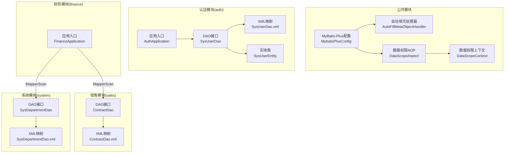
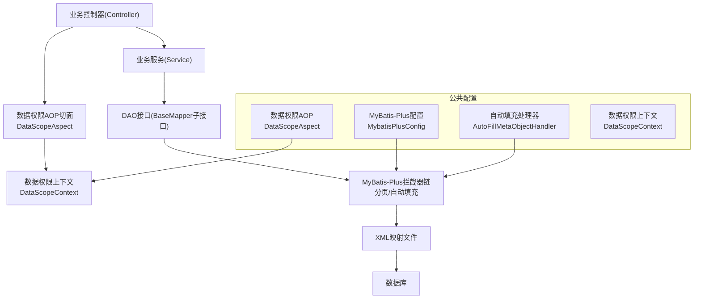
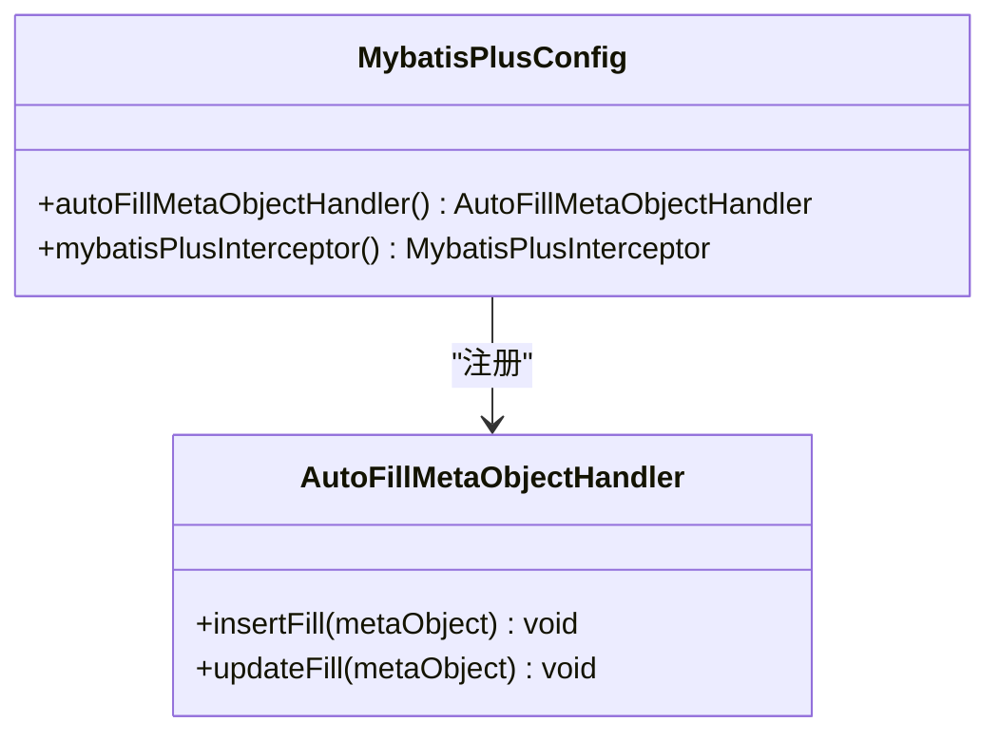
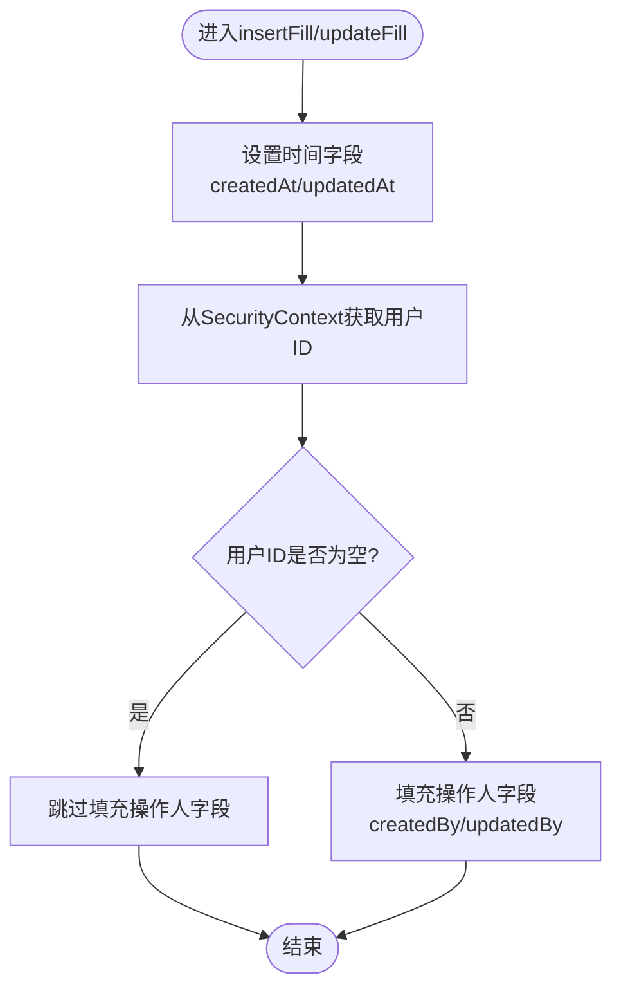
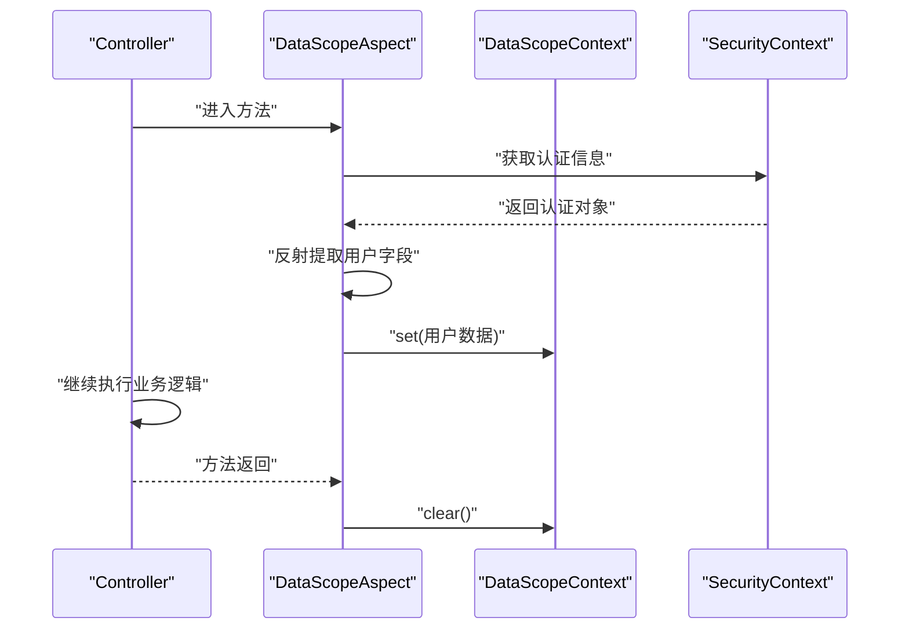
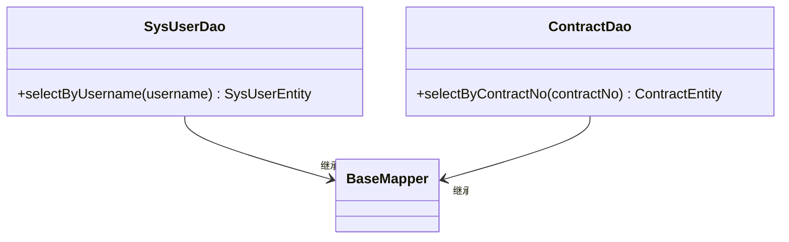
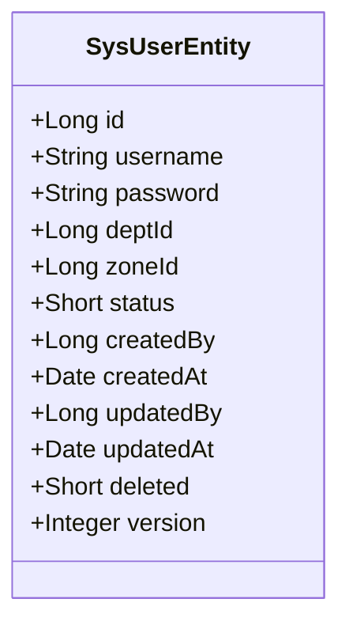
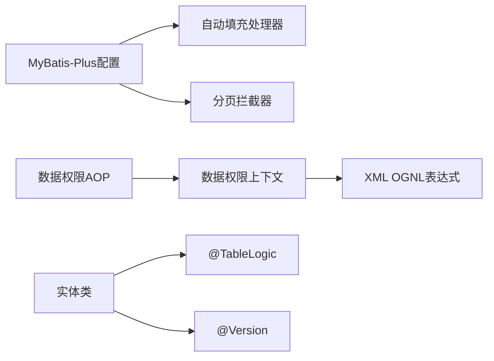

# 数据访问层设计

<cite>
**本文档引用的文件**
- [MybatisPlusConfig.java](file://common/src/main/java/com/dafuweng/common/config/MybatisPlusConfig.java)
- [AutoFillMetaObjectHandler.java](file://common/src/main/java/com/dafuweng/common/config/AutoFillMetaObjectHandler.java)
- [DataScopeAspect.java](file://common/src/main/java/com/dafuweng/common/config/DataScopeAspect.java)
- [DataScopeContext.java](file://common/src/main/java/com/dafuweng/common/config/DataScopeContext.java)
- [SysUserEntity.java](file://auth/src/main/java/com/dafuweng/auth/entity/SysUserEntity.java)
- [SysUserDao.java](file://auth/src/main/java/com/dafuweng/auth/dao/SysUserDao.java)
- [SysUserDao.xml](file://auth/src/main/resources/auth/mapper/SysUserDao.xml)
- [ContractDao.java](file://sales/src/main/java/com/dafuweng/sales/dao/ContractDao.java)
- [ContractDao.xml](file://sales/src/main/resources/sales/mapper/ContractDao.xml)
- [SysDepartmentDao.java](file://system/src/main/java/com/dafuweng/system/dao/SysDepartmentDao.java)
- [SysDepartmentDao.xml](file://system/src/main/resources/system/mapper/SysDepartmentDao.xml)
- [AuthApplication.java](file://auth/src/main/java/com/dafuweng/AuthApplication.java)
- [FinanceApplication.java](file://finance/src/main/java/com/dafuweng/FinanceApplication.java)
</cite>

## 目录
1. [简介](#简介)
2. [项目结构](#项目结构)
3. [核心组件](#核心组件)
4. [架构总览](#架构总览)
5. [详细组件分析](#详细组件分析)
6. [依赖关系分析](#依赖关系分析)
7. [性能考虑](#性能考虑)
8. [故障排查指南](#故障排查指南)
9. [结论](#结论)
10. [附录](#附录)

## 简介
本设计文档面向NeoCC项目的数据访问层（DAO），系统性阐述MyBatis-Plus在本项目中的配置与使用方式，重点覆盖以下主题：
- MyBatis-Plus全局配置：分页插件注册
- 自动填充处理器：统一处理创建/更新时间与操作人字段
- 数据权限拦截器：基于AOP的动态数据范围控制
- 乐观锁配置：版本号字段支持并发写入保护
- Mapper接口设计规范与XML映射文件编写规则
- SQL优化策略：逻辑删除、索引利用与条件拼接
- 通用字段自动填充机制、逻辑删除实现与数据范围控制
- DAO层最佳实践：分页查询、批量操作与事务管理
- 完整数据访问层架构图与代码示例路径

## 项目结构
数据访问层主要分布在common公共模块与各业务模块中：
- common模块提供MyBatis-Plus全局配置、自动填充与数据权限控制的核心能力
- 各业务模块（auth、sales、finance、system）分别定义实体、Mapper接口与XML映射文件
- 应用入口通过注解扫描指定包下的DAO接口



**图表来源**
- [MybatisPlusConfig.java:14-28](file://common/src/main/java/com/dafuweng/common/config/MybatisPlusConfig.java#L14-L28)
- [AutoFillMetaObjectHandler.java:23-45](file://common/src/main/java/com/dafuweng/common/config/AutoFillMetaObjectHandler.java#L23-L45)
- [DataScopeAspect.java:25-38](file://common/src/main/java/com/dafuweng/common/config/DataScopeAspect.java#L25-L38)
- [DataScopeContext.java:17-32](file://common/src/main/java/com/dafuweng/common/config/DataScopeContext.java#L17-L32)
- [AuthApplication.java:9-9](file://auth/src/main/java/com/dafuweng/AuthApplication.java#L9-L9)
- [FinanceApplication.java:10-10](file://finance/src/main/java/com/dafuweng/FinanceApplication.java#L10-L10)
- [SysUserDao.java:8-12](file://auth/src/main/java/com/dafuweng/auth/dao/SysUserDao.java#L8-L12)
- [SysUserDao.xml:4-36](file://auth/src/main/resources/auth/mapper/SysUserDao.xml#L4-L36)
- [SysUserEntity.java:14-58](file://auth/src/main/java/com/dafuweng/auth/entity/SysUserEntity.java#L14-L58)
- [ContractDao.java:8-12](file://sales/src/main/java/com/dafuweng/sales/dao/ContractDao.java#L8-L12)
- [ContractDao.xml:3-50](file://sales/src/main/resources/sales/mapper/ContractDao.xml#L3-L50)
- [SysDepartmentDao.java:7-9](file://system/src/main/java/com/dafuweng/system/dao/SysDepartmentDao.java#L7-L9)
- [SysDepartmentDao.xml:3-21](file://system/src/main/resources/system/mapper/SysDepartmentDao.xml#L3-L21)

**章节来源**
- [MybatisPlusConfig.java:14-28](file://common/src/main/java/com/dafuweng/common/config/MybatisPlusConfig.java#L14-L28)
- [AuthApplication.java:9-9](file://auth/src/main/java/com/dafuweng/AuthApplication.java#L9-L9)
- [FinanceApplication.java:10-10](file://finance/src/main/java/com/dafuweng/FinanceApplication.java#L10-L10)

## 核心组件
本节聚焦数据访问层的关键组件及其职责与交互。

- MyBatis-Plus全局配置
  - 分页插件注册：在common模块中通过配置类注册分页拦截器，MySQL数据库类型
  - 自动填充处理器注册：在common模块中注册MetaObjectHandler，用于统一填充创建/更新时间与操作人字段
  - 作用范围：所有使用MyBatis-Plus的模块均自动生效

- 自动填充处理器
  - 插入时填充：createdAt、updatedAt、createdBy、updatedBy
  - 更新时填充：updatedAt、updatedBy
  - 用户ID来源：通过Spring Security上下文获取，避免common模块对auth模块的直接依赖
  - 填充策略：strictInsertFill/strictUpdateFill在值为null时跳过，保证无用户上下文场景不报错

- 数据权限拦截器与上下文
  - AOP切面：在Controller方法执行前后，从SecurityContext提取用户数据权限信息并存入ThreadLocal
  - 上下文工具：提供userId、dataScope、deptId、zoneId的读取与SQL片段生成方法toSqlCondition
  - SQL拼接：通过${_dataScope.toSqlCondition("alias")}生成安全的过滤条件，避免SQL注入

- 实体类与乐观锁
  - 逻辑删除：@TableLogic注解字段deleted，查询默认过滤已删除记录
  - 并发控制：@Version注解字段version，启用MyBatis-Plus乐观锁

**章节来源**
- [MybatisPlusConfig.java:17-27](file://common/src/main/java/com/dafuweng/common/config/MybatisPlusConfig.java#L17-L27)
- [AutoFillMetaObjectHandler.java:23-45](file://common/src/main/java/com/dafuweng/common/config/AutoFillMetaObjectHandler.java#L23-L45)
- [DataScopeAspect.java:25-38](file://common/src/main/java/com/dafuweng/common/config/DataScopeAspect.java#L25-L38)
- [DataScopeContext.java:17-139](file://common/src/main/java/com/dafuweng/common/config/DataScopeContext.java#L17-L139)
- [SysUserEntity.java:53-57](file://auth/src/main/java/com/dafuweng/auth/entity/SysUserEntity.java#L53-L57)

## 架构总览
数据访问层整体架构围绕“配置—拦截—映射—实体”展开，形成可扩展、可维护的分层设计。



**图表来源**
- [MybatisPlusConfig.java:17-27](file://common/src/main/java/com/dafuweng/common/config/MybatisPlusConfig.java#L17-L27)
- [AutoFillMetaObjectHandler.java:23-45](file://common/src/main/java/com/dafuweng/common/config/AutoFillMetaObjectHandler.java#L23-L45)
- [DataScopeAspect.java:25-38](file://common/src/main/java/com/dafuweng/common/config/DataScopeAspect.java#L25-L38)
- [DataScopeContext.java:106-139](file://common/src/main/java/com/dafuweng/common/config/DataScopeContext.java#L106-L139)

## 详细组件分析

### 组件一：MyBatis-Plus全局配置
- 职责
  - 注册分页拦截器，支持MySQL数据库
  - 注册自动填充处理器，统一处理通用字段
- 设计要点
  - 使用@Configuration声明配置类
  - 分页拦截器设置数据库类型为MySQL
  - 自动填充处理器以@Bean形式暴露给Spring容器



**图表来源**
- [MybatisPlusConfig.java:17-27](file://common/src/main/java/com/dafuweng/common/config/MybatisPlusConfig.java#L17-L27)
- [AutoFillMetaObjectHandler.java:23-45](file://common/src/main/java/com/dafuweng/common/config/AutoFillMetaObjectHandler.java#L23-L45)

**章节来源**
- [MybatisPlusConfig.java:14-28](file://common/src/main/java/com/dafuweng/common/config/MybatisPlusConfig.java#L14-L28)

### 组件二：自动填充处理器
- 职责
  - 在插入与更新时自动填充时间与操作人字段
  - 通过SecurityContext获取当前用户ID，避免模块间耦合
- 处理流程



**图表来源**
- [AutoFillMetaObjectHandler.java:26-44](file://common/src/main/java/com/dafuweng/common/config/AutoFillMetaObjectHandler.java#L26-L44)

**章节来源**
- [AutoFillMetaObjectHandler.java:23-87](file://common/src/main/java/com/dafuweng/common/config/AutoFillMetaObjectHandler.java#L23-L87)

### 组件三：数据权限AOP与上下文
- 职责
  - 在Controller方法执行前后提取用户数据权限信息
  - 将用户ID、数据范围、部门ID、战区ID放入ThreadLocal
  - 提供toSqlCondition方法生成安全的SQL过滤条件
- 执行序列



**图表来源**
- [DataScopeAspect.java:29-38](file://common/src/main/java/com/dafuweng/common/config/DataScopeAspect.java#L29-L38)
- [DataScopeContext.java:21-32](file://common/src/main/java/com/dafuweng/common/config/DataScopeContext.java#L21-L32)

**章节来源**
- [DataScopeAspect.java:25-93](file://common/src/main/java/com/dafuweng/common/config/DataScopeAspect.java#L25-L93)
- [DataScopeContext.java:17-141](file://common/src/main/java/com/dafuweng/common/config/DataScopeContext.java#L17-L141)

### 组件四：Mapper接口设计规范
- 接口命名
  - 采用XxxDao命名，继承BaseMapper<T>
- 方法设计
  - 基础CRUD：继承BaseMapper提供的方法
  - 自定义查询：使用@Param标注参数，保持简洁
- 扫描配置
  - 在应用入口使用@MapperScan("com.dafuweng.模块.dao")扫描DAO接口



**图表来源**
- [SysUserDao.java:8-12](file://auth/src/main/java/com/dafuweng/auth/dao/SysUserDao.java#L8-L12)
- [ContractDao.java:8-12](file://sales/src/main/java/com/dafuweng/sales/dao/ContractDao.java#L8-L12)

**章节来源**
- [SysUserDao.java:8-12](file://auth/src/main/java/com/dafuweng/auth/dao/SysUserDao.java#L8-L12)
- [ContractDao.java:8-12](file://sales/src/main/java/com/dafuweng/sales/dao/ContractDao.java#L8-L12)
- [AuthApplication.java:9-9](file://auth/src/main/java/com/dafuweng/AuthApplication.java#L9-L9)
- [FinanceApplication.java:10-10](file://finance/src/main/java/com/dafuweng/FinanceApplication.java#L10-L10)

### 组件五：XML映射文件编写规则
- 命名空间与结果映射
  - namespace与DAO接口全限定名一致
  - resultMap定义实体字段到数据库列的映射
- 查询语句
  - 自定义查询使用<select>标签，返回对应resultMap
  - 逻辑删除字段deleted=0作为默认过滤条件
- 数据范围条件
  - 在SQL中使用${_dataScope.toSqlCondition("表别名")}拼接过滤条件

```mermaid
flowchart TD
QStart["开始构建查询"] --> BuildSel["构建SELECT列列表"]
BuildSel --> FromTbl["FROM 表"]
FromTbl --> AddDel["追加逻辑删除过滤<br/>AND deleted = 0"]
AddDel --> AddScope["追加数据范围过滤<br/>${_dataScope.toSqlCondition('t')}")
AddScope --> AddCond["追加其他WHERE条件"]
AddCond --> OrderBy["ORDER BY/分页"]
OrderBy --> QEnd["完成"]
```

**图表来源**
- [SysUserDao.xml:28-34](file://auth/src/main/resources/auth/mapper/SysUserDao.xml#L28-L34)
- [ContractDao.xml:38-48](file://sales/src/main/resources/sales/mapper/ContractDao.xml#L38-L48)
- [DataScopeContext.java:106-139](file://common/src/main/java/com/dafuweng/common/config/DataScopeContext.java#L106-L139)

**章节来源**
- [SysUserDao.xml:4-36](file://auth/src/main/resources/auth/mapper/SysUserDao.xml#L4-L36)
- [ContractDao.xml:3-50](file://sales/src/main/resources/sales/mapper/ContractDao.xml#L3-L50)

### 组件六：实体类与乐观锁
- 通用字段
  - createdBy/updatedBy：通过自动填充处理器赋值
  - createdAt/updatedAt：通过自动填充处理器赋值
- 逻辑删除
  - @TableLogic注解字段deleted，查询默认过滤已删除记录
- 乐观锁
  - @Version注解字段version，启用MyBatis-Plus乐观锁



**图表来源**
- [SysUserEntity.java:18-58](file://auth/src/main/java/com/dafuweng/auth/entity/SysUserEntity.java#L18-L58)

**章节来源**
- [SysUserEntity.java:53-57](file://auth/src/main/java/com/dafuweng/auth/entity/SysUserEntity.java#L53-L57)

## 依赖关系分析
- 模块内聚与解耦
  - common模块提供横切能力（配置、填充、数据权限），业务模块仅关注实体与映射
  - DAO接口通过BaseMapper继承MyBatis-Plus能力，无需重复实现
- 关键依赖链
  - MyBatis-Plus配置 → 自动填充处理器/分页拦截器
  - 数据权限AOP → SecurityContext → DataScopeContext → XML OGNL表达式
  - 实体类 → 逻辑删除/乐观锁注解 → MyBatis-Plus运行时行为



**图表来源**
- [MybatisPlusConfig.java:17-27](file://common/src/main/java/com/dafuweng/common/config/MybatisPlusConfig.java#L17-L27)
- [AutoFillMetaObjectHandler.java:23-45](file://common/src/main/java/com/dafuweng/common/config/AutoFillMetaObjectHandler.java#L23-L45)
- [DataScopeAspect.java:25-38](file://common/src/main/java/com/dafuweng/common/config/DataScopeAspect.java#L25-L38)
- [DataScopeContext.java:106-139](file://common/src/main/java/com/dafuweng/common/config/DataScopeContext.java#L106-L139)
- [SysUserEntity.java:53-57](file://auth/src/main/java/com/dafuweng/auth/entity/SysUserEntity.java#L53-L57)

**章节来源**
- [MybatisPlusConfig.java:14-28](file://common/src/main/java/com/dafuweng/common/config/MybatisPlusConfig.java#L14-L28)
- [DataScopeAspect.java:25-93](file://common/src/main/java/com/dafuweng/common/config/DataScopeAspect.java#L25-L93)
- [SysUserEntity.java:53-57](file://auth/src/main/java/com/dafuweng/auth/entity/SysUserEntity.java#L53-L57)

## 性能考虑
- 分页查询
  - 使用分页拦截器，避免在业务层重复构造分页参数
  - 建议结合合适的排序字段与索引，减少排序开销
- 索引与查询
  - 为常用过滤字段（如用户名、合同编号、部门ID、战区ID）建立索引
  - 逻辑删除字段deleted需建立索引以提升过滤效率
- 批量操作
  - MyBatis-Plus支持批量插入/更新，建议在事务中执行以保证一致性
- 乐观锁
  - 启用版本号后，高并发写入冲突会触发重试或异常，需在服务层做好补偿策略

## 故障排查指南
- 自动填充无效
  - 检查MyBatis-Plus配置类是否正确注册自动填充处理器
  - 确认实体类字段名称与自动填充处理器一致
- 数据权限过滤异常
  - 确认AOP切面是否在Controller方法上生效
  - 检查SecurityContext中是否存在认证信息
  - 核对XML中${_dataScope.toSqlCondition("表别名")}的别名是否正确
- 逻辑删除失效
  - 确认实体类中deleted字段使用@TableLogic注解
  - 检查查询SQL是否包含deleted=0条件
- 乐观锁冲突
  - 检查实体类version字段是否使用@Version注解
  - 在服务层捕获并发冲突并进行重试或提示

**章节来源**
- [MybatisPlusConfig.java:17-27](file://common/src/main/java/com/dafuweng/common/config/MybatisPlusConfig.java#L17-L27)
- [AutoFillMetaObjectHandler.java:23-45](file://common/src/main/java/com/dafuweng/common/config/AutoFillMetaObjectHandler.java#L23-L45)
- [DataScopeAspect.java:29-38](file://common/src/main/java/com/dafuweng/common/config/DataScopeAspect.java#L29-L38)
- [DataScopeContext.java:106-139](file://common/src/main/java/com/dafuweng/common/config/DataScopeContext.java#L106-L139)
- [SysUserEntity.java:53-57](file://auth/src/main/java/com/dafuweng/auth/entity/SysUserEntity.java#L53-L57)

## 结论
NeoCC项目的数据访问层通过common模块提供横切能力，结合各业务模块的实体与映射，实现了统一的自动填充、数据权限控制与乐观锁支持。遵循本文档的接口设计规范、XML映射规则与SQL优化策略，可在保证安全性与可维护性的同时，获得良好的性能表现。

## 附录
- DAO层最佳实践清单
  - 使用BaseMapper继承基础CRUD能力
  - 自定义查询方法使用@Param标注参数
  - 在XML中统一使用${_dataScope.toSqlCondition("t")}拼接数据范围条件
  - 启用逻辑删除与乐观锁注解，确保数据一致性
  - 在服务层进行分页查询与批量操作，并在事务中执行
- 代码示例路径参考
  - [MyBatis-Plus配置类:17-27](file://common/src/main/java/com/dafuweng/common/config/MybatisPlusConfig.java#L17-L27)
  - [自动填充处理器:23-45](file://common/src/main/java/com/dafuweng/common/config/AutoFillMetaObjectHandler.java#L23-L45)
  - [数据权限AOP切面:25-38](file://common/src/main/java/com/dafuweng/common/config/DataScopeAspect.java#L25-L38)
  - [数据权限上下文工具:106-139](file://common/src/main/java/com/dafuweng/common/config/DataScopeContext.java#L106-L139)
  - [用户DAO接口:8-12](file://auth/src/main/java/com/dafuweng/auth/dao/SysUserDao.java#L8-L12)
  - [用户XML映射:28-34](file://auth/src/main/resources/auth/mapper/SysUserDao.xml#L28-L34)
  - [合同DAO接口:8-12](file://sales/src/main/java/com/dafuweng/sales/dao/ContractDao.java#L8-L12)
  - [合同XML映射:38-48](file://sales/src/main/resources/sales/mapper/ContractDao.xml#L38-L48)
  - [部门DAO接口:7-9](file://system/src/main/java/com/dafuweng/system/dao/SysDepartmentDao.java#L7-L9)
  - [部门XML映射:19-19](file://system/src/main/resources/system/mapper/SysDepartmentDao.xml#L19-L19)
  - [应用入口扫描配置:9-9](file://auth/src/main/java/com/dafuweng/AuthApplication.java#L9-L9)
  - [应用入口扫描配置:10-10](file://finance/src/main/java/com/dafuweng/FinanceApplication.java#L10-L10)