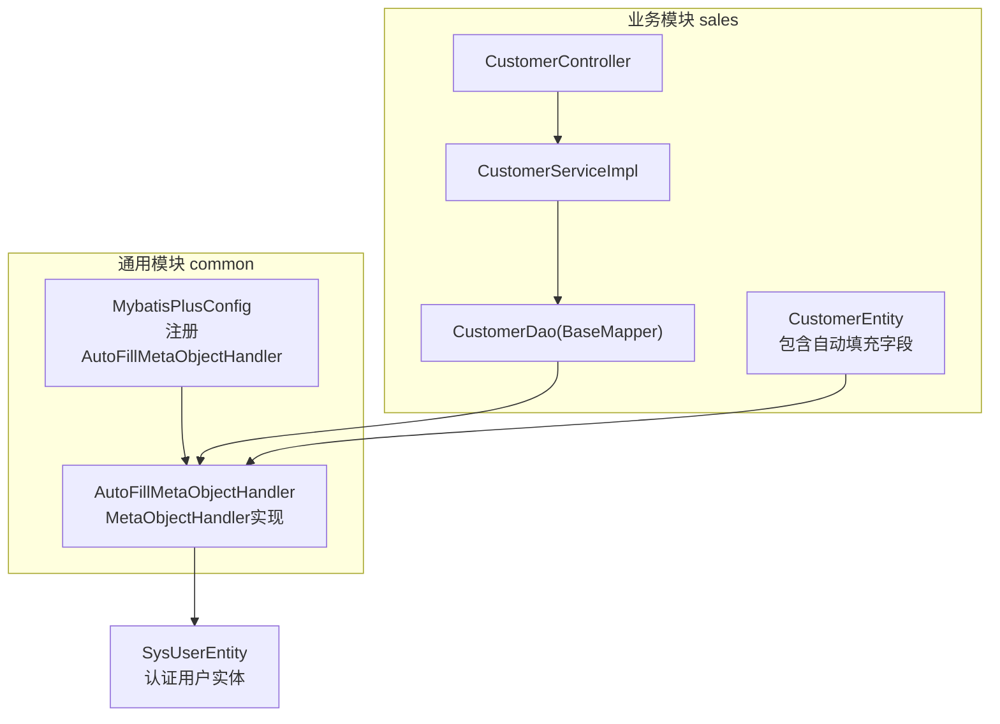
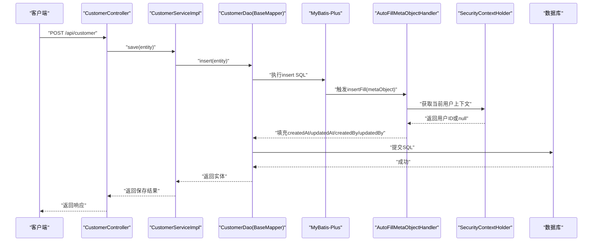
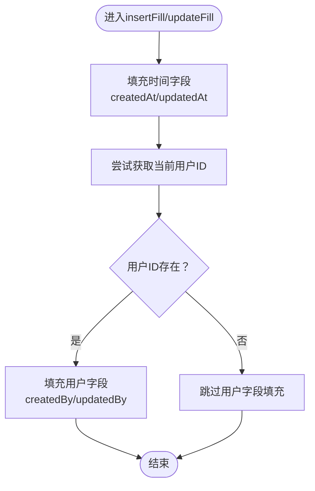
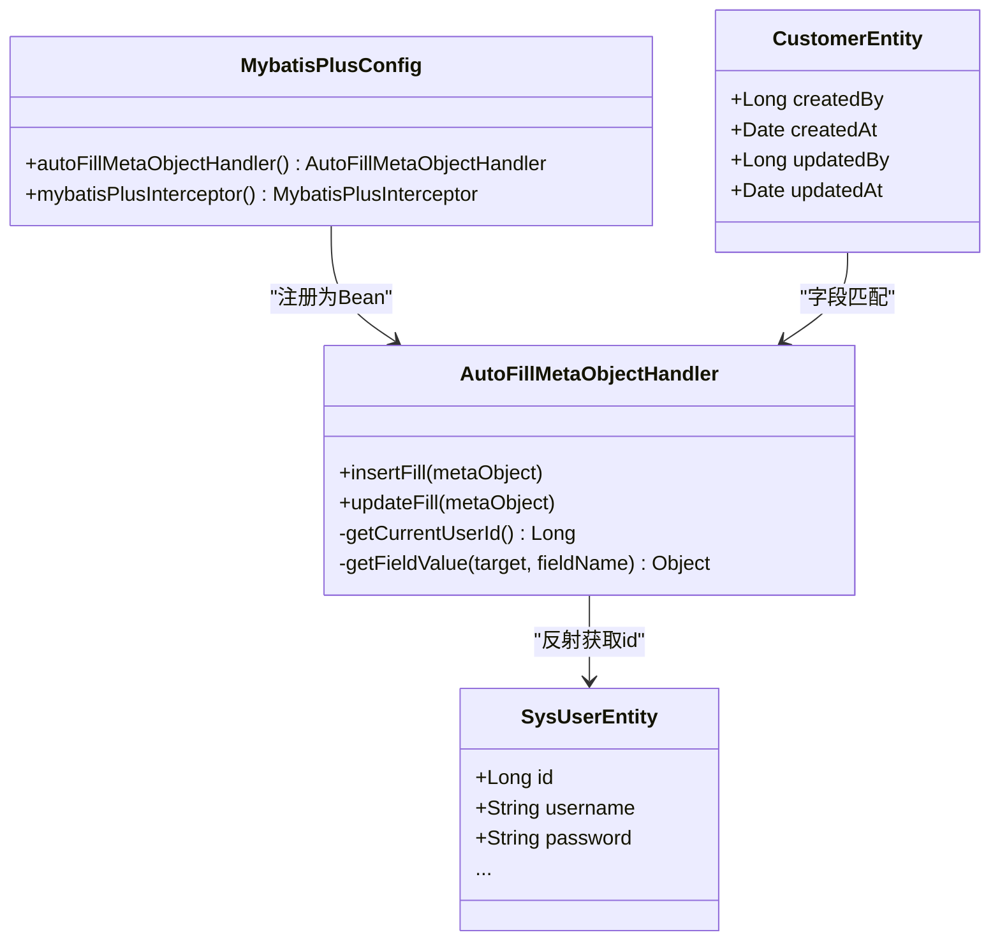

# 自动填充处理器

<cite>
**本文引用的文件**
- [AutoFillMetaObjectHandler.java](file://common/src/main/java/com/dafuweng/common/config/AutoFillMetaObjectHandler.java)
- [MybatisPlusConfig.java](file://common/src/main/java/com/dafuweng/common/config/MybatisPlusConfig.java)
- [CustomerEntity.java](file://sales/src/main/java/com/dafuweng/sales/entity/CustomerEntity.java)
- [ContactRecordEntity.java](file://sales/src/main/java/com/dafuweng/sales/entity/ContactRecordEntity.java)
- [ContractEntity.java](file://sales/src/main/java/com/dafuweng/sales/entity/ContractEntity.java)
- [SysUserEntity.java](file://auth/src/main/java/com/dafuweng/auth/entity/SysUserEntity.java)
- [CustomerController.java](file://sales/src/main/java/com/dafuweng/sales/controller/CustomerController.java)
- [CustomerServiceImpl.java](file://sales/src/main/java/com/dafuweng/sales/service/impl/CustomerServiceImpl.java)
- [CustomerDao.java](file://sales/src/main/java/com/dafuweng/sales/dao/CustomerDao.java)
- [database.sql](file://database.sql)
</cite>

## 目录
1. [简介](#简介)
2. [项目结构](#项目结构)
3. [核心组件](#核心组件)
4. [架构总览](#架构总览)
5. [详细组件分析](#详细组件分析)
6. [依赖关系分析](#依赖关系分析)
7. [性能考量](#性能考量)
8. [故障排查指南](#故障排查指南)
9. [结论](#结论)
10. [附录](#附录)

## 简介
本文件面向NeoCC项目的自动填充处理器，系统性阐述AutoFillMetaObjectHandler的实现原理与使用方式，覆盖以下主题：
- 创建时间与更新时间的自动设置策略
- 创建人与更新人的自动填充机制
- fillMetaObject方法（即insertFill与updateFill）的执行时机与字段匹配规则
- 如何通过注解控制自动填充行为
- 完整实现代码解析（含insertFill与updateFill的区别与适用场景）
- 自定义填充字段的扩展方法与最佳实践

## 项目结构
自动填充能力由通用模块common中的MyBatis-Plus全局配置注册，所有业务模块（如sales、finance、system等）在使用MyBatis-Plus时自动生效。

图表来源
- [MybatisPlusConfig.java:17-27](file://common/src/main/java/com/dafuweng/common/config/MybatisPlusConfig.java#L17-L27)
- [AutoFillMetaObjectHandler.java:23-45](file://common/src/main/java/com/dafuweng/common/config/AutoFillMetaObjectHandler.java#L23-L45)
- [CustomerController.java:15-55](file://sales/src/main/java/com/dafuweng/sales/controller/CustomerController.java#L15-L55)
- [CustomerServiceImpl.java:63-74](file://sales/src/main/java/com/dafuweng/sales/service/impl/CustomerServiceImpl.java#L63-L74)
- [CustomerDao.java:10-18](file://sales/src/main/java/com/dafuweng/sales/dao/CustomerDao.java#L10-L18)
- [CustomerEntity.java:64-75](file://sales/src/main/java/com/dafuweng/sales/entity/CustomerEntity.java#L64-L75)
- [SysUserEntity.java:18-51](file://auth/src/main/java/com/dafuweng/auth/entity/SysUserEntity.java#L18-L51)

章节来源
- [MybatisPlusConfig.java:17-27](file://common/src/main/java/com/dafuweng/common/config/MybatisPlusConfig.java#L17-L27)
- [AutoFillMetaObjectHandler.java:23-45](file://common/src/main/java/com/dafuweng/common/config/AutoFillMetaObjectHandler.java#L23-L45)
- [CustomerController.java:15-55](file://sales/src/main/java/com/dafuweng/sales/controller/CustomerController.java#L15-L55)
- [CustomerServiceImpl.java:63-74](file://sales/src/main/java/com/dafuweng/sales/service/impl/CustomerServiceImpl.java#L63-L74)
- [CustomerDao.java:10-18](file://sales/src/main/java/com/dafuweng/sales/dao/CustomerDao.java#L10-L18)
- [CustomerEntity.java:64-75](file://sales/src/main/java/com/dafuweng/sales/entity/CustomerEntity.java#L64-L75)
- [SysUserEntity.java:18-51](file://auth/src/main/java/com/dafuweng/auth/entity/SysUserEntity.java#L18-L51)

## 核心组件
- AutoFillMetaObjectHandler：实现MetaObjectHandler接口，负责在插入与更新时自动填充时间与用户字段。
- MybatisPlusConfig：在Spring容器中注册AutoFillMetaObjectHandler与MyBatis-Plus分页插件，使自动填充对所有使用MyBatis-Plus的模块生效。

章节来源
- [AutoFillMetaObjectHandler.java:23-45](file://common/src/main/java/com/dafuweng/common/config/AutoFillMetaObjectHandler.java#L23-L45)
- [MybatisPlusConfig.java:17-27](file://common/src/main/java/com/dafuweng/common/config/MybatisPlusConfig.java#L17-L27)

## 架构总览
自动填充在MyBatis-Plus执行SQL前触发，通过MetaObjectHandler的insertFill与updateFill方法完成字段填充。填充流程与依赖如下：

图表来源
- [CustomerController.java:40-47](file://sales/src/main/java/com/dafuweng/sales/controller/CustomerController.java#L40-L47)
- [CustomerServiceImpl.java:63-67](file://sales/src/main/java/com/dafuweng/sales/service/impl/CustomerServiceImpl.java#L63-L67)
- [CustomerDao.java:10-18](file://sales/src/main/java/com/dafuweng/sales/dao/CustomerDao.java#L10-L18)
- [AutoFillMetaObjectHandler.java:25-45](file://common/src/main/java/com/dafuweng/common/config/AutoFillMetaObjectHandler.java#L25-L45)
- [MybatisPlusConfig.java:17-20](file://common/src/main/java/com/dafuweng/common/config/MybatisPlusConfig.java#L17-L20)

## 详细组件分析

### AutoFillMetaObjectHandler实现原理
- 触发时机
  - insertFill：在执行insert语句前被调用，用于设置创建时间、更新时间以及创建人与更新人。
  - updateFill：在执行update语句前被调用，用于设置更新时间与更新人。
- 字段匹配规则
  - 严格匹配实体类属性名与数据库字段名，通过MyBatis-Plus的strictInsertFill/strictUpdateFill进行填充。
  - 时间字段使用java.util.Date；用户字段使用Long类型。
- 用户ID获取策略
  - 通过SecurityContextHolder获取Authentication对象，从principal中反射读取id字段，避免直接依赖auth模块。
  - 若无认证上下文或无法解析用户ID，则返回null，框架会跳过对应字段的填充。
- 异常与容错
  - getCurrentUserId捕获异常并返回null，确保定时任务、系统内部调用等无用户上下文场景不会报错。

图表来源
- [AutoFillMetaObjectHandler.java:25-45](file://common/src/main/java/com/dafuweng/common/config/AutoFillMetaObjectHandler.java#L25-L45)

章节来源
- [AutoFillMetaObjectHandler.java:25-45](file://common/src/main/java/com/dafuweng/common/config/AutoFillMetaObjectHandler.java#L25-L45)
- [AutoFillMetaObjectHandler.java:53-85](file://common/src/main/java/com/dafuweng/common/config/AutoFillMetaObjectHandler.java#L53-L85)

### insertFill与updateFill的区别与适用场景
- insertFill
  - 填充字段：createdAt、updatedAt、createdBy、updatedBy
  - 适用场景：新建记录时，确保创建时间、更新时间与创建人、更新人一致。
- updateFill
  - 填充字段：updatedAt、updatedBy
  - 适用场景：更新记录时，仅更新时间与更新人，避免误改创建人字段。
- 两者共同点
  - 均通过SecurityContextHolder获取当前用户ID，若无用户上下文则跳过对应字段填充。

章节来源
- [AutoFillMetaObjectHandler.java:25-45](file://common/src/main/java/com/dafuweng/common/config/AutoFillMetaObjectHandler.java#L25-L45)

### 字段匹配与实体映射
- 实体类均包含createdAt、updatedAt、createdBy、updatedBy等字段，与自动填充处理器的字段名称严格对应。
- 示例实体：
  - CustomerEntity：包含createdBy、createdAt、updatedBy、updatedAt等字段。
  - ContactRecordEntity：包含createdBy、createdAt、updatedBy、updatedAt等字段。
  - ContractEntity：包含createdBy、createdAt、updatedBy、updatedAt等字段。
- 数据库层面，上述字段在customer、contact_record、contract等表中均有对应列。

章节来源
- [CustomerEntity.java:64-75](file://sales/src/main/java/com/dafuweng/sales/entity/CustomerEntity.java#L64-L75)
- [ContactRecordEntity.java:40-49](file://sales/src/main/java/com/dafuweng/sales/entity/ContactRecordEntity.java#L40-L49)
- [ContractEntity.java:78-88](file://sales/src/main/java/com/dafuweng/sales/entity/ContractEntity.java#L78-L88)
- [database.sql:303-306](file://database.sql#L303-L306)
- [database.sql:333-336](file://database.sql#L333-L336)
- [database.sql:78-88](file://database.sql#L78-L88)

### 注解控制自动填充行为
- MyBatis-Plus通过MetaObjectHandler接口实现自动填充，无需额外注解即可生效。
- 若需在特定实体或字段上禁用自动填充，可在实体类中显式赋值或在业务层避免使用BaseMapper的insert/update方法，转而使用自定义SQL。
- 本项目未使用额外注解控制自动填充，采用“严格字段匹配 + 安全跳过”的策略。

章节来源
- [AutoFillMetaObjectHandler.java:10-22](file://common/src/main/java/com/dafuweng/common/config/AutoFillMetaObjectHandler.java#L10-L22)

### 使用方式与集成要点
- 注册与生效
  - MybatisPlusConfig中通过@Bean注册AutoFillMetaObjectHandler，所有使用MyBatis-Plus的模块自动应用。
- 控制器与服务层
  - 控制器接收请求后调用服务层的save或update方法，服务层通过BaseMapper的insert或update触发自动填充。
- 用户上下文
  - 需要有效的认证上下文（如携带Bearer Token）以获取当前用户ID；无上下文时createdBy/updatedBy将填充为null，系统不会报错。

章节来源
- [MybatisPlusConfig.java:17-27](file://common/src/main/java/com/dafuweng/common/config/MybatisPlusConfig.java#L17-L27)
- [CustomerController.java:40-47](file://sales/src/main/java/com/dafuweng/sales/controller/CustomerController.java#L40-L47)
- [CustomerServiceImpl.java:63-74](file://sales/src/main/java/com/dafuweng/sales/service/impl/CustomerServiceImpl.java#L63-L74)

### 自定义填充字段的扩展方法与最佳实践
- 扩展方法
  - 在AutoFillMetaObjectHandler中增加新的字段填充逻辑，遵循strictInsertFill/strictUpdateFill的调用模式。
  - 若需支持更多用户信息（如部门ID、战区ID），可在getCurrentUserId基础上扩展，或在业务层显式设置。
- 最佳实践
  - 保持字段命名与实体一致，避免大小写与下划线差异导致的匹配失败。
  - 对于无用户上下文的场景（定时任务、系统内部调用），确保框架能安全跳过填充，避免报错。
  - 在复杂业务中，可通过自定义SQL或条件判断控制是否启用自动填充，保证数据一致性与可追溯性。

章节来源
- [AutoFillMetaObjectHandler.java:25-45](file://common/src/main/java/com/dafuweng/common/config/AutoFillMetaObjectHandler.java#L25-L45)

## 依赖关系分析
- AutoFillMetaObjectHandler依赖Spring Security的Authentication上下文，通过反射读取用户ID，避免对auth模块的直接依赖。
- MyBatis-Plus在执行SQL前回调MetaObjectHandler，实现自动填充。
- 业务模块通过BaseMapper的insert/update触发自动填充，最终持久化到数据库。

图表来源
- [AutoFillMetaObjectHandler.java:23-85](file://common/src/main/java/com/dafuweng/common/config/AutoFillMetaObjectHandler.java#L23-L85)
- [MybatisPlusConfig.java:17-27](file://common/src/main/java/com/dafuweng/common/config/MybatisPlusConfig.java#L17-L27)
- [CustomerEntity.java:64-75](file://sales/src/main/java/com/dafuweng/sales/entity/CustomerEntity.java#L64-L75)
- [SysUserEntity.java:18-51](file://auth/src/main/java/com/dafuweng/auth/entity/SysUserEntity.java#L18-L51)

章节来源
- [AutoFillMetaObjectHandler.java:23-85](file://common/src/main/java/com/dafuweng/common/config/AutoFillMetaObjectHandler.java#L23-L85)
- [MybatisPlusConfig.java:17-27](file://common/src/main/java/com/dafuweng/common/config/MybatisPlusConfig.java#L17-L27)
- [CustomerEntity.java:64-75](file://sales/src/main/java/com/dafuweng/sales/entity/CustomerEntity.java#L64-L75)
- [SysUserEntity.java:18-51](file://auth/src/main/java/com/dafuweng/auth/entity/SysUserEntity.java#L18-L51)

## 性能考量
- 反射开销：getCurrentUserId通过反射读取用户ID，通常发生在每次insert/update前，属于轻量级操作，对整体性能影响较小。
- 安全跳过：当SecurityContextHolder无认证上下文时，自动填充会安全跳过，避免不必要的数据库写入。
- 批量操作：批量insert/update时，自动填充按每条记录触发，注意控制事务边界与日志输出，避免过多I/O。

## 故障排查指南
- 现象：createdBy/updatedBy为null
  - 可能原因：无认证上下文（定时任务、测试、匿名用户）。
  - 处理建议：确认请求是否携带有效Token；对于无上下文场景，系统会安全跳过填充。
- 现象：字段未填充或类型不匹配
  - 可能原因：实体类字段名与数据库字段名不一致，或类型不匹配。
  - 处理建议：检查实体类字段与数据库列的命名与类型，确保严格一致。
- 现象：反射异常导致填充失败
  - 可能原因：SecurityContextHolder中的principal类型不符合预期。
  - 处理建议：确认认证模块返回的principal类型与反射读取的字段名一致；必要时在认证模块增强UserDetails实现。

章节来源
- [AutoFillMetaObjectHandler.java:53-85](file://common/src/main/java/com/dafuweng/common/config/AutoFillMetaObjectHandler.java#L53-L85)

## 结论
AutoFillMetaObjectHandler通过严格的字段匹配与安全的用户上下文获取，在插入与更新时自动填充时间与用户字段，简化业务代码并提升数据一致性。结合MyBatis-Plus全局配置，该能力对所有业务模块透明生效。通过合理的扩展与最佳实践，可进一步满足复杂业务场景下的自动填充需求。

## 附录
- 相关实体字段与数据库列的对应关系可参考以下文件：
  - [CustomerEntity.java:64-75](file://sales/src/main/java/com/dafuweng/sales/entity/CustomerEntity.java#L64-L75)
  - [ContactRecordEntity.java:40-49](file://sales/src/main/java/com/dafuweng/sales/entity/ContactRecordEntity.java#L40-L49)
  - [ContractEntity.java:78-88](file://sales/src/main/java/com/dafuweng/sales/entity/ContractEntity.java#L78-L88)
  - [database.sql:303-306](file://database.sql#L303-L306)
  - [database.sql:333-336](file://database.sql#L333-L336)
  - [database.sql:78-88](file://database.sql#L78-L88)