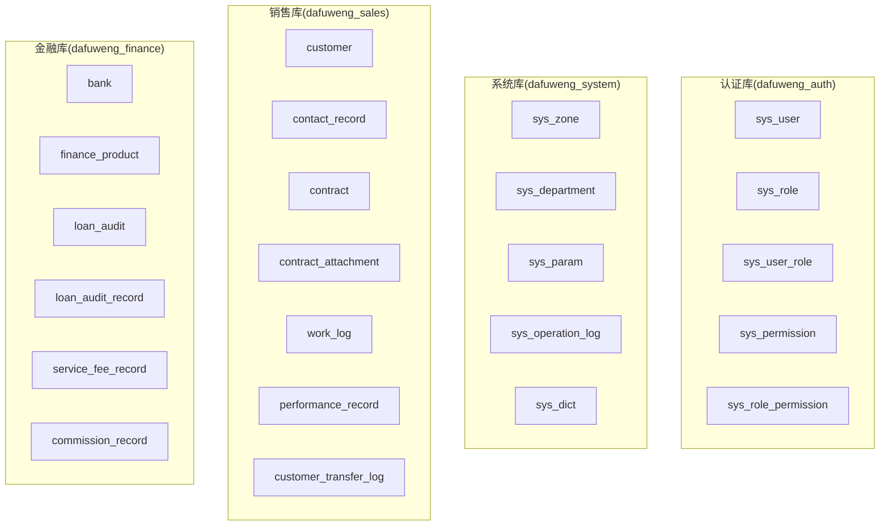
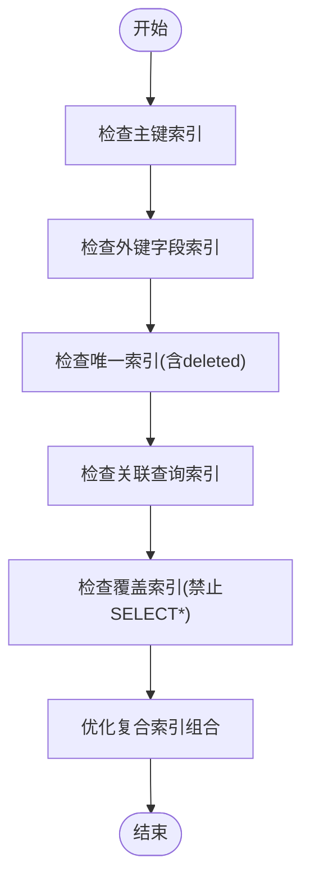
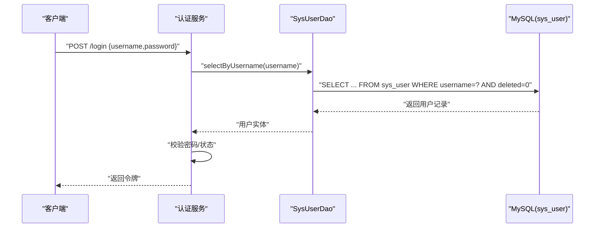
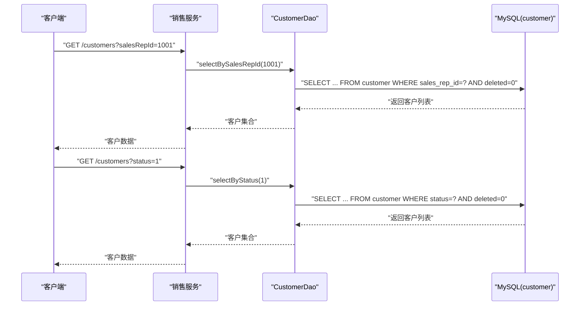
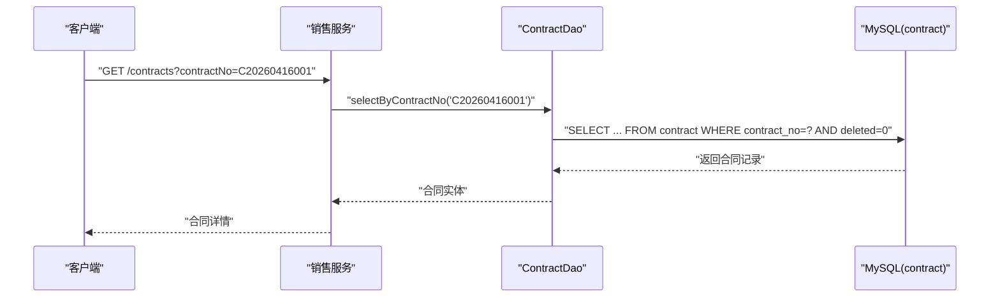
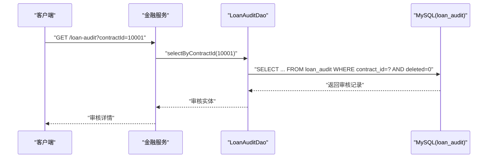
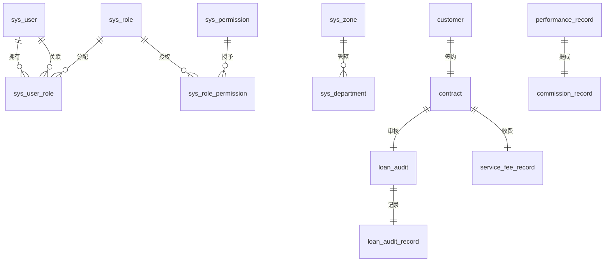

# 索引设计策略

<cite>
**本文档引用的文件**
- [database.sql](file://database.sql)
- [dataDesign.md](file://dataDesign.md)
- [CustomerDao.xml](file://sales/src/main/resources/sales/mapper/CustomerDao.xml)
- [ContractDao.xml](file://sales/src/main/resources/sales/mapper/ContractDao.xml)
- [LoanAuditDao.xml](file://finance/src/main/resources/finance/mapper/LoanAuditDao.xml)
- [SysUserDao.xml](file://auth/src/main/resources/auth/mapper/SysUserDao.xml)
- [SysDictDao.xml](file://system/src/main/resources/system/mapper/SysDictDao.xml)
- [CustomerDao.java](file://sales/src/main/java/com/dafuweng/sales/dao/CustomerDao.java)
- [ContractDao.java](file://sales/src/main/java/com/dafuweng/sales/dao/ContractDao.java)
- [LoanAuditDao.java](file://finance/src/main/java/com/dafuweng/finance/dao/LoanAuditDao.java)
- [SysUserDao.java](file://auth/src/main/java/com/dafuweng/auth/dao/SysUserDao.java)
- [SysDictDao.java](file://system/src/main/java/com/dafuweng/system/dao/SysDictDao.java)
</cite>

## 目录
1. [简介](#简介)
2. [项目结构](#项目结构)
3. [核心组件](#核心组件)
4. [架构总览](#架构总览)
5. [详细组件分析](#详细组件分析)
6. [依赖分析](#依赖分析)
7. [性能考量](#性能考量)
8. [故障排查指南](#故障排查指南)
9. [结论](#结论)
10. [附录](#附录)

## 简介
本文件面向NeoCC项目，提供一套系统化的MySQL索引设计策略文档。内容涵盖：
- 索引设计原则：主键索引、唯一索引、复合索引策略
- 查询优化索引方法：选择性原则、覆盖索引、索引下推优化
- 基于实际业务场景的模块化索引设计：用户查询、客户搜索、合同检索、审核查询等
- 完整索引清单表格：索引类型、字段组合、使用场景
- 索引维护策略与性能监控方法

## 项目结构
NeoCC采用按业务域垂直拆分的数据库架构，共4个业务库：
- 认证库(dafuweng_auth)：用户、角色、权限相关
- 系统库(dafuweng_system)：组织架构、参数、字典、操作日志
- 销售库(dafuweng_sales)：客户、洽谈、合同、业绩、工作日志、转移记录
- 金融库(dafuweng_finance)：银行、产品、贷款审核、审核记录、服务费、提成

图表来源
- [database.sql:16-647](file://database.sql#L16-L647)

章节来源
- [database.sql:1-647](file://database.sql#L1-L647)
- [dataDesign.md:14-26](file://dataDesign.md#L14-L26)

## 核心组件
本节概述各库的关键表及索引现状，为后续详细分析奠定基础。

- 认证库(dafuweng_auth)
  - sys_user：主键、唯一(username)、普通索引(dept_id, zone_id, status, deleted)
  - sys_role：主键、唯一(role_code)、普通索引(deleted)
  - sys_user_role：主键、唯一(user_id, role_id)、普通索引(user_id, role_id)
  - sys_permission：主键、唯一(perm_code)、普通索引(parent_id, deleted)
  - sys_role_permission：主键、唯一(role_id, permission_id)、普通索引(role_id, permission_id)

- 系统库(dafuweng_system)
  - sys_zone：主键、唯一(zone_code)、普通索引(deleted)
  - sys_department：主键、唯一(dept_code)、普通索引(parent_id, zone_id, deleted)
  - sys_param：主键、唯一(param_key)、普通索引(param_group, deleted)
  - sys_operation_log：主键、普通索引(user_id, module, created_at)
  - sys_dict：主键、唯一(dict_type, dict_code)、普通索引(dict_type, deleted)

- 销售库(dafuweng_sales)
  - customer：主键、唯一(name, phone, deleted)、普通索引(sales_rep_id, dept_id, zone_id, status, intention_level, public_sea_time, last_contact_date, deleted)
  - contact_record：主键、普通索引(customer_id, sales_rep_id, contact_date, deleted)
  - contract：主键、唯一(contract_no)、普通索引(customer_id, sales_rep_id, dept_id, product_id, status, sign_date, deleted)
  - contract_attachment：主键、普通索引(contract_id, deleted)
  - work_log：主键、唯一(sales_rep_id, log_date)、普通索引(sales_rep_id, log_date)
  - performance_record：主键、唯一(contract_id)、普通索引(sales_rep_id, dept_id, zone_id, status, deleted)
  - customer_transfer_log：主键、普通索引(customer_id, from_rep_id, to_rep_id, operated_at)

- 金融库(dafuweng_finance)
  - bank：主键、唯一(bank_code)、普通索引(deleted)
  - finance_product：主键、唯一(product_code)、普通索引(bank_id, status, min_amount, deleted)
  - loan_audit：主键、唯一(contract_id)、普通索引(finance_specialist_id, audit_status, bank_id, deleted)
  - loan_audit_record：主键、普通索引(loan_audit_id, operator_id, created_at)
  - service_fee_record：主键、普通索引(contract_id, fee_type, payment_status, accountant_id, deleted)
  - commission_record：主键、普通索引(performance_id, sales_rep_id, contract_id, status, deleted)

章节来源
- [database.sql:22-647](file://database.sql#L22-L647)
- [dataDesign.md:400-447](file://dataDesign.md#L400-L447)

## 架构总览
NeoCC的数据库索引设计遵循以下原则：
- 主键索引：所有表均具备自增主键，天然形成聚集索引
- 外键字段：必须建立普通索引，确保关联查询效率
- 唯一约束：逻辑删除字段参与唯一索引，避免软删后重复录入
- 联合索引：按查询最常用组合建立，优先满足高频过滤条件
- 禁止全表扫描：所有查询必须命中覆盖索引，避免SELECT *

## 详细组件分析

### 用户查询索引设计
- 业务场景
  - 登录校验：按username精确查找
  - 数据权限：按dept_id、zone_id过滤
  - 账号状态：按status过滤
- 现状分析
  - sys_user已具备唯一索引(username)和多个普通索引(dept_id, zone_id, status, deleted)，满足登录与权限过滤需求
- 优化建议
  - 若存在大量按username+status组合查询，可考虑(username, status)复合索引
  - 若存在按dept_id+status+deleted组合查询，可考虑(dept_id, status, deleted)复合索引

图表来源
- [SysUserDao.java](file://auth/src/main/java/com/dafuweng/auth/dao/SysUserDao.java#L11)
- [SysUserDao.xml:28-34](file://auth/src/main/resources/auth/mapper/SysUserDao.xml#L28-L34)

章节来源
- [SysUserDao.java:1-13](file://auth/src/main/java/com/dafuweng/auth/dao/SysUserDao.java#L1-L13)
- [SysUserDao.xml:1-37](file://auth/src/main/resources/auth/mapper/SysUserDao.xml#L1-L37)
- [database.sql:22-48](file://database.sql#L22-L48)

### 客户搜索索引设计
- 业务场景
  - 销售代表查看名下客户：按sales_rep_id过滤
  - 客户状态筛选：按status过滤
  - 公海客户扫描：按next_follow_up_date、created_at、status组合
- 现状分析
  - customer表具备唯一索引(name, phone, deleted)与多个普通索引(sales_rep_id, dept_id, zone_id, status, intention_level, public_sea_time, last_contact_date, deleted)，基本满足上述场景
- 优化建议
  - 若存在大量按sales_rep_id+status组合查询，可考虑(sales_rep_id, status)复合索引
  - 若存在按status+intention_level+deleted组合查询，可考虑(status, intention_level, deleted)复合索引

图表来源
- [CustomerDao.java:13-17](file://sales/src/main/java/com/dafuweng/sales/dao/CustomerDao.java#L13-L17)
- [CustomerDao.xml:35-69](file://sales/src/main/resources/sales/mapper/CustomerDao.xml#L35-L69)

章节来源
- [CustomerDao.java:1-19](file://sales/src/main/java/com/dafuweng/sales/dao/CustomerDao.java#L1-L19)
- [CustomerDao.xml:1-72](file://sales/src/main/resources/sales/mapper/CustomerDao.xml#L1-L72)
- [database.sql:281-320](file://database.sql#L281-L320)

### 合同检索索引设计
- 业务场景
  - 按合同编号精确查询：contract_no唯一
  - 按客户/销售/部门/产品/状态/签署日期过滤
- 现状分析
  - contract表具备唯一索引(contract_no)与多个普通索引(customer_id, sales_rep_id, dept_id, product_id, status, sign_date, deleted)，满足典型检索需求
- 优化建议
  - 若存在大量按contract_no+status组合查询，可考虑(contract_no, status)复合索引
  - 若存在按sign_date+status组合查询，可考虑(sign_date, status)复合索引

图表来源
- [ContractDao.java](file://sales/src/main/java/com/dafuweng/sales/dao/ContractDao.java#L11)
- [ContractDao.xml:38-48](file://sales/src/main/resources/sales/mapper/ContractDao.xml#L38-L48)

章节来源
- [ContractDao.java:1-13](file://sales/src/main/java/com/dafuweng/sales/dao/ContractDao.java#L1-L13)
- [ContractDao.xml:1-51](file://sales/src/main/resources/sales/mapper/ContractDao.xml#L1-L51)
- [database.sql:345-385](file://database.sql#L345-L385)

### 审核查询索引设计
- 业务场景
  - 按合同ID精确查询审核记录：contract_id唯一
  - 按金融专员、审核状态、银行ID过滤
- 现状分析
  - loan_audit表具备唯一索引(contract_id)与多个普通索引(finance_specialist_id, audit_status, bank_id, deleted)，满足典型审核查询需求
- 优化建议
  - 若存在大量按finance_specialist_id+audit_status组合查询，可考虑(finance_specialist_id, audit_status)复合索引
  - 若存在按bank_id+audit_status组合查询，可考虑(bank_id, audit_status)复合索引

图表来源
- [LoanAuditDao.java](file://finance/src/main/java/com/dafuweng/finance/dao/LoanAuditDao.java#L11)
- [LoanAuditDao.xml:30-39](file://finance/src/main/resources/finance/mapper/LoanAuditDao.xml#L30-L39)

章节来源
- [LoanAuditDao.java:1-13](file://finance/src/main/java/com/dafuweng/finance/dao/LoanAuditDao.java#L1-L13)
- [LoanAuditDao.xml:1-42](file://finance/src/main/resources/finance/mapper/LoanAuditDao.xml#L1-L42)
- [database.sql:526-555](file://database.sql#L526-L555)

### 字典查询索引设计
- 业务场景
  - 按字典类型查询可用字典项：dict_type+status+deleted
- 现状分析
  - sys_dict具备唯一索引(dict_type, dict_code)与普通索引(dict_type, deleted)，查询时通常配合status过滤
- 优化建议
  - 若存在大量按dict_type+status+deleted组合查询，可考虑(dict_type, status, deleted)复合索引

章节来源
- [SysDictDao.java](file://system/src/main/java/com/dafuweng/system/dao/SysDictDao.java#L13)
- [SysDictDao.xml:19-25](file://system/src/main/resources/system/mapper/SysDictDao.xml#L19-L25)
- [database.sql:220-272](file://database.sql#L220-L272)

## 依赖分析
- 外键字段与索引关系
  - customer.sales_rep_id、dept_id、zone_id：用于销售代表、部门、战区维度查询
  - contract.customer_id、sales_rep_id、dept_id、product_id：用于合同维度查询
  - loan_audit.contract_id、finance_specialist_id、bank_id：用于审核维度查询
- 跨库关联
  - 销售库与金融库通过contract_id进行关联，loan_audit.contract_id唯一约束保证幂等

图表来源
- [database.sql:22-647](file://database.sql#L22-L647)

章节来源
- [database.sql:22-647](file://database.sql#L22-L647)

## 性能考量
- 选择性原则
  - 优先对高选择性的列建立索引，如status、contract_no、username
- 覆盖索引
  - 所有查询必须命中覆盖索引，避免回表；禁止SELECT *
- 索引下推优化
  - 在WHERE条件中尽量使用索引列，减少回表与临时表
- 维护策略
  - 定期统计索引使用率，清理失效或冗余索引
  - 对热点表进行分区或归档，降低索引维护成本
- 监控方法
  - 使用EXPLAIN分析SQL执行计划
  - 结合慢查询日志与性能监控工具观察索引效果

## 故障排查指南
- 常见问题
  - 全表扫描：检查是否命中覆盖索引，是否存在隐式转换
  - 索引失效：检查WHERE条件中的函数、类型不匹配、IS NULL/IS NOT NULL
  - 冗余索引：定期分析索引使用率，合并相似索引
- 排查步骤
  - 使用EXPLAIN EXPLAIN FORMAT=JSON 分析SQL
  - 对比索引定义与查询条件，确认索引列是否被正确使用
  - 检查逻辑删除字段deleted是否参与查询条件

章节来源
- [dataDesign.md:40-46](file://dataDesign.md#L40-L46)

## 结论
NeoCC项目的索引设计遵循“主键+外键索引+唯一索引(含deleted)+复合索引”的体系化策略，能够有效支撑认证、系统、销售、金融四大业务域的高频查询场景。建议在现有基础上进一步细化复合索引组合，结合业务查询日志持续优化索引结构，并建立完善的索引维护与监控机制。

## 附录

### 索引清单总表
- 认证库(dafuweng_auth)
  - sys_user：唯一(username)、普通索引(dept_id, zone_id, status, deleted)
  - sys_role：唯一(role_code)、普通索引(deleted)
  - sys_user_role：唯一(user_id, role_id)、普通索引(user_id, role_id)
  - sys_permission：唯一(perm_code)、普通索引(parent_id, deleted)
  - sys_role_permission：唯一(role_id, permission_id)、普通索引(role_id, permission_id)

- 系统库(dafuweng_system)
  - sys_zone：唯一(zone_code)、普通索引(deleted)
  - sys_department：唯一(dept_code)、普通索引(parent_id, zone_id, deleted)
  - sys_param：唯一(param_key)、普通索引(param_group, deleted)
  - sys_operation_log：普通索引(user_id, module, created_at)
  - sys_dict：唯一(dict_type, dict_code)、普通索引(dict_type, deleted)

- 销售库(dafuweng_sales)
  - customer：唯一(name, phone, deleted)、普通索引(sales_rep_id, dept_id, zone_id, status, intention_level, public_sea_time, last_contact_date, deleted)
  - contact_record：普通索引(customer_id, sales_rep_id, contact_date, deleted)
  - contract：唯一(contract_no)、普通索引(customer_id, sales_rep_id, dept_id, product_id, status, sign_date, deleted)
  - contract_attachment：普通索引(contract_id, deleted)
  - work_log：唯一(sales_rep_id, log_date)、普通索引(sales_rep_id, log_date)
  - performance_record：唯一(contract_id)、普通索引(sales_rep_id, dept_id, zone_id, status, deleted)
  - customer_transfer_log：普通索引(customer_id, from_rep_id, to_rep_id, operated_at)

- 金融库(dafuweng_finance)
  - bank：唯一(bank_code)、普通索引(deleted)
  - finance_product：唯一(product_code)、普通索引(bank_id, status, min_amount, deleted)
  - loan_audit：唯一(contract_id)、普通索引(finance_specialist_id, audit_status, bank_id, deleted)
  - loan_audit_record：普通索引(loan_audit_id, operator_id, created_at)
  - service_fee_record：普通索引(contract_id, fee_type, payment_status, accountant_id, deleted)
  - commission_record：普通索引(performance_id, sales_rep_id, contract_id, status, deleted)

章节来源
- [dataDesign.md:400-447](file://dataDesign.md#L400-L447)
- [database.sql:22-647](file://database.sql#L22-L647)