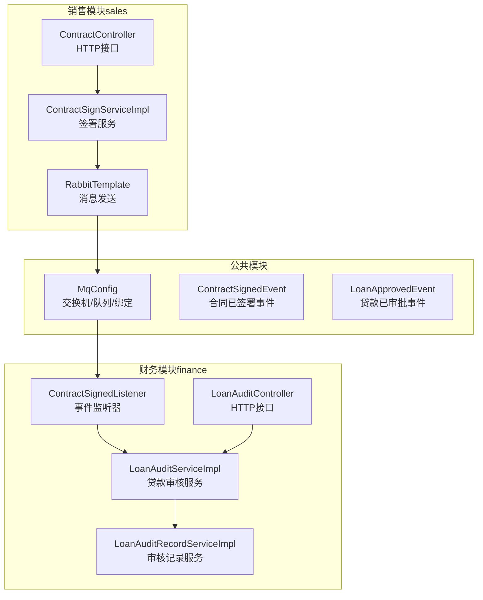
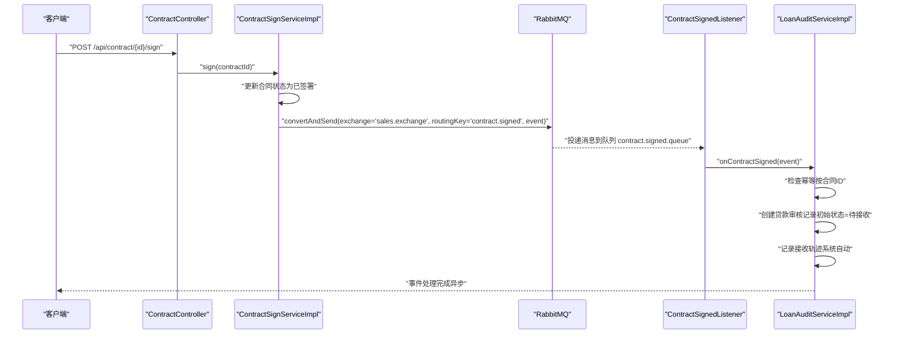
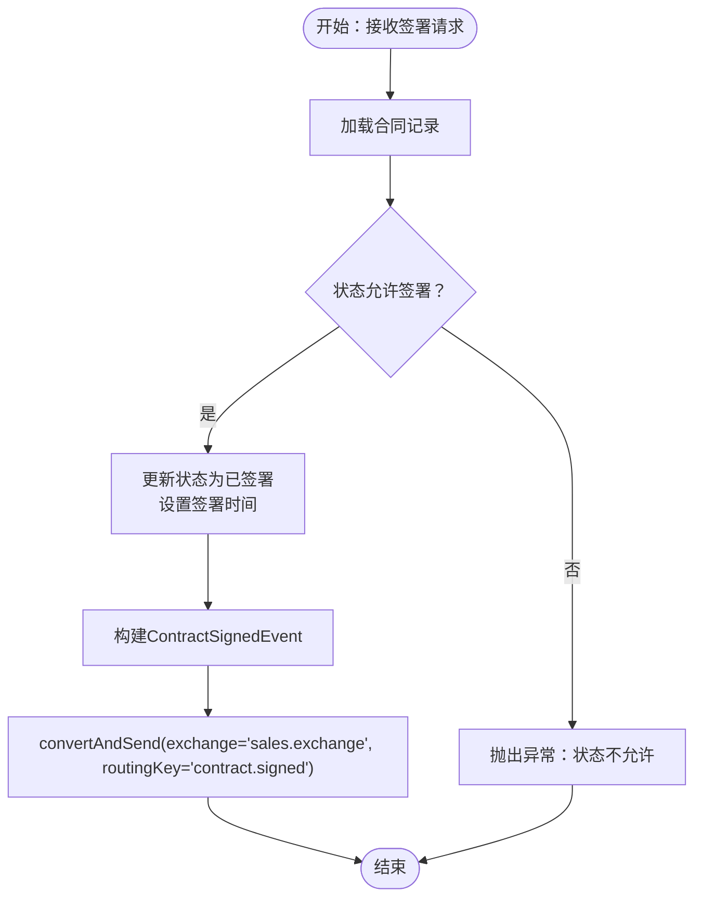
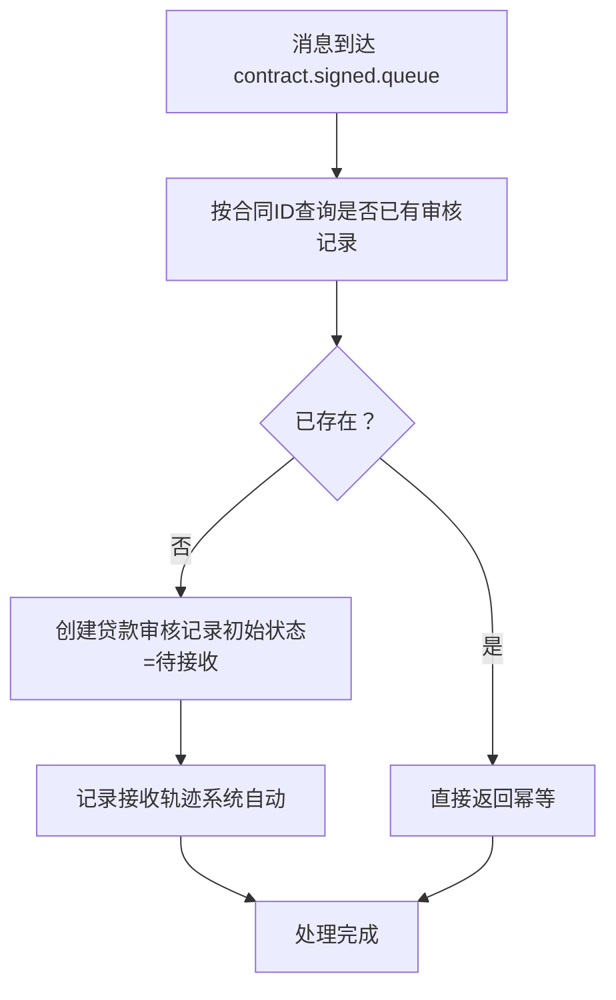
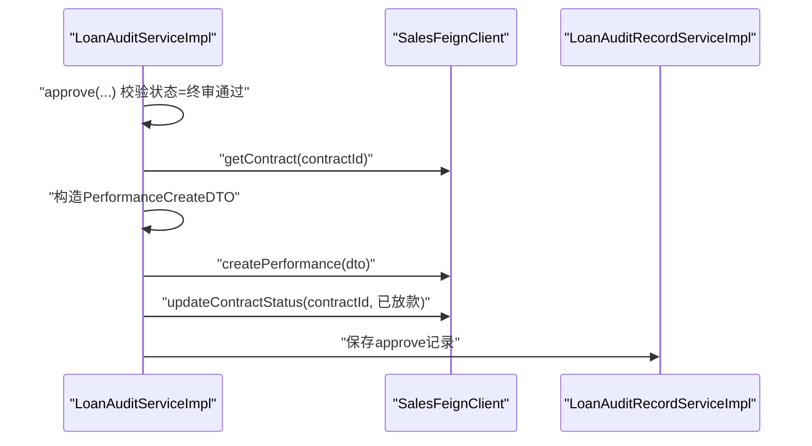
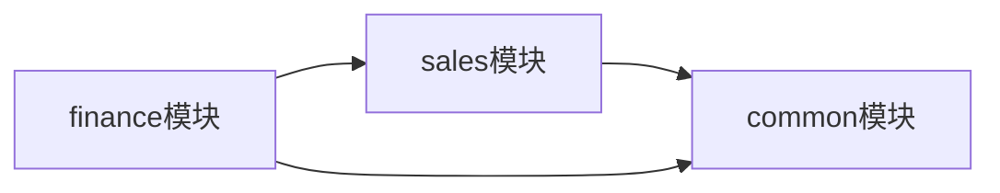
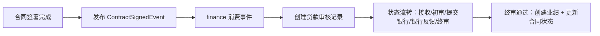

# 事件驱动架构

<cite>
**本文引用的文件**
- [MqConfig.java](file://common/src/main/java/com/dafuweng/common/mq/MqConfig.java)
- [ContractSignedEvent.java](file://common/src/main/java/com/dafuweng/common/mq/event/ContractSignedEvent.java)
- [LoanApprovedEvent.java](file://common/src/main/java/com/dafuweng/common/mq/event/LoanApprovedEvent.java)
- [ContractSignedListener.java](file://finance/src/main/java/com/dafuweng/finance/mq/ContractSignedListener.java)
- [ContractSignServiceImpl.java](file://sales/src/main/java/com/dafuweng/sales/service/impl/ContractSignServiceImpl.java)
- [ContractController.java](file://sales/src/main/java/com/dafuweng/sales/controller/ContractController.java)
- [LoanAuditServiceImpl.java](file://finance/src/main/java/com/dafuweng/finance/service/impl/LoanAuditServiceImpl.java)
- [LoanAuditController.java](file://finance/src/main/java/com/dafuweng/finance/controller/LoanAuditController.java)
- [LoanAuditRecordServiceImpl.java](file://finance/src/main/java/com/dafuweng/finance/service/impl/LoanAuditRecordServiceImpl.java)
- [LoanAuditRecordController.java](file://finance/src/main/java/com/dafuweng/finance/controller/LoanAuditRecordController.java)
- [application.yml（sales）](file://sales/src/main/resources/application.yml)
- [application.yml（finance）](file://finance/src/main/resources/application.yml)
- [pom.xml](file://pom.xml)
</cite>

## 目录
1. [简介](#简介)
2. [项目结构](#项目结构)
3. [核心组件](#核心组件)
4. [架构总览](#架构总览)
5. [详细组件分析](#详细组件分析)
6. [依赖分析](#依赖分析)
7. [性能考虑](#性能考虑)
8. [故障排查指南](#故障排查指南)
9. [结论](#结论)
10. [附录](#附录)

## 简介
本文件面向NeoCC项目，系统化阐述基于RabbitMQ的事件驱动架构设计与落地实践。重点覆盖以下方面：
- 基于Direct Exchange的异步事件发布与订阅机制
- 跨服务数据同步策略与幂等性保障
- 财务模块中的事件模型与处理流程，包括合同签署事件（ContractSignedEvent）与贷款审批事件（LoanApprovedEvent）
- 消息生产者与消费者的实现模式、事件发布、订阅与消费确认机制
- 事件驱动在业务流程中的应用场景，如业绩计算、费用结算与通知推送
- 消息队列配置与事件流转图，以及错误处理与重试机制建议

## 项目结构
NeoCC采用多模块架构，事件驱动相关能力集中在公共模块与业务模块中：
- 公共模块（common）：统一定义事件模型与RabbitMQ配置
- 销售模块（sales）：负责事件生产，发布“合同已签署”事件
- 财务模块（finance）：负责事件消费，监听并处理“合同已签署”事件，推进贷款审核流程，并在终审通过后触发业绩创建

图表来源
- [MqConfig.java:14-48](file://common/src/main/java/com/dafuweng/common/mq/MqConfig.java#L14-L48)
- [ContractSignedEvent.java:10-20](file://common/src/main/java/com/dafuweng/common/mq/event/ContractSignedEvent.java#L10-L20)
- [LoanApprovedEvent.java:10-24](file://common/src/main/java/com/dafuweng/common/mq/event/LoanApprovedEvent.java#L10-L24)
- [ContractSignServiceImpl.java:25-54](file://sales/src/main/java/com/dafuweng/sales/service/impl/ContractSignServiceImpl.java#L25-L54)
- [ContractSignedListener.java:27-53](file://finance/src/main/java/com/dafuweng/finance/mq/ContractSignedListener.java#L27-L53)
- [LoanAuditServiceImpl.java:183-242](file://finance/src/main/java/com/dafuweng/finance/service/impl/LoanAuditServiceImpl.java#L183-L242)

章节来源
- [pom.xml:12-18](file://pom.xml#L12-L18)
- [application.yml（sales）:1-35](file://sales/src/main/resources/application.yml#L1-L35)
- [application.yml（finance）:1-32](file://finance/src/main/resources/application.yml#L1-L32)

## 核心组件
- 事件模型
  - ContractSignedEvent：用于在合同签署完成后，向财务模块广播“合同已签署”的事实，包含合同ID、客户ID、销售代表ID、部门ID、合同金额、签署日期等关键字段
  - LoanApprovedEvent：用于在贷款审批完成后，向其他模块广播“贷款已审批”的事实，包含贷款审核ID、合同ID、客户ID、销售代表ID、部门ID、大区ID、实际放款金额、佣金率、佣金金额、放款日期等字段
- 消息配置
  - 交换机：sales.exchange（Direct Exchange）
  - 队列：
    - contract.signed.queue（合同已签署）
    - loan.approved.queue（贷款已审批）
  - 路由键：
    - contract.signed
    - loan.approved
- 生产者与消费者
  - 生产者：销售模块在合同状态更新为“已签署”时，使用RabbitTemplate将ContractSignedEvent投递到sales.exchange，路由至contract.signed.queue
  - 消费者：财务模块通过@RabbitListener监听contract.signed.queue，接收到事件后创建贷款审核记录并记录轨迹

章节来源
- [ContractSignedEvent.java:10-20](file://common/src/main/java/com/dafuweng/common/mq/event/ContractSignedEvent.java#L10-L20)
- [LoanApprovedEvent.java:10-24](file://common/src/main/java/com/dafuweng/common/mq/event/LoanApprovedEvent.java#L10-L24)
- [MqConfig.java:14-48](file://common/src/main/java/com/dafuweng/common/mq/MqConfig.java#L14-L48)
- [ContractSignServiceImpl.java:49-53](file://sales/src/main/java/com/dafuweng/sales/service/impl/ContractSignServiceImpl.java#L49-L53)
- [ContractSignedListener.java:27-53](file://finance/src/main/java/com/dafuweng/finance/mq/ContractSignedListener.java#L27-L53)

## 架构总览
事件驱动架构以“合同签署”为主线，串联销售与财务两大模块：
- 销售模块完成合同状态变更后，异步发布ContractSignedEvent
- 财务模块消费事件，自动创建贷款审核任务并记录操作轨迹
- 财务模块内部完成贷款审核流程，最终在终审通过后触发业绩创建与合同状态更新

图表来源
- [ContractController.java:65-73](file://sales/src/main/java/com/dafuweng/sales/controller/ContractController.java#L65-L73)
- [ContractSignServiceImpl.java:25-54](file://sales/src/main/java/com/dafuweng/sales/service/impl/ContractSignServiceImpl.java#L25-L54)
- [MqConfig.java:14-19](file://common/src/main/java/com/dafuweng/common/mq/MqConfig.java#L14-L19)
- [ContractSignedListener.java:27-53](file://finance/src/main/java/com/dafuweng/finance/mq/ContractSignedListener.java#L27-L53)
- [LoanAuditServiceImpl.java:113-124](file://finance/src/main/java/com/dafuweng/finance/service/impl/LoanAuditServiceImpl.java#L113-L124)

## 详细组件分析

### 事件模型与触发条件
- ContractSignedEvent
  - 触发条件：销售模块将合同状态从“可签署”更新为“已签署”
  - 关键字段：合同ID、客户ID、销售代表ID、部门ID、合同金额、签署日期
  - 作用：通知财务模块开始贷款审核流程
- LoanApprovedEvent
  - 触发条件：财务模块完成贷款审批（终审通过）
  - 关键字段：贷款审核ID、合同ID、客户ID、销售代表ID、部门ID、大区ID、实际放款金额、佣金率、佣金金额、放款日期
  - 作用：跨模块广播贷款审批结果，支持后续业绩计算与通知推送

章节来源
- [ContractSignedEvent.java:10-20](file://common/src/main/java/com/dafuweng/common/mq/event/ContractSignedEvent.java#L10-L20)
- [LoanApprovedEvent.java:10-24](file://common/src/main/java/com/dafuweng/common/mq/event/LoanApprovedEvent.java#L10-L24)

### 消息生产者实现模式
- ContractSignServiceImpl
  - 在事务内更新合同状态为“已签署”，随后构建ContractSignedEvent并通过RabbitTemplate发送至exchange
  - 使用路由键“contract.signed”，确保消息进入contract.signed.queue
- ContractController
  - 对外暴露“签署合同”接口，调用ContractSignServiceImpl完成业务与消息发布

图表来源
- [ContractSignServiceImpl.java:25-54](file://sales/src/main/java/com/dafuweng/sales/service/impl/ContractSignServiceImpl.java#L25-L54)
- [ContractController.java:65-73](file://sales/src/main/java/com/dafuweng/sales/controller/ContractController.java#L65-L73)

章节来源
- [ContractSignServiceImpl.java:25-54](file://sales/src/main/java/com/dafuweng/sales/service/impl/ContractSignServiceImpl.java#L25-L54)
- [ContractController.java:65-73](file://sales/src/main/java/com/dafuweng/sales/controller/ContractController.java#L65-L73)

### 消息消费者实现模式
- ContractSignedListener
  - 监听contract.signed.queue，接收到事件后进行幂等检查（按合同ID）
  - 若未存在对应审核记录，则创建贷款审核记录（初始状态=待接收），并记录系统自动接收轨迹
- 幂等性保障
  - 通过查询是否存在相同合同ID的审核记录，避免重复创建

图表来源
- [ContractSignedListener.java:27-53](file://finance/src/main/java/com/dafuweng/finance/mq/ContractSignedListener.java#L27-L53)

章节来源
- [ContractSignedListener.java:27-53](file://finance/src/main/java/com/dafuweng/finance/mq/ContractSignedListener.java#L27-L53)

### 财务模块贷款审核流程与业绩计算
- 贷款审核状态流转
  - 接收（receive）→ 初审（review）→ 提交银行（submit_bank）→ 银行反馈（bank_result）→ 终审（approve）或拒贷（reject）
- 终审通过后的业务动作
  - 调用销售模块OpenFeign接口获取合同详情
  - 计算业绩DTO（包含合同金额、产品佣金率、计算时间等）
  - 调用销售模块创建业绩记录
  - 更新合同状态为“已放款”

图表来源
- [LoanAuditServiceImpl.java:183-242](file://finance/src/main/java/com/dafuweng/finance/service/impl/LoanAuditServiceImpl.java#L183-L242)
- [LoanAuditRecordServiceImpl.java:52-57](file://finance/src/main/java/com/dafuweng/finance/service/impl/LoanAuditRecordServiceImpl.java#L52-L57)

章节来源
- [LoanAuditServiceImpl.java:183-242](file://finance/src/main/java/com/dafuweng/finance/service/impl/LoanAuditServiceImpl.java#L183-L242)
- [LoanAuditRecordServiceImpl.java:52-57](file://finance/src/main/java/com/dafuweng/finance/service/impl/LoanAuditRecordServiceImpl.java#L52-L57)

### 财务模块事件处理与状态管理
- 贷款审核记录管理
  - 支持分页查询、按贷款审核ID查询、新增记录
  - 记录包含操作动作（receive/review/submit_bank/bank_result/approve/reject）、操作人、角色、内容、时间等
- 控制层提供REST接口，便于前端与后台系统操作

章节来源
- [LoanAuditRecordServiceImpl.java:24-58](file://finance/src/main/java/com/dafuweng/finance/service/impl/LoanAuditRecordServiceImpl.java#L24-L58)
- [LoanAuditRecordController.java:20-38](file://finance/src/main/java/com/dafuweng/finance/controller/LoanAuditRecordController.java#L20-L38)

## 依赖分析
- 模块依赖
  - sales模块依赖common模块（事件模型与RabbitMQ配置）
  - finance模块依赖common模块（事件模型与RabbitMQ配置），并依赖sales模块（通过OpenFeign创建业绩与更新合同状态）
- 消息依赖
  - sales.exchange作为Direct Exchange，通过路由键“contract.signed”将消息路由到contract.signed.queue
  - 未来可扩展“loan.approved”路由键与队列，用于贷款审批事件广播

图表来源
- [pom.xml:12-18](file://pom.xml#L12-L18)
- [MqConfig.java:14-48](file://common/src/main/java/com/dafuweng/common/mq/MqConfig.java#L14-L48)

章节来源
- [pom.xml:12-18](file://pom.xml#L12-L18)

## 性能考虑
- 异步解耦：通过消息队列将合同签署与财务审核解耦，提升整体吞吐与可用性
- 幂等性：消费者按合同ID进行幂等检查，避免重复处理
- 分页与日志：财务模块对贷款审核记录提供分页查询，便于监控与审计
- 数据库与网络：注意数据库连接池与OpenFeign超时配置，避免阻塞

## 故障排查指南
- 合同签署后财务未创建审核任务
  - 检查sales模块是否成功发送消息（路由键与交换机名称一致）
  - 检查finance模块是否正确监听队列
  - 检查是否存在相同合同ID的审核记录导致幂等返回
- 终审通过后业绩未生成或合同状态未更新
  - 检查销售模块OpenFeign接口连通性与返回码
  - 检查财务模块日志与LoanAuditRecord记录
- 消息丢失或重复
  - 确认队列与交换机持久化配置
  - 建议引入死信队列与重试策略（见下节）

## 结论
NeoCC的事件驱动架构以RabbitMQ为核心，通过Direct Exchange实现精确路由，结合生产者与消费者的职责分离，实现了销售与财务模块的高效协同。ContractSignedEvent与LoanApprovedEvent作为关键事件载体，支撑了贷款审核、业绩计算与合同状态同步等核心业务流程。建议在现有基础上完善重试与死信机制，进一步增强系统的可靠性与可观测性。

## 附录

### 消息队列配置清单
- 交换机
  - 名称：sales.exchange
  - 类型：Direct Exchange
- 队列
  - contract.signed.queue（持久化）
  - loan.approved.queue（持久化）
- 路由键
  - contract.signed
  - loan.approved

章节来源
- [MqConfig.java:14-48](file://common/src/main/java/com/dafuweng/common/mq/MqConfig.java#L14-L48)

### 错误处理与重试机制建议
- 生产侧
  - 发送前校验事件完整性与路由键正确性
  - 可选：引入发送确认（publisher confirm）与事务回滚
- 消费侧
  - 幂等性：按合同ID去重
  - 失败重试：单条消息消费失败时，进入死信队列，人工介入或定时重试
  - 监控告警：对堆积队列与消费延迟进行监控

### 事件流转图（概念示意）
