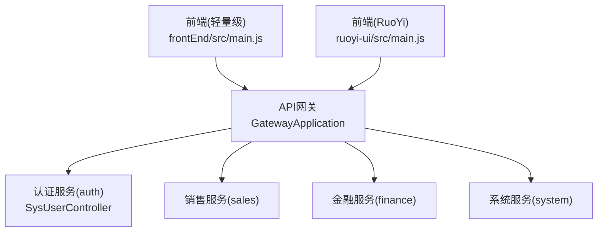
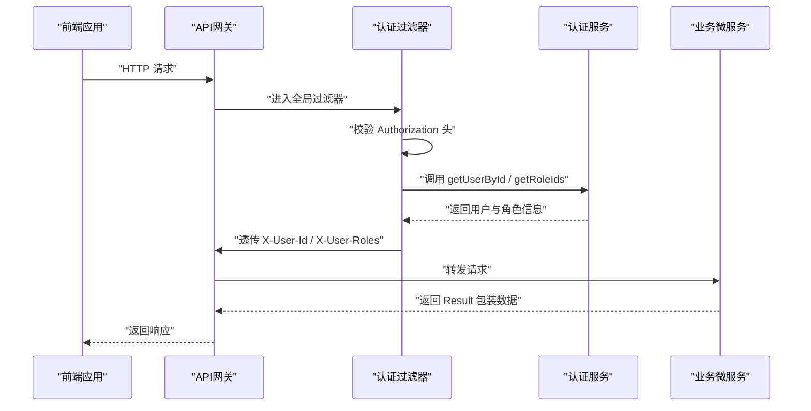
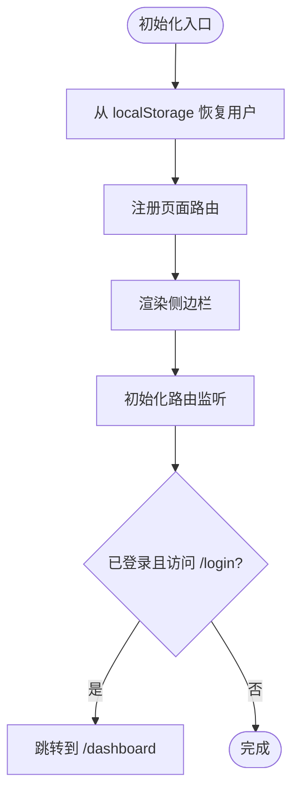
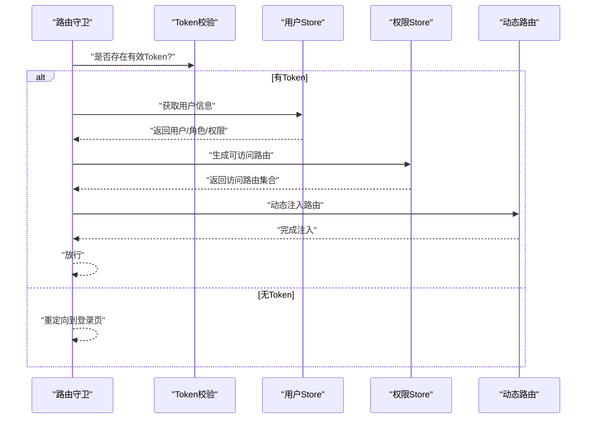
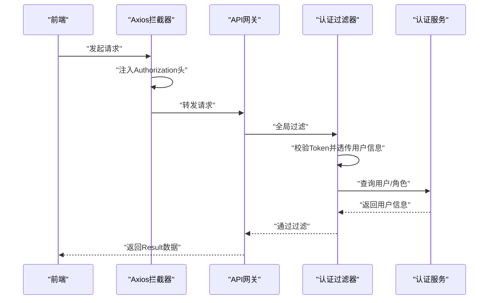
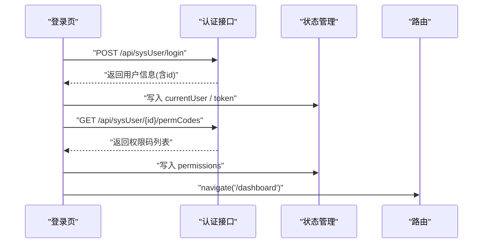
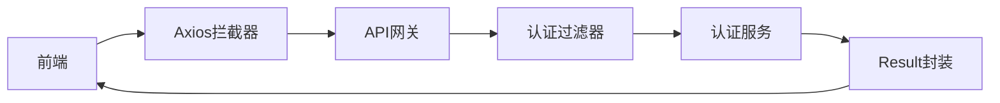

# 前后端集成架构

<cite>
**本文档引用的文件**
- [frontEnd/src/main.js](file://frontEnd/src/main.js)
- [frontEnd/src/core/router.js](file://frontEnd/src/core/router.js)
- [frontEnd/src/core/store.js](file://frontEnd/src/core/store.js)
- [frontEnd/src/api/auth.js](file://frontEnd/src/api/auth.js)
- [frontEnd/src/page/auth/login.js](file://frontEnd/src/page/auth/login.js)
- [frontEnd/src/component/sidebar.js](file://frontEnd/src/component/sidebar.js)
- [ruoyi-ui/src/main.js](file://ruoyi-ui/src/main.js)
- [ruoyi-ui/src/router/index.js](file://ruoyi-ui/src/router/index.js)
- [ruoyi-ui/src/permission.js](file://ruoyi-ui/src/permission.js)
- [ruoyi-ui/src/store/modules/user.js](file://ruoyi-ui/src/store/modules/user.js)
- [ruoyi-ui/src/store/index.js](file://ruoyi-ui/src/store/index.js)
- [ruoyi-ui/src/utils/request.js](file://ruoyi-ui/src/utils/request.js)
- [gateway/src/main/java/com/dafuweng/gateway/filter/AuthFilter.java](file://gateway/src/main/java/com/dafuweng/gateway/filter/AuthFilter.java)
- [auth/src/main/java/com/dafuweng/auth/controller/SysUserController.java](file://auth/src/main/java/com/dafuweng/auth/controller/SysUserController.java)
- [auth/src/main/java/com/dafuweng/auth/service/impl/SysUserServiceImpl.java](file://auth/src/main/java/com/dafuweng/auth/service/impl/SysUserServiceImpl.java)
- [common/src/main/java/com/dafuweng/common/entity/Result.java](file://common/src/main/java/com/dafuweng/common/entity/Result.java)
</cite>

## 目录
1. [简介](#简介)
2. [项目结构](#项目结构)
3. [核心组件](#核心组件)
4. [架构总览](#架构总览)
5. [详细组件分析](#详细组件分析)
6. [依赖分析](#依赖分析)
7. [性能考虑](#性能考虑)
8. [故障排除指南](#故障排除指南)
9. [结论](#结论)

## 简介
本文件面向NeoCC项目的前后端集成架构，重点阐述Vue3前端应用与后端微服务的集成模式，涵盖API接口调用、状态管理、路由配置、权限控制、菜单动态加载、页面访问控制、与API网关的交互流程、请求代理与错误处理、以及组件化架构与UI组件库使用。文档同时提供前后端数据交互流程图与接口调用示例，帮助开发者快速理解并扩展系统。

## 项目结构
NeoCC采用前后端分离架构：
- 前端包含两个实现：轻量级前端（frontEnd）与基于Element Plus的RuoYi前端（ruoyi-ui）。两者均通过各自入口初始化状态、路由与组件，并在ruoyi-ui中引入了完整的权限控制与Pinia状态管理。
- 后端以Spring Cloud Gateway作为API网关，统一接入认证过滤与路由转发；认证服务（auth）提供用户、角色与权限相关接口；其他业务微服务（sales、finance、system等）按领域拆分。

图表来源
- [frontEnd/src/main.js:1-37](file://frontEnd/src/main.js#L1-L37)
- [ruoyi-ui/src/main.js:1-84](file://ruoyi-ui/src/main.js#L1-L84)
- [gateway/src/main/java/com/dafuweng/gateway/filter/AuthFilter.java:1-141](file://gateway/src/main/java/com/dafuweng/gateway/filter/AuthFilter.java#L1-L141)
- [auth/src/main/java/com/dafuweng/auth/controller/SysUserController.java:1-98](file://auth/src/main/java/com/dafuweng/auth/controller/SysUserController.java#L1-L98)

章节来源
- [frontEnd/src/main.js:1-37](file://frontEnd/src/main.js#L1-L37)
- [ruoyi-ui/src/main.js:1-84](file://ruoyi-ui/src/main.js#L1-L84)

## 核心组件
- 轻量级前端核心
  - 路由：基于哈希的简单路由实现，支持精确匹配与带参数路径，提供注册、导航与初始化能力。
  - 状态：极简pub/sub状态管理，支持键值读写、订阅通知与持久化。
  - 认证：登录/登出API封装，权限码与字典加载，登录成功后写入localStorage并跳转。
  - 侧边栏：从状态读取菜单项，事件委托绑定导航。
- RuoYi前端核心
  - 应用入口：注册Element Plus、全局组件、指令与插件，挂载路由与Pinia状态。
  - 权限控制：前置守卫根据token与用户信息生成可访问路由，白名单放行。
  - 状态管理：Pinia Store模块化，用户信息、角色与权限存储，登录/登出动作。
  - 请求封装：Axios拦截器注入Authorization头，统一封装错误提示与下载逻辑。

章节来源
- [frontEnd/src/core/router.js:1-72](file://frontEnd/src/core/router.js#L1-L72)
- [frontEnd/src/core/store.js:1-35](file://frontEnd/src/core/store.js#L1-L35)
- [frontEnd/src/api/auth.js:1-33](file://frontEnd/src/api/auth.js#L1-L33)
- [frontEnd/src/component/sidebar.js:1-83](file://frontEnd/src/component/sidebar.js#L1-L83)
- [ruoyi-ui/src/router/index.js:1-68](file://ruoyi-ui/src/router/index.js#L1-L68)
- [ruoyi-ui/src/permission.js:1-78](file://ruoyi-ui/src/permission.js#L1-L78)
- [ruoyi-ui/src/store/modules/user.js:1-93](file://ruoyi-ui/src/store/modules/user.js#L1-L93)
- [ruoyi-ui/src/utils/request.js:1-154](file://ruoyi-ui/src/utils/request.js#L1-L154)

## 架构总览
NeoCC的前后端集成遵循“前端直连网关”的模式。前端通过HTTP请求访问网关，网关在全局过滤器中完成认证校验并将用户信息透传至下游微服务。后端服务统一返回标准Result包装的数据结构，前端在拦截器中解析并处理错误码与消息。

图表来源
- [gateway/src/main/java/com/dafuweng/gateway/filter/AuthFilter.java:55-134](file://gateway/src/main/java/com/dafuweng/gateway/filter/AuthFilter.java#L55-L134)
- [auth/src/main/java/com/dafuweng/auth/controller/SysUserController.java:41-53](file://auth/src/main/java/com/dafuweng/auth/controller/SysUserController.java#L41-L53)
- [common/src/main/java/com/dafuweng/common/entity/Result.java:1-50](file://common/src/main/java/com/dafuweng/common/entity/Result.java#L1-L50)

## 详细组件分析

### 轻量级前端路由与状态管理
- 路由机制
  - 通过注册函数将路径与渲染函数建立映射，支持带参数路径的正则匹配与参数提取。
  - 初始化时监听hash变化，首次触发渲染；提供navigate函数切换页面。
- 状态管理
  - 内置状态对象包含token、当前用户、字典、权限与菜单项；支持订阅回调以驱动视图更新。
  - 与localStorage配合实现跨会话持久化，入口脚本在启动时恢复登录状态。
- 侧边栏与菜单
  - 侧边栏组件从状态读取菜单项，若无则回退到默认菜单；点击事件委托触发导航。

图表来源
- [frontEnd/src/main.js:15-36](file://frontEnd/src/main.js#L15-L36)
- [frontEnd/src/core/router.js:18-50](file://frontEnd/src/core/router.js#L18-L50)
- [frontEnd/src/core/store.js:7-32](file://frontEnd/src/core/store.js#L7-L32)
- [frontEnd/src/component/sidebar.js:7-44](file://frontEnd/src/component/sidebar.js#L7-L44)

章节来源
- [frontEnd/src/main.js:1-37](file://frontEnd/src/main.js#L1-L37)
- [frontEnd/src/core/router.js:1-72](file://frontEnd/src/core/router.js#L1-L72)
- [frontEnd/src/core/store.js:1-35](file://frontEnd/src/core/store.js#L1-L35)
- [frontEnd/src/component/sidebar.js:1-83](file://frontEnd/src/component/sidebar.js#L1-L83)

### RuoYi前端路由与权限控制
- 路由配置
  - 常量路由包含登录、重定向、404/401等页面；历史模式结合滚动行为优化。
- 权限控制
  - 前置守卫根据token判断是否放行；白名单直接进入；无token则重定向登录页。
  - 首次进入时拉取用户信息并生成可访问路由，动态注入到路由器。
- 状态管理
  - 用户Store负责登录、获取信息与登出；登出仅清理本地状态并尝试调用后端接口。

图表来源
- [ruoyi-ui/src/permission.js:21-72](file://ruoyi-ui/src/permission.js#L21-L72)
- [ruoyi-ui/src/store/modules/user.js:42-73](file://ruoyi-ui/src/store/modules/user.js#L42-L73)

章节来源
- [ruoyi-ui/src/router/index.js:1-68](file://ruoyi-ui/src/router/index.js#L1-L68)
- [ruoyi-ui/src/permission.js:1-78](file://ruoyi-ui/src/permission.js#L1-L78)
- [ruoyi-ui/src/store/modules/user.js:1-93](file://ruoyi-ui/src/store/modules/user.js#L1-L93)

### 前端与API网关交互流程
- 请求代理
  - 轻量级前端通过自定义client封装POST/GET请求；RuoYi前端通过Axios拦截器自动注入Authorization头。
- 响应处理
  - 轻量级前端在登录页调用登录接口后，将用户信息与权限码写入状态；RuoYi前端在拦截器中根据code处理401/500/601等场景并弹窗提示。
- 错误处理
  - 网关过滤器对未携带或非法的Authorization头直接拒绝；对认证服务不可用返回服务不可用状态码。

图表来源
- [ruoyi-ui/src/utils/request.js:24-73](file://ruoyi-ui/src/utils/request.js#L24-L73)
- [ruoyi-ui/src/utils/request.js:75-124](file://ruoyi-ui/src/utils/request.js#L75-L124)
- [gateway/src/main/java/com/dafuweng/gateway/filter/AuthFilter.java:55-134](file://gateway/src/main/java/com/dafuweng/gateway/filter/AuthFilter.java#L55-L134)

章节来源
- [frontEnd/src/api/auth.js:1-33](file://frontEnd/src/api/auth.js#L1-L33)
- [ruoyi-ui/src/utils/request.js:1-154](file://ruoyi-ui/src/utils/request.js#L1-L154)
- [gateway/src/main/java/com/dafuweng/gateway/filter/AuthFilter.java:1-141](file://gateway/src/main/java/com/dafuweng/gateway/filter/AuthFilter.java#L1-L141)

### 认证流程与业务接口使用
- 认证流程
  - 前端提交用户名/密码到认证接口；后端返回用户实体；前端将用户id作为token存入localStorage并跳转仪表盘。
  - 登录页在成功后加载权限码与字典，并通过状态管理与导航跳转。
- 业务接口
  - 认证服务提供用户登录、登出、角色与权限码查询等接口；前端在登录成功后调用权限码接口填充状态。
  - 网关对特定公开路径放行，其余请求必须携带有效的Bearer Token。

图表来源
- [frontEnd/src/page/auth/login.js:38-84](file://frontEnd/src/page/auth/login.js#L38-L84)
- [frontEnd/src/api/auth.js:7-32](file://frontEnd/src/api/auth.js#L7-L32)
- [auth/src/main/java/com/dafuweng/auth/controller/SysUserController.java:41-47](file://auth/src/main/java/com/dafuweng/auth/controller/SysUserController.java#L41-L47)
- [auth/src/main/java/com/dafuweng/auth/controller/SysUserController.java:36-39](file://auth/src/main/java/com/dafuweng/auth/controller/SysUserController.java#L36-L39)

章节来源
- [frontEnd/src/page/auth/login.js:1-91](file://frontEnd/src/page/auth/login.js#L1-L91)
- [frontEnd/src/api/auth.js:1-33](file://frontEnd/src/api/auth.js#L1-L33)
- [auth/src/main/java/com/dafuweng/auth/controller/SysUserController.java:1-98](file://auth/src/main/java/com/dafuweng/auth/controller/SysUserController.java#L1-L98)

### 菜单动态加载与页面访问控制
- 轻量级前端
  - 侧边栏默认菜单项来源于状态；若无动态菜单，可扩展从后端拉取并写入状态，再触发渲染。
- RuoYi前端
  - 通过权限Store生成可访问路由并动态注入；路由守卫在首次进入时拉取用户信息并生成路由表，确保页面访问受控。

章节来源
- [frontEnd/src/component/sidebar.js:1-83](file://frontEnd/src/component/sidebar.js#L1-L83)
- [ruoyi-ui/src/permission.js:39-62](file://ruoyi-ui/src/permission.js#L39-L62)

### 组件化架构与UI组件库
- 轻量级前端
  - 采用原生DOM渲染与事件委托，组件职责清晰；样式独立于框架，便于迁移。
- RuoYi前端
  - 基于Vue3与Element Plus，提供丰富的UI组件（分页、富文本、文件上传等）与指令系统；全局组件与插件集中注册，提升复用性。

章节来源
- [ruoyi-ui/src/main.js:46-83](file://ruoyi-ui/src/main.js#L46-L83)

## 依赖分析
- 前端到网关
  - 轻量级前端通过自定义client发起请求；RuoYi前端通过Axios拦截器注入Authorization头。
- 网关到后端
  - 认证过滤器在全局层面对请求进行鉴权，校验Token并调用认证服务验证用户有效性，随后将用户信息透传至下游微服务。
- 后端到通用层
  - 所有服务统一返回Result包装的对象，前端在拦截器中解析并处理错误码与消息。

图表来源
- [ruoyi-ui/src/utils/request.js:18-21](file://ruoyi-ui/src/utils/request.js#L18-L21)
- [gateway/src/main/java/com/dafuweng/gateway/filter/AuthFilter.java:99-107](file://gateway/src/main/java/com/dafuweng/gateway/filter/AuthFilter.java#L99-L107)
- [common/src/main/java/com/dafuweng/common/entity/Result.java:11-32](file://common/src/main/java/com/dafuweng/common/entity/Result.java#L11-L32)

章节来源
- [ruoyi-ui/src/utils/request.js:1-154](file://ruoyi-ui/src/utils/request.js#L1-L154)
- [gateway/src/main/java/com/dafuweng/gateway/filter/AuthFilter.java:1-141](file://gateway/src/main/java/com/dafuweng/gateway/filter/AuthFilter.java#L1-L141)
- [common/src/main/java/com/dafuweng/common/entity/Result.java:1-50](file://common/src/main/java/com/dafuweng/common/entity/Result.java#L1-L50)

## 性能考虑
- 路由匹配缓存
  - 轻量级前端对正则表达式进行缓存，避免重复构建，提升参数路径匹配性能。
- 请求去重
  - RuoYi前端在Axios拦截器中对GET参数与POST/PUT请求进行去重校验，防止重复提交。
- 下载与二进制处理
  - 统一的下载方法对二进制数据与错误响应分别处理，减少前端分支判断开销。
- 状态订阅
  - 轻量级前端采用发布订阅模式，仅在状态变更时通知订阅者，降低不必要的渲染成本。

章节来源
- [frontEnd/src/core/router.js:57-71](file://frontEnd/src/core/router.js#L57-L71)
- [ruoyi-ui/src/utils/request.js:41-68](file://ruoyi-ui/src/utils/request.js#L41-L68)
- [ruoyi-ui/src/utils/request.js:127-151](file://ruoyi-ui/src/utils/request.js#L127-L151)
- [frontEnd/src/core/store.js:15-31](file://frontEnd/src/core/store.js#L15-L31)

## 故障排除指南
- 登录失败
  - 检查用户名/密码是否正确；确认后端登录接口返回的用户信息是否包含id字段；前端需将id作为token存入localStorage。
- 401未授权
  - 确认请求头是否包含有效的Authorization Bearer Token；网关过滤器会拒绝非法或缺失的Token。
- 会话过期
  - Axios拦截器检测到401时会弹窗提示并引导重新登录；前端应清理本地状态并跳转登录页。
- 路由跳转异常
  - 轻量级前端路由支持带参数路径，注意参数名与数量；若匹配不到，将回落到404页面。
- 权限不足
  - 若动态路由未生成或菜单未显示，检查用户角色与权限码是否正确下发；RuoYi前端会在首次进入时拉取用户信息并生成路由。

章节来源
- [frontEnd/src/page/auth/login.js:78-84](file://frontEnd/src/page/auth/login.js#L78-L84)
- [ruoyi-ui/src/utils/request.js:85-98](file://ruoyi-ui/src/utils/request.js#L85-L98)
- [ruoyi-ui/src/permission.js:39-62](file://ruoyi-ui/src/permission.js#L39-L62)
- [frontEnd/src/core/router.js:35-50](file://frontEnd/src/core/router.js#L35-L50)

## 结论
NeoCC通过轻量级前端与RuoYi前端两种实现，满足不同场景下的开发需求。前端与API网关的集成以“Bearer Token”为核心，结合全局认证过滤器实现统一鉴权与用户信息透传。后端服务统一返回Result结构，前端在拦截器中进行错误处理与用户体验优化。整体架构清晰、职责明确，具备良好的扩展性与维护性。