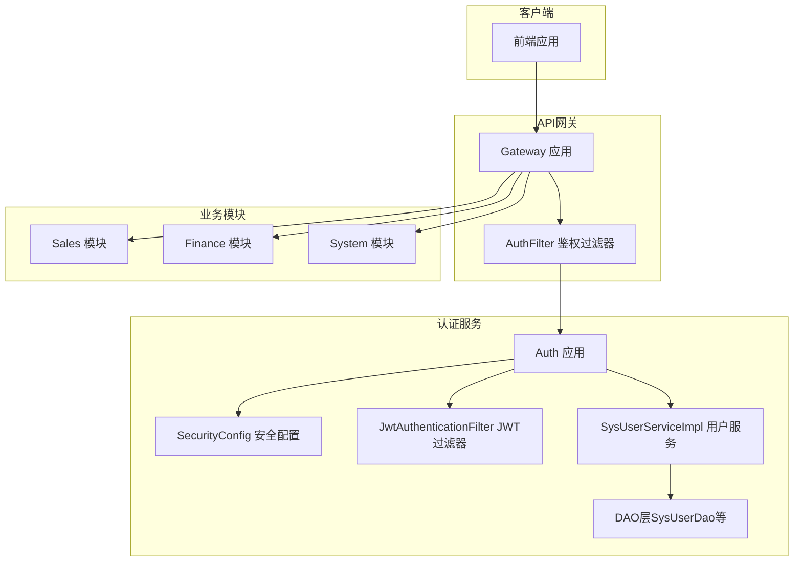
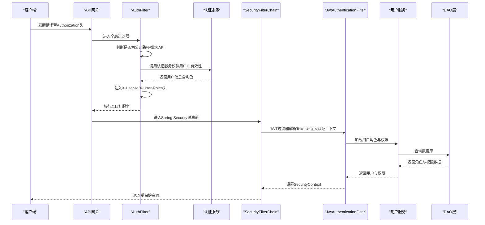
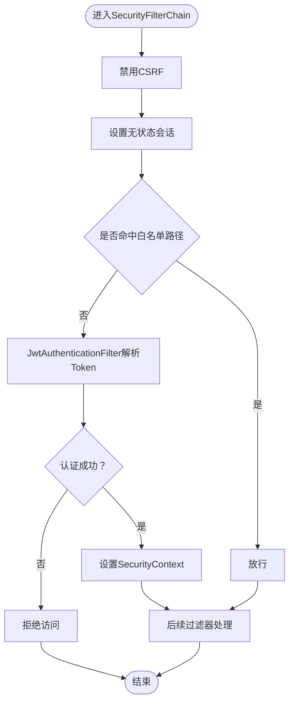
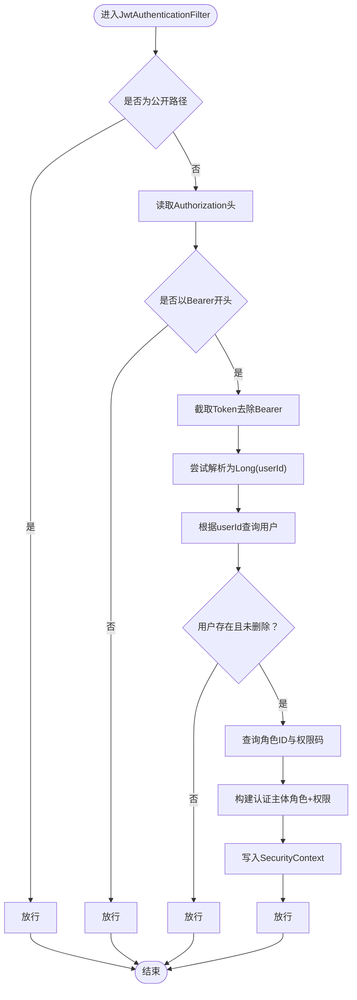
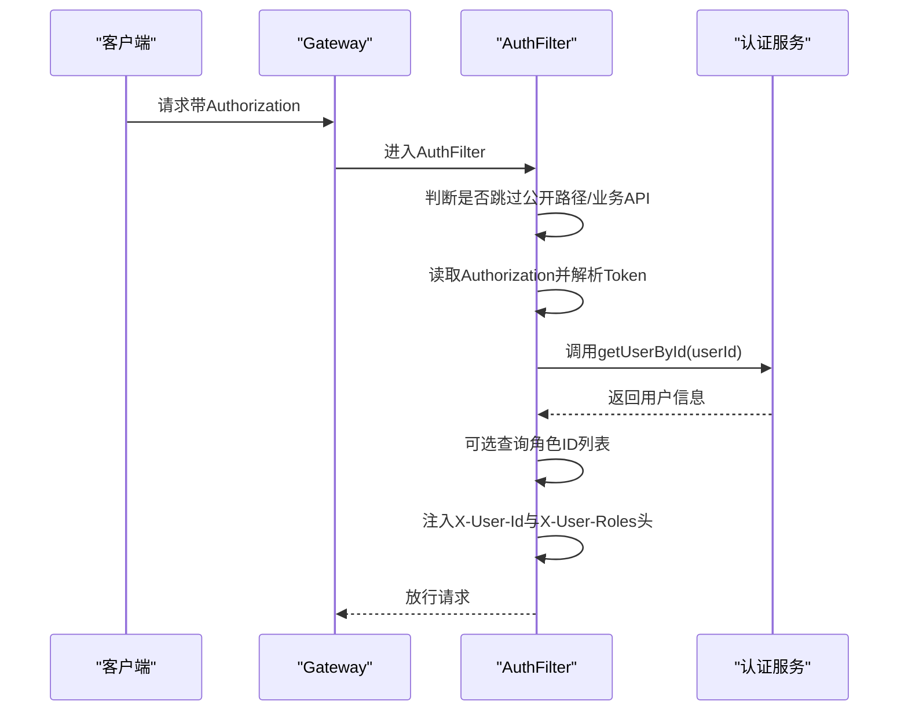
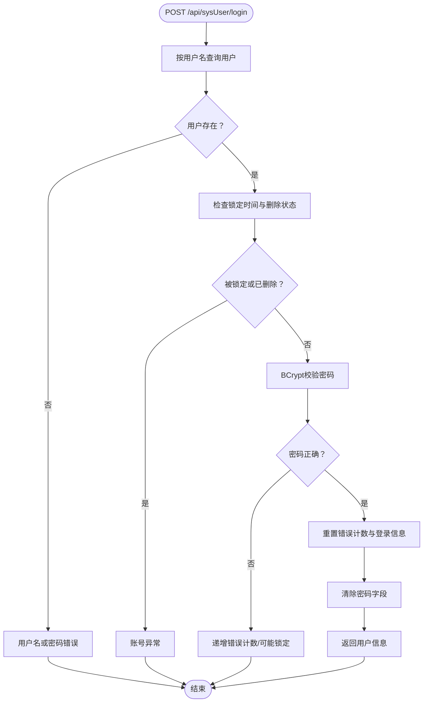
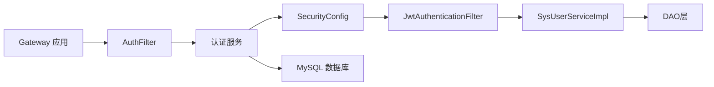
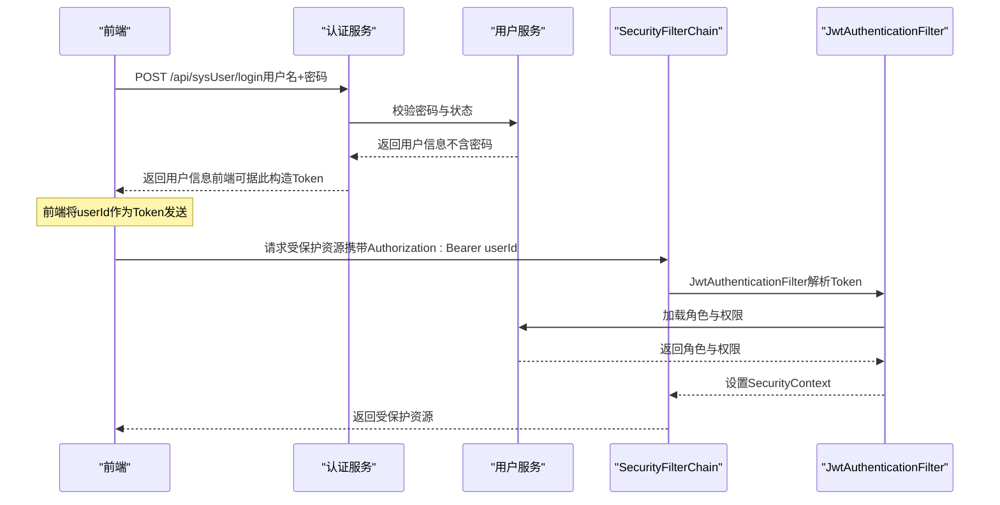

# 安全架构设计

<cite>
**本文档引用的文件**
- [SecurityConfig.java](file://auth/src/main/java/com/dafuweng/auth/config/SecurityConfig.java)
- [PasswordEncoderConfig.java](file://auth/src/main/java/com/dafuweng/auth/config/PasswordEncoderConfig.java)
- [JwtAuthenticationFilter.java](file://auth/src/main/java/com/dafuweng/auth/filter/JwtAuthenticationFilter.java)
- [SysUserController.java](file://auth/src/main/java/com/dafuweng/auth/controller/SysUserController.java)
- [SysUserServiceImpl.java](file://auth/src/main/java/com/dafuweng/auth/service/impl/SysUserServiceImpl.java)
- [SysUserEntity.java](file://auth/src/main/java/com/dafuweng/auth/entity/SysUserEntity.java)
- [SysUserDao.java](file://auth/src/main/java/com/dafuweng/auth/dao/SysUserDao.java)
- [SysUserRoleDao.java](file://auth/src/main/java/com/dafuweng/auth/dao/SysUserRoleDao.java)
- [SysPermissionDao.java](file://auth/src/main/java/com/dafuweng/auth/dao/SysPermissionDao.java)
- [SysRolePermissionDao.java](file://auth/src/main/java/com/dafuweng/auth/dao/SysRolePermissionDao.java)
- [AuthFilter.java](file://gateway/src/main/java/com/dafuweng/gateway/filter/AuthFilter.java)
- [application.yml（网关）](file://gateway/src/main/resources/application.yml)
- [application.yml（认证服务）](file://auth/src/main/resources/application.yml)
</cite>

## 目录
1. [简介](#简介)
2. [项目结构](#项目结构)
3. [核心组件](#核心组件)
4. [架构总览](#架构总览)
5. [详细组件分析](#详细组件分析)
6. [依赖分析](#依赖分析)
7. [性能考虑](#性能考虑)
8. [故障排除指南](#故障排除指南)
9. [结论](#结论)
10. [附录](#附录)

## 简介
本文件面向NeoCC项目的安全架构设计，重点阐述基于JWT的认证授权机制、Spring Security安全配置、API网关鉴权过滤机制、密码加密策略与用户认证流程、以及跨域资源共享（CORS）配置与安全头设置。文档提供安全架构图与认证流程图，并给出登录流程、Token续期与权限验证的具体实现说明。

## 项目结构
NeoCC采用微服务架构，认证与授权相关的核心组件分布在认证服务（auth）与API网关（gateway）中：
- 认证服务（auth）负责用户认证、密码加密、权限加载与安全过滤链配置
- API网关（gateway）负责统一鉴权过滤、请求转发与CORS配置
- 各业务模块（sales/finance/system）通过网关进行访问

图表来源
- [application.yml（网关）:1-165](file://gateway/src/main/resources/application.yml#L1-L165)
- [SecurityConfig.java:1-54](file://auth/src/main/java/com/dafuweng/auth/config/SecurityConfig.java#L1-L54)
- [JwtAuthenticationFilter.java:1-82](file://auth/src/main/java/com/dafuweng/auth/filter/JwtAuthenticationFilter.java#L1-L82)
- [AuthFilter.java:1-141](file://gateway/src/main/java/com/dafuweng/gateway/filter/AuthFilter.java#L1-L141)

章节来源
- [application.yml（网关）:1-165](file://gateway/src/main/resources/application.yml#L1-L165)
- [application.yml（认证服务）:1-35](file://auth/src/main/resources/application.yml#L1-L35)

## 核心组件
- Spring Security安全配置：无状态会话、禁用CSRF、白名单放行、JWT过滤器前置
- JWT过滤器：从请求头提取Token并解析用户身份，注入认证上下文
- API网关鉴权过滤器：统一拦截、Token解析、调用认证服务校验、透传用户信息
- 密码加密策略：BCrypt编码与匹配
- 用户认证流程：用户名+密码校验、锁定与错误计数、登录成功清理敏感字段
- CORS配置：全局跨域允许（开发环境）

章节来源
- [SecurityConfig.java:28-52](file://auth/src/main/java/com/dafuweng/auth/config/SecurityConfig.java#L28-L52)
- [JwtAuthenticationFilter.java:28-80](file://auth/src/main/java/com/dafuweng/auth/filter/JwtAuthenticationFilter.java#L28-L80)
- [AuthFilter.java:55-134](file://gateway/src/main/java/com/dafuweng/gateway/filter/AuthFilter.java#L55-L134)
- [PasswordEncoderConfig.java:10-13](file://auth/src/main/java/com/dafuweng/auth/config/PasswordEncoderConfig.java#L10-L13)
- [SysUserServiceImpl.java:80-118](file://auth/src/main/java/com/dafuweng/auth/service/impl/SysUserServiceImpl.java#L80-L118)
- [application.yml（网关）:136-148](file://gateway/src/main/resources/application.yml#L136-L148)

## 架构总览
下图展示从客户端到各模块的完整鉴权路径与数据流：

图表来源
- [AuthFilter.java:55-134](file://gateway/src/main/java/com/dafuweng/gateway/filter/AuthFilter.java#L55-L134)
- [SecurityConfig.java:34-51](file://auth/src/main/java/com/dafuweng/auth/config/SecurityConfig.java#L34-L51)
- [JwtAuthenticationFilter.java:28-80](file://auth/src/main/java/com/dafuweng/auth/filter/JwtAuthenticationFilter.java#L28-L80)
- [SysUserServiceImpl.java:144-166](file://auth/src/main/java/com/dafuweng/auth/service/impl/SysUserServiceImpl.java#L144-L166)
- [SysUserDao.java](file://auth/src/main/java/com/dafuweng/auth/dao/SysUserDao.java#L11)

## 详细组件分析

### Spring Security安全配置
- 无状态会话：禁用Session，每次请求均需携带Token
- 禁用CSRF：API场景无需CSRF防护
- 白名单放行：登录、分页、RuoYi前端适配接口、静态资源等
- JWT过滤器前置：在用户名密码过滤器之前执行，提前解析并注入认证信息

图表来源
- [SecurityConfig.java:34-51](file://auth/src/main/java/com/dafuweng/auth/config/SecurityConfig.java#L34-L51)

章节来源
- [SecurityConfig.java:28-52](file://auth/src/main/java/com/dafuweng/auth/config/SecurityConfig.java#L28-L52)

### JWT认证过滤器（服务端）
- 请求路径判断：对登录、分页等路径直接放行
- Token解析：从Authorization头提取Bearer Token，当前设计为userId字符串
- 用户校验：根据userId查询用户是否存在且未删除
- 权限加载：查询用户角色ID与权限码，构建认证主体
- 上下文注入：将认证信息写入SecurityContextHolder

图表来源
- [JwtAuthenticationFilter.java:28-80](file://auth/src/main/java/com/dafuweng/auth/filter/JwtAuthenticationFilter.java#L28-L80)

章节来源
- [JwtAuthenticationFilter.java:28-80](file://auth/src/main/java/com/dafuweng/auth/filter/JwtAuthenticationFilter.java#L28-L80)

### API网关鉴权过滤器
- 路径跳过：登录/RuoYi公开接口、业务API（/api/**）、系统管理（/system/**）直接放行
- Token解析：从Authorization头提取Bearer Token，当前设计为userId字符串
- 调用认证服务：通过Feign调用认证服务的用户查询接口，校验用户有效性
- 透传用户信息：将userId与角色ID列表注入下游请求头（X-User-Id、X-User-Roles）

图表来源
- [AuthFilter.java:55-134](file://gateway/src/main/java/com/dafuweng/gateway/filter/AuthFilter.java#L55-L134)

章节来源
- [AuthFilter.java:55-134](file://gateway/src/main/java/com/dafuweng/gateway/filter/AuthFilter.java#L55-L134)

### 密码加密策略与用户认证流程
- 密码加密：使用BCryptPasswordEncoder进行编码与匹配
- 登录流程：按用户名查询用户，检查锁定状态与删除状态，使用BCrypt校验密码；成功则重置错误计数与登录信息，失败则递增错误计数并可能锁定账户
- 敏感字段处理：登录成功后清除密码字段，避免返回给前端

图表来源
- [SysUserServiceImpl.java:80-118](file://auth/src/main/java/com/dafuweng/auth/service/impl/SysUserServiceImpl.java#L80-L118)
- [SysUserEntity.java:37-43](file://auth/src/main/java/com/dafuweng/auth/entity/SysUserEntity.java#L37-L43)

章节来源
- [PasswordEncoderConfig.java:10-13](file://auth/src/main/java/com/dafuweng/auth/config/PasswordEncoderConfig.java#L10-L13)
- [SysUserServiceImpl.java:80-118](file://auth/src/main/java/com/dafuweng/auth/service/impl/SysUserServiceImpl.java#L80-L118)
- [SysUserEntity.java:37-43](file://auth/src/main/java/com/dafuweng/auth/entity/SysUserEntity.java#L37-L43)

### 跨域资源共享（CORS）与安全头
- 网关CORS：在application.yml中配置全局CORS，允许GET/POST/PUT/DELETE/OPTIONS，允许任意头部与来源，关闭凭据，设置缓存时间
- 安全头：当前配置未显式设置额外安全响应头（如X-Content-Type-Options、X-Frame-Options等），建议在生产环境补充

章节来源
- [application.yml（网关）:136-148](file://gateway/src/main/resources/application.yml#L136-L148)

## 依赖分析
- 认证服务依赖Spring Security与MyBatis-Plus，使用BCrypt进行密码处理
- 网关依赖Spring Cloud Gateway与Nacos，通过Feign调用认证服务
- 用户服务依赖DAO层进行角色与权限查询

图表来源
- [AuthFilter.java:1-141](file://gateway/src/main/java/com/dafuweng/gateway/filter/AuthFilter.java#L1-L141)
- [SecurityConfig.java:1-54](file://auth/src/main/java/com/dafuweng/auth/config/SecurityConfig.java#L1-L54)
- [JwtAuthenticationFilter.java:1-82](file://auth/src/main/java/com/dafuweng/auth/filter/JwtAuthenticationFilter.java#L1-L82)
- [SysUserServiceImpl.java:1-229](file://auth/src/main/java/com/dafuweng/auth/service/impl/SysUserServiceImpl.java#L1-L229)

章节来源
- [SysUserRoleDao.java](file://auth/src/main/java/com/dafuweng/auth/dao/SysUserRoleDao.java#L13)
- [SysPermissionDao.java](file://auth/src/main/java/com/dafuweng/auth/dao/SysPermissionDao.java#L19)
- [SysRolePermissionDao.java](file://auth/src/main/java/com/dafuweng/auth/dao/SysRolePermissionDao.java#L13)

## 性能考虑
- JWT过滤器每次请求均需解析Token并查询用户与权限，建议在网关层做轻量校验（仅校验用户存在性），服务端再按需加载权限
- 权限查询涉及多表关联，建议在认证服务侧增加缓存（如Redis）以降低数据库压力
- 登录错误计数与锁定逻辑可结合分布式锁与缓存，避免并发问题

## 故障排除指南
- 未携带或格式错误的Authorization头：网关与服务端均会直接放行或返回未授权，检查前端是否正确设置Bearer Token
- 用户不存在或已删除：JwtAuthenticationFilter与AuthFilter均会拒绝请求，检查用户ID与状态
- Feign调用失败：确认认证服务健康状态与路由配置，检查Nacos注册情况
- CORS问题：确认网关CORS配置与前端请求域名一致，生产环境建议限制allowedOrigins

章节来源
- [AuthFilter.java:80-107](file://gateway/src/main/java/com/dafuweng/gateway/filter/AuthFilter.java#L80-L107)
- [JwtAuthenticationFilter.java:54-58](file://auth/src/main/java/com/dafuweng/auth/filter/JwtAuthenticationFilter.java#L54-L58)

## 结论
NeoCC的安全架构以无状态JWT为核心，结合API网关统一鉴权与服务端细粒度权限注入，形成前后端分离的认证授权体系。当前实现满足开发与测试需求，建议在生产环境完善安全响应头、细化CORS配置与引入权限缓存，进一步提升安全性与性能。

## 附录

### 登录流程（含Token解析与权限注入）

图表来源
- [SysUserController.java:41-47](file://auth/src/main/java/com/dafuweng/auth/controller/SysUserController.java#L41-L47)
- [SysUserServiceImpl.java:80-118](file://auth/src/main/java/com/dafuweng/auth/service/impl/SysUserServiceImpl.java#L80-L118)
- [JwtAuthenticationFilter.java:49-74](file://auth/src/main/java/com/dafuweng/auth/filter/JwtAuthenticationFilter.java#L49-L74)