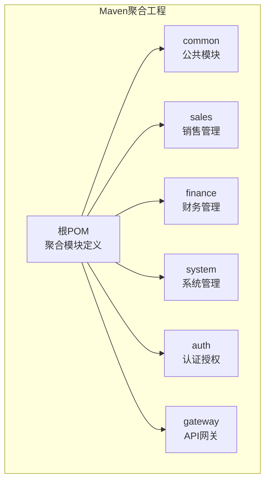
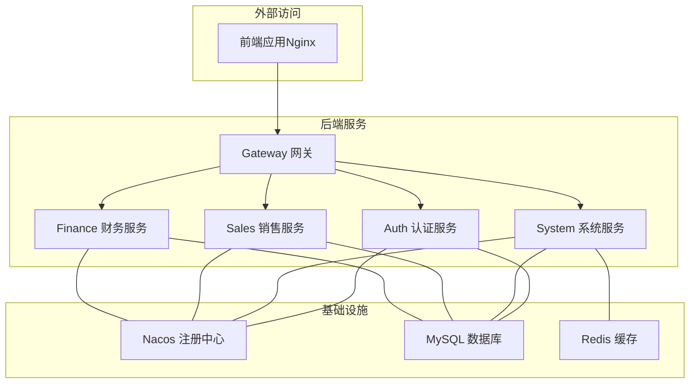
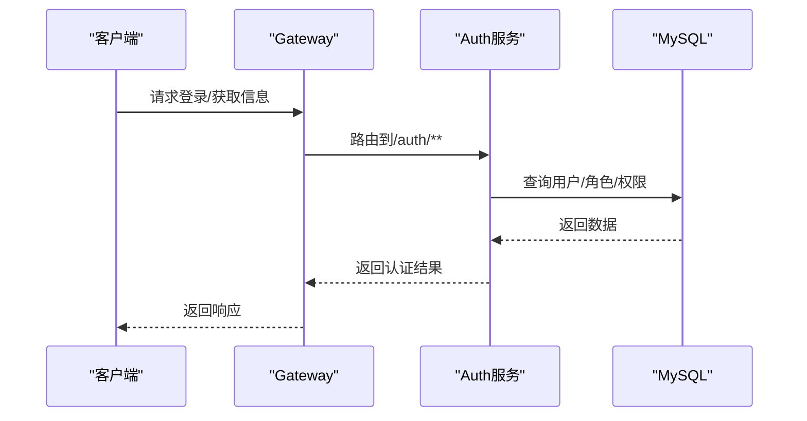
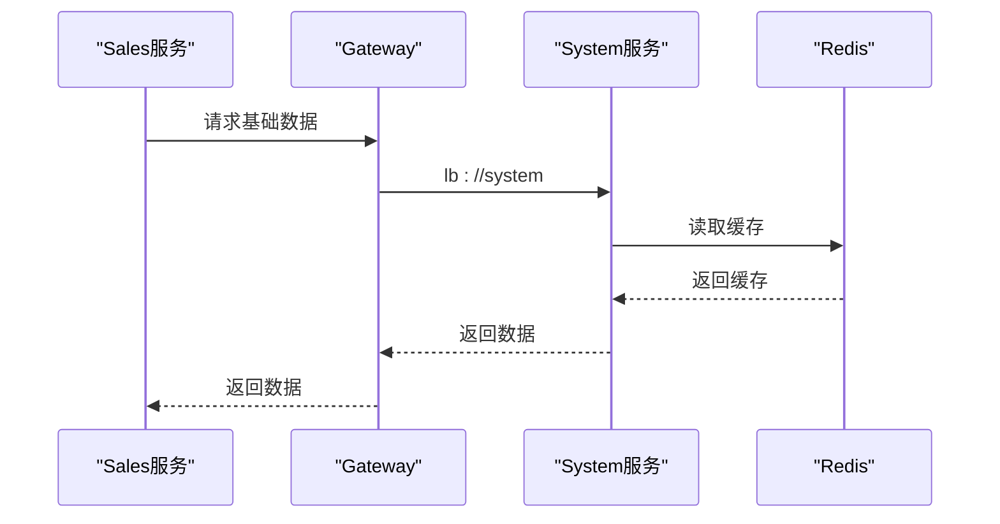
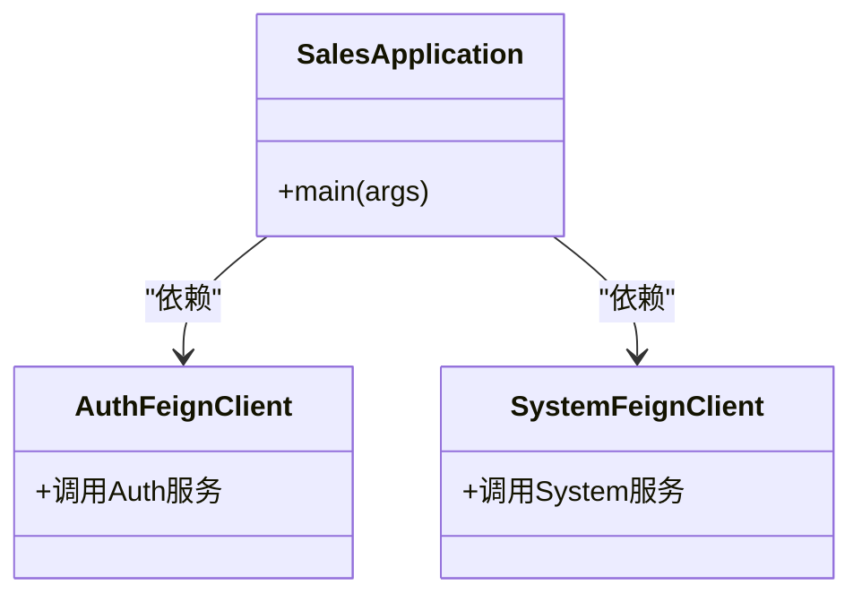
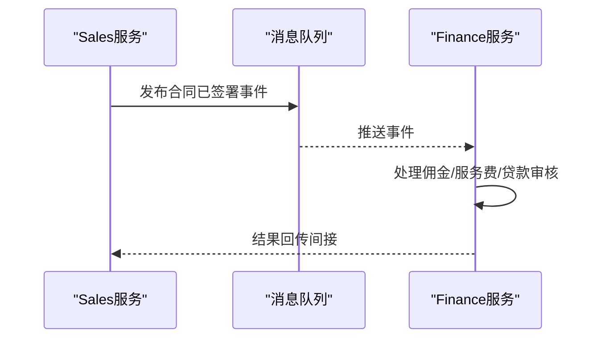
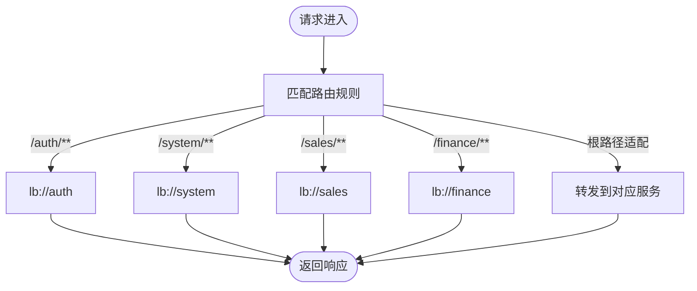
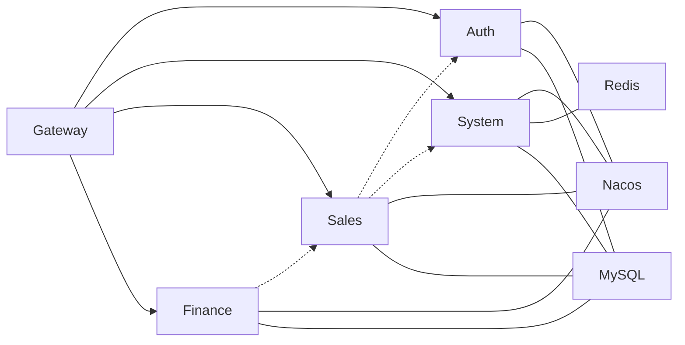
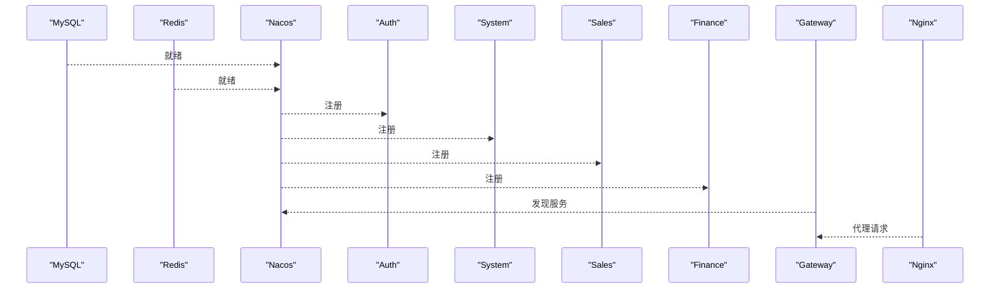

# 微服务架构设计

<cite>
**本文引用的文件**
- [pom.xml](file://pom.xml)
- [docker-compose.yml](file://docker-compose.yml)
- [gateway/src/main/resources/application.yml](file://gateway/src/main/resources/application.yml)
- [auth/src/main/resources/application.yml](file://auth/src/main/resources/application.yml)
- [sales/src/main/resources/application.yml](file://sales/src/main/resources/application.yml)
- [finance/src/main/resources/application.yml](file://finance/src/main/resources/application.yml)
- [system/src/main/resources/application.yml](file://system/src/main/resources/application.yml)
- [auth/Dockerfile](file://auth/Dockerfile)
- [sales/Dockerfile](file://sales/Dockerfile)
- [finance/Dockerfile](file://finance/Dockerfile)
- [system/Dockerfile](file://system/Dockerfile)
- [gateway/Dockerfile](file://gateway/Dockerfile)
- [sales/src/main/java/com/dafuweng/sales/SalesApplication.java](file://sales/src/main/java/com/dafuweng/sales/SalesApplication.java)
- [finance/src/main/java/com/dafuweng/finance/FinanceApplication.java](file://finance/src/main/java/com/dafuweng/finance/FinanceApplication.java)
- [system/src/main/java/com/dafuweng/system/SystemApplication.java](file://system/src/main/java/com/dafuweng/system/SystemApplication.java)
</cite>

## 目录
1. [引言](#引言)
2. [项目结构](#项目结构)
3. [核心组件](#核心组件)
4. [架构总览](#架构总览)
5. [详细组件分析](#详细组件分析)
6. [依赖分析](#依赖分析)
7. [性能考虑](#性能考虑)
8. [故障排查指南](#故障排查指南)
9. [结论](#结论)
10. [附录](#附录)

## 引言
本设计文档面向NeoCC项目的微服务架构，围绕Spring Cloud生态下的服务拆分与治理展开，重点覆盖以下方面：
- 四大核心服务模块的职责边界与业务逻辑划分（认证授权、系统管理、销售管理、财务管理）
- 服务注册与发现机制（Nacos）
- 服务间通信方式（OpenFeign远程调用）
- 负载均衡与容错策略
- 容器化部署架构（Docker Compose编排与服务依赖）
- 监控、日志与分布式追踪的实现思路
- 服务架构图与部署拓扑图，明确启动顺序与依赖关系

## 项目结构
NeoCC采用多模块Maven聚合工程组织，包含公共模块与六个子模块：common、sales、finance、system、auth、gateway。整体以网关为中心，围绕认证授权、系统管理、销售管理、财务管理和前端UI进行服务化拆分。

**图表来源**
- [pom.xml:12-19](file://pom.xml#L12-L19)

**章节来源**
- [pom.xml:1-22](file://pom.xml#L1-L22)

## 核心组件
- 认证授权服务（auth）：负责用户认证、角色与权限管理，提供统一鉴权能力，并被其他服务通过Feign或网关路由调用。
- 系统管理服务（system）：提供字典、参数、区域、部门等基础数据与操作日志能力，常与缓存结合提升性能。
- 销售管理服务（sales）：负责客户、合同、联系记录、业绩记录、工作日志等销售全链路数据与流程。
- 财务管理服务（finance）：负责银行账户、产品、贷款审核、佣金与服务费记录等财务相关业务。
- 网关服务（gateway）：统一入口，负责路由转发、跨域、鉴权过滤与服务聚合。
- 公共模块（common）：提供全局异常、通用实体、数据权限切面、消息队列配置等横切能力。

上述职责边界在各模块的controller、service与dao层中体现，且通过Feign客户端在服务间进行声明式调用。

**章节来源**
- [sales/src/main/java/com/dafuweng/sales/SalesApplication.java:11](file://sales/src/main/java/com/dafuweng/sales/SalesApplication.java#L11)
- [finance/src/main/java/com/dafuweng/finance/FinanceApplication.java:13](file://finance/src/main/java/com/dafuweng/finance/FinanceApplication.java#L13)
- [system/src/main/java/com/dafuweng/system/SystemApplication.java:10](file://system/src/main/java/com/dafuweng/system/SystemApplication.java#L10)

## 架构总览
NeoCC采用“网关+多微服务”的架构模式，服务注册与发现使用Nacos，服务间通信采用OpenFeign，数据库按模块分离，Redis用于系统模块缓存。

**图表来源**
- [docker-compose.yml:4-182](file://docker-compose.yml#L4-L182)
- [gateway/src/main/resources/application.yml:10-51](file://gateway/src/main/resources/application.yml#L10-L51)

## 详细组件分析

### 认证授权服务（auth）
- 职责边界：用户、角色、权限的增删改查与鉴权；为前端提供登录、获取用户信息、菜单路由等接口。
- 技术要点：MyBatis-Plus映射、安全配置与JWT过滤器、Nacos注册与发现。
- 与其他服务交互：被网关路由到特定路径；可作为上游服务被其他模块通过Feign调用（如销售、系统模块需要用户信息时）。

**图表来源**
- [gateway/src/main/resources/application.yml:24-35](file://gateway/src/main/resources/application.yml#L24-L35)
- [auth/src/main/resources/application.yml:12-18](file://auth/src/main/resources/application.yml#L12-L18)

**章节来源**
- [auth/src/main/resources/application.yml:1-35](file://auth/src/main/resources/application.yml#L1-L35)

### 系统管理服务（system）
- 职责边界：字典、参数、区域、部门等基础数据管理，操作日志记录。
- 技术要点：Redis缓存、MyBatis-Plus、AOP日志切面。
- 与其他服务交互：被网关路由到/system/**；销售、财务等模块可能通过Feign调用其基础数据能力。

**图表来源**
- [gateway/src/main/resources/application.yml:47-51](file://gateway/src/main/resources/application.yml#L47-L51)
- [system/src/main/resources/application.yml:12-17](file://system/src/main/resources/application.yml#L12-L17)

**章节来源**
- [system/src/main/resources/application.yml:1-41](file://system/src/main/resources/application.yml#L1-L41)

### 销售管理服务（sales）
- 职责边界：客户、合同、联系记录、业绩记录、工作日志等销售全链路业务。
- 技术要点：OpenFeign客户端（Auth、System）、定时任务、MyBatis-Plus。
- 与其他服务交互：通过Feign调用Auth（用户信息）、System（基础数据）；对外暴露REST接口供网关路由。

**图表来源**
- [sales/src/main/java/com/dafuweng/sales/SalesApplication.java:11](file://sales/src/main/java/com/dafuweng/sales/SalesApplication.java#L11)

**章节来源**
- [sales/src/main/java/com/dafuweng/sales/SalesApplication.java:1-17](file://sales/src/main/java/com/dafuweng/sales/SalesApplication.java#L1-L17)
- [sales/src/main/resources/application.yml:1-35](file://sales/src/main/resources/application.yml#L1-L35)

### 财务管理服务（finance）
- 职责边界：银行账户、金融产品、贷款审核、佣金与服务费记录等财务业务。
- 技术要点：RabbitMQ监听器、OpenFeign客户端（Sales）、MyBatis-Plus。
- 与其他服务交互：通过Feign调用Sales（合同状态变更事件驱动）；内部使用消息队列解耦异步处理。

**图表来源**
- [finance/src/main/java/com/dafuweng/finance/FinanceApplication.java:13](file://finance/src/main/java/com/dafuweng/finance/FinanceApplication.java#L13)

**章节来源**
- [finance/src/main/java/com/dafuweng/finance/FinanceApplication.java:1-20](file://finance/src/main/java/com/dafuweng/finance/FinanceApplication.java#L1-L20)
- [finance/src/main/resources/application.yml:1-32](file://finance/src/main/resources/application.yml#L1-L32)

### 网关服务（gateway）
- 职责边界：统一入口、路由规则、跨域配置、鉴权过滤。
- 技术要点：Spring Cloud Gateway、Nacos服务发现、lb://负载均衡。
- 路由策略：对/auth、/sales、/finance、/system等路径进行定向转发；对部分根路径做前端适配。

**图表来源**
- [gateway/src/main/resources/application.yml:17-51](file://gateway/src/main/resources/application.yml#L17-L51)

**章节来源**
- [gateway/src/main/resources/application.yml:1-165](file://gateway/src/main/resources/application.yml#L1-L165)

## 依赖分析
- 服务注册与发现：所有服务均配置Nacos发现，其中auth、system在application.yml中启用Nacos发现；sales、finance在应用类上启用@EnableDiscoveryClient；gateway通过Nacos进行服务发现并配合lb://实现负载均衡。
- 服务间通信：sales与finance通过OpenFeign客户端声明式调用；gateway对内路由至具体服务实例。
- 数据存储：auth、system、sales、finance各自独立数据库；system同时连接Redis缓存。
- 依赖关系：gateway依赖auth、system、sales、finance；前端依赖gateway；基础设施依赖Nacos、MySQL、Redis。

**图表来源**
- [sales/src/main/java/com/dafuweng/sales/SalesApplication.java:11](file://sales/src/main/java/com/dafuweng/sales/SalesApplication.java#L11)
- [finance/src/main/java/com/dafuweng/finance/FinanceApplication.java:13](file://finance/src/main/java/com/dafuweng/finance/FinanceApplication.java#L13)
- [gateway/src/main/resources/application.yml:10-51](file://gateway/src/main/resources/application.yml#L10-L51)

**章节来源**
- [sales/src/main/java/com/dafuweng/sales/SalesApplication.java:11](file://sales/src/main/java/com/dafuweng/sales/SalesApplication.java#L11)
- [finance/src/main/java/com/dafuweng/finance/FinanceApplication.java:13](file://finance/src/main/java/com/dafuweng/finance/FinanceApplication.java#L13)
- [system/src/main/java/com/dafuweng/system/SystemApplication.java:10](file://system/src/main/java/com/dafuweng/system/SystemApplication.java#L10)

## 性能考虑
- 负载均衡与容错：网关使用lb://结合Nacos实现软负载均衡；建议在生产环境开启重试与熔断（如Resilience4j），并配置超时与降级策略。
- 缓存优化：系统模块使用Redis缓存热点数据，减少数据库压力；建议对高频查询接口增加本地缓存与过期策略。
- 数据库隔离：四模块独立数据库，避免单点瓶颈；建议对写密集表进行分表分库与索引优化。
- 并发与异步：财务模块使用消息队列异步处理，降低同步调用延迟；建议引入限流与削峰策略。

## 故障排查指南
- 服务无法注册到Nacos：检查服务端口、Nacos地址、命名空间与用户名密码配置是否一致。
- 网关路由失败：确认路由规则与lb://目标服务名是否正确；检查服务健康状态。
- 数据库连接异常：核对数据库URL、账号密码与网络连通性；确认容器间网络与健康检查。
- 缓存不可用：检查Redis连接参数与网络；确认缓存键前缀与序列化配置。
- 日志与监控：建议接入统一日志收集（如ELK）与指标监控（Prometheus+Grafana），并为关键链路埋点追踪（Zipkin/SkyWalking）。

## 结论
NeoCC基于Spring Cloud实现了清晰的微服务拆分与治理，认证授权、系统管理、销售管理、财务管理四大模块职责明确，配合Nacos、OpenFeign与网关形成高内聚低耦合的服务体系。通过Docker Compose实现容器化编排，具备良好的扩展性与可运维性。后续可在容错、缓存与监控方面进一步完善，以满足生产级需求。

## 附录

### 服务启动顺序与依赖关系
- 基础设施：MySQL、Redis、Nacos
- 业务服务：Auth → System → Sales → Finance
- 网关与前端：Gateway → Nginx（前端）

**图表来源**
- [docker-compose.yml:21-159](file://docker-compose.yml#L21-L159)

**章节来源**
- [docker-compose.yml:1-182](file://docker-compose.yml#L1-L182)

### 容器化部署与编排
- 使用Docker Compose编排，定义Nacos、MySQL、Redis、各业务服务与网关、Nginx前端镜像与端口映射。
- 各服务通过Dockerfile构建镜像并暴露端口；服务间通过容器网络互通。
- 环境变量统一配置数据库、缓存与Nacos地址；健康检查确保依赖服务就绪后再启动业务服务。

**章节来源**
- [auth/Dockerfile:1-13](file://auth/Dockerfile#L1-L13)
- [system/Dockerfile:1-13](file://system/Dockerfile#L1-L13)
- [sales/Dockerfile:1-13](file://sales/Dockerfile#L1-L13)
- [finance/Dockerfile:1-13](file://finance/Dockerfile#L1-L13)
- [gateway/Dockerfile:1-13](file://gateway/Dockerfile#L1-L13)
- [docker-compose.yml:58-173](file://docker-compose.yml#L58-L173)