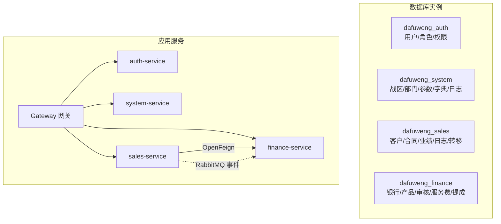
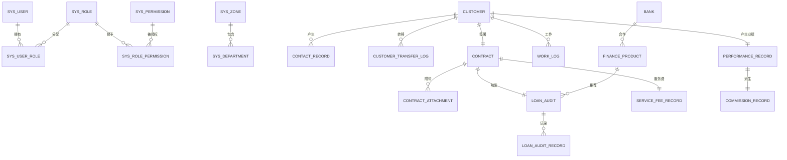
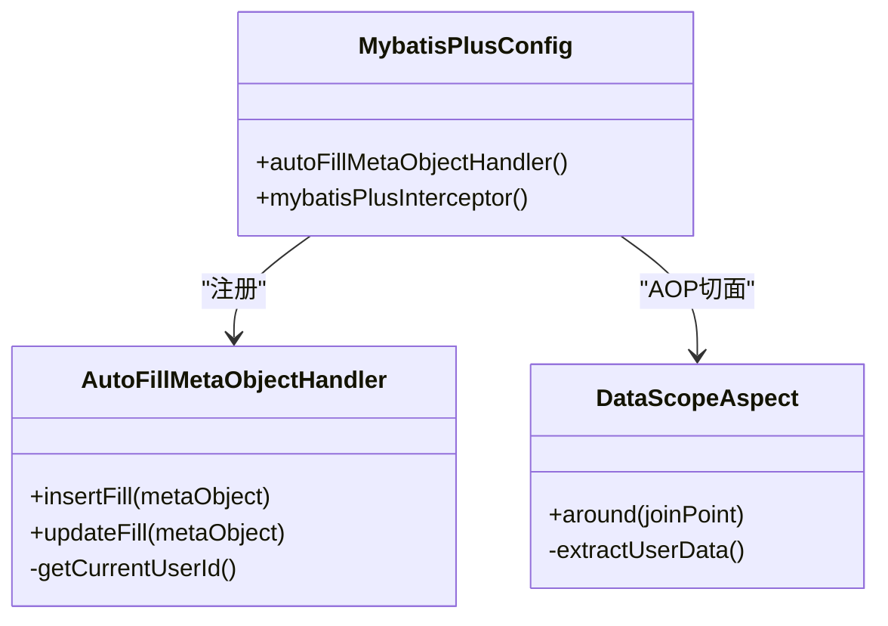
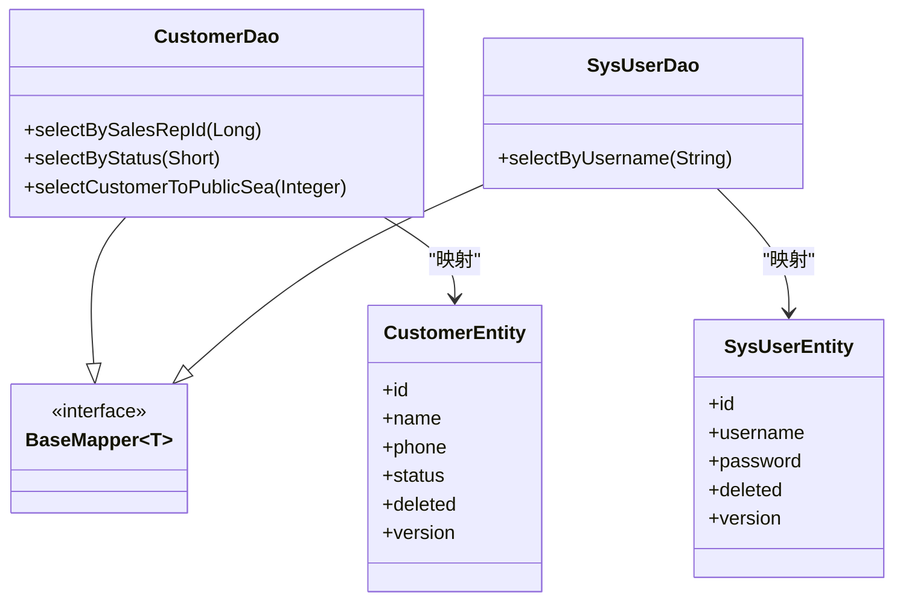
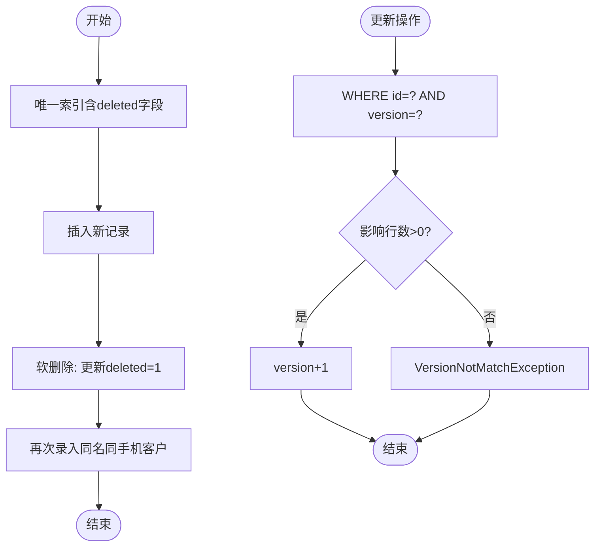
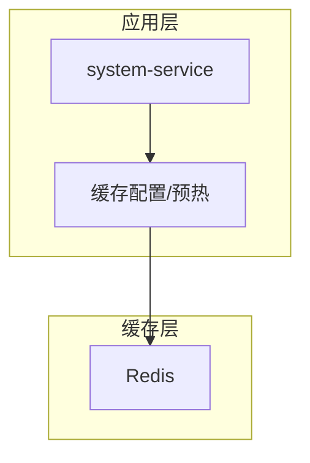
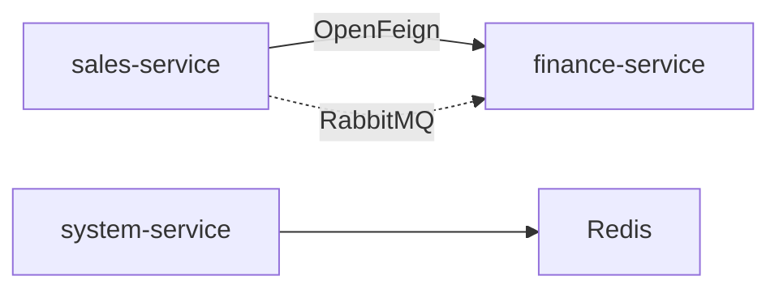

# 数据架构设计

<cite>
**本文引用的文件**
- [database.sql](file://database.sql)
- [dataDesign.md](file://dataDesign.md)
- [MybatisPlusConfig.java](file://common/src/main/java/com/dafuweng/common/config/MybatisPlusConfig.java)
- [AutoFillMetaObjectHandler.java](file://common/src/main/java/com/dafuweng/common/config/AutoFillMetaObjectHandler.java)
- [DataScopeAspect.java](file://common/src/main/java/com/dafuweng/common/config/DataScopeAspect.java)
- [SysUserEntity.java](file://auth/src/main/java/com/dafuweng/auth/entity/SysUserEntity.java)
- [SysUserDao.xml](file://auth/src/main/resources/auth/mapper/SysUserDao.xml)
- [CustomerEntity.java](file://sales/src/main/java/com/dafuweng/sales/entity/CustomerEntity.java)
- [ContractEntity.java](file://sales/src/main/java/com/dafuweng/sales/entity/ContractEntity.java)
- [SysDictEntity.java](file://system/src/main/java/com/dafuweng/system/entity/SysDictEntity.java)
- [CustomerDao.java](file://sales/src/main/java/com/dafuweng/sales/dao/CustomerDao.java)
- [init-db.sql](file://scripts/init-db.sql)
- [docker-compose.yml](file://docker-compose.yml)
</cite>

## 目录
1. [简介](#简介)
2. [项目结构](#项目结构)
3. [核心组件](#核心组件)
4. [架构总览](#架构总览)
5. [详细组件分析](#详细组件分析)
6. [依赖关系分析](#依赖关系分析)
7. [性能考量](#性能考量)
8. [故障排查指南](#故障排查指南)
9. [结论](#结论)
10. [附录](#附录)

## 简介
本文件面向NeoCC项目的数据库与数据访问层，系统性阐述垂直拆分的四库一鉴权架构、MyBatis-Plus ORM配置与使用、DAO层设计模式、数据一致性保障机制、缓存架构以及数据库ER图与表结构设计。目标是帮助开发者与运维人员快速理解并高效维护该数据体系。

## 项目结构
项目采用“垂直拆分”的数据库架构：四个独立MySQL库分别承载不同业务域，认证与鉴权独立为鉴权库，跨库查询通过应用层OpenFeign与消息中间件实现，避免数据库层耦合。

- 鉴权库：dafuweng_auth（用户、角色、权限）
- 系统库：dafuweng_system（战区、部门、参数、字典、操作日志）
- 销售库：dafuweng_sales（客户、洽谈、合同、业绩、工作日志、转移日志）
- 财务库：dafuweng_finance（银行、产品、贷款审核、审核记录、服务费、提成）

图表来源
- [docker-compose.yml:27-139](file://docker-compose.yml#L27-L139)

章节来源
- [database.sql:11-14](file://database.sql#L11-L14)
- [dataDesign.md:14-26](file://dataDesign.md#L14-L26)
- [docker-compose.yml:27-139](file://docker-compose.yml#L27-L139)

## 核心组件
- 垂直拆分策略：按业务域拆分，库间零交叉，跨库查询在应用层实现。
- MyBatis-Plus全局配置：自动填充、乐观锁、分页插件。
- DAO层设计：BaseMapper接口 + XML映射；实体类注解驱动。
- 数据一致性：逻辑删除、乐观锁、审核轨迹、跨库事件。
- 缓存架构：Redis用于热点数据与会话缓存，结合预热与失效策略。

章节来源
- [dataDesign.md:12-46](file://dataDesign.md#L12-L46)
- [MybatisPlusConfig.java:14-28](file://common/src/main/java/com/dafuweng/common/config/MybatisPlusConfig.java#L14-L28)
- [AutoFillMetaObjectHandler.java:23-45](file://common/src/main/java/com/dafuweng/common/config/AutoFillMetaObjectHandler.java#L23-L45)
- [docker-compose.yml:47-56](file://docker-compose.yml#L47-L56)

## 架构总览
下图展示四库的ER关系与跨库交互：

图表来源
- [database.sql:22-618](file://database.sql#L22-L618)

章节来源
- [dataDesign.md:49-323](file://dataDesign.md#L49-L323)
- [database.sql:16-647](file://database.sql#L16-L647)

## 详细组件分析

### 数据库垂直拆分与库设计理念
- dafuweng_auth：认证授权，与业务解耦，通过OpenFeign校验Token。
- dafuweng_system：组织架构与系统参数，统一字典与操作审计。
- dafuweng_sales：销售核心，围绕客户、合同、业绩形成闭环。
- dafuweng_finance：金融核心，以贷款审核为主线，保留不可篡改的审核轨迹。

章节来源
- [dataDesign.md:49-157](file://dataDesign.md#L49-L157)
- [dataDesign.md:160-323](file://dataDesign.md#L160-L323)

### MyBatis-Plus ORM配置与使用
- 自动填充：统一在插入/更新时填充创建/更新时间与用户ID，无用户上下文时安全降级。
- 乐观锁：version字段随更新递增，冲突时抛异常。
- 分页查询：全局注册分页插件，按数据库类型选择适配器。
- 数据权限：AOP切面从SecurityContext提取用户数据范围，注入XML中的OGNL条件。

图表来源
- [MybatisPlusConfig.java:14-28](file://common/src/main/java/com/dafuweng/common/config/MybatisPlusConfig.java#L14-L28)
- [AutoFillMetaObjectHandler.java:23-86](file://common/src/main/java/com/dafuweng/common/config/AutoFillMetaObjectHandler.java#L23-L86)
- [DataScopeAspect.java:25-92](file://common/src/main/java/com/dafuweng/common/config/DataScopeAspect.java#L25-L92)

章节来源
- [MybatisPlusConfig.java:14-28](file://common/src/main/java/com/dafuweng/common/config/MybatisPlusConfig.java#L14-L28)
- [AutoFillMetaObjectHandler.java:23-86](file://common/src/main/java/com/dafuweng/common/config/AutoFillMetaObjectHandler.java#L23-L86)
- [DataScopeAspect.java:25-92](file://common/src/main/java/com/dafuweng/common/config/DataScopeAspect.java#L25-L92)

### 数据访问层设计模式（DAO/实体/XML）
- DAO接口：继承BaseMapper，获得通用CRUD能力，并可扩展自定义方法。
- 实体类：通过注解映射表与字段，支持逻辑删除与乐观锁。
- XML映射：定义SQL与结果映射，支持复杂查询与批量操作。

图表来源
- [CustomerDao.java:10-18](file://sales/src/main/java/com/dafuweng/sales/dao/CustomerDao.java#L10-L18)
- [CustomerEntity.java:14-76](file://sales/src/main/java/com/dafuweng/sales/entity/CustomerEntity.java#L14-L76)
- [SysUserDao.xml:4-36](file://auth/src/main/resources/auth/mapper/SysUserDao.xml#L4-L36)
- [SysUserEntity.java:12-58](file://auth/src/main/java/com/dafuweng/auth/entity/SysUserEntity.java#L12-L58)

章节来源
- [CustomerDao.java:10-18](file://sales/src/main/java/com/dafuweng/sales/dao/CustomerDao.java#L10-L18)
- [CustomerEntity.java:14-76](file://sales/src/main/java/com/dafuweng/sales/entity/CustomerEntity.java#L14-L76)
- [SysUserDao.xml:4-36](file://auth/src/main/resources/auth/mapper/SysUserDao.xml#L4-L36)
- [SysUserEntity.java:12-58](file://auth/src/main/java/com/dafuweng/auth/entity/SysUserEntity.java#L12-L58)

### 数据一致性保证机制
- 逻辑删除：deleted字段统一参与唯一索引，避免软删后重复录入。
- 乐观锁：version字段随更新递增，冲突检测。
- 审核轨迹：loan_audit_record为追加式日志表，不可篡改。
- 跨库事件：合同签署通过RabbitMQ异步通知金融部，确保最终一致。

图表来源
- [dataDesign.md:361-396](file://dataDesign.md#L361-L396)
- [database.sql:308-311](file://database.sql#L308-L311)
- [database.sql:375-378](file://database.sql#L375-L378)

章节来源
- [dataDesign.md:361-396](file://dataDesign.md#L361-L396)
- [database.sql:308-311](file://database.sql#L308-L311)
- [database.sql:375-378](file://database.sql#L375-L378)

### 缓存架构设计（Redis）
- 缓存策略：热点字典、参数、用户会话等进行缓存；字典与参数通过系统服务缓存。
- 数据预热：启动时加载关键字典与系统参数到缓存。
- 缓存失效：参数变更或字典更新时主动失效并刷新。

图表来源
- [docker-compose.yml:47-56](file://docker-compose.yml#L47-L56)
- [dataDesign.md:154-156](file://dataDesign.md#L154-L156)

章节来源
- [docker-compose.yml:47-56](file://docker-compose.yml#L47-L56)
- [dataDesign.md:154-156](file://dataDesign.md#L154-L156)

### 数据库ER图与表结构设计
- dafuweng_auth：用户、角色、权限、用户角色、角色权限。
- dafuweng_system：战区、部门、参数、字典、操作日志。
- dafuweng_sales：客户、洽谈记录、合同、合同附件、工作日志、业绩记录、客户转移日志。
- dafuweng_finance：银行、金融产品、贷款审核、审核记录、服务费记录、提成记录。

章节来源
- [database.sql:16-647](file://database.sql#L16-L647)
- [dataDesign.md:49-323](file://dataDesign.md#L49-L323)

## 依赖关系分析
- 服务间依赖：Gateway统一入口，sales-service与finance-service存在跨库交互。
- 数据库依赖：各服务独立连接自身库，跨库通过OpenFeign与消息中间件。
- 缓存依赖：system-service依赖Redis缓存字典与参数。

图表来源
- [dataDesign.md:325-356](file://dataDesign.md#L325-L356)
- [docker-compose.yml:141-173](file://docker-compose.yml#L141-L173)

章节来源
- [dataDesign.md:325-356](file://dataDesign.md#L325-L356)
- [docker-compose.yml:141-173](file://docker-compose.yml#L141-L173)

## 性能考量
- 索引设计：主键自动聚集索引；外键字段建立普通索引；唯一索引包含deleted字段；禁止SELECT *，强制覆盖索引。
- 查询优化：按最常见查询组合建立联合索引；避免全表扫描。
- 写入优化：批量插入与更新，减少网络往返；合理使用乐观锁降低冲突概率。
- 缓存优化：热点数据缓存、预热与失效策略；避免缓存穿透与雪崩。

章节来源
- [dataDesign.md:40-46](file://dataDesign.md#L40-L46)
- [dataDesign.md:399-447](file://dataDesign.md#L399-L447)

## 故障排查指南
- 自动填充无效：检查SecurityContext是否有认证上下文；无上下文时createdBy/updatedBy可能为空属预期。
- 乐观锁冲突：更新失败时捕获异常并提示版本不匹配，建议重试或提示用户刷新页面。
- 数据权限异常：确认AOP切面是否正确提取用户数据范围；检查ThreadLocal清理逻辑。
- 跨库查询失败：确认OpenFeign配置与服务发现；检查RabbitMQ事件投递与监听。
- 缓存未命中：检查Redis连接与Key空间；确认预热流程与失效策略。

章节来源
- [AutoFillMetaObjectHandler.java:53-69](file://common/src/main/java/com/dafuweng/common/config/AutoFillMetaObjectHandler.java#L53-L69)
- [DataScopeAspect.java:29-38](file://common/src/main/java/com/dafuweng/common/config/DataScopeAspect.java#L29-L38)
- [docker-compose.yml:47-56](file://docker-compose.yml#L47-L56)

## 结论
NeoCC项目通过垂直拆分实现了清晰的业务边界与良好的故障隔离；借助MyBatis-Plus的自动填充、乐观锁与分页插件，显著提升了开发效率与数据一致性；DAO层采用接口+XML+实体的模式，配合AOP数据权限，满足复杂查询与权限控制需求；Redis缓存与跨库事件进一步增强了系统的可用性与扩展性。整体设计兼顾了可维护性、性能与可演进性。

## 附录

### 数据库初始化与部署
- 初始化脚本创建四个业务库与鉴权库，并授权root远程访问。
- Docker Compose编排包含Nacos、MySQL、Redis、各服务与网关。

章节来源
- [init-db.sql:1-22](file://scripts/init-db.sql#L1-L22)
- [docker-compose.yml:27-173](file://docker-compose.yml#L27-L173)