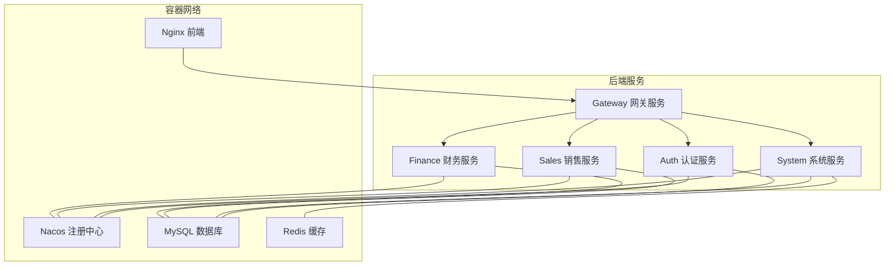
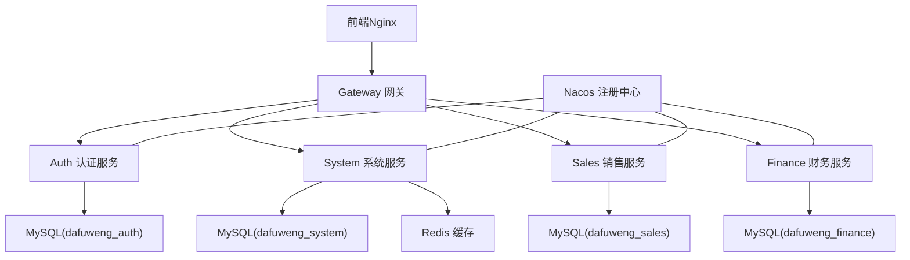
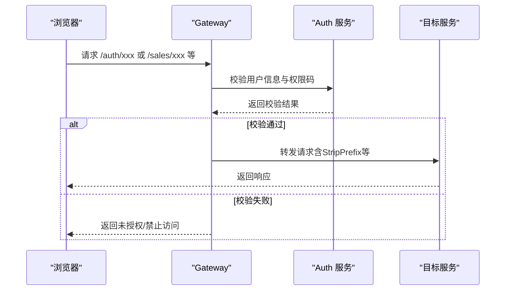
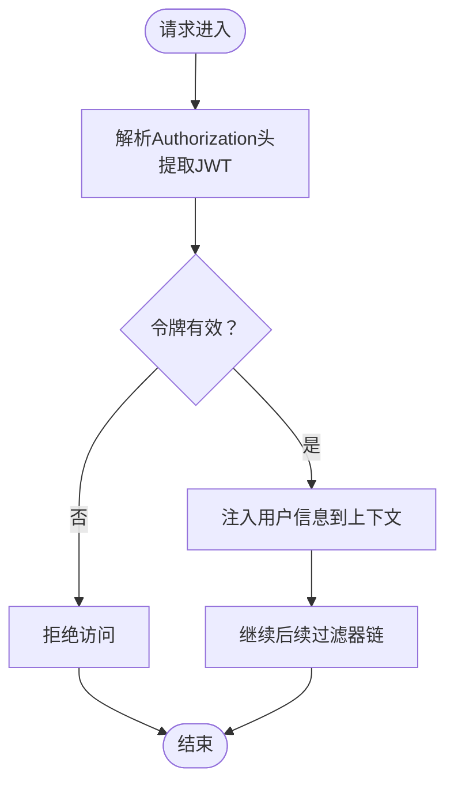
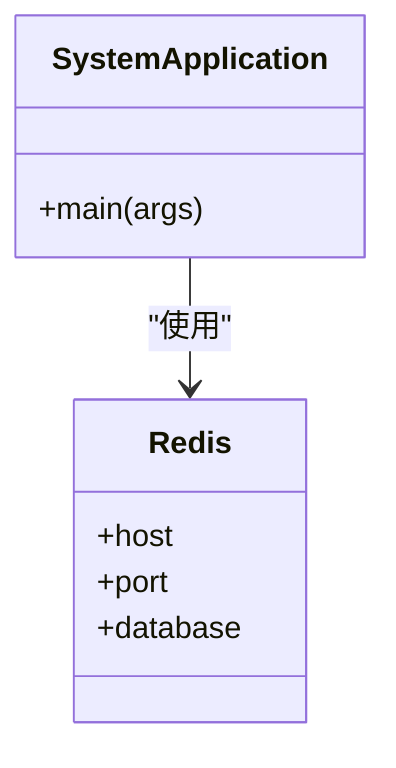
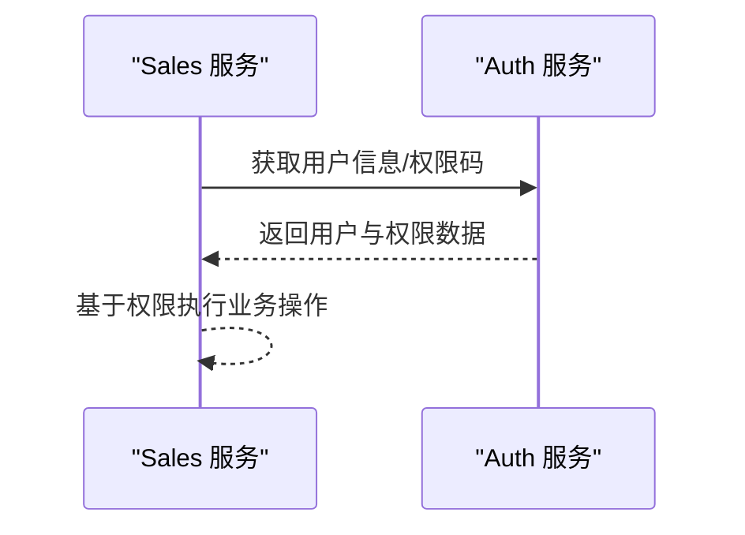
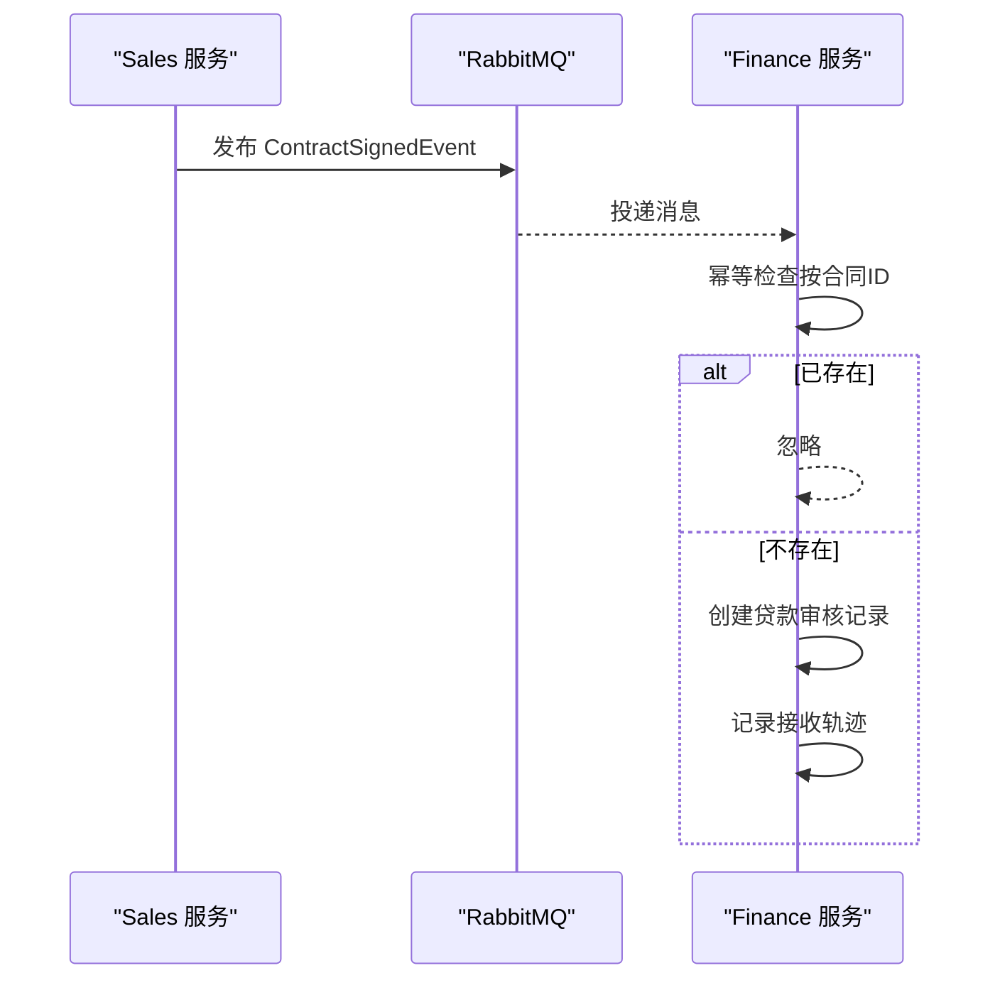
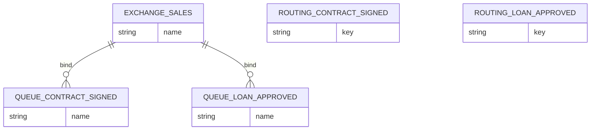
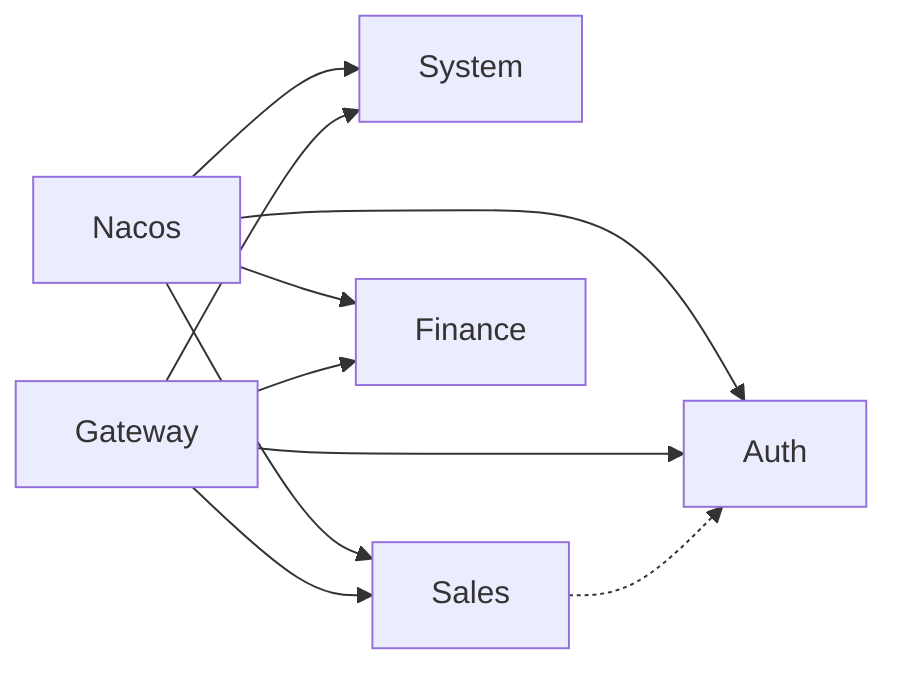

# 架构设计

<cite>
**本文引用的文件**
- [pom.xml](file://pom.xml)
- [docker-compose.yml](file://docker-compose.yml)
- [MqConfig.java](file://common/src/main/java/com/dafuweng/common/mq/MqConfig.java)
- [ContractSignedEvent.java](file://common/src/main/java/com/dafuweng/common/mq/event/ContractSignedEvent.java)
- [LoanApprovedEvent.java](file://common/src/main/java/com/dafuweng/common/mq/event/LoanApprovedEvent.java)
- [ContractSignedListener.java](file://finance/src/main/java/com/dafuweng/finance/mq/ContractSignedListener.java)
- [AuthFeignClient.java（sales）](file://sales/src/main/java/com/dafuweng/sales/feign/AuthFeignClient.java)
- [AuthFeignClient.java（gateway）](file://gateway/src/main/java/com/dafuweng/gateway/feign/AuthFeignClient.java)
- [SecurityConfig.java](file://auth/src/main/java/com/dafuweng/auth/config/SecurityConfig.java)
- [application.yml（system）](file://system/src/main/resources/application.yml)
- [application.yml（auth）](file://auth/src/main/resources/application.yml)
- [application.yml（finance）](file://finance/src/main/resources/application.yml)
- [application.yml（sales）](file://sales/src/main/resources/application.yml)
- [application.yml（gateway）](file://gateway/src/main/resources/application.yml)
- [SystemApplication.java](file://system/src/main/java/com/dafuweng/system/SystemApplication.java)
</cite>

## 目录
1. [引言](#引言)
2. [项目结构](#项目结构)
3. [核心组件](#核心组件)
4. [架构总览](#架构总览)
5. [详细组件分析](#详细组件分析)
6. [依赖分析](#依赖分析)
7. [性能考虑](#性能考虑)
8. [故障排查指南](#故障排查指南)
9. [结论](#结论)
10. [附录](#附录)

## 引言
本文件面向NeoCC项目的架构设计与实现，围绕基于Spring Cloud的微服务架构展开，重点阐述服务拆分策略、服务间通信机制、负载均衡与容错处理；同时给出四层架构模式（表现层、网关层、服务层、数据层）的落地方式，并深入解析财务模块中事件驱动架构与RabbitMQ消息队列的应用场景与数据一致性保障。文档还涵盖分布式事务处理策略、缓存架构设计以及数据库垂直拆分方案，提供系统拓扑图、服务依赖关系图与数据流向图，说明技术选型考量与架构决策权衡，并给出架构演进路线图与扩展性建议。

## 项目结构
NeoCC采用多模块Maven聚合工程组织，包含公共模块与五个微服务模块：auth（认证）、system（系统）、sales（销售）、finance（财务）、gateway（网关），并通过docker-compose进行本地编排与部署。

图表来源
- [docker-compose.yml:1-182](file://docker-compose.yml#L1-L182)

章节来源
- [pom.xml:12-19](file://pom.xml#L12-L19)
- [docker-compose.yml:1-182](file://docker-compose.yml#L1-L182)

## 核心组件
- 四层架构
  - 表现层：前端通过Nginx对外提供静态资源访问，路由至网关。
  - 网关层：Gateway负责统一路由、跨域、鉴权前置校验与服务转发。
  - 服务层：auth、system、sales、finance四个独立微服务，按领域垂直拆分。
  - 数据层：数据库按模块垂直拆分，配合Redis缓存提升读取性能。
- 服务发现与配置：Nacos作为注册中心与配置中心，服务间通过OpenFeign+Ribbon进行声明式调用与客户端负载均衡。
- 事件驱动：通过RabbitMQ实现跨服务解耦，典型场景为“合同已签署”事件触发财务侧贷款审核流程。
- 安全体系：基于JWT的无状态认证，结合Spring Security与自定义过滤器链实现鉴权。

章节来源
- [application.yml（gateway）:17-150](file://gateway/src/main/resources/application.yml#L17-L150)
- [application.yml（auth）:12-18](file://auth/src/main/resources/application.yml#L12-L18)
- [application.yml（system）:18-24](file://system/src/main/resources/application.yml#L18-L24)
- [application.yml（sales）:12-15](file://sales/src/main/resources/application.yml#L12-L15)
- [application.yml（finance）:12-15](file://finance/src/main/resources/application.yml#L12-L15)

## 架构总览
下图展示NeoCC整体系统拓扑与数据流：

图表来源
- [docker-compose.yml:3-182](file://docker-compose.yml#L3-L182)
- [application.yml（gateway）:17-150](file://gateway/src/main/resources/application.yml#L17-L150)
- [application.yml（auth）:9-11](file://auth/src/main/resources/application.yml#L9-L11)
- [application.yml（system）:9-11](file://system/src/main/resources/application.yml#L9-L11)
- [application.yml（sales）:9-11](file://sales/src/main/resources/application.yml#L9-L11)
- [application.yml（finance）:9-11](file://finance/src/main/resources/application.yml#L9-L11)

## 详细组件分析

### 网关层（Gateway）
- 路由规则：根据路径前缀将请求转发到对应后端服务；部分根路径直接映射到认证服务以兼容RuoYi前端。
- 负载均衡：使用lb://auth等逻辑名进行客户端负载均衡（Ribbon）。
- 鉴权前置：网关层通过Feign调用认证服务校验Token有效性与权限码，再放行到目标服务。
- 跨域配置：全局允许跨域，便于前后端联调与生产环境代理。

图表来源
- [application.yml（gateway）:24-51](file://gateway/src/main/resources/application.yml#L24-L51)
- [AuthFeignClient.java（gateway）:9-31](file://gateway/src/main/java/com/dafuweng/gateway/feign/AuthFeignClient.java#L9-L31)

章节来源
- [application.yml（gateway）:17-150](file://gateway/src/main/resources/application.yml#L17-L150)
- [AuthFeignClient.java（gateway）:9-31](file://gateway/src/main/java/com/dafuweng/gateway/feign/AuthFeignClient.java#L9-L31)

### 认证与安全（Auth）
- 无状态认证：禁用会话，使用JWT令牌；登录成功返回令牌，后续请求携带令牌访问。
- 权限控制：基于方法级注解与URL白名单，对特定接口开放或保护。
- 过滤器链：在用户名密码过滤器之前插入JWT过滤器，完成令牌解析与用户注入。

图表来源
- [SecurityConfig.java:34-52](file://auth/src/main/java/com/dafuweng/auth/config/SecurityConfig.java#L34-L52)

章节来源
- [SecurityConfig.java:28-52](file://auth/src/main/java/com/dafuweng/auth/config/SecurityConfig.java#L28-L52)

### 系统服务（System）
- 功能定位：提供部门、区域、参数、字典等基础能力，支撑其他模块的数据与权限约束。
- 缓存策略：启用缓存注解，结合Redis提升读取性能，降低数据库压力。
- 数据访问：MyBatis-Plus配置开启驼峰映射与逻辑删除字段。

图表来源
- [SystemApplication.java:8-15](file://system/src/main/java/com/dafuweng/system/SystemApplication.java#L8-L15)
- [application.yml（system）:12-17](file://system/src/main/resources/application.yml#L12-L17)

章节来源
- [SystemApplication.java:8-15](file://system/src/main/java/com/dafuweng/system/SystemApplication.java#L8-L15)
- [application.yml（system）:18-37](file://system/src/main/resources/application.yml#L18-L37)

### 销售服务（Sales）
- 服务职责：客户、合同、联系记录、业绩与工作日志等销售生命周期管理。
- 服务间调用：通过Feign客户端调用认证服务获取用户信息与权限码，用于业务操作前鉴权。
- 数据库：独立数据库实例，避免跨模块写放大。

图表来源
- [AuthFeignClient.java（sales）:9-23](file://sales/src/main/java/com/dafuweng/sales/feign/AuthFeignClient.java#L9-L23)

章节来源
- [AuthFeignClient.java（sales）:9-23](file://sales/src/main/java/com/dafuweng/sales/feign/AuthFeignClient.java#L9-L23)
- [application.yml（sales）:9-11](file://sales/src/main/resources/application.yml#L9-L11)

### 财务服务（Finance）
- 事件驱动：订阅“合同已签署”事件，自动创建贷款审核任务与轨迹记录，确保跨模块协作解耦。
- 幂等处理：检查是否已有相同合同的审核记录，避免重复创建。
- 数据库：独立数据库实例，承载银行、产品、佣金、服务费与贷款审计等财务域数据。

图表来源
- [MqConfig.java:14-48](file://common/src/main/java/com/dafuweng/common/mq/MqConfig.java#L14-L48)
- [ContractSignedEvent.java:10-20](file://common/src/main/java/com/dafuweng/common/mq/event/ContractSignedEvent.java#L10-L20)
- [ContractSignedListener.java:27-53](file://finance/src/main/java/com/dafuweng/finance/mq/ContractSignedListener.java#L27-L53)

章节来源
- [MqConfig.java:11-49](file://common/src/main/java/com/dafuweng/common/mq/MqConfig.java#L11-L49)
- [ContractSignedEvent.java:9-20](file://common/src/main/java/com/dafuweng/common/mq/event/ContractSignedEvent.java#L9-L20)
- [ContractSignedListener.java:15-55](file://finance/src/main/java/com/dafuweng/finance/mq/ContractSignedListener.java#L15-L55)
- [application.yml（finance）:9-11](file://finance/src/main/resources/application.yml#L9-L11)

### 公共模块与消息配置（Common）
- 消息交换机与队列：定义Direct Exchange与持久化队列，绑定路由键，确保事件可靠投递。
- 事件模型：定义合同已签署与贷款已审批两类事件，承载跨模块关键业务数据。

图表来源
- [MqConfig.java:22-48](file://common/src/main/java/com/dafuweng/common/mq/MqConfig.java#L22-L48)

章节来源
- [MqConfig.java:11-49](file://common/src/main/java/com/dafuweng/common/mq/MqConfig.java#L11-L49)
- [ContractSignedEvent.java:9-20](file://common/src/main/java/com/dafuweng/common/mq/event/ContractSignedEvent.java#L9-L20)
- [LoanApprovedEvent.java:9-24](file://common/src/main/java/com/dafuweng/common/mq/event/LoanApprovedEvent.java#L9-L24)

## 依赖分析
- 服务发现与注册：各服务通过Nacos进行注册与发现，网关与下游服务均配置Nacos地址。
- 服务间通信：网关层与下游服务通过OpenFeign发起HTTP调用；服务间也可直接通过Feign客户端调用。
- 负载均衡：网关层使用lb://逻辑名结合Ribbon实现客户端负载均衡。
- 数据访问：各服务使用MyBatis-Plus访问各自数据库，System服务额外集成Redis缓存。

图表来源
- [application.yml（gateway）:12-16](file://gateway/src/main/resources/application.yml#L12-L16)
- [application.yml（auth）:12-18](file://auth/src/main/resources/application.yml#L12-L18)
- [application.yml（system）:18-24](file://system/src/main/resources/application.yml#L18-L24)
- [application.yml（sales）:12-15](file://sales/src/main/resources/application.yml#L12-L15)
- [application.yml（finance）:12-15](file://finance/src/main/resources/application.yml#L12-L15)

章节来源
- [application.yml（gateway）:12-16](file://gateway/src/main/resources/application.yml#L12-L16)
- [AuthFeignClient.java（sales）:9](file://sales/src/main/java/com/dafuweng/sales/feign/AuthFeignClient.java#L9)
- [AuthFeignClient.java（gateway）:9](file://gateway/src/main/java/com/dafuweng/gateway/feign/AuthFeignClient.java#L9)

## 性能考虑
- 读写分离与缓存：System服务启用Redis缓存，减少热点数据的数据库访问；可进一步引入读库与异步写入。
- 负载均衡与熔断：在生产环境可引入Sentinel或Resilience4j实现限流与熔断，避免雪崩效应。
- 数据库垂直拆分：按模块拆分数据库，降低跨库事务复杂度；对高频表建立合适索引，优化慢查询。
- 消息可靠性：RabbitMQ使用持久化队列与确认机制，结合消费者幂等设计，确保事件不丢失、不重复。
- 前端静态化：Nginx提供静态资源服务，减少后端压力，提高首屏加载速度。

## 故障排查指南
- 认证失败
  - 确认网关是否正确调用认证服务校验用户与权限码。
  - 检查JWT过滤器是否正确解析令牌并注入用户信息。
- 服务不可达
  - 检查Nacos注册中心是否正常，服务是否已注册。
  - 确认网关路由配置是否正确，lb://逻辑名是否指向正确服务。
- 消息未消费
  - 检查交换机、队列与路由键绑定是否一致。
  - 确认消费者是否正确监听队列，是否存在幂等判断导致跳过。
- 缓存异常
  - 检查Redis连接配置与可用性，确认缓存键命名规范与序列化策略。

章节来源
- [SecurityConfig.java:34-52](file://auth/src/main/java/com/dafuweng/auth/config/SecurityConfig.java#L34-L52)
- [application.yml（gateway）:12-16](file://gateway/src/main/resources/application.yml#L12-L16)
- [MqConfig.java:22-48](file://common/src/main/java/com/dafuweng/common/mq/MqConfig.java#L22-L48)
- [ContractSignedListener.java:27-53](file://finance/src/main/java/com/dafuweng/finance/mq/ContractSignedListener.java#L27-L53)

## 结论
NeoCC通过Spring Cloud实现了清晰的微服务架构：以网关为入口，以Nacos为注册中心，以Feign/Ribbon实现服务间通信与负载均衡，以RabbitMQ实现事件驱动解耦。四层架构与数据库垂直拆分提升了系统的可维护性与扩展性。未来可在生产环境引入熔断、限流与可观测性工具，完善分布式事务与缓存一致性策略，持续演进为高可用、高性能的企业级平台。

## 附录
- 技术选型与权衡
  - Spring Cloud：生态成熟，服务治理能力完备；需关注版本兼容与依赖冲突。
  - Nacos：注册与配置一体化，简化运维；需评估集群规模与存储容量。
  - RabbitMQ：消息可靠性与解耦效果显著；需关注队列堆积与消费者并发。
  - Redis：缓存加速与会话存储；需关注内存与持久化策略。
  - MyBatis-Plus：提升开发效率；需注意复杂SQL与分页性能。
- 架构演进路线图
  - 短期：完善测试覆盖与CI/CD流水线，补齐监控告警。
  - 中期：引入Sentinel/Resilience4j、SkyWalking/Prometheus/Grafana，实现流量治理与可观测性。
  - 长期：探索事件溯源与Saga模式，强化分布式事务；引入数据库中间件与分库分表，支撑更大规模数据。