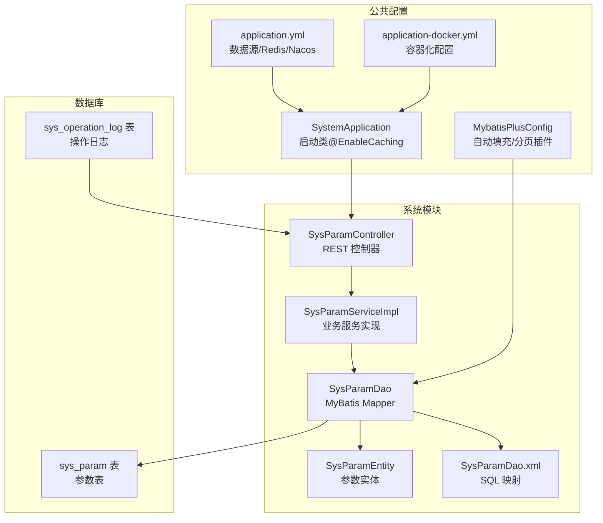
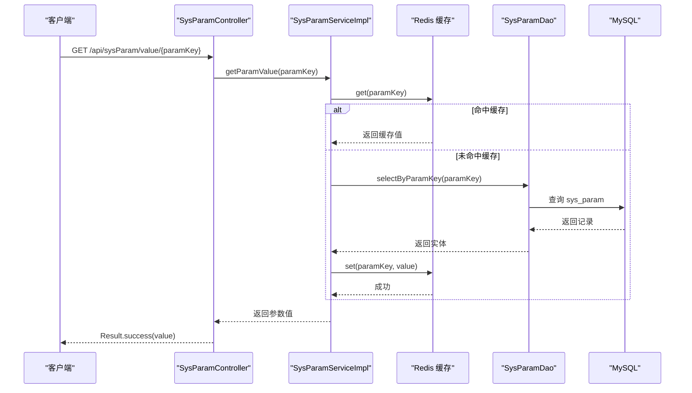
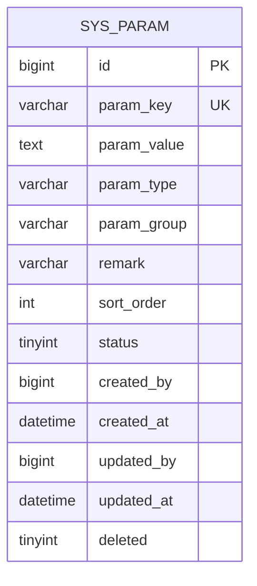
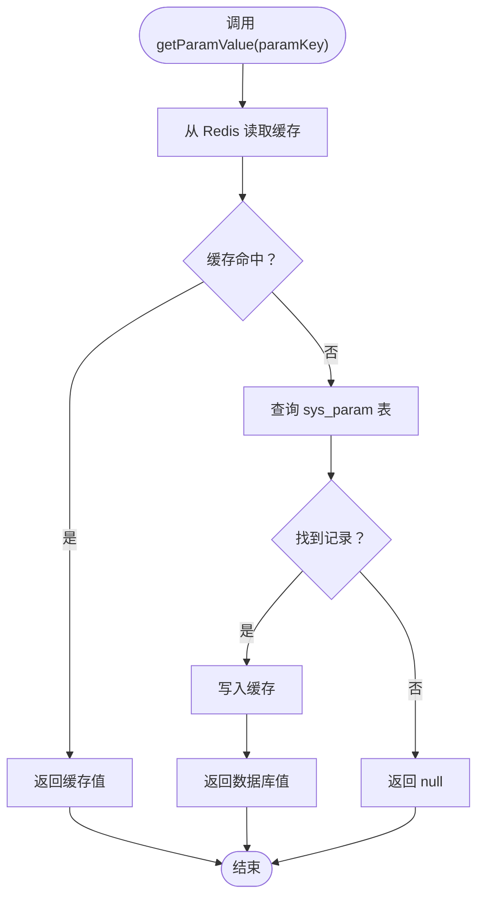
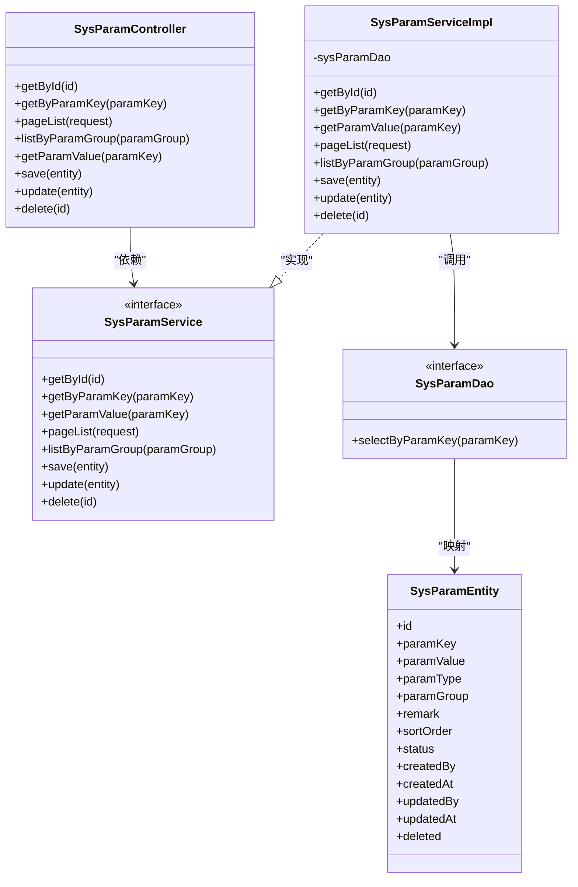

# 参数配置

<cite>
**本文引用的文件**
- [SysParamController.java](file://system/src/main/java/com/dafuweng/system/controller/SysParamController.java)
- [SysParamService.java](file://system/src/main/java/com/dafuweng/system/service/SysParamService.java)
- [SysParamServiceImpl.java](file://system/src/main/java/com/dafuweng/system/service/impl/SysParamServiceImpl.java)
- [SysParamDao.java](file://system/src/main/java/com/dafuweng/system/dao/SysParamDao.java)
- [SysParamDao.xml](file://system/src/main/resources/system/mapper/SysParamDao.xml)
- [SysParamEntity.java](file://system/src/main/java/com/dafuweng/system/entity/SysParamEntity.java)
- [application.yml](file://system/src/main/resources/application.yml)
- [application-docker.yml](file://system/src/main/resources/application-docker.yml)
- [SystemApplication.java](file://system/src/main/java/com/dafuweng/system/SystemApplication.java)
- [MybatisPlusConfig.java](file://common/src/main/java/com/dafuweng/common/config/MybatisPlusConfig.java)
- [database.sql](file://database.sql)
- [SysOperationLogController.java](file://system/src/main/java/com/dafuweng/system/controller/SysOperationLogController.java)
- [SysOperationLogEntity.java](file://system/src/main/java/com/dafuweng/system/entity/SysOperationLogEntity.java)
</cite>

## 目录
1. [简介](#简介)
2. [项目结构](#项目结构)
3. [核心组件](#核心组件)
4. [架构总览](#架构总览)
5. [详细组件分析](#详细组件分析)
6. [依赖关系分析](#依赖关系分析)
7. [性能考量](#性能考量)
8. [故障排查指南](#故障排查指南)
9. [结论](#结论)
10. [附录](#附录)

## 简介
本文件面向“系统参数配置”功能，提供完整的RESTful API文档与实现解析。系统参数用于集中管理各类运行参数，支持按参数类型、参数分组进行分类管理；通过缓存实现参数读取的高性能；提供参数值的动态更新与缓存失效；结合逻辑删除与审计日志保障数据完整性与可追溯性。本文档覆盖以下主题：
- 参数类型定义、参数值设置与参数作用域控制
- 动态更新机制（热更新支持、配置变更通知与回滚策略）
- 参数数据的安全存储与访问控制（敏感参数加密、权限验证与审计日志）
- 完整的RESTful API接口清单与使用说明
- 参数验证规则、默认值设置与参数继承机制
- 不同环境下的配置策略与部署注意事项
- 最佳实践与常见问题解决方案

## 项目结构
系统参数模块位于 system 子模块，采用经典的分层架构：Controller -> Service -> Dao -> Entity，配合 MyBatis-Plus 实现数据持久化，Redis 作为缓存支撑参数读取。

图表来源
- [SysParamController.java:1-62](file://system/src/main/java/com/dafuweng/system/controller/SysParamController.java#L1-L62)
- [SysParamServiceImpl.java:1-95](file://system/src/main/java/com/dafuweng/system/service/impl/SysParamServiceImpl.java#L1-L95)
- [SysParamDao.java:1-13](file://system/src/main/java/com/dafuweng/system/dao/SysParamDao.java#L1-L13)
- [SysParamDao.xml:1-29](file://system/src/main/resources/system/mapper/SysParamDao.xml#L1-L29)
- [SysParamEntity.java:1-45](file://system/src/main/java/com/dafuweng/system/entity/SysParamEntity.java#L1-L45)
- [SystemApplication.java:1-16](file://system/src/main/java/com/dafuweng/system/SystemApplication.java#L1-L16)
- [MybatisPlusConfig.java:1-29](file://common/src/main/java/com/dafuweng/common/config/MybatisPlusConfig.java#L1-L29)
- [application.yml:1-41](file://system/src/main/resources/application.yml#L1-L41)
- [application-docker.yml:1-38](file://system/src/main/resources/application-docker.yml#L1-L38)
- [database.sql:170-197](file://database.sql#L170-L197)

章节来源
- [SysParamController.java:1-62](file://system/src/main/java/com/dafuweng/system/controller/SysParamController.java#L1-L62)
- [SysParamServiceImpl.java:1-95](file://system/src/main/java/com/dafuweng/system/service/impl/SysParamServiceImpl.java#L1-L95)
- [SysParamDao.java:1-13](file://system/src/main/java/com/dafuweng/system/dao/SysParamDao.java#L1-L13)
- [SysParamDao.xml:1-29](file://system/src/main/resources/system/mapper/SysParamDao.xml#L1-L29)
- [SysParamEntity.java:1-45](file://system/src/main/java/com/dafuweng/system/entity/SysParamEntity.java#L1-L45)
- [SystemApplication.java:1-16](file://system/src/main/java/com/dafuweng/system/SystemApplication.java#L1-L16)
- [MybatisPlusConfig.java:1-29](file://common/src/main/java/com/dafuweng/common/config/MybatisPlusConfig.java#L1-L29)
- [application.yml:1-41](file://system/src/main/resources/application.yml#L1-L41)
- [application-docker.yml:1-38](file://system/src/main/resources/application-docker.yml#L1-L38)
- [database.sql:170-197](file://database.sql#L170-L197)

## 核心组件
- 参数实体：SysParamEntity 描述参数的键、值、类型、分组、排序、状态、创建与更新信息等。
- 数据访问：SysParamDao 提供按参数键查询的能力；SysParamDao.xml 定义 SQL 映射。
- 业务服务：SysParamService 定义参数的增删改查与分页列表、按分组查询、缓存读取等；SysParamServiceImpl 实现具体逻辑并集成缓存。
- 控制器：SysParamController 提供 REST 接口，包括按ID、按参数键查询、分页、按分组查询、获取参数值、新增、更新、删除。
- 启动与配置：SystemApplication 开启缓存；MybatisPlusConfig 注册自动填充与分页插件；application.yml 与 application-docker.yml 提供数据源、Redis、Nacos 等配置。

章节来源
- [SysParamEntity.java:1-45](file://system/src/main/java/com/dafuweng/system/entity/SysParamEntity.java#L1-L45)
- [SysParamDao.java:1-13](file://system/src/main/java/com/dafuweng/system/dao/SysParamDao.java#L1-L13)
- [SysParamDao.xml:1-29](file://system/src/main/resources/system/mapper/SysParamDao.xml#L1-L29)
- [SysParamService.java:1-37](file://system/src/main/java/com/dafuweng/system/service/SysParamService.java#L1-L37)
- [SysParamServiceImpl.java:1-95](file://system/src/main/java/com/dafuweng/system/service/impl/SysParamServiceImpl.java#L1-L95)
- [SysParamController.java:1-62](file://system/src/main/java/com/dafuweng/system/controller/SysParamController.java#L1-L62)
- [SystemApplication.java:1-16](file://system/src/main/java/com/dafuweng/system/SystemApplication.java#L1-L16)
- [MybatisPlusConfig.java:1-29](file://common/src/main/java/com/dafuweng/common/config/MybatisPlusConfig.java#L1-L29)
- [application.yml:1-41](file://system/src/main/resources/application.yml#L1-L41)
- [application-docker.yml:1-38](file://system/src/main/resources/application-docker.yml#L1-L38)

## 架构总览
系统参数的读写流程如下：

图表来源
- [SysParamController.java:40-44](file://system/src/main/java/com/dafuweng/system/controller/SysParamController.java#L40-L44)
- [SysParamServiceImpl.java:36-41](file://system/src/main/java/com/dafuweng/system/service/impl/SysParamServiceImpl.java#L36-L41)
- [SysParamDao.java:11-12](file://system/src/main/java/com/dafuweng/system/dao/SysParamDao.java#L11-L12)
- [SysParamDao.xml:21-26](file://system/src/main/resources/system/mapper/SysParamDao.xml#L21-L26)
- [application.yml:12-17](file://system/src/main/resources/application.yml#L12-L17)

## 详细组件分析

### 参数实体与数据模型
参数实体包含参数键、参数值、参数类型、参数分组、排序、状态、创建与更新信息以及逻辑删除字段。数据库表 sys_param 定义了唯一索引、分组索引与逻辑删除字段，确保参数键唯一性与高效查询。

图表来源
- [SysParamEntity.java:17-43](file://system/src/main/java/com/dafuweng/system/entity/SysParamEntity.java#L17-L43)
- [database.sql:170-188](file://database.sql#L170-L188)

章节来源
- [SysParamEntity.java:1-45](file://system/src/main/java/com/dafuweng/system/entity/SysParamEntity.java#L1-L45)
- [database.sql:170-197](file://database.sql#L170-L197)

### 参数控制器与REST API
控制器提供以下接口：
- GET /api/sysParam/{id}：按ID查询参数
- GET /api/sysParam/getByParamKey：按参数键查询参数
- GET /api/sysParam/page：分页查询参数列表
- GET /api/sysParam/listByParamGroup：按参数分组查询参数列表
- GET /api/sysParam/value/{paramKey}：获取参数值（带缓存）
- POST /api/sysParam：新增参数
- PUT /api/sysParam：更新参数
- DELETE /api/sysParam/{id}：删除参数（逻辑删除）

请求与响应均封装在统一的结果对象中，便于前端消费与错误处理。

章节来源
- [SysParamController.java:20-60](file://system/src/main/java/com/dafuweng/system/controller/SysParamController.java#L20-L60)

### 参数服务与缓存策略
- 读取：getParamValue 使用缓存键 paramKey，命中则直接返回；未命中则查询数据库并写入缓存。
- 写入：save/update/delete 在事务中执行，并对同一参数键进行缓存失效，确保后续读取能获取最新值。
- 分页与排序：支持按创建时间倒序或指定字段排序；按分组查询时按排序字段升序排列。
- 逻辑删除：删除时仅标记 deleted 字段，保留审计与历史追踪能力。

图表来源
- [SysParamServiceImpl.java:36-41](file://system/src/main/java/com/dafuweng/system/service/impl/SysParamServiceImpl.java#L36-L41)
- [SysParamDao.xml:21-26](file://system/src/main/resources/system/mapper/SysParamDao.xml#L21-L26)

章节来源
- [SysParamServiceImpl.java:36-93](file://system/src/main/java/com/dafuweng/system/service/impl/SysParamServiceImpl.java#L36-L93)
- [SysParamDao.java:11-12](file://system/src/main/java/com/dafuweng/system/dao/SysParamDao.java#L11-L12)
- [SysParamDao.xml:21-26](file://system/src/main/resources/system/mapper/SysParamDao.xml#L21-L26)

### 参数类型、作用域与默认值
- 参数类型：param_type 支持字符串、整型、长整型、布尔、JSON 等类型标识，便于上层按类型解析与校验。
- 参数分组：param_group 用于分类管理，如 sales、performance、contract、system、security 等。
- 默认值：status 默认启用，sort_order 默认 0；数据库初始化脚本提供了若干关键参数的默认值。
- 参数作用域：当前实现未显式区分全局/租户/用户级作用域，可通过扩展 paramGroup 或新增作用域字段实现。

章节来源
- [SysParamEntity.java:24-30](file://system/src/main/java/com/dafuweng/system/entity/SysParamEntity.java#L24-L30)
- [database.sql:190-197](file://database.sql#L190-L197)

### 动态更新机制与热更新
- 热更新：通过缓存键 paramKey 的失效与重建，实现参数值的热更新；写操作在事务中完成，保证一致性。
- 配置变更通知：当前未实现跨实例广播通知；可在 Redis 发布订阅或消息队列基础上扩展。
- 回滚策略：基于逻辑删除与审计日志，可实现参数回滚；建议增加版本号字段以支持更精细的回滚。

章节来源
- [SysParamServiceImpl.java:70-93](file://system/src/main/java/com/dafuweng/system/service/impl/SysParamServiceImpl.java#L70-L93)
- [SysParamDao.xml:21-26](file://system/src/main/resources/system/mapper/SysParamDao.xml#L21-L26)

### 安全存储与访问控制
- 敏感参数加密：当前未实现参数值加密；建议对敏感参数（如密钥、密码）采用对称加密并在入库前加密、出库后解密。
- 权限验证：参数管理接口未绑定鉴权；建议在网关或控制器层加入基于角色的访问控制（RBAC）。
- 审计日志：系统提供操作日志表与控制器，可用于记录参数变更操作；建议在参数服务层增加统一的日志埋点。

章节来源
- [SysOperationLogController.java](file://system/src/main/java/com/dafuweng/system/controller/SysOperationLogController.java)
- [SysOperationLogEntity.java:1-218](file://system/src/main/java/com/dafuweng/system/entity/SysOperationLogEntity.java#L1-L218)

### 参数验证规则与继承机制
- 参数键唯一性：数据库唯一约束保证 param_key 唯一。
- 类型校验：param_type 用于标识类型，建议在服务层增加类型转换与格式校验。
- 继承机制：当前未实现参数继承；可在查询时按分组优先级或层级结构进行合并。

章节来源
- [database.sql:184-185](file://database.sql#L184-L185)
- [SysParamEntity.java:24-26](file://system/src/main/java/com/dafuweng/system/entity/SysParamEntity.java#L24-L26)

### 不同环境下的配置策略与部署注意事项
- 开发环境：application.yml 指向本地 MySQL 与 Redis；适合单机调试。
- 容器化环境：application-docker.yml 通过环境变量注入 Redis 主机，便于多环境复用。
- 集群与高可用：建议开启 Redis 集群与哨兵，确保缓存高可用；数据库建议主从复制与备份策略。
- 配置中心：当前未接入 Nacos；可考虑将参数迁移至配置中心，实现动态刷新与灰度发布。

章节来源
- [application.yml:7-24](file://system/src/main/resources/application.yml#L7-L24)
- [application-docker.yml:12-22](file://system/src/main/resources/application-docker.yml#L12-L22)

## 依赖关系分析
系统参数模块的依赖关系如下：

图表来源
- [SysParamController.java:1-62](file://system/src/main/java/com/dafuweng/system/controller/SysParamController.java#L1-L62)
- [SysParamService.java:16-36](file://system/src/main/java/com/dafuweng/system/service/SysParamService.java#L16-L36)
- [SysParamServiceImpl.java:20-94](file://system/src/main/java/com/dafuweng/system/service/impl/SysParamServiceImpl.java#L20-L94)
- [SysParamDao.java:8-12](file://system/src/main/java/com/dafuweng/system/dao/SysParamDao.java#L8-L12)
- [SysParamEntity.java:11-44](file://system/src/main/java/com/dafuweng/system/entity/SysParamEntity.java#L11-L44)

章节来源
- [SysParamController.java:1-62](file://system/src/main/java/com/dafuweng/system/controller/SysParamController.java#L1-L62)
- [SysParamService.java:1-37](file://system/src/main/java/com/dafuweng/system/service/SysParamService.java#L1-L37)
- [SysParamServiceImpl.java:1-95](file://system/src/main/java/com/dafuweng/system/service/impl/SysParamServiceImpl.java#L1-L95)
- [SysParamDao.java:1-13](file://system/src/main/java/com/dafuweng/system/dao/SysParamDao.java#L1-L13)
- [SysParamEntity.java:1-45](file://system/src/main/java/com/dafuweng/system/entity/SysParamEntity.java#L1-L45)

## 性能考量
- 缓存命中率：参数读取路径经过 Redis 缓存，显著降低数据库压力；建议合理设置过期策略与容量。
- 数据库索引：参数键唯一索引与分组索引有助于快速检索；建议根据查询模式持续优化。
- 事务与一致性：写操作在事务中执行，避免脏读；缓存失效策略确保读写一致性。
- 分页与排序：MyBatis-Plus 分页插件与自动填充配置提升查询效率与数据一致性。

章节来源
- [SysParamServiceImpl.java:36-93](file://system/src/main/java/com/dafuweng/system/service/impl/SysParamServiceImpl.java#L36-L93)
- [MybatisPlusConfig.java:22-27](file://common/src/main/java/com/dafuweng/common/config/MybatisPlusConfig.java#L22-L27)
- [database.sql:184-187](file://database.sql#L184-L187)

## 故障排查指南
- 参数读取为空：检查参数键是否存在、是否被逻辑删除、缓存是否异常；可通过监控接口查看缓存键与值。
- 参数更新无效：确认事务是否提交、缓存是否正确失效；检查写操作日志与数据库变更。
- 权限不足：参数管理接口需增加鉴权；建议在网关层统一拦截并校验角色。
- 审计缺失：建议在参数服务层增加统一的日志埋点，记录操作人、时间、参数键与变更前后值。

章节来源
- [SysParamServiceImpl.java:70-93](file://system/src/main/java/com/dafuweng/system/service/impl/SysParamServiceImpl.java#L70-L93)
- [SysOperationLogController.java](file://system/src/main/java/com/dafuweng/system/controller/SysOperationLogController.java)

## 结论
系统参数模块通过清晰的分层设计与缓存机制，实现了参数的高效读取与安全写入。当前实现具备参数分类、分组查询、缓存读取与逻辑删除等基础能力；建议在后续版本中完善参数类型校验、敏感参数加密、权限控制与配置变更通知机制，以满足生产环境的高可用与合规需求。

## 附录

### RESTful API 接口清单
- GET /api/sysParam/{id}
  - 功能：按ID查询参数
  - 请求参数：id（路径变量）
  - 返回：参数实体
- GET /api/sysParam/getByParamKey
  - 功能：按参数键查询参数
  - 请求参数：paramKey（查询参数）
  - 返回：参数实体
- GET /api/sysParam/page
  - 功能：分页查询参数列表
  - 请求参数：page、size、sortField、sortOrder（分页请求对象）
  - 返回：分页结果
- GET /api/sysParam/listByParamGroup
  - 功能：按参数分组查询参数列表
  - 请求参数：paramGroup（查询参数）
  - 返回：参数列表（按排序字段升序）
- GET /api/sysParam/value/{paramKey}
  - 功能：获取参数值（带缓存）
  - 请求参数：paramKey（路径变量）
  - 返回：参数值字符串
- POST /api/sysParam
  - 功能：新增参数
  - 请求体：参数实体
  - 返回：新增的参数实体
- PUT /api/sysParam
  - 功能：更新参数
  - 请求体：参数实体
  - 返回：更新后的参数实体
- DELETE /api/sysParam/{id}
  - 功能：删除参数（逻辑删除）
  - 请求参数：id（路径变量）
  - 返回：空结果

章节来源
- [SysParamController.java:20-60](file://system/src/main/java/com/dafuweng/system/controller/SysParamController.java#L20-L60)