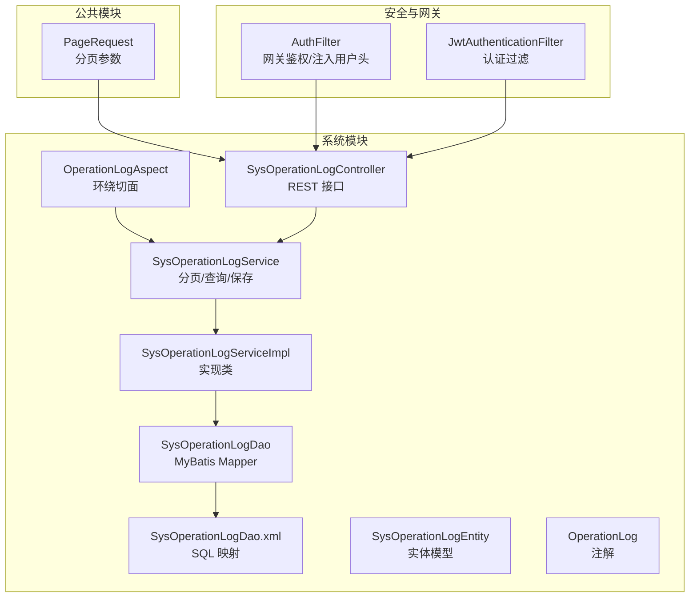
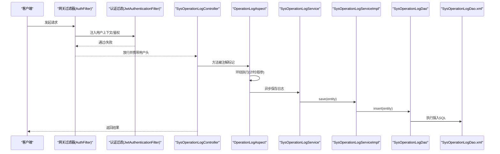
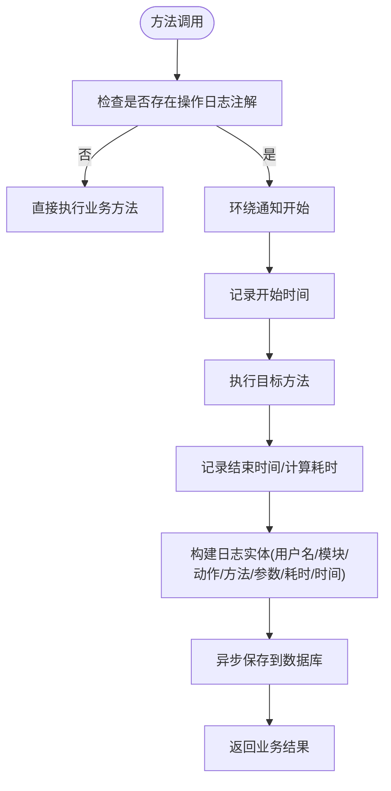
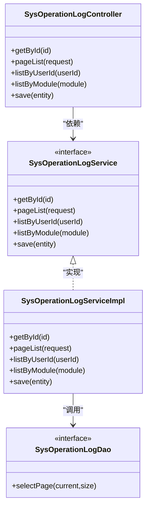
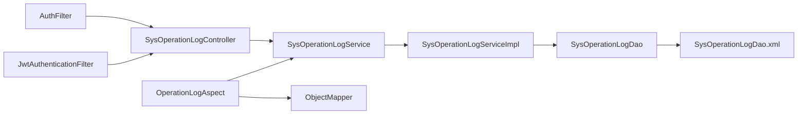
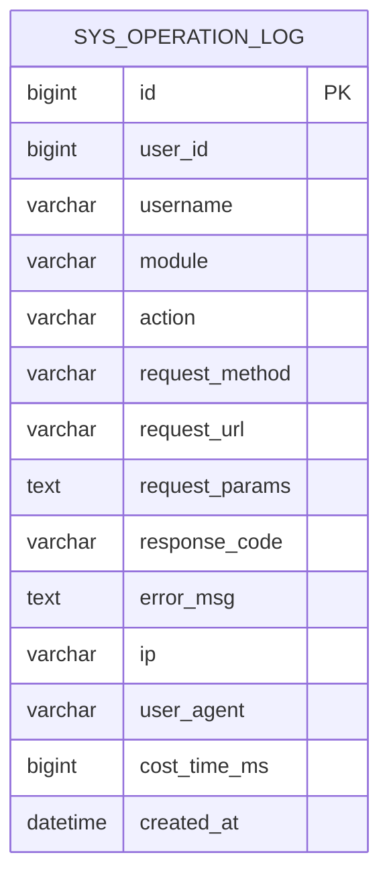

# 操作日志

<cite>
**本文引用的文件**   
- [OperationLogAspect.java](file://system/src/main/java/com/dafuweng/system/config/OperationLogAspect.java)
- [OperationLog.java](file://system/src/main/java/com/dafuweng/system/config/OperationLog.java)
- [SysOperationLogController.java](file://system/src/main/java/com/dafuweng/system/controller/SysOperationLogController.java)
- [SysOperationLogService.java](file://system/src/main/java/com/dafuweng/system/service/SysOperationLogService.java)
- [SysOperationLogServiceImpl.java](file://system/src/main/java/com/dafuweng/system/service/impl/SysOperationLogServiceImpl.java)
- [SysOperationLogDao.java](file://system/src/main/java/com/dafuweng/system/dao/SysOperationLogDao.java)
- [SysOperationLogDao.xml](file://system/src/main/resources/system/mapper/SysOperationLogDao.xml)
- [SysOperationLogEntity.java](file://system/src/main/java/com/dafuweng/system/entity/SysOperationLogEntity.java)
- [database.sql](file://database.sql)
- [PageRequest.java](file://common/src/main/java/com/dafuweng/common/entity/PageRequest.java)
- [JwtAuthenticationFilter.java](file://auth/src/main/java/com/dafuweng/auth/filter/JwtAuthenticationFilter.java)
- [AuthFilter.java](file://gateway/src/main/java/com/dafuweng/gateway/filter/AuthFilter.java)
</cite>

## 目录
1. [简介](#简介)
2. [项目结构](#项目结构)
3. [核心组件](#核心组件)
4. [架构总览](#架构总览)
5. [详细组件分析](#详细组件分析)
6. [依赖分析](#依赖分析)
7. [性能考虑](#性能考虑)
8. [故障排查指南](#故障排查指南)
9. [结论](#结论)
10. [附录](#附录)

## 简介
本文件面向“操作日志审计”能力，提供从自动记录机制、查询与过滤、存储与归档到REST API与安全合规的完整说明。系统通过切面自动采集关键操作元数据，统一落库并提供分页查询、按用户/模块等维度检索能力；结合网关与认证过滤器实现鉴权与用户上下文注入，支撑合规审计与故障排查。

## 项目结构
围绕操作日志的关键文件分布于 system 模块与公共模块，核心职责如下：
- 切面与注解：自动拦截标注了操作日志注解的方法，异步写入日志
- 控制器：对外暴露日志查询、分页、按用户/模块查询与保存接口
- 服务层：封装分页、按用户/模块查询与持久化事务
- DAO/Mapper：提供分页SQL与实体映射
- 实体：定义日志表字段与序列化
- 数据库：定义 sys_operation_log 表及索引
- 公共分页参数：PageRequest
- 安全与鉴权：网关与认证过滤器负责用户身份注入与校验

图表来源
- [SysOperationLogController.java:14-44](file://system/src/main/java/com/dafuweng/system/controller/SysOperationLogController.java#L14-L44)
- [SysOperationLogService.java:17-29](file://system/src/main/java/com/dafuweng/system/service/SysOperationLogService.java#L17-L29)
- [SysOperationLogServiceImpl.java:18-69](file://system/src/main/java/com/dafuweng/system/service/impl/SysOperationLogServiceImpl.java#L18-L69)
- [SysOperationLogDao.java:10-20](file://system/src/main/java/com/dafuweng/system/dao/SysOperationLogDao.java#L10-L20)
- [SysOperationLogDao.xml:3-32](file://system/src/main/resources/system/mapper/SysOperationLogDao.xml#L3-L32)
- [SysOperationLogEntity.java:12-44](file://system/src/main/java/com/dafuweng/system/entity/SysOperationLogEntity.java#L12-L44)
- [OperationLogAspect.java:21-60](file://system/src/main/java/com/dafuweng/system/config/OperationLogAspect.java#L21-L60)
- [OperationLog.java:8-11](file://system/src/main/java/com/dafuweng/system/config/OperationLog.java#L8-L11)
- [PageRequest.java:6-21](file://common/src/main/java/com/dafuweng/common/entity/PageRequest.java#L6-L21)
- [AuthFilter.java:23-140](file://gateway/src/main/java/com/dafuweng/gateway/filter/AuthFilter.java#L23-L140)
- [JwtAuthenticationFilter.java:20-81](file://auth/src/main/java/com/dafuweng/auth/filter/JwtAuthenticationFilter.java#L20-L81)

章节来源
- [SysOperationLogController.java:14-44](file://system/src/main/java/com/dafuweng/system/controller/SysOperationLogController.java#L14-L44)
- [SysOperationLogService.java:17-29](file://system/src/main/java/com/dafuweng/system/service/SysOperationLogService.java#L17-L29)
- [SysOperationLogServiceImpl.java:18-69](file://system/src/main/java/com/dafuweng/system/service/impl/SysOperationLogServiceImpl.java#L18-L69)
- [SysOperationLogDao.java:10-20](file://system/src/main/java/com/dafuweng/system/dao/SysOperationLogDao.java#L10-L20)
- [SysOperationLogDao.xml:3-32](file://system/src/main/resources/system/mapper/SysOperationLogDao.xml#L3-L32)
- [SysOperationLogEntity.java:12-44](file://system/src/main/java/com/dafuweng/system/entity/SysOperationLogEntity.java#L12-L44)
- [OperationLogAspect.java:21-60](file://system/src/main/java/com/dafuweng/system/config/OperationLogAspect.java#L21-L60)
- [OperationLog.java:8-11](file://system/src/main/java/com/dafuweng/system/config/OperationLog.java#L8-L11)
- [PageRequest.java:6-21](file://common/src/main/java/com/dafuweng/common/entity/PageRequest.java#L6-L21)
- [AuthFilter.java:23-140](file://gateway/src/main/java/com/dafuweng/gateway/filter/AuthFilter.java#L23-L140)
- [JwtAuthenticationFilter.java:20-81](file://auth/src/main/java/com/dafuweng/auth/filter/JwtAuthenticationFilter.java#L20-L81)

## 核心组件
- 自动记录切面：基于注解拦截目标方法，异步构建日志实体并入库
- 日志实体：定义日志表字段，包含用户、模块、动作、请求方法、参数、耗时、时间戳等
- 控制器：提供按ID查询、分页查询、按用户ID查询、按模块查询、手动保存等接口
- 服务层：封装分页排序、按用户/模块查询与事务性保存
- DAO/Mapper：提供分页SQL与实体映射
- 安全与鉴权：网关与认证过滤器负责鉴权与用户上下文注入

章节来源
- [OperationLogAspect.java:21-60](file://system/src/main/java/com/dafuweng/system/config/OperationLogAspect.java#L21-L60)
- [SysOperationLogEntity.java:12-44](file://system/src/main/java/com/dafuweng/system/entity/SysOperationLogEntity.java#L12-L44)
- [SysOperationLogController.java:14-44](file://system/src/main/java/com/dafuweng/system/controller/SysOperationLogController.java#L14-L44)
- [SysOperationLogService.java:17-29](file://system/src/main/java/com/dafuweng/system/service/SysOperationLogService.java#L17-L29)
- [SysOperationLogServiceImpl.java:18-69](file://system/src/main/java/com/dafuweng/system/service/impl/SysOperationLogServiceImpl.java#L18-L69)
- [SysOperationLogDao.java:10-20](file://system/src/main/java/com/dafuweng/system/dao/SysOperationLogDao.java#L10-L20)
- [SysOperationLogDao.xml:3-32](file://system/src/main/resources/system/mapper/SysOperationLogDao.xml#L3-L32)
- [AuthFilter.java:23-140](file://gateway/src/main/java/com/dafuweng/gateway/filter/AuthFilter.java#L23-L140)
- [JwtAuthenticationFilter.java:20-81](file://auth/src/main/java/com/dafuweng/auth/filter/JwtAuthenticationFilter.java#L20-L81)

## 架构总览
操作日志的自动记录流程如下：客户端请求经网关与认证过滤器后到达业务控制器；控制器方法若被操作日志注解标记，切面会环绕执行，在方法前后采集耗时与参数，并异步写入日志表。查询侧通过控制器与服务层实现分页与多维过滤。

图表来源
- [AuthFilter.java:55-134](file://gateway/src/main/java/com/dafuweng/gateway/filter/AuthFilter.java#L55-L134)
- [JwtAuthenticationFilter.java:28-80](file://auth/src/main/java/com/dafuweng/auth/filter/JwtAuthenticationFilter.java#L28-L80)
- [SysOperationLogController.java:14-44](file://system/src/main/java/com/dafuweng/system/controller/SysOperationLogController.java#L14-L44)
- [OperationLogAspect.java:35-60](file://system/src/main/java/com/dafuweng/system/config/OperationLogAspect.java#L35-L60)
- [SysOperationLogService.java:27-29](file://system/src/main/java/com/dafuweng/system/service/SysOperationLogService.java#L27-L29)
- [SysOperationLogServiceImpl.java:63-68](file://system/src/main/java/com/dafuweng/system/service/impl/SysOperationLogServiceImpl.java#L63-L68)
- [SysOperationLogDao.java:10-20](file://system/src/main/java/com/dafuweng/system/dao/SysOperationLogDao.java#L10-L20)
- [SysOperationLogDao.xml:22-30](file://system/src/main/resources/system/mapper/SysOperationLogDao.xml#L22-L30)

## 详细组件分析

### 自动记录机制与切面配置
- 注解定义：用于在方法级别声明模块与动作，作为日志记录的元信息来源
- 环绕切面：在方法执行前后采集耗时、当前用户名、请求方法名、参数JSON等，异步写入
- 用户名解析：从请求头 Authorization 中提取令牌（当前设计为用户ID字符串），用于记录操作者
- 异步写入：使用线程池异步保存，避免阻塞主业务链路

图表来源
- [OperationLog.java:8-11](file://system/src/main/java/com/dafuweng/system/config/OperationLog.java#L8-L11)
- [OperationLogAspect.java:35-60](file://system/src/main/java/com/dafuweng/system/config/OperationLogAspect.java#L35-L60)
- [SysOperationLogService.java:27-29](file://system/src/main/java/com/dafuweng/system/service/SysOperationLogService.java#L27-L29)

章节来源
- [OperationLog.java:8-11](file://system/src/main/java/com/dafuweng/system/config/OperationLog.java#L8-L11)
- [OperationLogAspect.java:21-87](file://system/src/main/java/com/dafuweng/system/config/OperationLogAspect.java#L21-L87)

### 日志内容格式与记录时机
- 内容字段：用户ID/用户名、模块、动作、请求方法、请求URL、请求参数JSON、响应状态码、错误信息、IP、UA、耗时(ms)、创建时间
- 记录时机：方法执行完成后立即异步保存，不阻塞请求返回
- 参数采集：将方法参数序列化为JSON字符串，便于检索与回溯

章节来源
- [SysOperationLogEntity.java:12-44](file://system/src/main/java/com/dafuweng/system/entity/SysOperationLogEntity.java#L12-L44)
- [OperationLogAspect.java:47-86](file://system/src/main/java/com/dafuweng/system/config/OperationLogAspect.java#L47-L86)

### 查询与过滤功能
- 按ID查询：单条日志详情
- 分页查询：支持页码、每页大小、排序字段与方向
- 按用户ID查询：返回该用户的最新操作列表
- 按模块查询：返回某模块的最新操作列表
- 手动保存：用于补充或测试场景

图表来源
- [SysOperationLogController.java:14-44](file://system/src/main/java/com/dafuweng/system/controller/SysOperationLogController.java#L14-L44)
- [SysOperationLogService.java:17-29](file://system/src/main/java/com/dafuweng/system/service/SysOperationLogService.java#L17-L29)
- [SysOperationLogServiceImpl.java:18-69](file://system/src/main/java/com/dafuweng/system/service/impl/SysOperationLogServiceImpl.java#L18-L69)
- [SysOperationLogDao.java:10-20](file://system/src/main/java/com/dafuweng/system/dao/SysOperationLogDao.java#L10-L20)

章节来源
- [SysOperationLogController.java:14-44](file://system/src/main/java/com/dafuweng/system/controller/SysOperationLogController.java#L14-L44)
- [SysOperationLogService.java:17-29](file://system/src/main/java/com/dafuweng/system/service/SysOperationLogService.java#L17-L29)
- [SysOperationLogServiceImpl.java:18-69](file://system/src/main/java/com/dafuweng/system/service/impl/SysOperationLogServiceImpl.java#L18-L69)
- [SysOperationLogDao.java:10-20](file://system/src/main/java/com/dafuweng/system/dao/SysOperationLogDao.java#L10-L20)

### 存储策略与归档机制
- 表结构：sys_operation_log，包含用户ID/用户名、模块、动作、请求方法、URL、参数、响应码、错误、IP、UA、耗时、创建时间等字段
- 索引：对用户ID、模块、创建时间建立索引，支撑高频查询
- 分页SQL：提供按创建时间倒序的分页查询，LIMIT/OFFSET 方式
- 归档与清理：仓库未提供专门的归档/清理策略，建议结合业务量与合规要求制定定期归档与冷热分离方案

章节来源
- [database.sql:199-218](file://database.sql#L199-L218)
- [SysOperationLogDao.xml:22-30](file://system/src/main/resources/system/mapper/SysOperationLogDao.xml#L22-L30)

### 权限控制、脱敏与安全
- 权限控制：网关过滤器对非公开路径进行鉴权，认证过滤器解析令牌并注入用户信息；控制器层未显式加注解限定角色，建议在控制器方法上增加权限注解以限制访问
- 用户名解析：切面从Authorization头中提取令牌（当前设计为用户ID字符串），用于记录操作者
- 脱敏与安全：当前实现未对请求参数进行脱敏处理，建议在切面或网关层增加敏感字段过滤与脱敏策略

章节来源
- [AuthFilter.java:55-134](file://gateway/src/main/java/com/dafuweng/gateway/filter/AuthFilter.java#L55-L134)
- [JwtAuthenticationFilter.java:28-80](file://auth/src/main/java/com/dafuweng/auth/filter/JwtAuthenticationFilter.java#L28-L80)
- [OperationLogAspect.java:62-74](file://system/src/main/java/com/dafuweng/system/config/OperationLogAspect.java#L62-L74)

## 依赖分析
- 控制器依赖服务接口，服务实现依赖DAO，DAO通过XML映射执行SQL
- 切面依赖服务与Jackson对象映射器，异步保存日志
- 安全过滤器贯穿请求生命周期，影响控制器与切面的可用性

图表来源
- [SysOperationLogController.java:14-44](file://system/src/main/java/com/dafuweng/system/controller/SysOperationLogController.java#L14-L44)
- [SysOperationLogService.java:17-29](file://system/src/main/java/com/dafuweng/system/service/SysOperationLogService.java#L17-L29)
- [SysOperationLogServiceImpl.java:18-69](file://system/src/main/java/com/dafuweng/system/service/impl/SysOperationLogServiceImpl.java#L18-L69)
- [SysOperationLogDao.java:10-20](file://system/src/main/java/com/dafuweng/system/dao/SysOperationLogDao.java#L10-L20)
- [SysOperationLogDao.xml:3-32](file://system/src/main/resources/system/mapper/SysOperationLogDao.xml#L3-L32)
- [OperationLogAspect.java:26-30](file://system/src/main/java/com/dafuweng/system/config/OperationLogAspect.java#L26-L30)
- [AuthFilter.java:23-140](file://gateway/src/main/java/com/dafuweng/gateway/filter/AuthFilter.java#L23-L140)
- [JwtAuthenticationFilter.java:20-81](file://auth/src/main/java/com/dafuweng/auth/filter/JwtAuthenticationFilter.java#L20-L81)

章节来源
- [SysOperationLogController.java:14-44](file://system/src/main/java/com/dafuweng/system/controller/SysOperationLogController.java#L14-L44)
- [SysOperationLogService.java:17-29](file://system/src/main/java/com/dafuweng/system/service/SysOperationLogService.java#L17-L29)
- [SysOperationLogServiceImpl.java:18-69](file://system/src/main/java/com/dafuweng/system/service/impl/SysOperationLogServiceImpl.java#L18-L69)
- [SysOperationLogDao.java:10-20](file://system/src/main/java/com/dafuweng/system/dao/SysOperationLogDao.java#L10-L20)
- [SysOperationLogDao.xml:3-32](file://system/src/main/resources/system/mapper/SysOperationLogDao.xml#L3-L32)
- [OperationLogAspect.java:26-30](file://system/src/main/java/com/dafuweng/system/config/OperationLogAspect.java#L26-L30)
- [AuthFilter.java:23-140](file://gateway/src/main/java/com/dafuweng/gateway/filter/AuthFilter.java#L23-L140)
- [JwtAuthenticationFilter.java:20-81](file://auth/src/main/java/com/dafuweng/auth/filter/JwtAuthenticationFilter.java#L20-L81)

## 性能考虑
- 异步写入：切面采用异步保存，降低对主业务的时延影响
- 分页SQL：LIMIT/OFFSET 方式简单高效，适合中低并发场景；高并发或超大分页建议评估覆盖索引与游标分页
- 索引策略：已对用户ID、模块、创建时间建索引，满足常见查询模式
- 参数序列化：参数JSON序列化可能带来额外开销，建议对大对象参数进行裁剪或脱敏

章节来源
- [OperationLogAspect.java:47-57](file://system/src/main/java/com/dafuweng/system/config/OperationLogAspect.java#L47-L57)
- [SysOperationLogDao.xml:22-30](file://system/src/main/resources/system/mapper/SysOperationLogDao.xml#L22-L30)
- [database.sql:214-217](file://database.sql#L214-L217)

## 故障排查指南
- 无法记录日志：检查方法是否标注操作日志注解；确认切面生效与异步保存线程池可用
- 用户名为空：确认Authorization头格式正确且令牌可解析；检查认证过滤器是否注入用户信息
- 查询异常：核对分页参数与排序字段；检查SQL索引是否命中
- 权限问题：确认网关与认证过滤器是否正确放行或拦截；必要时在控制器方法上增加权限注解

章节来源
- [OperationLogAspect.java:35-74](file://system/src/main/java/com/dafuweng/system/config/OperationLogAspect.java#L35-L74)
- [AuthFilter.java:55-134](file://gateway/src/main/java/com/dafuweng/gateway/filter/AuthFilter.java#L55-L134)
- [JwtAuthenticationFilter.java:28-80](file://auth/src/main/java/com/dafuweng/auth/filter/JwtAuthenticationFilter.java#L28-L80)
- [SysOperationLogDao.xml:22-30](file://system/src/main/resources/system/mapper/SysOperationLogDao.xml#L22-L30)

## 结论
系统已具备完善的操作日志自动记录与查询能力，通过注解驱动与切面拦截实现零侵入采集，结合分页与多维查询满足日常审计需求。建议进一步完善权限控制、参数脱敏与归档清理策略，以提升安全性与长期可维护性。

## 附录

### REST API 接口清单
- 获取日志详情
  - 方法：GET
  - 路径：/api/sysOperationLog/{id}
  - 认证：需要
  - 权限：按需控制
- 分页查询日志
  - 方法：GET
  - 路径：/api/sysOperationLog/page
  - 查询参数：page、size、sortField、sortOrder（兼容pageNum/pageSize）
  - 认证：需要
  - 权限：按需控制
- 按用户ID查询日志
  - 方法：GET
  - 路径：/api/sysOperationLog/listByUserId/{userId}
  - 认证：需要
  - 权限：按需控制
- 按模块查询日志
  - 方法：GET
  - 路径：/api/sysOperationLog/listByModule/{module}
  - 认证：需要
  - 权限：按需控制
- 新增日志
  - 方法：POST
  - 路径：/api/sysOperationLog
  - 请求体：SysOperationLogEntity
  - 认证：需要
  - 权限：按需控制

章节来源
- [SysOperationLogController.java:20-43](file://system/src/main/java/com/dafuweng/system/controller/SysOperationLogController.java#L20-L43)
- [PageRequest.java:6-21](file://common/src/main/java/com/dafuweng/common/entity/PageRequest.java#L6-L21)

### 数据模型

图表来源
- [database.sql:199-218](file://database.sql#L199-L218)