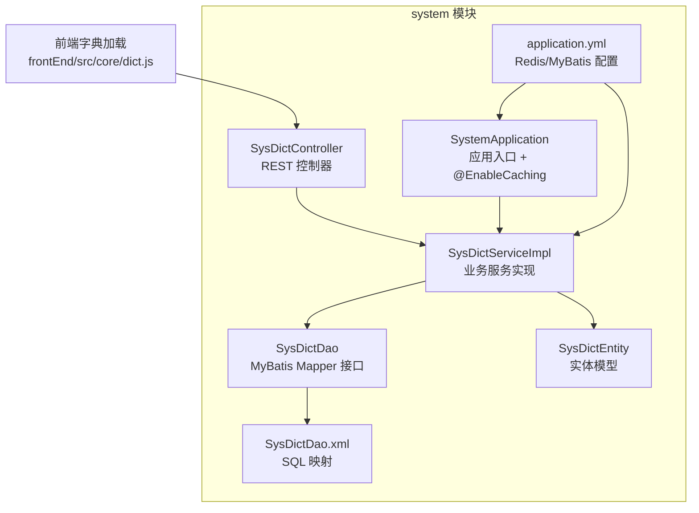
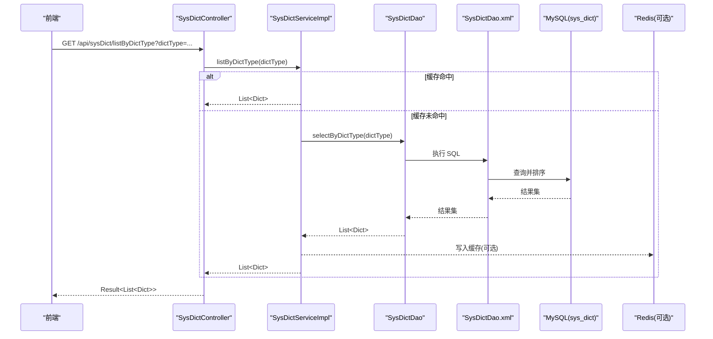
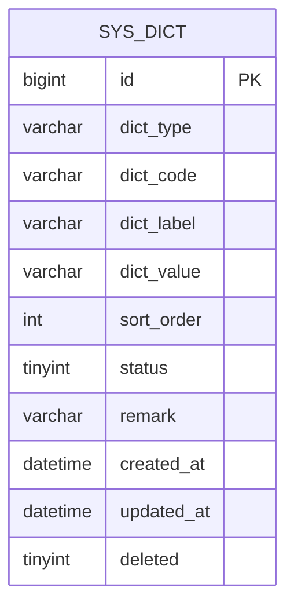
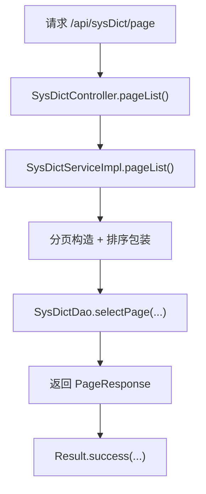
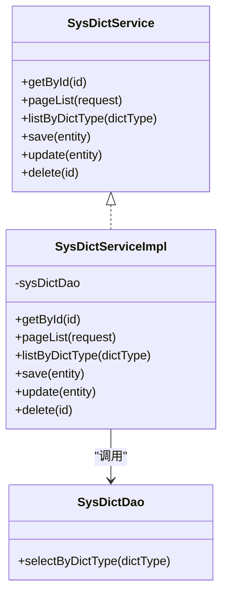
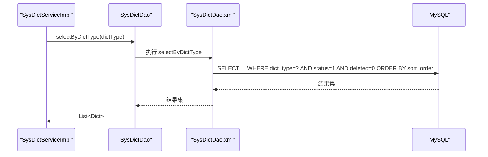
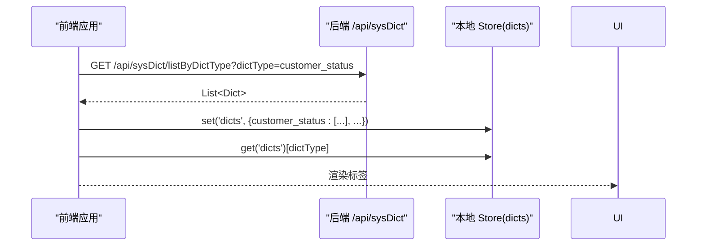
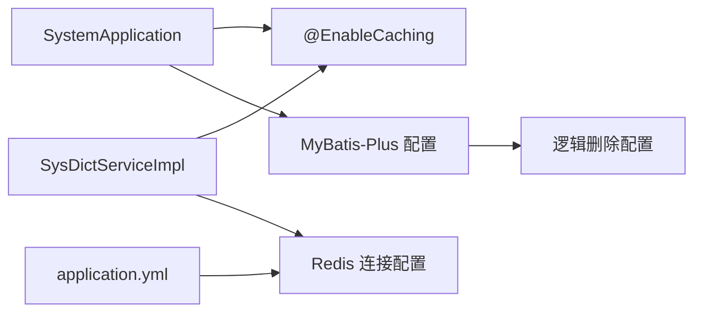

# 数据字典

<cite>
**本文引用的文件**   
- [SysDictController.java](file://system/src/main/java/com/dafuweng/system/controller/SysDictController.java)
- [SysDictService.java](file://system/src/main/java/com/dafuweng/system/service/SysDictService.java)
- [SysDictServiceImpl.java](file://system/src/main/java/com/dafuweng/system/service/impl/SysDictServiceImpl.java)
- [SysDictEntity.java](file://system/src/main/java/com/dafuweng/system/entity/SysDictEntity.java)
- [SysDictDao.java](file://system/src/main/java/com/dafuweng/system/dao/SysDictDao.java)
- [SysDictDao.xml](file://system/src/main/resources/system/mapper/SysDictDao.xml)
- [SystemApplication.java](file://system/src/main/java/com/dafuweng/system/SystemApplication.java)
- [application.yml](file://system/src/main/resources/application.yml)
- [database.sql](file://database.sql)
- [dict.js（前端核心）](file://frontEnd/src/core/dict.js)
- [dict.js（ruoyi-ui）](file://ruoyi-ui/src/utils/dict.js)
</cite>

## 目录
1. [简介](#简介)
2. [项目结构](#项目结构)
3. [核心组件](#核心组件)
4. [架构总览](#架构总览)
5. [详细组件分析](#详细组件分析)
6. [依赖分析](#依赖分析)
7. [性能考虑](#性能考虑)
8. [故障排查指南](#故障排查指南)
9. [结论](#结论)
10. [附录](#附录)

## 简介
本文件面向“数据字典”管理功能，提供完整的API文档与实现解析。内容覆盖：
- 字典类型与字典项的分类定义与存储结构
- 字典项的增删改查操作与事务一致性
- 查询优化策略（索引、排序、分页、缓存）
- 动态字典查询接口设计（按类型查询、排序）
- 完整RESTful API接口清单
- 校验规则、唯一性约束与版本控制机制
- 在业务系统中的应用场景与前端集成方式
- 使用示例与最佳实践

## 项目结构
数据字典功能位于 system 模块，采用经典的分层架构：Controller -> Service -> DAO -> Mapper XML，配合 MyBatis-Plus 与 Spring Cache 实现高性能与可维护性。

图表来源
- [SysDictController.java:1-51](file://system/src/main/java/com/dafuweng/system/controller/SysDictController.java#L1-L51)
- [SysDictServiceImpl.java:1-78](file://system/src/main/java/com/dafuweng/system/service/impl/SysDictServiceImpl.java#L1-L78)
- [SysDictDao.java:1-15](file://system/src/main/java/com/dafuweng/system/dao/SysDictDao.java#L1-L15)
- [SysDictDao.xml:1-28](file://system/src/main/resources/system/mapper/SysDictDao.xml#L1-L28)
- [SysDictEntity.java:1-41](file://system/src/main/java/com/dafuweng/system/entity/SysDictEntity.java#L1-L41)
- [SystemApplication.java:1-16](file://system/src/main/java/com/dafuweng/system/SystemApplication.java#L1-L16)
- [application.yml:1-41](file://system/src/main/resources/application.yml#L1-L41)
- [dict.js（前端核心）:1-45](file://frontEnd/src/core/dict.js#L1-L45)

章节来源
- [SysDictController.java:1-51](file://system/src/main/java/com/dafuweng/system/controller/SysDictController.java#L1-L51)
- [SysDictServiceImpl.java:1-78](file://system/src/main/java/com/dafuweng/system/service/impl/SysDictServiceImpl.java#L1-L78)
- [SysDictDao.java:1-15](file://system/src/main/java/com/dafuweng/system/dao/SysDictDao.java#L1-L15)
- [SysDictDao.xml:1-28](file://system/src/main/resources/system/mapper/SysDictDao.xml#L1-L28)
- [SysDictEntity.java:1-41](file://system/src/main/java/com/dafuweng/system/entity/SysDictEntity.java#L1-L41)
- [SystemApplication.java:1-16](file://system/src/main/java/com/dafuweng/system/SystemApplication.java#L1-L16)
- [application.yml:1-41](file://system/src/main/resources/application.yml#L1-L41)
- [dict.js（前端核心）:1-45](file://frontEnd/src/core/dict.js#L1-L45)

## 核心组件
- 控制器：提供 REST 接口，封装分页、按类型查询、增删改等能力
- 服务层：封装业务逻辑、事务控制、缓存策略
- 数据访问：基于 MyBatis-Plus 的通用 Mapper 与自定义 SQL
- 实体模型：映射 sys_dict 表，含逻辑删除与排序字段
- 前端集成：统一加载常用字典到本地 Store，按需查询标签

章节来源
- [SysDictController.java:1-51](file://system/src/main/java/com/dafuweng/system/controller/SysDictController.java#L1-L51)
- [SysDictService.java:1-34](file://system/src/main/java/com/dafuweng/system/service/SysDictService.java#L1-L34)
- [SysDictServiceImpl.java:1-78](file://system/src/main/java/com/dafuweng/system/service/impl/SysDictServiceImpl.java#L1-L78)
- [SysDictEntity.java:1-41](file://system/src/main/java/com/dafuweng/system/entity/SysDictEntity.java#L1-L41)

## 架构总览
系统通过控制器暴露 REST API，服务层负责：
- 分页查询与排序
- 按字典类型查询并缓存结果
- 事务性保存、更新、删除
- 缓存失效策略（写操作时清理相关缓存）

图表来源
- [SysDictController.java:30-33](file://system/src/main/java/com/dafuweng/system/controller/SysDictController.java#L30-L33)
- [SysDictServiceImpl.java:50-53](file://system/src/main/java/com/dafuweng/system/service/impl/SysDictServiceImpl.java#L50-L53)
- [SysDictDao.xml:19-25](file://system/src/main/resources/system/mapper/SysDictDao.xml#L19-L25)
- [application.yml:12-17](file://system/src/main/resources/application.yml#L12-L17)

## 详细组件分析

### 数据模型与存储结构
- 表：sys_dict
- 主键：id
- 唯一性约束：(dict_type, dict_code)
- 关键字段：dict_type、dict_code、dict_label、dict_value、sort_order、status、deleted
- 索引：idx_dict_type、idx_deleted
- 逻辑删除：deleted 字段，MyBatis 全局配置启用逻辑删除

图表来源
- [database.sql:220-236](file://database.sql#L220-L236)

章节来源
- [database.sql:220-236](file://database.sql#L220-L236)
- [SysDictEntity.java:1-41](file://system/src/main/java/com/dafuweng/system/entity/SysDictEntity.java#L1-L41)
- [application.yml:32-36](file://system/src/main/resources/application.yml#L32-L36)

### 控制器层（REST API）
- 基础路径：/api/sysDict
- 支持操作：
  - GET /{id}：按主键查询
  - GET /page：分页列表（支持排序字段与顺序）
  - GET /listByDictType：按字典类型查询
  - POST：新增
  - PUT：更新
  - DELETE /{id}：删除

图表来源
- [SysDictController.java:25-28](file://system/src/main/java/com/dafuweng/system/controller/SysDictController.java#L25-L28)
- [SysDictServiceImpl.java:32-47](file://system/src/main/java/com/dafuweng/system/service/impl/SysDictServiceImpl.java#L32-L47)

章节来源
- [SysDictController.java:1-51](file://system/src/main/java/com/dafuweng/system/controller/SysDictController.java#L1-L51)

### 服务层（业务与缓存）
- 查询优化：
  - 分页与排序：根据请求参数动态组装排序条件，默认按创建时间倒序
  - 按类型查询：返回启用且未删除的字典项，并按 sort_order 排序
- 缓存策略：
  - 读：按类型查询使用缓存注解，键为 dictType
  - 写：新增/更新时按类型清理缓存；删除时清空所有字典缓存条目
- 事务：新增、更新、删除均在事务内执行

图表来源
- [SysDictService.java:1-34](file://system/src/main/java/com/dafuweng/system/service/SysDictService.java#L1-L34)
- [SysDictServiceImpl.java:1-78](file://system/src/main/java/com/dafuweng/system/service/impl/SysDictServiceImpl.java#L1-L78)
- [SysDictDao.java:1-15](file://system/src/main/java/com/dafuweng/system/dao/SysDictDao.java#L1-L15)

章节来源
- [SysDictServiceImpl.java:1-78](file://system/src/main/java/com/dafuweng/system/service/impl/SysDictServiceImpl.java#L1-L78)
- [SysDictDao.xml:19-25](file://system/src/main/resources/system/mapper/SysDictDao.xml#L19-L25)

### 数据访问层（DAO 与 XML）
- 通用 Mapper：继承 BaseMapper，提供基础 CRUD
- 自定义查询：按 dict_type 查询启用且未删除的字典项，按 sort_order 排序
- SQL 注入防护：使用参数化查询

图表来源
- [SysDictDao.java:13-13](file://system/src/main/java/com/dafuweng/system/dao/SysDictDao.java#L13-L13)
- [SysDictDao.xml:19-25](file://system/src/main/resources/system/mapper/SysDictDao.xml#L19-L25)

章节来源
- [SysDictDao.java:1-15](file://system/src/main/java/com/dafuweng/system/dao/SysDictDao.java#L1-L15)
- [SysDictDao.xml:1-28](file://system/src/main/resources/system/mapper/SysDictDao.xml#L1-L28)

### 前端集成与动态查询
- 常用字典批量加载：启动或页面初始化时，按预设类型批量拉取并缓存到本地 Store
- 标签查询：根据 dictValue 在本地字典集合中查找对应 dictLabel
- 当前仓库中存在两套前端字典实现：
  - frontEnd/src/core/dict.js：调用后端 /api/sysDict/listByDictType 接口
  - ruoyi-ui/src/utils/dict.js：标注“后端字典接口已删除”，返回空数组（用于兼容）

图表来源
- [dict.js（前端核心）:21-44](file://frontEnd/src/core/dict.js#L21-L44)
- [SysDictController.java:30-33](file://system/src/main/java/com/dafuweng/system/controller/SysDictController.java#L30-L33)

章节来源
- [dict.js（前端核心）:1-45](file://frontEnd/src/core/dict.js#L1-L45)
- [dict.js（ruoyi-ui）:1-14](file://ruoyi-ui/src/utils/dict.js#L1-L14)

## 依赖分析
- 应用入口启用缓存：SystemApplication 启用 @EnableCaching
- Redis 配置：application.yml 中配置 Redis 连接参数
- MyBatis-Plus：全局逻辑删除、驼峰映射、Mapper 扫描
- 前端依赖：前端通过统一 API 客户端发起请求

图表来源
- [SystemApplication.java:6-10](file://system/src/main/java/com/dafuweng/system/SystemApplication.java#L6-L10)
- [application.yml:12-17](file://system/src/main/resources/application.yml#L12-L17)
- [application.yml:26-36](file://system/src/main/resources/application.yml#L26-L36)

章节来源
- [SystemApplication.java:1-16](file://system/src/main/java/com/dafuweng/system/SystemApplication.java#L1-L16)
- [application.yml:1-41](file://system/src/main/resources/application.yml#L1-L41)

## 性能考虑
- 索引与查询
  - idx_dict_type：加速按类型查询
  - idx_deleted：加速逻辑删除过滤
  - SQL 层面按 sort_order 排序，避免应用层二次排序
- 分页与排序
  - 服务层根据请求参数动态设置排序字段与方向，默认按创建时间倒序
- 缓存策略
  - 读：按类型查询结果缓存，减少数据库压力
  - 写：新增/更新按类型清理缓存；删除清空所有字典缓存，保证一致性
- Redis 集成
  - 可选启用 Redis 缓存，提升高并发场景下的响应速度与吞吐量

章节来源
- [SysDictDao.xml:23-24](file://system/src/main/resources/system/mapper/SysDictDao.xml#L23-L24)
- [SysDictServiceImpl.java:32-47](file://system/src/main/java/com/dafuweng/system/service/impl/SysDictServiceImpl.java#L32-L47)
- [SysDictServiceImpl.java:50-53](file://system/src/main/java/com/dafuweng/system/service/impl/SysDictServiceImpl.java#L50-L53)
- [SysDictServiceImpl.java:57-76](file://system/src/main/java/com/dafuweng/system/service/impl/SysDictServiceImpl.java#L57-L76)
- [application.yml:12-17](file://system/src/main/resources/application.yml#L12-L17)

## 故障排查指南
- 接口返回为空或异常
  - 检查 Redis 是否可用（若启用），确认缓存连接配置正确
  - 核对 dictType 参数是否正确，是否存在启用且未删除的记录
- 分页/排序无效
  - 确认请求参数（sortField、sortOrder）是否传入，排序字段是否合法
- 缓存未生效
  - 确认 SystemApplication 已启用 @EnableCaching
  - 检查 Redis 是否连通，以及缓存键是否按类型生成
- 前端无法渲染字典标签
  - 若使用 ruoyi-ui 的实现，其已标注“后端字典接口已删除”，会返回空数组
  - 建议切换到 frontEnd/src/core/dict.js 的实现，确保后端接口可用

章节来源
- [application.yml:12-17](file://system/src/main/resources/application.yml#L12-L17)
- [SystemApplication.java:6-10](file://system/src/main/java/com/dafuweng/system/SystemApplication.java#L6-L10)
- [dict.js（ruoyi-ui）:1-14](file://ruoyi-ui/src/utils/dict.js#L1-L14)
- [dict.js（前端核心）:21-44](file://frontEnd/src/core/dict.js#L21-L44)

## 结论
本数据字典模块以清晰的分层架构、完善的缓存策略与严格的查询优化，实现了高效、可扩展的字典管理能力。结合前端统一加载与本地查询，满足多业务场景下的标签渲染需求。建议在生产环境中启用 Redis 缓存，并持续关注缓存键设计与失效策略的一致性。

## 附录

### RESTful API 接口清单
- GET /api/sysDict/{id}
  - 功能：按主键查询字典项
  - 请求参数：路径变量 id
  - 返回：字典项详情
- GET /api/sysDict/page
  - 功能：分页查询字典项
  - 请求参数：page、size、sortField、sortOrder
  - 返回：分页结果（总数、记录列表、当前页、页大小）
- GET /api/sysDict/listByDictType
  - 功能：按字典类型查询启用且未删除的字典项
  - 请求参数：dictType
  - 返回：按 sort_order 排序的字典项列表
- POST /api/sysDict
  - 功能：新增字典项
  - 请求体：字典项实体
  - 返回：新增后的字典项
- PUT /api/sysDict
  - 功能：更新字典项
  - 请求体：字典项实体
  - 返回：更新后的字典项
- DELETE /api/sysDict/{id}
  - 功能：删除字典项（逻辑删除）
  - 路径参数：id
  - 返回：成功

章节来源
- [SysDictController.java:20-49](file://system/src/main/java/com/dafuweng/system/controller/SysDictController.java#L20-L49)

### 数据模型字段说明
- id：字典项主键
- dict_type：字典类型（与 dict_code 联合唯一）
- dict_code：字典编码（同一类型下唯一）
- dict_label：展示标签
- dict_value：存储值
- sort_order：排序权重
- status：启用状态（1 启用，0 禁用）
- remark：备注
- created_at/updated_at：创建与更新时间
- deleted：逻辑删除标志（0 未删，1 已删）

章节来源
- [SysDictEntity.java:1-41](file://system/src/main/java/com/dafuweng/system/entity/SysDictEntity.java#L1-L41)
- [database.sql:220-236](file://database.sql#L220-L236)

### 校验规则与唯一性约束
- 唯一性约束：(dict_type, dict_code) 联合唯一
- 状态约束：仅查询 status=1 的记录
- 逻辑删除：deleted=0 的记录参与查询
- 前端校验：前端可通过本地 Store 缓存进行快速校验与回显

章节来源
- [database.sql:233-233](file://database.sql#L233-L233)
- [SysDictDao.xml:23-23](file://system/src/main/resources/system/mapper/SysDictDao.xml#L23-L23)
- [dict.js（前端核心）:40-44](file://frontEnd/src/core/dict.js#L40-L44)

### 版本控制机制
- 版本字段：实体类未声明 version 字段，未启用数据库层面的乐观锁
- 建议：如需强一致写入与并发控制，可在实体中增加 version 字段并配合 MyBatis-Plus 的乐观锁插件

章节来源
- [SysDictEntity.java:1-41](file://system/src/main/java/com/dafuweng/system/entity/SysDictEntity.java#L1-L41)
- [database.sql:220-236](file://database.sql#L220-L236)

### 业务应用场景与集成方式
- 客户管理：客户类型、状态、意向等级
- 合同与贷款：合同状态、审核状态、支付方式
- 销售与财务：服务费类型、支付状态、业绩状态
- 集成方式：前端启动时批量加载常用字典，运行时按需查询标签，降低网络开销

章节来源
- [dict.js（前端核心）:7-18](file://frontEnd/src/core/dict.js#L7-L18)
- [database.sql:238-272](file://database.sql#L238-L272)

### 使用示例与最佳实践
- 示例：加载“客户状态”字典
  - 前端：调用 /api/sysDict/listByDictType?dictType=customer_status，将结果存入 Store
  - 渲染：通过 getDictLabel('customer_status', value) 获取标签
- 最佳实践：
  - 为高频类型开启 Redis 缓存
  - 写操作后及时清理相关缓存键，避免脏读
  - 对外暴露的查询接口统一走按类型查询，避免全表扫描
  - 前端统一管理常用类型，减少重复请求

章节来源
- [dict.js（前端核心）:21-44](file://frontEnd/src/core/dict.js#L21-L44)
- [SysDictServiceImpl.java:50-53](file://system/src/main/java/com/dafuweng/system/service/impl/SysDictServiceImpl.java#L50-L53)
- [SysDictServiceImpl.java:57-76](file://system/src/main/java/com/dafuweng/system/service/impl/SysDictServiceImpl.java#L57-L76)