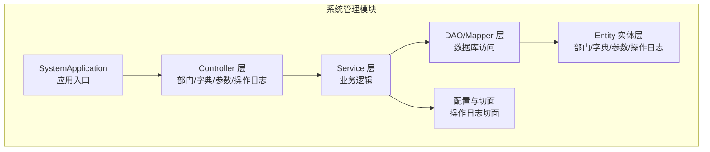
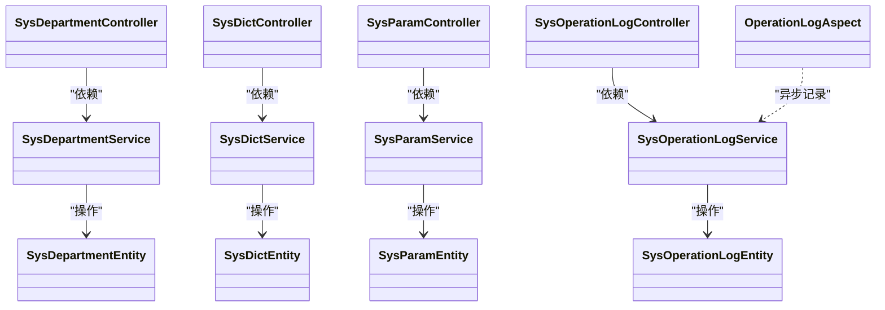
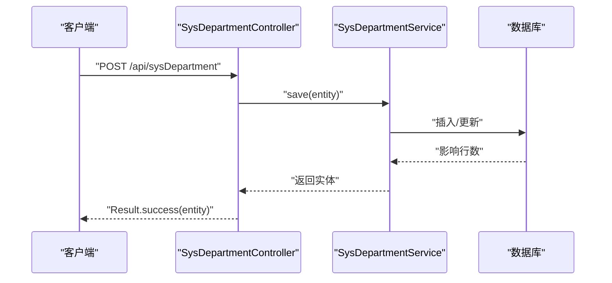
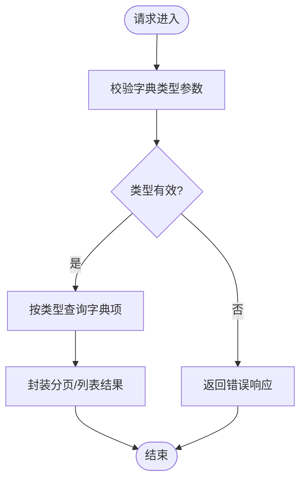
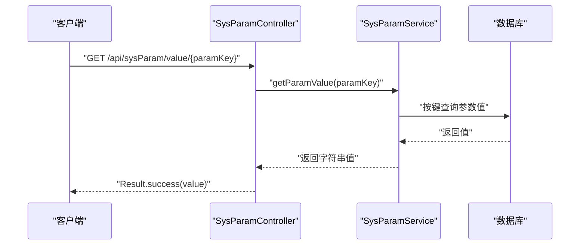
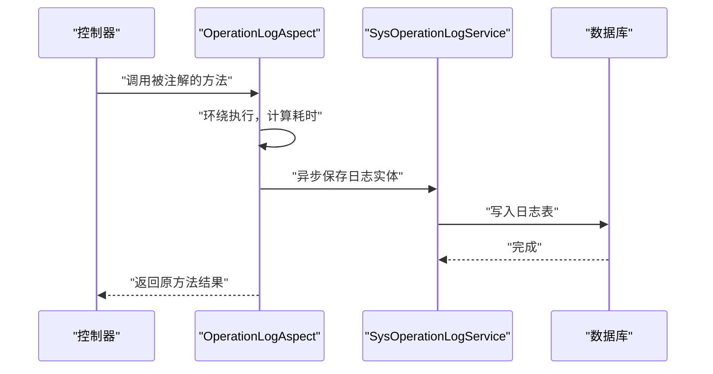
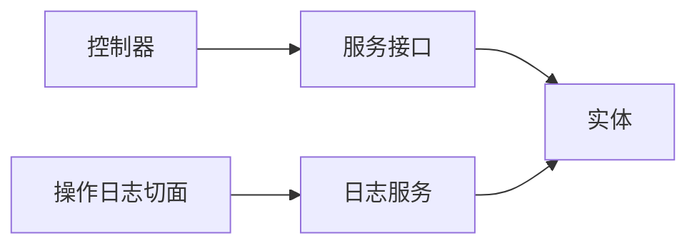

# 系统管理模块

<cite>
**本文引用的文件**
- [SystemApplication.java](file://system/src/main/java/com/dafuweng/system/SystemApplication.java)
- [SysDepartmentController.java](file://system/src/main/java/com/dafuweng/system/controller/SysDepartmentController.java)
- [SysDictController.java](file://system/src/main/java/com/dafuweng/system/controller/SysDictController.java)
- [SysParamController.java](file://system/src/main/java/com/dafuweng/system/controller/SysParamController.java)
- [SysOperationLogController.java](file://system/src/main/java/com/dafuweng/system/controller/SysOperationLogController.java)
- [SysDepartmentService.java](file://system/src/main/java/com/dafuweng/system/service/SysDepartmentService.java)
- [SysDictService.java](file://system/src/main/java/com/dafuweng/system/service/SysDictService.java)
- [SysParamService.java](file://system/src/main/java/com/dafuweng/system/service/SysParamService.java)
- [SysOperationLogService.java](file://system/src/main/java/com/dafuweng/system/service/SysOperationLogService.java)
- [SysDepartmentEntity.java](file://system/src/main/java/com/dafuweng/system/entity/SysDepartmentEntity.java)
- [SysDictEntity.java](file://system/src/main/java/com/dafuweng/system/entity/SysDictEntity.java)
- [SysParamEntity.java](file://system/src/main/java/com/dafuweng/system/entity/SysParamEntity.java)
- [SysOperationLogEntity.java](file://system/src/main/java/com/dafuweng/system/entity/SysOperationLogEntity.java)
- [OperationLogAspect.java](file://system/src/main/java/com/dafuweng/system/config/OperationLogAspect.java)
</cite>

## 目录
1. [简介](#简介)
2. [项目结构](#项目结构)
3. [核心组件](#核心组件)
4. [架构总览](#架构总览)
5. [详细组件分析](#详细组件分析)
6. [依赖分析](#依赖分析)
7. [性能考虑](#性能考虑)
8. [故障排查指南](#故障排查指南)
9. [结论](#结论)
10. [附录：API 接口文档](#附录api-接口文档)

## 简介
本文件为系统管理模块的功能文档，覆盖以下能力域：
- 组织架构管理：部门层级结构、部门属性配置与组织关系维护
- 数据字典管理：字典类型定义、字典数据维护与动态字典查询
- 系统参数配置：参数分类、参数值设置与配置项动态更新
- 操作日志审计：日志记录策略、查询过滤与统计分析
- 安全与权限：数据权限控制与操作安全防护
- 监控与性能：系统监控指标与优化建议

## 项目结构
系统管理模块位于 system 子工程中，采用标准的分层架构（控制器-服务-持久层），并使用 Spring Boot + MyBatis-Plus 进行开发。应用入口扫描包路径包含 com.dafuweng，启用缓存注解。

图表来源
- [SystemApplication.java:1-16](file://system/src/main/java/com/dafuweng/system/SystemApplication.java#L1-L16)

章节来源
- [SystemApplication.java:1-16](file://system/src/main/java/com/dafuweng/system/SystemApplication.java#L1-L16)

## 核心组件
- 控制器层：提供 RESTful 接口，统一返回 Result 包装
- 服务层：定义业务接口，支持分页、列表查询、新增/修改/删除
- 实体层：对应数据库表结构，含软删除字段
- 切面层：基于注解的操作日志切面，异步记录请求耗时与上下文信息

章节来源
- [SysDepartmentController.java:1-56](file://system/src/main/java/com/dafuweng/system/controller/SysDepartmentController.java#L1-L56)
- [SysDictController.java:1-51](file://system/src/main/java/com/dafuweng/system/controller/SysDictController.java#L1-L51)
- [SysParamController.java:1-62](file://system/src/main/java/com/dafuweng/system/controller/SysParamController.java#L1-L62)
- [SysOperationLogController.java:1-45](file://system/src/main/java/com/dafuweng/system/controller/SysOperationLogController.java#L1-L45)
- [SysDepartmentService.java:1-35](file://system/src/main/java/com/dafuweng/system/service/SysDepartmentService.java#L1-L35)
- [SysDictService.java:1-34](file://system/src/main/java/com/dafuweng/system/service/SysDictService.java#L1-L34)
- [SysParamService.java:1-37](file://system/src/main/java/com/dafuweng/system/service/SysParamService.java#L1-L37)
- [SysOperationLogService.java:1-30](file://system/src/main/java/com/dafuweng/system/service/SysOperationLogService.java#L1-L30)
- [SysDepartmentEntity.java:1-45](file://system/src/main/java/com/dafuweng/system/entity/SysDepartmentEntity.java#L1-L45)
- [SysDictEntity.java:1-41](file://system/src/main/java/com/dafuweng/system/entity/SysDictEntity.java#L1-L41)
- [SysParamEntity.java:1-45](file://system/src/main/java/com/dafuweng/system/entity/SysParamEntity.java#L1-L45)
- [SysOperationLogEntity.java:1-45](file://system/src/main/java/com/dafuweng/system/entity/SysOperationLogEntity.java#L1-L45)
- [OperationLogAspect.java:1-87](file://system/src/main/java/com/dafuweng/system/config/OperationLogAspect.java#L1-L87)

## 架构总览
系统管理模块遵循典型的 MVC 分层与领域建模，控制器负责接收请求并返回结果，服务层封装业务规则，实体映射数据库表，切面负责横切关注点（如操作日志）。

图表来源
- [SysDepartmentController.java:1-56](file://system/src/main/java/com/dafuweng/system/controller/SysDepartmentController.java#L1-L56)
- [SysDictController.java:1-51](file://system/src/main/java/com/dafuweng/system/controller/SysDictController.java#L1-L51)
- [SysParamController.java:1-62](file://system/src/main/java/com/dafuweng/system/controller/SysParamController.java#L1-L62)
- [SysOperationLogController.java:1-45](file://system/src/main/java/com/dafuweng/system/controller/SysOperationLogController.java#L1-L45)
- [SysDepartmentService.java:1-35](file://system/src/main/java/com/dafuweng/system/service/SysDepartmentService.java#L1-L35)
- [SysDictService.java:1-34](file://system/src/main/java/com/dafuweng/system/service/SysDictService.java#L1-L34)
- [SysParamService.java:1-37](file://system/src/main/java/com/dafuweng/system/service/SysParamService.java#L1-L37)
- [SysOperationLogService.java:1-30](file://system/src/main/java/com/dafuweng/system/service/SysOperationLogService.java#L1-L30)
- [SysDepartmentEntity.java:1-45](file://system/src/main/java/com/dafuweng/system/entity/SysDepartmentEntity.java#L1-L45)
- [SysDictEntity.java:1-41](file://system/src/main/java/com/dafuweng/system/entity/SysDictEntity.java#L1-L41)
- [SysParamEntity.java:1-45](file://system/src/main/java/com/dafuweng/system/entity/SysParamEntity.java#L1-L45)
- [SysOperationLogEntity.java:1-45](file://system/src/main/java/com/dafuweng/system/entity/SysOperationLogEntity.java#L1-L45)
- [OperationLogAspect.java:1-87](file://system/src/main/java/com/dafuweng/system/config/OperationLogAspect.java#L1-L87)

## 详细组件分析

### 组织架构管理（部门）
- 功能要点
  - 支持按父级部门查询子部门树形列表
  - 支持按区域查询部门列表
  - 支持分页查询与单条详情查询
  - 支持新增、修改、删除（软删除）
- 关键实体字段
  - 部门编码、名称、父级 ID、所属区域、负责人、排序、状态、创建/更新信息
- 控制器接口
  - GET /api/sysDepartment/{id}：按主键查询
  - GET /api/sysDepartment/page：分页查询
  - GET /api/sysDepartment/listByParentId/{parentId}：按父级查询子部门
  - GET /api/sysDepartment/listByZoneId/{zoneId}：按区域查询部门
  - POST /api/sysDepartment：新增
  - PUT /api/sysDepartment：修改
  - DELETE /api/sysDepartment/{id}：删除

图表来源
- [SysDepartmentController.java:40-48](file://system/src/main/java/com/dafuweng/system/controller/SysDepartmentController.java#L40-L48)
- [SysDepartmentService.java:26-33](file://system/src/main/java/com/dafuweng/system/service/SysDepartmentService.java#L26-L33)

章节来源
- [SysDepartmentController.java:1-56](file://system/src/main/java/com/dafuweng/system/controller/SysDepartmentController.java#L1-L56)
- [SysDepartmentService.java:1-35](file://system/src/main/java/com/dafuweng/system/service/SysDepartmentService.java#L1-L35)
- [SysDepartmentEntity.java:1-45](file://system/src/main/java/com/dafuweng/system/entity/SysDepartmentEntity.java#L1-L45)

### 数据字典管理
- 功能要点
  - 字典类型定义与字典数据维护
  - 支持按字典类型查询字典项列表
  - 支持分页查询与单条详情查询
  - 支持新增、修改、删除（软删除）
- 关键实体字段
  - 字典类型、字典编码、标签、值、排序、状态、备注、创建/更新时间
- 控制器接口
  - GET /api/sysDict/{id}
  - GET /api/sysDict/page
  - GET /api/sysDict/listByDictType
  - POST /api/sysDict
  - PUT /api/sysDict
  - DELETE /api/sysDict/{id}

图表来源
- [SysDictController.java:30-33](file://system/src/main/java/com/dafuweng/system/controller/SysDictController.java#L30-L33)
- [SysDictService.java:23](file://system/src/main/java/com/dafuweng/system/service/SysDictService.java#L23)

章节来源
- [SysDictController.java:1-51](file://system/src/main/java/com/dafuweng/system/controller/SysDictController.java#L1-L51)
- [SysDictService.java:1-34](file://system/src/main/java/com/dafuweng/system/service/SysDictService.java#L1-L34)
- [SysDictEntity.java:1-41](file://system/src/main/java/com/dafuweng/system/entity/SysDictEntity.java#L1-L41)

### 系统参数配置管理
- 功能要点
  - 参数键值对存储，支持按参数组分类
  - 支持按参数键获取参数值与参数详情
  - 支持分页查询与单条详情查询
  - 支持新增、修改、删除（软删除）
- 关键实体字段
  - 参数键、参数值、参数类型、参数组、排序、状态、备注、创建/更新信息
- 控制器接口
  - GET /api/sysParam/{id}
  - GET /api/sysParam/getByParamKey
  - GET /api/sysParam/page
  - GET /api/sysParam/listByParamGroup
  - GET /api/sysParam/value/{paramKey}
  - POST /api/sysParam
  - PUT /api/sysParam
  - DELETE /api/sysParam/{id}

图表来源
- [SysParamController.java:40-44](file://system/src/main/java/com/dafuweng/system/controller/SysParamController.java#L40-L44)
- [SysParamService.java:22](file://system/src/main/java/com/dafuweng/system/service/SysParamService.java#L22)

章节来源
- [SysParamController.java:1-62](file://system/src/main/java/com/dafuweng/system/controller/SysParamController.java#L1-L62)
- [SysParamService.java:1-37](file://system/src/main/java/com/dafuweng/system/service/SysParamService.java#L1-L37)
- [SysParamEntity.java:1-45](file://system/src/main/java/com/dafuweng/system/entity/SysParamEntity.java#L1-L45)

### 操作日志审计
- 记录策略
  - 基于注解切面自动拦截标注方法，异步记录请求耗时、用户、模块、动作、请求参数等
  - 日志实体包含用户标识、模块、动作、请求方法、URL、参数、响应码、错误信息、IP、UA、耗时、创建时间
- 查询与过滤
  - 支持按 ID、用户、模块等维度查询
  - 支持分页查询
- 控制器接口
  - GET /api/sysOperationLog/{id}
  - GET /api/sysOperationLog/page
  - GET /api/sysOperationLog/listByUserId/{userId}
  - GET /api/sysOperationLog/listByModule/{module}
  - POST /api/sysOperationLog

图表来源
- [OperationLogAspect.java:35-60](file://system/src/main/java/com/dafuweng/system/config/OperationLogAspect.java#L35-L60)
- [SysOperationLogController.java:40-43](file://system/src/main/java/com/dafuweng/system/controller/SysOperationLogController.java#L40-L43)
- [SysOperationLogService.java:27-28](file://system/src/main/java/com/dafuweng/system/service/SysOperationLogService.java#L27-L28)

章节来源
- [SysOperationLogController.java:1-45](file://system/src/main/java/com/dafuweng/system/controller/SysOperationLogController.java#L1-L45)
- [SysOperationLogService.java:1-30](file://system/src/main/java/com/dafuweng/system/service/SysOperationLogService.java#L1-L30)
- [SysOperationLogEntity.java:1-45](file://system/src/main/java/com/dafuweng/system/entity/SysOperationLogEntity.java#L1-L45)
- [OperationLogAspect.java:1-87](file://system/src/main/java/com/dafuweng/system/config/OperationLogAspect.java#L1-L87)

## 依赖分析
- 控制器到服务：通过依赖注入使用服务接口，保持松耦合
- 服务到实体：服务方法接收/返回实体对象，进行数据转换与业务处理
- 切面到服务：切面异步调用日志服务，避免阻塞主流程
- 数据访问：MyBatis-Plus 提供通用 CRUD 能力，结合分页插件与条件构造器

图表来源
- [SysDepartmentController.java:17-18](file://system/src/main/java/com/dafuweng/system/controller/SysDepartmentController.java#L17-L18)
- [SysDictController.java:17-18](file://system/src/main/java/com/dafuweng/system/controller/SysDictController.java#L17-L18)
- [SysParamController.java:17-18](file://system/src/main/java/com/dafuweng/system/controller/SysParamController.java#L17-L18)
- [SysOperationLogController.java:17-18](file://system/src/main/java/com/dafuweng/system/controller/SysOperationLogController.java#L17-L18)
- [OperationLogAspect.java:26-27](file://system/src/main/java/com/dafuweng/system/config/OperationLogAspect.java#L26-L27)

章节来源
- [SysDepartmentController.java:1-56](file://system/src/main/java/com/dafuweng/system/controller/SysDepartmentController.java#L1-L56)
- [SysDictController.java:1-51](file://system/src/main/java/com/dafuweng/system/controller/SysDictController.java#L1-L51)
- [SysParamController.java:1-62](file://system/src/main/java/com/dafuweng/system/controller/SysParamController.java#L1-L62)
- [SysOperationLogController.java:1-45](file://system/src/main/java/com/dafuweng/system/controller/SysOperationLogController.java#L1-L45)
- [OperationLogAspect.java:1-87](file://system/src/main/java/com/dafuweng/system/config/OperationLogAspect.java#L1-L87)

## 性能考虑
- 异步日志：操作日志切面使用异步线程池提交写入，降低请求延迟
- 分页查询：服务层统一使用分页插件，避免一次性加载大量数据
- 缓存启用：应用入口启用缓存注解，可结合业务场景引入 Redis 缓存热点参数或字典
- 数据权限：建议在服务层或网关层集成数据范围控制，避免越权访问
- 数据库索引：针对高频查询字段（如字典类型、参数键、部门父级、区域）建立索引

## 故障排查指南
- 返回格式
  - 所有接口统一返回 Result 包装，便于前端统一处理
- 常见问题定位
  - 参数校验失败：检查请求体与路径参数是否符合接口定义
  - 权限不足：确认用户角色与菜单权限是否匹配
  - 数据不存在：确认主键是否存在或已被软删除
  - 日志未入库：检查切面注解是否正确标注以及异步任务是否执行

章节来源
- [SysDepartmentController.java:20-23](file://system/src/main/java/com/dafuweng/system/controller/SysDepartmentController.java#L20-L23)
- [SysDictController.java:20-23](file://system/src/main/java/com/dafuweng/system/controller/SysDictController.java#L20-L23)
- [SysParamController.java:20-23](file://system/src/main/java/com/dafuweng/system/controller/SysParamController.java#L20-L23)
- [SysOperationLogController.java:20-23](file://system/src/main/java/com/dafuweng/system/controller/SysOperationLogController.java#L20-L23)

## 结论
系统管理模块提供了完善的组织架构、数据字典、系统参数与操作日志能力，采用清晰的分层设计与统一的结果包装，具备良好的扩展性与可维护性。建议在生产环境中配合数据权限控制、缓存策略与数据库索引优化，进一步提升性能与安全性。

## 附录：API 接口文档

- 部门管理
  - GET /api/sysDepartment/{id}
  - GET /api/sysDepartment/page
  - GET /api/sysDepartment/listByParentId/{parentId}
  - GET /api/sysDepartment/listByZoneId/{zoneId}
  - POST /api/sysDepartment
  - PUT /api/sysDepartment
  - DELETE /api/sysDepartment/{id}

- 数据字典
  - GET /api/sysDict/{id}
  - GET /api/sysDict/page
  - GET /api/sysDict/listByDictType
  - POST /api/sysDict
  - PUT /api/sysDict
  - DELETE /api/sysDict/{id}

- 系统参数
  - GET /api/sysParam/{id}
  - GET /api/sysParam/getByParamKey
  - GET /api/sysParam/page
  - GET /api/sysParam/listByParamGroup
  - GET /api/sysParam/value/{paramKey}
  - POST /api/sysParam
  - PUT /api/sysParam
  - DELETE /api/sysParam/{id}

- 操作日志
  - GET /api/sysOperationLog/{id}
  - GET /api/sysOperationLog/page
  - GET /api/sysOperationLog/listByUserId/{userId}
  - GET /api/sysOperationLog/listByModule/{module}
  - POST /api/sysOperationLog

章节来源
- [SysDepartmentController.java:1-56](file://system/src/main/java/com/dafuweng/system/controller/SysDepartmentController.java#L1-L56)
- [SysDictController.java:1-51](file://system/src/main/java/com/dafuweng/system/controller/SysDictController.java#L1-L51)
- [SysParamController.java:1-62](file://system/src/main/java/com/dafuweng/system/controller/SysParamController.java#L1-L62)
- [SysOperationLogController.java:1-45](file://system/src/main/java/com/dafuweng/system/controller/SysOperationLogController.java#L1-L45)