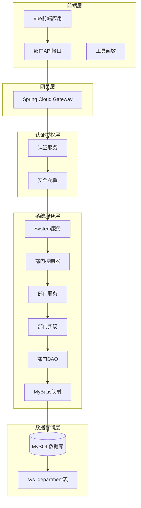
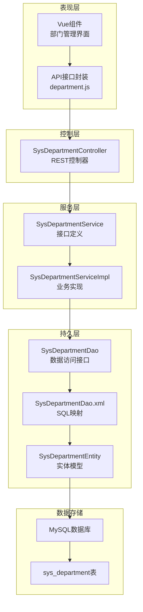
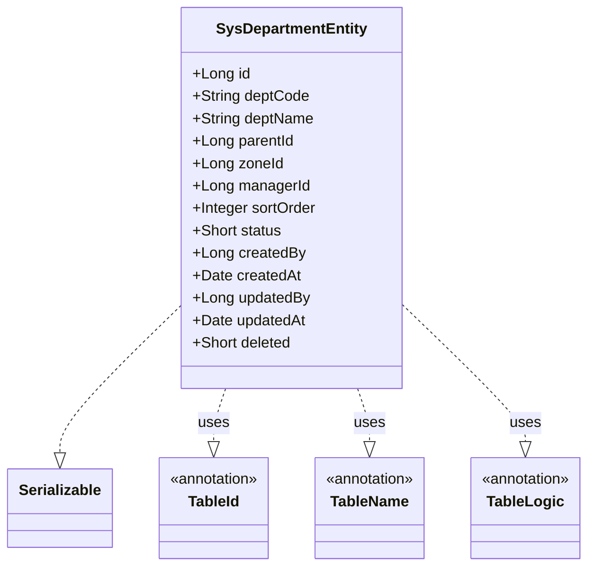
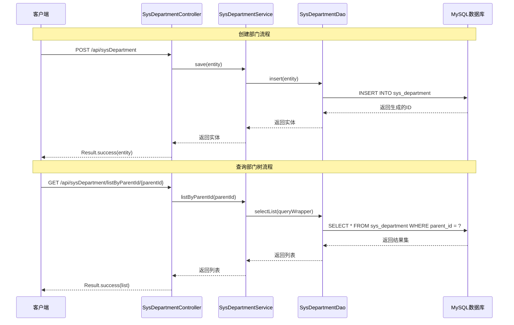
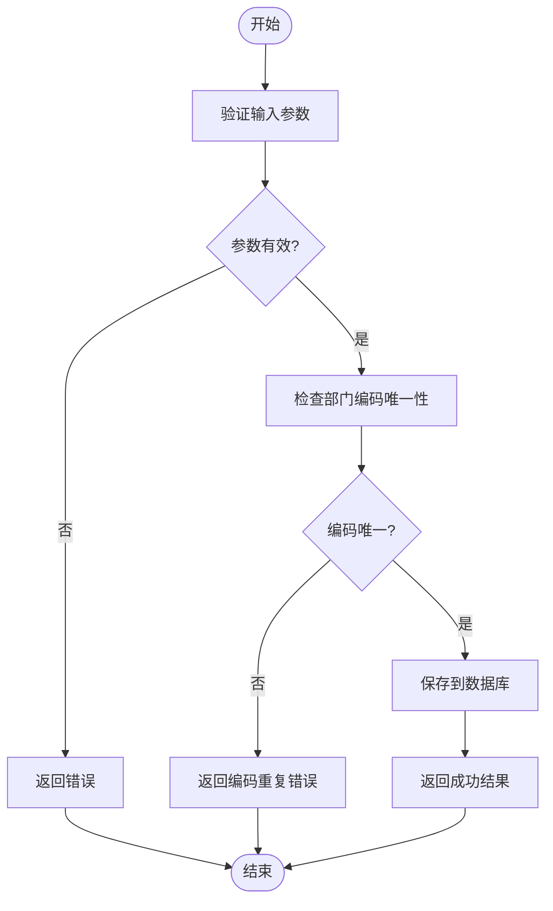
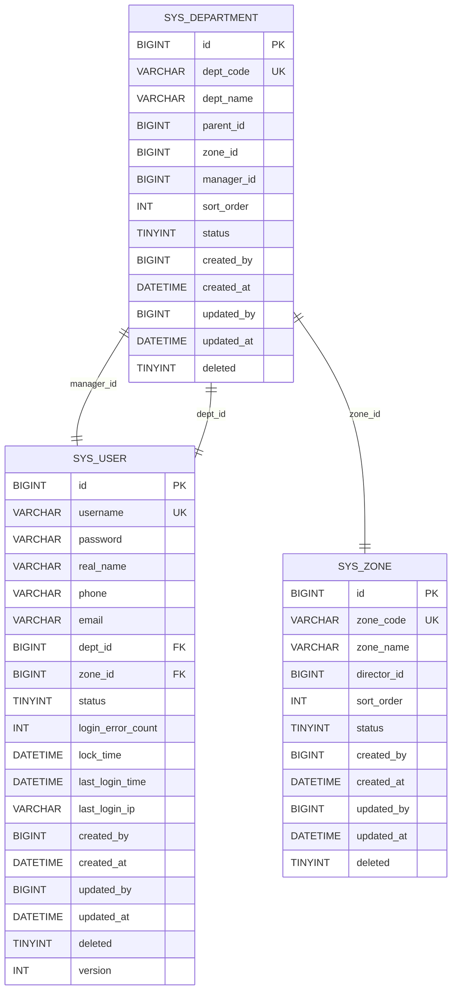
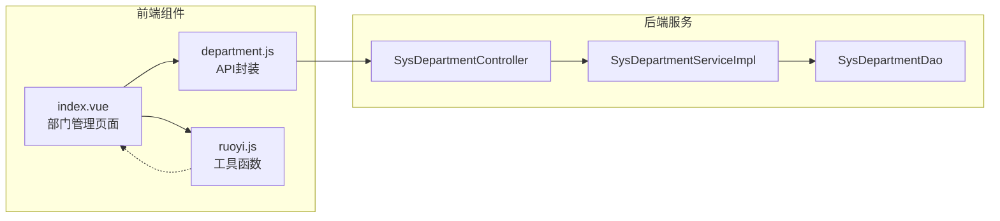
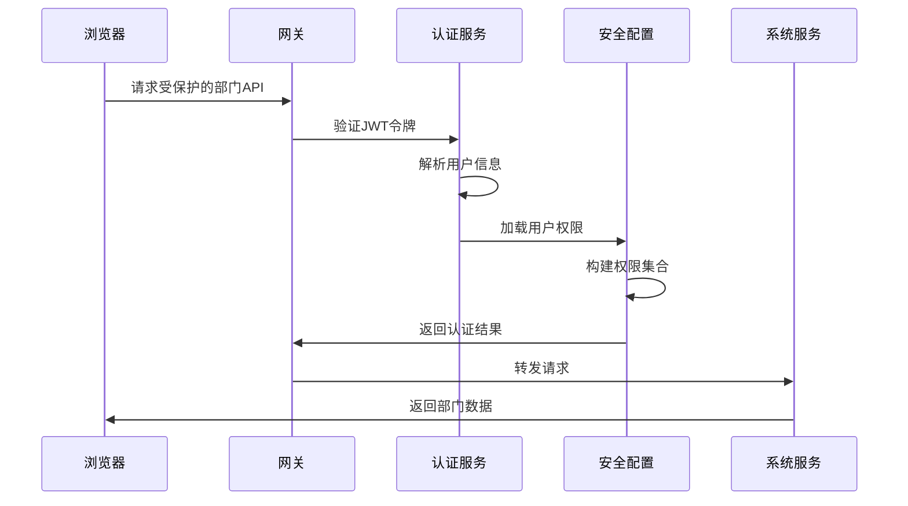

# 部门管理

<cite>
**本文档引用的文件**
- [SysDepartmentController.java](file://system/src/main/java/com/dafuweng/system/controller/SysDepartmentController.java)
- [SysDepartmentService.java](file://system/src/main/java/com/dafuweng/system/service/SysDepartmentService.java)
- [SysDepartmentServiceImpl.java](file://system/src/main/java/com/dafuweng/system/service/impl/SysDepartmentServiceImpl.java)
- [SysDepartmentDao.java](file://system/src/main/java/com/dafuweng/system/dao/SysDepartmentDao.java)
- [SysDepartmentDao.xml](file://system/src/main/resources/system/mapper/SysDepartmentDao.xml)
- [SysDepartmentEntity.java](file://system/src/main/java/com/dafuweng/system/entity/SysDepartmentEntity.java)
- [department.js](file://ruoyi-ui/src/api/system/department.js)
- [index.vue](file://ruoyi-ui/src/views/system/department/index.vue)
- [database.sql](file://database.sql)
- [JwtAuthenticationFilter.java](file://auth/src/main/java/com/dafuweng/auth/filter/JwtAuthenticationFilter.java)
- [SecurityConfig.java](file://auth/src/main/java/com/dafuweng/auth/config/SecurityConfig.java)
- [ruoyi.js](file://ruoyi-ui/src/utils/ruoyi.js)
</cite>

## 目录
1. [简介](#简介)
2. [项目结构](#项目结构)
3. [核心组件](#核心组件)
4. [架构概览](#架构概览)
5. [详细组件分析](#详细组件分析)
6. [依赖关系分析](#依赖关系分析)
7. [性能考虑](#性能考虑)
8. [故障排除指南](#故障排除指南)
9. [结论](#结论)
10. [附录](#附录)

## 简介
本文件为NeoCC项目中的部门管理功能提供详细的API文档和技术说明。系统基于微服务架构，采用四库垂直拆分的设计，其中部门管理功能位于system服务中，负责组织架构中的部门层级结构管理。

部门管理功能涵盖以下核心能力：
- 部门层级结构管理：支持多层级父子关系维护
- CRUD操作：创建、查询、更新、删除部门
- 树形结构展示：支持部门树的构建和展示
- 属性配置：部门编码、负责人、状态管理
- 关联关系：与用户、战区的关联管理
- 数据一致性：通过唯一约束和外键关系保证数据完整性

## 项目结构
部门管理功能在系统中的整体架构如下：

**图表来源**
- [SysDepartmentController.java:13-55](file://system/src/main/java/com/dafuweng/system/controller/SysDepartmentController.java#L13-L55)
- [SysDepartmentServiceImpl.java:18-82](file://system/src/main/java/com/dafuweng/system/service/impl/SysDepartmentServiceImpl.java#L18-L82)
- [SysDepartmentDao.java:1-9](file://system/src/main/java/com/dafuweng/system/dao/SysDepartmentDao.java#L1-L9)

**章节来源**
- [SysDepartmentController.java:1-56](file://system/src/main/java/com/dafuweng/system/controller/SysDepartmentController.java#L1-L56)
- [SysDepartmentService.java:1-35](file://system/src/main/java/com/dafuweng/system/service/SysDepartmentService.java#L1-L35)
- [SysDepartmentServiceImpl.java:1-83](file://system/src/main/java/com/dafuweng/system/service/impl/SysDepartmentServiceImpl.java#L1-L83)

## 核心组件
部门管理功能的核心组件包括：

### 数据模型
部门实体包含以下关键属性：
- `id`: 部门唯一标识
- `deptCode`: 部门编码（唯一约束）
- `deptName`: 部门名称
- `parentId`: 父部门ID（0表示根节点）
- `zoneId`: 所属战区ID
- `managerId`: 部门负责人ID
- `sortOrder`: 显示顺序
- `status`: 部门状态（1启用，0禁用）
- `deleted`: 逻辑删除标记

### 控制器层
提供RESTful API接口：
- GET `/api/sysDepartment/{id}` - 获取单个部门
- GET `/api/sysDepartment/page` - 分页查询部门列表
- GET `/api/sysDepartment/listByParentId/{parentId}` - 按父ID查询子部门
- GET `/api/sysDepartment/listByZoneId/{zoneId}` - 按战区查询部门
- POST `/api/sysDepartment` - 创建部门
- PUT `/api/sysDepartment` - 更新部门
- DELETE `/api/sysDepartment/{id}` - 删除部门

### 服务层
实现业务逻辑：
- 部门CRUD操作
- 分页查询和排序
- 父子关系查询
- 事务管理

**章节来源**
- [SysDepartmentEntity.java:11-44](file://system/src/main/java/com/dafuweng/system/entity/SysDepartmentEntity.java#L11-L44)
- [SysDepartmentController.java:20-54](file://system/src/main/java/com/dafuweng/system/controller/SysDepartmentController.java#L20-L54)
- [SysDepartmentService.java:16-34](file://system/src/main/java/com/dafuweng/system/service/SysDepartmentService.java#L16-L34)

## 架构概览
部门管理功能采用经典的三层架构模式：

**图表来源**
- [SysDepartmentController.java:1-56](file://system/src/main/java/com/dafuweng/system/controller/SysDepartmentController.java#L1-L56)
- [SysDepartmentServiceImpl.java:1-83](file://system/src/main/java/com/dafuweng/system/service/impl/SysDepartmentServiceImpl.java#L1-L83)
- [SysDepartmentDao.xml:1-21](file://system/src/main/resources/system/mapper/SysDepartmentDao.xml#L1-L21)

## 详细组件分析

### 部门实体模型
部门实体采用MyBatis-Plus注解进行ORM映射：

**图表来源**
- [SysDepartmentEntity.java:11-44](file://system/src/main/java/com/dafuweng/system/entity/SysDepartmentEntity.java#L11-L44)

### 控制器层实现
REST控制器提供完整的CRUD操作：

**图表来源**
- [SysDepartmentController.java:40-54](file://system/src/main/java/com/dafuweng/system/controller/SysDepartmentController.java#L40-L54)
- [SysDepartmentServiceImpl.java:63-81](file://system/src/main/java/com/dafuweng/system/service/impl/SysDepartmentServiceImpl.java#L63-L81)

### 服务层业务逻辑
服务层实现核心业务规则：

**图表来源**
- [SysDepartmentServiceImpl.java:63-75](file://system/src/main/java/com/dafuweng/system/service/impl/SysDepartmentServiceImpl.java#L63-L75)

### 数据访问层
DAO层提供数据持久化能力：

**图表来源**
- [database.sql:149-168](file://database.sql#L149-L168)
- [database.sql:22-48](file://database.sql#L22-L48)
- [database.sql:132-147](file://database.sql#L132-L147)

**章节来源**
- [SysDepartmentDao.java:1-9](file://system/src/main/java/com/dafuweng/system/dao/SysDepartmentDao.java#L1-L9)
- [SysDepartmentDao.xml:5-18](file://system/src/main/resources/system/mapper/SysDepartmentDao.xml#L5-L18)
- [database.sql:149-168](file://database.sql#L149-L168)

## 依赖关系分析

### 前端集成
前端通过API封装与后端交互：

**图表来源**
- [index.vue:106-184](file://ruoyi-ui/src/views/system/department/index.vue#L106-L184)
- [department.js:1-61](file://ruoyi-ui/src/api/system/department.js#L1-L61)
- [ruoyi.js:158-185](file://ruoyi-ui/src/utils/ruoyi.js#L158-L185)

### 权限控制机制
系统采用JWT令牌进行权限验证：

**图表来源**
- [JwtAuthenticationFilter.java:28-80](file://auth/src/main/java/com/dafuweng/auth/filter/JwtAuthenticationFilter.java#L28-L80)
- [SecurityConfig.java:34-52](file://auth/src/main/java/com/dafuweng/auth/config/SecurityConfig.java#L34-L52)

**章节来源**
- [index.vue:106-184](file://ruoyi-ui/src/views/system/department/index.vue#L106-L184)
- [department.js:1-61](file://ruoyi-ui/src/api/system/department.js#L1-L61)
- [JwtAuthenticationFilter.java:1-82](file://auth/src/main/java/com/dafuweng/auth/filter/JwtAuthenticationFilter.java#L1-L82)
- [SecurityConfig.java:1-54](file://auth/src/main/java/com/dafuweng/auth/config/SecurityConfig.java#L1-L54)

## 性能考虑
部门管理功能在性能方面的优化策略：

### 数据库优化
- **索引设计**：为`parent_id`、`zone_id`、`dept_code`建立索引，支持高频查询
- **唯一约束**：部门编码唯一性约束确保数据完整性
- **逻辑删除**：使用`deleted`字段实现软删除，避免物理删除影响性能

### 查询优化
- **分页查询**：支持大数据量的分页浏览
- **排序机制**：按`sortOrder`字段进行排序，提升用户体验
- **条件查询**：支持按父ID和战区ID的快速过滤

### 缓存策略
- **前端缓存**：Vue组件层面的本地状态管理
- **数据库缓存**：MySQL查询缓存机制
- **Redis缓存**：可扩展的分布式缓存方案

## 故障排除指南

### 常见问题及解决方案

#### 部门编码重复
**问题描述**：新增部门时提示部门编码已存在
**解决方案**：
1. 检查数据库中是否存在相同的`dept_code`
2. 修改部门编码为唯一值
3. 重新提交请求

#### 父部门不存在
**问题描述**：设置父部门ID时出现外键约束错误
**解决方案**：
1. 确认父部门ID在数据库中存在
2. 检查父子关系是否形成循环引用
3. 重新设置正确的父部门ID

#### 删除异常
**问题描述**：删除部门时提示存在子部门
**解决方案**：
1. 先删除所有子部门
2. 或者将子部门的父ID设置为根节点
3. 重新尝试删除操作

### 错误码说明
- `200`: 操作成功
- `400`: 参数错误或业务逻辑错误
- `401`: 未授权访问
- `500`: 系统内部错误

**章节来源**
- [SysDepartmentServiceImpl.java:77-81](file://system/src/main/java/com/dafuweng/system/service/impl/SysDepartmentServiceImpl.java#L77-L81)

## 结论
部门管理功能在NeoCC项目中实现了完整的组织架构管理能力。通过清晰的分层架构、完善的API设计和严格的数据约束，确保了系统的稳定性和可维护性。

主要优势包括：
- **模块化设计**：遵循MVC模式，职责分离明确
- **RESTful API**：标准化的接口设计，易于集成
- **数据完整性**：通过唯一约束和外键关系保证数据一致性
- **权限控制**：基于JWT的认证授权机制
- **性能优化**：合理的索引设计和查询优化

未来可以考虑的改进方向：
- 添加部门树形结构的后端构建逻辑
- 实现批量操作支持
- 增强数据验证规则
- 优化前端树形展示效果

## 附录

### API接口规范

#### 获取部门详情
- **方法**：GET
- **路径**：`/api/sysDepartment/{id}`
- **参数**：`id` (路径参数)
- **响应**：`Result<SysDepartmentEntity>`

#### 分页查询部门列表
- **方法**：GET
- **路径**：`/api/sysDepartment/page`
- **参数**：分页参数
- **响应**：`Result<PageResponse<SysDepartmentEntity>>`

#### 按父ID查询子部门
- **方法**：GET
- **路径**：`/api/sysDepartment/listByParentId/{parentId}`
- **参数**：`parentId` (路径参数)
- **响应**：`Result<List<SysDepartmentEntity>>`

#### 按战区查询部门
- **方法**：GET
- **路径**：`/api/sysDepartment/listByZoneId/{zoneId}`
- **参数**：`zoneId` (路径参数)
- **响应**：`Result<List<SysDepartmentEntity>>`

#### 创建部门
- **方法**：POST
- **路径**：`/api/sysDepartment`
- **请求体**：`SysDepartmentEntity`
- **响应**：`Result<SysDepartmentEntity>`

#### 更新部门
- **方法**：PUT
- **路径**：`/api/sysDepartment`
- **请求体**：`SysDepartmentEntity`
- **响应**：`Result<SysDepartmentEntity>`

#### 删除部门
- **方法**：DELETE
- **路径**：`/api/sysDepartment/{id}`
- **参数**：`id` (路径参数)
- **响应**：`Result<Void>`

### 数据验证规则
- **部门编码**：必填，长度不超过50字符，全局唯一
- **部门名称**：必填，长度不超过100字符
- **父部门ID**：可选，默认为0（根节点）
- **战区ID**：必填
- **负责人ID**：可选
- **排序字段**：非负整数，默认为0
- **状态字段**：只能为0或1，默认为1

### 关联关系说明
- **用户关联**：`sys_user.dept_id` → `sys_department.id`
- **战区分组**：`sys_department.zone_id` → `sys_zone.id`
- **层级关系**：`sys_department.parent_id` → `sys_department.id`