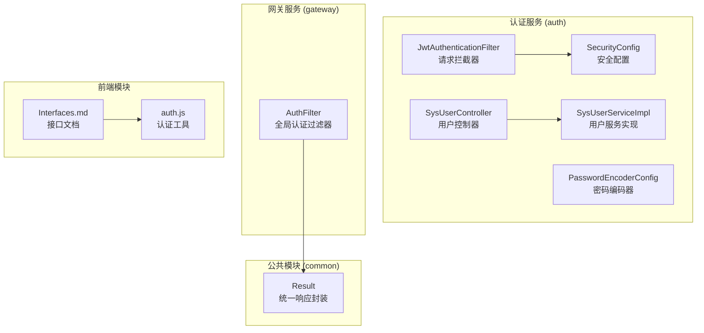
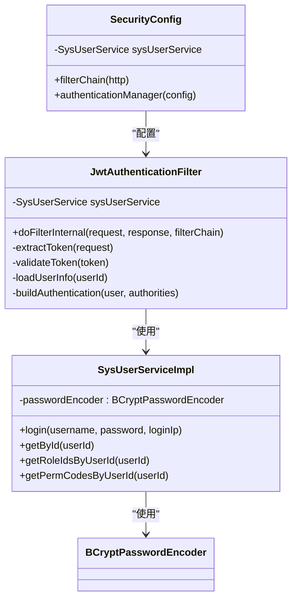
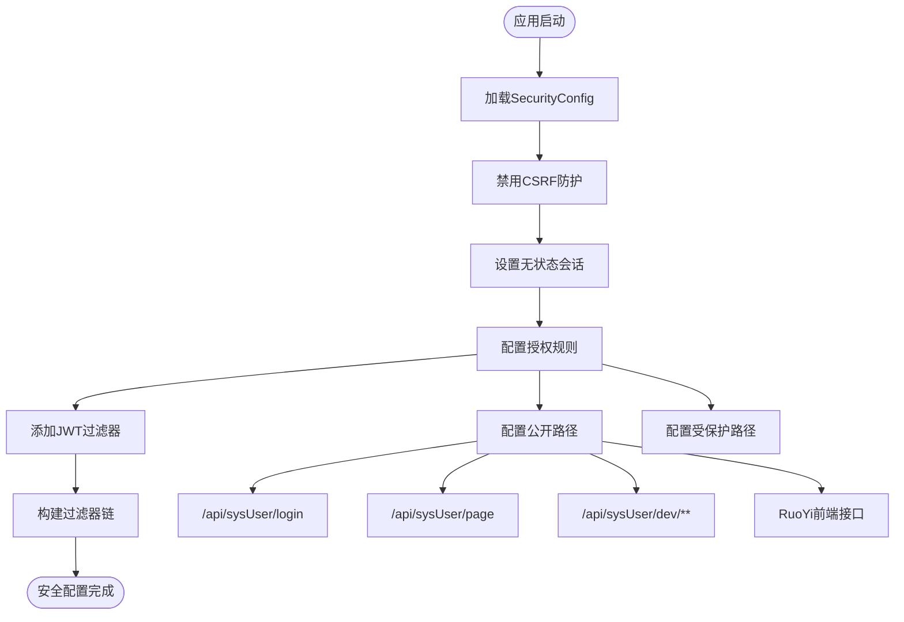
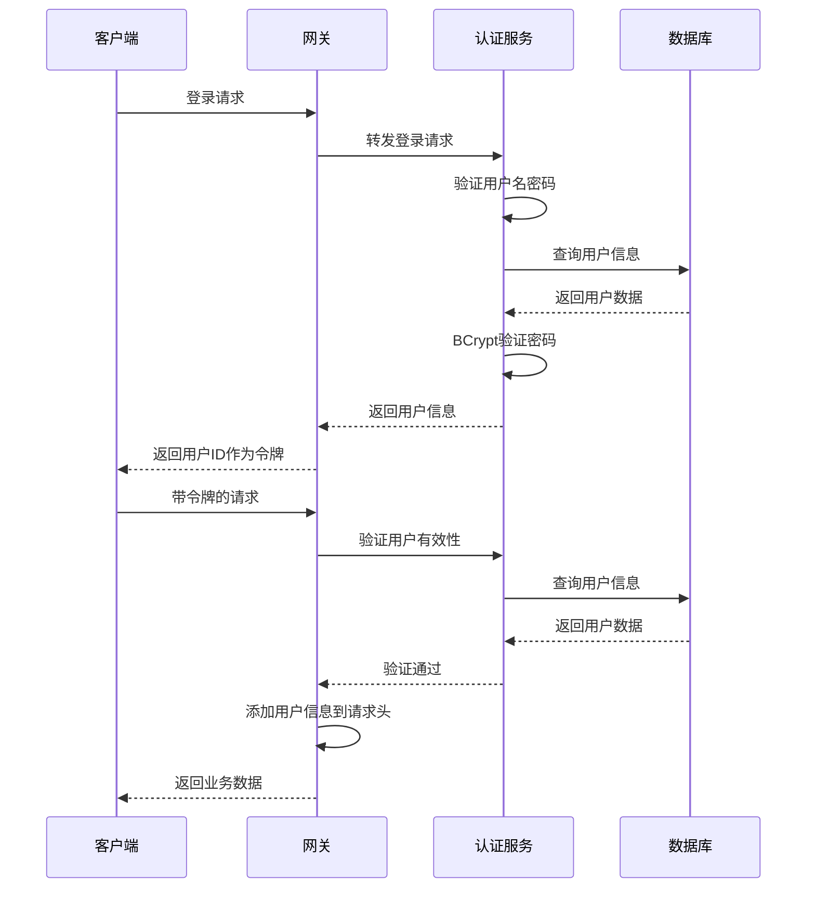
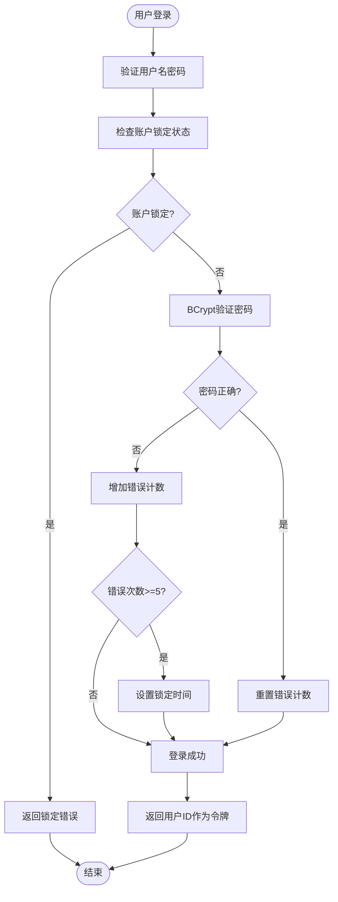
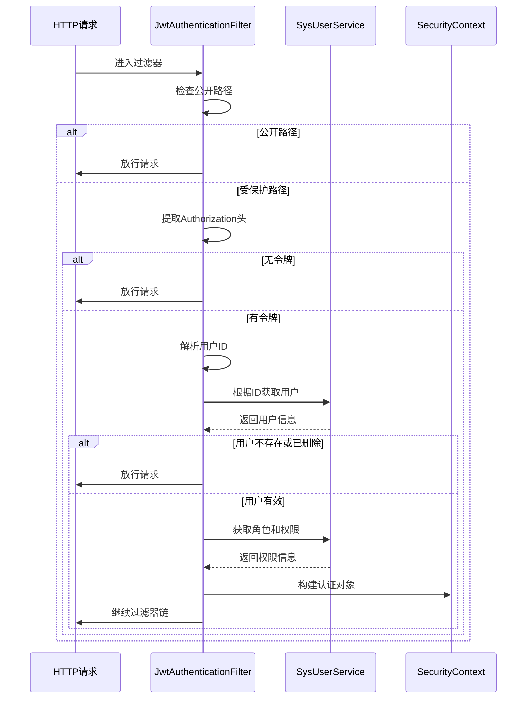
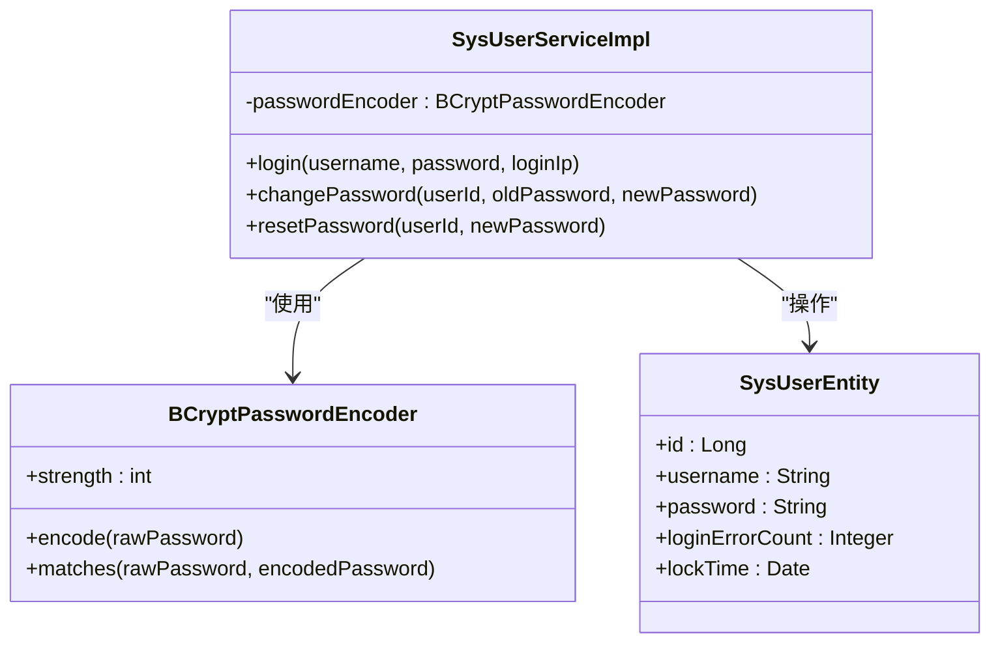
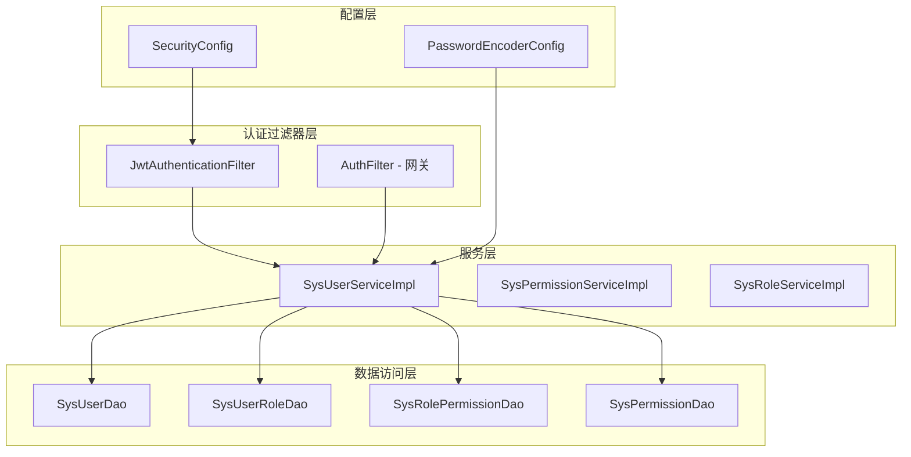

# JWT认证机制

<cite>
**本文档引用的文件**
- [JwtAuthenticationFilter.java](file://auth/src/main/java/com/dafuweng/auth/filter/JwtAuthenticationFilter.java)
- [SecurityConfig.java](file://auth/src/main/java/com/dafuweng/auth/config/SecurityConfig.java)
- [PasswordEncoderConfig.java](file://auth/src/main/java/com/dafuweng/auth/config/PasswordEncoderConfig.java)
- [SysUserController.java](file://auth/src/main/java/com/dafuweng/auth/controller/SysUserController.java)
- [SysUserServiceImpl.java](file://auth/src/main/java/com/dafuweng/auth/service/impl/SysUserServiceImpl.java)
- [SysUserEntity.java](file://auth/src/main/java/com/dafuweng/auth/entity/SysUserEntity.java)
- [application.yml](file://auth/src/main/resources/application.yml)
- [AuthFilter.java](file://gateway/src/main/java/com/dafuweng/gateway/filter/AuthFilter.java)
- [SysUserDao.java](file://auth/src/main/java/com/dafuweng/auth/dao/SysUserDao.java)
- [SysUserRoleDao.java](file://auth/src/main/java/com/dafuweng/auth/dao/SysUserRoleDao.java)
- [Result.java](file://common/src/main/java/com/dafuweng/common/entity/Result.java)
- [Interfaces.md](file://frontEnd/front/Interfaces.md)
- [auth.js](file://ruoyi-ui/src/utils/auth.js)
- [auth.js](file://frontEnd/src/core/auth.js)
</cite>

## 目录
1. [简介](#简介)
2. [项目结构](#项目结构)
3. [核心组件](#核心组件)
4. [架构概览](#架构概览)
5. [详细组件分析](#详细组件分析)
6. [依赖分析](#依赖分析)
7. [性能考虑](#性能考虑)
8. [故障排除指南](#故障排除指南)
9. [结论](#结论)
10. [附录](#附录)

## 简介

本项目实现了基于JWT（JSON Web Token）的认证机制，采用无状态认证方式，通过自定义过滤器实现请求拦截和用户身份验证。该认证机制具有以下特点：

- **无状态设计**：认证信息存储在客户端，服务器不保存会话状态
- **自定义令牌格式**：当前实现中，JWT令牌即为用户ID字符串（"Bearer {userId}"）
- **Spring Security集成**：通过自定义过滤器集成到Spring Security过滤器链中
- **BCrypt密码加密**：使用BCrypt算法进行密码哈希和验证
- **多层安全防护**：包括CSRF防护、跨域处理和异常处理机制

## 项目结构

该项目采用多模块架构，JWT认证机制主要分布在以下模块中：



**图表来源**
- [JwtAuthenticationFilter.java:1-82](file://auth/src/main/java/com/dafuweng/auth/filter/JwtAuthenticationFilter.java#L1-L82)
- [SecurityConfig.java:1-54](file://auth/src/main/java/com/dafuweng/auth/config/SecurityConfig.java#L1-L54)
- [AuthFilter.java:1-141](file://gateway/src/main/java/com/dafuweng/gateway/filter/AuthFilter.java#L1-L141)

**章节来源**
- [application.yml:1-35](file://auth/src/main/resources/application.yml#L1-L35)

## 核心组件

### JWT认证过滤器

JWT认证过滤器是整个认证机制的核心组件，负责拦截HTTP请求并验证用户身份。



**图表来源**
- [JwtAuthenticationFilter.java:20-82](file://auth/src/main/java/com/dafuweng/auth/filter/JwtAuthenticationFilter.java#L20-L82)
- [SecurityConfig.java:28-52](file://auth/src/main/java/com/dafuweng/auth/config/SecurityConfig.java#L28-L52)
- [SysUserServiceImpl.java:28-229](file://auth/src/main/java/com/dafuweng/auth/service/impl/SysUserServiceImpl.java#L28-L229)

### Spring Security配置

Spring Security配置定义了整个安全过滤器链的行为，包括CSRF防护、会话管理和授权规则。



**图表来源**
- [SecurityConfig.java:34-52](file://auth/src/main/java/com/dafuweng/auth/config/SecurityConfig.java#L34-L52)

**章节来源**
- [JwtAuthenticationFilter.java:28-80](file://auth/src/main/java/com/dafuweng/auth/filter/JwtAuthenticationFilter.java#L28-L80)
- [SecurityConfig.java:28-52](file://auth/src/main/java/com/dafuweng/auth/config/SecurityConfig.java#L28-L52)

## 架构概览

整个JWT认证机制采用分层架构设计，实现了前后端分离的无状态认证模式：



**图表来源**
- [AuthFilter.java:55-134](file://gateway/src/main/java/com/dafuweng/gateway/filter/AuthFilter.java#L55-L134)
- [SysUserServiceImpl.java:80-118](file://auth/src/main/java/com/dafuweng/auth/service/impl/SysUserServiceImpl.java#L80-L118)

## 详细组件分析

### JWT令牌生成与解析流程

当前实现采用简化的令牌设计，令牌内容即为用户ID字符串：



**图表来源**
- [SysUserServiceImpl.java:80-118](file://auth/src/main/java/com/dafuweng/auth/service/impl/SysUserServiceImpl.java#L80-L118)

### 自定义JWT过滤器实现

JWT认证过滤器实现了完整的请求拦截和身份验证流程：



**图表来源**
- [JwtAuthenticationFilter.java:28-80](file://auth/src/main/java/com/dafuweng/auth/filter/JwtAuthenticationFilter.java#L28-L80)

### 密码加密策略

系统使用BCrypt算法进行密码加密和验证，确保密码存储的安全性：



**图表来源**
- [PasswordEncoderConfig.java:10-13](file://auth/src/main/java/com/dafuweng/auth/config/PasswordEncoderConfig.java#L10-L13)
- [SysUserServiceImpl.java:26](file://auth/src/main/java/com/dafuweng/auth/service/impl/SysUserServiceImpl.java#L26)

**章节来源**
- [PasswordEncoderConfig.java:1-15](file://auth/src/main/java/com/dafuweng/auth/config/PasswordEncoderConfig.java#L1-L15)
- [SysUserServiceImpl.java:96-117](file://auth/src/main/java/com/dafuweng/auth/service/impl/SysUserServiceImpl.java#L96-L117)

## 依赖分析

### 组件间依赖关系



**图表来源**
- [JwtAuthenticationFilter.java:22](file://auth/src/main/java/com/dafuweng/auth/filter/JwtAuthenticationFilter.java#L22)
- [SysUserServiceImpl.java:31-44](file://auth/src/main/java/com/dafuweng/auth/service/impl/SysUserServiceImpl.java#L31-L44)
- [SecurityConfig.java:22](file://auth/src/main/java/com/dafuweng/auth/config/SecurityConfig.java#L22)

### 外部依赖

系统依赖的关键外部组件包括：

- **Spring Security**: 提供安全框架和过滤器链管理
- **MyBatis-Plus**: 提供ORM功能和数据库访问
- **BCrypt**: 提供密码哈希和验证功能
- **Nacos**: 提供服务发现和配置管理

**章节来源**
- [application.yml:12-18](file://auth/src/main/resources/application.yml#L12-L18)

## 性能考虑

### 认证性能优化

1. **无状态设计**: 避免服务器端会话存储，减少内存占用
2. **缓存策略**: 可考虑在Redis中缓存用户权限信息
3. **批量查询**: 在获取用户权限时使用批量查询减少数据库访问
4. **连接池优化**: 合理配置数据库连接池参数

### 安全性能平衡

1. **密码哈希成本**: BCrypt的cost参数需要在安全性与性能间平衡
2. **令牌长度**: 简化的令牌设计提高了性能但降低了灵活性
3. **过滤器执行顺序**: 合理安排过滤器顺序避免重复验证

## 故障排除指南

### 常见认证问题

| 问题类型 | 症状 | 可能原因 | 解决方案 |
|----------|------|----------|----------|
| 登录失败 | 返回401错误 | 用户名密码错误 | 检查用户名密码，确认账户未锁定 |
| 令牌无效 | 请求被拒绝 | 令牌格式错误或过期 | 确认Authorization头格式为"Bearer {userId}" |
| 权限不足 | 返回403错误 | 用户权限不足 | 检查用户角色和权限配置 |
| 服务不可用 | 返回503错误 | 认证服务异常 | 检查认证服务运行状态 |

### 调试建议

1. **启用详细日志**: 在application.yml中调整日志级别
2. **检查数据库连接**: 确认MySQL连接配置正确
3. **验证服务注册**: 确认Nacos服务注册正常
4. **测试接口连通性**: 使用curl命令测试认证接口

**章节来源**
- [application.yml:32-35](file://auth/src/main/resources/application.yml#L32-L35)

## 结论

本JWT认证机制实现了以下关键特性：

1. **简洁高效的令牌设计**: 采用用户ID作为令牌内容，简化了实现复杂度
2. **完善的Spring Security集成**: 通过自定义过滤器实现了完整的认证流程
3. **强密码保护**: 使用BCrypt算法确保密码存储安全
4. **灵活的权限控制**: 支持基于角色和权限码的细粒度控制
5. **良好的扩展性**: 模块化设计便于功能扩展和维护

该实现适合中小型应用场景，如果需要更复杂的JWT功能（如签名验证、过期时间等），可以在现有基础上进行扩展。

## 附录

### JWT令牌使用示例

#### 登录认证流程
```http
POST /api/sysUser/login
Content-Type: application/json

{
  "username": "admin",
  "password": "password",
  "loginIp": "192.168.1.1"
}

响应:
{
  "code": 200,
  "message": "success",
  "data": {
    "id": 1001,
    "username": "admin",
    "realName": "管理员"
  }
}
```

#### 带令牌的请求
```http
GET /api/sysUser/1001
Authorization: Bearer 1001
Content-Type: application/json
```

### 安全最佳实践

1. **令牌传输安全**: 始终通过HTTPS传输令牌
2. **令牌存储安全**: 在客户端使用HttpOnly Cookie或安全存储
3. **权限最小化**: 遵循最小权限原则分配用户权限
4. **定期审计**: 定期审查用户权限和登录日志
5. **监控告警**: 建立异常登录和权限变更的监控机制