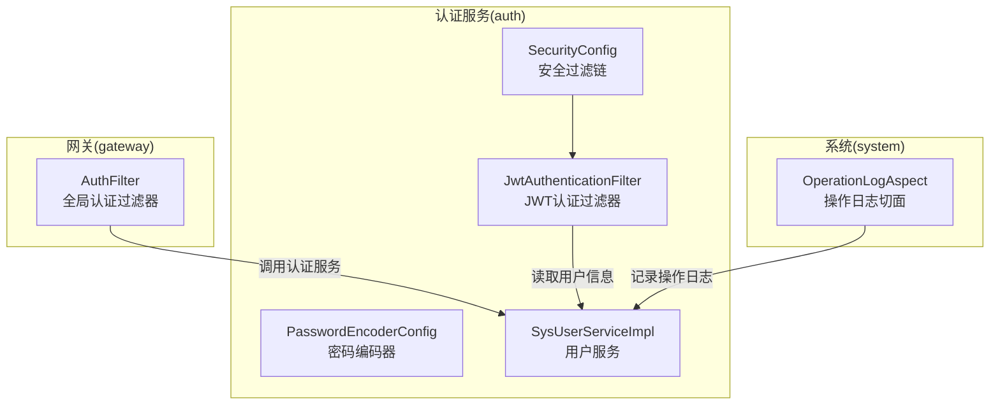
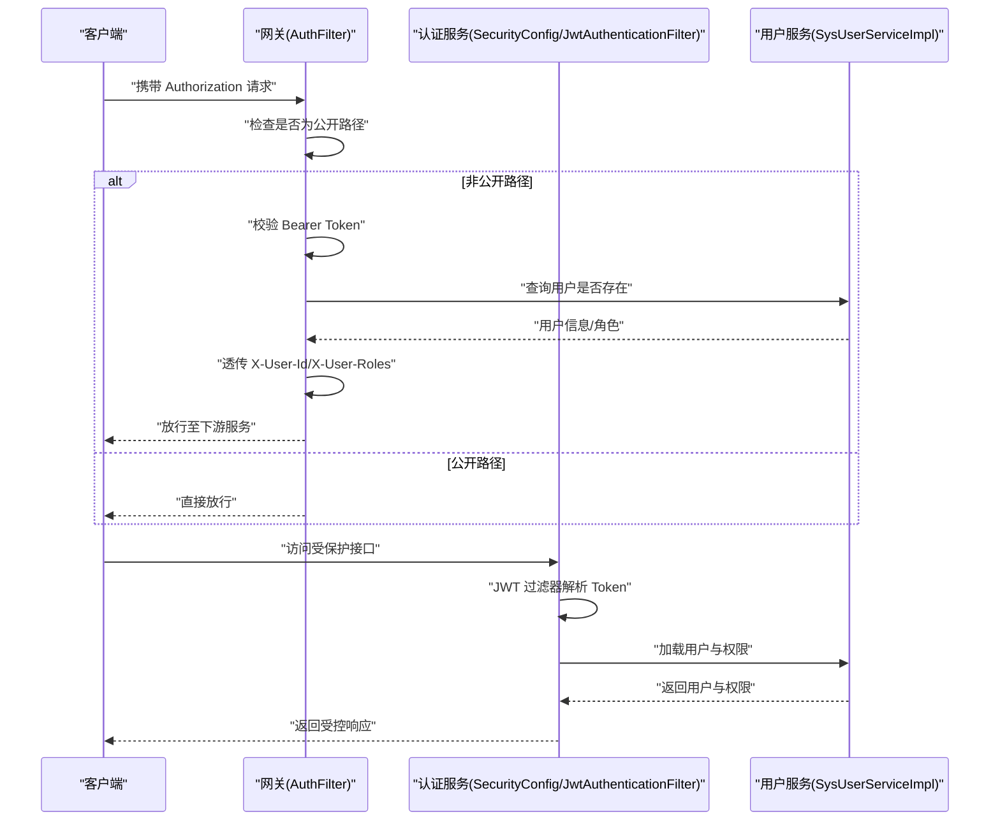
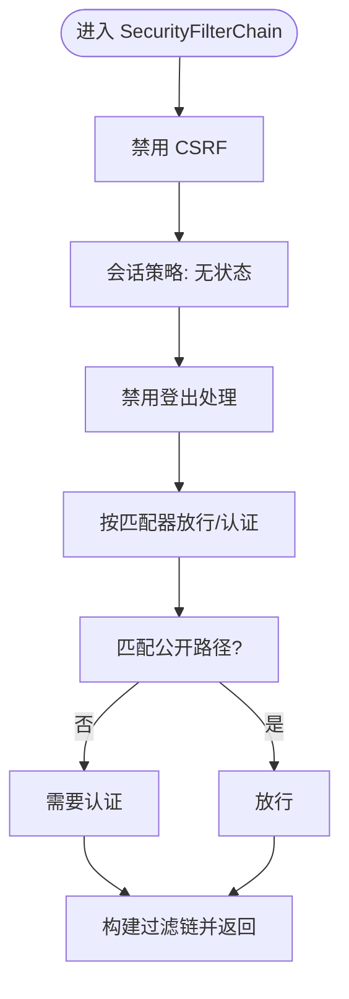
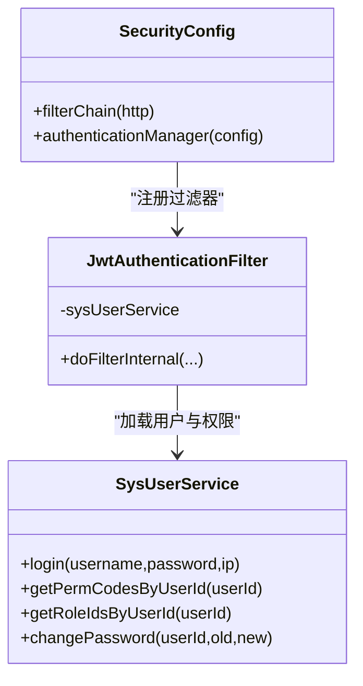
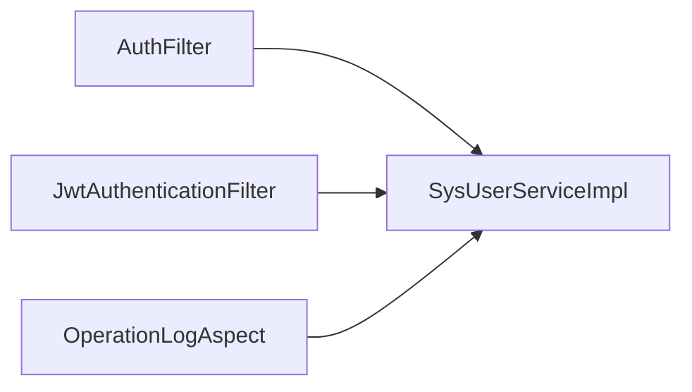

# 安全配置

<cite>
**本文引用的文件**
- [SecurityConfig.java](file://auth/src/main/java/com/dafuweng/auth/config/SecurityConfig.java)
- [PasswordEncoderConfig.java](file://auth/src/main/java/com/dafuweng/auth/config/PasswordEncoderConfig.java)
- [JwtAuthenticationFilter.java](file://auth/src/main/java/com/dafuweng/auth/filter/JwtAuthenticationFilter.java)
- [SysUserController.java](file://auth/src/main/java/com/dafuweng/auth/controller/SysUserController.java)
- [RuoyiAdapterController.java](file://auth/src/main/java/com/dafuweng/auth/controller/RuoyiAdapterController.java)
- [SysUserServiceImpl.java](file://auth/src/main/java/com/dafuweng/auth/service/impl/SysUserServiceImpl.java)
- [AuthFilter.java](file://gateway/src/main/java/com/dafuweng/gateway/filter/AuthFilter.java)
- [application.yml](file://auth/src/main/resources/application.yml)
- [application-docker.yml](file://auth/src/main/resources/application-docker.yml)
- [OperationLogAspect.java](file://system/src/main/java/com/dafuweng/system/config/OperationLogAspect.java)
- [SysOperationLogController.java](file://system/src/main/java/com/dafuweng/system/controller/SysOperationLogController.java)
</cite>

## 目录
1. [简介](#简介)
2. [项目结构](#项目结构)
3. [核心组件](#核心组件)
4. [架构总览](#架构总览)
5. [详细组件分析](#详细组件分析)
6. [依赖关系分析](#依赖关系分析)
7. [性能考量](#性能考量)
8. [故障排除指南](#故障排除指南)
9. [结论](#结论)
10. [附录](#附录)

## 简介
本文件面向安全配置主题，系统性梳理并解释本项目的 Spring Security 安全实现，涵盖：
- Web 安全配置与 HTTP 安全规则
- 认证与授权策略（基于 JWT 的无状态认证）
- CORS（跨域资源共享）配置现状与建议
- 静态资源与 API 接口访问控制策略
- 会话管理（无状态设计与并发控制）
- 环境差异化配置（开发、测试、生产）
- 最佳实践与常见漏洞防护
- 调试方法与故障排除

## 项目结构
本项目采用多模块架构，安全相关的关键模块与文件如下：
- 认证服务（auth）：负责用户认证、授权与安全过滤链配置
- 网关（gateway）：统一入口，进行鉴权与请求透传
- 系统模块（system）：操作日志等系统能力

图表来源
- [SecurityConfig.java:34-52](file://auth/src/main/java/com/dafuweng/auth/config/SecurityConfig.java#L34-L52)
- [JwtAuthenticationFilter.java:28-80](file://auth/src/main/java/com/dafuweng/auth/filter/JwtAuthenticationFilter.java#L28-L80)
- [SysUserServiceImpl.java:46-118](file://auth/src/main/java/com/dafuweng/auth/service/impl/SysUserServiceImpl.java#L46-L118)
- [AuthFilter.java:55-134](file://gateway/src/main/java/com/dafuweng/gateway/filter/AuthFilter.java#L55-L134)
- [OperationLogAspect.java:35-60](file://system/src/main/java/com/dafuweng/system/config/OperationLogAspect.java#L35-L60)

章节来源
- [SecurityConfig.java:17-54](file://auth/src/main/java/com/dafuweng/auth/config/SecurityConfig.java#L17-L54)
- [application.yml:1-35](file://auth/src/main/resources/application.yml#L1-L35)
- [application-docker.yml:1-32](file://auth/src/main/resources/application-docker.yml#L1-L32)

## 核心组件
- 安全过滤链与规则：禁用 CSRF、无状态会话、白名单放行、其余请求需认证
- JWT 认证过滤器：从请求头提取 Bearer Token，解析用户 ID，注入认证上下文
- 密码编码器：BCrypt 编码，保障密码存储安全
- 网关认证过滤器：对非公开路径进行统一鉴权，并向下游服务透传用户信息
- 操作日志切面：在方法级记录操作日志，便于审计与追踪

章节来源
- [SecurityConfig.java:33-52](file://auth/src/main/java/com/dafuweng/auth/config/SecurityConfig.java#L33-L52)
- [JwtAuthenticationFilter.java:28-80](file://auth/src/main/java/com/dafuweng/auth/filter/JwtAuthenticationFilter.java#L28-L80)
- [PasswordEncoderConfig.java:10-13](file://auth/src/main/java/com/dafuweng/auth/config/PasswordEncoderConfig.java#L10-L13)
- [AuthFilter.java:55-134](file://gateway/src/main/java/com/dafuweng/gateway/filter/AuthFilter.java#L55-L134)
- [OperationLogAspect.java:35-60](file://system/src/main/java/com/dafuweng/system/config/OperationLogAspect.java#L35-L60)

## 架构总览
下图展示了从客户端到认证服务与网关的整体交互流程。

图表来源
- [AuthFilter.java:55-134](file://gateway/src/main/java/com/dafuweng/gateway/filter/AuthFilter.java#L55-L134)
- [JwtAuthenticationFilter.java:28-80](file://auth/src/main/java/com/dafuweng/auth/filter/JwtAuthenticationFilter.java#L28-L80)
- [SysUserServiceImpl.java:46-118](file://auth/src/main/java/com/dafuweng/auth/service/impl/SysUserServiceImpl.java#L46-L118)

## 详细组件分析

### Web 安全配置与 HTTP 安全规则
- 禁用 CSRF：适用于无状态 API 场景
- 会话策略：STATELESS，不创建会话
- 退出登录：禁用默认登出
- 白名单放行：
  - 登录与分页接口
  - 开发调试接口
  - 系统管理相关接口
  - RuoYi 前端适配公开接口
  - 静态资源与 favicon
- 其余请求均需认证

图表来源
- [SecurityConfig.java:34-49](file://auth/src/main/java/com/dafuweng/auth/config/SecurityConfig.java#L34-L49)

章节来源
- [SecurityConfig.java:33-52](file://auth/src/main/java/com/dafuweng/auth/config/SecurityConfig.java#L33-L52)

### 认证配置与 JWT 过滤器
- JWT 过滤器职责：
  - 识别公开路径，直接放行
  - 从 Authorization 头提取 Bearer Token
  - 解析用户 ID 并加载用户、角色与权限码
  - 构造认证对象并写入安全上下文
- 认证失败时静默放行，交由后续链路处理
- 用户服务负责：
  - 登录校验（BCrypt 密码匹配、账户锁定与错误计数）
  - 权限码与角色 ID 查询
  - 密码变更与重置（开发调试）

图表来源
- [SecurityConfig.java:28-52](file://auth/src/main/java/com/dafuweng/auth/config/SecurityConfig.java#L28-L52)
- [JwtAuthenticationFilter.java:20-80](file://auth/src/main/java/com/dafuweng/auth/filter/JwtAuthenticationFilter.java#L20-L80)
- [SysUserServiceImpl.java:46-166](file://auth/src/main/java/com/dafuweng/auth/service/impl/SysUserServiceImpl.java#L46-L166)

章节来源
- [JwtAuthenticationFilter.java:28-80](file://auth/src/main/java/com/dafuweng/auth/filter/JwtAuthenticationFilter.java#L28-L80)
- [SysUserServiceImpl.java:46-118](file://auth/src/main/java/com/dafuweng/auth/service/impl/SysUserServiceImpl.java#L46-L118)

### CORS（跨域资源共享）配置
- 当前仓库未发现显式的 CORS 配置类或注解
- 建议在认证服务中添加基于路径的 CORS 配置，以支持前端不同域名与端口的访问需求
- 生产环境建议限制允许的源、方法与头字段，避免使用通配符

[本节为概念性说明，不直接分析具体文件，故无“章节来源”]

### 静态资源与 API 接口访问控制
- 静态资源与 favicon：明确放行
- RuoYi 前端适配接口：验证码、登录、获取用户信息、获取路由、登出、注册、解锁等公开接口放行
- 系统管理接口：用户、角色、权限管理接口放行（当前策略）
- 开发调试接口：带前缀的开发接口放行（上线前应移除）
- 业务 API 与系统管理以外的请求：统一需要认证

章节来源
- [SecurityConfig.java:39-48](file://auth/src/main/java/com/dafuweng/auth/config/SecurityConfig.java#L39-L48)
- [RuoyiAdapterController.java:24-199](file://auth/src/main/java/com/dafuweng/auth/controller/RuoyiAdapterController.java#L24-L199)
- [SysUserController.java:21-97](file://auth/src/main/java/com/dafuweng/auth/controller/SysUserController.java#L21-L97)

### 会话管理（无状态与并发控制）
- 会话策略：STATELESS，不创建会话，避免服务器端会话存储
- 并发控制：当前未启用 Spring Session 并发会话限制
- 建议：
  - 如需限制同一账户同时在线数量，可引入 Spring Session 并配置最大会话数
  - 结合令牌吊销策略（如黑名单或短有效期+刷新令牌）提升安全性

章节来源
- [SecurityConfig.java:37](file://auth/src/main/java/com/dafuweng/auth/config/SecurityConfig.java#L37)

### 环境差异化配置方案
- 开发环境：
  - 数据源指向本地 MySQL
  - 日志级别提升以便调试
- Docker 环境：
  - 数据源指向容器内 MySQL
  - Nacos 发现关闭（或按需开启）
- 生产环境建议：
  - 强制 HTTPS、严格 HSTS
  - 限制 CORS 源、方法与头
  - 启用 CSRF（如使用表单场景）、会话超时与并发控制
  - 敏感日志脱敏与最小暴露

章节来源
- [application.yml:1-35](file://auth/src/main/resources/application.yml#L1-L35)
- [application-docker.yml:1-32](file://auth/src/main/resources/application-docker.yml#L1-L32)

### 最佳实践与常见漏洞防护
- 密码安全：使用 BCrypt 存储与校验
- 令牌设计：短期有效、支持刷新；避免在令牌中携带敏感信息
- 接口保护：仅放行必要公开接口；对系统管理接口进行最小权限授权
- CORS：生产环境禁止通配符，限定来源与方法
- 输入校验：对所有外部输入进行参数校验与长度限制
- 审计日志：启用操作日志切面，记录关键操作与耗时

章节来源
- [PasswordEncoderConfig.java:10-13](file://auth/src/main/java/com/dafuweng/auth/config/PasswordEncoderConfig.java#L10-L13)
- [OperationLogAspect.java:35-60](file://system/src/main/java/com/dafuweng/system/config/OperationLogAspect.java#L35-L60)

## 依赖关系分析
- 网关依赖认证服务进行用户有效性校验，并透传用户标识与角色信息
- 认证服务内部通过 JWT 过滤器解析 Token 并加载用户与权限
- 操作日志切面在方法级拦截，记录用户与请求参数

图表来源
- [AuthFilter.java:98-107](file://gateway/src/main/java/com/dafuweng/gateway/filter/AuthFilter.java#L98-L107)
- [JwtAuthenticationFilter.java:54-74](file://auth/src/main/java/com/dafuweng/auth/filter/JwtAuthenticationFilter.java#L54-L74)
- [OperationLogAspect.java:35-60](file://system/src/main/java/com/dafuweng/system/config/OperationLogAspect.java#L35-L60)

章节来源
- [AuthFilter.java:55-134](file://gateway/src/main/java/com/dafuweng/gateway/filter/AuthFilter.java#L55-L134)
- [JwtAuthenticationFilter.java:28-80](file://auth/src/main/java/com/dafuweng/auth/filter/JwtAuthenticationFilter.java#L28-L80)
- [OperationLogAspect.java:35-60](file://system/src/main/java/com/dafuweng/system/config/OperationLogAspect.java#L35-L60)

## 性能考量
- 无状态设计降低服务器端会话存储压力
- JWT 过滤器仅做轻量解析与用户查询，避免复杂计算
- 操作日志异步落库，减少接口响应延迟
- 建议：
  - 对用户权限查询结果进行缓存
  - 控制日志记录频率，避免高频接口产生大量日志

[本节提供一般性指导，不直接分析具体文件，故无“章节来源”]

## 故障排除指南
- 401 未认证：
  - 检查请求头是否包含有效的 Bearer Token
  - 确认网关与认证服务中的公开路径匹配逻辑
- 用户不存在或被删除：
  - JWT 过滤器与网关过滤器均可能放行无效用户，需检查用户状态
- 登录失败与账户锁定：
  - 查看登录服务的错误计数与锁定逻辑
- CORS 问题：
  - 当前未显式配置 CORS，建议在认证服务中补充 CORS 配置
- 日志审计：
  - 检查操作日志切面是否正确注入用户信息

章节来源
- [JwtAuthenticationFilter.java:42-77](file://auth/src/main/java/com/dafuweng/auth/filter/JwtAuthenticationFilter.java#L42-L77)
- [AuthFilter.java:80-107](file://gateway/src/main/java/com/dafuweng/gateway/filter/AuthFilter.java#L80-L107)
- [SysUserServiceImpl.java:86-118](file://auth/src/main/java/com/dafuweng/auth/service/impl/SysUserServiceImpl.java#L86-L118)
- [OperationLogAspect.java:62-74](file://system/src/main/java/com/dafuweng/system/config/OperationLogAspect.java#L62-L74)

## 结论
本项目采用无状态 JWT 认证与 Spring Security 过滤链实现统一安全控制，结合网关进行统一鉴权与用户信息透传。建议在生产环境中完善 CORS 限制、启用 CSRF、引入会话并发控制与令牌吊销策略，并持续优化权限与日志体系，以满足更严格的安全部署要求。

[本节为总结性内容，不直接分析具体文件，故无“章节来源”]

## 附录

### API 安全策略对照
- 公开接口（无需认证）：登录、验证码、获取用户信息、获取路由、登出、注册、解锁等
- 受保护接口（需认证）：业务 API 与系统管理接口（除白名单外）
- 开发调试接口（仅开发环境）：带前缀的开发接口

章节来源
- [SecurityConfig.java:39-48](file://auth/src/main/java/com/dafuweng/auth/config/SecurityConfig.java#L39-L48)
- [RuoyiAdapterController.java:24-199](file://auth/src/main/java/com/dafuweng/auth/controller/RuoyiAdapterController.java#L24-L199)
- [SysUserController.java:41-97](file://auth/src/main/java/com/dafuweng/auth/controller/SysUserController.java#L41-L97)