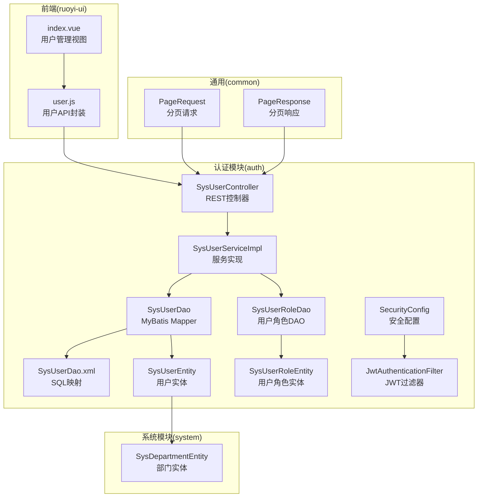
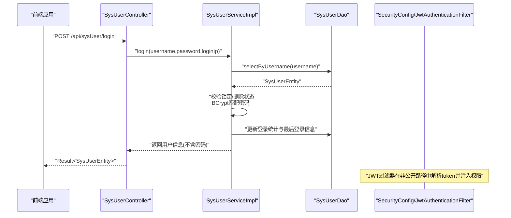
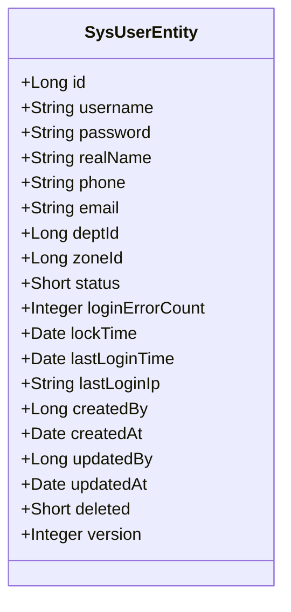
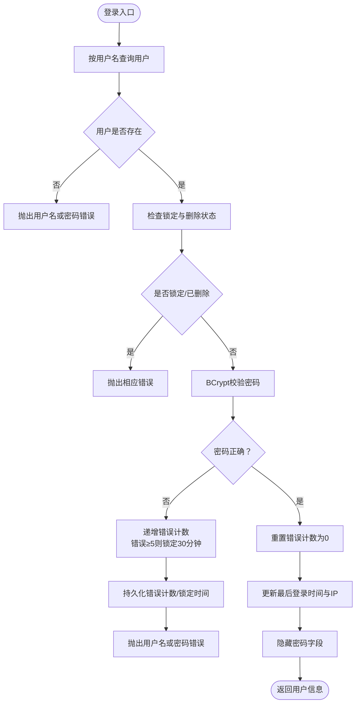
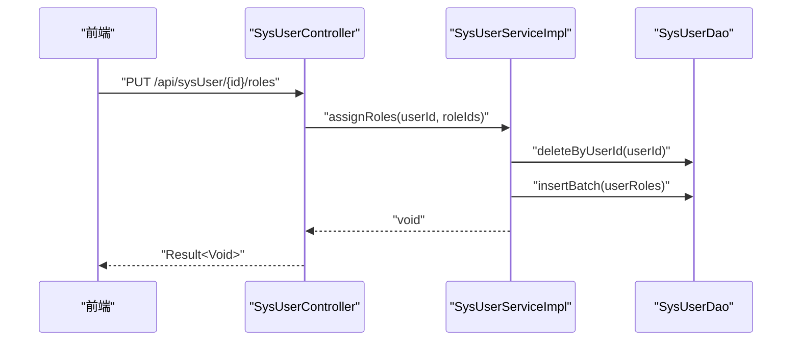
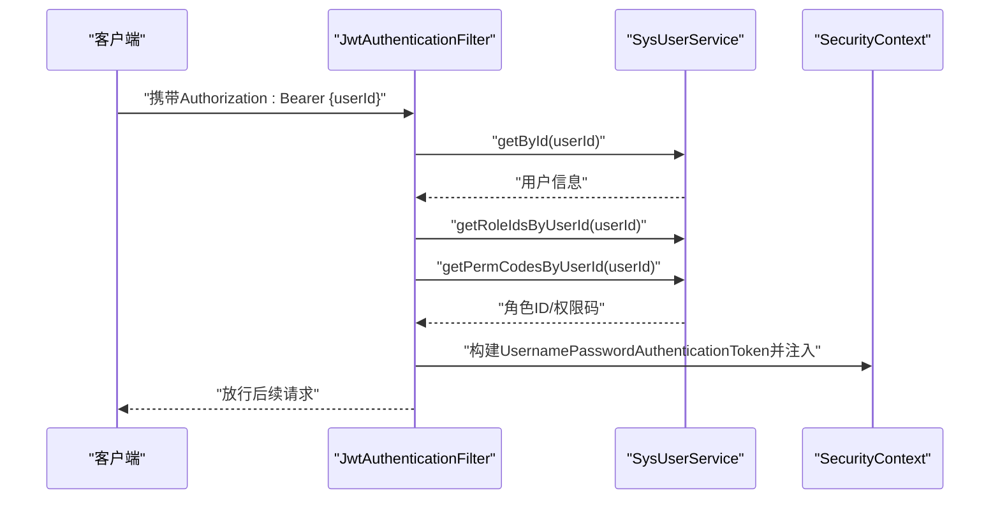
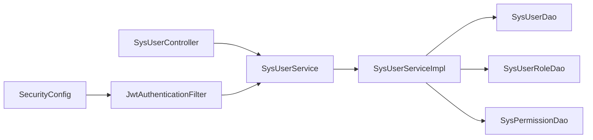

# 用户管理

<cite>
**本文引用的文件**
- [SysUserEntity.java](file://auth/src/main/java/com/dafuweng/auth/entity/SysUserEntity.java)
- [SysUserController.java](file://auth/src/main/java/com/dafuweng/auth/controller/SysUserController.java)
- [SysUserService.java](file://auth/src/main/java/com/dafuweng/auth/service/SysUserService.java)
- [SysUserServiceImpl.java](file://auth/src/main/java/com/dafuweng/auth/service/impl/SysUserServiceImpl.java)
- [SysUserDao.java](file://auth/src/main/java/com/dafuweng/auth/dao/SysUserDao.java)
- [SysUserRoleEntity.java](file://auth/src/main/java/com/dafuweng/auth/entity/SysUserRoleEntity.java)
- [SysUserRoleDao.java](file://auth/src/main/java/com/dafuweng/auth/dao/SysUserRoleDao.java)
- [SysUserDao.xml](file://auth/src/main/resources/auth/mapper/SysUserDao.xml)
- [PageRequest.java](file://common/src/main/java/com/dafuweng/common/entity/PageRequest.java)
- [PageResponse.java](file://common/src/main/java/com/dafuweng/common/entity/PageResponse.java)
- [SecurityConfig.java](file://auth/src/main/java/com/dafuweng/auth/config/SecurityConfig.java)
- [JwtAuthenticationFilter.java](file://auth/src/main/java/com/dafuweng/auth/filter/JwtAuthenticationFilter.java)
- [SysRoleService.java](file://auth/src/main/java/com/dafuweng/auth/service/SysRoleService.java)
- [SysPermissionService.java](file://auth/src/main/java/com/dafuweng/auth/service/SysPermissionService.java)
- [SysDepartmentEntity.java](file://system/src/main/java/com/dafuweng/system/entity/SysDepartmentEntity.java)
- [user.js](file://ruoyi-ui/src/api/system/user.js)
- [index.vue](file://ruoyi-ui/src/views/system/user/index.vue)
</cite>

## 目录
1. [简介](#简介)
2. [项目结构](#项目结构)
3. [核心组件](#核心组件)
4. [架构总览](#架构总览)
5. [详细组件分析](#详细组件分析)
6. [依赖分析](#依赖分析)
7. [性能考虑](#性能考虑)
8. [故障排查指南](#故障排查指南)
9. [结论](#结论)
10. [附录](#附录)

## 简介
本文件面向“用户管理”功能，提供从实体模型、服务层接口到API接口的完整技术文档。内容涵盖：
- 用户实体模型设计：字段、类型与约束
- 核心业务逻辑：注册、登录、信息更新、状态管理、密码重置
- 服务层接口与实现：查询、权限分配、角色关联
- 用户管理API接口：CRUD、分页、批量、特殊业务接口
- 数据安全与隐私保护
- 最佳实践与常见问题

## 项目结构
用户管理功能主要位于 auth 模块，采用分层架构：
- 控制器层：SysUserController 提供 REST 接口
- 服务层：SysUserService 接口及 SysUserServiceImpl 实现
- 数据访问层：SysUserDao 及 MyBatis XML 映射
- 安全层：SecurityConfig 与 JwtAuthenticationFilter
- 前端：ruoyi-ui 中的用户管理页面与 API 调用

图表来源
- [SysUserController.java:14-98](file://auth/src/main/java/com/dafuweng/auth/controller/SysUserController.java#L14-L98)
- [SysUserServiceImpl.java:28-229](file://auth/src/main/java/com/dafuweng/auth/service/impl/SysUserServiceImpl.java#L28-L229)
- [SysUserDao.java:8-12](file://auth/src/main/java/com/dafuweng/auth/dao/SysUserDao.java#L8-L12)
- [SysUserDao.xml:4-36](file://auth/src/main/resources/auth/mapper/SysUserDao.xml#L4-L36)
- [SysUserRoleDao.java:10-18](file://auth/src/main/java/com/dafuweng/auth/dao/SysUserRoleDao.java#L10-L18)
- [SysUserRoleEntity.java:10-24](file://auth/src/main/java/com/dafuweng/auth/entity/SysUserRoleEntity.java#L10-L24)
- [SecurityConfig.java:20-53](file://auth/src/main/java/com/dafuweng/auth/config/SecurityConfig.java#L20-L53)
- [JwtAuthenticationFilter.java:20-81](file://auth/src/main/java/com/dafuweng/auth/filter/JwtAuthenticationFilter.java#L20-L81)
- [PageRequest.java:5-21](file://common/src/main/java/com/dafuweng/common/entity/PageRequest.java#L5-L21)
- [PageResponse.java:6-21](file://common/src/main/java/com/dafuweng/common/entity/PageResponse.java#L6-L21)
- [SysDepartmentEntity.java:12-44](file://system/src/main/java/com/dafuweng/system/entity/SysDepartmentEntity.java#L12-L44)
- [user.js:1-47](file://ruoyi-ui/src/api/system/user.js#L1-L47)
- [index.vue:145-271](file://ruoyi-ui/src/views/system/user/index.vue#L145-L271)

章节来源
- [SysUserController.java:14-98](file://auth/src/main/java/com/dafuweng/auth/controller/SysUserController.java#L14-L98)
- [SysUserServiceImpl.java:28-229](file://auth/src/main/java/com/dafuweng/auth/service/impl/SysUserServiceImpl.java#L28-L229)
- [SysUserDao.java:8-12](file://auth/src/main/java/com/dafuweng/auth/dao/SysUserDao.java#L8-L12)
- [SysUserDao.xml:4-36](file://auth/src/main/resources/auth/mapper/SysUserDao.xml#L4-L36)
- [SysUserRoleDao.java:10-18](file://auth/src/main/java/com/dafuweng/auth/dao/SysUserRoleDao.java#L10-L18)
- [SysUserRoleEntity.java:10-24](file://auth/src/main/java/com/dafuweng/auth/entity/SysUserRoleEntity.java#L10-L24)
- [SecurityConfig.java:20-53](file://auth/src/main/java/com/dafuweng/auth/config/SecurityConfig.java#L20-L53)
- [JwtAuthenticationFilter.java:20-81](file://auth/src/main/java/com/dafuweng/auth/filter/JwtAuthenticationFilter.java#L20-L81)
- [PageRequest.java:5-21](file://common/src/main/java/com/dafuweng/common/entity/PageRequest.java#L5-L21)
- [PageResponse.java:6-21](file://common/src/main/java/com/dafuweng/common/entity/PageResponse.java#L6-L21)
- [SysDepartmentEntity.java:12-44](file://system/src/main/java/com/dafuweng/system/entity/SysDepartmentEntity.java#L12-L44)
- [user.js:1-47](file://ruoyi-ui/src/api/system/user.js#L1-L47)
- [index.vue:145-271](file://ruoyi-ui/src/views/system/user/index.vue#L145-L271)

## 核心组件
- 用户实体模型：SysUserEntity，包含用户标识、凭证、基本信息、部门/区域关联、状态与安全控制字段，以及审计与版本控制字段。
- 用户控制器：SysUserController，提供用户查询、分页、登录、登出、角色查询、权限码查询、角色分配、解锁、改密、删除等接口。
- 用户服务：SysUserService/SysUserServiceImpl，实现登录验证、密码加密、角色与权限加载、分页查询、CRUD、解锁与改密等。
- DAO 层：SysUserDao 与 MyBatis XML 映射，提供按用户名查询与结果映射；SysUserRoleDao 提供用户角色关联的查询与批量插入。
- 安全配置：SecurityConfig 白名单放行与 JWT 过滤器集成；JwtAuthenticationFilter 将用户身份注入 Spring Security 上下文。
- 前端：ruoyi-ui 的用户管理页面通过 user.js 调用后端接口。

章节来源
- [SysUserEntity.java:12-58](file://auth/src/main/java/com/dafuweng/auth/entity/SysUserEntity.java#L12-L58)
- [SysUserController.java:14-98](file://auth/src/main/java/com/dafuweng/auth/controller/SysUserController.java#L14-L98)
- [SysUserService.java:9-38](file://auth/src/main/java/com/dafuweng/auth/service/SysUserService.java#L9-L38)
- [SysUserServiceImpl.java:28-229](file://auth/src/main/java/com/dafuweng/auth/service/impl/SysUserServiceImpl.java#L28-L229)
- [SysUserDao.java:8-12](file://auth/src/main/java/com/dafuweng/auth/dao/SysUserDao.java#L8-L12)
- [SysUserDao.xml:4-36](file://auth/src/main/resources/auth/mapper/SysUserDao.xml#L4-L36)
- [SysUserRoleDao.java:10-18](file://auth/src/main/java/com/dafuweng/auth/dao/SysUserRoleDao.java#L10-L18)
- [SecurityConfig.java:20-53](file://auth/src/main/java/com/dafuweng/auth/config/SecurityConfig.java#L20-L53)
- [JwtAuthenticationFilter.java:20-81](file://auth/src/main/java/com/dafuweng/auth/filter/JwtAuthenticationFilter.java#L20-L81)
- [user.js:1-47](file://ruoyi-ui/src/api/system/user.js#L1-L47)
- [index.vue:145-271](file://ruoyi-ui/src/views/system/user/index.vue#L145-L271)

## 架构总览
用户管理采用前后端分离架构，后端以 Spring MVC + Spring Security + MyBatis Plus 提供 REST 接口，前端使用 Vue + Element Plus 进行交互。

图表来源
- [SysUserController.java:41-47](file://auth/src/main/java/com/dafuweng/auth/controller/SysUserController.java#L41-L47)
- [SysUserServiceImpl.java:79-118](file://auth/src/main/java/com/dafuweng/auth/service/impl/SysUserServiceImpl.java#L79-L118)
- [SysUserDao.java](file://auth/src/main/java/com/dafuweng/auth/dao/SysUserDao.java#L11)
- [SecurityConfig.java:34-49](file://auth/src/main/java/com/dafuweng/auth/config/SecurityConfig.java#L34-L49)
- [JwtAuthenticationFilter.java:28-80](file://auth/src/main/java/com/dafuweng/auth/filter/JwtAuthenticationFilter.java#L28-L80)

## 详细组件分析

### 用户实体模型设计
- 关键字段与含义
  - 标识与凭证：id、username、password
  - 基本信息：realName、phone、email
  - 组织关联：deptId（部门）、zoneId（区域）
  - 状态与安全：status（状态）、loginErrorCount（登录错误次数）、lockTime（锁定截止时间）、lastLoginTime/lastLoginIp（最近登录信息）
  - 审计与并发：createdBy/createdAt、updatedBy/updatedAt、version（乐观锁）、deleted（逻辑删除）
- 约束与规则
  - 逻辑删除：deleted=1 表示软删除
  - 锁定机制：lockTime 未到期时禁止登录
  - 登录错误阈值：累计错误≥5次，锁定30分钟
  - 密码存储：使用 BCrypt 存储，登录成功后返回对象不包含明文密码
- 复杂度与性能
  - 查询按用户名精确匹配，建议在 username 上建立唯一索引
  - 分页查询默认按创建时间倒序，支持自定义排序字段

图表来源
- [SysUserEntity.java:12-58](file://auth/src/main/java/com/dafuweng/auth/entity/SysUserEntity.java#L12-L58)

章节来源
- [SysUserEntity.java:12-58](file://auth/src/main/java/com/dafuweng/auth/entity/SysUserEntity.java#L12-L58)
- [SysUserDao.xml:6-26](file://auth/src/main/resources/auth/mapper/SysUserDao.xml#L6-L26)
- [SysUserDao.java](file://auth/src/main/java/com/dafuweng/auth/dao/SysUserDao.java#L11)

### 用户服务层接口与实现
- 接口职责
  - 查询：按ID、分页、按用户名查询
  - 认证：登录、登出、解锁
  - 权限：按用户ID获取角色ID列表、权限码列表
  - 角色：为用户分配角色（先清空再批量写入）
  - 安全：修改密码（校验旧密码）、重置密码（调试用）
  - CRUD：保存、更新、删除
- 实现要点
  - 登录流程：用户名存在性检查 → 锁定与删除状态检查 → BCrypt 匹配 → 成功则重置错误计数并更新最后登录信息，失败则递增错误计数并可能锁定
  - 权限聚合：先取用户角色ID集合，再汇总各角色的权限码
  - 角色分配：先删除旧关系，再批量插入新关系
  - 密码处理：使用 BCrypt 编码存储，返回对象不包含密码字段
  - 分页：支持排序字段与方向，默认按创建时间倒序

图表来源
- [SysUserServiceImpl.java:79-118](file://auth/src/main/java/com/dafuweng/auth/service/impl/SysUserServiceImpl.java#L79-L118)

章节来源
- [SysUserService.java:9-38](file://auth/src/main/java/com/dafuweng/auth/service/SysUserService.java#L9-L38)
- [SysUserServiceImpl.java:28-229](file://auth/src/main/java/com/dafuweng/auth/service/impl/SysUserServiceImpl.java#L28-L229)

### 用户控制器与API接口
- 接口清单
  - GET /api/sysUser/{id}：按ID获取用户
  - GET /api/sysUser/page：分页查询（PageRequest）
  - GET /api/sysUser/{id}/roles：获取用户角色ID列表
  - GET /api/sysUser/{id}/permCodes：获取用户权限码列表
  - POST /api/sysUser/login：用户登录（username/password/loginIp）
  - POST /api/sysUser/logout：用户登出（userId）
  - POST /api/sysUser：新增用户
  - PUT /api/sysUser：更新用户
  - PUT /api/sysUser/{id}/roles：为用户分配角色（roleIds数组）
  - PUT /api/sysUser/{id}/unlock：解锁用户
  - PUT /api/sysUser/{id}/password：修改密码（oldPassword/newPassword）
  - DELETE /api/sysUser/{id}：删除用户
  - POST /api/sysUser/dev/reset-password：调试用重置密码（开发环境）
- 返回格式
  - 所有接口统一返回 Result<T> 或 Result<Void>，分页使用 PageResponse<T>

图表来源
- [SysUserController.java:65-69](file://auth/src/main/java/com/dafuweng/auth/controller/SysUserController.java#L65-L69)
- [SysUserServiceImpl.java:168-183](file://auth/src/main/java/com/dafuweng/auth/service/impl/SysUserServiceImpl.java#L168-L183)
- [SysUserRoleDao.java:15-17](file://auth/src/main/java/com/dafuweng/auth/dao/SysUserRoleDao.java#L15-L17)

章节来源
- [SysUserController.java:14-98](file://auth/src/main/java/com/dafuweng/auth/controller/SysUserController.java#L14-L98)
- [PageRequest.java:5-21](file://common/src/main/java/com/dafuweng/common/entity/PageRequest.java#L5-L21)
- [PageResponse.java:6-21](file://common/src/main/java/com/dafuweng/common/entity/PageResponse.java#L6-L21)

### 安全与权限集成
- 安全配置
  - CSRF 关闭，Session 策略为无状态
  - 放行登录、分页、开发调试等接口
  - 对系统管理接口与 RuoYi 适配接口进行白名单放行
- JWT 过滤器
  - 从 Authorization 头解析 Bearer token（当前设计为 userId 字符串）
  - 加载用户信息、角色ID列表与权限码，注入 Spring Security 上下文
  - 用户不存在或已删除时静默放行，交由后续链路处理

图表来源
- [JwtAuthenticationFilter.java:28-80](file://auth/src/main/java/com/dafuweng/auth/filter/JwtAuthenticationFilter.java#L28-L80)
- [SysUserServiceImpl.java:144-166](file://auth/src/main/java/com/dafuweng/auth/service/impl/SysUserServiceImpl.java#L144-L166)
- [SecurityConfig.java:34-49](file://auth/src/main/java/com/dafuweng/auth/config/SecurityConfig.java#L34-L49)

章节来源
- [SecurityConfig.java:20-53](file://auth/src/main/java/com/dafuweng/auth/config/SecurityConfig.java#L20-L53)
- [JwtAuthenticationFilter.java:20-81](file://auth/src/main/java/com/dafuweng/auth/filter/JwtAuthenticationFilter.java#L20-L81)

### 前端交互与页面
- 页面功能
  - 列表：分页展示用户，支持按用户名、真实姓名、状态筛选
  - 新增/修改：表单校验用户名、真实姓名、初始密码（新增时必填）、手机号、邮箱、部门ID、状态
  - 分配角色：勾选角色并提交
  - 修改密码：校验新密码与确认密码一致性
- API 调用
  - 使用 user.js 封装的 listUser、getUser、addUser、updateUser、delUser、getUserRoles、assignUserRoles、changePassword 等方法
  - 与后端接口一一对应

章节来源
- [user.js:1-47](file://ruoyi-ui/src/api/system/user.js#L1-L47)
- [index.vue:145-271](file://ruoyi-ui/src/views/system/user/index.vue#L145-L271)

## 依赖分析
- 组件耦合
  - 控制器仅依赖服务接口，低耦合高内聚
  - 服务实现依赖 DAO 与权限/角色 DAO，形成清晰的数据访问层
  - 安全配置与过滤器独立于业务逻辑，便于扩展
- 外部依赖
  - Spring Security：提供认证与授权基础能力
  - BCrypt：密码编码与校验
  - MyBatis Plus：分页、条件构造器、乐观锁

图表来源
- [SysUserController.java:18-19](file://auth/src/main/java/com/dafuweng/auth/controller/SysUserController.java#L18-L19)
- [SysUserServiceImpl.java:31-44](file://auth/src/main/java/com/dafuweng/auth/service/impl/SysUserServiceImpl.java#L31-L44)
- [SecurityConfig.java:22-26](file://auth/src/main/java/com/dafuweng/auth/config/SecurityConfig.java#L22-L26)
- [JwtAuthenticationFilter.java:22-26](file://auth/src/main/java/com/dafuweng/auth/filter/JwtAuthenticationFilter.java#L22-L26)

章节来源
- [SysUserController.java:14-98](file://auth/src/main/java/com/dafuweng/auth/controller/SysUserController.java#L14-L98)
- [SysUserServiceImpl.java:28-229](file://auth/src/main/java/com/dafuweng/auth/service/impl/SysUserServiceImpl.java#L28-L229)
- [SecurityConfig.java:20-53](file://auth/src/main/java/com/dafuweng/auth/config/SecurityConfig.java#L20-L53)

## 性能考虑
- 登录性能
  - 使用 BCrypt 校验，建议在网关层或鉴权层缓存热点用户的基本信息（不包含密码）
  - 登录失败时仅更新错误计数与锁定时间，避免复杂计算
- 分页查询
  - 默认按创建时间倒序，可按需扩展排序字段；建议对常用过滤字段建立索引
- 角色与权限
  - 角色与权限码聚合为内存集合，建议在网关或服务层做短期缓存，减少数据库访问
- 并发控制
  - 使用乐观锁字段 version，避免更新冲突
  - 登录场景使用事务保证错误计数与锁定时间的一致性

## 故障排查指南
- 登录失败
  - 检查用户名是否存在、是否被锁定、是否已删除
  - 确认传入密码与 BCrypt 哈希匹配
  - 查看 loginErrorCount 是否达到阈值导致锁定
- 密码相关
  - 修改密码需提供正确旧密码；重置密码仅在开发环境使用
- 角色分配
  - 分配前会清空旧关系，确认 roleIds 数组正确
- 权限不足
  - 确认 JWT token 中是否包含正确的角色ID与权限码
  - 检查 SecurityConfig 白名单与放行规则

章节来源
- [SysUserServiceImpl.java:79-118](file://auth/src/main/java/com/dafuweng/auth/service/impl/SysUserServiceImpl.java#L79-L118)
- [SysUserServiceImpl.java:205-218](file://auth/src/main/java/com/dafuweng/auth/service/impl/SysUserServiceImpl.java#L205-L218)
- [JwtAuthenticationFilter.java:50-77](file://auth/src/main/java/com/dafuweng/auth/filter/JwtAuthenticationFilter.java#L50-L77)

## 结论
用户管理模块以清晰的分层设计实现了从实体建模到接口暴露的完整闭环。通过 BCrypt 加密、JWT 集成与安全白名单策略，保障了系统的安全性与可用性。建议在生产环境中完善日志审计、令牌刷新与更细粒度的权限控制，并持续优化热点数据的缓存策略。

## 附录

### 用户管理API接口文档
- 获取用户详情
  - 方法：GET
  - 路径：/api/sysUser/{id}
  - 返回：Result<SysUserEntity>
- 分页查询用户
  - 方法：GET
  - 路径：/api/sysUser/page
  - 查询参数：pageNum/pageSize/page/size/sortField/sortOrder
  - 返回：Result<PageResponse<SysUserEntity>>
- 获取用户角色ID列表
  - 方法：GET
  - 路径：/api/sysUser/{id}/roles
  - 返回：Result<List<Long>>
- 获取用户权限码列表
  - 方法：GET
  - 路径：/api/sysUser/{id}/permCodes
  - 返回：Result<List<String>>
- 用户登录
  - 方法：POST
  - 路径：/api/sysUser/login
  - 请求体：{ username, password, loginIp }
  - 返回：Result<SysUserEntity>
- 用户登出
  - 方法：POST
  - 路径：/api/sysUser/logout
  - 请求体：{ userId }
  - 返回：Result<Void>
- 新增用户
  - 方法：POST
  - 路径：/api/sysUser
  - 请求体：SysUserEntity
  - 返回：Result<SysUserEntity>
- 更新用户
  - 方法：PUT
  - 路径：/api/sysUser
  - 请求体：SysUserEntity
  - 返回：Result<SysUserEntity>
- 分配用户角色
  - 方法：PUT
  - 路径：/api/sysUser/{id}/roles
  - 请求体：{ roleIds: [Long] }
  - 返回：Result<Void>
- 解锁用户
  - 方法：PUT
  - 路径：/api/sysUser/{id}/unlock
  - 返回：Result<Void>
- 修改密码
  - 方法：PUT
  - 路径：/api/sysUser/{id}/password
  - 请求体：{ oldPassword, newPassword }
  - 返回：Result<Void>
- 删除用户
  - 方法：DELETE
  - 路径：/api/sysUser/{id}
  - 返回：Result<Void>
- 开发环境重置密码
  - 方法：POST
  - 路径：/api/sysUser/dev/reset-password
  - 请求体：{ userId, newPassword }
  - 返回：Result<Void>

章节来源
- [SysUserController.java:14-98](file://auth/src/main/java/com/dafuweng/auth/controller/SysUserController.java#L14-L98)
- [PageRequest.java:5-21](file://common/src/main/java/com/dafuweng/common/entity/PageRequest.java#L5-L21)
- [PageResponse.java:6-21](file://common/src/main/java/com/dafuweng/common/entity/PageResponse.java#L6-L21)

### 数据安全与隐私保护
- 密码存储
  - 使用 BCrypt 编码存储，不返回明文密码
- 登录安全
  - 登录失败自动递增错误计数，达到阈值后锁定30分钟
  - 登录成功重置错误计数并记录最后登录时间/IP
- 软删除
  - deleted 字段用于逻辑删除，避免物理删除造成数据不可恢复
- 传输安全
  - 建议在网关层启用 HTTPS，确保 Authorization 头与敏感数据传输安全
- 权限控制
  - 通过角色与权限码实现最小权限原则，结合 JWT 注入 Spring Security 上下文

章节来源
- [SysUserServiceImpl.java:96-117](file://auth/src/main/java/com/dafuweng/auth/service/impl/SysUserServiceImpl.java#L96-L117)
- [SysUserEntity.java:53-57](file://auth/src/main/java/com/dafuweng/auth/entity/SysUserEntity.java#L53-L57)
- [SecurityConfig.java:34-49](file://auth/src/main/java/com/dafuweng/auth/config/SecurityConfig.java#L34-L49)

### 最佳实践
- 字段命名与类型
  - 使用语义化字段名，如 lastLoginTime/lastLoginIp、loginErrorCount、lockTime
  - 状态字段使用 Short 枚举式常量（1 正常，0 锁定，删除使用 deleted=1）
- 分页与排序
  - 默认按创建时间倒序，支持自定义排序字段
  - 建议对高频过滤字段建立索引
- 角色与权限
  - 分配角色前先清空旧关系，再批量写入，保证幂等性
  - 在网关或服务层缓存角色与权限码，降低数据库压力
- 日志与监控
  - 记录登录、登出、改密、角色分配等关键操作的日志
  - 监控登录失败率与锁定触发频率，及时发现异常