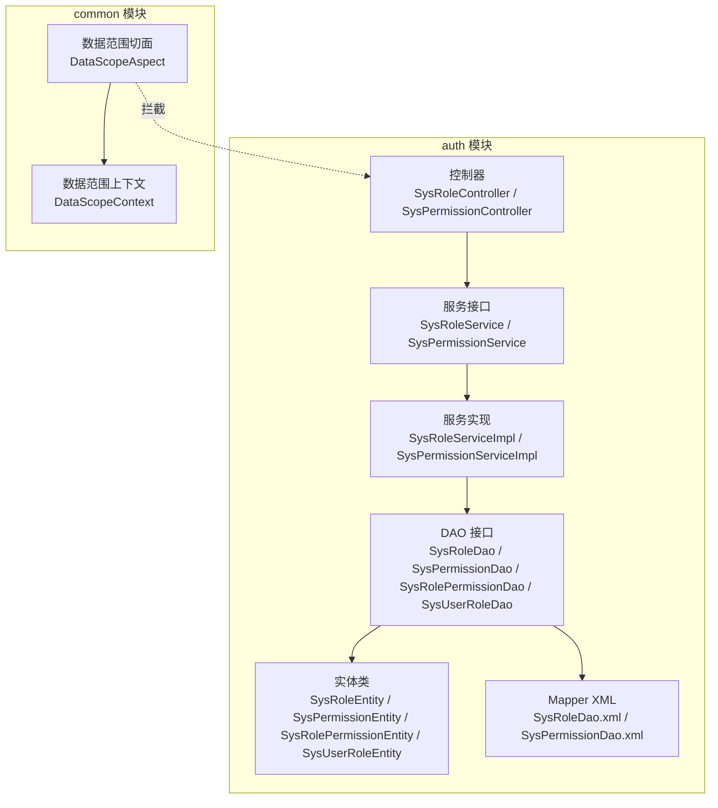
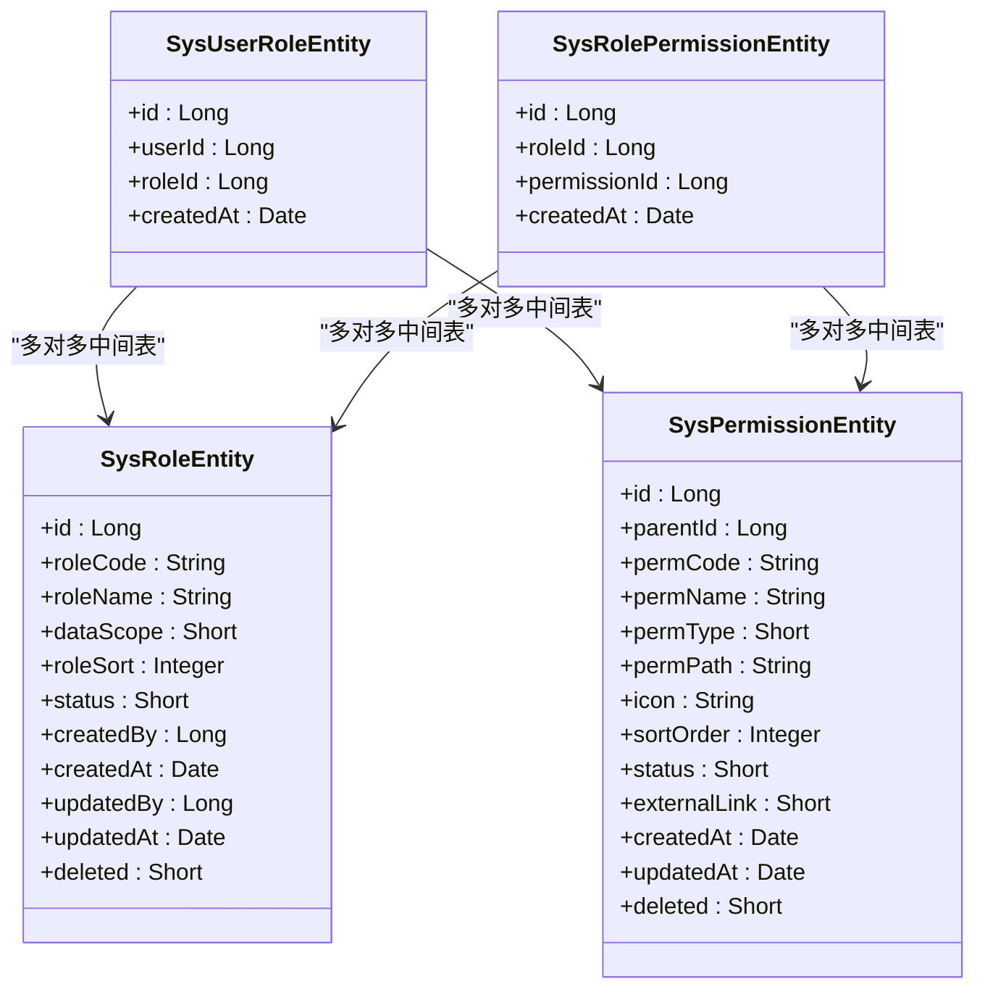
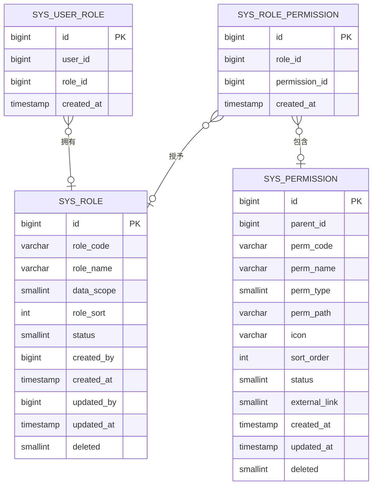
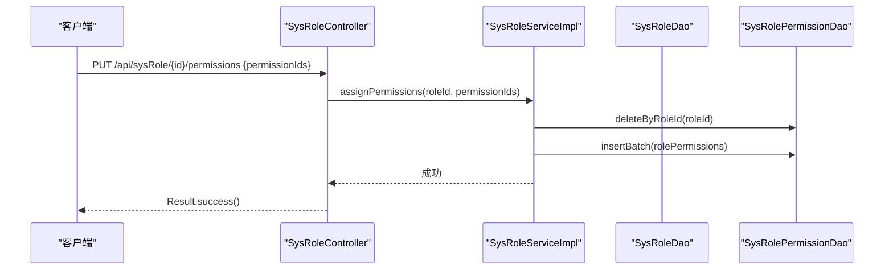
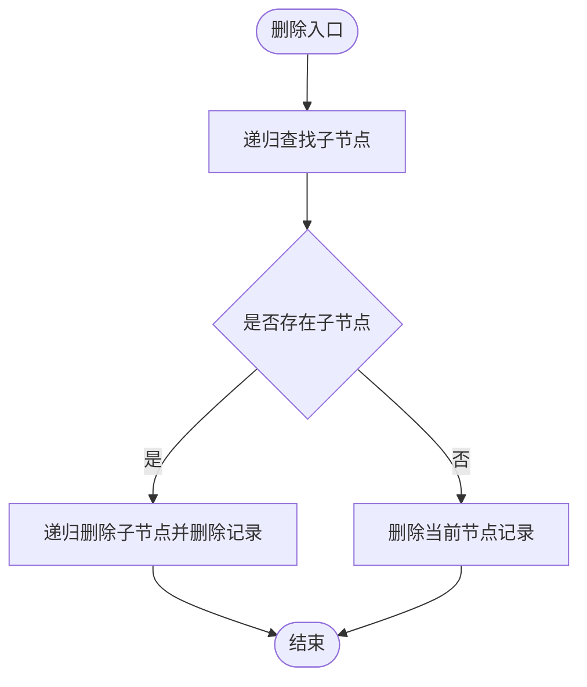
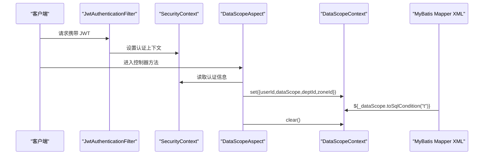
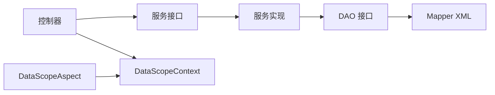

# 角色权限管理

<cite>
**本文引用的文件**
- [SysRoleEntity.java](file://auth/src/main/java/com/dafuweng/auth/entity/SysRoleEntity.java)
- [SysPermissionEntity.java](file://auth/src/main/java/com/dafuweng/auth/entity/SysPermissionEntity.java)
- [SysUserRoleEntity.java](file://auth/src/main/java/com/dafuweng/auth/entity/SysUserRoleEntity.java)
- [SysRolePermissionEntity.java](file://auth/src/main/java/com/dafuweng/auth/entity/SysRolePermissionEntity.java)
- [SysRoleService.java](file://auth/src/main/java/com/dafuweng/auth/service/SysRoleService.java)
- [SysPermissionService.java](file://auth/src/main/java/com/dafuweng/auth/service/SysPermissionService.java)
- [SysRoleServiceImpl.java](file://auth/src/main/java/com/dafuweng/auth/service/impl/SysRoleServiceImpl.java)
- [SysPermissionServiceImpl.java](file://auth/src/main/java/com/dafuweng/auth/service/impl/SysPermissionServiceImpl.java)
- [SysRoleController.java](file://auth/src/main/java/com/dafuweng/auth/controller/SysRoleController.java)
- [SysPermissionController.java](file://auth/src/main/java/com/dafuweng/auth/controller/SysPermissionController.java)
- [SysRoleDao.java](file://auth/src/main/java/com/dafuweng/auth/dao/SysRoleDao.java)
- [SysPermissionDao.java](file://auth/src/main/java/com/dafuweng/auth/dao/SysPermissionDao.java)
- [SysUserRoleDao.java](file://auth/src/main/java/com/dafuweng/auth/dao/SysUserRoleDao.java)
- [SysRolePermissionDao.java](file://auth/src/main/java/com/dafuweng/auth/dao/SysRolePermissionDao.java)
- [SysRoleDao.xml](file://auth/src/main/resources/auth/mapper/SysRoleDao.xml)
- [SysPermissionDao.xml](file://auth/src/main/resources/auth/mapper/SysPermissionDao.xml)
- [DataScopeAspect.java](file://common/src/main/java/com/dafuweng/common/config/DataScopeAspect.java)
- [DataScopeContext.java](file://common/src/main/java/com/dafuweng/common/config/DataScopeContext.java)
</cite>

## 目录
1. [简介](#简介)
2. [项目结构](#项目结构)
3. [核心组件](#核心组件)
4. [架构总览](#架构总览)
5. [详细组件分析](#详细组件分析)
6. [依赖分析](#依赖分析)
7. [性能考量](#性能考量)
8. [故障排查指南](#故障排查指南)
9. [结论](#结论)
10. [附录：API 接口文档](#附录api-接口文档)

## 简介
本技术文档围绕 RBAC（基于角色的访问控制）模型在 NeoCC 项目中的实现展开，系统性阐述角色与权限的数据模型设计、多对多关系映射与级联操作、核心业务流程（角色创建、权限分配、用户角色绑定、权限继承）、服务层的权限验证与数据范围控制机制，并提供完整的角色权限管理 API 文档与最佳实践建议。

## 项目结构
本项目采用多模块架构，权限管理能力集中在 auth 模块，通用配置与数据范围控制位于 common 模块。权限相关模块的关键目录如下：
- auth 模块
  - entity：领域实体（角色、权限、角色-权限关联、用户-角色关联）
  - service：服务接口与实现（角色、权限、用户）
  - controller：REST 控制器（角色、权限）
  - dao + mapper：MyBatis 映射（角色、权限、角色-权限、用户-角色）
- common 模块
  - config：数据范围 AOP 切面与上下文工具类

图表来源
- [SysRoleController.java:1-63](file://auth/src/main/java/com/dafuweng/auth/controller/SysRoleController.java#L1-L63)
- [SysPermissionController.java:1-61](file://auth/src/main/java/com/dafuweng/auth/controller/SysPermissionController.java#L1-L61)
- [SysRoleService.java:1-27](file://auth/src/main/java/com/dafuweng/auth/service/SysRoleService.java#L1-L27)
- [SysPermissionService.java:1-27](file://auth/src/main/java/com/dafuweng/auth/service/SysPermissionService.java#L1-L27)
- [SysRoleServiceImpl.java:1-104](file://auth/src/main/java/com/dafuweng/auth/service/impl/SysRoleServiceImpl.java#L1-L104)
- [SysPermissionServiceImpl.java:1-105](file://auth/src/main/java/com/dafuweng/auth/service/impl/SysPermissionServiceImpl.java#L1-L105)
- [SysRoleDao.java:1-10](file://auth/src/main/java/com/dafuweng/auth/dao/SysRoleDao.java#L1-L10)
- [SysPermissionDao.java:1-21](file://auth/src/main/java/com/dafuweng/auth/dao/SysPermissionDao.java#L1-L21)
- [SysRoleDao.xml:1-21](file://auth/src/main/resources/auth/mapper/SysRoleDao.xml#L1-L21)
- [SysPermissionDao.xml:1-30](file://auth/src/main/resources/auth/mapper/SysPermissionDao.xml#L1-L30)
- [DataScopeAspect.java:1-93](file://common/src/main/java/com/dafuweng/common/config/DataScopeAspect.java#L1-L93)
- [DataScopeContext.java:1-141](file://common/src/main/java/com/dafuweng/common/config/DataScopeContext.java#L1-L141)

章节来源
- [SysRoleController.java:1-63](file://auth/src/main/java/com/dafuweng/auth/controller/SysRoleController.java#L1-L63)
- [SysPermissionController.java:1-61](file://auth/src/main/java/com/dafuweng/auth/controller/SysPermissionController.java#L1-L61)
- [DataScopeAspect.java:1-93](file://common/src/main/java/com/dafuweng/common/config/DataScopeAspect.java#L1-L93)
- [DataScopeContext.java:1-141](file://common/src/main/java/com/dafuweng/common/config/DataScopeContext.java#L1-L141)

## 核心组件
- 实体层：角色、权限、角色-权限关联、用户-角色关联
- 服务层：角色与权限的 CRUD、分页、树形查询、权限分配、用户角色绑定
- 控制器层：统一返回包装 Result 的 REST 接口
- 数据访问层：MyBatis Mapper 与 XML 映射
- 数据范围控制：基于 AOP 切面与 ThreadLocal 上下文的动态 SQL 条件注入

章节来源
- [SysRoleEntity.java:1-41](file://auth/src/main/java/com/dafuweng/auth/entity/SysRoleEntity.java#L1-L41)
- [SysPermissionEntity.java:1-46](file://auth/src/main/java/com/dafuweng/auth/entity/SysPermissionEntity.java#L1-L46)
- [SysUserRoleEntity.java:1-25](file://auth/src/main/java/com/dafuweng/auth/entity/SysUserRoleEntity.java#L1-L25)
- [SysRolePermissionEntity.java:1-25](file://auth/src/main/java/com/dafuweng/auth/entity/SysRolePermissionEntity.java#L1-L25)
- [SysRoleService.java:1-27](file://auth/src/main/java/com/dafuweng/auth/service/SysRoleService.java#L1-L27)
- [SysPermissionService.java:1-27](file://auth/src/main/java/com/dafuweng/auth/service/SysPermissionService.java#L1-L27)

## 架构总览
RBAC 模型在本项目中通过“用户—角色—权限”三层关系实现。用户通过用户-角色表与角色关联；角色通过角色-权限表与权限关联；权限支持树形结构展示与父子关系维护。数据范围控制通过 AOP 切面在控制器执行前提取用户上下文并注入到 DAO 层的 SQL 条件中，实现按用户维度的动态过滤。

图表来源
- [SysRoleEntity.java:1-41](file://auth/src/main/java/com/dafuweng/auth/entity/SysRoleEntity.java#L1-L41)
- [SysPermissionEntity.java:1-46](file://auth/src/main/java/com/dafuweng/auth/entity/SysPermissionEntity.java#L1-L46)
- [SysUserRoleEntity.java:1-25](file://auth/src/main/java/com/dafuweng/auth/entity/SysUserRoleEntity.java#L1-L25)
- [SysRolePermissionEntity.java:1-25](file://auth/src/main/java/com/dafuweng/auth/entity/SysRolePermissionEntity.java#L1-L25)

## 详细组件分析

### 数据模型与关系设计
- 角色实体（SysRoleEntity）
  - 关键字段：角色编码、角色名称、数据范围、排序、状态、创建/更新信息、软删除标识
  - 数据范围字段用于后续数据范围控制
- 权限实体（SysPermissionEntity）
  - 关键字段：父级 ID、权限编码、权限名称、类型、路径、图标、排序、状态、外部链接、创建/更新信息、软删除标识
  - 支持树形结构，通过 parentId 建模父子关系
- 用户-角色关联（SysUserRoleEntity）
  - 关键字段：用户 ID、角色 ID、创建时间
  - 多个用户可拥有多个角色
- 角色-权限关联（SysRolePermissionEntity）
  - 关键字段：角色 ID、权限 ID、创建时间
  - 多个角色可拥有多个权限

图表来源
- [SysRoleEntity.java:1-41](file://auth/src/main/java/com/dafuweng/auth/entity/SysRoleEntity.java#L1-L41)
- [SysPermissionEntity.java:1-46](file://auth/src/main/java/com/dafuweng/auth/entity/SysPermissionEntity.java#L1-L46)
- [SysUserRoleEntity.java:1-25](file://auth/src/main/java/com/dafuweng/auth/entity/SysUserRoleEntity.java#L1-L25)
- [SysRolePermissionEntity.java:1-25](file://auth/src/main/java/com/dafuweng/auth/entity/SysRolePermissionEntity.java#L1-L25)

章节来源
- [SysRoleEntity.java:1-41](file://auth/src/main/java/com/dafuweng/auth/entity/SysRoleEntity.java#L1-L41)
- [SysPermissionEntity.java:1-46](file://auth/src/main/java/com/dafuweng/auth/entity/SysPermissionEntity.java#L1-L46)
- [SysUserRoleEntity.java:1-25](file://auth/src/main/java/com/dafuweng/auth/entity/SysUserRoleEntity.java#L1-L25)
- [SysRolePermissionEntity.java:1-25](file://auth/src/main/java/com/dafuweng/auth/entity/SysRolePermissionEntity.java#L1-L25)

### 业务流程与服务实现

#### 角色管理
- 查询与分页：支持按创建时间或指定字段排序分页
- 状态筛选：按状态查询角色列表
- 权限分配：先清空旧权限，再批量插入新权限集合
- 创建/更新/删除：标准 CRUD，删除为物理删除

图表来源
- [SysRoleController.java:51-55](file://auth/src/main/java/com/dafuweng/auth/controller/SysRoleController.java#L51-L55)
- [SysRoleServiceImpl.java:67-82](file://auth/src/main/java/com/dafuweng/auth/service/impl/SysRoleServiceImpl.java#L67-L82)
- [SysRolePermissionDao.java:1-19](file://auth/src/main/java/com/dafuweng/auth/dao/SysRolePermissionDao.java#L1-L19)

章节来源
- [SysRoleController.java:1-63](file://auth/src/main/java/com/dafuweng/auth/controller/SysRoleController.java#L1-L63)
- [SysRoleServiceImpl.java:1-104](file://auth/src/main/java/com/dafuweng/auth/service/impl/SysRoleServiceImpl.java#L1-L104)
- [SysRoleService.java:1-27](file://auth/src/main/java/com/dafuweng/auth/service/SysRoleService.java#L1-L27)

#### 权限管理
- 树形查询：按排序字段升序返回权限树
- 子节点查询：根据父级 ID 查询子权限
- 删除策略：递归删除所有子节点后删除自身
- 创建/更新/删除：标准 CRUD

图表来源
- [SysPermissionServiceImpl.java:95-103](file://auth/src/main/java/com/dafuweng/auth/service/impl/SysPermissionServiceImpl.java#L95-L103)
- [SysPermissionController.java:55-59](file://auth/src/main/java/com/dafuweng/auth/controller/SysPermissionController.java#L55-L59)

章节来源
- [SysPermissionController.java:1-61](file://auth/src/main/java/com/dafuweng/auth/controller/SysPermissionController.java#L1-L61)
- [SysPermissionServiceImpl.java:1-105](file://auth/src/main/java/com/dafuweng/auth/service/impl/SysPermissionServiceImpl.java#L1-L105)
- [SysPermissionService.java:1-27](file://auth/src/main/java/com/dafuweng/auth/service/SysPermissionService.java#L1-L27)

#### 用户角色绑定
- 用户角色查询：根据用户 ID 查询其角色 ID 列表
- 角色批量绑定：先按用户 ID 清空旧绑定，再批量插入新绑定
- 该流程与角色-权限分配类似，均采用“清空-重建”的策略保证一致性

章节来源
- [SysUserRoleDao.java:1-19](file://auth/src/main/java/com/dafuweng/auth/dao/SysUserRoleDao.java#L1-L19)

### 数据范围控制与动态权限加载

#### 数据范围 AOP 切面
- 在控制器方法执行前，从 Spring Security 上下文中提取用户数据（用户 ID、数据范围级别、部门 ID、战区 ID），放入 ThreadLocal 上下文
- 通过反射兼容不同模块的用户实体字段，避免 common 模块对 auth 模块的直接依赖

图表来源
- [DataScopeAspect.java:29-38](file://common/src/main/java/com/dafuweng/common/config/DataScopeAspect.java#L29-L38)
- [DataScopeContext.java:106-139](file://common/src/main/java/com/dafuweng/common/config/DataScopeContext.java#L106-L139)

#### 动态权限加载
- 服务层通过 DAO 查询角色对应的权限码列表，用于运行时权限校验
- 权限码查询基于角色-权限中间表进行内连接查询

章节来源
- [SysPermissionDao.java:14-19](file://auth/src/main/java/com/dafuweng/auth/dao/SysPermissionDao.java#L14-L19)
- [SysPermissionDao.xml:21-27](file://auth/src/main/resources/auth/mapper/SysPermissionDao.xml#L21-L27)

## 依赖分析
- 控制器依赖服务接口，服务实现依赖 DAO 接口
- DAO 通过 MyBatis XML 定义 SQL，避免硬编码 SQL
- 数据范围控制通过 AOP 切面与上下文工具类解耦，不侵入业务代码
- 实体间通过中间表建立多对多关系，遵循 RBAC 设计原则

图表来源
- [SysRoleController.java:1-63](file://auth/src/main/java/com/dafuweng/auth/controller/SysRoleController.java#L1-L63)
- [SysPermissionController.java:1-61](file://auth/src/main/java/com/dafuweng/auth/controller/SysPermissionController.java#L1-L61)
- [SysRoleServiceImpl.java:1-104](file://auth/src/main/java/com/dafuweng/auth/service/impl/SysRoleServiceImpl.java#L1-L104)
- [SysPermissionServiceImpl.java:1-105](file://auth/src/main/java/com/dafuweng/auth/service/impl/SysPermissionServiceImpl.java#L1-L105)
- [SysRoleDao.java:1-10](file://auth/src/main/java/com/dafuweng/auth/dao/SysRoleDao.java#L1-L10)
- [SysPermissionDao.java:1-21](file://auth/src/main/java/com/dafuweng/auth/dao/SysPermissionDao.java#L1-L21)
- [SysRoleDao.xml:1-21](file://auth/src/main/resources/auth/mapper/SysRoleDao.xml#L1-L21)
- [SysPermissionDao.xml:1-30](file://auth/src/main/resources/auth/mapper/SysPermissionDao.xml#L1-L30)
- [DataScopeAspect.java:1-93](file://common/src/main/java/com/dafuweng/common/config/DataScopeAspect.java#L1-L93)
- [DataScopeContext.java:1-141](file://common/src/main/java/com/dafuweng/common/config/DataScopeContext.java#L1-L141)

章节来源
- [SysRoleController.java:1-63](file://auth/src/main/java/com/dafuweng/auth/controller/SysRoleController.java#L1-L63)
- [SysPermissionController.java:1-61](file://auth/src/main/java/com/dafuweng/auth/controller/SysPermissionController.java#L1-L61)
- [SysRoleServiceImpl.java:1-104](file://auth/src/main/java/com/dafuweng/auth/service/impl/SysRoleServiceImpl.java#L1-L104)
- [SysPermissionServiceImpl.java:1-105](file://auth/src/main/java/com/dafuweng/auth/service/impl/SysPermissionServiceImpl.java#L1-L105)
- [DataScopeAspect.java:1-93](file://common/src/main/java/com/dafuweng/common/config/DataScopeAspect.java#L1-L93)
- [DataScopeContext.java:1-141](file://common/src/main/java/com/dafuweng/common/config/DataScopeContext.java#L1-L141)

## 性能考量
- 批量操作：角色-权限与用户-角色的分配采用批量插入，减少数据库往返次数
- 分页查询：控制器层统一使用分页参数，避免一次性加载大量数据
- 事务边界：权限分配与用户绑定在单事务中完成，确保一致性
- SQL 优化：树形查询与权限码查询均通过索引列（如排序、父级 ID、角色 ID）进行过滤

## 故障排查指南
- 权限分配失败
  - 检查角色 ID 是否存在
  - 检查权限 ID 列表是否为空或包含无效 ID
  - 查看事务是否回滚导致未生效
- 删除权限异常
  - 确认是否存在子节点未被递归删除
  - 检查软删除字段是否影响查询结果
- 数据范围过滤无效
  - 确认控制器方法是否被 DataScopeAspect 拦截
  - 检查 SecurityContext 中用户上下文是否正确设置
  - 核对 Mapper XML 中是否正确引用 ${_dataScope.toSqlCondition}

章节来源
- [SysRoleServiceImpl.java:67-82](file://auth/src/main/java/com/dafuweng/auth/service/impl/SysRoleServiceImpl.java#L67-L82)
- [SysPermissionServiceImpl.java:95-103](file://auth/src/main/java/com/dafuweng/auth/service/impl/SysPermissionServiceImpl.java#L95-L103)
- [DataScopeAspect.java:29-38](file://common/src/main/java/com/dafuweng/common/config/DataScopeAspect.java#L29-L38)
- [DataScopeContext.java:106-139](file://common/src/main/java/com/dafuweng/common/config/DataScopeContext.java#L106-L139)

## 结论
本项目基于 RBAC 模型构建了清晰的角色、权限与用户关系，配合数据范围控制与动态权限加载机制，实现了灵活且安全的权限管理体系。通过 AOP 切面与 ThreadLocal 上下文，数据范围控制与业务逻辑解耦，便于扩展与维护。

## 附录：API 接口文档

### 角色管理接口
- 获取角色详情
  - GET /api/sysRole/{id}
  - 返回：角色实体
- 分页查询角色
  - GET /api/sysRole/page
  - 参数：page、size、sortField、sortOrder
  - 返回：分页响应
- 按状态查询角色
  - GET /api/sysRole/listByStatus?status={status}
  - 返回：角色列表
- 获取角色权限 ID 列表
  - GET /api/sysRole/{id}/permissions
  - 返回：权限 ID 列表
- 新增角色
  - POST /api/sysRole
  - 请求体：角色实体
  - 返回：新增角色
- 更新角色
  - PUT /api/sysRole
  - 请求体：角色实体
  - 返回：更新后的角色
- 分配角色权限
  - PUT /api/sysRole/{id}/permissions
  - 请求体：{ "permissionIds": [1,2,3] }
  - 返回：成功
- 删除角色
  - DELETE /api/sysRole/{id}
  - 返回：成功

章节来源
- [SysRoleController.java:21-61](file://auth/src/main/java/com/dafuweng/auth/controller/SysRoleController.java#L21-L61)

### 权限管理接口
- 获取权限详情
  - GET /api/sysPermission/{id}
  - 返回：权限实体
- 分页查询权限
  - GET /api/sysPermission/page
  - 参数：page、size、sortField、sortOrder
  - 返回：分页响应
- 权限树查询
  - GET /api/sysPermission/tree
  - 返回：权限树列表
- 查询子权限
  - GET /api/sysPermission/children?parentId={parentId}
  - 返回：子权限列表
- 按状态查询权限
  - GET /api/sysPermission/listByStatus?status={status}
  - 返回：权限列表
- 新增权限
  - POST /api/sysPermission
  - 请求体：权限实体
  - 返回：新增权限
- 更新权限
  - PUT /api/sysPermission
  - 请求体：权限实体
  - 返回：更新后的权限
- 删除权限
  - DELETE /api/sysPermission/{id}
  - 返回：成功

章节来源
- [SysPermissionController.java:20-60](file://auth/src/main/java/com/dafuweng/auth/controller/SysPermissionController.java#L20-L60)

### 最佳实践与安全考虑
- 权限分配采用“清空-重建”策略，确保权限集准确一致
- 使用事务包裹关键写操作，避免部分更新导致的状态不一致
- 数据范围控制通过 AOP 切面自动注入，避免在业务代码中重复编写过滤逻辑
- 权限码查询与校验应结合缓存与鉴权框架，降低运行时开销
- 对外暴露的接口应配合网关与认证过滤器，确保请求具备有效身份