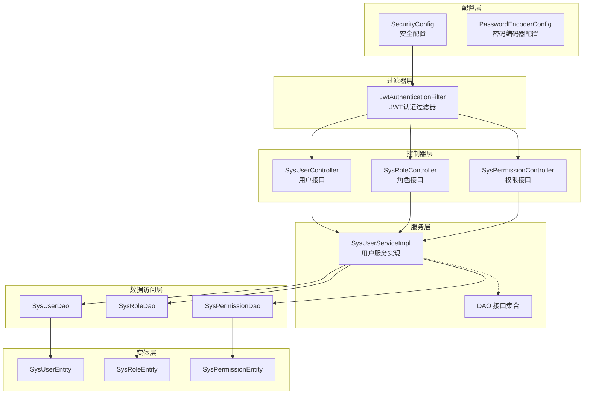
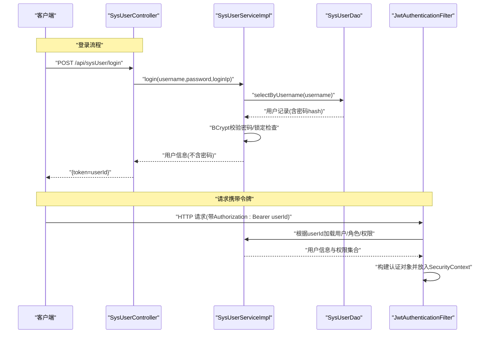
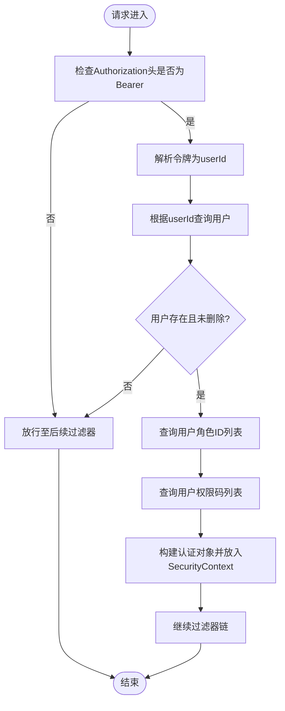
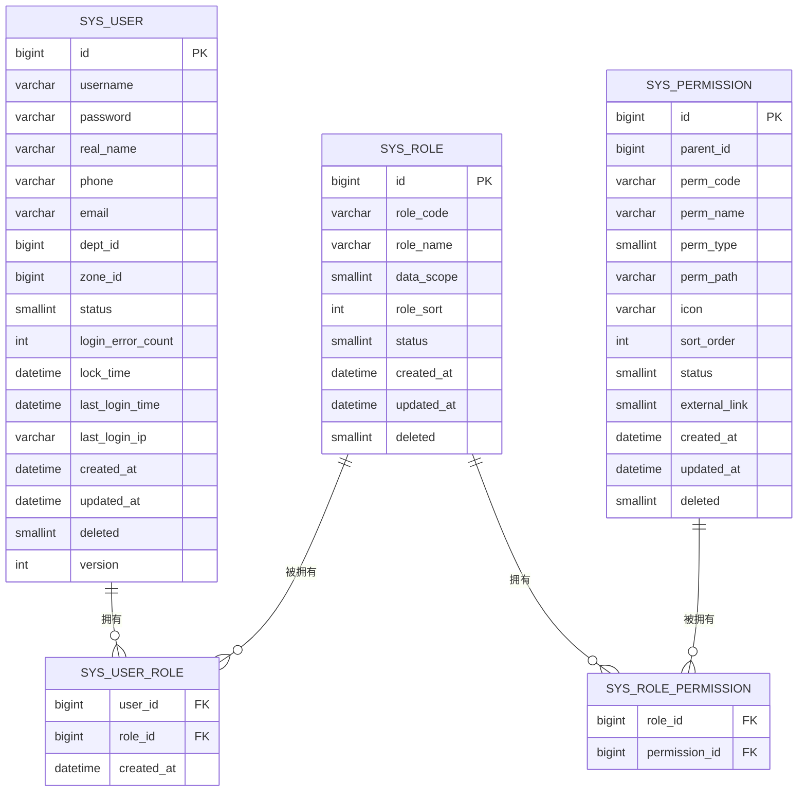
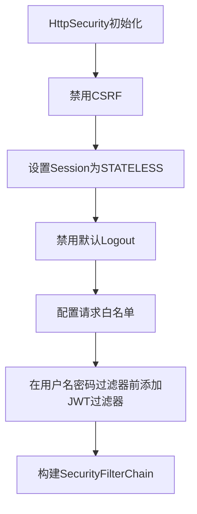
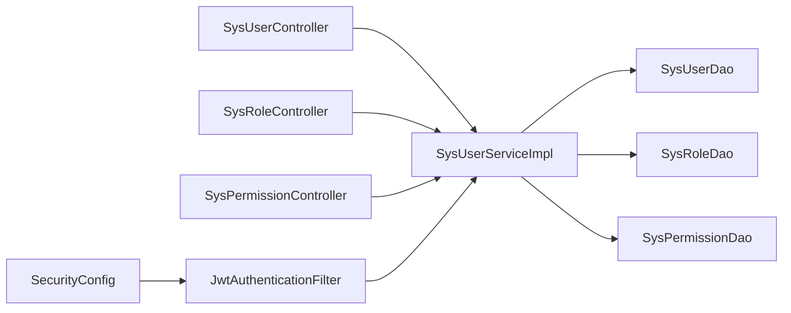

# 认证授权模块

<cite>
**本文引用的文件**
- [SecurityConfig.java](file://auth/src/main/java/com/dafuweng/auth/config/SecurityConfig.java)
- [PasswordEncoderConfig.java](file://auth/src/main/java/com/dafuweng/auth/config/PasswordEncoderConfig.java)
- [JwtAuthenticationFilter.java](file://auth/src/main/java/com/dafuweng/auth/filter/JwtAuthenticationFilter.java)
- [SysUserController.java](file://auth/src/main/java/com/dafuweng/auth/controller/SysUserController.java)
- [SysRoleController.java](file://auth/src/main/java/com/dafuweng/auth/controller/SysRoleController.java)
- [SysPermissionController.java](file://auth/src/main/java/com/dafuweng/auth/controller/SysPermissionController.java)
- [SysUserService.java](file://auth/src/main/java/com/dafuweng/auth/service/SysUserService.java)
- [SysUserServiceImpl.java](file://auth/src/main/java/com/dafuweng/auth/service/impl/SysUserServiceImpl.java)
- [SysUserDao.java](file://auth/src/main/java/com/dafuweng/auth/dao/SysUserDao.java)
- [SysRoleDao.java](file://auth/src/main/java/com/dafuweng/auth/dao/SysRoleDao.java)
- [SysPermissionDao.java](file://auth/src/main/java/com/dafuweng/auth/dao/SysPermissionDao.java)
- [SysUserEntity.java](file://auth/src/main/java/com/dafuweng/auth/entity/SysUserEntity.java)
- [SysRoleEntity.java](file://auth/src/main/java/com/dafuweng/auth/entity/SysRoleEntity.java)
- [SysPermissionEntity.java](file://auth/src/main/java/com/dafuweng/auth/entity/SysPermissionEntity.java)
- [application.yml](file://auth/src/main/resources/application.yml)
</cite>

## 目录
1. [简介](#简介)
2. [项目结构](#项目结构)
3. [核心组件](#核心组件)
4. [架构总览](#架构总览)
5. [详细组件分析](#详细组件分析)
6. [依赖分析](#依赖分析)
7. [性能考虑](#性能考虑)
8. [故障排查指南](#故障排查指南)
9. [结论](#结论)
10. [附录](#附录)

## 简介
本文件为认证授权模块的全面技术文档，覆盖以下主题：
- JWT 令牌认证机制：令牌生成、验证与刷新流程的设计与实现要点
- 基于角色的访问控制（RBAC）模型：用户、角色、权限的数据模型与业务逻辑
- Spring Security 安全配置：过滤器链、权限拦截与异常处理
- 完整 API 接口文档：用户登录、权限获取、角色管理等接口说明
- 密码加密策略与安全配置最佳实践
- 用户会话管理、并发登录控制与安全审计
- 常见安全问题的防护措施与解决方案

## 项目结构
认证授权模块位于 auth 子工程中，采用分层架构：
- 配置层：Spring Security 安全配置与密码编码器配置
- 过滤器层：JWT 认证过滤器，负责从请求头提取令牌并解析用户身份
- 控制器层：提供用户、角色、权限的 REST 接口
- 服务层：封装业务逻辑，如登录、登出、角色与权限分配、密码变更等
- 数据访问层：MyBatis-Plus Mapper 接口，负责数据库交互
- 实体层：用户、角色、权限的领域模型

图表来源
- [SecurityConfig.java:33-52](file://auth/src/main/java/com/dafuweng/auth/config/SecurityConfig.java#L33-L52)
- [JwtAuthenticationFilter.java:28-80](file://auth/src/main/java/com/dafuweng/auth/filter/JwtAuthenticationFilter.java#L28-L80)
- [SysUserController.java:14-98](file://auth/src/main/java/com/dafuweng/auth/controller/SysUserController.java#L14-L98)
- [SysRoleController.java:14-63](file://auth/src/main/java/com/dafuweng/auth/controller/SysRoleController.java#L14-L63)
- [SysPermissionController.java:13-61](file://auth/src/main/java/com/dafuweng/auth/controller/SysPermissionController.java#L13-L61)
- [SysUserServiceImpl.java:28-229](file://auth/src/main/java/com/dafuweng/auth/service/impl/SysUserServiceImpl.java#L28-L229)
- [SysUserDao.java:8-12](file://auth/src/main/java/com/dafuweng/auth/dao/SysUserDao.java#L8-L12)
- [SysRoleDao.java:7-9](file://auth/src/main/java/com/dafuweng/auth/dao/SysRoleDao.java#L7-L9)
- [SysPermissionDao.java:11-20](file://auth/src/main/java/com/dafuweng/auth/dao/SysPermissionDao.java#L11-L20)

章节来源
- [SecurityConfig.java:17-54](file://auth/src/main/java/com/dafuweng/auth/config/SecurityConfig.java#L17-L54)
- [application.yml:1-35](file://auth/src/main/resources/application.yml#L1-L35)

## 核心组件
- 安全配置 SecurityConfig：禁用 CSRF 与 Session，设置静态资源与特定接口白名单，添加 JWT 认证过滤器到过滤器链
- 密码编码器 PasswordEncoderConfig：提供 BCrypt 编码器 Bean
- JWT 认证过滤器 JwtAuthenticationFilter：从 Authorization 请求头解析令牌，加载用户、角色与权限，注入到 Spring Security 上下文
- 用户服务 SysUserServiceImpl：实现登录、登出、解锁、角色与权限查询、密码变更等业务逻辑
- 控制器层：提供用户、角色、权限的增删改查与相关操作接口

章节来源
- [SecurityConfig.java:28-52](file://auth/src/main/java/com/dafuweng/auth/config/SecurityConfig.java#L28-L52)
- [PasswordEncoderConfig.java:10-13](file://auth/src/main/java/com/dafuweng/auth/config/PasswordEncoderConfig.java#L10-L13)
- [JwtAuthenticationFilter.java:28-80](file://auth/src/main/java/com/dafuweng/auth/filter/JwtAuthenticationFilter.java#L28-L80)
- [SysUserServiceImpl.java:79-118](file://auth/src/main/java/com/dafuweng/auth/service/impl/SysUserServiceImpl.java#L79-L118)
- [SysUserController.java:41-53](file://auth/src/main/java/com/dafuweng/auth/controller/SysUserController.java#L41-L53)

## 架构总览
认证授权模块采用无状态 JWT 认证模式：
- 客户端通过登录接口提交用户名与密码
- 服务端验证成功后，使用用户 ID 作为令牌内容下发给客户端
- 客户端在后续请求的 Authorization 头中携带 Bearer 令牌
- 过滤器解析令牌，加载用户的角色与权限，构建认证对象并放入安全上下文
- Spring Security 根据方法级注解与请求路径进行权限校验

图表来源
- [SysUserController.java:41-47](file://auth/src/main/java/com/dafuweng/auth/controller/SysUserController.java#L41-L47)
- [SysUserServiceImpl.java:79-118](file://auth/src/main/java/com/dafuweng/auth/service/impl/SysUserServiceImpl.java#L79-L118)
- [SysUserDao.java:11](file://auth/src/main/java/com/dafuweng/auth/dao/SysUserDao.java#L11)
- [JwtAuthenticationFilter.java:49-77](file://auth/src/main/java/com/dafuweng/auth/filter/JwtAuthenticationFilter.java#L49-L77)

## 详细组件分析

### JWT 令牌认证机制
- 令牌生成：登录成功后，服务端以用户 ID 作为令牌内容返回给客户端
- 令牌验证：过滤器从 Authorization 请求头读取 Bearer 令牌，解析为用户 ID；加载用户、角色与权限码，构建认证对象
- 令牌刷新：当前实现未提供专用刷新接口，建议在网关层或客户端侧实现刷新策略（例如引入 refresh_token）

图表来源
- [JwtAuthenticationFilter.java:33-77](file://auth/src/main/java/com/dafuweng/auth/filter/JwtAuthenticationFilter.java#L33-L77)
- [SysUserServiceImpl.java:144-166](file://auth/src/main/java/com/dafuweng/auth/service/impl/SysUserServiceImpl.java#L144-L166)

章节来源
- [JwtAuthenticationFilter.java:28-80](file://auth/src/main/java/com/dafuweng/auth/filter/JwtAuthenticationFilter.java#L28-L80)
- [SysUserServiceImpl.java:144-166](file://auth/src/main/java/com/dafuweng/auth/service/impl/SysUserServiceImpl.java#L144-L166)

### RBAC 数据模型与业务逻辑
- 数据模型
  - 用户：SysUserEntity，包含基础字段、状态、锁定时间、登录统计与审计字段
  - 角色：SysRoleEntity，包含角色编码、名称、数据范围、排序与状态
  - 权限：SysPermissionEntity，包含权限码、名称、类型、路径、图标、排序与状态
- 关联关系
  - 用户-角色：多对多，通过 SysUserRoleEntity 维护
  - 角色-权限：多对多，通过 SysRolePermissionEntity 维护
- 业务逻辑
  - 用户登录：校验用户名与密码，支持账户锁定与错误次数限制
  - 权限聚合：按用户查询其角色，再汇总各角色的权限码
  - 角色分配：清空旧关系后批量插入新关系
  - 密码变更：校验旧密码，使用 BCrypt 编码新密码

图表来源
- [SysUserEntity.java:18-58](file://auth/src/main/java/com/dafuweng/auth/entity/SysUserEntity.java#L18-L58)
- [SysRoleEntity.java:17-40](file://auth/src/main/java/com/dafuweng/auth/entity/SysRoleEntity.java#L17-L40)
- [SysPermissionEntity.java:18-45](file://auth/src/main/java/com/dafuweng/auth/entity/SysPermissionEntity.java#L18-L45)

章节来源
- [SysUserServiceImpl.java:144-166](file://auth/src/main/java/com/dafuweng/auth/service/impl/SysUserServiceImpl.java#L144-L166)
- [SysUserServiceImpl.java:168-183](file://auth/src/main/java/com/dafuweng/auth/service/impl/SysUserServiceImpl.java#L168-L183)

### Spring Security 安全配置
- 无状态会话：禁用 Session，使用 STATELESS 策略
- 白名单：开放登录、分页、系统管理接口、RuoYi 前端适配接口与静态资源
- 过滤器链：在默认表单用户名密码过滤器之前加入自定义 JWT 认证过滤器
- 方法级安全：启用方法级权限注解（如 @PreAuthorize 等）

图表来源
- [SecurityConfig.java:34-51](file://auth/src/main/java/com/dafuweng/auth/config/SecurityConfig.java#L34-L51)

章节来源
- [SecurityConfig.java:28-52](file://auth/src/main/java/com/dafuweng/auth/config/SecurityConfig.java#L28-L52)

### API 接口文档

- 用户接口
  - GET /api/sysUser/{id}：按ID获取用户
  - GET /api/sysUser/page：分页查询用户
  - GET /api/sysUser/{id}/roles：获取用户角色ID列表
  - GET /api/sysUser/{id}/permCodes：获取用户权限码列表
  - POST /api/sysUser/login：用户登录
  - POST /api/sysUser/logout：用户登出
  - POST /api/sysUser：新增用户
  - PUT /api/sysUser：修改用户
  - PUT /api/sysUser/{id}/roles：为用户分配角色
  - PUT /api/sysUser/{id}/unlock：解锁用户
  - PUT /api/sysUser/{id}/password：修改密码
  - DELETE /api/sysUser/{id}：删除用户
  - POST /api/sysUser/dev/reset-password：开发环境重置密码（调试接口）

- 角色接口
  - GET /api/sysRole/{id}：按ID获取角色
  - GET /api/sysRole/page：分页查询角色
  - GET /api/sysRole/listByStatus：按状态查询角色
  - GET /api/sysRole/{id}/permissions：获取角色权限ID列表
  - POST /api/sysRole：新增角色
  - PUT /api/sysRole：修改角色
  - PUT /api/sysRole/{id}/permissions：为角色分配权限
  - DELETE /api/sysRole/{id}：删除角色

- 权限接口
  - GET /api/sysPermission/{id}：按ID获取权限
  - GET /api/sysPermission/page：分页查询权限
  - GET /api/sysPermission/tree：权限树形列表
  - GET /api/sysPermission/children：按父ID查询子权限
  - GET /api/sysPermission/listByStatus：按状态查询权限
  - POST /api/sysPermission：新增权限
  - PUT /api/sysPermission：修改权限
  - DELETE /api/sysPermission/{id}：删除权限

章节来源
- [SysUserController.java:21-98](file://auth/src/main/java/com/dafuweng/auth/controller/SysUserController.java#L21-L98)
- [SysRoleController.java:21-63](file://auth/src/main/java/com/dafuweng/auth/controller/SysRoleController.java#L21-L63)
- [SysPermissionController.java:20-61](file://auth/src/main/java/com/dafuweng/auth/controller/SysPermissionController.java#L20-L61)

### 密码加密策略与安全配置最佳实践
- 密码加密：使用 BCrypt 编码器对密码进行哈希存储，登录时使用 matches 进行验证
- 锁定机制：连续错误达到阈值后锁定账户一段时间，防止暴力破解
- 传输安全：建议在生产环境启用 HTTPS，并在网关层统一处理证书与 TLS
- 令牌安全：建议引入 refresh_token 与短期 access_token，access_token 设置较短有效期，refresh_token 用于安全刷新

章节来源
- [PasswordEncoderConfig.java:10-13](file://auth/src/main/java/com/dafuweng/auth/config/PasswordEncoderConfig.java#L10-L13)
- [SysUserServiceImpl.java:96-107](file://auth/src/main/java/com/dafuweng/auth/service/impl/SysUserServiceImpl.java#L96-L107)

### 用户会话管理、并发登录控制与安全审计
- 会话管理：当前实现为无状态，不维护服务端会话；建议在网关层或客户端侧实现会话同步与失效通知
- 并发控制：可扩展在 Redis 中记录用户在线会话标识，限制最大并发会话数
- 审计日志：可在系统模块中增加操作日志切面，记录用户关键操作；当前系统模块已提供操作日志切面与实体

章节来源
- [SecurityConfig.java:37](file://auth/src/main/java/com/dafuweng/auth/config/SecurityConfig.java#L37)
- [application.yml:32-35](file://auth/src/main/resources/application.yml#L32-L35)

## 依赖分析
- 组件耦合
  - 控制器依赖服务接口，服务实现依赖 DAO 接口，形成清晰的分层依赖
  - 过滤器依赖用户服务以加载用户与权限信息
  - 安全配置依赖过滤器与用户服务
- 外部依赖
  - Spring Security、MyBatis-Plus、BCrypt 编码器
  - 数据源配置与 Nacos 注册发现

图表来源
- [SysUserController.java:18-19](file://auth/src/main/java/com/dafuweng/auth/controller/SysUserController.java#L18-L19)
- [SysRoleController.java:18-19](file://auth/src/main/java/com/dafuweng/auth/controller/SysRoleController.java#L18-L19)
- [SysPermissionController.java:17-18](file://auth/src/main/java/com/dafuweng/auth/controller/SysPermissionController.java#L17-L18)
- [SysUserServiceImpl.java:31-44](file://auth/src/main/java/com/dafuweng/auth/service/impl/SysUserServiceImpl.java#L31-L44)
- [SecurityConfig.java:24](file://auth/src/main/java/com/dafuweng/auth/config/SecurityConfig.java#L24)
- [JwtAuthenticationFilter.java:24](file://auth/src/main/java/com/dafuweng/auth/filter/JwtAuthenticationFilter.java#L24)

章节来源
- [SysUserServiceImpl.java:28-229](file://auth/src/main/java/com/dafuweng/auth/service/impl/SysUserServiceImpl.java#L28-L229)
- [SysUserDao.java:8-12](file://auth/src/main/java/com/dafuweng/auth/dao/SysUserDao.java#L8-L12)
- [SysRoleDao.java:7-9](file://auth/src/main/java/com/dafuweng/auth/dao/SysRoleDao.java#L7-L9)
- [SysPermissionDao.java:11-20](file://auth/src/main/java/com/dafuweng/auth/dao/SysPermissionDao.java#L11-L20)

## 性能考虑
- 查询优化：对用户分页查询默认按创建时间排序，避免全表扫描；权限码聚合按角色循环查询，建议在 DAO 层合并 SQL 或引入缓存
- 缓存策略：对热点用户信息与权限码进行本地缓存，降低数据库压力
- 并发控制：在高并发场景下，登录与解锁操作使用事务保证一致性
- 日志输出：开发环境开启 SQL 日志便于调试，生产环境建议关闭或降级

## 故障排查指南
- 登录失败
  - 检查用户名是否存在、是否被删除
  - 核对密码是否匹配（BCrypt）
  - 查看账户是否因多次错误而被锁定
- 权限不足
  - 确认用户是否已分配角色与权限
  - 检查权限码是否正确映射
- 令牌无效
  - 确认请求头格式是否为 Bearer 令牌
  - 检查令牌内容是否为合法用户ID
- 数据库连接
  - 检查数据源配置与 Nacos 注册信息

章节来源
- [SysUserServiceImpl.java:82-107](file://auth/src/main/java/com/dafuweng/auth/service/impl/SysUserServiceImpl.java#L82-L107)
- [JwtAuthenticationFilter.java:49-77](file://auth/src/main/java/com/dafuweng/auth/filter/JwtAuthenticationFilter.java#L49-L77)
- [application.yml:7-18](file://auth/src/main/resources/application.yml#L7-L18)

## 结论
本认证授权模块实现了基于 JWT 的无状态认证与 RBAC 权限控制，结合 Spring Security 的过滤器链完成请求拦截与权限校验。通过 BCrypt 密码编码与账户锁定机制提升了安全性。建议在后续版本中完善令牌刷新、并发登录控制与审计日志能力，并在生产环境中强化传输与令牌安全策略。

## 附录
- 开发环境配置参考 application.yml 中的数据源与日志级别设置
- 前端适配接口白名单已在安全配置中明确，便于与 RuoYi 前端对接

章节来源
- [application.yml:1-35](file://auth/src/main/resources/application.yml#L1-L35)
- [SecurityConfig.java:40-46](file://auth/src/main/java/com/dafuweng/auth/config/SecurityConfig.java#L40-L46)