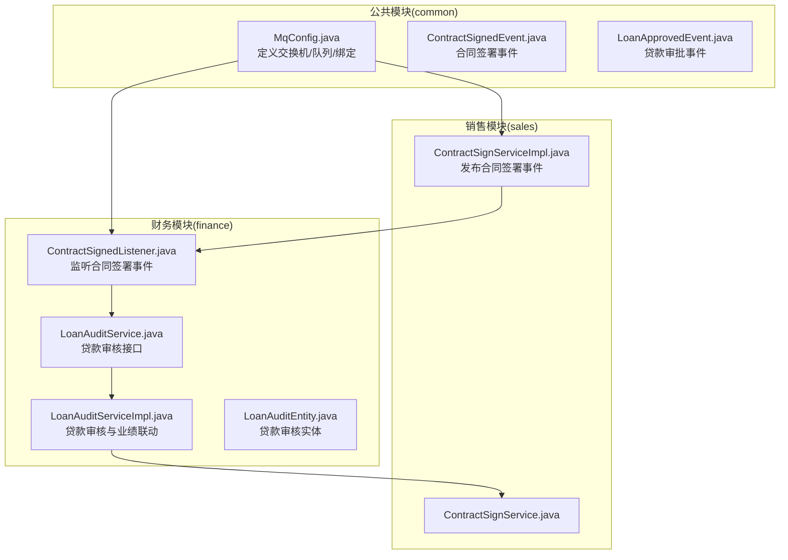
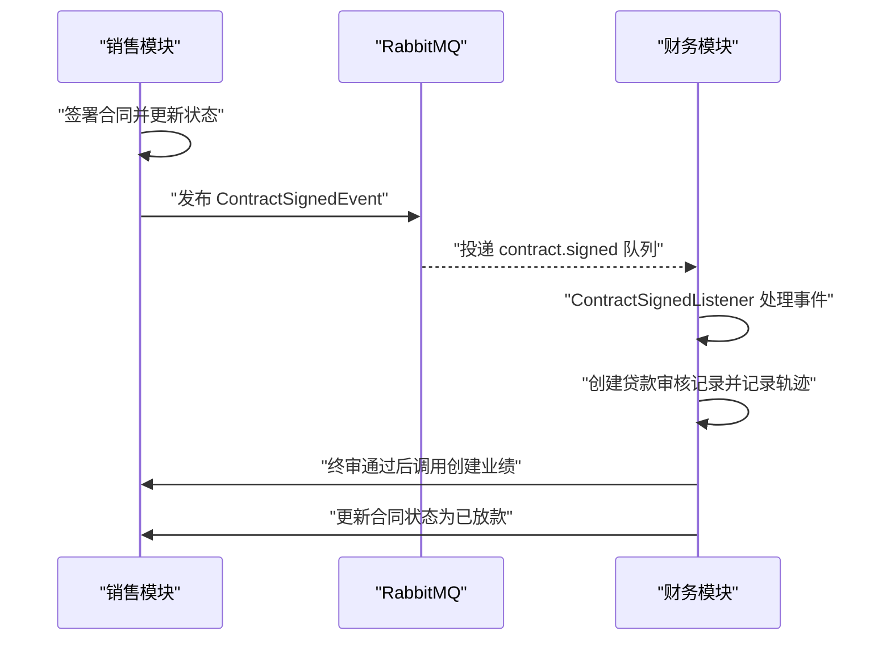
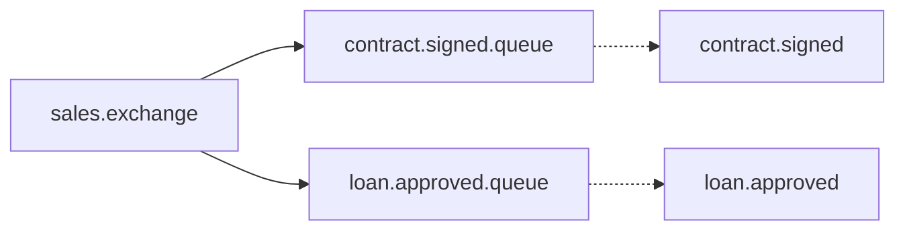
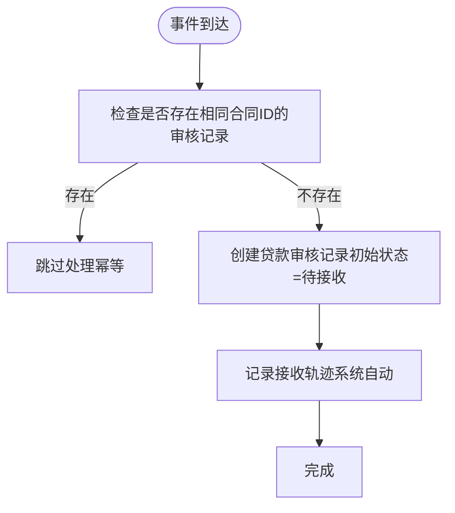
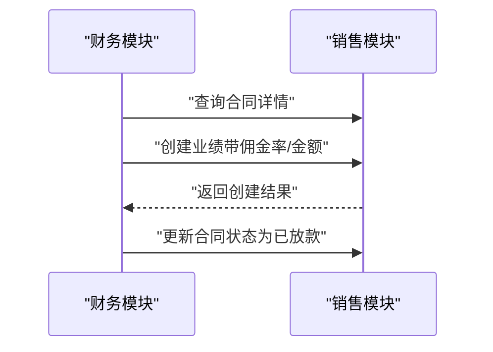
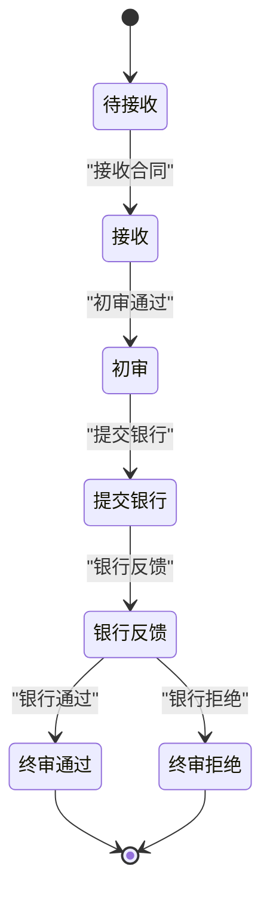
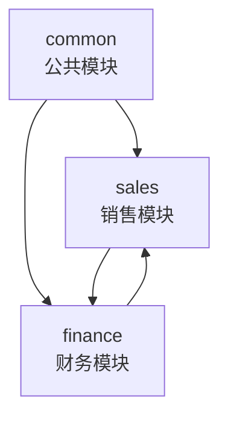
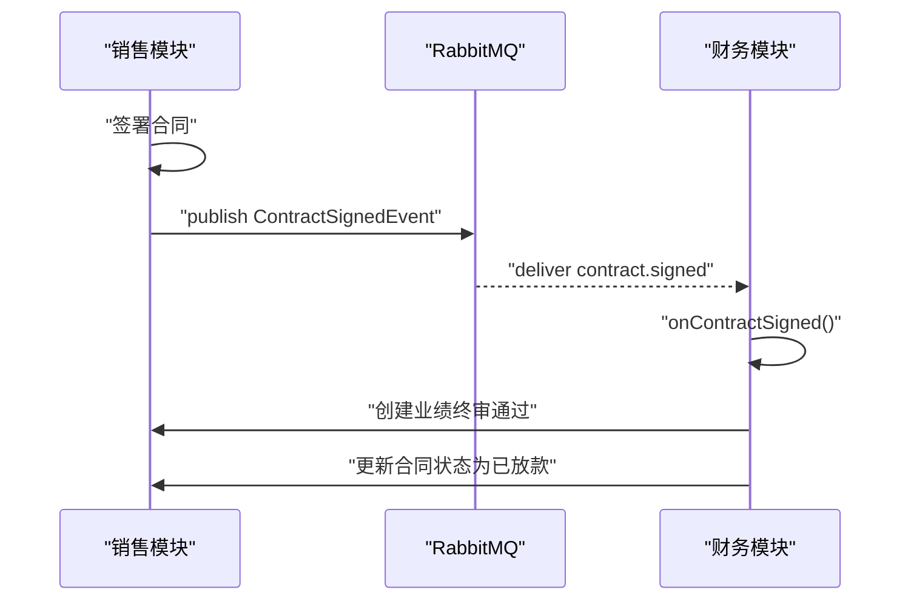

# 事件驱动处理

<cite>
**本文引用的文件**
- [MqConfig.java](file://common/src/main/java/com/dafuweng/common/mq/MqConfig.java)
- [ContractSignedEvent.java](file://common/src/main/java/com/dafuweng/common/mq/event/ContractSignedEvent.java)
- [LoanApprovedEvent.java](file://common/src/main/java/com/dafuweng/common/mq/event/LoanApprovedEvent.java)
- [ContractSignedListener.java](file://finance/src/main/java/com/dafuweng/finance/mq/ContractSignedListener.java)
- [LoanAuditService.java](file://finance/src/main/java/com/dafuweng/finance/service/LoanAuditService.java)
- [LoanAuditServiceImpl.java](file://finance/src/main/java/com/dafuweng/finance/service/impl/LoanAuditServiceImpl.java)
- [LoanAuditEntity.java](file://finance/src/main/java/com/dafuweng/finance/entity/LoanAuditEntity.java)
- [ContractSignService.java](file://sales/src/main/java/com/dafuweng/sales/service/ContractSignService.java)
- [ContractSignServiceImpl.java](file://sales/src/main/java/com/dafuweng/sales/service/impl/ContractSignServiceImpl.java)
- [application.yml](file://finance/src/main/resources/application.yml)
- [pom.xml](file://finance/pom.xml)
- [ContractSignedListenerTest.java](file://finance/src/test/java/com/dafuweng/finance/mq/ContractSignedListenerTest.java)
- [ContractSignServiceImplTest.java](file://sales/src/test/java/com/dafuweng/sales/service/impl/ContractSignServiceImplTest.java)
</cite>

## 目录
1. [简介](#简介)
2. [项目结构](#项目结构)
3. [核心组件](#核心组件)
4. [架构总览](#架构总览)
5. [详细组件分析](#详细组件分析)
6. [依赖分析](#依赖分析)
7. [性能考虑](#性能考虑)
8. [故障排查指南](#故障排查指南)
9. [结论](#结论)
10. [附录](#附录)

## 简介
本技术文档围绕财务模块的事件驱动处理机制展开，重点覆盖基于 RabbitMQ 的消息队列架构与异步处理流程。文档从消息发布订阅模式、异步处理、消息可靠性与重试策略、合同签署事件到贷款审批事件的完整链路，以及监控告警与容错机制进行系统化说明，并给出消息配置清单与最佳实践建议。

## 项目结构
本项目采用多模块架构，事件驱动能力由公共模块提供消息配置与事件模型，销售模块负责事件发布，财务模块负责事件消费与业务编排。

图表来源
- [MqConfig.java:14-48](file://common/src/main/java/com/dafuweng/common/mq/MqConfig.java#L14-L48)
- [ContractSignServiceImpl.java:49-53](file://sales/src/main/java/com/dafuweng/sales/service/impl/ContractSignServiceImpl.java#L49-L53)
- [ContractSignedListener.java:27-53](file://finance/src/main/java/com/dafuweng/finance/mq/ContractSignedListener.java#L27-L53)
- [LoanAuditService.java:18-62](file://finance/src/main/java/com/dafuweng/finance/service/LoanAuditService.java#L18-L62)
- [LoanAuditServiceImpl.java:203-242](file://finance/src/main/java/com/dafuweng/finance/service/impl/LoanAuditServiceImpl.java#L203-L242)

章节来源
- [MqConfig.java:14-48](file://common/src/main/java/com/dafuweng/common/mq/MqConfig.java#L14-L48)
- [ContractSignServiceImpl.java:26-54](file://sales/src/main/java/com/dafuweng/sales/service/impl/ContractSignServiceImpl.java#L26-L54)
- [ContractSignedListener.java:15-53](file://finance/src/main/java/com/dafuweng/finance/mq/ContractSignedListener.java#L15-L53)
- [LoanAuditServiceImpl.java:203-242](file://finance/src/main/java/com/dafuweng/finance/service/impl/LoanAuditServiceImpl.java#L203-L242)

## 核心组件
- 消息配置与绑定
  - 交换机：sales.exchange（直连类型）
  - 队列：
    - contract.signed.queue（合同签署事件）
    - loan.approved.queue（贷款审批事件）
  - 路由键：
    - contract.signed
    - loan.approved
  - 绑定关系：队列通过路由键绑定到交换机，实现按事件类型分发。

- 事件模型
  - ContractSignedEvent：合同签署后由销售模块发布，包含合同ID、客户ID、销售员ID、部门ID、合同金额、签署日期等关键字段。
  - LoanApprovedEvent：贷款审批完成后由销售模块发布，包含贷款审核ID、合同ID、客户ID、销售员ID、部门ID、大区ID、实际放款金额、佣金率、佣金金额、放款日期等。

- 事件消费者
  - ContractSignedListener：监听 contract.signed.queue，接收到合同签署事件后，自动创建贷款审核记录并记录轨迹，确保幂等处理。

- 业务编排
  - LoanAuditServiceImpl：负责贷款审核全流程的状态流转与业务动作，包括接收、初审、提交银行、银行反馈、终审通过（触发业绩创建）、终审拒绝等；在终审通过时调用销售模块创建业绩并更新合同状态为“已放款”。

章节来源
- [MqConfig.java:14-48](file://common/src/main/java/com/dafuweng/common/mq/MqConfig.java#L14-L48)
- [ContractSignedEvent.java:10-20](file://common/src/main/java/com/dafuweng/common/mq/event/ContractSignedEvent.java#L10-L20)
- [LoanApprovedEvent.java:10-24](file://common/src/main/java/com/dafuweng/common/mq/event/LoanApprovedEvent.java#L10-L24)
- [ContractSignedListener.java:27-53](file://finance/src/main/java/com/dafuweng/finance/mq/ContractSignedListener.java#L27-L53)
- [LoanAuditServiceImpl.java:111-258](file://finance/src/main/java/com/dafuweng/finance/service/impl/LoanAuditServiceImpl.java#L111-L258)

## 架构总览
事件驱动架构以 RabbitMQ 为核心，采用直连交换机与队列绑定的方式实现发布订阅模式。销售模块在合同签署完成后发布事件，财务模块异步消费事件并驱动贷款审核流程，最终联动销售模块完成业绩创建与合同状态更新。

图表来源
- [ContractSignServiceImpl.java:49-53](file://sales/src/main/java/com/dafuweng/sales/service/impl/ContractSignServiceImpl.java#L49-L53)
- [ContractSignedListener.java:27-53](file://finance/src/main/java/com/dafuweng/finance/mq/ContractSignedListener.java#L27-L53)
- [LoanAuditServiceImpl.java:203-242](file://finance/src/main/java/com/dafuweng/finance/service/impl/LoanAuditServiceImpl.java#L203-L242)

## 详细组件分析

### 消息配置与绑定
- 交换机：sales.exchange（直连类型），用于接收来自销售模块的事件消息。
- 队列：
  - contract.signed.queue：持久化队列，承载合同签署事件。
  - loan.approved.queue：持久化队列，承载贷款审批事件。
- 路由键：
  - contract.signed：用于合同签署事件的路由。
  - loan.approved：用于贷款审批事件的路由。
- 绑定关系：队列通过路由键绑定到交换机，实现按事件类型精准投递。

图表来源
- [MqConfig.java:21-48](file://common/src/main/java/com/dafuweng/common/mq/MqConfig.java#L21-L48)

章节来源
- [MqConfig.java:14-48](file://common/src/main/java/com/dafuweng/common/mq/MqConfig.java#L14-L48)

### 合同签署事件处理流程
- 销售模块职责
  - 在合同状态允许时更新为“已签署”，随后构造 ContractSignedEvent 并通过 RabbitTemplate 发布至 sales.exchange，路由键为 contract.signed。
- 财务模块职责
  - ContractSignedListener 监听 contract.signed.queue，接收到事件后：
    - 幂等检查：若已存在相同合同ID的贷款审核记录则直接返回。
    - 创建贷款审核记录：初始状态为“待接收”。
    - 记录轨迹：写入一条“receive”动作的审核轨迹，操作人标识为系统自动。

图表来源
- [ContractSignedListener.java:27-53](file://finance/src/main/java/com/dafuweng/finance/mq/ContractSignedListener.java#L27-L53)

章节来源
- [ContractSignServiceImpl.java:26-54](file://sales/src/main/java/com/dafuweng/sales/service/impl/ContractSignServiceImpl.java#L26-L54)
- [ContractSignedListener.java:27-53](file://finance/src/main/java/com/dafuweng/finance/mq/ContractSignedListener.java#L27-L53)

### 贷款审批事件处理机制
- 事件模型：LoanApprovedEvent 包含贷款审核ID、合同ID、客户ID、销售员ID、部门ID、大区ID、实际放款金额、佣金率、佣金金额、放款日期等。
- 财务模块在贷款审核流程中，当银行反馈通过后进入终审阶段，执行以下动作：
  - 记录终审意见与放款信息。
  - 调用销售模块的 OpenFeign 接口创建业绩记录，传入合同与产品相关信息以计算佣金。
  - 更新合同状态为“已放款”。

图表来源
- [LoanAuditServiceImpl.java:203-242](file://finance/src/main/java/com/dafuweng/finance/service/impl/LoanAuditServiceImpl.java#L203-L242)

章节来源
- [LoanApprovedEvent.java:10-24](file://common/src/main/java/com/dafuweng/common/mq/event/LoanApprovedEvent.java#L10-L24)
- [LoanAuditServiceImpl.java:183-242](file://finance/src/main/java/com/dafuweng/finance/service/impl/LoanAuditServiceImpl.java#L183-L242)

### 数据模型与状态流转
- 贷款审核实体 LoanAuditEntity 关键字段包括合同ID、审核状态、银行反馈时间、放款金额、实际利率、贷款发放日期等。
- 审核状态流转（示意）：
  - 待接收 → 接收 → 初审 → 提交银行 → 银行反馈（通过/拒绝） → 终审（通过/拒绝） → 结束。
- 财务模块在不同状态下执行相应业务动作，并记录审计轨迹。

图表来源
- [LoanAuditEntity.java:33-59](file://finance/src/main/java/com/dafuweng/finance/entity/LoanAuditEntity.java#L33-L59)
- [LoanAuditServiceImpl.java:111-258](file://finance/src/main/java/com/dafuweng/finance/service/impl/LoanAuditServiceImpl.java#L111-L258)

章节来源
- [LoanAuditEntity.java:14-63](file://finance/src/main/java/com/dafuweng/finance/entity/LoanAuditEntity.java#L14-L63)
- [LoanAuditService.java:18-62](file://finance/src/main/java/com/dafuweng/finance/service/LoanAuditService.java#L18-L62)
- [LoanAuditServiceImpl.java:111-258](file://finance/src/main/java/com/dafuweng/finance/service/impl/LoanAuditServiceImpl.java#L111-L258)

## 依赖分析
- 模块间依赖
  - 公共模块提供消息配置与事件模型，销售模块与财务模块均依赖公共模块。
  - 财务模块通过 RabbitMQ 接收事件，同时通过 OpenFeign 调用销售模块的服务。
- 技术栈
  - RabbitMQ：spring-boot-starter-amqp
  - OpenFeign：spring-cloud-starter-openfeign
  - MyBatis-Plus：数据访问层

图表来源
- [pom.xml:127-131](file://finance/pom.xml#L127-L131)

章节来源
- [pom.xml:117-131](file://finance/pom.xml#L117-L131)

## 性能考虑
- 异步解耦：事件驱动将合同签署与贷款审核、业绩创建等流程解耦，避免同步阻塞，提升整体吞吐。
- 幂等设计：消费者侧对同一合同ID进行幂等检查，防止重复处理导致的数据异常。
- 持久化队列：队列与交换机持久化，结合 RabbitMQ 的持久化存储，降低消息丢失风险。
- 分批处理：建议在高并发场景下对事件进行批量处理或引入限流策略，避免瞬时峰值冲击数据库。
- 监控与告警：建议接入消息中间件的监控指标，如未消费堆积、死信队列触发、消费者失败率等。

## 故障排查指南
- 常见问题与定位
  - 事件未被消费：检查队列绑定关系与路由键是否正确，确认消费者是否正常启动。
  - 幂等未生效：确认消费者幂等逻辑是否覆盖所有关键字段，避免重复创建审核记录。
  - 业绩创建失败：检查销售模块的 OpenFeign 接口返回码与参数完整性，关注佣金率与金额计算逻辑。
  - 合同状态未更新：确认终审通过后的状态更新调用是否执行成功。
- 单元测试参考
  - 合同签署事件发布测试：验证状态变更、事件发布与参数完整性。
  - 合同签署事件监听测试：验证幂等性、审核记录创建与轨迹记录。

章节来源
- [ContractSignServiceImplTest.java:32-80](file://sales/src/test/java/com/dafuweng/sales/service/impl/ContractSignServiceImplTest.java#L32-L80)
- [ContractSignedListenerTest.java:31-74](file://finance/src/test/java/com/dafuweng/finance/mq/ContractSignedListenerTest.java#L31-L74)

## 结论
本事件驱动架构通过 RabbitMQ 实现销售与财务模块间的松耦合协作，借助直连交换机与队列绑定实现事件的可靠投递与异步处理。合同签署事件触发贷款审核流程，贷款审批事件联动业绩创建与合同状态更新，形成完整的财务流程自动化闭环。建议在生产环境中完善监控告警、失败重试与死信队列策略，持续优化性能与稳定性。

## 附录

### 消息配置清单
- 交换机
  - 名称：sales.exchange
  - 类型：直连交换机
- 队列
  - contract.signed.queue：合同签署事件队列（持久化）
  - loan.approved.queue：贷款审批事件队列（持久化）
- 路由键
  - contract.signed
  - loan.approved
- 绑定关系
  - contract.signed.queue 绑定到 sales.exchange，路由键为 contract.signed
  - loan.approved.queue 绑定到 sales.exchange，路由键为 loan.approved

章节来源
- [MqConfig.java:14-48](file://common/src/main/java/com/dafuweng/common/mq/MqConfig.java#L14-L48)

### 事件模型字段说明
- ContractSignedEvent
  - 合同ID、客户ID、销售员ID、部门ID、合同金额、签署日期
- LoanApprovedEvent
  - 贷款审核ID、合同ID、客户ID、销售员ID、部门ID、大区ID、实际放款金额、佣金率、佣金金额、放款日期

章节来源
- [ContractSignedEvent.java:10-20](file://common/src/main/java/com/dafuweng/common/mq/event/ContractSignedEvent.java#L10-L20)
- [LoanApprovedEvent.java:10-24](file://common/src/main/java/com/dafuweng/common/mq/event/LoanApprovedEvent.java#L10-L24)

### 事件发布与消费流程图

图表来源
- [ContractSignServiceImpl.java:49-53](file://sales/src/main/java/com/dafuweng/sales/service/impl/ContractSignServiceImpl.java#L49-L53)
- [ContractSignedListener.java:27-53](file://finance/src/main/java/com/dafuweng/finance/mq/ContractSignedListener.java#L27-L53)
- [LoanAuditServiceImpl.java:203-242](file://finance/src/main/java/com/dafuweng/finance/service/impl/LoanAuditServiceImpl.java#L203-L242)