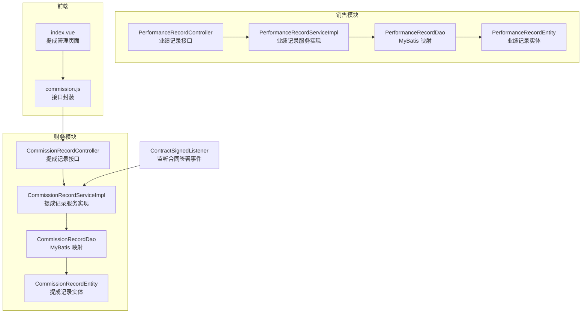
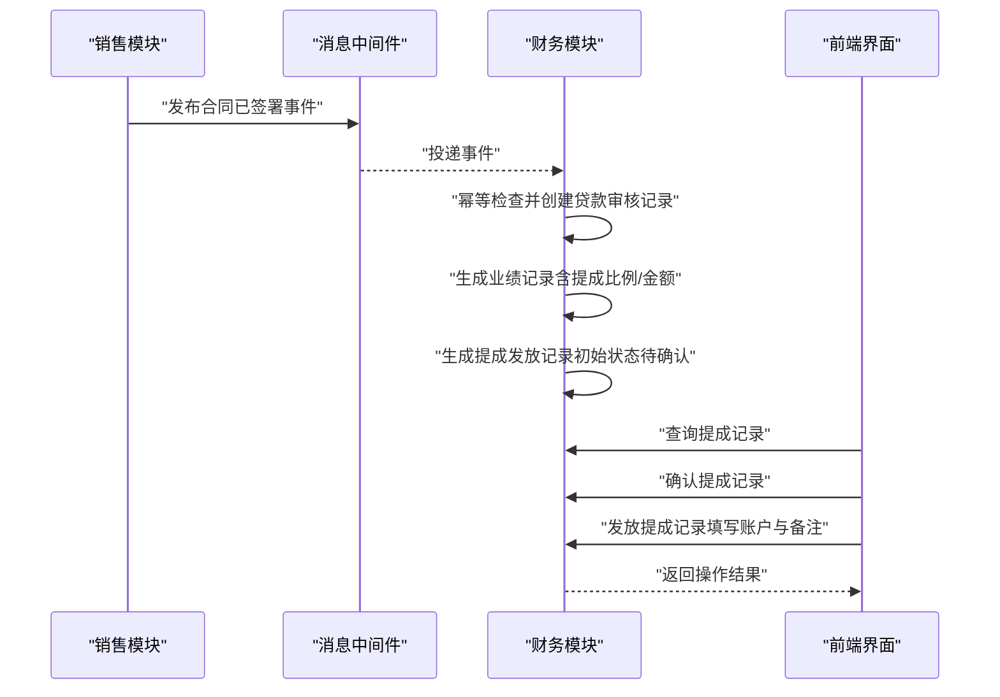
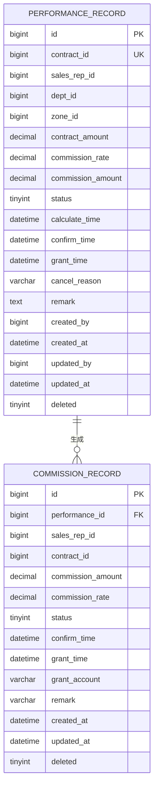
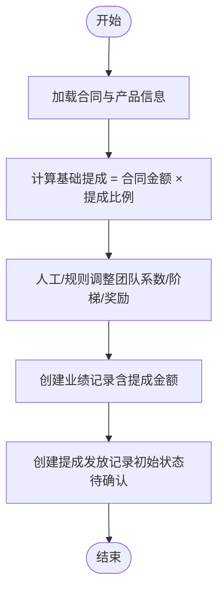
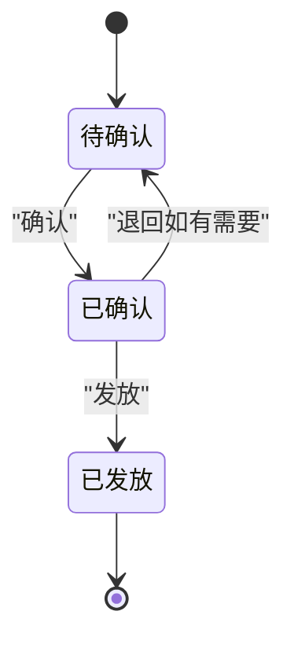
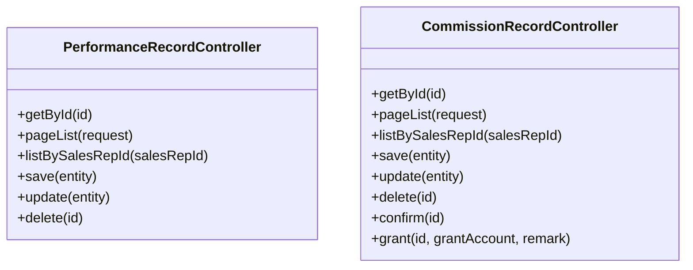
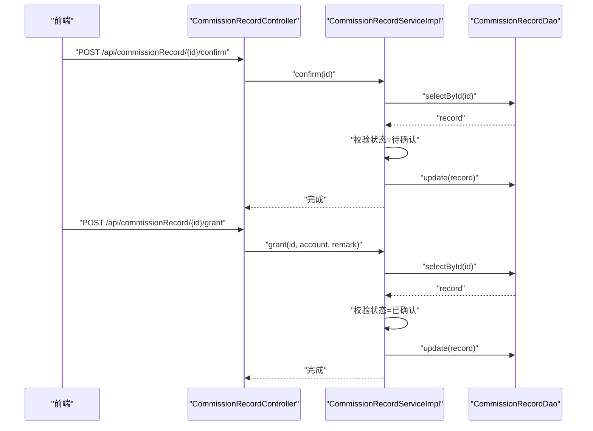
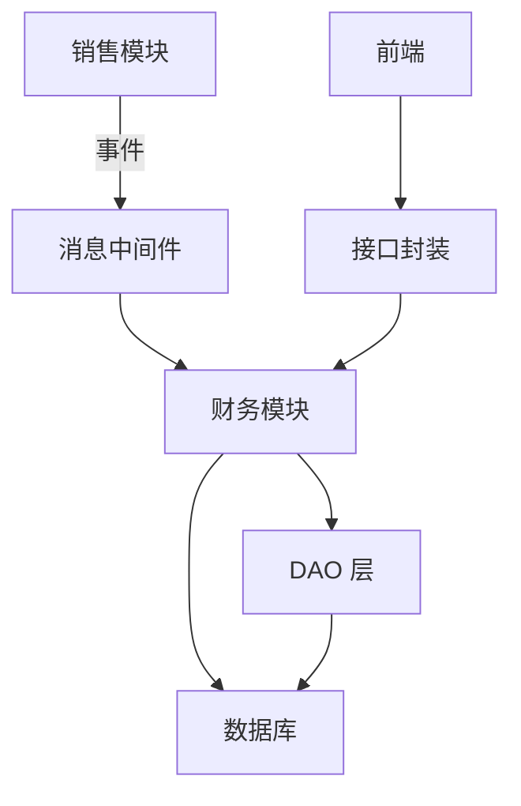

# 提成管理

<cite>
**本文引用的文件**
- [PerformanceRecordEntity.java](file://sales/src/main/java/com/dafuweng/sales/entity/PerformanceRecordEntity.java)
- [CommissionRecordEntity.java](file://finance/src/main/java/com/dafuweng/finance/entity/CommissionRecordEntity.java)
- [PerformanceRecordController.java](file://sales/src/main/java/com/dafuweng/sales/controller/PerformanceRecordController.java)
- [CommissionRecordController.java](file://finance/src/main/java/com/dafuweng/finance/controller/CommissionRecordController.java)
- [PerformanceRecordService.java](file://sales/src/main/java/com/dafuweng/sales/service/PerformanceRecordService.java)
- [CommissionRecordService.java](file://finance/src/main/java/com/dafuweng/finance/service/CommissionRecordService.java)
- [PerformanceRecordServiceImpl.java](file://sales/src/main/java/com/dafuweng/sales/service/impl/PerformanceRecordServiceImpl.java)
- [CommissionRecordServiceImpl.java](file://finance/src/main/java/com/dafuweng/finance/service/impl/CommissionRecordServiceImpl.java)
- [PerformanceRecordDao.java](file://sales/src/main/java/com/dafuweng/sales/dao/PerformanceRecordDao.java)
- [CommissionRecordDao.java](file://finance/src/main/java/com/dafuweng/finance/dao/CommissionRecordDao.java)
- [database.sql](file://database.sql)
- [index.vue](file://ruoyi-ui/src/views/finance/commission/index.vue)
- [commission.js](file://ruoyi-ui/src/api/finance/commission.js)
- [ContractSignedListener.java](file://finance/src/main/java/com/dafuweng/finance/mq/ContractSignedListener.java)
- [LoanAuditServiceImpl.java](file://finance/src/main/java/com/dafuweng/finance/service/impl/LoanAuditServiceImpl.java)
- [InternalSalesController.java](file://sales/src/main/java/com/dafuweng/sales/controller/InternalSalesController.java)
</cite>

## 目录
1. [简介](#简介)
2. [项目结构](#项目结构)
3. [核心组件](#核心组件)
4. [架构总览](#架构总览)
5. [详细组件分析](#详细组件分析)
6. [依赖分析](#依赖分析)
7. [性能考虑](#性能考虑)
8. [故障排查指南](#故障排查指南)
9. [结论](#结论)
10. [附录](#附录)

## 简介
本文件面向“提成管理”功能，系统化梳理从销售侧业绩到财务侧提成发放的完整业务闭环。内容涵盖：
- 提成规则配置与计算公式设定
- 发放周期与状态流转管理
- 税务处理与员工结算流程
- 提成记录实体的数据结构与字段定义
- 多种提成计算方式（个人业绩、团队业绩、阶梯式、特殊奖励）的实现思路与扩展点
- 与销售模块业绩数据的集成与数据同步机制
- 报表统计与导出能力的现状与建议

## 项目结构
提成管理涉及三个子系统协同：
- 销售模块（sales）：负责合同签署后的业绩记录生成与维护
- 财务模块（finance）：负责提成发放记录的确认与发放
- 前端界面（ruoyi-ui）：提供提成记录的查询、确认与发放操作

图表来源
- [PerformanceRecordController.java:1-51](file://sales/src/main/java/com/dafuweng/sales/controller/PerformanceRecordController.java#L1-L51)
- [CommissionRecordController.java:1-64](file://finance/src/main/java/com/dafuweng/finance/controller/CommissionRecordController.java#L1-L64)
- [PerformanceRecordServiceImpl.java:1-81](file://sales/src/main/java/com/dafuweng/sales/service/impl/PerformanceRecordServiceImpl.java#L1-L81)
- [CommissionRecordServiceImpl.java:1-105](file://finance/src/main/java/com/dafuweng/finance/service/impl/CommissionRecordServiceImpl.java#L1-L105)
- [PerformanceRecordDao.java:1-16](file://sales/src/main/java/com/dafuweng/sales/dao/PerformanceRecordDao.java#L1-L16)
- [CommissionRecordDao.java:1-15](file://finance/src/main/java/com/dafuweng/finance/dao/CommissionRecordDao.java#L1-L15)
- [index.vue:1-150](file://ruoyi-ui/src/views/finance/commission/index.vue#L1-L150)
- [commission.js:1-62](file://ruoyi-ui/src/api/finance/commission.js#L1-L62)
- [ContractSignedListener.java:1-55](file://finance/src/main/java/com/dafuweng/finance/mq/ContractSignedListener.java#L1-L55)

章节来源
- [PerformanceRecordController.java:1-51](file://sales/src/main/java/com/dafuweng/sales/controller/PerformanceRecordController.java#L1-L51)
- [CommissionRecordController.java:1-64](file://finance/src/main/java/com/dafuweng/finance/controller/CommissionRecordController.java#L1-L64)
- [index.vue:1-150](file://ruoyi-ui/src/views/finance/commission/index.vue#L1-L150)

## 核心组件
- 业绩记录（performance_record）：由销售模块在合同签署后生成，承载合同金额、提成比例、提成金额、状态及时间戳等关键字段
- 提成发放记录（commission_record）：由财务模块基于业绩记录生成，承载提成金额、比例、状态、确认/发放时间与账户等字段
- 控制器层：分别提供业绩记录与提成记录的增删改查与状态变更接口
- 服务层：封装业务逻辑，如提成确认与发放的状态校验、幂等保护
- 数据访问层：MyBatis 映射，提供分页、按销售代表筛选、按合同幂等查询等能力
- 前端界面：提供提成记录的查询、筛选、确认与发放操作

章节来源
- [PerformanceRecordEntity.java:1-58](file://sales/src/main/java/com/dafuweng/sales/entity/PerformanceRecordEntity.java#L1-L58)
- [CommissionRecordEntity.java:1-48](file://finance/src/main/java/com/dafuweng/finance/entity/CommissionRecordEntity.java#L1-L48)
- [PerformanceRecordService.java:1-35](file://sales/src/main/java/com/dafuweng/sales/service/PerformanceRecordService.java#L1-L35)
- [CommissionRecordService.java:1-41](file://finance/src/main/java/com/dafuweng/finance/service/CommissionRecordService.java#L1-L41)

## 架构总览
提成管理采用“事件驱动 + 分层架构”的设计：
- 事件触发：销售模块在合同签署后发布事件，财务模块监听并创建贷款审核任务（间接推动提成流程）
- 业绩生成：财务模块根据合同与产品信息生成业绩记录
- 提成发放：财务模块生成提成发放记录，支持“确认—发放”两阶段状态流转
- 前端交互：用户在前端页面完成查询、筛选、确认与发放操作

图表来源
- [ContractSignedListener.java:27-53](file://finance/src/main/java/com/dafuweng/finance/mq/ContractSignedListener.java#L27-L53)
- [LoanAuditServiceImpl.java:210-233](file://finance/src/main/java/com/dafuweng/finance/service/impl/LoanAuditServiceImpl.java#L210-L233)
- [CommissionRecordController.java:52-62](file://finance/src/main/java/com/dafuweng/finance/controller/CommissionRecordController.java#L52-L62)
- [index.vue:120-146](file://ruoyi-ui/src/views/finance/commission/index.vue#L120-L146)

## 详细组件分析

### 实体模型与数据结构
- 业绩记录（performance_record）
  - 关键字段：合同ID、销售代表ID、部门ID、战区ID、合同金额、提成比例、提成金额、状态、计算/确认/发放时间、备注、创建/更新时间等
  - 约束：合同ID唯一、多字段索引优化查询
- 提成发放记录（commission_record）
  - 关键字段：业绩记录ID、销售代表ID、合同ID、提成金额、提成比例、状态、确认/发放时间、发放账户、备注、创建/更新时间等
  - 约束：多字段索引优化查询

图表来源
- [database.sql:423-450](file://database.sql#L423-L450)
- [database.sql:597-618](file://database.sql#L597-L618)

章节来源
- [PerformanceRecordEntity.java:14-57](file://sales/src/main/java/com/dafuweng/sales/entity/PerformanceRecordEntity.java#L14-L57)
- [CommissionRecordEntity.java:14-47](file://finance/src/main/java/com/dafuweng/finance/entity/CommissionRecordEntity.java#L14-L47)
- [database.sql:423-450](file://database.sql#L423-L450)
- [database.sql:597-618](file://database.sql#L597-L618)

### 提成计算逻辑与规则配置
- 计算基础
  - 个人业绩提成：以合同金额 × 提成比例
  - 团队业绩提成：可在服务层扩展，基于部门/战区维度汇总后再乘以团队系数
  - 阶梯式提成：可在服务层扩展，按区间累进计算
  - 特殊奖励：可在服务层扩展，额外加项或扣减
- 规则配置
  - 产品维度：金融产品表包含渠道佣金比例，作为提成比例的参考来源
  - 人工干预：财务模块可调整提成比例与金额，形成最终业绩记录
- 计算流程
  - 合同签署后，财务模块根据合同与产品信息生成业绩记录
  - 生成提成发放记录，初始状态为“待确认”

图表来源
- [LoanAuditServiceImpl.java:210-233](file://finance/src/main/java/com/dafuweng/finance/service/impl/LoanAuditServiceImpl.java#L210-L233)
- [database.sql:495-524](file://database.sql#L495-L524)

章节来源
- [LoanAuditServiceImpl.java:210-233](file://finance/src/main/java/com/dafuweng/finance/service/impl/LoanAuditServiceImpl.java#L210-L233)
- [database.sql:495-524](file://database.sql#L495-L524)

### 状态流转与业务流程
- 状态定义
  - 业绩记录：计算中、已确认、已发放、已取消
  - 提成发放记录：待确认、已确认、已发放
- 流程步骤
  1) 业绩统计：销售模块生成业绩记录
  2) 提成计算：财务模块生成提成发放记录
  3) 审核确认：财务人员在前端确认提成记录
  4) 发放执行：财务人员在前端进行发放，填写账户与备注
  5) 财务入账：发放完成后，财务模块可据此进行入账处理

图表来源
- [CommissionRecordServiceImpl.java:75-103](file://finance/src/main/java/com/dafuweng/finance/service/impl/CommissionRecordServiceImpl.java#L75-L103)
- [index.vue:120-146](file://ruoyi-ui/src/views/finance/commission/index.vue#L120-L146)

章节来源
- [CommissionRecordServiceImpl.java:75-103](file://finance/src/main/java/com/dafuweng/finance/service/impl/CommissionRecordServiceImpl.java#L75-L103)
- [index.vue:120-146](file://ruoyi-ui/src/views/finance/commission/index.vue#L120-L146)

### 接口与控制器
- 业绩记录接口
  - 支持按ID查询、分页查询、按销售代表查询、新增、修改、删除
- 提成发放记录接口
  - 支持按ID查询、分页查询、按销售代表查询、新增、修改、删除、确认、发放

图表来源
- [PerformanceRecordController.java:14-50](file://sales/src/main/java/com/dafuweng/sales/controller/PerformanceRecordController.java#L14-L50)
- [CommissionRecordController.java:15-63](file://finance/src/main/java/com/dafuweng/finance/controller/CommissionRecordController.java#L15-L63)

章节来源
- [PerformanceRecordController.java:14-50](file://sales/src/main/java/com/dafuweng/sales/controller/PerformanceRecordController.java#L14-L50)
- [CommissionRecordController.java:15-63](file://finance/src/main/java/com/dafuweng/finance/controller/CommissionRecordController.java#L15-L63)

### 服务层与状态校验
- 提成确认
  - 仅允许从“待确认”状态进入“已确认”，并记录确认时间
- 提成发放
  - 仅允许从“已确认”状态进入“已发放”，并记录发放时间、账户与备注
- 幂等保护
  - 销售模块通过合同ID唯一约束避免重复创建业绩记录
  - 财务模块通过查询业绩记录ID避免重复创建提成发放记录

图表来源
- [CommissionRecordController.java:52-62](file://finance/src/main/java/com/dafuweng/finance/controller/CommissionRecordController.java#L52-L62)
- [CommissionRecordServiceImpl.java:75-103](file://finance/src/main/java/com/dafuweng/finance/service/impl/CommissionRecordServiceImpl.java#L75-L103)

章节来源
- [CommissionRecordServiceImpl.java:75-103](file://finance/src/main/java/com/dafuweng/finance/service/impl/CommissionRecordServiceImpl.java#L75-L103)

### 数据访问层与查询能力
- 业绩记录
  - 支持按合同ID唯一查询、按销售代表ID列表查询、分页查询
- 提成发放记录
  - 支持按销售代表ID列表查询、分页查询

章节来源
- [PerformanceRecordDao.java:10-15](file://sales/src/main/java/com/dafuweng/sales/dao/PerformanceRecordDao.java#L10-L15)
- [CommissionRecordDao.java:11-14](file://finance/src/main/java/com/dafuweng/finance/dao/CommissionRecordDao.java#L11-L14)

### 前端界面与交互
- 功能点
  - 筛选状态（待确认、已确认、已发放）
  - 列表展示（ID、销售代表ID、合同ID、提成金额、状态、创建时间）
  - 操作按钮（确认、发放）
  - 发放弹窗（输入发放账户与备注）
- 接口对接
  - 使用统一的接口封装，调用后端分页查询、确认与发放接口

章节来源
- [index.vue:1-150](file://ruoyi-ui/src/views/finance/commission/index.vue#L1-L150)
- [commission.js:1-62](file://ruoyi-ui/src/api/finance/commission.js#L1-L62)

### 与销售模块的集成与数据同步
- 事件驱动
  - 销售模块发布“合同已签署”事件，财务模块监听并创建贷款审核任务
  - 财务模块在创建贷款审核时，同时生成业绩记录与提成发放记录
- 幂等保护
  - 财务模块在监听事件时，先查询是否已存在对应合同的审核记录，避免重复创建
- 内部接口
  - 财务模块可通过内部接口让销售模块创建业绩记录，确保幂等性（按合同ID唯一）

章节来源
- [ContractSignedListener.java:27-53](file://finance/src/main/java/com/dafuweng/finance/mq/ContractSignedListener.java#L27-L53)
- [LoanAuditServiceImpl.java:210-233](file://finance/src/main/java/com/dafuweng/finance/service/impl/LoanAuditServiceImpl.java#L210-L233)
- [InternalSalesController.java:30-36](file://sales/src/main/java/com/dafuweng/sales/controller/InternalSalesController.java#L30-L36)

## 依赖分析
- 组件耦合
  - 财务模块对销售模块的依赖通过事件与内部接口实现，降低直接耦合
  - 服务层对DAO层的依赖清晰，职责单一
- 外部依赖
  - 消息中间件用于事件传递
  - MyBatis 用于数据库访问映射
- 约束与索引
  - 业绩记录与提成发放记录均设置合同ID唯一索引，保证幂等性
  - 多字段索引提升查询效率

图表来源
- [ContractSignedListener.java:27-53](file://finance/src/main/java/com/dafuweng/finance/mq/ContractSignedListener.java#L27-L53)
- [CommissionRecordDao.java:11-14](file://finance/src/main/java/com/dafuweng/finance/dao/CommissionRecordDao.java#L11-L14)
- [PerformanceRecordDao.java:10-15](file://sales/src/main/java/com/dafuweng/sales/dao/PerformanceRecordDao.java#L10-L15)

章节来源
- [database.sql:423-450](file://database.sql#L423-L450)
- [database.sql:597-618](file://database.sql#L597-L618)

## 性能考虑
- 查询优化
  - 为合同ID、销售代表ID、状态、部门ID、战区ID建立索引，满足高频查询场景
- 分页与排序
  - 服务层提供分页查询与排序能力，避免一次性加载大量数据
- 事务与幂等
  - 服务层使用事务保障一致性；通过唯一约束与幂等检查避免重复处理
- 异步处理
  - 事件驱动模式减少同步阻塞，提高整体吞吐

## 故障排查指南
- 提成确认失败
  - 现象：提示“当前状态不允许确认”
  - 排查：确认提成记录状态是否为“待确认”
- 提成发放失败
  - 现象：提示“当前状态不允许发放”
  - 排查：确认提成记录状态是否为“已确认”
- 记录不存在
  - 现象：提示“提成记录不存在”
  - 排查：确认传入ID是否正确，或是否存在逻辑删除
- 前端操作异常
  - 现象：确认/发放按钮不可用或无响应
  - 排查：检查网络请求与接口返回状态码，确认当前状态是否符合操作条件

章节来源
- [CommissionRecordServiceImpl.java:75-103](file://finance/src/main/java/com/dafuweng/finance/service/impl/CommissionRecordServiceImpl.java#L75-L103)
- [index.vue:120-146](file://ruoyi-ui/src/views/finance/commission/index.vue#L120-L146)

## 结论
提成管理功能在当前版本中实现了：
- 从合同签署到提成发放的完整链路
- 两阶段状态流转（确认与发放）
- 前端可视化操作与状态展示
- 事件驱动与幂等保护机制
建议后续完善：
- 发放阶段的具体转账与入账流程实现
- 报表统计与导出能力（按销售代表、部门、战区、时间段等维度）
- 更丰富的提成计算规则（团队业绩、阶梯式、特殊奖励）扩展点

## 附录

### 字段定义与含义（摘要）
- 业绩记录（performance_record）
  - 合同ID：关联合同
  - 销售代表ID：归属销售
  - 部门ID/战区ID：组织维度
  - 合同金额：计算基数
  - 提成比例：计算因子
  - 提成金额：计算结果
  - 状态：计算中/已确认/已发放/已取消
  - 时间戳：计算/确认/发放/取消时间
- 提成发放记录（commission_record）
  - 业绩记录ID：关联业绩
  - 销售代表ID/合同ID：关联维度
  - 提成金额/比例：发放依据
  - 状态：待确认/已确认/已发放
  - 时间戳：确认/发放时间
  - 发放账户与备注：发放凭证

章节来源
- [PerformanceRecordEntity.java:14-57](file://sales/src/main/java/com/dafuweng/sales/entity/PerformanceRecordEntity.java#L14-L57)
- [CommissionRecordEntity.java:14-47](file://finance/src/main/java/com/dafuweng/finance/entity/CommissionRecordEntity.java#L14-L47)
- [database.sql:423-450](file://database.sql#L423-L450)
- [database.sql:597-618](file://database.sql#L597-L618)