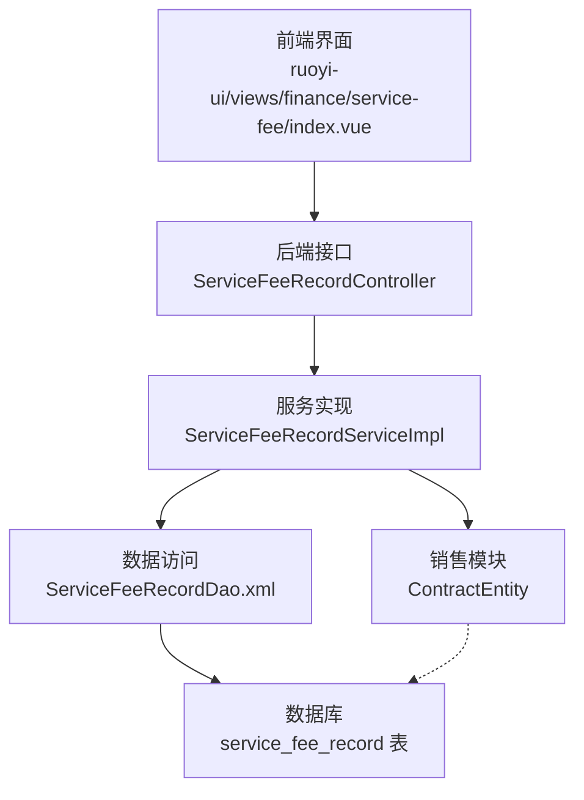
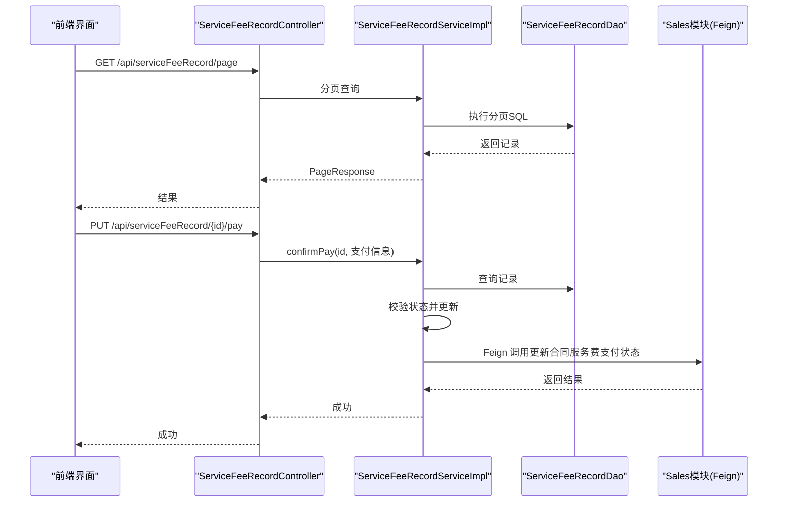
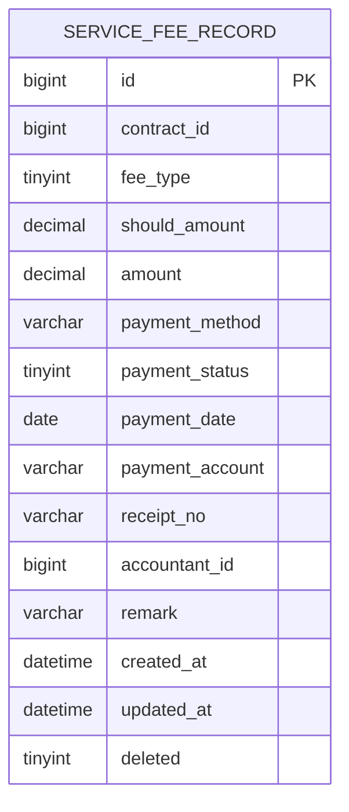
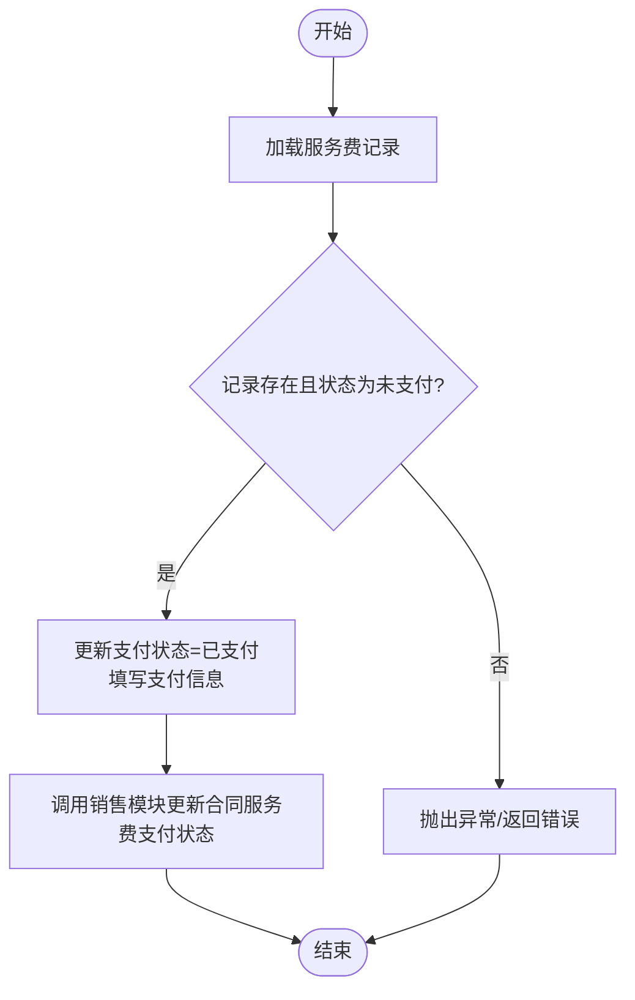
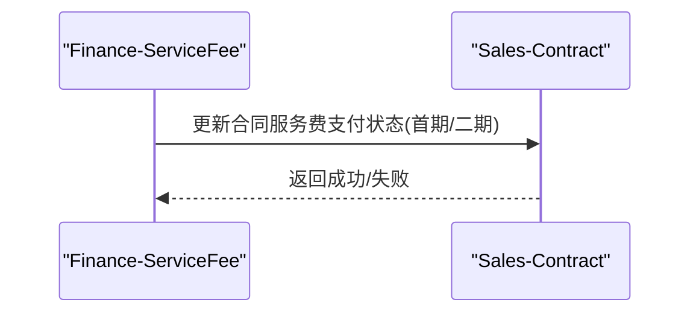
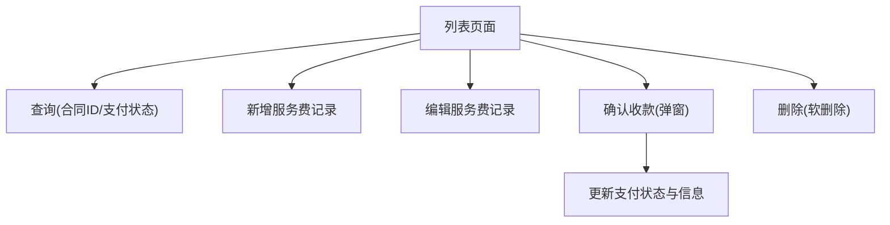
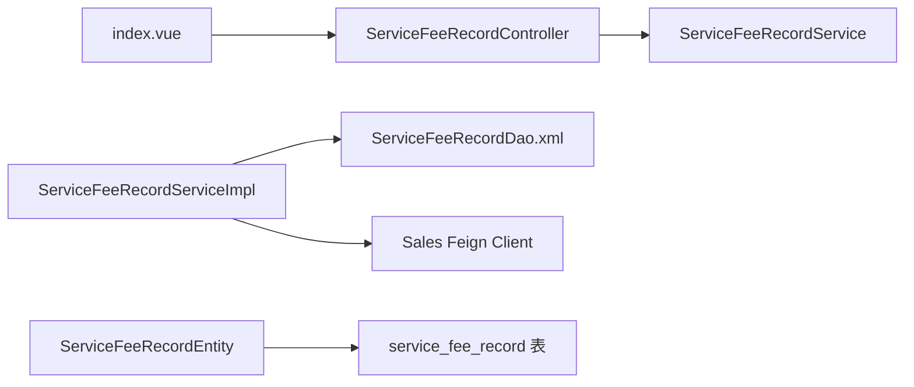

# 服务费管理

<cite>
**本文引用的文件**
- [ServiceFeeRecordEntity.java](file://finance/src/main/java/com/dafuweng/finance/entity/ServiceFeeRecordEntity.java)
- [ServiceFeeRecordController.java](file://finance/src/main/java/com/dafuweng/finance/controller/ServiceFeeRecordController.java)
- [ServiceFeeRecordService.java](file://finance/src/main/java/com/dafuweng/finance/service/ServiceFeeRecordService.java)
- [ServiceFeeRecordServiceImpl.java](file://finance/src/main/java/com/dafuweng/finance/service/impl/ServiceFeeRecordServiceImpl.java)
- [ServiceFeeRecordDao.xml](file://finance/src/main/resources/finance/mapper/ServiceFeeRecordDao.xml)
- [index.vue](file://ruoyi-ui/src/views/finance/service-fee/index.vue)
- [ContractEntity.java](file://sales/src/main/java/com/dafuweng/sales/entity/ContractEntity.java)
- [database.sql](file://database.sql)
</cite>

## 目录
1. [简介](#简介)
2. [项目结构](#项目结构)
3. [核心组件](#核心组件)
4. [架构总览](#架构总览)
5. [详细组件分析](#详细组件分析)
6. [依赖关系分析](#依赖关系分析)
7. [性能考虑](#性能考虑)
8. [故障排除指南](#故障排除指南)
9. [结论](#结论)
10. [附录](#附录)

## 简介
本文件面向“服务费管理”功能，系统性阐述服务费的业务规则、数据模型、计算逻辑、业务流程以及与贷款审核、合同管理等模块的集成关系。重点覆盖以下方面：
- 服务费记录实体的数据结构与字段语义
- 收费项目设置与费用计算规则（含按贷款金额比例、固定费用、阶梯收费等思路）
- 发票与收款入账流程
- 收费确认、发票开具、收款入账、财务记账的完整闭环
- 与销售合同、贷款审核模块的数据交互
- 税务处理与报表生成的扩展建议

## 项目结构
服务费管理功能主要分布在 finance 模块（后端）、sales 模块（合同数据）与 ruoyi-ui 前端界面中，采用微服务分库架构，finance 库包含服务费记录表。

图表来源
- [index.vue:1-204](file://ruoyi-ui/src/views/finance/service-fee/index.vue#L1-L204)
- [ServiceFeeRecordController.java:1-64](file://finance/src/main/java/com/dafuweng/finance/controller/ServiceFeeRecordController.java#L1-L64)
- [ServiceFeeRecordServiceImpl.java:1-107](file://finance/src/main/java/com/dafuweng/finance/service/impl/ServiceFeeRecordServiceImpl.java#L1-L107)
- [ServiceFeeRecordDao.xml:1-32](file://finance/src/main/resources/finance/mapper/ServiceFeeRecordDao.xml#L1-L32)
- [ContractEntity.java:1-91](file://sales/src/main/java/com/dafuweng/sales/entity/ContractEntity.java#L1-L91)
- [database.sql:573-595](file://database.sql#L573-L595)

章节来源
- [index.vue:1-204](file://ruoyi-ui/src/views/finance/service-fee/index.vue#L1-L204)
- [ServiceFeeRecordController.java:1-64](file://finance/src/main/java/com/dafuweng/finance/controller/ServiceFeeRecordController.java#L1-L64)
- [ServiceFeeRecordServiceImpl.java:1-107](file://finance/src/main/java/com/dafuweng/finance/service/impl/ServiceFeeRecordServiceImpl.java#L1-L107)
- [ServiceFeeRecordDao.xml:1-32](file://finance/src/main/resources/finance/mapper/ServiceFeeRecordDao.xml#L1-L32)
- [ContractEntity.java:1-91](file://sales/src/main/java/com/dafuweng/sales/entity/ContractEntity.java#L1-L91)
- [database.sql:573-595](file://database.sql#L573-L595)

## 核心组件
- 控制器层：提供服务费记录的增删改查与收款确认接口
- 服务层：封装业务逻辑，包括分页查询、按合同查询、保存/更新/删除、收款确认
- 数据访问层：MyBatis 映射 XML，提供按合同 ID 查询与结果映射
- 实体层：服务费记录实体，承载费用类型、金额、支付状态等字段
- 前端界面：提供查询、新增、编辑、收款确认、删除等操作

章节来源
- [ServiceFeeRecordController.java:1-64](file://finance/src/main/java/com/dafuweng/finance/controller/ServiceFeeRecordController.java#L1-L64)
- [ServiceFeeRecordService.java:1-37](file://finance/src/main/java/com/dafuweng/finance/service/ServiceFeeRecordService.java#L1-L37)
- [ServiceFeeRecordServiceImpl.java:1-107](file://finance/src/main/java/com/dafuweng/finance/service/impl/ServiceFeeRecordServiceImpl.java#L1-L107)
- [ServiceFeeRecordDao.xml:1-32](file://finance/src/main/resources/finance/mapper/ServiceFeeRecordDao.xml#L1-L32)
- [ServiceFeeRecordEntity.java:1-50](file://finance/src/main/java/com/dafuweng/finance/entity/ServiceFeeRecordEntity.java#L1-L50)

## 架构总览
服务费管理采用典型的三层架构：前端通过控制器暴露 REST 接口，服务层编排业务，DAO 层访问数据库。收款确认流程会调用销售模块以同步合同服务费支付状态。

图表来源
- [ServiceFeeRecordController.java:52-62](file://finance/src/main/java/com/dafuweng/finance/controller/ServiceFeeRecordController.java#L52-L62)
- [ServiceFeeRecordServiceImpl.java:82-105](file://finance/src/main/java/com/dafuweng/finance/service/impl/ServiceFeeRecordServiceImpl.java#L82-L105)
- [ServiceFeeRecordDao.xml:23-29](file://finance/src/main/resources/finance/mapper/ServiceFeeRecordDao.xml#L23-L29)
- [ContractEntity.java:47-57](file://sales/src/main/java/com/dafuweng/sales/entity/ContractEntity.java#L47-L57)

## 详细组件分析

### 服务费记录实体与数据模型
服务费记录用于追踪每笔服务费的应收、实收、支付方式、支付状态、支付日期、收据号、会计人员、备注等信息。字段定义如下：

- 主键与关联：id、contractId
- 费用类型：feeType（1-首期服务费；2-二期服务费）
- 金额：shouldAmount（应收金额）、amount（实收金额）
- 支付：paymentMethod（支付方式）、paymentStatus（0-未付；1-已付；2-部分付）、paymentDate、paymentAccount、receiptNo
- 入账与审计：accountantId、remark
- 时间戳与逻辑删除：createdAt、updatedAt、deleted

图表来源
- [database.sql:573-595](file://database.sql#L573-L595)

章节来源
- [ServiceFeeRecordEntity.java:18-48](file://finance/src/main/java/com/dafuweng/finance/entity/ServiceFeeRecordEntity.java#L18-L48)
- [database.sql:573-595](file://database.sql#L573-L595)

### 收费项目设置与费用计算规则
当前系统通过系统参数提供基础配置项，支持按贷款金额比例收费：
- 首期服务费比例：contract.service_fee_first_rate（例如 30%）
- 二期服务费比例：可在业务规则中扩展（如 10%）

计算逻辑（基于现有参数）：
- 首期服务费 = 贷款金额 × 首期服务费比例
- 二期服务费 = 贷款金额 × 二期服务费比例

说明：
- 固定费用与阶梯收费可通过扩展字段或业务规则在后续版本实现
- 当前前端界面支持输入应收金额，服务费记录实体亦保留应收费用字段，便于灵活配置

章节来源
- [database.sql:194-194](file://database.sql#L194-L194)
- [ContractEntity.java:39-45](file://sales/src/main/java/com/dafuweng/sales/entity/ContractEntity.java#L39-L45)
- [index.vue:64-75](file://ruoyi-ui/src/views/finance/service-fee/index.vue#L64-L75)

### 收款确认与合同状态同步
收款确认流程的关键步骤：
- 校验记录是否存在且支付状态为未支付
- 更新支付状态为已支付、填写支付日期、支付方式、支付账户、收据号与备注
- 通过 Feign 调用销售模块，更新合同对应服务费类型的支付状态与支付日期

图表来源
- [ServiceFeeRecordServiceImpl.java:84-105](file://finance/src/main/java/com/dafuweng/finance/service/impl/ServiceFeeRecordServiceImpl.java#L84-L105)

章节来源
- [ServiceFeeRecordController.java:52-62](file://finance/src/main/java/com/dafuweng/finance/controller/ServiceFeeRecordController.java#L52-L62)
- [ServiceFeeRecordServiceImpl.java:84-105](file://finance/src/main/java/com/dafuweng/finance/service/impl/ServiceFeeRecordServiceImpl.java#L84-L105)

### 发票管理与入账流程
- 发票管理：前端界面支持输入收据号，服务费记录实体具备 receiptNo 字段，可用于对接发票系统
- 收款入账：收款确认后，系统更新支付状态与支付信息；会计人员字段 accountantId 可用于追踪入账责任人
- 财务记账：当前服务费记录未直接包含财务凭证号字段，可在后续扩展中增加凭证号、记账日期等字段，并在财务模块进行统一记账

章节来源
- [ServiceFeeRecordEntity.java:37-39](file://finance/src/main/java/com/dafuweng/finance/entity/ServiceFeeRecordEntity.java#L37-L39)
- [index.vue:100-105](file://ruoyi-ui/src/views/finance/service-fee/index.vue#L100-L105)

### 与贷款审核、合同管理的数据交互
- 合同模块提供服务费字段（首期、二期）及支付状态字段，用于展示与校验
- 服务费模块在收款确认后，调用销售模块接口更新合同服务费支付状态，确保合同状态与服务费状态一致

图表来源
- [ServiceFeeRecordServiceImpl.java:100-104](file://finance/src/main/java/com/dafuweng/finance/service/impl/ServiceFeeRecordServiceImpl.java#L100-L104)
- [ContractEntity.java:47-57](file://sales/src/main/java/com/dafuweng/sales/entity/ContractEntity.java#L47-L57)

章节来源
- [ContractEntity.java:41-57](file://sales/src/main/java/com/dafuweng/sales/entity/ContractEntity.java#L41-L57)
- [ServiceFeeRecordServiceImpl.java:100-104](file://finance/src/main/java/com/dafuweng/finance/service/impl/ServiceFeeRecordServiceImpl.java#L100-L104)

### 前端界面与操作流程
- 列表查询：支持按合同ID、支付状态筛选，分页展示
- 新增/编辑：输入合同ID、费用类型、应收金额与备注
- 收款确认：弹窗输入实收金额、支付方式、支付账户、收据号与备注
- 删除：软删除逻辑删除字段 deleted

图表来源
- [index.vue:1-204](file://ruoyi-ui/src/views/finance/service-fee/index.vue#L1-L204)

章节来源
- [index.vue:1-204](file://ruoyi-ui/src/views/finance/service-fee/index.vue#L1-L204)

## 依赖关系分析
- 控制器依赖服务接口
- 服务实现依赖 DAO 与销售 Feign 客户端
- DAO 依赖 MyBatis 映射 XML
- 实体依赖数据库表结构
- 前端依赖后端 REST 接口

图表来源
- [ServiceFeeRecordController.java:1-64](file://finance/src/main/java/com/dafuweng/finance/controller/ServiceFeeRecordController.java#L1-L64)
- [ServiceFeeRecordService.java:1-37](file://finance/src/main/java/com/dafuweng/finance/service/ServiceFeeRecordService.java#L1-L37)
- [ServiceFeeRecordServiceImpl.java:1-107](file://finance/src/main/java/com/dafuweng/finance/service/impl/ServiceFeeRecordServiceImpl.java#L1-L107)
- [ServiceFeeRecordDao.xml:1-32](file://finance/src/main/resources/finance/mapper/ServiceFeeRecordDao.xml#L1-L32)
- [ServiceFeeRecordEntity.java:1-50](file://finance/src/main/java/com/dafuweng/finance/entity/ServiceFeeRecordEntity.java#L1-L50)
- [index.vue:1-204](file://ruoyi-ui/src/views/finance/service-fee/index.vue#L1-L204)

章节来源
- [ServiceFeeRecordController.java:1-64](file://finance/src/main/java/com/dafuweng/finance/controller/ServiceFeeRecordController.java#L1-L64)
- [ServiceFeeRecordServiceImpl.java:1-107](file://finance/src/main/java/com/dafuweng/finance/service/impl/ServiceFeeRecordServiceImpl.java#L1-L107)
- [ServiceFeeRecordDao.xml:1-32](file://finance/src/main/resources/finance/mapper/ServiceFeeRecordDao.xml#L1-L32)
- [ServiceFeeRecordEntity.java:1-50](file://finance/src/main/java/com/dafuweng/finance/entity/ServiceFeeRecordEntity.java#L1-L50)
- [index.vue:1-204](file://ruoyi-ui/src/views/finance/service-fee/index.vue#L1-L204)

## 性能考虑
- 分页查询：服务层使用 MyBatis Plus 分页插件，避免一次性加载大量记录
- 索引优化：service_fee_record 表对 contract_id、fee_type、payment_status、accountant_id 等常用查询字段建立索引
- 缓存策略：可结合业务热点（如合同维度）引入缓存，减少重复查询
- 并发控制：收款确认涉及状态校验，建议在服务层加幂等与乐观锁控制

## 故障排除指南
- 收款确认失败：检查服务费记录是否存在、支付状态是否为未支付；查看 Feign 调用销售模块返回结果
- 查询无数据：确认查询条件（合同ID、支付状态）是否正确，检查 deleted 字段过滤
- 前端报错：核对后端接口返回格式与前端请求参数

章节来源
- [ServiceFeeRecordServiceImpl.java:84-105](file://finance/src/main/java/com/dafuweng/finance/service/impl/ServiceFeeRecordServiceImpl.java#L84-L105)
- [ServiceFeeRecordDao.xml:23-29](file://finance/src/main/resources/finance/mapper/ServiceFeeRecordDao.xml#L23-L29)

## 结论
服务费管理功能以清晰的实体模型与简洁的业务流程为核心，实现了从费用记录到收款确认的闭环管理，并与销售合同模块保持状态同步。未来可在费用计算规则、发票与财务入账、税务处理与报表生成等方面进一步扩展，以满足更复杂的业务需求。

## 附录

### 字段定义与取值说明
- 费用类型：1-首期服务费；2-二期服务费
- 支付状态：0-未付；1-已付；2-部分付
- 支付方式：bank_transfer-银行转账；wechat-微信；alipay-支付宝；cash-现金

章节来源
- [database.sql:576-580](file://database.sql#L576-L580)
- [database.sql:266-269](file://database.sql#L266-L269)