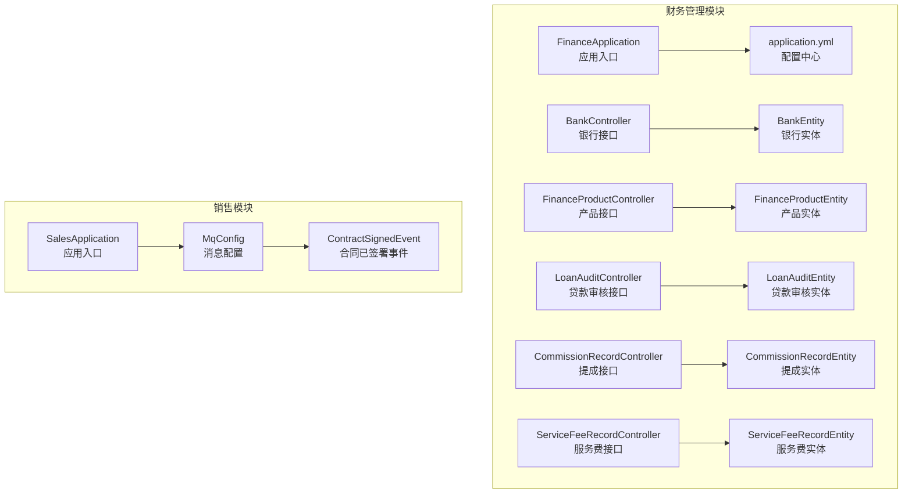
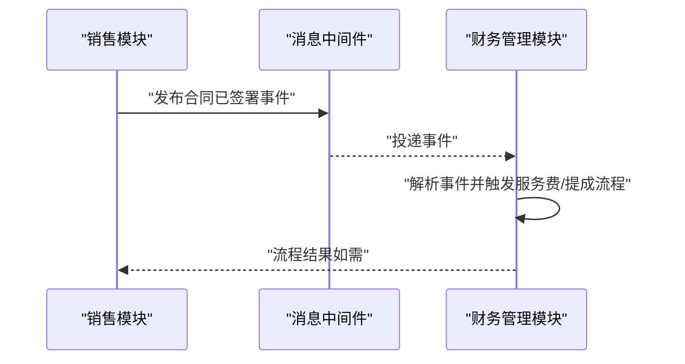
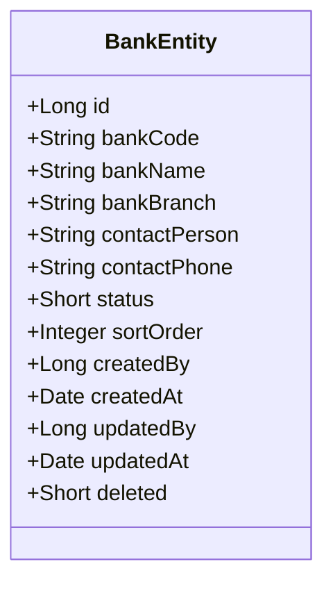
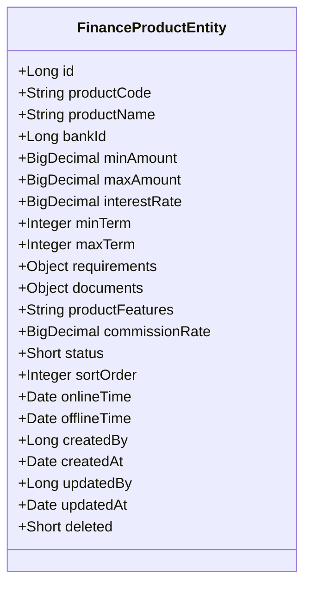
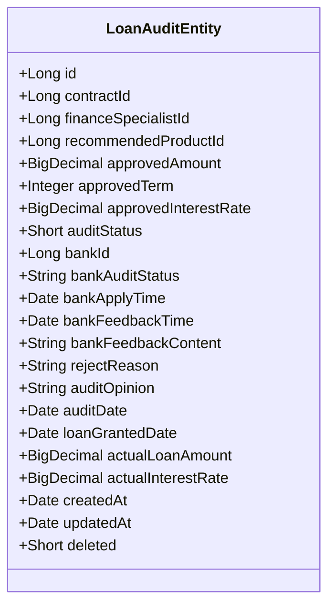
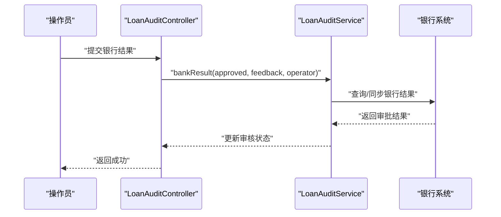
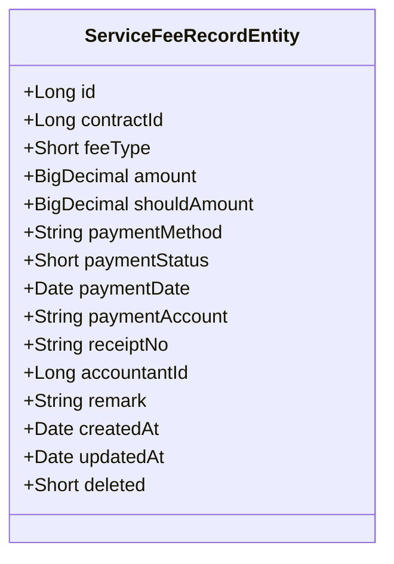
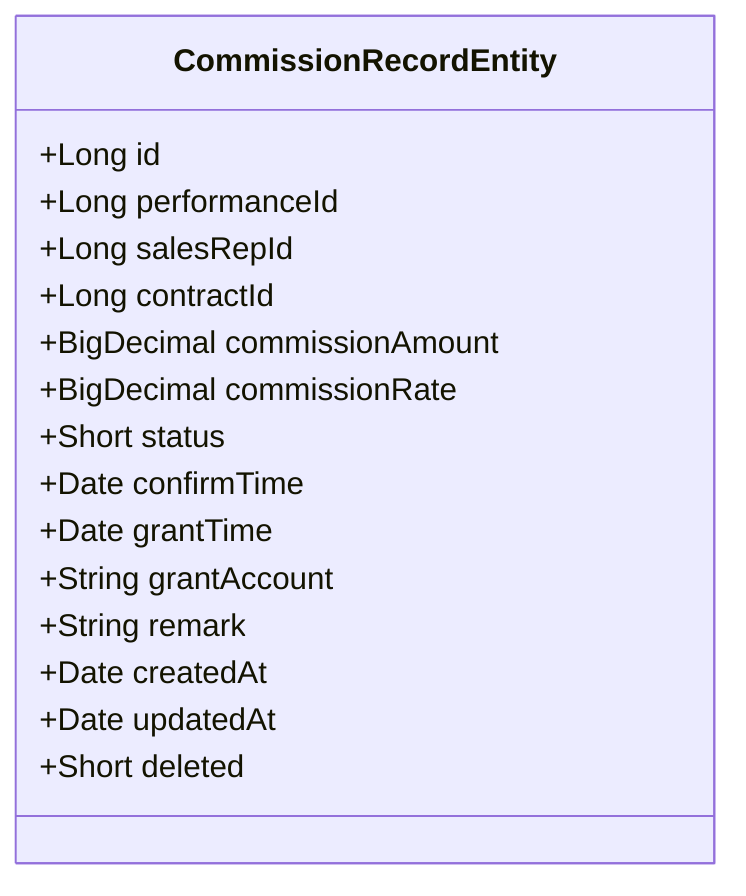
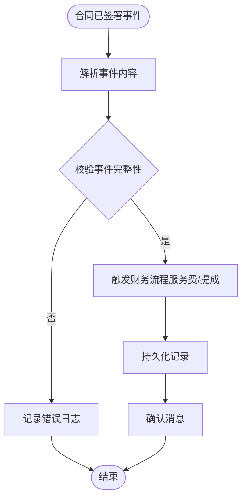
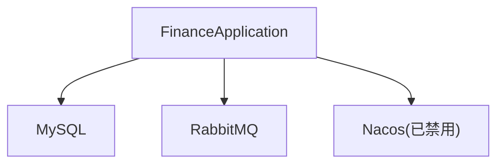

# 财务管理模块

<cite>
**本文引用的文件**
- [FinanceApplication.java](file://finance/src/main/java/com/dafuweng/finance/FinanceApplication.java)
- [application.yml](file://finance/src/main/resources/application.yml)
- [BankController.java](file://finance/src/main/java/com/dafuweng/finance/controller/BankController.java)
- [FinanceProductController.java](file://finance/src/main/java/com/dafuweng/finance/controller/FinanceProductController.java)
- [LoanAuditController.java](file://finance/src/main/java/com/dafuweng/finance/controller/LoanAuditController.java)
- [CommissionRecordController.java](file://finance/src/main/java/com/dafuweng/finance/controller/CommissionRecordController.java)
- [ServiceFeeRecordController.java](file://finance/src/main/java/com/dafuweng/finance/controller/ServiceFeeRecordController.java)
- [BankEntity.java](file://finance/src/main/java/com/dafuweng/finance/entity/BankEntity.java)
- [FinanceProductEntity.java](file://finance/src/main/java/com/dafuweng/finance/entity/FinanceProductEntity.java)
- [LoanAuditEntity.java](file://finance/src/main/java/com/dafuweng/finance/entity/LoanAuditEntity.java)
- [CommissionRecordEntity.java](file://finance/src/main/java/com/dafuweng/finance/entity/CommissionRecordEntity.java)
- [ServiceFeeRecordEntity.java](file://finance/src/main/java/com/dafuweng/finance/entity/ServiceFeeRecordEntity.java)
- [MqConfig.java](file://common/src/main/java/com/dafuweng/common/mq/MqConfig.java)
- [ContractSignedEvent.java](file://common/src/main/java/com/dafuweng/common/mq/event/ContractSignedEvent.java)
- [SalesApplication.java](file://sales/src/main/java/com/dafuweng/sales/SalesApplication.java)
</cite>

## 目录
1. [简介](#简介)
2. [项目结构](#项目结构)
3. [核心组件](#核心组件)
4. [架构总览](#架构总览)
5. [详细组件分析](#详细组件分析)
6. [依赖分析](#依赖分析)
7. [性能考虑](#性能考虑)
8. [故障排查指南](#故障排查指南)
9. [结论](#结论)
10. [附录](#附录)

## 简介
本文件为财务管理模块的功能文档，覆盖以下业务域：
- 银行合作管理：银行信息维护、账户管理、资金划转与对账机制
- 金融产品配置管理：产品类型定义、利率计算、风险评估与产品上线流程
- 贷款审核流程管理：审核标准、审批权限、审核记录与风险控制
- 服务费管理：费用计算、收费规则、发票管理与收入确认
- 提成管理：提成规则配置、计算公式、发放周期与税务处理
- 财务流程与API接口：统一REST接口规范与调用说明
- 与销售模块的集成：基于消息队列的事件驱动数据同步策略

## 项目结构
财务管理模块采用微服务分层架构，核心由控制器层、服务层、数据访问层与实体模型组成，并通过消息中间件与销售模块进行异步解耦集成。

图表来源
- [FinanceApplication.java:1-20](file://finance/src/main/java/com/dafuweng/finance/FinanceApplication.java#L1-L20)
- [application.yml:1-32](file://finance/src/main/resources/application.yml#L1-L32)
- [BankController.java:1-51](file://finance/src/main/java/com/dafuweng/finance/controller/BankController.java#L1-L51)
- [FinanceProductController.java:1-56](file://finance/src/main/java/com/dafuweng/finance/controller/FinanceProductController.java#L1-L56)
- [LoanAuditController.java:1-143](file://finance/src/main/java/com/dafuweng/finance/controller/LoanAuditController.java#L1-L143)
- [CommissionRecordController.java:1-64](file://finance/src/main/java/com/dafuweng/finance/controller/CommissionRecordController.java#L1-L64)
- [ServiceFeeRecordController.java:1-64](file://finance/src/main/java/com/dafuweng/finance/controller/ServiceFeeRecordController.java#L1-L64)
- [BankEntity.java:1-45](file://finance/src/main/java/com/dafuweng/finance/entity/BankEntity.java#L1-L45)
- [FinanceProductEntity.java:1-68](file://finance/src/main/java/com/dafuweng/finance/entity/FinanceProductEntity.java#L1-L68)
- [LoanAuditEntity.java:1-64](file://finance/src/main/java/com/dafuweng/finance/entity/LoanAuditEntity.java#L1-L64)
- [CommissionRecordEntity.java:1-48](file://finance/src/main/java/com/dafuweng/finance/entity/CommissionRecordEntity.java#L1-L48)
- [ServiceFeeRecordEntity.java:1-50](file://finance/src/main/java/com/dafuweng/finance/entity/ServiceFeeRecordEntity.java#L1-L50)
- [MqConfig.java:1-50](file://common/src/main/java/com/dafuweng/common/mq/MqConfig.java#L1-L50)
- [ContractSignedEvent.java:1-21](file://common/src/main/java/com/dafuweng/common/mq/event/ContractSignedEvent.java#L1-L21)
- [SalesApplication.java:1-17](file://sales/src/main/java/com/dafuweng/sales/SalesApplication.java#L1-L17)

章节来源
- [FinanceApplication.java:1-20](file://finance/src/main/java/com/dafuweng/finance/FinanceApplication.java#L1-L20)
- [application.yml:1-32](file://finance/src/main/resources/application.yml#L1-L32)

## 核心组件
- 应用启动与扫描
  - 扫描基础包、MyBatis Mapper、OpenFeign客户端、RabbitMQ启用与Nacos发现（在配置中可关闭）
- 数据源与MyBatis配置
  - MySQL连接、驼峰映射、逻辑删除字段、日志输出
- 控制器层
  - 银行管理、金融产品、贷款审核、提成记录、服务费记录的REST接口
- 实体层
  - 银行、金融产品、贷款审核、提成记录、服务费记录的数据模型
- 消息配置
  - 销售模块发布“合同已签署”事件，财务侧订阅并触发后续流程

章节来源
- [FinanceApplication.java:10-14](file://finance/src/main/java/com/dafuweng/finance/FinanceApplication.java#L10-L14)
- [application.yml:4-27](file://finance/src/main/resources/application.yml#L4-L27)
- [MqConfig.java:14-48](file://common/src/main/java/com/dafuweng/common/mq/MqConfig.java#L14-L48)

## 架构总览
财务管理模块通过消息中间件与销售模块解耦，销售模块在合同签署后发布事件，财务模块消费事件并执行服务费与提成等流程；同时提供独立的REST接口用于银行、产品、贷款审核与财务记录的管理。

图表来源
- [MqConfig.java:14-48](file://common/src/main/java/com/dafuweng/common/mq/MqConfig.java#L14-L48)
- [ContractSignedEvent.java:10-20](file://common/src/main/java/com/dafuweng/common/mq/event/ContractSignedEvent.java#L10-L20)
- [SalesApplication.java:1-17](file://sales/src/main/java/com/dafuweng/sales/SalesApplication.java#L1-L17)

## 详细组件分析

### 银行合作管理
- 功能范围
  - 银行信息维护：新增、更新、删除、分页查询、按状态筛选
  - 账户管理：与银行关联的账户信息（实体包含银行名称、分支、联系人、电话等）
  - 资金划转与对账：通过贷款审核与服务费记录实现资金流转与核对
- 接口概览
  - GET /api/bank/{id}：按ID查询
  - GET /api/bank/page：分页列表
  - GET /api/bank/listByStatus?status=...：按状态查询
  - POST /api/bank：保存
  - PUT /api/bank：更新
  - DELETE /api/bank/{id}：删除
- 数据模型
  - 银行实体包含编码、名称、分支、联系人、电话、状态、排序、创建/更新时间与逻辑删除字段

图表来源
- [BankEntity.java:11-44](file://finance/src/main/java/com/dafuweng/finance/entity/BankEntity.java#L11-L44)

章节来源
- [BankController.java:1-51](file://finance/src/main/java/com/dafuweng/finance/controller/BankController.java#L1-L51)
- [BankEntity.java:1-45](file://finance/src/main/java/com/dafuweng/finance/entity/BankEntity.java#L1-L45)

### 金融产品配置管理
- 功能范围
  - 产品类型定义：产品编码、名称、所属银行、金额区间、期限区间、特性描述
  - 利率计算：支持固定/浮动参数（以实体中的利率字段体现）
  - 风险评估：通过requirements字段存储JSON结构的风险要素
  - 文档管理：通过documents字段存储所需材料清单
  - 上线/下线：onlineTime/offlineTime与status控制生命周期
- 接口概览
  - GET /api/financeProduct/{id}：按ID查询
  - GET /api/financeProduct/page：分页列表
  - GET /api/financeProduct/listByBankId/{bankId}：按银行查询
  - GET /api/financeProduct/listByStatus?status=...：按状态查询
  - POST /api/financeProduct：保存
  - PUT /api/financeProduct：更新
  - DELETE /api/financeProduct/{id}：删除
- 数据模型
  - 产品实体包含最小/最大金额、利率、最小/最大期限、需求与文档JSON、佣金比例、状态、排序、上下线时间与逻辑删除字段

图表来源
- [FinanceProductEntity.java:14-67](file://finance/src/main/java/com/dafuweng/finance/entity/FinanceProductEntity.java#L14-L67)

章节来源
- [FinanceProductController.java:1-56](file://finance/src/main/java/com/dafuweng/finance/controller/FinanceProductController.java#L1-L56)
- [FinanceProductEntity.java:1-68](file://finance/src/main/java/com/dafuweng/finance/entity/FinanceProductEntity.java#L1-L68)

### 贷款审核流程管理
- 流程阶段
  - 接收：接收任务并登记操作员信息
  - 复审：复审并登记意见
  - 提交银行：提交至银行并登记操作员信息
  - 银行结果：银行反馈审批结果与意见
  - 审批/拒绝：最终审批或拒绝，并登记实际放款金额、利率与放款日期
- 关键接口
  - 基础CRUD：GET/POST/PUT/DELETE
  - 流程动作：
    - POST /api/loanAudit/{id}/receive
    - POST /api/loanAudit/{id}/review
    - POST /api/loanAudit/{id}/submit-bank
    - POST /api/loanAudit/{id}/bank-result
    - POST /api/loanAudit/{id}/approve（含实际放款金额、利率、放款日期）
    - POST /api/loanAudit/{id}/reject
- 数据模型
  - 审核实体包含合同ID、财务专员ID、推荐产品、审批金额/期限/利率、银行相关信息、审核状态、意见、放款日期与逻辑删除字段

图表来源
- [LoanAuditEntity.java:12-63](file://finance/src/main/java/com/dafuweng/finance/entity/LoanAuditEntity.java#L12-L63)

图表来源
- [LoanAuditController.java:96-108](file://finance/src/main/java/com/dafuweng/finance/controller/LoanAuditController.java#L96-L108)

章节来源
- [LoanAuditController.java:1-143](file://finance/src/main/java/com/dafuweng/finance/controller/LoanAuditController.java#L1-L143)
- [LoanAuditEntity.java:1-64](file://finance/src/main/java/com/dafuweng/finance/entity/LoanAuditEntity.java#L1-L64)

### 服务费管理机制
- 功能范围
  - 费用计算：根据合同金额与费率计算应收费用
  - 收费规则：feeType区分费用类型，amount/shouldAmount区分实收与应收
  - 发票管理：paymentMethod、paymentAccount、receiptNo记录支付信息
  - 收入确认：accountantId与paymentStatus用于财务入账确认
- 关键接口
  - GET /api/serviceFeeRecord/{id}：按ID查询
  - GET /api/serviceFeeRecord/page：分页列表
  - GET /api/serviceFeeRecord/listByContractId/{contractId}：按合同查询
  - POST /api/serviceFeeRecord：保存
  - PUT /api/serviceFeeRecord：更新
  - DELETE /api/serviceFeeRecord/{id}：删除
  - PUT /api/serviceFeeRecord/{id}/pay：确认付款（登记支付方式、账户、凭证号、备注）
- 数据模型
  - 服务费记录实体包含合同ID、费用类型、金额、应付金额、支付状态、支付时间、会计ID与逻辑删除字段

图表来源
- [ServiceFeeRecordEntity.java:12-49](file://finance/src/main/java/com/dafuweng/finance/entity/ServiceFeeRecordEntity.java#L12-L49)

章节来源
- [ServiceFeeRecordController.java:1-64](file://finance/src/main/java/com/dafuweng/finance/controller/ServiceFeeRecordController.java#L1-L64)
- [ServiceFeeRecordEntity.java:1-50](file://finance/src/main/java/com/dafuweng/finance/entity/ServiceFeeRecordEntity.java#L1-L50)

### 提成管理功能
- 功能范围
  - 提成规则配置：commissionRate与产品佣金比例联动
  - 计算公式：commissionAmount = 合同金额 × 提成比例
  - 发放周期：按周期生成提成记录并支持确认与发放
  - 税务处理：通过remark字段记录税务相关信息（建议在业务规则中明确）
- 关键接口
  - GET /api/commissionRecord/{id}：按ID查询
  - GET /api/commissionRecord/page：分页列表
  - GET /api/commissionRecord/listBySalesRepId/{salesRepId}：按销售代表查询
  - POST /api/commissionRecord：保存
  - PUT /api/commissionRecord：更新
  - DELETE /api/commissionRecord/{id}：删除
  - POST /api/commissionRecord/{id}/confirm：确认提成
  - POST /api/commissionRecord/{id}/grant：发放（登记发放账户与备注）
- 数据模型
  - 提成记录实体包含业绩ID、销售代表ID、合同ID、提成金额、提成比例、状态、确认/发放时间、发放账户与逻辑删除字段

图表来源
- [CommissionRecordEntity.java:12-47](file://finance/src/main/java/com/dafuweng/finance/entity/CommissionRecordEntity.java#L12-L47)

章节来源
- [CommissionRecordController.java:1-64](file://finance/src/main/java/com/dafuweng/finance/controller/CommissionRecordController.java#L1-L64)
- [CommissionRecordEntity.java:1-48](file://finance/src/main/java/com/dafuweng/finance/entity/CommissionRecordEntity.java#L1-L48)

### 与销售模块的集成机制与数据同步策略
- 集成方式
  - 事件驱动：销售模块在合同签署后发布“合同已签署”事件
  - 消费事件：财务模块订阅事件并触发服务费与提成流程
- 数据同步策略
  - 异步解耦：通过消息队列实现跨模块数据同步，避免强耦合
  - 幂等性：建议在消费端实现幂等处理，防止重复处理同一事件
  - 可观测性：结合日志与监控，追踪事件从发布到消费的全链路

图表来源
- [ContractSignedEvent.java:10-20](file://common/src/main/java/com/dafuweng/common/mq/event/ContractSignedEvent.java#L10-L20)
- [MqConfig.java:14-48](file://common/src/main/java/com/dafuweng/common/mq/MqConfig.java#L14-L48)

章节来源
- [MqConfig.java:1-50](file://common/src/main/java/com/dafuweng/common/mq/MqConfig.java#L1-L50)
- [ContractSignedEvent.java:1-21](file://common/src/main/java/com/dafuweng/common/mq/event/ContractSignedEvent.java#L1-L21)
- [SalesApplication.java:1-17](file://sales/src/main/java/com/dafuweng/sales/SalesApplication.java#L1-L17)

## 依赖分析
- 组件内聚与耦合
  - 控制器层仅负责请求转发与响应封装，业务逻辑集中在服务层，DAO层负责数据访问，实体层承载数据模型，符合分层架构
- 外部依赖
  - 数据库：MySQL（通过JDBC驱动）
  - 配置中心：Nacos（当前配置中已禁用）
  - 消息中间件：RabbitMQ（通过@EnableRabbit启用）
  - 服务发现：Nacos（当前配置中已禁用）

图表来源
- [FinanceApplication.java:10-14](file://finance/src/main/java/com/dafuweng/finance/FinanceApplication.java#L10-L14)
- [application.yml:12-15](file://finance/src/main/resources/application.yml#L12-L15)

章节来源
- [FinanceApplication.java:1-20](file://finance/src/main/java/com/dafuweng/finance/FinanceApplication.java#L1-L20)
- [application.yml:1-32](file://finance/src/main/resources/application.yml#L1-L32)

## 性能考虑
- 数据访问优化
  - 使用MyBatis Plus分页查询与条件构造器，避免一次性加载大结果集
  - 对高频查询字段建立索引（如合同ID、银行ID、状态等）
- 缓存策略
  - 对银行与产品配置类数据进行缓存，降低数据库压力
- 异步处理
  - 服务费与提成计算可异步化，减少主流程阻塞
- 日志与监控
  - 开启SQL日志与关键流程日志，便于性能分析与问题定位

## 故障排查指南
- 常见问题
  - 数据库连接失败：检查datasource配置与网络连通性
  - 消息未消费：检查交换机、队列、路由键绑定是否正确
  - 逻辑删除误删：确认deleted字段值与查询条件
- 排查步骤
  - 查看应用日志与数据库日志
  - 核对事件发布与消费链路
  - 验证实体字段与数据库表结构一致性

章节来源
- [application.yml:7-11](file://finance/src/main/resources/application.yml#L7-L11)
- [MqConfig.java:21-48](file://common/src/main/java/com/dafuweng/common/mq/MqConfig.java#L21-L48)

## 结论
财务管理模块围绕银行、产品、贷款审核、服务费与提成五大领域构建了完整的财务管理体系，并通过消息中间件与销售模块实现松耦合集成。建议在生产环境中进一步完善幂等性、缓存与监控体系，确保高并发场景下的稳定性与一致性。

## 附录
- API接口清单（按模块）
  - 银行管理：GET/POST/PUT/DELETE /api/bank/*
  - 金融产品：GET/POST/PUT/DELETE /api/financeProduct/*
  - 贷款审核：GET/POST/PUT/DELETE /api/loanAudit/*（含多阶段动作）
  - 服务费记录：GET/POST/PUT/DELETE /api/serviceFeeRecord/*（含支付确认）
  - 提成记录：GET/POST/PUT/DELETE /api/commissionRecord/*（含确认与发放）
- 数据模型一览
  - 银行：BankEntity
  - 产品：FinanceProductEntity
  - 贷款审核：LoanAuditEntity
  - 服务费：ServiceFeeRecordEntity
  - 提成：CommissionRecordEntity